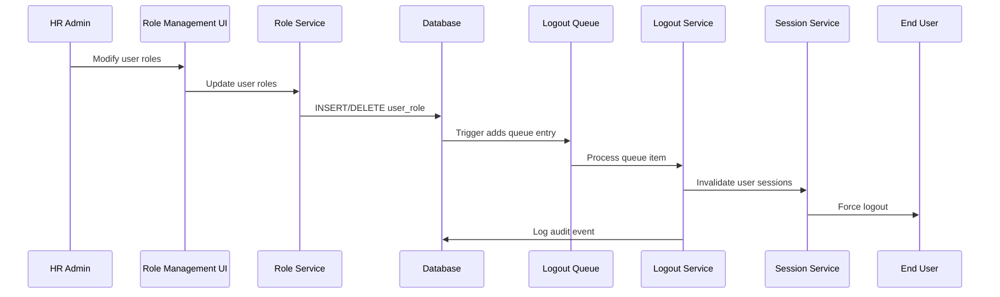
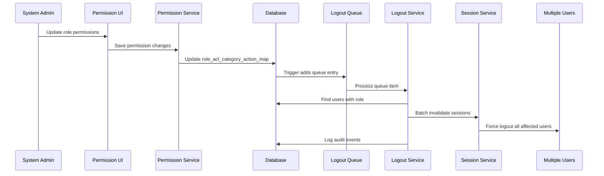

# ROLE-PERMISSION-LOGOUT Integration Guide

## Dependencies
Modules this module depends on:

### **Auth Service** 
- **What it provides:** JWT token management, user authentication, session handling
- **How we use it:** Extend existing authentication infrastructure with logout triggers
- **Integration points:** Session invalidation, token blacklisting, user lookup
- **Data flow:** Leverage existing JWT validation pipeline and add blacklist checks

### **User Management System**
- **What it provides:** User entities, role mappings, permission structures  
- **How we use it:** Monitor changes to user roles and role permissions
- **Integration points:** UserRole entity changes, RoleAclCategoryActionMap modifications
- **Data flow:** Database triggers capture changes and queue logout events

### **Database Layer (PostgreSQL)**
- **What it provides:** Persistent storage, transaction management, trigger capabilities
- **How we use it:** Store session data, audit logs, and trigger queues
- **Integration points:** Database triggers, session tables, audit tables
- **Data flow:** Triggers capture changes → Queue processing → Session invalidation

### **Cache Service (Redis)**  
- **What it provides:** High-performance caching and temporary data storage
- **How we use it:** JWT token blacklisting, session caching, performance optimization
- **Integration points:** Token blacklist storage, cache invalidation
- **Data flow:** Invalidated tokens stored in Redis with expiration times

## Dependents
Modules that depend on this module:

### **Role Management UI**
- **What we provide:** Automatic logout functionality when roles are modified
- **How they use it:** Transparent logout behavior during role administration
- **APIs exposed:** Force logout endpoints, session management APIs
- **Events published:** Role change events, logout completion events

### **Permission Management UI**
- **What we provide:** Automatic logout when role permissions are updated
- **How they use it:** Mass logout capabilities for permission changes
- **APIs exposed:** Permission change logout triggers, audit query endpoints  
- **Events published:** Permission change events, batch logout events

### **Security Monitoring Systems**
- **What we provide:** Comprehensive audit trail of forced logout events
- **How they use it:** Security analysis, compliance reporting, incident investigation
- **APIs exposed:** Audit log queries, security event endpoints
- **Events published:** Security events for all forced logouts

### **User Support Systems**
- **What we provide:** Logout event data for troubleshooting user issues  
- **How they use it:** Investigate unexpected logout complaints, provide user explanations
- **APIs exposed:** User-specific logout history, session information
- **Events published:** User logout events with detailed context

## Integration Points

### APIs

#### Logout Management Endpoints
```typescript
// Force logout specific users
POST /auth/logout/force
Headers: Authorization: Bearer <admin_token>
Body: {
  userIds: number[];
  reason: string;
  triggerDetails?: any;
}

// Get active sessions for a user
GET /auth/sessions/active?userId={userId}
Headers: Authorization: Bearer <admin_token>

// Invalidate specific session
DELETE /auth/sessions/{sessionId}
Headers: Authorization: Bearer <admin_token>
```

#### Audit and Monitoring Endpoints
```typescript
// Query logout audit events
GET /audit/logout-events?userId={userId}&startDate={date}&endDate={date}
Headers: Authorization: Bearer <admin_token>

// Get logout statistics
GET /admin/logout-stats?period={period}
Headers: Authorization: Bearer <admin_token>

// Health check for logout system
GET /health/logout-system
```

#### Authentication Integration
```typescript
// JWT validation (updated to check blacklist)
// This endpoint behavior is modified, not new
POST /auth/validate-token
Headers: Authorization: Bearer <token>
Response: {
  valid: boolean;
  reason?: 'blacklisted' | 'expired' | 'invalid';
}
```

### Events

#### Published Events
```typescript
// User logout triggered
interface UserLogoutEvent {
  eventType: 'USER_LOGOUT_TRIGGERED';
  userId: number;
  triggerType: 'ROLE_CHANGE' | 'PERMISSION_CHANGE';
  triggerDetails: any;
  sessionCount: number;
  timestamp: Date;
}

// Bulk logout completed  
interface BulkLogoutEvent {
  eventType: 'BULK_LOGOUT_COMPLETED';
  affectedUsers: number[];
  triggerType: 'PERMISSION_CHANGE';
  successCount: number;
  failureCount: number;
  timestamp: Date;
}

// Logout system health
interface LogoutHealthEvent {
  eventType: 'LOGOUT_SYSTEM_HEALTH';
  queueDepth: number;
  processingRate: number;
  errorRate: number;
  timestamp: Date;
}
```

#### Subscribed Events
```typescript
// User role change events (from Role Management)
interface RoleChangeEvent {
  eventType: 'USER_ROLE_CHANGED';
  userId: number;
  oldRoles: number[];
  newRoles: number[];
  changedBy: number;
  timestamp: Date;
}

// Role permission change events (from Permission Management)
interface PermissionChangeEvent {
  eventType: 'ROLE_PERMISSION_CHANGED';
  roleId: number;
  addedPermissions: number[];
  removedPermissions: number[];
  changedBy: number;
  timestamp: Date;
}
```

### Data Flow

#### Role Change Flow


#### Permission Change Flow  


## Testing Integration

### Unit Tests  
```typescript
// Mock dependencies for isolated testing
describe('LogoutTriggerService', () => {
  let service: LogoutTriggerService;
  let mockSessionService: jest.Mocked<SessionInvalidatorService>;
  let mockAuditService: jest.Mocked<AuditService>;

  beforeEach(() => {
    const module = Test.createTestingModule({
      providers: [
        LogoutTriggerService,
        { provide: SessionInvalidatorService, useValue: mockSessionService },
        { provide: AuditService, useValue: mockAuditService },
      ],
    }).compile();
  });
});
```

### Integration Tests
```typescript
// Test cross-service integration
describe('Role Change Integration', () => {
  it('should logout user when role is added', async () => {
    // 1. Create test user with initial role
    // 2. Add new role via Role Service
    // 3. Verify logout trigger fired
    // 4. Verify user session invalidated
    // 5. Verify audit log created
  });

  it('should logout multiple users when permissions change', async () => {
    // 1. Create multiple test users with same role
    // 2. Update role permissions
    // 3. Verify all users logged out  
    // 4. Verify batch audit logs created
  });
});
```

### End-to-End Tests  
```typescript
// Test complete user workflow
describe('Logout User Experience', () => {
  it('should handle graceful logout during active session', async () => {
    // 1. User logs in and starts activity
    // 2. Admin changes user role
    // 3. User gets logged out on next request
    // 4. User re-login works with new permissions
  });
});
```

## Deployment Considerations

### Environment Variables
```bash
# Logout system configuration
LOGOUT_QUEUE_PROCESSING_INTERVAL=10000  # milliseconds
LOGOUT_MAX_RETRY_ATTEMPTS=3
LOGOUT_RETRY_DELAY=5000  # milliseconds

# Redis configuration for token blacklisting
REDIS_BLACKLIST_PREFIX=logout:blacklist:
REDIS_BLACKLIST_DEFAULT_TTL=86400  # 24 hours

# Database configuration
DB_LOGOUT_BATCH_SIZE=100
DB_LOGOUT_TIMEOUT=30000  # milliseconds

# Monitoring configuration  
LOGOUT_METRICS_ENABLED=true
LOGOUT_HEALTH_CHECK_INTERVAL=60000  # milliseconds
```

### Database Migrations
```sql
-- Required database changes in order
1. CreateUserSessionsTable.ts
2. CreateLogoutAuditTable.ts  
3. CreateLogoutTriggerQueue.ts
4. AddUserLogoutColumns.ts
5. CreateUserRoleTriggers.ts
6. CreateRolePermissionTriggers.ts
```

### Service Dependencies
```yaml
# Services that must be running before logout system
dependencies:
  - auth-service (core JWT functionality)
  - redis (for token blacklisting)
  - postgresql (for session and audit storage)
  
# Optional dependencies  
optional:
  - monitoring-service (for metrics collection)
  - notification-service (for future user notifications)
```

## Monitoring and Troubleshooting

### Key Metrics to Monitor
```typescript
interface LogoutSystemMetrics {
  // Performance metrics
  avgLogoutProcessingTime: number;  // milliseconds
  queueDepth: number;               // items
  queueProcessingRate: number;      // items/second
  
  // Success metrics  
  logoutSuccessRate: number;        // percentage
  sessionInvalidationRate: number;  // percentage
  auditLogCompletionRate: number;   // percentage
  
  // Error metrics
  logoutFailureRate: number;        // percentage  
  queueProcessingErrors: number;    // count/hour
  databaseConnectionErrors: number; // count/hour
}
```

### Common Integration Issues

#### Issue 1: Logout Triggers Not Firing
**Symptoms:** Role changes don't cause logout  
**Causes:** Database triggers not installed, queue processor not running
**Solution:** Check trigger installation, verify queue processor status

#### Issue 2: High Logout Processing Delays  
**Symptoms:** Users not logged out promptly after role changes
**Causes:** Queue backlog, database performance issues  
**Solution:** Scale queue processing, optimize database queries

#### Issue 3: JWT Blacklist Performance Issues
**Symptoms:** Slow authentication responses  
**Causes:** Redis performance, network latency
**Solution:** Redis clustering, connection pooling optimization

### Debugging Integration Flow

#### Step 1: Verify Role Change Detection
```sql
-- Check if triggers are creating queue entries
SELECT * FROM logout_trigger_queue 
WHERE processed = false 
ORDER BY created_at DESC 
LIMIT 10;
```

#### Step 2: Check Queue Processing  
```typescript
// Monitor queue processor logs
logs.filter(log => 
  log.service === 'LogoutQueueProcessor' && 
  log.level === 'INFO'
);
```

#### Step 3: Verify Session Invalidation
```sql
-- Check session invalidation
SELECT user_id, invalidated_at, invalidation_reason 
FROM user_sessions 
WHERE invalidated_at > NOW() - INTERVAL '1 hour';
```

#### Step 4: Confirm JWT Blacklisting
```bash
# Check Redis blacklist entries  
redis-cli KEYS "logout:blacklist:*" | head -10
```

## Security Considerations

### Data Security
- All logout events are audited with immutable logs
- Session tokens are securely invalidated and blacklisted  
- User data is not exposed in logout processes
- Audit logs contain only necessary information for compliance

### Access Control  
- Only authorized administrators can trigger manual logouts
- Audit log access is restricted to security personnel
- System accounts have minimal required permissions
- All API endpoints require proper authentication

### Network Security
- All internal service communication uses HTTPS
- Database connections are encrypted
- Redis connections use authentication
- API endpoints follow security best practices

## Future Integration Possibilities

### Phase 2 Enhancements
- **Real-time Notifications:** WebSocket integration for user logout notifications
- **Mobile App Integration:** Push notifications for mobile logout events  
- **Advanced Session Management:** Selective device logout capabilities
- **External Security Integration:** SIEM system integration for security events

### Phase 3 Extensions
- **Approval Workflows:** Role change approval with temporary permissions
- **Scheduled Logouts:** Batch processing with scheduled execution times
- **Analytics Integration:** Advanced reporting and analytics capabilities  
- **Multi-tenant Support:** Organization-specific logout policies