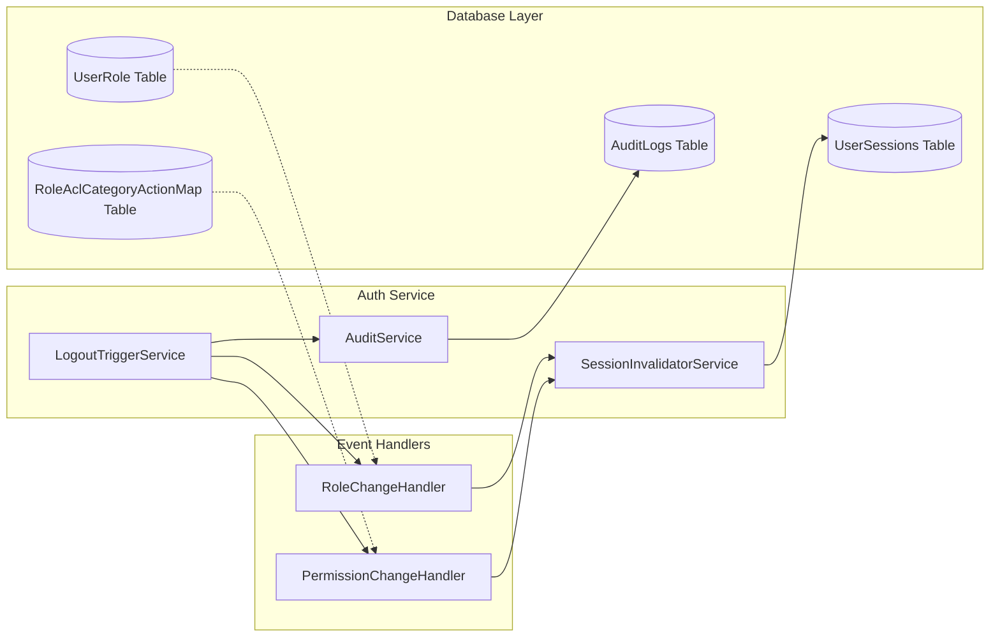

# Role Permission Logout - Phase 1 Technical Specification

## Overview

### Technical Vision
Implement a robust logout trigger system that monitors role and permission changes through database triggers and event handlers, automatically invalidating user sessions when security-relevant modifications occur.

### Architecture Approach
- **Event-Driven Architecture:** Database triggers and application-level event handlers
- **Immediate Invalidation:** Direct session termination without complex queuing
- **Audit Integration:** Comprehensive logging of all logout events
- **Performance Optimized:** Minimal impact on existing operations

## System Architecture

### High-Level Architecture

```mermaid
graph TB
    subgraph "Role Management"
        A[HR Admin Interface] --> B[Role Service]
        C[System Admin Interface] --> D[Permission Service]
    end
    
    subgraph "Logout Trigger System"
        B --> E[Role Change Handler]
        D --> F[Permission Change Handler]
        E --> G[Logout Service]
        F --> G[Logout Service]
    end
    
    subgraph "Session Management"
        G --> H[Session Invalidator]
        H --> I[JWT Token Manager]
        H --> J[Database Session Store]
    end
    
    subgraph "User Sessions"
        K[Web App Sessions]
        L[Mobile App Sessions]
        M[API Sessions]
    end
    
    I --> K
    I --> L
    I --> M
    
    subgraph "Audit System"
        G --> N[Audit Logger]
        N --> O[Security Logs]
    end
```



### Component Architecture



## Database Design

### New Tables

#### user_sessions
```sql
CREATE TABLE user_sessions (
    id SERIAL PRIMARY KEY,
    user_id INTEGER NOT NULL REFERENCES users(id),
    session_token VARCHAR(255) NOT NULL UNIQUE,
    device_info JSONB,
    ip_address INET,
    created_at TIMESTAMPTZ DEFAULT CURRENT_TIMESTAMP,
    last_accessed_at TIMESTAMPTZ DEFAULT CURRENT_TIMESTAMP,
    expires_at TIMESTAMPTZ NOT NULL,
    is_active BOOLEAN DEFAULT true,
    invalidated_at TIMESTAMPTZ,
    invalidation_reason VARCHAR(100),
    CONSTRAINT fk_user_sessions_user FOREIGN KEY (user_id) REFERENCES users(id) ON DELETE CASCADE
);

CREATE INDEX idx_user_sessions_user_id ON user_sessions(user_id);
CREATE INDEX idx_user_sessions_token ON user_sessions(session_token);
CREATE INDEX idx_user_sessions_active ON user_sessions(is_active) WHERE is_active = true;
```

#### logout_audit_logs
```sql
CREATE TABLE logout_audit_logs (
    id SERIAL PRIMARY KEY,
    user_id INTEGER NOT NULL REFERENCES users(id),
    trigger_type VARCHAR(50) NOT NULL, -- 'ROLE_CHANGE', 'PERMISSION_CHANGE'
    trigger_details JSONB NOT NULL,
    logout_timestamp TIMESTAMPTZ DEFAULT CURRENT_TIMESTAMP,
    session_count INTEGER DEFAULT 0,
    initiated_by INTEGER REFERENCES users(id),
    created_at TIMESTAMPTZ DEFAULT CURRENT_TIMESTAMP,
    CONSTRAINT fk_logout_audit_user FOREIGN KEY (user_id) REFERENCES users(id) ON DELETE CASCADE,
    CONSTRAINT fk_logout_audit_initiator FOREIGN KEY (initiated_by) REFERENCES users(id) ON DELETE SET NULL
);

CREATE INDEX idx_logout_audit_user_id ON logout_audit_logs(user_id);
CREATE INDEX idx_logout_audit_trigger_type ON logout_audit_logs(trigger_type);
CREATE INDEX idx_logout_audit_timestamp ON logout_audit_logs(logout_timestamp);
```

### Modified Tables

#### users (add session tracking)
```sql
ALTER TABLE users ADD COLUMN last_forced_logout_at TIMESTAMPTZ;
ALTER TABLE users ADD COLUMN force_logout_reason VARCHAR(100);
```

## API Design

### New Endpoints

#### Session Management
```typescript
// POST /auth/logout/force
interface ForceLogoutRequest {
    userIds: number[];
    reason: LogoutReason;
    triggerDetails?: any;
}

interface ForceLogoutResponse {
    success: boolean;
    loggedOutUsers: number[];
    failedUsers: number[];
    errors?: string[];
}

// GET /auth/sessions/active
interface ActiveSessionsResponse {
    sessions: UserSession[];
    totalCount: number;
}

// DELETE /auth/sessions/{sessionId}
interface InvalidateSessionResponse {
    success: boolean;
    message: string;
}
```

#### Audit Endpoints
```typescript
// GET /audit/logout-events
interface LogoutAuditQuery {
    userId?: number;
    triggerType?: LogoutTriggerType;
    startDate?: string;
    endDate?: string;
    page?: number;
    limit?: number;
}

interface LogoutAuditResponse {
    events: LogoutAuditEvent[];
    pagination: PaginationInfo;
}
```

## Service Implementation

### LogoutTriggerService

```typescript
@Injectable()
export class LogoutTriggerService {
    constructor(
        private sessionInvalidator: SessionInvalidatorService,
        private auditService: AuditService,
        private userRepository: UserRepository,
        private logger: Logger
    ) {}

    async handleRoleChange(userId: number, changes: RoleChangeEvent): Promise<void> {
        const logoutReason = this.determineLogoutReason(changes);
        await this.executeLogout([userId], LogoutTriggerType.ROLE_CHANGE, changes);
    }

    async handlePermissionChange(roleId: number, changes: PermissionChangeEvent): Promise<void> {
        const affectedUsers = await this.getUsersByRole(roleId);
        await this.executeLogout(
            affectedUsers.map(u => u.userId), 
            LogoutTriggerType.PERMISSION_CHANGE, 
            changes
        );
    }

    private async executeLogout(
        userIds: number[], 
        triggerType: LogoutTriggerType, 
        triggerDetails: any
    ): Promise<void> {
        try {
            // Invalidate all sessions for affected users
            const results = await this.sessionInvalidator.invalidateUserSessions(
                userIds, 
                triggerType
            );

            // Log audit events
            await this.auditService.logForcedLogouts(
                userIds, 
                triggerType, 
                triggerDetails, 
                results
            );

            this.logger.log(`Successfully logged out ${userIds.length} users due to ${triggerType}`);
        } catch (error) {
            this.logger.error(`Failed to execute logout for users: ${userIds}`, error);
            throw new InternalServerErrorException('Logout trigger failed');
        }
    }
}
```

### SessionInvalidatorService

```typescript
@Injectable()
export class SessionInvalidatorService {
    constructor(
        @InjectRepository(UserSession)
        private sessionRepository: Repository<UserSession>,
        private jwtService: JwtService,
        private cacheService: CacheService
    ) {}

    async invalidateUserSessions(
        userIds: number[], 
        reason: LogoutTriggerType
    ): Promise<SessionInvalidationResult[]> {
        const results: SessionInvalidationResult[] = [];

        for (const userId of userIds) {
            try {
                // Get active sessions
                const activeSessions = await this.getActiveSessions(userId);
                
                // Invalidate database sessions
                await this.sessionRepository.update(
                    { userId, isActive: true },
                    { 
                        isActive: false, 
                        invalidatedAt: new Date(),
                        invalidationReason: reason 
                    }
                );

                // Invalidate JWT tokens (add to blacklist)
                for (const session of activeSessions) {
                    await this.blacklistToken(session.sessionToken);
                }

                // Clear user cache
                await this.cacheService.clearUserCache(userId);

                results.push({
                    userId,
                    success: true,
                    sessionCount: activeSessions.length
                });

            } catch (error) {
                this.logger.error(`Failed to invalidate sessions for user ${userId}`, error);
                results.push({
                    userId,
                    success: false,
                    error: error.message
                });
            }
        }

        return results;
    }

    private async blacklistToken(token: string): Promise<void> {
        // Add token to Redis blacklist with expiration
        const expiration = this.jwtService.getTokenExpiration(token);
        await this.cacheService.set(
            `blacklist:${token}`, 
            'invalid', 
            expiration
        );
    }
}
```

## Event Handlers

### Database Triggers

#### UserRole Change Trigger
```sql
-- Function to handle user role changes
CREATE OR REPLACE FUNCTION trigger_user_role_logout()
RETURNS TRIGGER AS $$
BEGIN
    -- Insert into a queue table for processing
    IF TG_OP = 'INSERT' THEN
        INSERT INTO logout_trigger_queue (user_id, trigger_type, trigger_data, created_at)
        VALUES (NEW.user_id, 'ROLE_ADDED', row_to_json(NEW), NOW());
        RETURN NEW;
    ELSIF TG_OP = 'DELETE' THEN
        INSERT INTO logout_trigger_queue (user_id, trigger_type, trigger_data, created_at)
        VALUES (OLD.user_id, 'ROLE_REMOVED', row_to_json(OLD), NOW());
        RETURN OLD;
    END IF;
    RETURN NULL;
END;
$$ LANGUAGE plpgsql;

-- Create triggers
CREATE TRIGGER user_role_insert_trigger
    AFTER INSERT ON user_role
    FOR EACH ROW EXECUTE FUNCTION trigger_user_role_logout();

CREATE TRIGGER user_role_delete_trigger
    AFTER DELETE ON user_role
    FOR EACH ROW EXECUTE FUNCTION trigger_user_role_logout();
```

#### Role Permission Change Trigger
```sql
-- Function to handle role permission changes
CREATE OR REPLACE FUNCTION trigger_role_permission_logout()
RETURNS TRIGGER AS $$
BEGIN
    IF TG_OP = 'INSERT' THEN
        INSERT INTO logout_trigger_queue (role_id, trigger_type, trigger_data, created_at)
        VALUES (NEW.role_id, 'PERMISSION_ADDED', row_to_json(NEW), NOW());
        RETURN NEW;
    ELSIF TG_OP = 'DELETE' THEN
        INSERT INTO logout_trigger_queue (role_id, trigger_type, trigger_data, created_at)
        VALUES (OLD.role_id, 'PERMISSION_REMOVED', row_to_json(OLD), NOW());
        RETURN OLD;
    END IF;
    RETURN NULL;
END;
$$ LANGUAGE plpgsql;

-- Create triggers
CREATE TRIGGER role_permission_insert_trigger
    AFTER INSERT ON role_acl_category_action_map
    FOR EACH ROW EXECUTE FUNCTION trigger_role_permission_logout();

CREATE TRIGGER role_permission_delete_trigger
    AFTER DELETE ON role_acl_category_action_map
    FOR EACH ROW EXECUTE FUNCTION trigger_role_permission_logout();
```

### Queue Processing Service

```typescript
@Injectable()
export class LogoutQueueProcessor {
    constructor(
        private logoutTriggerService: LogoutTriggerService,
        @InjectRepository(LogoutTriggerQueue)
        private queueRepository: Repository<LogoutTriggerQueue>
    ) {}

    @Cron('*/10 * * * * *') // Every 10 seconds
    async processLogoutQueue(): Promise<void> {
        const pendingTriggers = await this.queueRepository.find({
            where: { processed: false },
            order: { createdAt: 'ASC' },
            take: 100
        });

        for (const trigger of pendingTriggers) {
            try {
                await this.processTrigger(trigger);
                await this.markProcessed(trigger.id);
            } catch (error) {
                this.logger.error(`Failed to process logout trigger ${trigger.id}`, error);
                await this.markFailed(trigger.id, error.message);
            }
        }
    }

    private async processTrigger(trigger: LogoutTriggerQueue): Promise<void> {
        switch (trigger.triggerType) {
            case 'ROLE_ADDED':
            case 'ROLE_REMOVED':
                await this.logoutTriggerService.handleRoleChange(
                    trigger.userId, 
                    trigger.triggerData
                );
                break;
            case 'PERMISSION_ADDED':
            case 'PERMISSION_REMOVED':
                await this.logoutTriggerService.handlePermissionChange(
                    trigger.roleId, 
                    trigger.triggerData
                );
                break;
        }
    }
}
```

## Security Considerations

### JWT Token Management
1. **Blacklisting:** Invalidated tokens are added to Redis blacklist
2. **Expiration:** Blacklist entries expire with token expiration
3. **Validation:** All requests check blacklist before processing

### Session Security
1. **Encryption:** Session tokens are cryptographically secure
2. **Rotation:** Sessions are rotated on security-relevant changes
3. **Cleanup:** Expired sessions are automatically purged

### Audit Trail
1. **Comprehensive Logging:** All logout events are logged
2. **Tamper Protection:** Audit logs are immutable
3. **Retention:** Logs retained per compliance requirements

## Performance Optimization

### Database Optimization
1. **Indexing:** Proper indexes on session and user tables
2. **Connection Pooling:** Efficient database connection management
3. **Query Optimization:** Efficient queries for bulk operations

### Caching Strategy
1. **Session Caching:** Active sessions cached in Redis
2. **User Data Caching:** User role/permission data cached
3. **Blacklist Caching:** JWT blacklist stored in Redis

### Async Processing
1. **Queue Processing:** Database triggers queue events for async processing
2. **Batch Operations:** Multiple logout operations batched together
3. **Error Handling:** Retry mechanism for failed operations

## Monitoring and Alerting

### Metrics to Track
1. **Logout Success Rate:** Percentage of successful automatic logouts
2. **Processing Time:** Time from trigger to logout completion
3. **Queue Depth:** Number of pending logout triggers
4. **Error Rate:** Failed logout operations per hour

### Alerts
1. **High Failure Rate:** Alert when logout failure rate > 5%
2. **Queue Backup:** Alert when queue depth > 100 items
3. **Performance Degradation:** Alert when processing time > 60 seconds

## Error Handling

### Failure Scenarios
1. **Database Connection Loss:** Queue triggers for later processing
2. **JWT Service Unavailable:** Session database invalidation continues
3. **Multiple Concurrent Changes:** Deduplicate logout operations per user
4. **Network Failures:** Retry with exponential backoff

### Recovery Strategies
1. **Automatic Retry:** Failed operations retry up to 3 times
2. **Manual Override:** Admin ability to force logout specific users
3. **Graceful Degradation:** Core logout functionality maintained during failures

## Testing Strategy

### Unit Tests
1. **Service Layer:** Test all service methods with mocked dependencies
2. **Event Handlers:** Test trigger processing logic
3. **Database Operations:** Test session invalidation queries

### Integration Tests
1. **End-to-End:** Test complete flow from role change to logout
2. **Database Triggers:** Test trigger functionality with real database
3. **API Endpoints:** Test all new API endpoints

### Performance Tests
1. **Load Testing:** Test system with 1000 concurrent logouts
2. **Stress Testing:** Test queue processing under high load
3. **Endurance Testing:** Long-running tests for memory leaks

## Deployment Strategy

### Migration Plan
1. **Database Migration:** Create new tables and triggers
2. **Service Deployment:** Deploy new services with feature flags
3. **Gradual Rollout:** Enable logout triggers incrementally
4. **Monitoring:** Monitor system performance during rollout

### Rollback Plan
1. **Feature Flags:** Instant disable of logout triggers
2. **Database Rollback:** Remove triggers and new tables if needed
3. **Service Rollback:** Revert to previous service versions

## Integration Points

### External Dependencies
1. **Authentication Service:** JWT token management integration
2. **Cache Service:** Redis for token blacklisting and session caching
3. **Audit Service:** Logging of all security events
4. **Notification Service:** Future integration for user notifications

### Internal Dependencies
1. **User Management:** User and role data access
2. **Permission Management:** ACL system integration
3. **Session Management:** Current session infrastructure
4. **Database:** PostgreSQL for data persistence