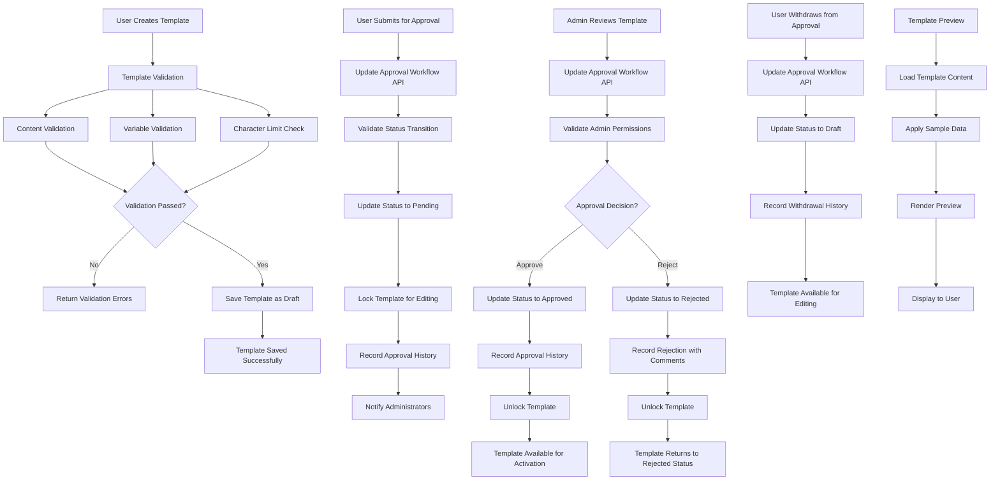

# TRD - Phase 1

## 1. Component Overview

- **Purpose:** Technical implementation of a reusable Template Management Utility that enables users to create, manage, and customize multi-channel communication templates (SMS, WhatsApp, Email) with an approval workflow system where administrators approve templates before they become available for use.
- **Scope:** Complete backend API development in configurable backend service, frontend implementation as reusable components, database schema design with approval workflow, and template management capabilities that can be integrated into any application.
- **Phase 1 Scope:** Template CRUD APIs, multi-channel support, variable substitution system, template validation, preview functionality, category management, unified approval workflow system (Draft, Pending Approval, Approved, Rejected), and configurable integration interfaces.
- **Dependencies:** Configurable backend service, configurable frontend framework, configurable database system, configurable channel system, configurable authentication and authorization system
- **Dependents:** Host applications that integrate this utility, future notification delivery systems (out of scope for Phase 1), future customer engagement workflows, template consumption by other services (future phases)

## 2. Functional Requirements

- **FR-TMS-001:** Multi-Channel Template Creation
- **FR-TMS-002:** Dynamic Variable System
- **FR-TMS-003:** Template Management Operations
- **FR-TMS-004:** Approval Workflow System
- **FR-TMS-005:** Template Organization and Search
- **FR-TMS-006:** Template Validation and Preview
- **FR-TMS-007:** Configurable Integration Interface

## 3. Component Interface

### 3.1 Public API

**Backend Service APIs:**

```typescript
// Template Management API Interface
interface TemplateAPI {
  // Template CRUD Operations
  createTemplate(template: CreateTemplateDto): Promise<TemplateResponseDto>;
  updateTemplate(id: number, template: UpdateTemplateDto): Promise<TemplateResponseDto>;
  getTemplate(id: number): Promise<TemplateResponseDto>;
  getTemplates(query: GetTemplatesDto): Promise<PaginatedTemplateResponseDto>;
  deleteTemplate(id: number): Promise<void>;
  
  // Unified Approval Workflow Operation
  updateApprovalWorkflow(id: number, workflow: ApprovalWorkflowDto): Promise<TemplateResponseDto>;
  getTemplateApprovalHistory(id: number): Promise<ApprovalHistoryDto[]>;
  
  // Template Preview and Validation
  previewTemplate(id: number, sampleData: PreviewTemplateDto): Promise<PreviewResultDto>;
  validateTemplate(templateContent: ValidateTemplateDto): Promise<ValidationResultDto>;
  
  // Template Variables
  getAvailableVariables(): Promise<TemplateVariableDto[]>;
  
  // Channel Configuration
  getChannelTypes(): Promise<ChannelTypeDto[]>;
  configureChannels(channels: ChannelConfigDto[]): Promise<void>;
}
```

**Frontend Component Interface:**

```typescript
// Template Management Hook Interface
interface TemplateManagementHook {
  templates: TemplateResponseDto[];
  loading: boolean;
  error: string | null;
  
  createTemplate: (template: CreateTemplateRequest) => Promise<void>;
  updateTemplate: (id: number, template: UpdateTemplateRequest) => Promise<void>;
  deleteTemplate: (id: number) => Promise<void>;
  previewTemplate: (id: number, sampleData: Record<string, any>) => Promise<PreviewResult>;
  
  // Unified Approval Workflow Operation
  updateApprovalWorkflow: (id: number, workflow: ApprovalWorkflowRequest) => Promise<void>;
  getApprovalHistory: (id: number) => Promise<ApprovalHistory[]>;
  
  searchTemplates: (query: string) => void;
  filterTemplates: (filters: TemplateFilters) => void;
  
  availableVariables: TemplateVariable[];
  validateContent: (content: string) => ValidationResult;
  channelTypes: ChannelType[];
}
```

### 3.2 Input/Output Contracts

**Input Data Models:**

```typescript
interface CreateTemplateDto {
  name: string;
  category: 'common' | 'custom';
  channelTypeId: number; // Reference to configured channel types
  eventTypeId?: number;
  subject?: string; // Required for email
  body: string;
  variables: string[]; // Array of variable names used
  organizationId?: number; // Required for custom templates
}

interface UpdateTemplateDto extends Partial<CreateTemplateDto> {
  updatedBy: number;
}

interface GetTemplatesDto {
  page?: number;
  limit?: number;
  search?: string;
  category?: 'common' | 'custom';
  channelTypeId?: number;
  approvalStatus?: 'draft' | 'pending_approval' | 'approved' | 'rejected';
  status?: 'active' | 'inactive';
  organizationId?: number;
  createdBy?: number;
}

// Unified Approval Workflow DTO
interface ApprovalWorkflowDto {
  templateId: number;
  approval_status: 'draft' | 'pending_approval' | 'approved' | 'rejected';
  submittedBy?: number;    // Required when status = 'pending_approval'
  reviewedBy?: number;     // Required when status = 'approved' | 'rejected'
  comments?: string;       // Optional for submit/withdraw, required for reject
}

interface ChannelConfigDto {
  name: string;
  type: 'email' | 'sms' | 'whatsapp';
  characterLimit?: number;
  supportsHtml: boolean;
  config: Record<string, any>;
}
```

**Output Data Models:**

```typescript
interface TemplateResponseDto {
  id: number;
  name: string;
  category: 'common' | 'custom';
  channelType: 'email' | 'sms' | 'whatsapp';
  subject?: string;
  body: string;
  variables: TemplateVariable[];
  status: 'active' | 'inactive';
  organizationId?: number;
  approvalStatus: 'draft' | 'pending_approval' | 'approved' | 'rejected';
  eventType?: {
    id: number;
    name: string;
    description: string;
  };
  createdBy: number;
  updatedBy: number;
  createdAt: Date;
  updatedAt: Date;
  approvalHistory?: ApprovalHistoryDto[];
}

interface TemplateVariable {
  name: string;
  description: string;
  type: 'string' | 'number' | 'date';
  required: boolean;
  example: string;
}

interface ValidationResultDto {
  isValid: boolean;
  errors: ValidationError[];
  warnings: ValidationWarning[];
  characterCount: number;
  variablesFound: string[];
}

interface ApprovalHistoryDto {
  id: number;
  action: 'submitted' | 'approved' | 'rejected' | 'withdrawn';
  performedBy: number;
  performedAt: Date;
  comments?: string;
  previousStatus?: string;
  newStatus: string;
}
```

### 3.3 Error Handling

**Error Types:**

```typescript
enum TemplateErrorTypes {
  TEMPLATE_NOT_FOUND = 'TEMPLATE_NOT_FOUND',
  INVALID_TEMPLATE_CONTENT = 'INVALID_TEMPLATE_CONTENT',
  INVALID_VARIABLES = 'INVALID_VARIABLES',
  CHARACTER_LIMIT_EXCEEDED = 'CHARACTER_LIMIT_EXCEEDED',
  DUPLICATE_TEMPLATE_NAME = 'DUPLICATE_TEMPLATE_NAME',
  UNAUTHORIZED_ACCESS = 'UNAUTHORIZED_ACCESS',
  TEMPLATE_IN_USE = 'TEMPLATE_IN_USE',
  INVALID_APPROVAL_STATUS_TRANSITION = 'INVALID_APPROVAL_STATUS_TRANSITION',
  APPROVAL_WORKFLOW_NOT_ALLOWED = 'APPROVAL_WORKFLOW_NOT_ALLOWED',
  TEMPLATE_LOCKED_FOR_APPROVAL = 'TEMPLATE_LOCKED_FOR_APPROVAL',
  INSUFFICIENT_APPROVAL_PERMISSIONS = 'INSUFFICIENT_APPROVAL_PERMISSIONS',
  MISSING_REQUIRED_APPROVAL_FIELDS = 'MISSING_REQUIRED_APPROVAL_FIELDS'
}

interface TemplateError {
  code: TemplateErrorTypes;
  message: string;
  details?: any;
}
```

**Error Responses:**

```typescript
interface ErrorResponse {
  statusCode: number;
  error: TemplateError;
  timestamp: string;
  path: string;
}
```

**Recovery Strategies:**

- **Template Not Found:** Return 404 with clear message, suggest available templates
- **Validation Errors:** Return 400 with detailed validation feedback and correction suggestions
- **Character Limit Exceeded:** Return 400 with current count and limit, highlight excess content
- **Variable Errors:** Return 400 with list of invalid variables and available options
- **Invalid Approval Status Transition:** Return 400 with current status and allowed transitions based on user role
- **Permission Errors:** Return 403 with required permissions and role information for approval workflow operations
- **Template Lock Errors:** Return 409 with current approval status and estimated unlock time
- **Missing Required Fields:** Return 400 with list of missing fields for the requested approval status change

## 4. Data Model

### 4.1 Data Storage

**Database Schema Extensions:**

```sql
-- Extend existing notification_channel_event_template_mapping table
ALTER TABLE notification_channel_event_template_mapping 
ADD COLUMN template_name VARCHAR(255) NOT NULL,
ADD COLUMN category VARCHAR(20) NOT NULL DEFAULT 'common',
ADD COLUMN company_id INT NULL,
ADD COLUMN variables JSONB NULL,
ADD COLUMN character_count INT NULL,
ADD COLUMN approval_status VARCHAR(20) NOT NULL DEFAULT 'draft',
ADD COLUMN submitted_by INT NULL,
ADD COLUMN submitted_at TIMESTAMPTZ NULL,
ADD COLUMN reviewed_by INT NULL,
ADD COLUMN reviewed_at TIMESTAMPTZ NULL,
ADD COLUMN approval_comments TEXT NULL,
ADD COLUMN rejection_comments TEXT NULL,
ADD COLUMN is_locked BOOLEAN DEFAULT FALSE;

-- Create template approval history table
CREATE TABLE notification_template_approval_history (
  id SERIAL PRIMARY KEY,
  template_id INT NOT NULL,
  action VARCHAR(20) NOT NULL, -- 'submitted', 'approved', 'rejected', 'withdrawn'
  performed_by INT NOT NULL,
  performed_at TIMESTAMPTZ DEFAULT CURRENT_TIMESTAMP,
  comments TEXT,
  previous_status VARCHAR(20),
  new_status VARCHAR(20) NOT NULL,
  FOREIGN KEY (template_id) REFERENCES notification_channel_event_template_mapping(id),
  FOREIGN KEY (performed_by) REFERENCES users(id)
);

-- Create template variables master table
CREATE TABLE notification_template_variables (
  id SERIAL PRIMARY KEY,
  variable_name VARCHAR(100) NOT NULL UNIQUE,
  display_name VARCHAR(255) NOT NULL,
  description TEXT,
  data_type VARCHAR(50) NOT NULL DEFAULT 'string',
  is_required BOOLEAN DEFAULT FALSE,
  example_value VARCHAR(255),
  source_entity VARCHAR(100), -- user, company, policy, etc.
  source_field VARCHAR(100),
  created_at TIMESTAMPTZ DEFAULT CURRENT_TIMESTAMP,
  updated_at TIMESTAMPTZ DEFAULT CURRENT_TIMESTAMP
);

-- Add indexes for performance
CREATE INDEX idx_template_category ON notification_channel_event_template_mapping(category);
CREATE INDEX idx_template_company ON notification_channel_event_template_mapping(company_id);
CREATE INDEX idx_template_channel ON notification_channel_event_template_mapping(channel_type_id);
CREATE INDEX idx_template_approval_status ON notification_channel_event_template_mapping(approval_status);
CREATE INDEX idx_template_status ON notification_channel_event_template_mapping(status_lid);
CREATE INDEX idx_template_name_search ON notification_channel_event_template_mapping USING gin(to_tsvector('english', template_name || ' ' || COALESCE(subject, '') || ' ' || body));
CREATE INDEX idx_approval_history_template ON notification_template_approval_history(template_id);
CREATE INDEX idx_approval_history_date ON notification_template_approval_history(performed_at);

-- Add foreign key constraint to existing CHANNEL_TYPE table
ALTER TABLE notification_channel_event_template_mapping 
ADD CONSTRAINT fk_template_channel_type 
FOREIGN KEY (channel_type_id) REFERENCES channel_type(id);
```

**TypeORM Entity Extensions:**

```typescript
// Extended NotificationChannelEventTemplateMapping entity
@Entity("notification_channel_event_template_mapping")
export class NotificationChannelEventTemplateMapping {
  @PrimaryGeneratedColumn()
  id: number;

  @Column({ name: "template_name", length: 255 })
  templateName: string;

  @Column({ name: "category", length: 20, default: 'common' })
  category: 'common' | 'custom';

  @Column({ name: "company_id", nullable: true })
  companyId?: number;

  @Column({ name: "variables", type: "jsonb", nullable: true })
  variables?: string[];

  @Column({ name: "character_count", nullable: true })
  characterCount?: number;

  @Column({ name: "approval_status", length: 20, default: 'draft' })
  approvalStatus: 'draft' | 'pending_approval' | 'approved' | 'rejected';

  @Column({ name: "submitted_by", nullable: true })
  submittedBy?: number;

  @Column({ name: "submitted_at", type: "timestamptz", nullable: true })
  submittedAt?: Date;

  @Column({ name: "reviewed_by", nullable: true })
  reviewedBy?: number;

  @Column({ name: "reviewed_at", type: "timestamptz", nullable: true })
  reviewedAt?: Date;

  @Column({ name: "approval_comments", type: "text", nullable: true })
  approvalComments?: string;

  @Column({ name: "rejection_comments", type: "text", nullable: true })
  rejectionComments?: string;

  @Column({ name: "is_locked", default: false })
  isLocked: boolean;

  // ... existing fields
  @Column({ name: "event_type_id", nullable: true })
  eventTypeId?: number;

  @Column({ name: "channel_type_id" })
  channelTypeId: number;

  @Column({ nullable: true })
  subject?: string;

  @Column("text")
  body: string;

  @Column({ name: "status_lid", nullable: true })
  statusLid: number;

  @Column({ name: "created_by" })
  createdBy: number;

  @Column({ name: "updated_by" })
  updatedBy: number;

  @CreateDateColumn({ name: "created_at" })
  createdAt: Date;

  @UpdateDateColumn({ name: "updated_at" })
  updatedAt: Date;

  // Relations
  @ManyToOne(() => NotificationEventType, { nullable: true })
  @JoinColumn({ name: "event_type_id" })
  eventType?: NotificationEventType;

  @ManyToOne(() => ChannelType)
  @JoinColumn({ name: "channel_type_id" })
  channelType: ChannelType;

  @ManyToOne(() => Company, { nullable: true })
  @JoinColumn({ name: "company_id" })
  company?: Company;

  @ManyToOne(() => User)
  @JoinColumn({ name: "created_by" })
  creator: User;

  @ManyToOne(() => User)
  @JoinColumn({ name: "updated_by" })
  updater: User;

  @OneToMany(() => NotificationTemplateApprovalHistory, history => history.template)
  approvalHistory: NotificationTemplateApprovalHistory[];
}

// New Template Approval History entity
@Entity("notification_template_approval_history")
export class NotificationTemplateApprovalHistory {
  @PrimaryGeneratedColumn()
  id: number;

  @Column({ name: "template_id" })
  templateId: number;

  @Column({ name: "action", length: 20 })
  action: 'submitted' | 'approved' | 'rejected' | 'withdrawn';

  @Column({ name: "performed_by" })
  performedBy: number;

  @Column({ name: "performed_at", type: "timestamptz", default: () => "CURRENT_TIMESTAMP" })
  performedAt: Date;

  @Column({ type: "text", nullable: true })
  comments?: string;

  @Column({ name: "previous_status", length: 20, nullable: true })
  previousStatus?: string;

  @Column({ name: "new_status", length: 20 })
  newStatus: string;

  @ManyToOne(() => NotificationChannelEventTemplateMapping)
  @JoinColumn({ name: "template_id" })
  template: NotificationChannelEventTemplateMapping;

  @ManyToOne(() => User)
  @JoinColumn({ name: "performed_by" })
  performer: User;
}

// New Template Variables entity
@Entity("notification_template_variables")
export class NotificationTemplateVariable {
  @PrimaryGeneratedColumn()
  id: number;

  @Column({ name: "variable_name", length: 100, unique: true })
  variableName: string;

  @Column({ name: "display_name", length: 255 })
  displayName: string;

  @Column("text", { nullable: true })
  description?: string;

  @Column({ name: "data_type", length: 50, default: 'string' })
  dataType: 'string' | 'number' | 'date' | 'boolean';

  @Column({ name: "is_required", default: false })
  isRequired: boolean;

  @Column({ name: "example_value", length: 255, nullable: true })
  exampleValue?: string;

  @Column({ name: "source_entity", length: 100, nullable: true })
  sourceEntity?: string;

  @Column({ name: "source_field", length: 100, nullable: true })
  sourceField?: string;

  @CreateDateColumn({ name: "created_at" })
  createdAt: Date;

  @UpdateDateColumn({ name: "updated_at" })
  updatedAt: Date;
}
```

### 4.2 Data Flow



### 4.3 Data Validation

**Input Validation Rules:**

```typescript
// Template Content Validation
class TemplateContentValidator {
  static validateEmailTemplate(subject: string, body: string): ValidationResult {
    const errors: ValidationError[] = [];
    
    if (!subject || subject.trim().length === 0) {
      errors.push({ field: 'subject', message: 'Subject is required for email templates' });
    }
    
    if (subject && subject.length > 1000) {
      errors.push({ field: 'subject', message: 'Subject must not exceed 1000 characters' });
    }
    
    if (!body || body.trim().length === 0) {
      errors.push({ field: 'body', message: 'Body content is required' });
    }
    
    return { isValid: errors.length === 0, errors };
  }

  static validateSMSTemplate(body: string): ValidationResult {
    const errors: ValidationError[] = [];
    
    if (!body || body.trim().length === 0) {
      errors.push({ field: 'body', message: 'SMS content is required' });
    }
    
    if (body && body.length > 160) {
      errors.push({ 
        field: 'body', 
        message: `SMS content exceeds 160 character limit (current: ${body.length})` 
      });
    }
    
    return { isValid: errors.length === 0, errors };
  }

  static validateWhatsAppTemplate(body: string): ValidationResult {
    const errors: ValidationError[] = [];
    
    if (!body || body.trim().length === 0) {
      errors.push({ field: 'body', message: 'WhatsApp content is required' });
    }
    
    if (body && body.length > 4096) {
      errors.push({ 
        field: 'body', 
        message: `WhatsApp content exceeds 4096 character limit (current: ${body.length})` 
      });
    }
    
    return { isValid: errors.length === 0, errors };
  }
}

// Variable Validation
class TemplateVariableValidator {
  private static VARIABLE_PATTERN = /\{\{([a-zA-Z][a-zA-Z0-9_]*)\}\}/g;
  
  static extractVariables(content: string): string[] {
    const matches = content.match(this.VARIABLE_PATTERN);
    return matches ? matches.map(match => match.slice(2, -2)) : [];
  }
  
  static async validateVariables(variables: string[]): Promise<ValidationResult> {
    const validVariables = await this.getValidVariables();
    const invalidVariables = variables.filter(v => !validVariables.includes(v));
    
    const errors: ValidationError[] = invalidVariables.map(v => ({
      field: 'variables',
      message: `Unknown variable: {{${v}}}`,
      suggestion: this.suggestSimilarVariable(v, validVariables)
    }));
    
    return { isValid: errors.length === 0, errors };
  }
}
```

## 5. Technology Stack

### 5.1 Core Technologies

**Backend Service:**
- **Programming Language:** TypeScript 5.x
- **Framework:** Configurable (NestJS 10.x recommended)
- **Database:** Configurable (PostgreSQL 15.x with ORM recommended)
- **ORM:** Configurable (TypeORM 0.3.x recommended)
- **Validation:** class-validator, class-transformer
- **API Documentation:** OpenAPI/Swagger
- **Testing:** Jest, Supertest

**Frontend Components:**
- **Programming Language:** TypeScript 5.x
- **Framework:** Configurable (React 18.x recommended)
- **Build Tool:** Configurable (Vite recommended)
- **State Management:** Configurable (TanStack Query recommended)
- **UI Library:** Configurable (Material-UI v5 recommended)
- **Form Management:** Configurable (React Hook Form with Zod validation recommended)
- **HTTP Client:** Configurable (Axios recommended)

**Utility Libraries:**
- **Validation:** Configurable validation schemas
- **Sanitization:** DOMPurify for content sanitization
- **Date Handling:** Configurable date library
- **String Processing:** Template variable parsing utilities

### 5.2 Technology Rationale

**Why NestJS (Recommended):** 
- Mature framework with excellent TypeScript support
- Built-in ORM support for database operations
- Dependency injection and modular architecture
- Swagger integration for API documentation
- Can be easily replaced with other backend frameworks

**Why React with TanStack Query (Recommended):**
- Component-based architecture suitable for utility libraries
- TanStack Query provides excellent caching and synchronization for template management
- React Hook Form offers performant form handling for template creation/editing
- Can be adapted to other frontend frameworks (Vue, Angular, etc.)

**Why PostgreSQL with ORM (Recommended):**
- JSONB support for flexible variable storage
- Full-text search capabilities for template searching
- Strong consistency for template management operations
- Can be adapted to other databases (MySQL, SQLite, etc.)

## 6. Integration Design

### 6.1 Dependency Integration

**notification-service Integration:**

```typescript
@Module({
  imports: [
    TypeOrmModule.forFeature([
      NotificationChannelEventTemplateMapping,
      NotificationTemplateVariable,
      NotificationEventType,
      NotificationChannelType,
      Company // From org-service entities
    ]),
    InsuranceWellnessHubServiceLibModule
  ],
  controllers: [TemplateController],
  providers: [TemplateService, TemplateRepository, TemplateValidationService],
  exports: [TemplateService]
})
export class TemplateModule {}
```

### 6.2 Configuration Integration

**Template Configuration:**

```typescript
// Template utility configuration interface
export interface TemplateManagementConfig {
  database?: {
    connection: any; // Database connection object
    entities: any[]; // Entity classes
  };
  channels: {
    email: {
      characterLimit?: number;
      supportsHtml: boolean;
      requiredFields: string[];
    };
    sms: {
      characterLimit: number;
      supportsHtml: boolean;
      requiredFields: string[];
    };
    whatsapp: {
      characterLimit: number;
      supportsHtml: boolean;
      requiredFields: string[];
    };
  };
  variables: {
    definitions: TemplateVariableDefinition[];
    validationRules: ValidationRule[];
  };
  approval: {
    requireApproval: boolean;
    autoApprovalRules?: ApprovalRule[];
    escalationTimeout?: number;
  };
  authentication: {
    userProvider: (userId: number) => Promise<User>;
    roleProvider: (userId: number) => Promise<UserRole[]>;
  };
}

// Template variable definitions
export const DEFAULT_TEMPLATE_VARIABLES = [
  {
    name: 'userName',
    displayName: 'User Name',
    description: 'Full name of the user',
    type: 'string',
    required: false,
    example: 'John Doe'
  },
  {
    name: 'organizationName',
    displayName: 'Organization Name',
    description: 'Name of the organization',
    type: 'string',
    required: false,
    example: 'Acme Corporation'
  },
  // ... more generic variables
] as const;
```

### 6.3 Host Application Integration

**Backend Integration:**

```typescript
// Host application service integration
class HostApplicationTemplateService {
  constructor(private templateUtility: TemplateManagementService) {}

  async initializeTemplateUtility(config: TemplateManagementConfig) {
    return this.templateUtility.initialize(config);
  }

  async getTemplatesForUser(userId: number, organizationId?: number) {
    const userRoles = await this.getUserRoles(userId);
    const isAdmin = userRoles.includes('ADMIN');
    
    return this.templateUtility.getTemplates({
      organizationId,
      includeApprovalData: isAdmin
    });
  }

  private async getUserRoles(userId: number): Promise<string[]> {
    // Host application-specific role resolution
    return [];
  }
}
```

**Frontend Integration:**

```typescript
// Host application component integration
const HostAdminPanel: React.FC = () => {
  const templateConfig = {
    apiBaseUrl: '/api/templates',
    channels: {
      email: { characterLimit: undefined, supportsHtml: true },
      sms: { characterLimit: 160, supportsHtml: false },
      whatsapp: { characterLimit: 4096, supportsHtml: false }
    },
    variables: DEFAULT_TEMPLATE_VARIABLES,
    userRoleProvider: useUserRoles,
    onApprovalRequired: handleApprovalNotification
  };

  return (
    <TemplateManagementProvider config={templateConfig}>
      <AdminLayout>
        <Navigation>
          <NavItem to="/admin/users">Users</NavItem>
          <NavItem to="/admin/roles">Roles</NavItem>
          <NavItem to="/admin/templates">Template Management</NavItem>
        </Navigation>
        <Routes>
          <Route path="/admin/templates/*" element={<TemplateManagementApp />} />
        </Routes>
      </AdminLayout>
    </TemplateManagementProvider>
  );
};

  async testTemplate(id: number, testData: TestTemplateRequest): Promise<TestResult> {
    return this.apiClient.post(`/${id}/test`, testData);
  }

  async previewTemplate(id: number, sampleData: Record<string, any>): Promise<PreviewResult> {
    return this.apiClient.post(`/${id}/preview`, { sampleData });
  }
}

// React Query Hooks
export const useTemplates = (params: GetTemplatesParams) => {
  return useQuery({
    queryKey: ['templates', params],
    queryFn: () => templateApi.getTemplates(params),
    staleTime: 5 * 60 * 1000 // 5 minutes
  });
};

export const useCreateTemplate = () => {
  const queryClient = useQueryClient();
  
  return useMutation({
    mutationFn: templateApi.createTemplate,
    onSuccess: () => {
      queryClient.invalidateQueries({ queryKey: ['templates'] });
    }
  });
};
```

**IBP Integration Points:**

```typescript
// Enhanced notification service integration
@Injectable()
export class EnhancedNotificationService extends NotificationService {
  constructor(
    private templateService: TemplateService,
    // ... existing dependencies
  ) {
    super(/* existing dependencies */);
  }

  async sendNotification(dto: SendNotificationDto): Promise<NotificationResult> {
    // Find appropriate template
    const template = await this.templateService.findTemplateForEvent(
      dto.eventType,
      dto.channel,
      dto.companyId
    );

    if (template) {
      // Use custom template
      const rendered = await this.templateService.renderTemplate(
        template.id,
        dto.parameters
      );
      
      // Override DTO with template content
      dto.subject = rendered.subject;
      dto.body = rendered.body;
    }

    // Continue with existing notification flow
    return super.sendNotification(dto);
  }
}
```

### 6.3 Data Flow Integration

**Template Creation Flow:**

1. User creates template → POST `/templates`
2. Backend service validates template content and variables
3. Template saved to database with 'draft' approval_status
4. Cache invalidation triggered for template queries
5. Success response returned to frontend

**Template Approval Flow:**

1. Template creator submits for approval → PUT `/templates/:id/approval-workflow`
   - Body: `{ approval_status: 'pending_approval', submittedBy: userId }`
2. System validates state transition from 'draft' to 'pending_approval'
3. Template approval_status updated and locked for editing
4. Approval history record created with action 'submitted'
5. Administrators notified of pending approval
6. Administrator reviews and decides → PUT `/templates/:id/approval-workflow`
   - Approve: `{ approval_status: 'approved', reviewedBy: adminId, comments?: string }`
   - Reject: `{ approval_status: 'rejected', reviewedBy: adminId, comments: string }`
7. System validates admin permissions and state transition
8. Template approval_status updated accordingly
9. Approval history updated with decision and comments
10. Template unlocked and creator notified of decision

**Template Withdrawal Flow:**

1. Template creator withdraws → PUT `/templates/:id/approval-workflow`
   - Body: `{ approval_status: 'draft', submittedBy: userId }`
2. System validates user owns template and current status is 'pending_approval'
3. Template approval_status updated to 'draft' and unlocked
4. Approval history record created with action 'withdrawn'
5. Template available for editing and resubmission

## 7. Performance Considerations

### 7.1 Performance Requirements

**Response Time Targets:**
- Template CRUD operations: < 500ms
- Template list loading (100 templates): < 2s
- Template preview generation: < 1s
- Template validation: < 300ms
- Variable substitution: < 200ms
- Approval workflow operations: < 1s
- Approval history retrieval: < 500ms

**Throughput Requirements:**
- Concurrent template editing sessions: 50+
- Template approval operations: 100+ approvals/hour
- Template search operations: 100+ requests/minute
- Admin Module navigation: 200+ page loads/minute

**Scalability Targets:**
- Support 10,000+ templates per system
- Handle 100+ concurrent administrators using template management
- Maintain performance with 100+ companies using custom templates
- Support approval workflow for 1000+ pending templates

### 7.2 Performance Strategies

**Database Optimization:**

```sql
-- Performance indexes
CREATE INDEX CONCURRENTLY idx_templates_search 
ON notification_channel_event_template_mapping 
USING gin(to_tsvector('english', template_name || ' ' || COALESCE(subject, '') || ' ' || body));

CREATE INDEX CONCURRENTLY idx_templates_approval_lookup 
ON notification_channel_event_template_mapping (approval_status, channel_type_id, company_id)
WHERE approval_status IN ('pending_approval', 'approved');

CREATE INDEX CONCURRENTLY idx_templates_category_channel 
ON notification_channel_event_template_mapping (category, channel_type_id, approval_status);

CREATE INDEX CONCURRENTLY idx_templates_pending_approval
ON notification_channel_event_template_mapping (submitted_at DESC)
WHERE approval_status = 'pending_approval';

CREATE INDEX CONCURRENTLY idx_approval_history_template_date
ON notification_template_approval_history (template_id, performed_at DESC);
```

**Caching Strategy:**

```typescript
// Template caching service
@Injectable()
export class TemplateCacheService {
  private readonly cache = new Map<string, any>();
  private readonly TTL = 15 * 60 * 1000; // 15 minutes

  async getTemplate(eventType: string, channel: string, companyId?: number): Promise<Template | null> {
    const key = this.buildCacheKey(eventType, channel, companyId);
    const cached = this.cache.get(key);
    
    if (cached && Date.now() - cached.timestamp < this.TTL) {
      return cached.data;
    }
    
    const template = await this.templateRepository.findTemplate(eventType, channel, companyId);
    
    if (template) {
      this.cache.set(key, {
        data: template,
        timestamp: Date.now()
      });
    }
    
    return template;
  }

  invalidateTemplate(templateId: number): void {
    // Remove all cache entries that might contain this template
    for (const [key, value] of this.cache.entries()) {
      if (value.data?.id === templateId) {
        this.cache.delete(key);
      }
    }
  }
}
```

**Frontend Optimization:**

```typescript
// Debounced search for template filtering
const useTemplateSearch = () => {
  const [searchQuery, setSearchQuery] = useState('');
  const debouncedQuery = useDebounce(searchQuery, 300);

  const { data: templates, isLoading } = useTemplates({
    search: debouncedQuery,
    enabled: debouncedQuery.length >= 2
  });

  return { searchQuery, setSearchQuery, templates, isLoading };
};

// Optimistic updates for template operations
const useOptimisticTemplateUpdate = () => {
  const queryClient = useQueryClient();
  
  return useMutation({
    mutationFn: templateApi.updateTemplate,
    onMutate: async ({ id, updates }) => {
      await queryClient.cancelQueries({ queryKey: ['templates'] });
      
      const previousTemplates = queryClient.getQueryData(['templates']);
      
      queryClient.setQueryData(['templates'], (old: any) => ({
        ...old,
        data: old.data.map((template: Template) => 
          template.id === id ? { ...template, ...updates } : template
        )
      }));
      
      return { previousTemplates };
    },
    onError: (err, variables, context) => {
      queryClient.setQueryData(['templates'], context?.previousTemplates);
    }
  });
};
```

## 8. Security Design

### 8.1 Security Requirements

**Authentication & Authorization:**
- Only authenticated iwork administrators can manage templates
- Role-based access control for template operations
- System administrator privileges required for template approval/rejection
- Company-level isolation for custom templates
- Approval workflow authorization checks
- Audit logging for all template and approval operations

**Data Protection:**
- Input sanitization for template content
- XSS prevention in template preview
- SQL injection prevention in search queries
- Variable injection validation
- Approval comments sanitization

**Template Security:**
- Restricted variable access based on user permissions
- Template content validation to prevent malicious scripts
- Secure variable substitution to prevent code injection
- Template locking during approval process to prevent concurrent modifications
- Approval authority validation to prevent unauthorized approvals

### 8.2 Security Implementation

**Input Sanitization:**

```typescript
@Injectable()
export class TemplateSanitizationService {
  sanitizeTemplateContent(content: string, contentType: 'html' | 'text'): string {
    if (contentType === 'html') {
      // Allow only safe HTML tags for email templates
      return DOMPurify.sanitize(content, {
        ALLOWED_TAGS: ['p', 'br', 'strong', 'em', 'u', 'h1', 'h2', 'h3', 'h4', 'h5', 'h6'],
        ALLOWED_ATTR: ['style'],
        ALLOWED_STYLES: {
          '*': {
            'color': [/^#[0-9a-f]{3,6}$/i],
            'font-size': [/^\d+px$/],
            'font-weight': [/^(normal|bold|[1-9]00)$/]
          }
        }
      });
    }
    
    // For text content, remove any potential script content
    return content.replace(/<script\b[^<]*(?:(?!<\/script>)<[^<]*)*<\/script>/gi, '');
  }

  validateVariableInjection(content: string): ValidationResult {
    const suspiciousPatterns = [
      /\{\{.*?<script.*?\}\}/gi,
      /\{\{.*?javascript:.*?\}\}/gi,
      /\{\{.*?eval\(.*?\}\}/gi,
      /\{\{.*?Function\(.*?\}\}/gi
    ];

    const violations = suspiciousPatterns.map(pattern => pattern.test(content)).filter(Boolean);
    
    return {
      isValid: violations.length === 0,
      errors: violations.length > 0 ? [{
        field: 'content',
        message: 'Template content contains potentially dangerous variable usage'
      }] : []
    };
  }
}
```

**Access Control:**

```typescript
@Injectable()
export class TemplateAuthorizationService {
  async canAccessTemplate(userId: number, templateId: number): Promise<boolean> {
    const template = await this.templateRepository.findById(templateId);
    if (!template) return false;

    const userPermissions = await this.authService.getUserPermissions(userId);
    
    // Administrators can access all templates
    if (userPermissions.includes('ADMIN')) {
      return true;
    }
    
    // Template creators can access their own templates
    if (template.createdBy === userId) {
      return true;
    }
    
    // Organization users can access their organization's custom templates
    if (template.category === 'custom' && template.organizationId) {
      const userOrganizationIds = await this.authService.getUserOrganizationIds(userId);
      return userOrganizationIds.includes(template.organizationId);
    }
    
    // Common templates are accessible to all users
    return template.category === 'common';
  }

  async canUpdateApprovalWorkflow(
    userId: number, 
    templateId: number, 
    targetStatus: string
  ): Promise<{ allowed: boolean; reason?: string }> {
    const userPermissions = await this.authService.getUserPermissions(userId);
    const template = await this.templateRepository.findById(templateId);
    
    if (!template) {
      return { allowed: false, reason: 'Template not found' };
    }

    const isAdmin = userPermissions.includes('ADMIN');
    const isCreator = template.createdBy === userId;
    const currentStatus = template.approvalStatus;

    // Define allowed transitions based on role
    if (isCreator && !isAdmin) {
      // Users can: draft→pending_approval, pending_approval→draft, rejected→pending_approval
      const allowedUserTransitions = {
        'draft': ['pending_approval'],
        'pending_approval': ['draft'],
        'rejected': ['pending_approval'],
        'approved': [] // Cannot modify approved templates
      };
      
      const allowed = allowedUserTransitions[currentStatus]?.includes(targetStatus) || false;
      return { 
        allowed, 
        reason: allowed ? undefined : `Users cannot transition from ${currentStatus} to ${targetStatus}` 
      };
    }

    if (isAdmin) {
      // Admins can: pending_approval→approved, pending_approval→rejected
      // Admins cannot approve their own templates
      if (targetStatus === 'approved' || targetStatus === 'rejected') {
        if (isCreator) {
          return { allowed: false, reason: 'Administrators cannot approve their own templates' };
        }
        if (currentStatus !== 'pending_approval') {
          return { allowed: false, reason: 'Can only approve/reject templates in pending_approval status' };
        }
        return { allowed: true };
      }
      
      // Admins also have user permissions
      const allowedAdminTransitions = {
        'draft': ['pending_approval'],
        'pending_approval': ['draft', 'approved', 'rejected'],
        'rejected': ['pending_approval'],
        'approved': [] // Cannot modify approved templates without separate lifecycle management
      };
      
      const allowed = allowedAdminTransitions[currentStatus]?.includes(targetStatus) || false;
      return { 
        allowed, 
        reason: allowed ? undefined : `Invalid transition from ${currentStatus} to ${targetStatus}` 
      };
    }

    return { allowed: false, reason: 'Insufficient permissions' };
  }
}
```

**Audit Logging:**

```typescript
@Injectable()
export class TemplateAuditService {
  async logTemplateOperation(
    operation: 'CREATE' | 'UPDATE' | 'DELETE' | 'VIEW' | 'SUBMIT_APPROVAL' | 'APPROVE' | 'REJECT' | 'WITHDRAW',
    templateId: number,
    userId: number,
    details?: any
  ): Promise<void> {
    const auditLog = {
      entityType: 'TEMPLATE',
      entityId: templateId,
      operation,
      userId,
      timestamp: new Date(),
      details: JSON.stringify(details),
      ipAddress: this.requestContext.getClientIp(),
      userAgent: this.requestContext.getUserAgent()
    };

    await this.auditRepository.save(auditLog);
    
    // Log approval workflow events separately
    if (['SUBMIT_APPROVAL', 'APPROVE', 'REJECT', 'WITHDRAW'].includes(operation)) {
      await this.logApprovalWorkflowEvent(operation, templateId, userId, details);
    }
  }
  
  private async logApprovalWorkflowEvent(
    action: string,
    templateId: number,
    userId: number,
    details?: any
  ): Promise<void> {
    const approvalLog = {
      templateId,
      action: action.toLowerCase().replace('_', ''),
      performedBy: userId,
      performedAt: new Date(),
      comments: details?.comments,
      previousStatus: details?.previousStatus,
      newStatus: details?.newStatus
    };
    
    await this.approvalHistoryRepository.save(approvalLog);
  }
}
```

## 9. Monitoring & Observability

### 9.1 Logging

**Log Levels and Events:**

```typescript
@Injectable()
export class TemplateLoggingService {
  private readonly logger = createLogger('TemplateService');

  logTemplateCreation(templateId: number, userId: number, category: string): void {
    this.logger.info({
      event: 'TEMPLATE_CREATED',
      templateId,
      userId,
      category,
      timestamp: new Date().toISOString()
    });
  }

  logTemplateValidationFailure(content: string, errors: ValidationError[]): void {
    this.logger.warn({
      event: 'TEMPLATE_VALIDATION_FAILED',
      errorCount: errors.length,
      errors: errors.map(e => ({ field: e.field, message: e.message })),
      contentLength: content.length
    });
  }

  logTemplateUsage(templateId: number, eventType: string, channel: string): void {
    this.logger.info({
      event: 'TEMPLATE_USED',
      templateId,
      eventType,
      channel,
      timestamp: new Date().toISOString()
    });
  }

  logTemplateError(operation: string, templateId: number, error: Error): void {
    this.logger.error({
      event: 'TEMPLATE_ERROR',
      operation,
      templateId,
      error: error.message,
      stack: error.stack
    });
  }
}
```

### 9.2 Metrics

**Key Performance Metrics:**

```typescript
interface TemplateMetrics {
  // Performance metrics
  templateLoadTime: number;
  templateValidationTime: number;
  templateRenderTime: number;
  
  // Usage metrics
  templatesCreated: number;
  templatesUsed: number;
  templateTestsSent: number;
  
  // Error metrics
  validationFailures: number;
  renderFailures: number;
  templateNotFoundErrors: number;
  
  // Business metrics
  activeTemplates: number;
  customTemplatesByCompany: Record<number, number>;
  templateUsageByChannel: Record<string, number>;
}
```

**Monitoring Integration:**

```typescript
@Injectable()
export class TemplateMetricsService {
  private readonly metrics = new Map<string, number>();

  incrementCounter(metric: string, tags?: Record<string, string>): void {
    const key = this.buildMetricKey(metric, tags);
    this.metrics.set(key, (this.metrics.get(key) || 0) + 1);
  }

  recordDuration(metric: string, duration: number, tags?: Record<string, string>): void {
    const key = this.buildMetricKey(metric, tags);
    // In production, would integrate with monitoring service like Prometheus
    console.log(`Metric: ${key}, Duration: ${duration}ms`);
  }

  async getTemplateUsageStats(): Promise<TemplateUsageStats> {
    const stats = await this.templateRepository.getUsageStatistics();
    return {
      totalTemplates: stats.total,
      activeTemplates: stats.active,
      usageByChannel: stats.channelUsage,
      topUsedTemplates: stats.mostUsed
    };
  }
}
```

## 10. Testing Strategy

### 10.1 Unit Testing

**Backend Testing:**

```typescript
describe('TemplateService', () => {
  let service: TemplateService;
  let repository: MockType<TemplateRepository>;

  beforeEach(async () => {
    const module = await Test.createTestingModule({
      providers: [
        TemplateService,
        { provide: TemplateRepository, useFactory: mockRepository }
      ]
    }).compile();

    service = module.get<TemplateService>(TemplateService);
    repository = module.get(TemplateRepository);
  });

  describe('createTemplate', () => {
    it('should create template with valid data', async () => {
      const templateData = {
        name: 'Test Template',
        category: 'common' as const,
        channelType: 'email' as const,
        subject: 'Test Subject',
        body: 'Hello {{userFirstName}}!',
        status: 'active' as const
      };

      repository.save.mockResolvedValue({ id: 1, ...templateData });

      const result = await service.createTemplate(templateData, 1);
      
      expect(result.id).toBe(1);
      expect(result.name).toBe(templateData.name);
      expect(repository.save).toHaveBeenCalledWith(
        expect.objectContaining({
          ...templateData,
          createdBy: 1,
          variables: ['userFirstName']
        })
      );
    });

    it('should validate template content', async () => {
      const invalidTemplate = {
        name: 'Invalid Template',
        category: 'common' as const,
        channelType: 'sms' as const,
        body: 'This SMS is too long '.repeat(20), // > 160 characters
        status: 'active' as const
      };

      await expect(service.createTemplate(invalidTemplate, 1))
        .rejects.toThrow('SMS content exceeds 160 character limit');
    });
  });

  describe('renderTemplate', () => {
    it('should substitute variables correctly', async () => {
      const template = {
        id: 1,
        subject: 'Welcome {{userFirstName}}!',
        body: 'Hello {{userFirstName}}, welcome to {{companyName}}!'
      };

      const variables = {
        userFirstName: 'John',
        companyName: 'TechCorp'
      };

      repository.findById.mockResolvedValue(template);

      const result = await service.renderTemplate(1, variables);

      expect(result.subject).toBe('Welcome John!');
      expect(result.body).toBe('Hello John, welcome to TechCorp!');
    });
  });
});
```

**Frontend Testing:**

```typescript
describe('useTemplateManagement', () => {
  const mockApi = {
    getTemplates: jest.fn(),
    createTemplate: jest.fn(),
    updateTemplate: jest.fn(),
    deleteTemplate: jest.fn()
  };

  beforeEach(() => {
    (templateApi as jest.Mocked<typeof templateApi>) = mockApi;
  });

  it('should load templates on mount', async () => {
    const mockTemplates = [
      { id: 1, name: 'Template 1', category: 'common', channelType: 'email' }
    ];

    mockApi.getTemplates.mockResolvedValue({
      data: mockTemplates,
      total: 1,
      page: 1,
      limit: 10
    });

    const { result, waitFor } = renderHook(() => useTemplateManagement());

    await waitFor(() => {
      expect(result.current.templates).toEqual(mockTemplates);
      expect(result.current.loading).toBe(false);
    });
  });

  it('should create template successfully', async () => {
    const newTemplate = {
      name: 'New Template',
      category: 'common' as const,
      channelType: 'email' as const,
      subject: 'Test',
      body: 'Test body'
    };

    mockApi.createTemplate.mockResolvedValue({ id: 2, ...newTemplate });

    const { result } = renderHook(() => useTemplateManagement());

    await act(async () => {
      await result.current.createTemplate(newTemplate);
    });

    expect(mockApi.createTemplate).toHaveBeenCalledWith(newTemplate);
  });
});
```

### 10.2 Integration Testing

**API Integration Tests:**

```typescript
describe('Template API Integration', () => {
  let app: INestApplication;
  let templateRepository: Repository<NotificationChannelEventTemplateMapping>;

  beforeEach(async () => {
    const module = await Test.createTestingModule({
      imports: [TemplateModule, DatabaseTestModule]
    }).compile();

    app = module.createNestApplication();
    await app.init();

    templateRepository = module.get(getRepositoryToken(NotificationChannelEventTemplateMapping));
  });

  it('should create template via API', async () => {
    const templateData = {
      name: 'Integration Test Template',
      category: 'common',
      channelType: 'email',
      subject: 'Test Subject',
      body: 'Test Body {{userFirstName}}',
      status: 'active'
    };

    const response = await request(app.getHttpServer())
      .post('/templates')
      .send(templateData)
      .expect(201);

    expect(response.body.data.name).toBe(templateData.name);
    
    // Verify database record
    const savedTemplate = await templateRepository.findOne({
      where: { id: response.body.data.id }
    });
    
    expect(savedTemplate).toBeTruthy();
    expect(savedTemplate?.templateName).toBe(templateData.name);
  });

  it('should retrieve templates with pagination', async () => {
    // Create test templates
    await Promise.all([
      templateRepository.save({ templateName: 'Template 1', category: 'common', channelType: 'email' }),
      templateRepository.save({ templateName: 'Template 2', category: 'common', channelType: 'sms' })
    ]);

    const response = await request(app.getHttpServer())
      .get('/templates')
      .query({ page: 1, limit: 10 })
      .expect(200);

    expect(response.body.data).toHaveLength(2);
    expect(response.body.total).toBe(2);
  });
});
```

## 11. Deployment Considerations

### 11.1 Environment Requirements

**Backend Infrastructure:**
- Node.js 18.x+ runtime environment
- PostgreSQL 15.x database with JSONB support
- Redis for caching (optional but recommended)
- Environment variables for configuration

**Frontend Infrastructure:**
- Vite build system for production builds
- CDN for static asset delivery
- Environment-specific configuration files

**Database Migrations:**

```typescript
import { MigrationInterface, QueryRunner } from 'typeorm';

export class AddTemplateManagementTables1640995200000 implements MigrationInterface {
  name = 'AddTemplateManagementTables1640995200000';

  public async up(queryRunner: QueryRunner): Promise<void> {
    // Extend existing table
    await queryRunner.query(`
      ALTER TABLE notification_channel_event_template_mapping 
      ADD COLUMN template_name VARCHAR(255),
      ADD COLUMN category VARCHAR(20) DEFAULT 'common',
      ADD COLUMN company_id INT,
      ADD COLUMN variables JSONB,
      ADD COLUMN character_count INT,
      ADD COLUMN is_system_template BOOLEAN DEFAULT FALSE
    `);

    // Create new tables
    await queryRunner.query(`
      CREATE TABLE notification_template_variables (
        id SERIAL PRIMARY KEY,
        variable_name VARCHAR(100) NOT NULL UNIQUE,
        display_name VARCHAR(255) NOT NULL,
        description TEXT,
        data_type VARCHAR(50) NOT NULL DEFAULT 'string',
        is_required BOOLEAN DEFAULT FALSE,
        example_value VARCHAR(255),
        source_entity VARCHAR(100),
        source_field VARCHAR(100),
        created_at TIMESTAMPTZ DEFAULT CURRENT_TIMESTAMP,
        updated_at TIMESTAMPTZ DEFAULT CURRENT_TIMESTAMP
      )
    `);

    // Create indexes
    await queryRunner.query(`
      CREATE INDEX idx_template_category ON notification_channel_event_template_mapping(category);
      CREATE INDEX idx_template_company ON notification_channel_event_template_mapping(company_id);
      CREATE INDEX idx_template_name_search ON notification_channel_event_template_mapping 
      USING gin(to_tsvector('english', template_name || ' ' || COALESCE(subject, '') || ' ' || body));
    `);

    // Insert default variables
    await queryRunner.query(`
      INSERT INTO notification_template_variables 
      (variable_name, display_name, description, data_type, is_required, example_value)
      VALUES 
      ('userFirstName', 'User First Name', 'First name of the user', 'string', true, 'John'),
      ('userLastName', 'User Last Name', 'Last name of the user', 'string', false, 'Doe'),
      ('companyName', 'Company Name', 'Name of the user''s company', 'string', false, 'TechCorp'),
      ('policyNumber', 'Policy Number', 'Insurance policy number', 'string', false, 'POL-123456')
    `);
  }

  public async down(queryRunner: QueryRunner): Promise<void> {
    await queryRunner.query('DROP TABLE notification_template_variables');
    await queryRunner.query(`
      ALTER TABLE notification_channel_event_template_mapping 
      DROP COLUMN template_name,
      DROP COLUMN category,
      DROP COLUMN company_id,
      DROP COLUMN variables,
      DROP COLUMN character_count,
      DROP COLUMN is_system_template
    `);
  }
}
```

### 11.2 Deployment Strategy

**Backend Deployment:**

```yaml
# docker-compose.override.yml additions
services:
  notification-service:
    environment:
      - TEMPLATE_CACHE_TTL=900000  # 15 minutes
      - TEMPLATE_VALIDATION_TIMEOUT=5000
      - MAX_TEMPLATE_SIZE=10240  # 10KB
    depends_on:
      - postgres
      - redis
```

**Frontend Deployment:**

```typescript
// vite.config.ts - production build optimizations
export default defineConfig({
  build: {
    rollupOptions: {
      output: {
        manualChunks: {
          'template-management': [
            './src/pages/TemplateManagement',
            './src/components/TemplateEditor',
            './src/hooks/useTemplateManagement'
          ]
        }
      }
    }
  }
});
```

**Configuration Management:**

```typescript
// Template-specific configuration
interface TemplateConfig {
  characterLimits: {
    sms: number;
    whatsapp: number;
    emailSubject: number;
  };
  cacheSettings: {
    templateCacheTTL: number;
    variableCacheTTL: number;
  };
  validation: {
    timeoutMs: number;
    maxTemplateSize: number;
  };
}

export const templateConfig: TemplateConfig = {
  characterLimits: {
    sms: parseInt(process.env.SMS_CHAR_LIMIT || '160'),
    whatsapp: parseInt(process.env.WHATSAPP_CHAR_LIMIT || '4096'),
    emailSubject: parseInt(process.env.EMAIL_SUBJECT_LIMIT || '1000')
  },
  cacheSettings: {
    templateCacheTTL: parseInt(process.env.TEMPLATE_CACHE_TTL || '900000'),
    variableCacheTTL: parseInt(process.env.VARIABLE_CACHE_TTL || '3600000')
  },
  validation: {
    timeoutMs: parseInt(process.env.TEMPLATE_VALIDATION_TIMEOUT || '5000'),
    maxTemplateSize: parseInt(process.env.MAX_TEMPLATE_SIZE || '10240')
  }
};
```

## 12. Risk Mitigation

**Risk RISK-001:** Template Content Security Vulnerabilities
- **Mitigation:** Implement comprehensive content sanitization and XSS prevention measures
- **Implementation:** DOMPurify integration, restricted HTML tags, variable injection validation
- **Monitoring:** Security scanning of template content, suspicious pattern detection

**Risk RISK-002:** Performance Degradation with Large Template Sets  
- **Mitigation:** Implement caching strategies and database optimization
- **Implementation:** Template caching service, database indexing, pagination
- **Monitoring:** Query performance metrics, cache hit rates, response time tracking

**Risk RISK-003:** Variable Substitution Failures
- **Mitigation:** Comprehensive variable validation and fallback mechanisms
- **Implementation:** Pre-validation of variables, graceful degradation for missing data
- **Monitoring:** Variable substitution error logging, fallback usage tracking

**Risk RISK-004:** Integration Breaking Changes
- **Mitigation:** Versioned API contracts and backward compatibility
- **Implementation:** API versioning, gradual migration strategy
- **Monitoring:** Integration health checks, version compatibility tracking

## 13. Integration with Current Application (iWork)

This section outlines the specific technical implementation for integrating the Template Management Utility into the current iWork application:

### 13.1 Backend Integration (notification-service)

**Database Migration:**

```typescript
import { MigrationInterface, QueryRunner } from 'typeorm';

export class AddTemplateManagementToNotificationService1640995200000 implements MigrationInterface {
  name = 'AddTemplateManagementToNotificationService1640995200000';

  public async up(queryRunner: QueryRunner): Promise<void> {
    // Create channel configuration from existing CHANNEL_TYPE table
    await queryRunner.query(`
      INSERT INTO template_channels (name, type, character_limit, supports_html, config)
      SELECT 
        name,
        LOWER(name) as type,
        CASE 
          WHEN LOWER(name) = 'sms' THEN 160
          WHEN LOWER(name) = 'whatsapp' THEN 4096
          ELSE NULL
        END,
        CASE WHEN LOWER(name) = 'email' THEN TRUE ELSE FALSE END,
        '{}'
      FROM channel_type
      WHERE is_active = TRUE;
    `);

    // Migrate existing templates if any
    await queryRunner.query(`
      INSERT INTO templates (name, category, channel_id, organization_id, subject, body, variables, created_by, updated_by)
      SELECT 
        COALESCE(template_name, 'Migrated Template'),
        'common',
        tc.id,
        company_id,
        subject,
        body,
        variables,
        created_by,
        updated_by
      FROM notification_channel_event_template_mapping ncem
      JOIN template_channels tc ON tc.name = (
        SELECT name FROM channel_type WHERE id = ncem.channel_type_id
      )
      WHERE ncem.body IS NOT NULL;
    `);
  }

  public async down(queryRunner: QueryRunner): Promise<void> {
    await queryRunner.query(`DROP TABLE IF EXISTS template_approval_history CASCADE;`);
    await queryRunner.query(`DROP TABLE IF EXISTS templates CASCADE;`);
    await queryRunner.query(`DROP TABLE IF EXISTS template_variables CASCADE;`);
    await queryRunner.query(`DROP TABLE IF EXISTS template_channels CASCADE;`);
  }
}
```

**Service Integration:**

```typescript
// notification-service/src/template/template.module.ts
@Module({
  imports: [
    TypeOrmModule.forFeature([
      Template,
      TemplateChannel,
      TemplateApprovalHistory,
      TemplateVariable,
      // Existing entities
      User,
      Company,
      NotificationEventType
    ]),
    CacheModule.register()
  ],
  controllers: [TemplateController],
  providers: [
    TemplateService,
    TemplateValidationService,
    TemplateApprovalService,
    TemplateVariableService
  ],
  exports: [TemplateService, TemplateApprovalService]
})
export class TemplateModule {}

// App module integration
@Module({
  imports: [
    // ... existing imports
    TemplateModule
  ]
})
export class AppModule {}
```

**Variable Configuration for Insurance Domain:**

```typescript
// notification-service/src/template/config/insurance-variables.ts
export const INSURANCE_TEMPLATE_VARIABLES = [
  {
    name: 'policyNumber',
    displayName: 'Policy Number',
    description: 'Insurance policy number',
    type: 'string',
    required: false,
    example: 'POL-2024-001234'
  },
  {
    name: 'policyHolderName',
    displayName: 'Policy Holder Name',
    description: 'Full name of the policy holder',
    type: 'string',
    required: false,
    example: 'John Smith'
  },
  {
    name: 'companyName',
    displayName: 'Insurance Company',
    description: 'Name of the insurance company',
    type: 'string',
    required: false,
    example: 'SafeGuard Insurance'
  },
  {
    name: 'premiumAmount',
    displayName: 'Premium Amount',
    description: 'Insurance premium amount',
    type: 'number',
    required: false,
    example: '1500.00'
  },
  {
    name: 'expiryDate',
    displayName: 'Policy Expiry Date',
    description: 'Date when the policy expires',
    type: 'date',
    required: false,
    example: '2024-12-31'
  }
];
```

### 13.2 Frontend Integration (iWork)

**Admin Module Integration:**

```typescript
// apps/ui/iwork/src/modules/admin/routes.tsx
import { TemplateManagementApp } from '@template-utility/react';

export const adminRoutes = [
  {
    path: '/admin/employees',
    element: <EmployeesPage />
  },
  {
    path: '/admin/roles',
    element: <RolesPage />
  },
  {
    path: '/admin/release-notes',
    element: <ReleaseNotesPage />
  },
  {
    path: '/admin/templates/*',
    element: <TemplateManagementApp />
  }
];
```

**Navigation Integration:**

```typescript
// apps/ui/iwork/src/modules/admin/components/AdminSidebar.tsx
const AdminSidebar: React.FC = () => {
  const { hasPermission } = useAuth();
  
  return (
    <Sidebar>
      <NavItem to="/admin/employees" icon={PeopleIcon}>
        Employees
      </NavItem>
      <NavItem to="/admin/roles" icon={SecurityIcon}>
        Roles
      </NavItem>
      <NavItem to="/admin/release-notes" icon={NotesIcon}>
        Release Notes
      </NavItem>
      {hasPermission('TEMPLATE_MANAGEMENT') && (
        <NavItem to="/admin/templates" icon={TemplateIcon}>
          Template Management
        </NavItem>
      )}
    </Sidebar>
  );
};
```

**Configuration:**

```typescript
// apps/ui/iwork/src/modules/admin/template-config.ts
export const iWorkTemplateConfig: TemplateManagementConfig = {
  apiBaseUrl: '/api/notification-service/templates',
  channels: {
    email: {
      characterLimit: undefined,
      supportsHtml: true,
      requiredFields: ['subject', 'body']
    },
    sms: {
      characterLimit: 160,
      supportsHtml: false,
      requiredFields: ['body']
    },
    whatsapp: {
      characterLimit: 4096,
      supportsHtml: false,
      requiredFields: ['body']
    }
  },
  variables: {
    definitions: INSURANCE_TEMPLATE_VARIABLES,
    validationRules: []
  },
  approval: {
    requireApproval: true,
    escalationTimeout: 48 // hours
  },
  authentication: {
    userProvider: async (userId: number) => {
      const response = await apiClient.get(`/users/${userId}`);
      return response.data;
    },
    roleProvider: async (userId: number) => {
      const response = await apiClient.get(`/users/${userId}/roles`);
      return response.data;
    }
  }
};
```

### 13.3 Role Mapping

**Database Updates:**

```sql
-- Add template management permissions
INSERT INTO permissions (name, description, created_at, updated_at) VALUES
('TEMPLATE_CREATE', 'Create templates', NOW(), NOW()),
('TEMPLATE_EDIT', 'Edit templates', NOW(), NOW()),
('TEMPLATE_DELETE', 'Delete templates', NOW(), NOW()),
('TEMPLATE_APPROVE', 'Approve templates', NOW(), NOW()),
('TEMPLATE_VIEW_ALL', 'View all templates including approval history', NOW(), NOW());

-- Assign permissions to existing roles
-- iWork Administrators get template creation permissions
INSERT INTO role_permissions (role_id, permission_id, created_at, updated_at)
SELECT 
  r.id,
  p.id,
  NOW(),
  NOW()
FROM roles r, permissions p
WHERE r.name = 'IWORK_ADMINISTRATOR' 
  AND p.name IN ('TEMPLATE_CREATE', 'TEMPLATE_EDIT', 'TEMPLATE_DELETE');

-- System Administrators get all permissions including approval
INSERT INTO role_permissions (role_id, permission_id, created_at, updated_at)
SELECT 
  r.id,
  p.id,
  NOW(),
  NOW()
FROM roles r, permissions p
WHERE r.name = 'SYSTEM_ADMINISTRATOR' 
  AND p.name LIKE 'TEMPLATE_%';
```

### 13.4 Deployment Steps

1. **Database Migration:**
   ```bash
   npm run migration:run
   ```

2. **Backend Deployment:**
   ```bash
   cd apps/services/notification-service
   npm run build
   npm run start:prod
   ```

3. **Frontend Build:**
   ```bash
   cd apps/ui/iwork
   npm run build
   ```

4. **Verification:**
   ```bash
   # Test API endpoints
   curl -H "Authorization: Bearer $TOKEN" http://localhost:3001/api/templates
   
   # Test frontend integration
   open http://localhost:4200/admin/templates
   ```

## 14. Risk Mitigation

**Phase 2 Enhancements:**
- **Template Versioning:** Track template changes and enable rollback capabilities
- **Advanced Workflow:** Approval processes for template publishing and multi-stage reviews
- **Template Analytics:** Usage statistics, engagement metrics, and performance analytics
- **A/B Testing:** Template variation testing for optimization

**Phase 3 Enhancements:**
- **Multi-language Support:** Template localization and international character support
- **Advanced Variables:** Conditional logic, computed fields, and dynamic content rules
- **Template Inheritance:** Template hierarchies and shared component systems
- **Bulk Operations:** Mass template import/export and batch management tools

**Technical Evolution:**
- **Real-time Collaboration:** Multi-user template editing with conflict resolution
- **AI-Powered Assistance:** Content suggestions and optimization recommendations
- **Advanced Security:** Template signing and integrity verification
- **Performance Optimization:** Edge caching and global template distribution

## 15. Acceptance Criteria Summary

High-level technical criteria for Phase 1 completion:

**Backend Implementation:**
- [ ] Template CRUD API endpoints fully implemented with proper validation
- [ ] Multi-channel template support (Email, SMS, WhatsApp) with channel-specific validation using configurable channel system
- [ ] Variable substitution system with comprehensive error handling
- [ ] Complete approval workflow system (Draft → Pending Approval → Approved/Rejected → Active/Inactive)
- [ ] Template search and filtering with full-text search capabilities including approval status filters
- [ ] Database schema implemented with proper indexing for approval workflow
- [ ] Configurable integration interfaces for host applications
- [ ] Comprehensive test coverage (>90% for business logic)

**Frontend Implementation:**
- [ ] Reusable Template Management components with configurable integration
- [ ] Template Management dashboard with create, edit, delete operations
- [ ] Template editor with real-time preview and validation
- [ ] Multi-channel template creation with channel-specific UI using configurable channels
- [ ] Variable picker and content validation UI
- [ ] Complete approval workflow interface for users and administrators
- [ ] Template approval history tracking and display
- [ ] Search and filtering interface with responsive design including approval status filters
- [ ] Configurable authentication and authorization integration
- [ ] Error handling and user feedback for all operations

**Approval Workflow:**
- [ ] Template submission for approval working end-to-end
- [ ] Administrator approval/rejection functionality with comments
- [ ] Template locking during approval process to prevent concurrent edits
- [ ] Approval history logging and audit trail
- [ ] Configurable notification system for approval status changes
- [ ] Role-based access control for approval operations

**Utility Integration:**
- [ ] Utility can be packaged and deployed independently
- [ ] Configurable integration with any admin interface
- [ ] Template security measures implemented and tested
- [ ] Approval workflow authorization implemented and tested
- [ ] Performance requirements met for all operations including approval workflow
- [ ] Monitoring and logging fully operational for template and approval operations
- [ ] Documentation complete for APIs, integration guides, and configuration

**Current Application Integration (iWork):**
- [ ] Template Management integrated within iWork Admin Module alongside Employees, Roles, Release Notes
- [ ] Integration with existing notification-service backend
- [ ] Migration from existing CHANNEL_TYPE table to new channel system
- [ ] Insurance domain-specific variables configured
- [ ] Role-based permissions properly mapped to existing user roles
- [ ] End-to-end testing completed in iWork environment

**Quality Assurance:**
- [ ] All user stories implemented and acceptance criteria met for both users and administrators
- [ ] End-to-end testing completed for approval workflow
- [ ] Security testing passed for content validation, access control, and approval authorization
- [ ] Performance testing validates response time and throughput requirements
- [ ] Production deployment successful with rollback plan tested
- [ ] Integration documentation complete for future host applications