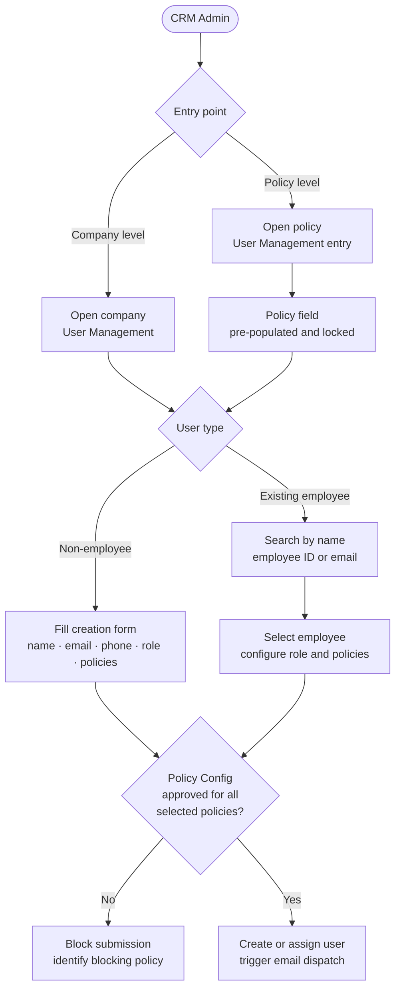
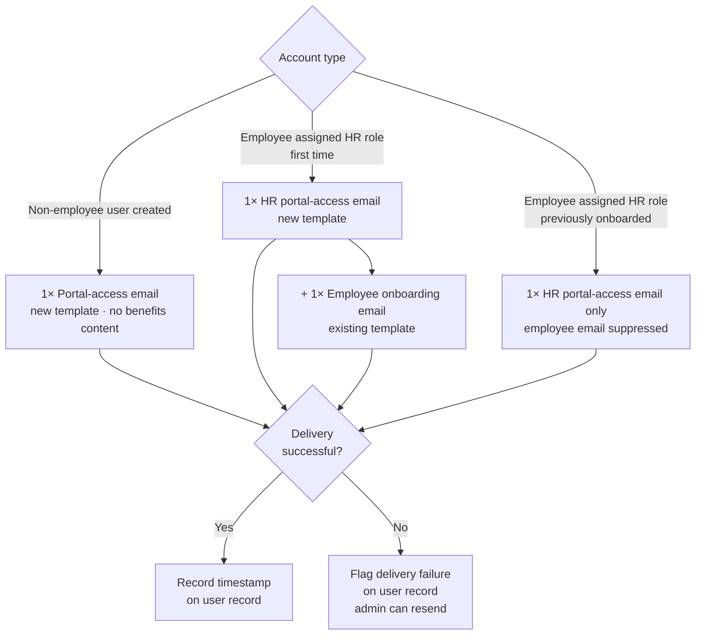
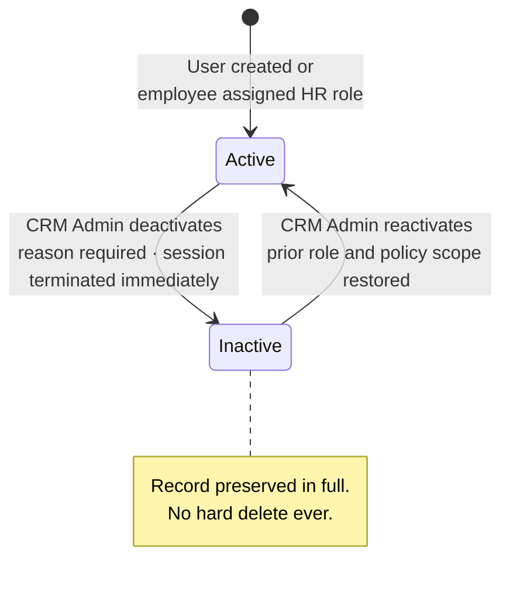

# PRD — User Management (HR Portal)

This document defines the product requirements for the User Management capability within the [HR Portal](../../../glossary.md#hr-portal) of the [Integrated Benefits Portal (IBP)](../../../glossary.md#ibp-integrated-benefits-portal). It is operated exclusively by the [IIRM CRM Admin](../../../glossary.md#crm-admin) on behalf of corporate clients and governs who can access a company's HR Portal, what role they carry, and which policies they can act upon. This document is read by product, engineering, and IIRM stakeholders who must sign off before implementation begins.

User Management is architecturally distinct from the [Inception / Endorsement process](../../../glossary.md#inception--endorsement-process) that creates employee accounts. This module handles two narrower concerns: granting existing company employees an HR role on top of their employee account, and provisioning entirely new portal users who have no employee record (contractors, consultants, external HR staff).

---

## Scope

### In Scope

- Viewing and searching all HR Portal users for a selected company
- Creating non-employee users (contractors, consultants, external HR staff) one at a time via form, within the iWork service flow
- Assigning an existing company employee to an HR role (dual-role provisioning)
- Policy-level user creation: initiating user creation from within a specific policy, with that policy auto-populated and locked in the form
- Controlling which policies a user can access — one policy, a subset, or all policies under a company ([Policy Access Scope](../../../glossary.md#policy-access-scope))
- Multi-company user support: one non-employee user can be assigned to multiple companies, with the same or different email addresses per engagement
- Editing user details: role, policy access scope, contact information
- Activating and deactivating users with immediate session effect (soft deactivation only — no hard delete)
- [Role](../../../glossary.md#role-hr-portal) management: CRM Admin defines new role types in the screen, including Health / Non-Health policy type mapping and access dimension configuration (Verticals, Departments, Branches, Cities, and other dimensions from Policy Configuration)
- CRM Admin-triggered password reset email for any user from within this module
- Differentiated email notifications by account type on user creation
- Gate validation: user creation for a policy is blocked until that policy's Configuration is in an approved state

### Out of Scope

The following are explicitly excluded from this module and handled elsewhere:

| Concern | Handled by |
|---|---|
| Employee account creation | Inception / Endorsement process |
| Authentication method configuration | IBP Portal Configuration module |
| Password policy rules | IBP Portal Configuration module |
| Employee self-service profile | Employee Portal modules |
| Bulk user import via CSV | Permanently out of scope — one user at a time via iWork service flow |
| Time-limited / auto-expiry access | Permanently out of scope — no such feature |
| User access audit log view | Reporting module |
| Self-service password reset | Existing IBP login screen reset flow (in production) |

### Dependencies

- **ibp-service** — company list, employee records for the assign-existing-employee path
- **Policy module** — policy list per company; "policy added" events for auto-extension of all-policy users
- **Policy Configuration module** — approval status per policy (gate check before user creation); access dimensions configured per policy (Verticals, Departments, Branches, Cities, and others)
- **IBP Portal Configuration module** — company-specific authentication method, used to determine invite email content and flow
- **auth-service** — account creation, credential setup, differentiated email template dispatch, session termination on deactivation, password reset email trigger

### Dependents

All HR Portal modules (Dashboard, Claims, Enrolment, Members, CD Management, Documents) receive user identity, role, and policy context from this module. A user without a valid active record here cannot access any HR Portal feature.

---

## Key Flows

### User Creation — Entry Points and Paths

The CRM Admin can enter user creation from two places and choose one of two user types. The policy configuration gate applies regardless of entry point or user type.

### Email Dispatch by Account Type

### User Status Lifecycle

---

## User Personas

### IIRM CRM Admin (Actor)

The CRM Admin is an IIRM staff member with master administrative rights across all corporate client accounts on the IBP platform. Within User Management, they always operate company-first — they select a company, then manage who can access that company's HR Portal. They can also enter this workflow from within a specific policy, in which case the policy context is pre-set and locked for that session.

The CRM Admin is not an end user of the HR Portal. They do not consume claims data, enrollment reports, or policy analytics. Their sole concern in this module is access governance: the right person, the right role, the right policy scope.

### Managed Users (Subjects)

These are the portal users whose accounts the CRM Admin creates or assigns. They fall into two structural categories.

**[Non-Employee Users](../../../glossary.md#non-employee-user)** are people with no employee record in the company — external consultants, contracted HR staff, client-side HR teams at partner sites, or any third party engaged to perform HR functions. They are created fresh in the system and receive portal-only credentials. They have no policy benefits, no coverage details, and no claims of their own. A single non-employee user can be assigned to multiple companies, using the same email address across all engagements or different email addresses per company.

**[Dual-Role Users](../../../glossary.md#dual-role-user)** are existing company employees who are also granted HR Portal access. They already have an employee account through the Inception/Endorsement process. This module adds an HR role on top of their existing identity. They receive both their employee benefits context and their HR admin access — communicated via two separate emails.

The specific role labels available for assignment are dynamically managed by the CRM Admin. The list is not hardcoded — new role types can be added as new company structures or client scenarios emerge, with permissions configured directly in the screen.

---

## Access Model

A user's effective scope within the HR Portal is the product of two independent configuration axes. Both must be in place before the user can act on any HR Portal data.

| Axis | What it controls | Configured on | Covered by |
|---|---|---|---|
| Policy Access Scope | Which policies the user can see and act upon — a single policy, a named subset, or All Policies for the company | Per user | US-HPUM-005 |
| Role access dimensions | Within any visible policy, which organisational slice the role permits — Verticals, Departments, Branches, Cities, and other dimensions loaded from Policy Configuration | Per role | US-HPUM-008 |

These axes are independent. Policy Access Scope determines *which* policies a user enters; role access dimensions determine *what* they can see and do within each of those policies. A change to either axis narrows or widens access independently of the other.

---

## User Stories

### Viewing Users

**US-HPUM-001** — As the CRM Admin, I want to view all portal users for a selected company so that I have a complete picture of who currently has HR Portal access and in what capacity.

Priority: High

**AC-HPUM-001-a:** Given I select a company that has IBP Portal access, when I open User Management for that company, then I see a list of all users with HR Portal access. The list shows the following columns per row: Name, Email, Role, Policy Access, Status (Active / Inactive), Date Added, Inactive Date, and Inactive Reason.

**AC-HPUM-001-b:** Given a user is active, when I view their row, then Inactive Date and Inactive Reason are blank. Given a user has been deactivated, when I view their row, then both fields are populated with the date and reason recorded at the time of deactivation.

**AC-HPUM-001-c:** Given no users have been provisioned for a company yet, when I land on the user list, then I see an empty state with a clear call-to-action to add the first user.

**AC-HPUM-001-d:** Given I want to locate a specific user, when I search by name or email address, then the list filters in real time to matching results without a full page reload.

---

### Creating a Non-Employee User (Company-Level Entry)

**US-HPUM-002** — As the CRM Admin, I want to create a new non-employee user for a company so that contractors or external HR staff can access the HR Portal without being part of the company's employee roster.

Priority: High
Traces to: US-IBP-BA-003, BR-IBP-AUTH-008

**AC-HPUM-002-a:** Given I am on the company user list, when I click "Add User" and select the non-employee path, then I see a creation form with the following fields: full name (required), email address (required), phone number (conditional mandatory based on the IBP Portal Configuration for login preference), role (required — dropdown from the active role list), and policy access (required — select specific policies multi select or "All Policies").

**AC-HPUM-002-b:** Given the selected policy does not have an approved Policy Configuration, when I attempt to submit the form, then the system blocks submission with a message identifying which policy's configuration is pending approval. The user cannot be created until the Policy Configuration is approved.

**AC-HPUM-002-c:** Given all selected policies have approved configurations and the form is complete, when I submit, then the system creates the account and sends a portal-access notification email to the new user. This email contains: a subject line referencing HR Portal access only, login instructions derived from the company's configured authentication method, and no policy benefit, coverage, or claims content of any kind.

**AC-HPUM-002-d:** Given I leave a required field empty or enter an invalid email format, when I attempt to submit, then the form surfaces inline validation errors field-by-field and does not submit until all required fields are valid.

**AC-HPUM-002-e:** Given a user with the same combination of full name, email address, and phone number already exists for this company, when I attempt to submit, then the form rejects the submission with a clear message identifying the duplicate and preventing a second record for the same person under the same company.

---

### Assigning an Existing Employee to an HR Role (Company-Level Entry)

**US-HPUM-003** — As the CRM Admin, I want to assign an existing company employee as an HR Portal user so that employees who also carry HR responsibilities receive the appropriate dual-role access without a separate account being created.

Priority: High
Traces to: US-IBP-DUAL-001, BR-IBP-AUTH-008

**AC-HPUM-003-a:** Given I am on the company user list, when I click "Add User" and select the existing-employee path, then I see an employee search interface where I can look up by name, employee ID, or email address.

**AC-HPUM-003-b:** Given I select an employee from search results, when I proceed to the assignment form, then I can configure: role (from the role list) and policy access scope (specific policies or "All Policies"). The employee's name and email are pre-filled and read-only.

**AC-HPUM-003-c:** Given the selected policy does not have an approved Policy Configuration, when I attempt to submit the assignment, then the system blocks submission and identifies which policy's configuration is pending approval.

**AC-HPUM-003-d:** Given all selected policies have approved configurations and the form is complete, when I submit the assignment, then the system triggers two separate emails to the user — one portal-access email for their new HR role (distinct subject and body, no benefits content) and the standard employee onboarding email for their employee account — each with its own independent subject line and body.

**AC-HPUM-003-e:** Given an employee was already sent an employee onboarding email in the past, when I assign them an HR role now, then only the HR portal-access email is sent. The employee email is not resent.

**AC-HPUM-003-f:** Given I search for an employee who has not yet been activated through the Inception/Endorsement process, when their record appears in results, then they are flagged as "Not yet activated" and the assignment action is disabled until their employee account is active.

---

### Creating or Assigning a User from within a Policy (Policy-Level Entry)

**US-HPUM-004** — As the CRM Admin, I want to initiate user creation or assignment directly from within a specific policy so that the user I add is automatically scoped to that policy without requiring me to configure it manually.

Priority: High
Traces to: Scope clarification — policy-level entry point

**AC-HPUM-004-a:** Given I navigate to a specific policy within a company and open User Management from that context, when the user creation form opens, then the policy field is pre-populated with the current policy name and is disabled — the admin cannot deselect or change it.

**AC-HPUM-004-b:** Given the source policy does not have an approved Policy Configuration, when the form opens, then the system blocks user creation entirely with a message stating the policy configuration must be approved first.

**AC-HPUM-004-c:** Given the policy field is locked and the policy configuration is approved, when I complete and submit the form, then the created or assigned user's access is restricted to that policy only.

**AC-HPUM-004-d:** Given I want to later expand the user's access to additional policies, when I locate the user in the company-level user list and open their record for editing, then the policy field becomes fully editable and I can add or remove policies freely.

---

### Policy Access Assignment

**US-HPUM-005** — As the CRM Admin, I want to control which policies a user can access — including across multiple companies for consultants — so that each user operates only within the scope of their responsibilities.

Priority: High
Traces to: BR-IBP-AUTH-005, US-IBP-BA-003

**AC-HPUM-005-a:** Given I am creating or editing a user at company level, when I configure policy access, then I can choose one of: a single policy, a manually selected subset of policies, or "All Policies" for that company.

**AC-HPUM-005-b:** Given I assign "All Policies" to a user, when a new policy is later added to the company, then the user automatically gains access to that new policy without any manual update from the CRM Admin.

**AC-HPUM-005-c:** Given I assign specific policies to a user, when I save, then the user can only access HR Portal features and data within those selected policies.

**AC-HPUM-005-d:** Given a non-employee user is already assigned to one company, when the CRM Admin fills the Add User form for a second company using the same full name, email address, and phone number, then the system recognises this as an existing user and creates a new company-level assignment record — no new account is created and the user's login credentials are unchanged. If the admin provides a different email address for the same person, the system treats it as a new user record; no system-level link is established between the two company engagements.

---

### Editing a User

**US-HPUM-006** — As the CRM Admin, I want to edit a user's role or policy access so that I can reflect changes in responsibilities without creating a new account.

Priority: High
Traces to: US-IBP-BA-003

**AC-HPUM-006-a:** Given I open a user's record from the company user list, when I change their role and save, then the new role permissions take effect on the user's next navigation or action within their active session. The session is not terminated and the user is not prompted to log out — the updated role is picked up at the next server round-trip.

**AC-HPUM-006-b:** Given I reduce a user's policy access (remove one or more policies), when I save, then the user immediately loses access to the deselected policies including any active session data scoped to those policies.

**AC-HPUM-006-c:** Given I expand a user's policy access (add one or more policies), when I save, then the user gains access to the new policies upon their next navigation or session refresh.

**AC-HPUM-006-d:** Given I open a user's record and the user has not yet created a password (account is pending activation), when I click "Edit", then all fields are editable: full name, email address, phone number, role, and policy access.

**AC-HPUM-006-e:** Given the user has already created a password (account is activated), when I view their record in edit mode, then full name, email address, and phone number are read-only. Only role and policy access can be changed.

**AC-HPUM-006-f:** Given I change a user's email address while their account is pending activation, when I save, then the new email becomes the login identity and the system dispatches a fresh portal-access invitation to the new address. The previously sent invitation is invalidated.

---

### Deactivating and Reactivating a User

**US-HPUM-007** — As the CRM Admin, I want to deactivate a user immediately so that their portal access is revoked without permanently removing their account or history.

Priority: High
Traces to: FR-IBP-AUTH-021, BR-IBP-AUTH-011

**AC-HPUM-007-a:** Given I select an active user and choose "Deactivate", when I confirm the action, then I am prompted to enter an Inactive Reason before the deactivation is saved.

**AC-HPUM-007-b:** Given I confirm deactivation with a reason, when it is saved, then the user's active session is terminated within seconds, they cannot log in again, and the user list row shows: Status = Inactive, Inactive Date = today's date, Inactive Reason = the reason entered.

**AC-HPUM-007-c:** Given a deactivated user attempts to log in, when they enter their credentials, then they see a message stating their account is inactive and directing them to contact their administrator. No session is created.

**AC-HPUM-007-d:** Given I want to restore access to a deactivated user, when I select "Activate" on their record and their previously assigned role still exists, then their account is reinstated with the same role and policy access they had prior to deactivation — no reconfiguration required. Inactive Date and Inactive Reason are cleared.

**AC-HPUM-007-e:** Given I attempt to reactivate a deactivated user whose previously assigned role has since been deleted, when I click "Activate", then the system blocks reactivation and displays a message stating that the user's role no longer exists and a new role must be assigned before the account can be reactivated. The record remains inactive until the admin selects a valid replacement role and saves.

---

### Role Management

**US-HPUM-008** — As the CRM Admin, I want to add and configure new roles from within the User Management screen so that I can accommodate new company structures and precisely control what each role can access across policy types and organisational dimensions.

Role Management is a sub-section of the User Management screen — tightly coupled because role configuration directly determines what the user creation form offers. It is not a separate settings page. Any CRM Admin can access it without additional permissions.

Priority: Medium
Traces to: OQ-HPUM-010 resolution

**AC-HPUM-008-a:** Given I am on the User Management screen, when I navigate to the Role Management sub-section, then I see a list of all currently defined roles showing role name, policy type access (Health / Non-Health / Both), and the access dimensions configured for each role.

**AC-HPUM-008-b:** Given I am in the Role Management sub-section, when I click "Add Role", then I see a form with the following configuration areas:
- Role name (required) and description (optional)
- Policy type access: Health policies, Non-Health policies, or both
- Access dimensions: the set of dimensions available is drawn dynamically from the Policy Configuration for the relevant policies (e.g., Verticals, Departments, Branches, Cities, and any other dimensions configured). The admin selects which dimension values this role can access.

**AC-HPUM-008-c:** Given I save a new role, when I next open the user creation or edit form, then the new role appears in the role dropdown and is available for assignment.

**AC-HPUM-008-d:** Given I attempt to delete a role that is currently assigned to one or more users (active or inactive), when I try to delete, then the system blocks the deletion and shows the count of users assigned to that role with guidance to reassign or deactivate them first.

**AC-HPUM-008-e:** Given I rename an existing role, when I save, then all users currently assigned to that role reflect the updated role name immediately — no reassignment is needed.

**AC-HPUM-008-f:** Given the Policy Configuration has not been approved for the policies linked to a role, when I attempt to use that role in user creation, then the system flags the role as unavailable until the policy configuration is approved.

---

### Email Notifications

**US-HPUM-009** — As the CRM Admin, I want the system to send the correct type of email to each new user based on their account type so that non-employee users are not confused by policy or benefit content that does not apply to them.

Priority: High
Traces to: OQ-HPUM-008 resolution

**AC-HPUM-009-a:** Given a non-employee user is created, when their account is set up, then the system sends exactly one email: a portal-access email (new template — to be designed). This email has a subject referencing HR Portal access, contains login instructions based on the company's configured authentication method, and contains no policy coverage, benefit, claims, or premium content.

**AC-HPUM-009-b:** Given an employee is assigned an HR role for the first time, when the assignment is saved, then the system sends two separate emails — the HR portal-access email (new template — to be designed) and the existing employee onboarding email. These are distinct sends with independent subjects and bodies, never merged.

**AC-HPUM-009-c:** Given an employee was already sent their employee onboarding email in a prior session, when they are subsequently assigned an HR role, then only the HR portal-access email is sent. The employee email is suppressed to avoid duplication.

**AC-HPUM-009-d:** Given any email fails to deliver, when delivery fails, then the user's record in the admin list is flagged with a delivery failure indicator, and the CRM Admin can manually trigger a resend to one user or all the failed users.

---

### Sending a Password Reset Email

**US-HPUM-010** — As the CRM Admin, I want to trigger a password reset email for any user from within this module so that I can assist users who cannot complete the self-service reset on the login screen.

Priority: High
Traces to: OQ-HPUM-006 resolution

**AC-HPUM-010-a:** Given I open a user's record within a company context, when I click "Send Reset Email", then the system dispatches a password reset email to the email address registered for that user under the current company context — not to any email address the same user may hold under a different company engagement.

**AC-HPUM-010-b:** Given the reset email is sent successfully, when I view the user record, then I see a timestamp of the last reset email sent.

**AC-HPUM-010-c:** Given the user's email address is unreachable or invalid, when the email fails to deliver, then the admin sees a delivery failure indicator on the user record.

---

## Business Rules

**BR-HPUM-001 — Policy field context lock**
When user creation is initiated from within a policy screen, the policy field in the user creation form is pre-populated with that policy and is non-editable for the duration of that creation flow. To extend the user's access to additional policies, the admin must edit the user from the company-level user list.

- *Example:* Admin opens the GMC policy for TCS → clicks Add User → creates a new consultant. The policy field shows "GMC" and cannot be changed.
- *Edge case:* If the source policy is cancelled or removed from the company after the user is created, the CRM Admin receives a notification (see BR-HPUM-009) and must take manual action.

**BR-HPUM-002 — "All Policies" auto-extension**
A user assigned "All Policies" access automatically receives access to any new policy added to the company in the future. The CRM Admin does not need to manually update the user record.

- *Example:* User is set to "All Policies" when the company has GMC and GPA. GTL is later added. The user gains GTL access without any admin action.
- *Edge case:* If the admin later switches the user to a specific subset, the auto-extension behaviour stops and only the explicitly selected policies apply.

**BR-HPUM-003 — Differentiated emails by account type**
Three distinct email types exist. They must never be merged or substituted.

| Scenario | Emails sent | Template ownership |
|---|---|---|
| New non-employee user created | 1 × portal-access email | Product & UX Team |
| Employee assigned HR role (first time) | 1 × HR portal-access email + 1 × employee onboarding email | HR email: Product & UX Team; employee email: exists |
| Employee assigned HR role (previously onboarded) | 1 × HR portal-access email only | Product & UX Team |

- *Edge case:* If either email in a dual-send fails to deliver, both failures are flagged independently on the user record. The admin can resend each type separately.

**BR-HPUM-004 — Role deletion protection**
A role cannot be deleted while any user — active or inactive — is assigned to it. The admin must reassign or remove all users from that role before deletion is permitted.

- *Example:* "Consultant HR" has 2 active users and 1 inactive user. Deletion is blocked with: "3 users are assigned to this role."
- *Edge case:* Deactivated users still count toward the block. The count shown includes all users regardless of status.

**BR-HPUM-005 — Immediate session termination on deactivation**
Deactivating a user terminates their active portal session immediately, with no grace period. The CRM Admin must provide an Inactive Reason before the deactivation is saved. The event is logged with a timestamp and the admin's identity.

- *Example:* HR Manager Priya is reviewing the claims dashboard when her account is deactivated. Her session ends within seconds and she is redirected to the login screen.
- *Edge case:* If session termination cannot be confirmed remotely due to a network issue, the account is flagged as "pending deactivation" until confirmed. No new sessions can be created in the interim.

**BR-HPUM-006 — Employee accounts are not created here**
This module does not create employee accounts. Employee identity in the IBP comes exclusively from the Inception/Endorsement process. The assign-existing-employee path only grants an additional HR role to an employee who already has an active IBP account. Searching for a not-yet-activated employee surfaces a "not yet activated" indicator and blocks the assignment.

- *Edge case:* If an employee's account is deactivated after being assigned an HR role, both their employee access and HR role access are revoked simultaneously. The HR role record is preserved but marked inactive.

**BR-HPUM-007 — Policy Configuration approval gate**
A user cannot be created or assigned to a policy until that policy's Configuration has been approved. This check applies regardless of the entry point (company-level or policy-level). If the Policy Configuration is pending, in draft, or rejected, the system blocks user creation for that policy and surfaces a clear message identifying the blocking policy.

- *Example:* Company has GMC (approved configuration) and GPA (configuration pending). Admin tries to create a user with access to both. System blocks and states: "GPA policy configuration is not yet approved. User cannot be created until all selected policies have approved configurations."
- *Edge case:* If a policy's configuration is revoked after a user has already been created for it, the CRM Admin is notified (see BR-HPUM-009). The existing user's access is not automatically removed — the admin decides.

**BR-HPUM-008 — Multi-company user identity**
A non-employee user can be assigned to multiple companies. The uniqueness key across the entire system is the combination of full name + email address + phone number. When this combination matches an existing user record, the system links the new company assignment to that user rather than creating a duplicate account. If any element of the combination differs — most commonly the email address — the system creates a fresh, independent user record with no link to any prior engagement. Each company assignment is managed independently by its own CRM Admin context; no company can see another company's assignments for the same person.

- *Example:* Consultant Ramesh (ramesh@abc.com, 9876543210) is active at TCS. The Wipro CRM Admin adds "Ramesh" with the same email and phone — the system links it as the same user. Wipro sees Ramesh in their list; TCS still sees him in theirs.
- *Edge case:* If Ramesh uses ramesh@wipro.com at Wipro and ramesh@abc.com at TCS, the system creates two independent records. Deactivating one has no effect on the other. Deactivation is always company-scoped.

**BR-HPUM-009 — Policy removal triggers CRM Admin email notification**
When a policy is cancelled or removed from a company, the CRM Admin receives an email notification listing all users whose policy access is affected. The notification is sent by email only — there is no in-app alert. The admin then decides whether to reassign those users to other policies or deactivate them. No automatic access change is made.

- *Example:* GTL policy is removed from TCS. 3 users have GTL-only access and 1 user has GTL as part of a multi-policy assignment. The CRM Admin is notified with a list of all 4 users and prompted to take action.
- *Edge case:* If a user had "All Policies" and GTL is removed, their "All Policies" flag remains intact but they no longer have GTL access — consistent with BR-HPUM-002.

**BR-HPUM-010 — Deactivation is the only removal method**
User records are never hard-deleted from the system. Deactivation sets a status flag in the database. All historical data, role configuration, and policy assignments are preserved. This applies to both non-employee users and employee HR role assignments.

- *Example:* A consultant's contract ends. The admin deactivates their account. The record remains visible in the user list with Status = Inactive, preserving the full audit trail.
- *Edge case:* A deactivated user can be reactivated at any time, restoring their prior role and policy configuration without reconfiguration.

**BR-HPUM-011 — Contact field editability is pre-activation only**
Full name, email address, and phone number are editable only while the user has not yet created a password. Once the user activates their account by setting a password, these fields become read-only for the CRM Admin. Role and policy access remain editable regardless of activation status.

Changing the email address before activation updates the login identity. The system automatically invalidates the prior invitation and sends a fresh portal-access email to the corrected address — the CRM Admin does not need to manually trigger a resend.

- *Example:* Admin creates a consultant with email "ramesh@acme.con" (typo). Before Ramesh sets his password, the admin corrects it to "ramesh@acme.com". The old invite link expires and a new one goes to the corrected address.
- *Edge case:* If the user has already clicked their invite link and set a password, the email field is locked. The admin cannot change the login identity from this screen; this would require a process outside the current module scope.

---

## Data Contract

### Consumed by this module

| Data | Source |
|---|---|
| List of companies with IBP Portal access | ibp-service |
| Employee records per company (name, ID, email, activation status) | ibp-service / Inception process |
| Policy list per company | Policy module |
| Policy Configuration approval status per policy | Policy Configuration module |
| Access dimensions per policy (Verticals, Departments, Branches, Cities, others) | Policy Configuration module |
| "Policy added" events (for auto-extension of All-Policies users) | Policy module (event stream) |
| "Policy removed" events (for CRM Admin notification) | Policy module (event stream) |
| Company authentication method configuration | IBP Portal Configuration module |
| Role permission scope definitions | auth-service |

### Produced by this module

| Data | Consumed by |
|---|---|
| Non-employee user records (role, policy scope, company assignment, status) | auth-service, all HR Portal modules |
| Employee-to-HR role assignment records | auth-service, all HR Portal modules |
| Role definitions (name, description, policy type access, access dimensions) | auth-service, user creation forms |
| Account creation events → email dispatch | auth-service |
| Session termination events on deactivation | auth-service |
| Password reset email trigger events | auth-service |
| Email delivery failure flags | Admin UI (surfaced on user record) |

### Cross-module contracts surfaced

- **auth-service** must support three independent email template types: portal-access-only (non-employees), employee-onboarding (existing template), and an HR portal-access email for dual-role users. It must be able to dispatch both the portal-access and employee-onboarding emails in a single admin action for dual-role provisioning.
- **Policy module** must publish structured events for both "policy added" (for BR-HPUM-002 auto-extension) and "policy removed" (for BR-HPUM-009 admin notification).
- **Policy Configuration module** must expose an approval status endpoint per policy, consumed as a gate check before user creation proceeds.

---

## Open Questions

All 14 open questions (OQ-HPUM-001 through OQ-HPUM-014) have been resolved. Resolutions are incorporated directly into the relevant user stories and business rules above. No open items remain for this PRD.

---

## Approval

Approved by:
Role:
Date:

Approved by:
Role:
Date:
