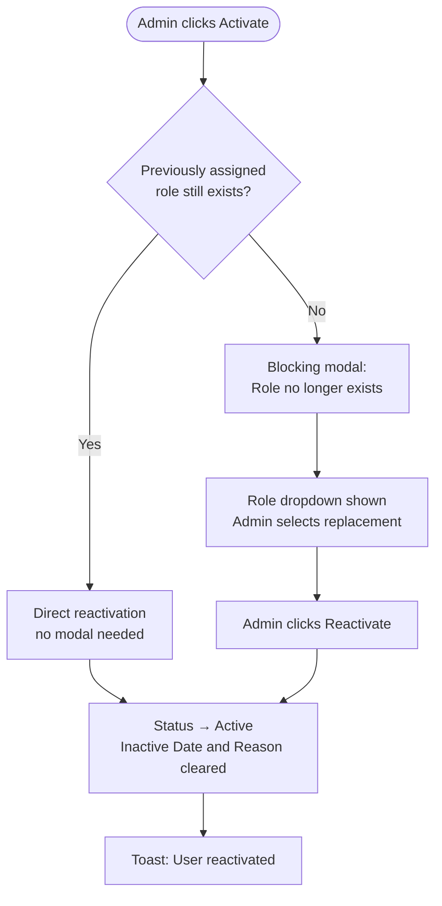

# HR Portal – User Management – Software Design Specification (SDS)

> **APPROVAL GATE BYPASSED** — PRD has 0 of 2 required approvals at time of SDS generation. This document is produced at the author's risk. Formal PRD approval should be obtained before implementation begins.

**Document Version:** 1.0
**Date:** 2026-05-04
**Author:** IIRM Engineering Team
**Related Documents:**
- PRD: `hr-portal-user-management-PRD.md`
- TRD: `hr-portal-user-management-TRD.md` (pending)

---

## 1. Overview

This document describes the UI layout, component behaviour, data field mappings, and interaction patterns for the IBP User Management module within iWork. It is the implementation companion to the PRD and should be read alongside the TRD for API and database-level detail.

| Concern | Owner |
|---|---|
| Business rules, acceptance criteria, scope | PRD |
| Screen layouts, field definitions, interaction flows, data mappings | SDS (this document) |
| API contracts, database schema, session management, integration design | TRD |

Any new field, screen, or interaction added here must trace to a PRD user story or business rule. Free-floating UI additions are not permitted.

---

## 2. Information Architecture

### 2.1 Location in iWork

User Management lives at: **iWork → Admin Module → IBP User Management**

### 2.2 Entry Points

Three entry points exist. All three open the same User Management screen but with different pre-set context, which affects form field behaviour.

| Entry Point | Company pre-set | Policy pre-set | Policy field in forms |
|---|---|---|---|
| Admin Module → IBP User Management (standalone) | No — admin selects from dropdown | No | Editable |
| Company → IBP Portal Config | Yes — locked | No | Editable |
| Policy context (from within a policy in IBP Portal Config or Policy screen) | Yes — locked | Yes — locked | Non-editable |

### 2.3 Routes

| Route | Description |
|---|---|
| `/iwork/admin/ibp-user-management` | Landing — company selector shown, no user list |
| `/iwork/admin/ibp-user-management?companyId={id}` | Company-scoped user list (Users tab default) |
| `/iwork/admin/ibp-user-management?companyId={id}&tab=roles` | Role Management sub-section |
| `/iwork/admin/ibp-user-management?companyId={id}&policyId={id}` | Policy-scoped entry — policy field locked in all forms |

### 2.4 Breadcrumbs

| Entry point | Breadcrumb trail |
|---|---|
| Standalone | Admin Module > IBP User Management |
| From IBP Portal Config | Admin Module > Companies > {Company Name} > IBP Portal Config > User Management |
| From Policy context | Admin Module > Companies > {Company Name} > Policies > {Policy Name} > User Management |

### 2.5 Screen Inventory

| Screen | Purpose | PRD Ref |
|---|---|---|
| S1 — User Management Landing | Company selector + user list | US-HPUM-001 |
| S2 — Add User: Non-Employee | Create a new non-employee user | US-HPUM-002, US-HPUM-004 |
| S3 — Add User: Existing Employee | Assign HR role to an existing employee | US-HPUM-003, US-HPUM-004 |
| S4 — Edit User | Edit user details (field availability depends on activation state) | US-HPUM-006 |
| S5 — Deactivate / Reactivate | User lifecycle management | US-HPUM-007 |
| S6 — User Detail / Password Reset | View record; trigger password reset email | US-HPUM-010 |
| S7 — Role Management | View, add, edit, and delete roles | US-HPUM-008 |

---

## 3. Screen 1 — User Management Landing

### 3.1 Page Header

| Element | Value |
|---|---|
| Page title | "IBP User Management" |
| Left sidebar | Admin Module item highlighted as active |

### 3.2 Company Selector

A full-width dropdown at the top of the page. Required before the user list or any action is shown.

| Element | Detail |
|---|---|
| Label | "Company" |
| Placeholder | "Select a company…" |
| Source | All companies with IBP Portal access |
| On selection | User list loads for that company; URL updates to `?companyId={id}` |
| Pre-selection | When entered from IBP Portal Config or Policy context, company is pre-selected and the dropdown is read-only |

### 3.3 Tab Bar

Two tabs appear once a company is selected.

| Tab | Default | URL suffix |
|---|---|---|
| Users | Active | (none) |
| Roles | — | `&tab=roles` |

### 3.4 User List (Users Tab)

#### 3.4.1 Section Controls

| Element | Detail |
|---|---|
| Search input | Placeholder: "Search by name or email…"; filters list in real time |
| Record count | "{n} users" — updates as search filters |
| "Add User" button | Top-right; opens user type selection modal |

#### 3.4.2 Table Columns

| Column | Source | Notes |
|---|---|---|
| Name | `ibp_portal_user.full_name` | Clickable — opens User Detail / Edit (S4/S6) |
| Email | Company-context email for this user | Not the global email if user has different emails per company |
| Role | `ibp_user_role.name` | — |
| Policy Access | Derived: "All Policies" or policy name list | Max 2 names visible; "+{n} more" chip for overflow |
| Status | `ibp_company_user.status` | Badge: see §3.4.3 |
| Date Added | `ibp_company_user.created_at` | DD MMM YYYY |
| Inactive Date | `ibp_company_user.deactivated_at` | "—" when status is Active or Pending Activation |
| Inactive Reason | `ibp_company_user.deactivation_reason` | "—" when status is Active or Pending Activation |
| Actions | — | "…" menu: Edit, Deactivate / Activate, Send Reset Email |

#### 3.4.3 Status Badge Rules

| Status value | Badge label | Colour |
|---|---|---|
| `pending_activation` | Pending Activation | Amber |
| `active` | Active | Green |
| `inactive` | Inactive | Red |

#### 3.4.4 Default Sort

Most recently added first (`ibp_company_user.created_at DESC`).

#### 3.4.5 Search Behaviour

Client-side filter on `full_name` and `email`. Case-insensitive, partial match.

#### 3.4.6 Empty State

When no users are provisioned for the selected company:

- Text: "No users have been added yet."
- CTA button: "Add First User" — same behaviour as "Add User".

#### 3.4.7 Add User — Type Selection Modal

Clicking "Add User" opens a modal with two options before any form appears.

| Option | Description |
|---|---|
| Create Non-Employee User | For contractors, consultants, external HR staff with no employee record |
| Assign Existing Employee | For employees who need an additional HR role |

Selecting either option closes the modal and opens the respective form.

---

## 4. Screen 2 — Add User: Non-Employee Path

PRD reference: [US-HPUM-002](hr-portal-user-management-PRD.md#creating-a-non-employee-user-company-level-entry), [US-HPUM-004](hr-portal-user-management-PRD.md#creating-or-assigning-a-user-from-within-a-policy-policy-level-entry)

### 4.1 Form Fields

| Field | Type | Required | Conditional rule |
|---|---|---|---|
| Full Name | Text input | Yes | — |
| Email Address | Text input | Yes | Becomes the login identity |
| Phone Number | Text input | Conditional | Mandatory when IBP Portal Config login method = OTP / 2FA; optional otherwise |
| Role | Dropdown | Yes | Populated from active roles for this company; see §4.3 |
| Policy Access | Multi-select + "All Policies" toggle | Yes | Hidden when policy-level entry is active (replaced by locked policy field) |
| Policy (context field) | Read-only label | Conditional | Visible only on policy-level entry; shows locked policy name; replaces Policy Access multi-select |

### 4.2 Policy Field Behaviour by Entry Point

| Entry point | Policy Access field | Policy (context) field |
|---|---|---|
| Standalone or IBP Portal Config | Multi-select shown and editable | Hidden |
| Policy context | Hidden | Shown — pre-populated, non-editable |

### 4.3 Role Dropdown Edge Case

If no roles are configured for the company yet, the role dropdown displays: "No roles available — add a role in the Roles tab" with a hyperlink navigating to S7.

### 4.4 Validation

| Condition | Error behaviour |
|---|---|
| Required field empty | Inline error below the field on blur and on submit |
| Invalid email format | Inline error: "Enter a valid email address" |
| Name + Email + Phone matches an existing user in this company | Form-level error on submit: "A user with these details already exists for this company." |
| Selected policy has unapproved Policy Configuration | Submit blocked; error: "{Policy Name} policy configuration is not yet approved. User cannot be created until all selected policies have approved configurations." |

### 4.5 Submit Behaviour

On successful submit:
- Account created with status `pending_activation`
- Portal-access email dispatched to new user (new template, no policy/benefits content)
- Admin returned to user list (S1)
- Toast: "User created. An access invitation has been sent to {email}."

---

## 5. Screen 3 — Add User: Existing Employee Path

PRD reference: [US-HPUM-003](hr-portal-user-management-PRD.md#assigning-an-existing-employee-to-an-hr-role-company-level-entry)

### 5.1 Employee Search

| Element | Detail |
|---|---|
| Placeholder | "Search by name, employee ID, or email…" |
| Minimum characters | 2 before search triggers |
| Debounce | 300 ms |
| Source | Employee records for the selected company via ibp-service |

### 5.2 Search Results

Each result row shows Name, Employee ID, Email, and an activation status indicator.

| Status | Indicator | Selectable |
|---|---|---|
| Active employee account | None | Yes |
| Not yet activated | Amber badge: "Not yet activated" | No — row is visually dimmed and click is disabled |

### 5.3 Assignment Form

Appears below the search results after an employee is selected.

| Field | Type | Required | Pre-filled | Editable |
|---|---|---|---|---|
| Full Name | Display text | — | From employee record | No |
| Email | Display text | — | From employee record | No |
| Role | Dropdown | Yes | — | Yes |
| Policy Access | Multi-select + "All Policies" toggle | Yes | — | Yes |

Policy Configuration gate applies identically to the non-employee path (§4.4).

### 5.4 Submit Behaviour

On successful submit:
- HR role assigned to employee's existing account
- Email dispatch per [BR-HPUM-003](hr-portal-user-management-PRD.md#br-hpum-003): one or two emails depending on prior onboarding state
- Admin returned to user list
- Toast: "HR access granted to {Name}."

---

## 6. Screen 4 — Edit User

PRD reference: [US-HPUM-006](hr-portal-user-management-PRD.md#editing-a-user), [BR-HPUM-011](hr-portal-user-management-PRD.md#br-hpum-011)

Accessed by clicking the user's name in the list, or selecting "Edit" from the "…" actions menu.

### 6.1 Field Editability by Activation State

| Field | Pending Activation | Active or Inactive |
|---|---|---|
| Full Name | Editable | Read-only |
| Email Address | Editable | Read-only |
| Phone Number | Editable | Read-only |
| Role | Editable | Editable |
| Policy Access | Editable | Editable |

A contextual note is displayed below the form header when in pre-activation state: "This user has not yet set a password. All fields are editable."

When post-activation: "Contact information is locked after account activation. Only role and policy access can be changed."

### 6.2 Email Change Behaviour (Pre-Activation Only)

When the email address is edited and saved:
- Login identity updated to the new email
- Previously sent invitation link invalidated
- Fresh portal-access invitation dispatched automatically to the new address
- Toast: "Email updated. A new access invitation has been sent to {new email}."

### 6.3 Role Change — Active Session Behaviour

Permission changes from a role edit apply on the user's next navigation or server round-trip within their active session. The session is not terminated and the user is not notified.

---

## 7. Screen 5 — Deactivate / Reactivate

PRD reference: [US-HPUM-007](hr-portal-user-management-PRD.md#deactivating-and-reactivating-a-user), [BR-HPUM-005](hr-portal-user-management-PRD.md#br-hpum-005)

### 7.1 Deactivation Flow

Triggered from "Deactivate" in the "…" actions menu.

| Step | UI Element | Detail |
|---|---|---|
| 1 | Confirmation modal | Title: "Deactivate {User Name}?" |
| 2 | Inactive Reason field | Required text input within the modal. "Deactivate" button remains disabled until a reason is entered. |
| 3 | Confirm button | "Deactivate" — destructive styling (red) |
| 4 | Cancel button | Dismisses modal without action |

On confirmation:
- `ibp_company_user.status` → `inactive`
- `deactivated_at` = current timestamp; `deactivation_reason` = entered text; `deactivated_by` = CRM Admin user ID
- Active session terminated within seconds
- User list row updates in place
- Toast: "User deactivated. Their session has been terminated."

### 7.2 Reactivation Flow

Triggered from "Activate" in the "…" actions menu on an Inactive record.

The flow branches depending on whether the user's previously assigned role still exists.

Blocking modal copy: "This user's role ({role name}) no longer exists. Select a new role to reactivate this user."

---

## 8. Screen 6 — User Detail / Password Reset

PRD reference: [US-HPUM-010](hr-portal-user-management-PRD.md#sending-a-password-reset-email)

This view is the same as S4 but for post-activation users, where contact fields are read-only. The password reset action is available here.

### 8.1 Password Reset Section

Displayed at the bottom of the user detail panel.

| Element | Detail |
|---|---|
| Button | "Send Reset Email" |
| Inline confirmation | "Send a password reset email to {email}?" — Confirm / Cancel |
| Post-send state | Button disabled; label: "Reset Email Sent"; timestamp: "Last reset email sent: {DD MMM YYYY HH:MM}" |
| Delivery failure indicator | Amber warning icon on user list row and on detail view: "Last reset email failed to deliver" |

### 8.2 Multi-Company Email Targeting

The reset email always goes to the email address registered for this user under the currently selected company context. If the same user has a different email under another company, that other email is never used from this screen.

---

## 9. Screen 7 — Role Management

PRD reference: [US-HPUM-008](hr-portal-user-management-PRD.md#role-management)

Accessed via the "Roles" tab in the User Management tab bar. Accessible to any CRM Admin — no elevated permission required.

### 9.1 Role List

#### 9.1.1 Section Controls

| Element | Detail |
|---|---|
| Tab title | "Roles" |
| "Add Role" button | Top-right |
| Record count | "{n} roles" |

#### 9.1.2 Table Columns

| Column | Source | Notes |
|---|---|---|
| Role Name | `ibp_user_role.name` | Clickable — opens role edit form |
| Description | `ibp_user_role.description` | "—" if empty |
| Policy Type | `ibp_user_role.policy_type` | "Health", "Non-Health", or "Both" |
| Access Dimensions | Configured dimension names | Comma-separated; "+{n} more" chip for overflow |
| Users Assigned | Count of all users with this role (active + inactive) | Integer |
| Actions | — | "…" menu: Edit, Delete |

#### 9.1.3 Role Deletion Guard

| Condition | Behaviour |
|---|---|
| Role has ≥ 1 assigned users (active or inactive) | Blocking modal: "Cannot delete {role name}. {n} user(s) are assigned to this role, including inactive users. Reassign or deactivate all users before deleting." Dismiss only — no force-delete. |
| Role has 0 users assigned | Confirmation modal: "Delete {role name}? This cannot be undone." — Delete (red) / Cancel |

### 9.2 Add / Edit Role Form

A form panel (drawer or dedicated sub-view — layout TBD by design team).

#### 9.2.1 Form Fields

| Field | Type | Required | Notes |
|---|---|---|---|
| Role Name | Text input | Yes | Must be unique within the company's role list |
| Description | Textarea | No | — |
| Policy Type Access | Checkbox group | Yes | "Health Policies" / "Non-Health Policies" — at least one must be selected |
| Access Dimensions | Dynamic multi-select | Yes (at least one) | Options loaded from Policy Configuration of all approved policies for the company |

#### 9.2.2 Access Dimensions Availability

Dimension options are dynamically populated from `policy_configuration.dimensions` for policies with `status = 'approved'`. May include Verticals, Departments, Branches, Cities, and any custom dimensions configured.

If no policies have an approved configuration, the field displays: "No dimensions available — at least one policy configuration must be approved before a role can be configured."

#### 9.2.3 Submit Behaviour

On save:
- Role immediately available in role dropdowns on S2, S3, S4
- Role list in S7 updates in place
- Toast: "Role '{role name}' saved."

---

## 10. Navigation Behaviour

| Interaction | Behaviour |
|---|---|
| Select company from dropdown | URL updates; user list loads; tab bar appears |
| Click "Users" tab | Shows user list; default active tab |
| Click "Roles" tab | Shows role list; URL: `&tab=roles` |
| Click user name in list | Opens S4 / S6 (Edit User / User Detail) |
| Click "Add User" | Opens user type selection modal |
| "Back" from S2 / S3 / S4 | Returns to user list with company (and policy if set) context preserved |
| Enter from IBP Portal Config | Company pre-selected; company dropdown read-only |
| Enter from Policy context | Company + policy pre-selected; policy field locked in S2 / S3 |
| Switch company in standalone view | All context resets; user list and role list reload for new company |
| Switch tab while company is selected | Company context is preserved; tab content loads |

---

## 11. Schema Notes

Authoritative field names and constraints are in the TRD. These notes are informational only.

| Note | Detail |
|---|---|
| Activation state | `ibp_company_user.status` enum: `pending_activation` (created, password not yet set), `active`, `inactive` |
| User identity uniqueness key | `full_name + email + phone` combination. Within a company: duplicate → blocked. Across companies: match → linked assignment, no new account. |
| Company-scoped email | `ibp_company_user.email` — the email for this specific company engagement. A user may have different emails under different companies. All operations use the company-context email. |
| Deactivation fields | `ibp_company_user.deactivated_at` (timestamp), `ibp_company_user.deactivation_reason` (text), `ibp_company_user.deactivated_by` (admin user ID) |
| Reactivation role check | On reactivation, system checks that `ibp_company_user.role_id` still exists in `ibp_user_role`. If not found, reactivation is blocked (see §7.2). |
| Policy Configuration gate | `policy_configuration.status = 'approved'` checked at form submit time for each selected policy. Not enforced on form load. |
| "All Policies" flag | Boolean flag on `ibp_company_user.all_policies`. When `true`, new policies added to the company are automatically included; no record update required. |
| Password reset targeting | Reset email uses `ibp_company_user.email` for the current company context, not any global user email. |
| Role deletion protection | `ibp_user_role` deletion is blocked at the application layer if any `ibp_company_user.role_id` references it, regardless of the user's active/inactive status. |

---

# END OF SDS
