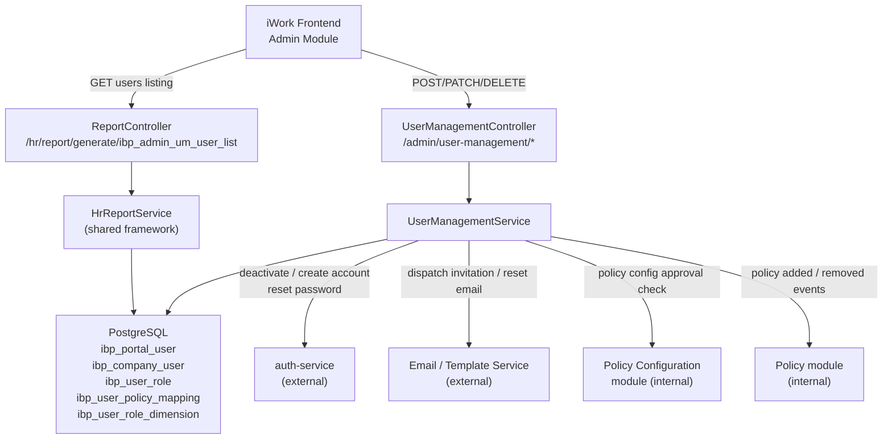
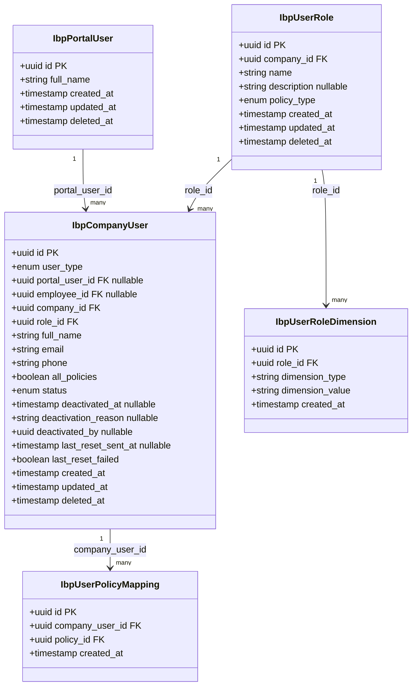
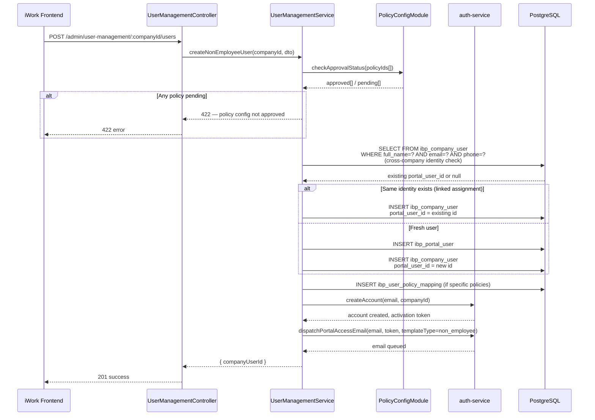
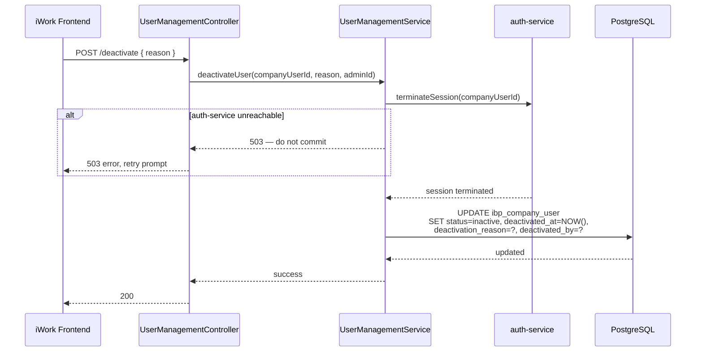
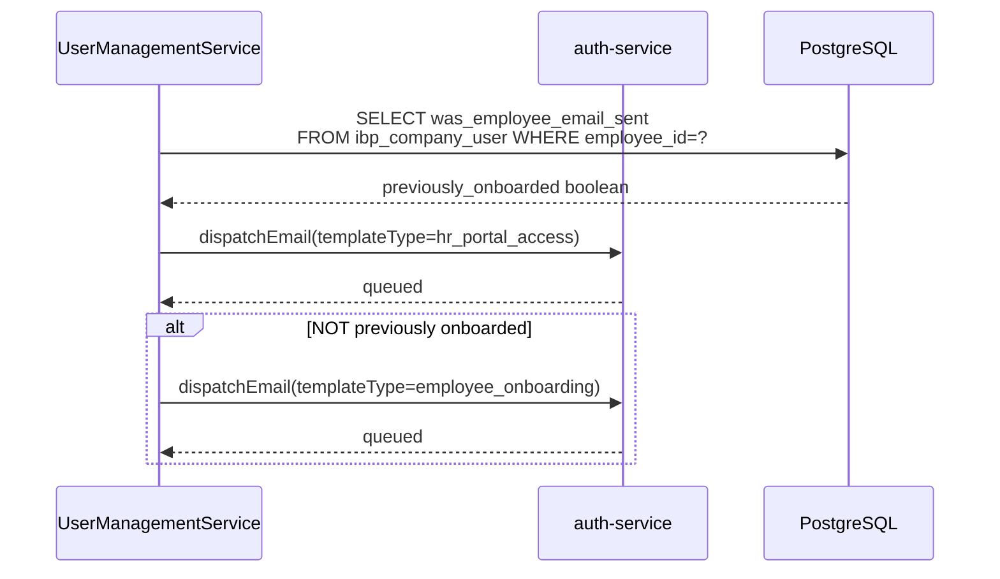

# TRD — User Management (HR Portal)

> **APPROVAL GATE BYPASSED** — PRD has 0 of 2 required approvals at time of TRD generation. This document is produced at the author's risk. Formal PRD approval must be obtained before implementation begins.

**Document Version:** 1.0
**Date:** 2026-05-04
**Author:** IIRM Engineering Team
**Related Documents:**
- PRD: `hr-portal-user-management-PRD.md`
- SDS: `hr-portal-user-management-SDS.md`
- Framework Reference: `../hr-module-report-framework-tech-spec.md`

This document is the authoritative technical design for the User Management module of the IBP HR Portal, implemented within `ibp-service`. It translates the product behavior contract in the PRD and the screen specification in the SDS into a design that developers can build from without daily clarifications. Every backend and frontend developer touching this module must read this document before writing a line of code.

---

## 1. Scope

### In Scope

- All database entities, relationships, and migration scripts for user, role, and policy-access records
- All API endpoints exposed by `ibp-service` for the iWork Admin Module frontend to consume
- The user listing query, served via the HR Module Report Framework (read path)
- CRUD endpoints for user creation, assignment, editing, deactivation, reactivation, and password reset (write path)
- Role management endpoints: create, edit, delete, list
- The uniqueness resolution algorithm for multi-company non-employee user identity
- Session termination integration with `auth-service` on deactivation
- Email dispatch integration with `auth-service` for portal-access invitations and password reset
- Policy Configuration approval gate enforcement
- Pre-activation vs. post-activation field editability enforcement
- The `all_policies` auto-extension contract with the Policy module

### Non-Goals

- Authentication method configuration — IBP Portal Configuration module
- Employee account creation — Inception / Endorsement process
- Self-service password reset — existing login screen flow
- Bulk user import — permanently out of scope
- Audit log screen — Reporting module
- Any HR Portal frontend module beyond User Management (Dashboard, Claims, Enrolment, etc.)

---

## 2. Architecture Overview

User Management is a NestJS feature module within `ibp-service`, sitting alongside the HR report modules, CD Management, and the shared auth guard. It is not a standalone service — it shares the same PostgreSQL database, TypeORM connection pool, and auth middleware as the rest of `ibp-service`.

The module is split into two execution paths:

**Read path** — The user listing is served via the shared HR Module Report Framework (see `hr-module-report-framework-tech-spec.md`). This gives the listing consistent pagination, search, and the standard response envelope used by all other HR modules. The report key `ibp_admin_um_user_list` is seeded via migration and executed by `HrReportService`.

**Write path** — All mutations (create, assign, edit, deactivate, reactivate, reset-password, role CRUD) use dedicated RESTful endpoints on a `UserManagementController`. These endpoints enforce business rules that cannot be expressed in a read-only SQL query: the Policy Configuration approval gate, the pre-activation editability guard, the role-deletion protection check, and the multi-company identity resolution algorithm.

This split was chosen over a fully custom solution because: (a) the read path benefits immediately from the framework's pagination, filter substitution, and response envelope without additional code; (b) the write path requires transaction management, external service calls, and guard logic that the report framework is not designed to handle.



---

## 3. Data Model

The module introduces five new tables. Employee records already exist in the IBP system via the Inception / Endorsement process and are consumed here as read-only references.

The central relationship is between `ibp_portal_user` (the auth-layer identity for non-employee users) and `ibp_company_user` (the company-scoped assignment record that exists for both non-employee users and dual-role employees).



### 3.1 Table Definitions

**`ibp_portal_user`**

The auth-layer identity for non-employee portal users. One row per distinct user (distinct = unique Name + Email + Phone combination at creation time). Employees do not have a row here — their identity is managed by the Inception / Endorsement process.

| Column | Type | Constraints | Notes |
|---|---|---|---|
| `id` | UUID | PK, default `gen_random_uuid()` | — |
| `full_name` | VARCHAR(255) | NOT NULL | — |
| `created_at` | TIMESTAMPTZ | NOT NULL, default NOW() | — |
| `updated_at` | TIMESTAMPTZ | NOT NULL, default NOW() | — |
| `deleted_at` | TIMESTAMPTZ | NULL | Soft-delete; never hard-deleted |

**`ibp_company_user`**

One row per user-company engagement. A non-employee user assigned to two companies has two rows here, each potentially pointing to the same `portal_user_id`. A dual-role employee has one row per company assignment, with `employee_id` set and `portal_user_id` null.

| Column | Type | Constraints | Notes |
|---|---|---|---|
| `id` | UUID | PK | — |
| `user_type` | ENUM(`non_employee`, `employee`) | NOT NULL | Determines which FK is populated |
| `portal_user_id` | UUID | FK → `ibp_portal_user.id`, NULL if employee | — |
| `employee_id` | UUID | FK → employees table, NULL if non-employee | — |
| `company_id` | UUID | NOT NULL | Scoping key — never null |
| `role_id` | UUID | FK → `ibp_user_role.id`, NOT NULL | — |
| `full_name` | VARCHAR(255) | NOT NULL | Denormalized for listing queries |
| `email` | VARCHAR(255) | NOT NULL | Company-context email; login identity for non-employees |
| `phone` | VARCHAR(50) | NULL | NULL allowed; triggers conditional mandatory on UI |
| `all_policies` | BOOLEAN | NOT NULL, default FALSE | When TRUE, new company policies auto-extend access |
| `status` | ENUM(`pending_activation`, `active`, `inactive`) | NOT NULL, default `pending_activation` | — |
| `deactivated_at` | TIMESTAMPTZ | NULL | — |
| `deactivation_reason` | TEXT | NULL | Required when status transitions to `inactive` |
| `deactivated_by` | UUID | NULL | FK → CRM Admin user record |
| `last_reset_sent_at` | TIMESTAMPTZ | NULL | Updated on each successful reset dispatch |
| `last_reset_failed` | BOOLEAN | NOT NULL, default FALSE | Set true on delivery failure, false on next success |
| `created_at` | TIMESTAMPTZ | NOT NULL | — |
| `updated_at` | TIMESTAMPTZ | NOT NULL | — |
| `deleted_at` | TIMESTAMPTZ | NULL | Soft-delete only |

**Unique constraint:** `(company_id, email)` — prevents duplicate email within the same company.

**`ibp_user_policy_mapping`**

Specific policy assignments. Only populated when `ibp_company_user.all_policies = FALSE`. When `all_policies = TRUE`, this table has no rows for that user — access is computed dynamically from the company's policy list.

| Column | Type | Constraints | Notes |
|---|---|---|---|
| `id` | UUID | PK | — |
| `company_user_id` | UUID | FK → `ibp_company_user.id`, NOT NULL | — |
| `policy_id` | UUID | NOT NULL | FK → policy table |
| `created_at` | TIMESTAMPTZ | NOT NULL | — |

**`ibp_user_role`**

Company-scoped role definitions. The role list is dynamic — the CRM Admin creates new roles as needed.

| Column | Type | Constraints | Notes |
|---|---|---|---|
| `id` | UUID | PK | — |
| `company_id` | UUID | NOT NULL | Roles are scoped to a company |
| `name` | VARCHAR(255) | NOT NULL | Unique within company: `(company_id, name)` unique constraint |
| `description` | TEXT | NULL | — |
| `policy_type` | ENUM(`health`, `non_health`, `both`) | NOT NULL | — |
| `created_at` | TIMESTAMPTZ | NOT NULL | — |
| `updated_at` | TIMESTAMPTZ | NOT NULL | — |
| `deleted_at` | TIMESTAMPTZ | NULL | Blocked if any `ibp_company_user.role_id` references this role |

**`ibp_user_role_dimension`**

Access dimension values per role. Dimensions are sourced from Policy Configuration at role creation time.

| Column | Type | Constraints | Notes |
|---|---|---|---|
| `id` | UUID | PK | — |
| `role_id` | UUID | FK → `ibp_user_role.id`, NOT NULL | — |
| `dimension_type` | VARCHAR(100) | NOT NULL | e.g., `vertical`, `department`, `branch`, `city` |
| `dimension_value` | VARCHAR(255) | NOT NULL | The specific value from Policy Configuration |
| `created_at` | TIMESTAMPTZ | NOT NULL | — |

### 3.2 Key Invariants

- A `ibp_company_user` row must have exactly one of `portal_user_id` or `employee_id` set — never both, never neither.
- `ibp_user_role.deleted_at` may only be set when no `ibp_company_user` row (active or inactive) references `role_id`. The service layer enforces this; the database does not have a FK check that blocks it automatically.
- `ibp_company_user.deactivation_reason` must be non-null whenever `status = inactive`.
- `ibp_user_policy_mapping` rows for a company_user must be deleted when `all_policies` is switched to TRUE, and re-created when switched back to FALSE with specific selections.
- All tables carry `deleted_at`. Every SELECT query in this module must include `deleted_at IS NULL` on every table in the join path.

---

## 4. Report Framework Usage — User Listing

The user listing (read path) uses the HR Module Report Framework. This section fulfils the mandatory standards defined in `hr-module-report-framework-tech-spec.md` §9.

### 4.1 Screen-to-Report-Key Mapping

| Screen action | Report key | Endpoint called |
|---|---|---|
| Load user list for a company | `ibp_admin_um_user_list` | `POST /hr/report/generate/ibp_admin_um_user_list` |

### 4.2 Report Key: `ibp_admin_um_user_list`

**`admin_reports` row:**

| Field | Value |
|---|---|
| `name` | `ibp_admin_um_user_list` |
| `label` | `IBP Admin User Management — User List` |
| `end_point` | `ibp_admin_um_user_list` |
| `order_no` | 1 |

**SQL body:**

```sql
SELECT
    cu.id                           AS "companyUserId",
    cu.full_name                    AS "name",
    cu.email                        AS "email",
    cu.phone                        AS "phone",
    cu.status                       AS "status",
    cu.user_type                    AS "userType",
    r.name                          AS "role",
    r.id                            AS "roleId",
    cu.all_policies                 AS "allPolicies",
    CASE
        WHEN cu.all_policies = TRUE THEN 'All Policies'
        ELSE COALESCE(
            STRING_AGG(p.policy_name, ', ' ORDER BY p.policy_name),
            ''
        )
    END                             AS "policyAccess",
    cu.created_at                   AS "dateAdded",
    cu.deactivated_at               AS "inactiveDate",
    cu.deactivation_reason          AS "inactiveReason",
    cu.last_reset_sent_at           AS "lastResetSentAt",
    cu.last_reset_failed            AS "lastResetFailed"
FROM ibp_company_user cu
JOIN ibp_user_role r
    ON r.id = cu.role_id
    AND r.deleted_at IS NULL
LEFT JOIN ibp_user_policy_mapping pm
    ON pm.company_user_id = cu.id
LEFT JOIN policy p
    ON p.id = pm.policy_id
    AND p.deleted_at IS NULL
WHERE cu.company_id = '###companyId###'
    AND cu.deleted_at IS NULL
    AND (
        '###search###' = ''
        OR cu.full_name ILIKE '%###search###%'
        OR cu.email ILIKE '%###search###%'
    )
GROUP BY
    cu.id, cu.full_name, cu.email, cu.phone, cu.status,
    cu.user_type, r.name, r.id, cu.all_policies,
    cu.created_at, cu.deactivated_at, cu.deactivation_reason,
    cu.last_reset_sent_at, cu.last_reset_failed
ORDER BY cu.created_at DESC
LIMIT ###limit### OFFSET ###offset###
```

### 4.3 `admin_reports_parameters` Rows

| `query_parameter` | `parameter_value` (default) |
|---|---|
| `###companyId###` | `''` |
| `###search###` | `''` |
| `###limit###` | `'50'` |
| `###offset###` | `'0'` |

### 4.4 `admin_reports_results_mappings` (Frontend Response Keys)

| `source_key` | `target_key` | `data_type` |
|---|---|---|
| `companyUserId` | `companyUserId` | `string` |
| `name` | `name` | `string` |
| `email` | `email` | `string` |
| `phone` | `phone` | `string` |
| `status` | `status` | `string` |
| `userType` | `userType` | `string` |
| `role` | `role` | `string` |
| `roleId` | `roleId` | `string` |
| `allPolicies` | `allPolicies` | `boolean` |
| `policyAccess` | `policyAccess` | `string` |
| `dateAdded` | `dateAdded` | `datetime` |
| `inactiveDate` | `inactiveDate` | `datetime` |
| `inactiveReason` | `inactiveReason` | `string` |
| `lastResetSentAt` | `lastResetSentAt` | `datetime` |
| `lastResetFailed` | `lastResetFailed` | `boolean` |

### 4.5 FE-BE Call Sequence

| Interaction | Action |
|---|---|
| Company selected from dropdown | `POST /hr/report/generate/ibp_admin_um_user_list` with `companyId` |
| Search input changes (debounced 300ms) | Re-call with updated `###search###` param |
| Page navigation | Re-call with updated `###limit###` and `###offset###` |
| Export (not in Phase 1 scope) | N/A |

### 4.6 Export Contract

Export is not in scope for the user listing in Phase 1.

---

## 5. API Contracts — Write Path

All write-path endpoints live under the `/admin/user-management` prefix within `ibp-service`. They require a valid CRM Admin JWT (`CRM_ADMIN` role claim).

### 5.1 List Companies

```
GET /admin/user-management/companies
Authorization: Bearer <crm-admin-jwt>
```

**Success (200):**
```json
{
  "statusCode": 200,
  "message": "Companies fetched successfully.",
  "data": [
    { "id": "uuid", "name": "TCS", "ibpEnabled": true }
  ]
}
```

### 5.2 Create Non-Employee User

```
POST /admin/user-management/:companyId/users
Authorization: Bearer <crm-admin-jwt>
Content-Type: application/json

{
  "fullName": "string (required)",
  "email": "string (required)",
  "phone": "string (conditional — required if auth method = OTP)",
  "roleId": "uuid (required)",
  "allPolicies": "boolean (required)",
  "policyIds": ["uuid", ...] // required when allPolicies = false
  "policyId": "uuid (optional) // present only on policy-level entry; locks policy scope"
}
```

**Success (201):**
```json
{
  "statusCode": 201,
  "message": "User created successfully.",
  "data": { "companyUserId": "uuid" }
}
```

**Error — duplicate identity (409):**
```json
{
  "statusCode": 409,
  "message": "A user with these details already exists for this company."
}
```

**Error — policy config not approved (422):**
```json
{
  "statusCode": 422,
  "message": "{Policy Name} policy configuration is not yet approved."
}
```

### 5.3 Assign Existing Employee to HR Role

```
POST /admin/user-management/:companyId/users/assign
Authorization: Bearer <crm-admin-jwt>
Content-Type: application/json

{
  "employeeId": "uuid (required)",
  "roleId": "uuid (required)",
  "allPolicies": "boolean (required)",
  "policyIds": ["uuid", ...]
}
```

**Success (201):** Same shape as §5.2 with `companyUserId`.

**Error — employee not yet activated (422):**
```json
{
  "statusCode": 422,
  "message": "Employee account is not yet activated."
}
```

### 5.4 Search Employees (for Assign flow)

```
GET /admin/user-management/:companyId/employees?q={search_term}
Authorization: Bearer <crm-admin-jwt>
```

**Success (200):**
```json
{
  "statusCode": 200,
  "data": [
    {
      "employeeId": "uuid",
      "fullName": "string",
      "email": "string",
      "activated": true
    }
  ]
}
```

### 5.5 Get User Detail

```
GET /admin/user-management/:companyId/users/:companyUserId
Authorization: Bearer <crm-admin-jwt>
```

Returns full user record including all policy IDs, role detail, activation state, and last reset email metadata.

### 5.6 Edit User

```
PATCH /admin/user-management/:companyId/users/:companyUserId
Authorization: Bearer <crm-admin-jwt>
Content-Type: application/json

{
  "fullName": "string (optional — only accepted if status = pending_activation)",
  "email": "string (optional — only accepted if status = pending_activation)",
  "phone": "string (optional — only accepted if status = pending_activation)",
  "roleId": "uuid (optional)",
  "allPolicies": "boolean (optional)",
  "policyIds": ["uuid", ...]
}
```

The service layer silently ignores `fullName`, `email`, and `phone` if the user's status is `active` or `inactive`. It does not return an error — the UI enforces the guard; the API is defensive.

**Email change (pre-activation):** If `email` is accepted and changed, the service must (a) update the auth-service credential for the user, (b) invalidate any existing activation token, and (c) trigger a fresh portal-access invitation email to the new address.

### 5.7 Deactivate User

```
POST /admin/user-management/:companyId/users/:companyUserId/deactivate
Authorization: Bearer <crm-admin-jwt>
Content-Type: application/json

{
  "reason": "string (required)"
}
```

The service must:
1. Call `auth-service` to terminate the user's active session.
2. Set `status = inactive`, `deactivated_at = NOW()`, `deactivation_reason`, `deactivated_by` on `ibp_company_user`.
3. Return only after both steps succeed. If `auth-service` is unreachable, do not commit the status change — return 503.

**Success (200):**
```json
{ "statusCode": 200, "message": "User deactivated." }
```

**Error — auth-service unavailable (503):**
```json
{ "statusCode": 503, "message": "Session termination failed. Deactivation not committed. Please retry." }
```

### 5.8 Reactivate User

```
POST /admin/user-management/:companyId/users/:companyUserId/activate
Authorization: Bearer <crm-admin-jwt>
Content-Type: application/json

{
  "roleId": "uuid (required only if previously assigned role has been deleted)"
}
```

The service must validate that the user's current `role_id` still exists in `ibp_user_role` (and is not soft-deleted). If the role is gone and no `roleId` is provided in the body, return 422. If `roleId` is provided, update `role_id` and then set `status = active`.

**Success (200):**
```json
{ "statusCode": 200, "message": "User reactivated." }
```

**Error — deleted role, no replacement provided (422):**
```json
{
  "statusCode": 422,
  "message": "User's previously assigned role no longer exists. Provide a valid roleId to reactivate."
}
```

### 5.9 Send Password Reset Email

```
POST /admin/user-management/:companyId/users/:companyUserId/reset-password
Authorization: Bearer <crm-admin-jwt>
```

Dispatches a password reset email to `ibp_company_user.email` for the given company context. Updates `last_reset_sent_at` on success, sets `last_reset_failed = true` on delivery failure.

**Success (200):**
```json
{ "statusCode": 200, "message": "Password reset email dispatched.", "data": { "sentAt": "ISO timestamp" } }
```

**Error — delivery failure (502):**
```json
{ "statusCode": 502, "message": "Password reset email failed to deliver.", "data": { "lastResetFailed": true } }
```

### 5.10 List Roles

```
GET /admin/user-management/:companyId/roles
Authorization: Bearer <crm-admin-jwt>
```

**Success (200):**
```json
{
  "statusCode": 200,
  "data": [
    {
      "roleId": "uuid",
      "name": "string",
      "description": "string",
      "policyType": "health | non_health | both",
      "dimensions": [
        { "type": "vertical", "value": "Retail" }
      ],
      "usersAssigned": 3
    }
  ]
}
```

`usersAssigned` includes active and inactive users — this drives the deletion guard in the UI.

### 5.11 Create Role

```
POST /admin/user-management/:companyId/roles
Authorization: Bearer <crm-admin-jwt>
Content-Type: application/json

{
  "name": "string (required, unique within company)",
  "description": "string (optional)",
  "policyType": "health | non_health | both",
  "dimensions": [
    { "type": "string", "value": "string" }
  ]
}
```

**Success (201):**
```json
{ "statusCode": 201, "data": { "roleId": "uuid" } }
```

**Error — duplicate role name (409):**
```json
{ "statusCode": 409, "message": "A role with this name already exists for this company." }
```

### 5.12 Edit Role

```
PATCH /admin/user-management/:companyId/roles/:roleId
Authorization: Bearer <crm-admin-jwt>
Content-Type: application/json

{
  "name": "string (optional)",
  "description": "string (optional)",
  "policyType": "health | non_health | both (optional)",
  "dimensions": [ ... ] // full replacement — existing dimensions are deleted and re-inserted
}
```

A role rename takes effect immediately. All `ibp_company_user` rows referencing this `role_id` reflect the new name on next read (via the JOIN in the listing query) — no backfill required.

### 5.13 Delete Role

```
DELETE /admin/user-management/:companyId/roles/:roleId
Authorization: Bearer <crm-admin-jwt>
```

**Guard:** The service checks `COUNT(*) FROM ibp_company_user WHERE role_id = :roleId AND deleted_at IS NULL` (includes active and inactive). If count > 0, return 409.

**Success (200):**
```json
{ "statusCode": 200, "message": "Role deleted." }
```

**Error — role in use (409):**
```json
{
  "statusCode": 409,
  "message": "Cannot delete role. 3 user(s) are currently assigned to it."
}
```

---

## 6. Data Flow

### 6.1 Non-Employee User Creation

The creation flow enforces two gates before committing: the Policy Configuration approval check and the multi-company identity resolution.



### 6.2 Deactivation

Session termination must complete before the database record is updated. No partial state is permitted.



### 6.3 Dual-Role Employee Assignment Email Dispatch



---

## 7. Technology Choices

| Layer | Choice | Justification |
|---|---|---|
| Runtime framework | NestJS (TypeScript) | Matches `ibp-service` — same DI container, auth guards, and response utilities shared across modules |
| ORM | TypeORM | Already used for all entities in `ibp-service`; no benefit to introducing a second data access layer |
| Database | PostgreSQL | Existing `ibp-service` database; UUID primary keys with `gen_random_uuid()` consistent with other entities |
| Read path | HR Module Report Framework (`HrReportService`) | Gives listing consistent pagination, search substitution, and the standard response envelope without custom code |
| Write path | Custom `UserManagementService` | Required for transaction management, external service calls, and guard logic that the report framework cannot handle |
| Response utilities | `createResponse` / `createErrorResponse` from `libs/service-lib` | Enforces the standard envelope across all `ibp-service` endpoints |
| Session termination | `auth-service` HTTP call | Auth-service is the single source of truth for active sessions; this module must not attempt to manage sessions directly |
| Email dispatch | `auth-service` (delegates to email service) | Email templates for portal-access and employee-onboarding are owned by auth-service; dispatch is triggered via API call, not direct email service access |
| Input validation | `class-validator` DTOs on all write endpoints | Prevents unvalidated input from reaching the service layer or the SQL substitution path |

**Alternatives considered and rejected:**

- Dedicated user-management microservice — rejected because the module shares the same database and auth guard as `ibp-service`; a separate service would require cross-service DB access or a replication layer.
- Storing role permissions as a JSON blob — rejected because individual dimension values must be queryable and individually deletable when Policy Configuration changes.

---

## 8. Security Design

**Authentication:** All endpoints require a valid JWT. The `JwtAuthGuard` is applied at the controller class level. Unauthenticated requests return 401.

**Authorization:** Write-path endpoints are restricted to the `CRM_ADMIN` role claim. The `RolesGuard` enforces this. Authenticated users without `CRM_ADMIN` receive 403. The report framework listing endpoint additionally validates that the `companyId` in the request body belongs to a company the CRM Admin is permitted to manage (cross-company access returns 400).

**Data scoping:** Every query in this module — both the report framework SQL and all direct TypeORM queries — must filter by `company_id`. The service layer validates that the `companyId` in the request matches an authorized company before any query executes.

**Pre-activation email change:** When a user's email is changed before activation, the service must call `auth-service` to update the login credential atomically with the database update. If `auth-service` fails to accept the update, the database change is rolled back.

**Deactivation atomicity:** Deactivation is a two-phase operation. The `auth-service` session termination call must succeed before the database record is updated. The service uses a try/catch with explicit rollback: if the auth-service call fails, no database write occurs and the caller receives 503.

**Policy Configuration gate:** The policy approval check is performed on every create and assign operation, regardless of entry point. The check calls the Policy Configuration module's approval status endpoint at request time — no cached approval state is used.

**Soft-delete enforcement:** All queries must include `deleted_at IS NULL` on every table in the join path. This is a mandatory standard from the framework (§9.5 equivalent) applied to all module queries.

**SQL injection:** All report framework queries use the `###placeholder###` substitution pattern with DTO-validated inputs. All direct TypeORM queries use parameterized queries exclusively. No raw string interpolation reaches the database driver.

---

## 9. NFR Design

| Requirement | Design approach |
|---|---|
| User listing loads within 2 seconds for companies with up to 5,000 users | `ibp_company_user(company_id, deleted_at, status)` composite index; `ibp_company_user(full_name, email)` index for search ILIKE operations |
| Filter / search updates within 1 second | Client-side debounce (300ms) + server-side index coverage; ILIKE on indexed columns is acceptable for ≤ 5,000 rows |
| Deactivation commits within 3 seconds | `auth-service` session termination is a synchronous HTTP call with a 2-second timeout; if timeout is exceeded, the operation is aborted and 503 is returned |
| Password reset email dispatched within 3 seconds | `auth-service` accepts the dispatch request synchronously; delivery to SMTP is async and not awaited by this module |
| Cross-company data isolation | `company_id` filter applied at the query level, not only at the controller level; validated in service layer before query construction |
| No hard deletes | All delete operations set `deleted_at`; no `DELETE FROM` statements exist in this module |

---

## 10. Testing Strategy

**Unit tests — service layer**

Test `UserManagementService` methods with mocked TypeORM repositories and mocked `auth-service` / `PolicyConfigModule` HTTP clients. Cover:
- Duplicate identity detection (same Name + Email + Phone within company → 409)
- Cross-company linked assignment (same Name + Email + Phone across companies → reuse `portal_user_id`)
- Policy Configuration gate: one approved + one pending → 422
- Pre-activation email change: auth-service call made, activation token invalidated
- Deactivation: auth-service failure → no DB write (rollback verified)
- Role deletion guard: count > 0 → 409, count = 0 → soft-delete proceeds
- Reactivation: deleted role + no replacement → 422; deleted role + valid replacement → role updated, status → active

**Integration tests — SQL execution**

Execute the `ibp_admin_um_user_list` report SQL against a seeded PostgreSQL test database. Verify:
- Returns correct columns and data types
- `all_policies = TRUE` renders "All Policies" in `policyAccess`
- `all_policies = FALSE` with no mapped policies renders empty string
- Search by name (ILIKE partial match) returns correct subset
- `deleted_at IS NULL` filter excludes soft-deleted users and roles
- Pagination (LIMIT / OFFSET) returns correct page slice

**E2E tests — endpoint contract**

Supertest-based E2E covering:
1. `POST /users` — happy path non-employee, duplicate detection, policy gate block
2. `POST /users/assign` — happy path employee, not-yet-activated employee block
3. `PATCH /users/:id` — pre-activation: all fields update; post-activation: contact fields ignored
4. `POST /users/:id/deactivate` — auth-service success path; auth-service timeout → 503, no DB write
5. `POST /users/:id/activate` — deleted role + no replacement → 422; valid role → reactivated
6. `DELETE /roles/:id` — users assigned → 409; no users → 200 soft-delete
7. Unauthenticated request — 401; authenticated non-CRM_ADMIN — 403

**What must hit real dependencies:** Integration tests for the report SQL must run against a real PostgreSQL instance. Auth-service and email service calls must be mocked in unit and E2E tests — do not depend on live external services in automated test runs.

---

## 11. Open Questions

| # | Question | Decision owner | Impact |
|---|---|---|---|
| OQ-TRD-01 | `was_employee_email_sent` flag location — should it live on `ibp_company_user` or be queried from `auth-service`'s email log? | Backend TL | Affects §6.3 dual-role email dispatch logic |
| OQ-TRD-02 | Policy Configuration module integration — does it expose a synchronous HTTP endpoint for approval status, or is it a database join within the same `ibp-service` DB? | Backend TL + Policy team | Affects §6.1 creation flow latency |
| OQ-TRD-03 | `all_policies` auto-extension on new policy added — does this module consume a Policy module event (event queue / webhook), or does it rely on the query being dynamic (no `ibp_user_policy_mapping` rows when `all_policies = TRUE`)? The current design uses the dynamic query approach (no rows = all policies at query time), which requires no event handling. Confirm this is acceptable. | Backend TL | Affects whether an event consumer is needed |
| OQ-TRD-04 | CRM Admin JWT `companyId` scope — does the JWT contain a list of companies the CRM Admin can manage, or is it a super-admin token that implicitly covers all companies? | Auth team | Affects the authorization check in §8 |
| OQ-TRD-05 | ILIKE performance on `full_name` and `email` for companies with 5,000+ users — confirm whether a GIN index (`pg_trgm`) is required, or whether a standard B-tree index on the columns is sufficient given the 5,000-row target. | DBA | Affects the migration index strategy in §9 |

---

## 12. Approval

Leave blank. Architect / PTL sign-off required before Stage 40c (task breakdown) can proceed.

```
Approved by:
Role:
Date:

Approved by:
Role:
Date:
```

---

*User Management TRD — ibp-service — 2026-05-04*
