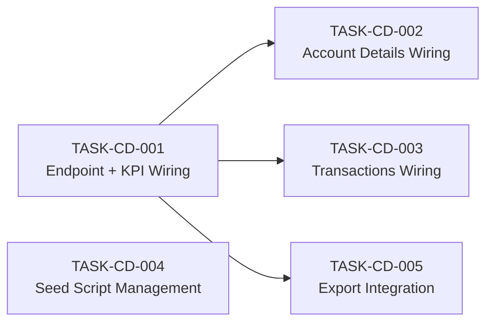

# CD Management — Task Breakdown

**Module:** `ibp-service / cd-management`
**Jira Reference:** IIRM-9479
**TRD source:** [hr-portal-cd-management-TRD.md](hr-portal-cd-management-TRD.md)
**PRD source:** [hr-portal-cd-management-PRD.md](hr-portal-cd-management-PRD.md)
**Date:** 2026-05-05
**Author:** IIRM Engineering Team

> **Scope:** Backend APIs are live and seeded in dev. The CD Management page (`HRPortalFinance`, routed at `/hr-portal/finance`) is fully built with mock data. All UI sections — KPI cards, Account Details table, Deposit Transactions table with filters, expand-row, pagination, and "View Transactions" navigation — are already implemented inline. Work remaining is replacing mock data with live API calls and making the seed scripts production-safe.

---

## What is already done

| Area | Status |
|---|---|
| `HRPortalFinance` page + route + sidebar nav | Done — `apps/ui/ibp/src/app/pages/HRPortalFinance/index.tsx`, routed at `finance` in `HRPortal/index.tsx` |
| KPI section UI | Done — 4 KPI cards built inline in `HRPortalFinance` |
| Account Details table (search, export, "View Transactions" click) | Done — inline, client-side mock data |
| Transactions table (filters, pagination, expand-row, export) | Done — inline, client-side mock data |
| `HrModule` backend + `generate` + `download` endpoints | Done — `POST /hr-module/generate/:report`, `POST /hr-module/download/:report` (in `hr.controller.ts` / `hr.service.ts`) |
| Report seeds in dev DB | Done — `cd_kpi_summary`, `cd_account_details`, `cd_transactions` seeded |

---

## Integration Pattern

All API calls use `apiRequest` from `@ui/ui-lib` and endpoint URLs from `apps/ui/ui-lib/src/lib/constants/endPoints.ts`. `companyId` is read from session:
```ts
const { companyId } = JSON.parse(sessionStorage.getItem('user') || '{}');
```

**Endpoint (once registered in endPoints.ts):**
```ts
endPoints.cdGenerateReport('cd_kpi_summary')
// → http://localhost:3000/iirm/ibp-service/hr-module/generate/cd_kpi_summary
```

**Call pattern:**
```ts
const result = await apiRequest(
  endPoints.cdGenerateReport('cd_kpi_summary') + '?page=1&limit=0',
  { method: 'POST', data: { companyId: String(companyId) } }
);
// rows at result.data.data  |  count at result.data.count
```

**Pagination notes:**
- Pass `?limit=0` on all three reports to disable the service-level `LIMIT` append
- For `cd_transactions`, pass `limit` and `offset` in the request body (SQL-embedded pagination); use `result.data.data.length < limit` to detect the last page since `count` reflects the page slice, not total rows

---

## Task Summary

| ID | Summary | Type | Pts | Sprint | Role | Depends on |
|---|---|---|---|---|---|---|
| TASK-CD-001 | Register endpoint constant and wire KPI section to cd_kpi_summary | Story | 3 | 1 | Mid | — |
| TASK-CD-002 | Replace mock account data with live cd_account_details API | Story | 5 | 1 | Mid | TASK-CD-001 |
| TASK-CD-003 | Replace mock transactions with live cd_transactions API, wire all filters and pagination | Story | 6 | 2 | Senior | TASK-CD-001 |
| TASK-CD-004 | Make CD seed scripts idempotent and apply to all environments | Task | 2 | 1 | Mid | — |
| TASK-CD-005 | Wire Export buttons to existing `download/:report` framework endpoint | Story | 2 | 2 | Mid | TASK-CD-001 |

**Total:** 18 story points across 5 tasks.

---

## Dependency Graph

TASK-CD-001 and TASK-CD-004 start in parallel on day 1. TASK-CD-002 follows once the endpoint constant is merged. TASK-CD-003 is Senior work targeting Sprint 2.



---

## Detailed Task List

---

#### TASK-CD-001: Register endpoint constant and wire KPI section to cd_kpi_summary

- **Type:** Story
- **Parent:** —
- **Epic:** CD Management Frontend
- **Sprint:** Sprint 1
- **Points:** 3
- **Assignee:** Mid
- **Assigned to:** —
- **Traces to:** [US-01](hr-portal-cd-management-PRD.md#7-user-stories)
- **Depends on:** none
- **Description:** Two changes shipped together. **(1) Endpoint registration** — add one entry to the `ibpEndPoints` block in `apps/ui/ui-lib/src/lib/constants/endPoints.ts`:
  ```ts
  cdGenerateReport: (reportKey: string) =>
    `${environment.ibpUrl}/hr-module/generate/${reportKey}`,
  ```
  This covers all three CD report keys and any future HR module reports in the same framework. **(2) KPI wiring** — in `apps/ui/ibp/src/app/pages/HRPortalFinance/index.tsx`, replace the mock-computed KPI values (currently derived from the `ACCOUNTS` const) with a live call to `cd_kpi_summary`. On mount, call:
  ```ts
  apiRequest(endPoints.cdGenerateReport('cd_kpi_summary') + '?page=1&limit=0',
    { method: 'POST', data: { companyId: String(companyId) } })
  ```
  Read the single row at `result.data.data[0]`. Map fields to the existing four KPI card UI slots: `totalDepositBalance`, `utilisedAmount` + `utilisedPercent`, `activeCdAccountsCount`, and `lastDepositDate` + `lastDepositBank`. Pass `balanceTrendData` to the sparkline renderer — check the runtime type; if it arrives as a JSON string (PostgreSQL `json_agg` via TypeORM raw query), call `JSON.parse()` before passing. When `lastDepositDate` is null, display `"—"` — never blank, never the string `"null"` per [TRD §6.1](hr-portal-cd-management-TRD.md#61-cd_kpi_summary). Show loading state while the call is in flight.
- **Decision budget:**
  - Junior can decide: loading state UI (skeleton vs spinner, match existing HR portal pages), currency formatting style
  - Escalate to TL/PTL: `balanceTrendData` runtime type — confirm with the backend developer before adding a `JSON.parse` guard; whether the endpoint constant name `cdGenerateReport` fits the existing naming convention in `endPoints.ts`
- **Acceptance criteria:**
  - [ ] `endPoints.cdGenerateReport('cd_kpi_summary')` resolves to the correct URL
  - [ ] Four KPI cards show live data for a company with CD accounts
  - [ ] Sparkline renders when `balanceTrendData` has entries
  - [ ] `lastDepositDate = null` → KPI 4 displays "—"
  - [ ] `totalDepositBalance = 0` → utilised % shows 0%, no crash
  - [ ] Loading state shown while API call is in flight
- **Definition of Done:**
  - [ ] Jira ticket updated to Done
  - [ ] Verified in browser against a company with caution deposit data
  - [ ] PR reviewed and merged

---

#### TASK-CD-002: Replace mock account data with live cd_account_details API

- **Type:** Story
- **Parent:** —
- **Epic:** CD Management Frontend
- **Sprint:** Sprint 1
- **Points:** 5
- **Assignee:** Mid
- **Assigned to:** —
- **Traces to:** [US-02, US-04](hr-portal-cd-management-PRD.md#7-user-stories)
- **Depends on:** TASK-CD-001
- **Description:** In `HRPortalFinance/index.tsx`, replace the hardcoded `ACCOUNTS` array with live data from `cd_account_details`. The page's local `CDAccount` type was built for mock data and has fields (`pendingClaims`, `available`, `policyName`, `type`, `tagColor`, `status`) that the API does not return. The API returns: `cdAccountId`, `cdAccountNumber`, `cdAccountName`, `policyNumber`, `policyId`, `depositBalance`, `utilisedAmount`, `utilisationPercent`, `lastUpdated`. Update the local type and all render references that depend on the removed fields. Four integration points to complete:

  **(1) Initial load** — on mount, call `cd_account_details` with `search: ''` and `limit=0` (no server-side pagination). Populate the accounts state from `result.data.data`.

  **(2) Search** — the current implementation filters `ACCOUNTS` client-side. Replace with a 300ms debounced call to `cd_account_details` passing `search: accountSearch` in the body. Remove the client-side `.filter()` logic.

  **(3) Totals row** — the existing total row computes sums from the `ACCOUNTS` array. Update to sum `depositBalance` and `utilisedAmount` from the live `result.data.data` array.

  **(4) Utilisation bar colour** — update colour thresholds to match [TRD §6.2](hr-portal-cd-management-TRD.md#62-cd_account_details): `utilisationPercent ≤ 50` → `#22C55E`; `51–80` → `#F59E0B`; `> 80` → `#EF4444`; `null` → 0%, no crash. The existing page uses `utilPct` — update all references to `utilisationPercent`.

  The "View Transactions" click handler already sets a `selectedPolicy` state — update it to set `selectedPolicy` to `row.policyId` (integer from API) rather than the mock `row.id`. This state is read in TASK-CD-003 to pre-filter the transactions table.
- **Decision budget:**
  - Junior can decide: debounce approach (match the pattern used elsewhere in the project), loading state style during search
  - Escalate to TL/PTL: if other components outside `HRPortalFinance` import the local `CDAccount` type (grep first); what to display in the Policy tag colour column now that `type` and `tagColor` are not returned by the API
- **Acceptance criteria:**
  - [ ] Account Details table shows live data on page load
  - [ ] Typing in search triggers API call after 300ms; table updates with server-filtered rows
  - [ ] Clearing search re-fetches with `search: ""`; all rows return
  - [ ] Totals row sums `depositBalance` and `utilisedAmount` from live data
  - [ ] Utilisation colour: green / amber / red thresholds correct; `null` → 0%, no crash
  - [ ] "View Transactions" click sets `selectedPolicy` to `row.policyId` from the API response
- **Definition of Done:**
  - [ ] Jira ticket updated to Done
  - [ ] Verified in browser — search, totals row, and colour thresholds spot-checked
  - [ ] PR reviewed and merged

---

#### TASK-CD-003: Replace mock transactions with live cd_transactions API, wire all filters, pagination, and View Transactions

- **Type:** Story
- **Parent:** —
- **Epic:** CD Management Frontend
- **Sprint:** Sprint 2
- **Points:** 6
- **Assignee:** Senior
- **Assigned to:** —
- **Traces to:** [US-02, US-03, US-04](hr-portal-cd-management-PRD.md#7-user-stories)
- **Depends on:** TASK-CD-001
- **Description:** In `HRPortalFinance/index.tsx`, replace the hardcoded `TRANSACTIONS` array with live data from `cd_transactions`. The local `CDTransaction` type has fields (`employee`, `employeeId`, `mode`, `status`, `claimRef`, `hospital`, `diagnosis`, `utrNo`, `approvedBy`) that the API does not return. The API returns: `txnId`, `txnDate`, `txnType` (`"Deposit"` or `"Deduction"`), `amount` (signed number), `policyNumber`, `bankName`, `referenceId`, `runningBalance` (varchar), `endorsementNumber`, `endorsementType`, `transactionValueDate`, `createdBy`, `remarks`, `ifscCode`. Update the local type; remove the render logic for fields that no longer exist. Seven integration points to complete:

  **(1) Initial load** — on mount, call:
  ```ts
  apiRequest(endPoints.cdGenerateReport('cd_transactions') + '?page=1&limit=0',
    { method: 'POST', data: {
      companyId: String(companyId),
      policyId: '', startDate: sixMonthsAgo, endDate: today,
      txnType: '', search: '', limit: '50', offset: '0'
    }})
  ```

  **(2) Filters** — replace client-side filter logic with server-side calls. The four filter controls (policy, date range, type, search) already exist in the page UI. Wire each to the `cd_transactions` body params: policy dropdown → `policyId` (from the accounts data loaded by TASK-CD-002 — pass policy options as a derived list); date range presets → `startDate`/`endDate` as ISO strings per [TRD §9](hr-portal-cd-management-TRD.md#9-filter--search--reset-behaviour-contract); type dropdown → sends `CREDIT_TRANSACTION` / `DEBIT_TRANSACTION` even though labels say "Deposit"/"Deduction"; search → `search`. Any filter change resets offset to `"0"` and re-fetches with 300ms debounce.

  **(3) Pagination** — replace the current client-side slice with server-side offset pagination. `result.data.data.length < 50` signals the last page. Previous/next controls only — no total page count displayed (count in the response reflects the page slice, not total rows). Next: `offset = String(Number(offset) + 50)`. Previous: `offset = String(Math.max(0, Number(offset) - 50))`.

  **(4) Expand row** — all expand fields (`endorsementNumber`, `endorsementType`, `referenceId`, `ifscCode`, `transactionValueDate`, `createdBy`, `remarks`) are present in every row response. No extra API call on chevron click. The existing expand-row UI already exists — update the field references to match the API keys. `txnType === 'Deduction'` → show Endorsement Ref, Endorsement Type, Reference ID, IFSC, Created By, Remarks. `txnType === 'Deposit'` → show Reference ID, Bank, Value Date, IFSC, Created By, Remarks. Any `null` field → `"—"` per [TRD §6.3](hr-portal-cd-management-TRD.md#63-cd_transactions).

  **(5) Amount display** — `amount` is a signed number from the SQL. Display `+₹N` green for positive; `−₹N` red for negative. `runningBalance` is a varchar — render as-is, do not cast.

  **(6) "View Transactions" integration** — the page already has `selectedPolicy` state set by TASK-CD-002. When `selectedPolicy` changes to a non-empty value, trigger a re-fetch of `cd_transactions` with `policyId: String(selectedPolicy)` and scroll to the transactions section. The existing scroll-to logic can stay as-is; just add the re-fetch trigger.

  **(7) Reset** — wire the existing Reset button to restore all filter state to defaults (policyId `''`, last 6 months, txnType `''`, search `''`, offset `'0'`) and re-fetch per [TRD §8.7](hr-portal-cd-management-TRD.md#87-transactions----reset).
- **Decision budget:**
  - Junior can decide: date formatting for ISO `startDate`/`endDate` body values, debounce approach
  - Escalate to TL/PTL: policy dropdown options — confirm these come from the accounts data already loaded by TASK-CD-002 (not a separate API call); confirm previous/next-only pagination is acceptable given the count limitation; what to display in the page for expand-row fields that existed in mock data but are not in the API (`claimRef`, `hospital`, `diagnosis`, `approvedBy`) — hide them or show a placeholder
- **Acceptance criteria:**
  - [ ] Table loads with last-6-months default and 50 rows per page on mount
  - [ ] Each filter independently narrows results; any change resets offset to 0
  - [ ] Search triggers API call after 300ms debounce
  - [ ] Next/previous pagination works; next button absent when fewer than 50 rows returned
  - [ ] Expand row shows correct fields per txn type; all null fields display "—"
  - [ ] Credit rows: `+₹N` green; Debit rows: `−₹N` red; `runningBalance` rendered as-is
  - [ ] "View Transactions" from Account Details pre-filters transactions by `policyId` and scrolls to the section
  - [ ] Reset restores all filter defaults and re-fetches
  - [ ] No extra API call on row expand/collapse
  - [ ] Empty-result state ("No transactions found") when API returns 0 rows
- **Definition of Done:**
  - [ ] Jira ticket updated to Done
  - [ ] Verified in browser — all filter combinations, empty-result state, and "View Transactions" flow tested
  - [ ] PR reviewed and merged

---

#### TASK-CD-004: Make CD seed scripts idempotent and apply to all environments

- **Type:** Task
- **Parent:** —
- **Epic:** CD Management Backend
- **Sprint:** Sprint 1
- **Points:** 2
- **Assignee:** Mid
- **Assigned to:** —
- **Traces to:** [US-01, US-02, US-03](hr-portal-cd-management-PRD.md#7-user-stories)
- **Depends on:** none
- **Description:** The seed script at `apps/services/ibp-service/src/app/hr-module/hr-module-cd-scripts.sql` uses plain `INSERT INTO admin_reports (...)` with no conflict handling. Running it a second time — after a DB reset, or when applying to staging or production — will fail with a unique constraint error on the `name` column. Make it safe to re-run by changing each `INSERT INTO admin_reports` to an upsert:
  ```sql
  INSERT INTO admin_reports (...) VALUES (...)
  ON CONFLICT (name) DO UPDATE SET
    query      = EXCLUDED.query,
    label      = EXCLUDED.label,
    updated_by = 'SYSTEM',
    updated_at = NOW()
  RETURNING id INTO report_id;
  ```
  The child-table pattern (`DELETE ... WHERE admin_report_id = report_id` then re-insert) is already correct for `admin_reports_parameters` and `admin_reports_results_mappings` — keep it. After updating the script, apply it to each required environment and add a comment block at the top of the file listing which environments have had it applied and when. Finally, verify the three keys are present with:
  ```sql
  SELECT name FROM admin_reports
  WHERE name IN ('cd_kpi_summary', 'cd_account_details', 'cd_transactions');
  ```
- **Decision budget:**
  - Junior can decide: exact columns in the `DO UPDATE SET` clause, comment format
  - Escalate to TL/PTL: which environments this task covers and who holds DB access for each; whether to track seed application in a migrations table going forward
- **Acceptance criteria:**
  - [ ] Script runs twice on the same DB with no error
  - [ ] Verification query returns 3 rows after each run
  - [ ] Comment block at top of file records environments applied and dates
  - [ ] Script applied to at least staging; confirmed by a live API call to each report key
- **Definition of Done:**
  - [ ] Jira ticket updated to Done
  - [ ] Updated script committed to repo
  - [ ] PR reviewed and merged

---

#### TASK-CD-005: Wire Export buttons to existing `download/:report` framework endpoint

- **Type:** Story
- **Parent:** —
- **Epic:** CD Management Frontend
- **Sprint:** Sprint 2
- **Points:** 2
- **Assignee:** Mid
- **Assigned to:** —
- **Traces to:** [US-04](hr-portal-cd-management-PRD.md#7-user-stories)
- **Depends on:** TASK-CD-001
- **Background:** The HR module backend already provides `POST /hr-module/download/:report` (implemented in `apps/services/ibp-service/src/app/hr-module/hr.controller.ts` → `hr.service.ts`). This endpoint accepts the same filter body as `generate/:report`, runs the full query without pagination (`limit: 0`), and streams back a CSV file. **No new backend code is required.** The export work is purely a frontend wiring task.
- **Description:** Replace the two `downloadMockFile` stubs in `HRPortalFinance/index.tsx` with real API calls to the existing download endpoint.

  **(1) Register the endpoint constant** — add to the `ibpEndPoints` block in `apps/ui/ui-lib/src/lib/constants/endPoints.ts`:
  ```ts
  downloadHRReports: environment.ibpUrl + `/hr-module/download/`,
  ```

  **(2) Account Details Export button** — replace `downloadMockFile(...)` with:
  ```ts
  const response = await apiRequest(
    endPoints.downloadHRReports + 'cd_account_details',
    { method: 'POST', data: { companyId, search: debouncedSearch }, responseType: 'blob' }
  );
  // trigger browser download from response.data (Blob)
  ```

  **(3) Transactions Export button** — replace `downloadMockFile(...)` with:
  ```ts
  const response = await apiRequest(
    endPoints.downloadHRReports + 'cd_transactions',
    { method: 'POST', data: { companyId, policyId: String(viewPolicyId),
        startDate, endDate, txnType: txnTypeApi, search: debouncedTxnSearch },
      responseType: 'blob' }
  );
  // trigger browser download from response.data (Blob)
  ```

  **(4) Loading state** — add `accountsExporting` and `txnsExporting` boolean state. Set to `true` at the start of each export, reset in `finally`. While exporting, dim the button and show "Exporting…" to prevent double-clicks.
- **Decision budget:**
  - Junior can decide: filename for the saved file (e.g. `cd-account-details.csv`), exact in-flight button label
  - Escalate to TL/PTL: if a password-protected ZIP is returned instead of CSV (environment-dependent), confirm the correct file extension and MIME type with the backend developer
- **Acceptance criteria:**
  - [ ] Clicking Account Details Export triggers `POST /hr-module/download/cd_account_details`; CSV file downloads automatically
  - [ ] Clicking Transactions Export triggers `POST /hr-module/download/cd_transactions` with active filter values; CSV file downloads
  - [ ] `downloadHRReports` constant registered in `endPoints.ts`
  - [ ] Export button shows "Exporting…" and is non-interactive while in flight
  - [ ] No `downloadMockFile` calls remain in `HRPortalFinance/index.tsx`
- **Definition of Done:**
  - [ ] Jira ticket updated to Done
  - [ ] Verified in browser — both exports download a valid CSV
  - [ ] PR reviewed and merged

---

## Open Questions

1. **`balanceTrendData` runtime type** — Does `json_agg` arrive as a JS array or a JSON string via `apiRequest`? Confirm in the network tab before TASK-CD-001 adds the `JSON.parse` guard. Blocking: TASK-CD-001.

2. **Policy tag colour** — The existing account rows render a coloured policy type tag using mock `type` and `tagColor` fields. The API does not return these. Decide what to show (derived from `cdAccountName`, a fixed set, or removed) before TASK-CD-002 starts. Blocking: TASK-CD-002.

3. **Expand-row mock-only fields** — `claimRef`, `hospital`, `diagnosis`, `approvedBy` appear in the existing expand-row UI but are not in the API. Confirm whether to hide them or replace with a placeholder. Blocking: TASK-CD-003.

4. **Pagination UX sign-off** — `cd_transactions` count reflects the current page slice, not total rows. The proposed UX is previous/next only with no total page count. Confirm with the product owner before TASK-CD-003 starts. Blocking: TASK-CD-003.

5. **Seed environments** — Which environments need the script applied and who has DB access for each? Blocking: TASK-CD-004.

---

## Approval

```
Approved by:
Role:
Date:

Approved by:
Role:
Date:
```
