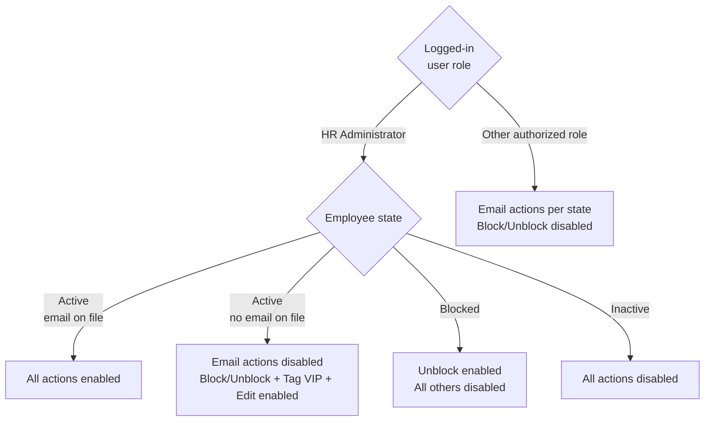

# HR Portal — Employee Support — Software Design Specification (SDS)

> **APPROVAL GATE BYPASSED** — PRD has 0 of 2 required approvals at time of SDS generation. This document is produced at the author's risk. Formal PRD approval must be obtained before implementation begins.

**Document Version:** 2.0
**Date:** 2026-05-04
**Author:** IIRM Engineering Team
**Jira Reference:** IIRM-10102
**Related Documents:**
- PRD: `IBP_HR Portal - Employee Support-PRD.md`
- TRD: `IBP_HR Portal - Employee Support-TRD.md` (pending)

---

## 1. Overview

This document describes the UI layout, component behaviour, data field mappings, and interaction patterns for the Employee Support module of the IBP HR Portal. It is the implementation companion to the PRD and must be read alongside the TRD for API and data-layer detail.

| Concern | Owner |
| --- | --- |
| Business rules, acceptance criteria, scope, performance targets | PRD |
| Screen layouts, field definitions, action states, interaction flows | SDS (this document) |
| API contracts, database schema, service integration design | TRD |

Phase 1 only. Future phases may extend this SDS for bulk actions, self-service flows, and enrollment configuration.

### Visual Reference Pattern

The existing enrollment listing page (`apps/ui/ibp/src/app/pages/HRPortalEnrolmentV2/index.tsx`, routed at `/hr-portal/enrollment`) is the **visual and structural reference** for the Employee Support listing table. Use it as the design source for:

| Element | Reference in HRPortalEnrolmentV2 |
| --- | --- |
| Employee table columns (Emp ID, Name, Gender, DOB, Age, Email, Status, Actions) | Enrollment tab employee list table |
| Actions column — "..." overflow menu with contextual items | Block Access / Reset Password / Send Reminder per-row menu |
| Action disabled state (greyed out, tooltip on hover) | Block Access state when user has no account |
| E-card dialog | E-Card "View" modal |
| Filter chips and reset button | Member Type / Status / Enrollment Status filters |
| Pagination pattern | Bottom page controls |
| Loading skeleton | Existing skeleton while enrollment data loads |

> **Important distinction:** Employee Support is a **new, separately routed page** (`/hr-portal/employee-support`) with its own backend, its own KPI set, and different action semantics (5 email types + deactivation). Do NOT repurpose or modify `HRPortalEnrolmentV2`. Use it only as a reference for layout patterns and MUI component choices.

---

## 2. Information Architecture

### 2.1 Location in HR Portal

Employee Support is a first-level navigation item in the HR Portal left sidebar, accessible to all HR administrators. It does not require elevated permissions.

**Route:** `/hr/employee-support`

### 2.2 Screen Inventory

This module is a single screen. All actions are performed without navigating away from it.

| Surface | Purpose | PRD Ref |
| --- | --- | --- |
| KPI Summary Row | At-a-glance employee base metrics | US-EMPSUPPORT-001 |
| Filter Bar | Narrow the listing using dimensions derived from policy configuration | US-EMPSUPPORT-002 |
| Employee Listing | Paginated list of all employees; per-row action menu | US-EMPSUPPORT-003 through US-EMPSUPPORT-008 |
| Deactivation Confirmation Modal | Explicit confirmation step before committing deactivation — HR Administrator only | US-EMPSUPPORT-008 |

---

## 3. Page Layout

The page is structured as three vertically stacked sections.

1. KPI Summary Row — full-width row of five metric cards
2. Filter Bar — full-width row of filter controls and search
3. Employee Listing — full-width table with paginated rows and per-row actions

### 3.1 Page Header

| Element | Value |
| --- | --- |
| Page title | "Employee Support" |
| Left sidebar | Employee Support item highlighted as active |
| Global filters | None at page level — all filtering is via the Filter Bar |

---

## 4. KPI Summary Row

The KPI Summary Row is the first element on the page. It contains five cards in a single horizontal row, each occupying equal width. Cards update dynamically when filters are applied to the employee listing.

PRD reference: [US-EMPSUPPORT-001](IBP_HR%20Portal%20-%20Employee%20Support-PRD.md#us-empsupport-001---view-employee-kpi-summary), [BR-EMPSUPPORT-006](IBP_HR%20Portal%20-%20Employee%20Support-PRD.md#5-business-rules)

### 4.1 Card Definitions

| # | Title | Value |
| --- | --- | --- |
| 1 | Total Employees | Count of all employees in the current listing context (filtered or unfiltered) |
| 2 | Active Employees | Count of employees where `status = active` in current context |
| 3 | Inactive / Deactivated | Count of employees where `status = inactive` in current context |
| 4 | Enrolled | Count of employees where `enrollment_status = enrolled` in current context |
| 5 | Not Yet Enrolled | Count of employees where `enrollment_status ≠ enrolled` in current context |

### 4.2 Filter-Linked Behaviour

When any filter is active, all five KPI values recompute to reflect only the employees currently visible in the listing — not the total company population. This is a hard requirement; static totals are not acceptable.

When no employees exist for the company, or when active filters produce zero results, all five cards display `0` without an error state.

### 4.3 Card Visual Specification

| Card | Top-border colour |
| --- | --- |
| Total Employees | Blue |
| Active Employees | Green |
| Inactive / Deactivated | Red |
| Enrolled | Teal |
| Not Yet Enrolled | Amber |

Each card shows: title, large numeric value. No sparklines or trend indicators in Phase 1.

---

## 5. Filter Bar

The Filter Bar sits between the KPI row and the employee listing.

PRD reference: [US-EMPSUPPORT-002](IBP_HR%20Portal%20-%20Employee%20Support-PRD.md#us-empsupport-002), PRD §4.2

### 5.1 Dynamic Filter Rendering

Filter controls are not hardcoded. The Filter Bar renders one filter control per parameter that is active in the company's policy configuration. The set of visible filters therefore varies per company and per policy setup.

| Behaviour | Detail |
| --- | --- |
| Filter source | Parameters active in the company's policy configuration at listing load time |
| No configured parameters | Filter Bar renders with only the Search input and Reset button; no dimension-based controls appear |
| New parameter configured | Appears in the Filter Bar on next page load (session refresh behaviour confirmed in OQ-2) |

### 5.2 Filter Control Mapping by Parameter Type

The type of filter control rendered for each policy configuration parameter depends on the parameter's data type. The table below defines the default rendering rule; final type mapping is subject to OQ-2.

| Parameter data type | Control rendered | Selection behaviour |
| --- | --- | --- |
| Categorical / enum | Multi-select dropdown | OR within dimension; AND across dimensions |
| Boolean / flag | Toggle or checkbox | Single value |
| Date / date range | Date range picker | Inclusive range |
| Free text | Text input | Partial match |

### 5.3 Always-Present Controls

The following controls appear in the Filter Bar regardless of policy configuration.

| Control | Component | Default | Behaviour |
| --- | --- | --- | --- |
| Search | Text input | Empty | Partial match on employee name and employee ID |
| Reset Filters | Button | — | Clears all active filter values and search; restores full listing |

### 5.4 Active Filter Indication

When any filter is set to a non-default value, a visible indicator (e.g., a highlighted border or active-filter badge) must appear on that filter control so the HR administrator can see which dimensions are currently narrowing the listing.

All filter changes trigger a fresh data request. Filters across dimensions apply AND logic. Within a single multi-select control, selected values apply OR logic.

---

## 6. Employee Listing

The employee listing occupies the main body of the page below the filter bar.

PRD reference: PRD §4.1, PRD §4.3, US-EMPSUPPORT-003 through US-EMPSUPPORT-008

### 6.1 Table Columns

Columns follow the `HRPortalEnrolmentV2` enrollment listing pattern (see SDS §1 Visual Reference Pattern). Fixed columns appear for every company; policy configuration columns are appended at runtime.

| # | Column | Source Field | Interaction / Notes |
| --- | --- | --- | --- |
| 1 | Employee ID | `companyEmployeeId` | Click → navigate to `/hr-portal/enrollment/:employeeId` |
| 2 | Employee Name | `employeeName` | Click → navigate to `/hr-portal/enrollment/:employeeId` |
| 3 | Gender | `gender` | Display only |
| 4 | DOB | `dateOfBirth` | Display only |
| 5 | Age | Derived from `dateOfBirth` | Computed client-side |
| 6 | Email | `email` | Display only; `—` when `hasEmail: false` |
| 7 | Mobile | `mobile` | Display only |
| 8 | Enroll Status | `enrollmentStatus` | Badge: Enrolled (teal) / Not Enrolled (amber) / Pending (grey) |
| 9 | Sum Insured | `sumInsured` | Currency formatted |
| 10 | Dependents | `dependentsCount` | Numeric; click → Dependents Modal (§6.5) |
| 11 | E-card | `ecardKey` | "View" link → E-card Modal (§6.4); greyed out when `ecardKey` is null |
| 12 | Status | `status` | Badge: Active (green) / Blocked (amber) / Inactive (red) |
| 13 | Reminder | — | "Send" button → dispatches reminder email immediately; disabled when Inactive or no email |
| 14 | Actions | — | "…" overflow menu — see §7 |
| + | [Policy config fields] | `additionalParams` | Zero or more columns; rendered only for keys present in filter-metadata response |

### 6.2 Default Sort

`employeeId DESC` (most recent first, matching the reference query).

### 6.3 Pagination

Format: "Showing {start}–{end} of {total} employees."
Controls: Previous / page number buttons / Next.
Page size: TBD in TRD (recommended 25 or 50 rows per page for ≤ 5,000 employee target).

### 6.4 Empty States

| Condition | Display |
| --- | --- |
| Company has zero employees | Illustration + "No employees found for your company." No error shown. |
| Active filters produce zero matches | "No employees match the active filters." + "Clear filters" link. KPIs show `0`. |

### 6.4 E-card Modal

Triggered by clicking "View" in the E-card column. Follows the same pattern as `HRPortalEnrolmentV2`'s E-card modal.

| Element | Detail |
| --- | --- |
| Trigger | "View" link in E-card column; greyed-out with tooltip "No e-card available" when `ecardKey` is null |
| Content | E-card preview (front/back image or PDF iframe), employee name and policy details |
| Actions | "Download PDF" button — downloads the file from `ecardKey` path |
| Dismiss | Click backdrop or × button |

### 6.5 Dependents Modal

Triggered by clicking the dependents count cell for any employee.

| Element | Detail |
| --- | --- |
| Trigger | Click on the `dependentsCount` number cell |
| Title | "{Employee Name} — Dependents" |
| Content | Table: Dependent Name · Relation · Age · Coverage Amount |
| Empty state | "No dependents on record." when count is 0 (count cell still clickable) |
| Dismiss | Click backdrop or × button |

Data source: `GET /hr/employee-support/employees/:employeeId/dependents`

---

## 7. Per-Employee Actions

Actions are split across two surfaces: **row-level controls** (always visible, see §6.1) and the **"…" overflow action menu**.

PRD reference: US-EMPSUPPORT-003 through US-EMPSUPPORT-013, PRD §4.4

### 7.1 Action Definitions

**Row-level controls** (see §6.1 for column spec):

| Control | Label | Effect |
| --- | --- | --- |
| Employee ID / Name | — | Navigate to `/hr-portal/enrollment/:employeeId` (Employee Detail, 4 tabs — see §12) |
| Dependents count | — | Opens Dependents Modal (§6.5) |
| E-card | "View" | Opens E-card Modal (§6.4) |
| Reminder | "Send" | Dispatches reminder email immediately; same as "Send Reminder Email" from action menu |

**"…" action menu items:**

| Action | Label in menu | Type | HR Admin only |
| --- | --- | --- | --- |
| Block / Unblock Access | "Block Access" / "Unblock Access" (toggles) | Status change | Yes |
| Tag as VIP | "Tag as VIP" | Record flag | No |
| Edit Employee | "Edit Employee" | Opens edit panel/modal | No |
| Reset Password | "Reset Password" | Sends email | No — requires email on file |
| Send eCard Email | "Send eCard Email" | Sends email | No — requires email on file |
| Extend Enrollment Window | "Extend Enrollment Window" | Sends email | No — requires email on file |
| Send Welcome Email | "Send Welcome Email" | Sends email | No — requires email on file |

### 7.2 Action Availability by Role and Employee State

### 7.3 Action State Rules

| Condition | Email actions | Block/Unblock | Tag VIP / Edit |
| --- | --- | --- | --- |
| Active + email on file | Enabled | Enabled (HR Admin only) | Enabled |
| Active + no email on file | Disabled — tooltip: "No email address on file" | Enabled (HR Admin only) | Enabled |
| Blocked | Disabled | "Unblock Access" enabled (HR Admin only) | Disabled |
| Inactive | Disabled — tooltip: "Employee is inactive" | Disabled | Disabled |
| Logged-in user is not HR Admin | Per state above | Disabled — tooltip: "Requires HR Administrator role" | Enabled per state above |

Disabled actions remain visible in the menu in greyed-out state with tooltip. They must not be hidden.

### 7.4 Email Action Feedback

Applies to: Reset Password, Send eCard Email, Extend Enrollment Window, Send Welcome Email, Send Reminder (row button and menu).

| Step | UI Element | Detail |
| --- | --- | --- |
| 1 | Trigger (menu item or row button) | Action dispatched immediately — no confirmation step |
| 2a | Service accepts | Toast: "{Action} sent to {email}." |
| 2b | Service unavailable | Toast: "{Action} failed. Please try again." with Retry. |

### 7.5 Block / Unblock Feedback

| Outcome | UI Behaviour |
| --- | --- |
| Block success | Status badge → "Blocked" (amber); menu item toggles to "Unblock Access"; email actions disabled for that row |
| Unblock success | Status badge → "Active"; menu item toggles to "Block Access"; email actions re-enabled (if email on file) |
| Service error | Toast error; status unchanged; retry available |

### 7.6 Tag as VIP Feedback

On success: a VIP badge or icon appears in the employee's name cell. The action label changes to "Remove VIP" (toggle). No confirmation modal required.

### 7.7 Edit Employee Feedback

Opens an Edit Employee panel or modal (full spec TBD with designer). On save success: listing row updates with new values in place; success toast. On cancel: no change. Validation errors shown inline in the form.

---

## 8. Deactivation Confirmation Modal

PRD reference: [US-EMPSUPPORT-008](IBP_HR%20Portal%20-%20Employee%20Support-PRD.md#us-empsupport-008), PRD §4.4, PRD BR: "Deactivation requires explicit confirmation"

Deactivation is the only action with an intermediate confirmation step. All email actions dispatch directly. This modal is only reachable by users with the HR Administrator role — for all other roles, the Deactivate action is disabled in the "…" menu and this modal is never presented.

### 8.1 Modal Specification

| Element | Detail |
| --- | --- |
| Title | "Deactivate {Employee Name}?" |
| Body | "This will immediately revoke {Employee Name}'s portal access. This cannot be undone in Phase 1." |
| Confirm button | "Deactivate" — destructive styling (red) |
| Cancel button | "Cancel" — dismisses modal, no change committed |

### 8.2 Outcome States

| Outcome | UI Behaviour |
| --- | --- |
| Success | Modal closes; listing row updates in-place: Status badge → Inactive (red); all action items → disabled; KPI cards recompute |
| Identity service unavailable | Modal remains open; error message shown inline: "Unable to deactivate. Please try again." Confirm button re-enabled for retry. |
| Employee already inactive (guard) | "Deactivate" is shown in a permanently disabled state in the "…" menu with tooltip "Employee is already inactive" (see §7.3). The modal is not triggered. |

---

## 9. Navigation Behaviour

| Interaction | Behaviour |
| --- | --- |
| Click "Employee Support" in left sidebar | Navigates to `/hr-portal/employee-support`; full listing loads for the HR admin's company |
| Click Employee ID or Employee Name cell | Navigates to `/hr-portal/enrollment/:employeeId` — Employee Detail page with 4 tabs (see §12) |
| Apply any filter | Listing and KPIs refresh in place |
| Reset Filters | All active filter values cleared; search cleared; full unfiltered listing reloads |
| Click "…" on any row | Dropdown appears inline anchored to that row; closes on outside click |
| Click "View" in E-card column | E-card Modal opens (§6.4); no navigation |
| Click Dependents count | Dependents Modal opens (§6.5); no navigation |
| Click Reminder "Send" button | Reminder email dispatched immediately; toast feedback; no navigation |
| Trigger any email action from menu | No navigation; toast appears; menu closes |
| Block/Unblock access | No navigation; row status badge updates in place |
| Tag as VIP / Remove VIP | No navigation; VIP indicator updates in place |
| Edit Employee | Edit panel/modal opens; no navigation away from listing |

---

## 10. Error & Edge Case UI Handling

| Scenario | UI Response |
| --- | --- |
| Email service unavailable on any email action | Error toast: "{Action} failed. Please try again." Retry is the same "…" menu trigger — no special UI required. |
| Identity service unavailable on Deactivate confirm | Inline error inside confirmation modal; Confirm button remains active for retry; employee status unchanged. |
| Employee has no email address | All 5 email actions disabled with tooltip; Deactivate still enabled. |
| Company has zero employees | Empty state: "No employees found for your company." All KPIs = 0. |
| All employees filtered out | Empty state: "No employees match the active filters." + "Clear filters" link. All KPIs = 0. |
| HR admin triggers email action immediately after in-session deactivation | System re-validates status before dispatch; action is rejected if status = inactive; error shown. |

---

## 11. Schema Notes

Authoritative field names and constraints are in the TRD. These notes are informational only.

| Note | Detail |
| --- | --- |
| Company scoping | All queries must be scoped to `employee.company_id` matching the logged-in HR admin's company. Cross-company access must be prevented at the data layer (PRD §7). |
| Enrollment status values | Enrollment status values are not fixed in this SDS. The values that appear as filter options and badge labels are determined by what the enrollment service exposes and what policy configuration selects. Confirm the complete status vocabulary before TRD begins (PRD OQ-1, OQ-2). |
| Deactivation soft-delete | Deactivating an employee sets `employee.status = inactive`. The record is never deleted. Reactivation is out of scope for Phase 1. |
| Email action audit | Every triggered action must produce an audit log entry: action type, target employee ID, HR admin user ID, timestamp. Audit log ownership (this module vs. downstream service) is an open question — see PRD OQ-5. |
| Reset password mechanics | Whether the identity service generates and sends the reset link directly, or hands a link back to this module for the email service, is an open question — see PRD OQ-3. The SDS UI pattern is identical either way. |
| KPI recompute scope | KPI counts are derived from the same filtered dataset powering the listing, not from separate aggregate queries. This ensures KPIs reflect exactly what the admin sees in the table (BR-EMPSUPPORT-006). |

---

## 12. Open Questions Affecting This SDS

The following PRD open questions are unresolved and may require SDS revisions when answered.

| OQ | Question | SDS impact |
| --- | --- | --- |
| OQ-1 | Confirm the 5-KPI set | Card definitions in §4 may change |
| OQ-2 | Policy configuration parameters — which fields drive filters and additional columns? | §5 filter control types and §6.1 additional columns cannot be fully specified until this is confirmed |
| OQ-3 | Reset password mechanics | No SDS change — UI pattern is the same regardless of backend flow |
| OQ-5 | Audit log ownership | Schema note in §11; no screen change |
| OQ-6 | Enrollment window extension — does it also extend the date or only send email? | May require a confirmation step or additional UI if the action also modifies data |
| OQ-7 | Which portal roles beyond HR Administrator have access to this module? | Determines whether non-HR role handling in §7.3 covers all cases; may require additional role-state rules if new roles are introduced |

---

## 12. Employee Detail Page

**Route:** `/hr-portal/enrollment/:employeeId`
**Entry:** Click on Employee Name or Employee ID in the Employee Support listing.
**Auth:** Same session JWT — no separate login. The route is guarded; unauthorized access redirects to the listing.

This page is structured as **4 tabs** rendered as a horizontal tab strip below a profile header strip.

### 12.1 Profile Header Strip

Always visible above the tabs regardless of active tab:

| Element | Content |
| --- | --- |
| Avatar | Employee initials or photo placeholder |
| Name + Employee ID | Full name and company employee code |
| Enrollment status chip | Current enrollment state badge |
| Active / Blocked / Inactive chip | Current portal access status |

### 12.2 Tab Definitions

| Tab | Contents |
| --- | --- |
| **Employee Details** | Full profile fields: Full Name · Employee ID · DOB · Age · Gender · Department · Location · Joining Date · Email · Mobile |
| **Insurance & Policy Details** | Policy name · Policy number · Enrollment status · Sum insured · Available balance · Effective date · Expiry date · Last activity date |
| **Dependents / Beneficiaries** | Per dependent row: Name · Relation · Age · Coverage amount. Empty state: "No dependents on record." |
| **Claims History** | Per claim row: Policy number · Hospital · Claim type · Date · Claimed amount · Settled amount · Status. Footer: Total claimed. Empty state: "No claims on record." |

### 12.3 Back Navigation

A "← Back to Employee Support" breadcrumb / back link returns to the Employee Support listing at `/hr-portal/employee-support`, preserving active filters and scroll position where possible.

---

# END OF SDS
