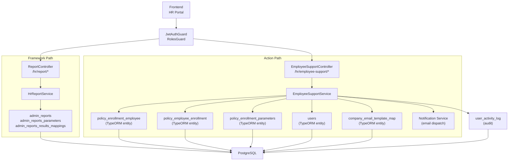
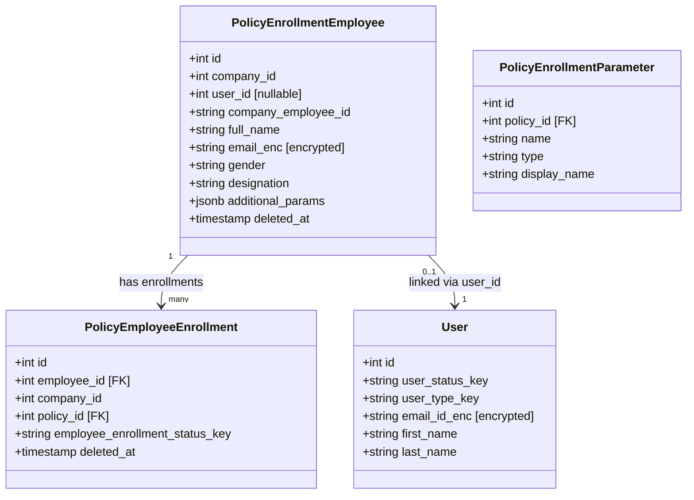
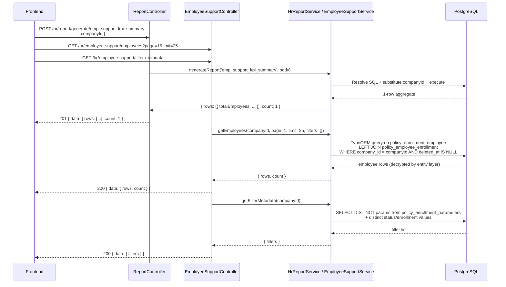
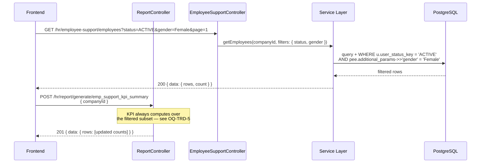
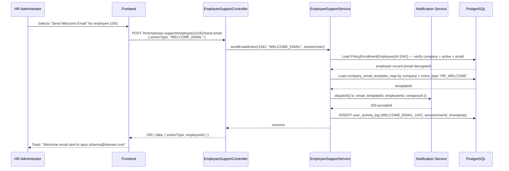

# HR Portal — Employee Support — Technical Requirements Document (TRD)

> **APPROVAL GATE BYPASSED** — PRD has 0 of 2 required approvals at time of TRD generation. This document is produced at the author's risk. Formal PRD approval must be obtained before implementation begins.

**Document Version:** 1.0
**Date:** 2026-05-04
**Author:** IIRM Engineering Team
**Jira Reference:** IIRM-10102
**PRD Reference:** `IBP_HR Portal - Employee Support-PRD.md`
**SDS Reference:** `IBP_HR Portal - Employee Support-SDS.md`
**Framework Reference:** `docs/implementation/ibp-service/hr-module-report-framework-tech-spec.md`

> **Dependency Note (Framework Spec §9):** The KPI summary in this module follows the mandatory module-level format defined in `hr-module-report-framework-tech-spec.md §9`. The employee listing and all action endpoints deviate from the pure report-framework pattern — the reasons are documented in Section 2. Any update to the framework spec must be reflected here. Sections affected by framework changes are called out in Section 16.

---

## 1. Architecture Overview

The Employee Support module has two distinct subsystems that operate on different paths.

The **read path** covers the KPI summary. It is served by the HR Report Framework (`POST /hr/report/generate/:report`), following the same metadata-driven pattern as CD Management and all other HR portal read-only screens.

The **action path** covers the employee listing and all six per-employee actions (five email sends + deactivation). These are served by a dedicated REST controller and service layer (`EmployeeSupportController` / `EmployeeSupportService`) outside the report framework. The reasons for this split are:

1. The `policy_enrollment_employee.email_enc` column is encrypted via `@SensitiveField`. Raw SQL report execution does not decrypt it — only TypeORM entity reads trigger the decryption decorator. The employee listing must display and act on email addresses, so it must use the TypeORM entity path.
2. Action endpoints (send email, deactivate) are write operations. The report framework supports read-only SELECT execution only.
3. Deactivation requires a role check finer than `HR_ADMIN` at the method level — the framework does not support per-method role overrides.

The two paths share the same `JwtAuthGuard`, company-scoping rule, and response envelope from `libs/service-lib`.

### 1.1 Route & Entry Points

| Subsystem | Method | Path | Auth |
| --- | --- | --- | --- |
| KPI Summary (framework) | POST | `/hr/report/generate/emp_support_kpi_summary` | `JwtAuthGuard` + `RolesGuard(HR_ADMIN)` |
| Employee Listing | GET | `/hr/employee-support/employees` | `JwtAuthGuard` + `RolesGuard(HR_ADMIN)` |
| Filter Metadata | GET | `/hr/employee-support/filter-metadata` | `JwtAuthGuard` + `RolesGuard(HR_ADMIN)` |
| Send Email Action | POST | `/hr/employee-support/employees/:employeeId/send-email` | `JwtAuthGuard` + `RolesGuard(HR_ADMIN)` |
| Deactivate Employee | POST | `/hr/employee-support/employees/:employeeId/deactivate` | `JwtAuthGuard` + `RolesGuard(HR_ADMIN)` — additional HR role check in service |

### 1.2 Framework API Contracts (from tech spec §4)

The KPI summary uses the standard framework generate endpoint:

| Operation | Method | Path | Success |
| --- | --- | --- | --- |
| Generate KPI | POST | `/hr/report/generate/emp_support_kpi_summary` | 201 |

**Generate success (201):**
```json
{
  "statusCode": 201,
  "message": "Report generated successfully.",
  "data": {
    "rows": [ { "totalEmployees": 240, "activeEmployees": 198, ... } ],
    "count": 1
  }
}
```

> **Frontend binding rule (Framework §4.1):** Read `data.rows[0]` for the KPI summary — it is a single-row aggregate report.

> **Frontend visual reference:** The existing enrollment listing component (`apps/ui/ibp/src/app/pages/HRPortalEnrolmentV2/index.tsx`, routed at `/hr-portal/enrollment`) is the **visual and structural reference** for the Employee Support page. The employee table layout, action overflow menu pattern, filter chips, pagination controls, loading skeleton, and MUI component choices in `HRPortalEnrolmentV2` should be mirrored — not copied — for `HRPortalEmployeeSupport`. The new page is separately routed (`/hr-portal/employee-support`) with its own backend and a different column set and action set. See SDS §1 Visual Reference Pattern for the full mapping table.

---

## 2. Scope

**In scope for this TRD:**

- KPI summary report implementation (`emp_support_kpi_summary`)
- Employee listing REST endpoint — extended response including gender, DOB, mobile, sumInsured, dependentsCount, ecardKey, isBlocked, isVip
- Filter metadata endpoint (resolves active policy enrollment parameters for the company)
- Four email action endpoints via `send-email` (eCard, reset password, enrollment extension, welcome)
- Send Reminder dedicated endpoint — `send-reminder` (one-click row button; same logic as REMINDER_EMAIL)
- Block / Unblock Access toggle endpoint — HR Administrator role only
- Tag / Untag VIP toggle endpoint
- Edit Employee PATCH endpoint
- Dependents list endpoint
- Audit log entry per triggered action

**Non-goals:**

- Bulk action support (out of scope in PRD Phase 1)
- Employee record creation or import
- Email template authoring or management
- Enrollment window date extension logic (this module sends the notification email only; the enrollment service owns the date)
- Employee detail page data — served by existing HR Analytics report framework (`ibp_hr_employee_profile_summary`, `ibp_hr_employee_dependents`, `ibp_hr_employee_claims_history`; see HR Analytics TRD §7.2)

---

## 3. Component Diagram

The diagram below shows internal components and their external dependencies. The report framework path (left) and the dedicated action path (right) share the auth guard layer but diverge at the controller.



---

## 4. Data Model

### 4.1 Source Tables

The following tables are read by this module. Authoritative schema is in the entities listed in Section 14.

| Table | Entity | Purpose |
| --- | --- | --- |
| `policy_enrollment_employee` | `PolicyEnrollmentEmployee` | Employee master — name, encrypted email, gender, designation, `additional_params` JSONB, `user_id` link |
| `policy_employee_enrollment` | `PolicyEmployeeEnrollment` | Per-employee enrollment record — `employee_enrollment_status_key` |
| `policy_enrollment_employee_policy_map` | `PolicyEnrollmentEmployeePolicyMap` | Employee-to-policy mapping |
| `policy_enrollment_parameters` | `PolicyEnrollmentParameter` | Parameter definitions per policy — drives dynamic filter dimensions |
| `policy_configuration` | `PolicyConfiguration` | Company policy configuration — `policy_configuration` JSONB |
| `users` | `User` | Portal user account — `user_status_key` (ACTIVE/INACTIVE), `user_type_key` |
| `company_email_template_map` | `CompanyEmailTemplateMap` | Maps email templates to companies and event types |
| `notification_event_type` | `NotificationEventType` | Email event type names (WELCOME_EMAIL, REMINDER_EMAIL, etc.) |
| `user_activity_log` | — | Audit log target (written to, not read) |

### 4.2 Key Relationships



### 4.3 Encrypted Field Rule

`policy_enrollment_employee` carries **two email-related columns:**

| Column | Type | Usage |
| --- | --- | --- |
| `pee.email` | Plaintext | Display and search — safe to read via raw SQL. |
| `pee.email_enc` | `@SensitiveField` (encryption may be inactive) | Actual email address for dispatch. |

> **2026-05-06 note:** In the current dev environment, `email_enc`, `date_of_birth_enc`, and `phone_number_enc` are not actively encrypted. The HR report framework SQL scripts (`hr-module-scripts.sql`, `hr-module-employee-support-scripts.sql`) now select these columns directly as `"email"`, `"dateOfBirth"`, `"phone"` and return raw values. The `IS NOT NULL AS "hasEmail"` / `"hasPhone"` / `"hasDateOfBirth"` boolean pattern has been removed. When encryption is re-enabled in production, this approach must be revisited — only the TypeORM entity path decrypts these fields safely.

All Employee Support action endpoints (email dispatch) must still use the TypeORM entity path so that `email_enc` is decrypted correctly when encryption is active.

### 4.4 No Soft-Delete Rule on `policy_employee_enrollment`

`policy_employee_enrollment` carries a `deleted_at` column. All reads must include `AND pee_enroll.deleted_at IS NULL` on any join to this table.

`policy_enrollment_employee` also carries `deleted_at`. Active employee listings must include `AND pee.deleted_at IS NULL`.

---

## 5. Screen-to-API Mapping

| Screen Section | API | Response path | Notes |
| --- | --- | --- | --- |
| Employee KPI Summary | `POST /hr/report/generate/emp_support_kpi_summary` | `data.rows[0]` | Framework path |
| Employee Listing | `GET /hr/employee-support/employees` | `data.rows`, `data.count` | Includes `ecardKey`, `dependentsCount`, `isVip`, `isBlocked` |
| Filter Metadata | `GET /hr/employee-support/filter-metadata` | `data.filters` | One call on page load |
| Send Email Action (any of 4) | `POST /hr/employee-support/employees/:id/send-email` | `data.message` | Sends Reset Password / eCard / Enrollment Extension / Welcome email |
| Send Reminder (row button or menu) | `POST /hr/employee-support/employees/:id/send-reminder` | `data.message` | Dedicated endpoint for one-click reminder |
| Block / Unblock Access | `POST /hr/employee-support/employees/:id/block` | `data.updatedStatus` | HR Admin only; toggles `isBlocked` |
| Tag as VIP / Remove VIP | `POST /hr/employee-support/employees/:id/vip` | `data.isVip` | Toggles VIP flag |
| Edit Employee | `PATCH /hr/employee-support/employees/:id` | `data.employee` | Updates editable fields |
| Dependents list | `GET /hr/employee-support/employees/:id/dependents` | `data.rows` | Opens Dependents Modal |
| E-card View | — | — | Frontend reads `ecardKey` from listing response; opens URL directly — no separate API call |
| Employee Detail — all tabs | Reuses existing HR Analytics enrollment report framework | — | `POST /hr/report/generate/ibp_hr_employee_profile_summary`, `ibp_hr_employee_dependents`, `ibp_hr_employee_claims_history`; see HR Analytics TRD §7.2 |

---

## 6. `admin_reports` Seed Script — KPI Summary

The employee listing and action endpoints are not report-framework routes. Only the KPI summary uses the framework. The script below follows the same pattern as `hr-module-cd-scripts.sql` (validated against entity definitions).

**Schema notes (validated):**
- `admin_reports` requires `created_by` and `updated_by` (VARCHAR, value `'SYSTEM'`)
- `end_point` stores only the report key — no URL prefix (the controller appends the prefix at runtime)
- `admin_reports_parameters` FK is `admin_report_id`; required columns: `parameter_name`, `label`, `query_parameter`, `data_type`, `input_field_type`, `option_type`, `option` (JSONB), `order_no`
- `admin_reports_results_mappings` FK is `admin_report_id`; columns are `query_parameter_name` and `variable_name` (not `source_key`/`target_key`); requires `label`, `alignment`

**Confirmed literals (validated 2026-05-05 against dev DB, company_id = 343989):**
- `user_status_key` active value = `'USER_STATUS_ACTIVE'` (not `'ACTIVE'`) — resolves OQ-TRD-1
- `employee_enrollment_status_key` enrolled value = `'EMPLOYEE_ENROLLMENT_STATUS_ENROLLED'` (not `'ENROLLED'`) — resolves OQ-TRD-2
- `policy_employee_enrollment` is one-to-many per employee — must use `DISTINCT ON (employee_id)` subquery to avoid fan-out inflating `totalEmployees`

```sql
-- Employee Support KPI seed script
-- File: apps/services/ibp-service/src/app/hr-module/hr-module-employee-support-scripts.sql
-- Idempotent: SELECT → INSERT or UPDATE; DELETE + re-insert child rows.
-- admin_reports.name has no unique constraint — ON CONFLICT (name) is not valid.

DO $$
BEGIN
  PERFORM setval(
    pg_get_serial_sequence('admin_reports', 'id'),
    COALESCE((SELECT MAX(id) FROM admin_reports), 0), true
  );
  PERFORM setval(
    pg_get_serial_sequence('admin_reports_parameters', 'id'),
    COALESCE((SELECT MAX(id) FROM admin_reports_parameters), 0), true
  );
  PERFORM setval(
    pg_get_serial_sequence('admin_reports_results_mappings', 'id'),
    COALESCE((SELECT MAX(id) FROM admin_reports_results_mappings), 0), true
  );
END $$;


-- emp_support_kpi_summary
DO $$
DECLARE
  v_report_id INT;
  v_query     TEXT := $q$
SELECT
  COUNT(pee.id)::int AS "totalEmployees",
  COUNT(pee.id) FILTER (
    WHERE u.user_status_key = 'USER_STATUS_ACTIVE' OR pee.user_id IS NULL
  )::int AS "activeEmployees",
  COUNT(pee.id) FILTER (
    WHERE u.user_status_key IS NOT NULL AND u.user_status_key <> 'USER_STATUS_ACTIVE'
  )::int AS "inactiveEmployees",
  COUNT(pee.id) FILTER (
    WHERE latest_enroll.employee_enrollment_status_key = 'EMPLOYEE_ENROLLMENT_STATUS_ENROLLED'
  )::int AS "enrolledEmployees",
  COUNT(pee.id) FILTER (
    WHERE latest_enroll.employee_enrollment_status_key IS NULL
       OR latest_enroll.employee_enrollment_status_key <> 'EMPLOYEE_ENROLLMENT_STATUS_ENROLLED'
  )::int AS "notEnrolledEmployees"
FROM policy_enrollment_employee pee
LEFT JOIN users u
  ON u.id = pee.user_id
LEFT JOIN (
  SELECT DISTINCT ON (employee_id)
    employee_id,
    employee_enrollment_status_key
  FROM policy_employee_enrollment
  WHERE company_id = ###companyId###
    AND deleted_at IS NULL
  ORDER BY employee_id, updated_at DESC, id DESC
) latest_enroll
  ON latest_enroll.employee_id = pee.id
WHERE pee.company_id = ###companyId###
  AND pee.deleted_at IS NULL
  $q$;
BEGIN
  SELECT id INTO v_report_id
  FROM admin_reports
  WHERE name = 'emp_support_kpi_summary';

  IF v_report_id IS NULL THEN
    INSERT INTO admin_reports (
      name, label, end_point, query, created_by, updated_by, order_no
    ) VALUES (
      'emp_support_kpi_summary',
      'Employee Support KPI Summary',
      'emp_support_kpi_summary',
      v_query,
      'SYSTEM', 'SYSTEM', 200
    )
    RETURNING id INTO v_report_id;
  ELSE
    UPDATE admin_reports SET
      label      = 'Employee Support KPI Summary',
      query      = v_query,
      updated_by = 'SYSTEM',
      updated_at = NOW()
    WHERE id = v_report_id;
  END IF;

  DELETE FROM admin_reports_parameters       WHERE admin_report_id = v_report_id;
  DELETE FROM admin_reports_results_mappings WHERE admin_report_id = v_report_id;

  PERFORM setval(
    pg_get_serial_sequence('admin_reports_parameters', 'id'),
    COALESCE((SELECT MAX(id) FROM admin_reports_parameters), 0), true
  );
  PERFORM setval(
    pg_get_serial_sequence('admin_reports_results_mappings', 'id'),
    COALESCE((SELECT MAX(id) FROM admin_reports_results_mappings), 0), true
  );

  INSERT INTO admin_reports_parameters (
    admin_report_id, parameter_name, label, query_parameter,
    data_type, created_by, updated_by, input_field_type, option_type, option, order_no
  ) VALUES (
    v_report_id, 'companyId', 'Company ID', '###companyId###',
    'number', 'SYSTEM', 'SYSTEM', 'input', 'none', '{}'::jsonb, 1
  );

  INSERT INTO admin_reports_results_mappings (
    admin_report_id, query_parameter_name, variable_name,
    label, data_type, created_by, updated_by, alignment
  ) VALUES
    (v_report_id, 'totalEmployees',       'totalEmployees',       'Total Employees',        'number', 'SYSTEM', 'SYSTEM', 'right'),
    (v_report_id, 'activeEmployees',      'activeEmployees',      'Active Employees',       'number', 'SYSTEM', 'SYSTEM', 'right'),
    (v_report_id, 'inactiveEmployees',    'inactiveEmployees',    'Inactive Employees',     'number', 'SYSTEM', 'SYSTEM', 'right'),
    (v_report_id, 'enrolledEmployees',    'enrolledEmployees',    'Enrolled Employees',     'number', 'SYSTEM', 'SYSTEM', 'right'),
    (v_report_id, 'notEnrolledEmployees', 'notEnrolledEmployees', 'Not Enrolled Employees', 'number', 'SYSTEM', 'SYSTEM', 'right');

END $$;
```

---

## 7. Placeholder Summary

| Report Key | Placeholder | Default `parameter_value` | Notes |
| --- | --- | --- | --- |
| `emp_support_kpi_summary` | `###companyId###` | `''` | Integer — from JWT, scopes all counts |

---

## 8. Employee Listing API Contract

The employee listing is served by `GET /hr/employee-support/employees`. It does not use the report framework.

### 8.0 Reference Query Structure

The TypeORM service query must replicate the join structure below, which is derived from the enrollment listing SQL that powers `HRPortalEnrolmentV2`. Use this as the implementation blueprint — adapt to TypeORM query builder or `createQueryBuilder()` as appropriate.

**Three differences from the original enrollment SQL:**
1. Read `email_enc` through the TypeORM entity (the `@SensitiveField` decorator decrypts it); never select it in raw SQL
2. Add a `JOIN users u` to filter on `u.user_status_key` (the enrollment SQL does not join `users`)
3. `companyId` always comes from the JWT session claim — never from a query parameter

```sql
WITH base_employees AS (
  SELECT
    pee.id                                                  AS "employeeId",
    pee.company_id                                          AS "companyId",
    pee.user_id                                             AS "userId",
    pee.company_employee_id                                 AS "companyEmployeeId",
    COALESCE(NULLIF(pee.full_name, ''), pee.employee_name)  AS "employeeName",
    pee.gender                                              AS "gender",
    -- date_of_birth_enc and phone_number_enc are @SensitiveField encrypted columns.
    -- Do NOT select them here — the value is opaque ciphertext in raw SQL.
    -- After the TypeORM entity load, read entity.dateOfBirth and entity.phoneNumber
    -- (the decorator decrypts them). Use IS NOT NULL below only for presence checks.
    pee.date_of_birth_enc IS NOT NULL                       AS "hasDateOfBirth",
    pee.phone_number_enc  IS NOT NULL                       AS "hasPhone",
    pee.additional_params                                   AS "additionalParams",
    pee.is_vip                                              AS "isVip",      -- confirm column; see OQ-TRD-8
    -- email_enc is @SensitiveField encrypted — do NOT select it here.
    -- Read entity.email after TypeORM entity load for the decrypted value.
    pee.email_enc IS NOT NULL                               AS "hasEmail",
    CONCAT('uploads/e-cards/company/', pee.company_id,
           '/', pee.company_employee_id, '.pdf')            AS "ecardKey",
    u.user_status_key                                       AS "userStatus"
  FROM policy_enrollment_employee pee
  LEFT JOIN users u ON u.id = pee.user_id
  WHERE pee.company_id = :companyId                    -- always from JWT, never caller-supplied
    AND pee.deleted_at IS NULL
    AND (:search IS NULL
         OR pee.employee_name ILIKE '%' || :search || '%'
         OR pee.company_employee_id ILIKE '%' || :search || '%')
    AND (:status IS NULL OR u.user_status_key = :status)
    -- dynamic JSONB filters appended per active filter-metadata entry:
    -- AND pee.additional_params->>'designation' = :designation
),
latest_enrollment AS (
  SELECT DISTINCT ON (pe.employee_id, pe.company_id)
    pe.employee_id, pe.company_id,
    pe.employee_enrollment_status_key,
    pe.sum_insured
  FROM policy_employee_enrollment pe
  JOIN base_employees be ON be."employeeId" = pe.employee_id
                        AND be."companyId"  = pe.company_id
  WHERE pe.deleted_at IS NULL
  ORDER BY pe.employee_id, pe.company_id, pe.updated_at DESC, pe.id DESC
),
dependents AS (
  SELECT d.employee_id, COUNT(*) AS dependents_count
  FROM policy_enrollment_dependent d
  JOIN base_employees be ON be."employeeId" = d.employee_id
  WHERE d.deleted_at IS NULL
  GROUP BY d.employee_id
)
SELECT
  be.*,
  COALESCE(le.employee_enrollment_status_key,
           'EMPLOYEE_ENROLLMENT_STATUS_NOT_STARTED')  AS "enrollmentStatus",
  COALESCE(le.sum_insured, 0)                         AS "sumInsured",
  COALESCE(dep.dependents_count, 0)                   AS "dependentsCount"
FROM base_employees be
LEFT JOIN latest_enrollment le  ON le.employee_id = be."employeeId"
LEFT JOIN dependents dep        ON dep.employee_id = be."employeeId"
ORDER BY be."employeeId" DESC
LIMIT  :limit
OFFSET (:page - 1) * :limit;
```

> After the TypeORM entity load, map the following (the `@SensitiveField` decorator decrypts these automatically):
> - `email` ← `entity.email` (TypeORM property, decrypted from `email_enc`)
> - `hasEmail` ← `entity.email != null && entity.email !== ''`
> - `dateOfBirth` ← `entity.dateOfBirth` (decrypted from `date_of_birth_enc`)
> - `mobile` ← `entity.phoneNumber` (decrypted from `phone_number_enc`)
> - `status` ← map from `userStatus`: `ACTIVE` → `"ACTIVE"`, `BLOCKED` → `"BLOCKED"`, `INACTIVE` → `"INACTIVE"`, `null` → `"ACTIVE"` (no portal account)
> - `isBlocked` ← `userStatus === 'BLOCKED'`

### 8.1 Request

```
GET /hr/employee-support/employees
Authorization: Bearer <jwt>
Query parameters:
  companyId         (number, derived from JWT — not caller-supplied)
  page              (number, optional) — default 1
  limit             (number, optional) — default 25, max 100
  search            (string, optional) — partial match on employee name or company_employee_id
  status            (string, optional) — filter by user_status_key value
  enrollmentStatus  (string, optional) — filter by employee_enrollment_status_key value
  [param_name]      (string, optional) — any param name returned by /filter-metadata;
                                          maps to pee.additional_params->>'param_name'
```

`companyId` is always taken from the authenticated session. Any `companyId` supplied by the caller is ignored — the service enforces the session value.

### 8.2 Response (200)

```json
{
  "statusCode": 200,
  "message": "Employees fetched successfully.",
  "data": {
    "rows": [
      {
        "employeeId": 1042,
        "companyEmployeeId": "EMP-00421",
        "employeeName": "Arjun Sharma",
        "gender": "Male",
        "dateOfBirth": "1990-04-15",
        "mobile": "+91-9876543210",
        "email": "arjun.sharma@domain.com",
        "hasEmail": true,
        "enrollmentStatus": "ENROLLED",
        "sumInsured": 500000,
        "dependentsCount": 2,
        "ecardKey": "uploads/e-cards/company/12/EMP-00421.pdf",
        "status": "ACTIVE",
        "isBlocked": false,
        "isVip": false,
        "additionalParams": { "designation": "Manager" }
      }
    ],
    "count": 240
  }
}
```

**Field notes:**
- `email` — decrypted from `pee.email_enc` via TypeORM entity. `null` + `hasEmail: false` when absent.
- `ecardKey` — constructed as `CONCAT('uploads/e-cards/company/', companyId, '/', companyEmployeeId, '.pdf')`. Frontend opens this path directly in the E-card Modal — no separate API call required.
- `isBlocked` — `true` when the employee's portal user status is `BLOCKED`. Mutually exclusive with `status = INACTIVE`.
- `isVip` — `true` when the VIP flag is set on the employee record. The field name / column (`pee.is_vip` or a separate flag table) must be confirmed — see OQ-TRD-8.
- `dependentsCount` — count from `policy_enrollment_dependent` for this employee.
- `additionalParams` — JSONB from `pee.additional_params`; frontend renders only keys present in filter-metadata response.

### 8.3 Error Responses

| Code | Condition |
| --- | --- |
| 401 | Missing or invalid JWT |
| 403 | Valid JWT but role is not `HR_ADMIN` |
| 400 | Malformed query parameters |

---

## 9. Filter Metadata API Contract

The filter metadata endpoint returns the set of filterable parameters for the authenticated company's active policies. The frontend uses this response to determine which filter controls to render in the Filter Bar (SDS §5).

### 9.1 Request

```
GET /hr/employee-support/filter-metadata
Authorization: Bearer <jwt>
```

### 9.2 Response (200)

```json
{
  "statusCode": 200,
  "message": "Filter metadata fetched successfully.",
  "data": {
    "filters": [
      { "name": "status",           "displayName": "Status",           "type": "select",  "options": ["ACTIVE", "INACTIVE"] },
      { "name": "enrollmentStatus", "displayName": "Enrollment",       "type": "select",  "options": ["ENROLLED", "NOT_ENROLLED", "PENDING"] },
      { "name": "gender",           "displayName": "Gender",           "type": "select",  "options": ["Male", "Female", "Other"] },
      { "name": "designation",      "displayName": "Designation",      "type": "text" }
    ]
  }
}
```

### 9.3 Resolution Logic

The service builds the filter list by:

1. Fetching all active `policy_enrollment_parameters` rows for all policies linked to the company.
2. Deduplicating by parameter `name`.
3. For `select`-type parameters, fetching distinct non-null values of `pee.additional_params->>'name'` from the company's employee records to populate `options`.
4. Always prepending `status` and `enrollmentStatus` as the two system-level filters (not from policy parameters).

The `status` filter options are hardcoded as `[ACTIVE, INACTIVE]`. The `enrollmentStatus` options are derived from distinct `employee_enrollment_status_key` values found in `policy_employee_enrollment` for the company.

---

## 10. Action API Contracts

### 10.1 Send Email Action

```
POST /hr/employee-support/employees/:employeeId/send-email
Authorization: Bearer <jwt>
Content-Type: application/json

Body:
{
  "actionType": "ECARD_EMAIL" | "RESET_PASSWORD_EMAIL" | "ENROLLMENT_EXTENSION_EMAIL" | "WELCOME_EMAIL"
}
```

**Service execution steps:**
1. Load `PolicyEnrollmentEmployee` by `employeeId` — verify `company_id` matches the session company (400 if mismatch).
2. Verify `deleted_at IS NULL` (active employee). If not, return 400 "Employee is inactive."
3. Verify `email_enc` is non-null and non-empty (TypeORM decrypts). If missing, return 400 "No email address on file."
4. Look up `company_email_template_map` by `company_id` and `event_type_id` matching the `actionType`. If no template is configured, return 400 "No email template configured for this action."
5. Dispatch to the notification service with: `{ to: decryptedEmail, templateId, employeeId, companyId }`.
6. Write audit log entry to `user_activity_log`: `{ actionType, targetEmployeeId, triggeredBy: sessionUserId, companyId, timestamp }`.
7. Return 200 on notification service acceptance.

**Success response (200):**
```json
{
  "statusCode": 200,
  "message": "Email dispatched successfully.",
  "data": { "actionType": "WELCOME_EMAIL", "employeeId": 1042 }
}
```

**Error responses:**

| Code | Condition |
| --- | --- |
| 400 | Employee not found, inactive, no email on file, no template configured, notification service rejected |
| 403 | Role mismatch |
| 503 | Notification service unreachable |

### 10.2 Email Action Type to Event Name Mapping

| `actionType` body value | `notification_event_type.name` |
| --- | --- |
| `ECARD_EMAIL` | `HR_ECARD` |
| `RESET_PASSWORD_EMAIL` | `HR_RESET_PASSWORD` |
| `ENROLLMENT_EXTENSION_EMAIL` | `HR_ENROLLMENT_EXTENSION` |
| `WELCOME_EMAIL` | `HR_WELCOME` |

> **Open question OQ-TRD-4:** Confirm the `notification_event_type.name` values listed above match what is seeded in the database.

### 10.3 Send Reminder

Dedicated endpoint for the one-click "Send" row button (SDS §6.1 — Reminder column). Functionally identical to `send-email` with `actionType: REMINDER_EMAIL` but split into a separate endpoint so the row button can call it without constructing a body.

```
POST /hr/employee-support/employees/:employeeId/send-reminder
Authorization: Bearer <jwt>
```

No request body. Service execution follows the same steps as §10.1 with `actionType` fixed to `REMINDER_EMAIL` / `HR_REMINDER`. Response shape is identical.

### 10.4 Block / Unblock Access

```
POST /hr/employee-support/employees/:employeeId/block
Authorization: Bearer <jwt>
```

No request body. The service reads the employee's current portal status and **toggles** it:
- If `user_status_key` is `ACTIVE` → set to `BLOCKED`
- If `user_status_key` is `BLOCKED` → set to `ACTIVE` (Unblock)

**Service execution steps:**
1. Service-layer check: `sessionUser.user_type_key == 'HR_ADMIN'` (403 if not).
2. Load `PolicyEnrollmentEmployee`; verify `company_id` matches session company.
3. Verify `deleted_at IS NULL` (400).
4. Verify `user_id` is not null (400 "Employee has no portal account").
5. Load `User` record.
6. Verify `user_status_key` is not `'INACTIVE'` (400 "Cannot block/unblock a permanently inactive account — contact support").
7. Toggle: if `ACTIVE` → `BLOCKED`; if `BLOCKED` → `ACTIVE`. Update `users.user_status_key` and `users.status_lid`. Confirm `BLOCKED` status literal and LookUp ID — see OQ-TRD-3.
8. Write audit log: `{ actionType: 'BLOCK' | 'UNBLOCK', targetEmployeeId, triggeredBy, companyId, timestamp }`.
9. Return 200.

**Success response (200):**
```json
{
  "statusCode": 200,
  "message": "Employee access blocked.",
  "data": { "employeeId": 1042, "updatedStatus": "BLOCKED", "isBlocked": true }
}
```

**Error responses:**

| Code | Condition |
| --- | --- |
| 400 | Employee inactive (permanently), no linked portal account |
| 403 | Not HR Administrator |
| 503 | DB write failure |

### 10.5 Tag / Untag VIP

```
POST /hr/employee-support/employees/:employeeId/vip
Authorization: Bearer <jwt>
```

No request body. Toggles the VIP flag on the employee record.

**Service execution steps:**
1. Load `PolicyEnrollmentEmployee`; verify company match and `deleted_at IS NULL`.
2. Read current VIP state (field: `pee.is_vip` — confirm column name, see OQ-TRD-8).
3. Toggle: `is_vip = !current_value`.
4. Save. Write audit log.
5. Return 200 with new `isVip` value.

**Success response (200):**
```json
{
  "statusCode": 200,
  "message": "VIP status updated.",
  "data": { "employeeId": 1042, "isVip": true }
}
```

> **Open question OQ-TRD-8:** Confirm whether `policy_enrollment_employee` has an `is_vip` boolean column or whether VIP is tracked in a separate flag/tag table. This determines the update target and whether a migration is needed. Blocking: TASK-ES-007.

### 10.6 Edit Employee

```
PATCH /hr/employee-support/employees/:employeeId
Authorization: Bearer <jwt>
Content-Type: application/json

Body (all fields optional — only supplied fields are updated):
{
  "employeeName": "Arjun Sharma",
  "gender": "Male",
  "dateOfBirth": "1990-04-15",
  "mobile": "+91-9876543210"
}
```

**Editable fields (Phase 1):** `employeeName`, `gender`, `dateOfBirth`, `mobile`. Email is not editable here — it maps to `email_enc` and requires a separate identity flow. Confirm the full editable field list with product before implementation — see OQ-TRD-9.

**Service execution steps:**
1. Load `PolicyEnrollmentEmployee`; verify company match and `deleted_at IS NULL`.
2. Validate supplied fields (type, format, non-empty).
3. Apply updates to the entity and save.
4. Write audit log: `{ actionType: 'EDIT', fields: [...changedFields], targetEmployeeId, triggeredBy, timestamp }`.
5. Return 200 with the updated employee record (same shape as one row from §8.2).

**Error responses:**

| Code | Condition |
| --- | --- |
| 400 | Employee not found, inactive, or invalid field values |
| 422 | Field validation failure (with field-level error messages) |

> **Open question OQ-TRD-9:** Confirm the full set of editable fields for Phase 1 and whether any edits must propagate to external systems (insurer, enrollment service). Blocking: TASK-ES-007.

### 10.7 Dependents List

```
GET /hr/employee-support/employees/:employeeId/dependents
Authorization: Bearer <jwt>
```

Returns all dependents for the employee. Used by the Dependents Modal (SDS §6.5).

**Service execution steps:**
1. Verify `employeeId` belongs to the session company.
2. Query `policy_enrollment_dependent` where `employee_id = employeeId AND deleted_at IS NULL`.
3. Return rows.

**Success response (200):**
```json
{
  "statusCode": 200,
  "message": "Dependents fetched successfully.",
  "data": {
    "rows": [
      {
        "dependentId": 201,
        "name": "Priya Sharma",
        "relation": "Spouse",
        "dateOfBirth": "1993-08-20",
        "coverage": 300000
      }
    ],
    "count": 1
  }
}
```

> **Open question OQ-TRD-3:** Confirm the `user_status_key` literals for `BLOCKED` and `INACTIVE` and their corresponding `status_lid` LookUp IDs. Also confirm whether Block/Unblock must propagate beyond the portal. Blocking: TASK-ES-003 (renamed from Deactivate).

---

## 11. Data Flow — Primary Sequences

The sequences below cover the four primary interactions. Prose precedes each diagram.

### 11.1 Page Load

On page load the frontend fires three parallel requests: KPI summary (framework), employee listing (dedicated endpoint), and filter metadata. All three use the session JWT; no separate companyId param is needed beyond what the JWT provides.



### 11.2 Filter Apply

When the user activates one or more filters, the frontend fires a fresh employee listing request with the active filter values, and then re-fires the KPI summary request with the same filter context to recompute counts.



> **Open question OQ-TRD-5:** The PRD requires KPIs to update when filters are active. The current KPI report SQL computes over ALL employees for the company. To match filtered counts, the KPI query would need to accept the same filter parameters as the employee listing. Either: (a) the KPI SQL is extended to accept filter placeholders (adds complexity), or (b) the frontend computes KPI counts client-side from the employee listing `count` and status breakdown returned in `data.rows`. Confirm which approach with the product team.

### 11.3 Email Action



### 11.4 Deactivation

```mermaid
sequenceDiagram
    participant HR as HR Administrator
    participant FE as Frontend
    participant ESC as EmployeeSupportController
    participant SVC as EmployeeSupportService
    participant DB as PostgreSQL

    HR->>FE: Clicks "Deactivate" → confirms in modal
    FE->>ESC: POST /hr/employee-support/employees/1042/deactivate
    ESC->>SVC: deactivateEmployee(1042, sessionUser)
    SVC->>SVC: Verify sessionUser.user_type_key == 'HR_ADMIN'
    SVC->>DB: Load PolicyEnrollmentEmployee(1042) — verify company + active
    DB-->>SVC: employee (user_id = 388)
    SVC->>DB: Load User(388) — verify user_status_key != 'INACTIVE'
    DB-->>SVC: user record
    SVC->>DB: UPDATE users SET user_status_key = 'INACTIVE', status_lid = <inactive_lid><br/>WHERE id = 388
    DB-->>SVC: updated
    SVC->>DB: INSERT user_activity_log (DEACTIVATE, 1042, sessionUserId, timestamp)
    SVC-->>ESC: { updatedStatus: 'INACTIVE' }
    ESC-->>FE: 200 { data: { employeeId: 1042, updatedStatus: 'INACTIVE' } }
    FE-->>HR: Listing row updates to Inactive; all actions disabled
```

---

## 12. Frontend-to-Backend Call Sequence (Framework §9.6)

### 12.1 Initial Screen Load

```
1. User navigates to /hr/employee-support (JWT validated by guard)
2. [PARALLEL] Fire three requests:
   a. POST /hr/report/generate/emp_support_kpi_summary
      Body: { companyId }
      Read: data.rows[0]

   b. GET /hr/employee-support/employees?page=1&limit=25
      Read: data.rows (employee list), data.count

   c. GET /hr/employee-support/filter-metadata
      Read: data.filters (array of filter control definitions)
3. Render KPI cards from (a); render filter bar from (c); render listing from (b).
```

### 12.2 Filter Apply

```
User activates one or more filter controls (debounce 300ms):
GET /hr/employee-support/employees?page=1&limit=25&{activeFilterParams}
Read: data.rows, data.count
Re-render listing.
Re-fire KPI request if client-side KPI recompute is not used (see OQ-TRD-5).
Reset pagination to page 1.
```

### 12.3 Reset Filters

```
User clicks Reset:
1. Clear all active filter query params; search = ''
2. GET /hr/employee-support/employees?page=1&limit=25
3. Re-render listing; re-render KPIs.
```

### 12.4 Pagination

```
User clicks page N:
GET /hr/employee-support/employees?page=N&limit=25&{all active filter params}
Read: data.rows, data.count
Offset computed server-side: (N - 1) × 25
```

### 12.5 Email Action

```
User selects an email action from the "…" menu for employee E:
POST /hr/employee-support/employees/{E}/send-email
Body: { actionType: "<ACTION_TYPE>" }
On 200: show success toast.
On 400 / 503: show error toast with retry option (re-trigger same POST).
```

### 12.6 Deactivate

```
User clicks "Deactivate" for employee E → confirms in modal:
POST /hr/employee-support/employees/{E}/deactivate
On 200: close modal; update listing row status badge to Inactive; disable all 6 actions for that row; recompute KPIs.
On 400 "already inactive": close modal; show informational toast.
On 403: show "Deactivation requires HR Administrator role" error.
On 503: keep modal open; show retry option.
```

---

## 13. Security Design

### 13.1 Authentication

All endpoints require a valid JWT issued by the ibp-service auth system. The `JwtAuthGuard` is applied at the controller class level. Requests without a valid token return 401 before any method executes.

### 13.2 Authorization

| Endpoint | Guard check | Service-layer check |
| --- | --- | --- |
| All read endpoints | `RolesGuard(HR_ADMIN)` — 403 if role absent | None |
| Email action endpoints | `RolesGuard(HR_ADMIN)` | None — HR_ADMIN sufficient |
| Deactivate endpoint | `RolesGuard(HR_ADMIN)` | Additionally verifies `sessionUser.user_type_key == 'HR_ADMIN'` — defense-in-depth for role specificity |

The double check on deactivation (guard + service) ensures that even if the guard configuration is changed, deactivation cannot be triggered by a non-HR-Admin user.

### 13.3 Company Scoping

Every service method reads `companyId` from the authenticated session JWT. The `employeeId` path parameter is always re-validated against the session `companyId` before any read or write. A caller cannot act on employees from a different company by supplying a foreign `employeeId`.

### 13.4 SQL Injection Prevention

The KPI report SQL uses `###companyId###` placeholder substitution validated via DTO before substitution (Framework §7). The employee listing uses TypeORM parameterized queries — no raw string interpolation from unvalidated input reaches the database driver.

### 13.5 PII Handling

`email_enc` and `email_id_enc` are encrypted via `@SensitiveField`. They are only read through the TypeORM entity layer (never in raw SQL). The decrypted email is used only to dispatch to the notification service and to display in the UI — it is not logged, stored in transit, or written to the audit log.

### 13.6 Audit Trail

Every triggered action (all five email actions and deactivation) writes a row to `user_activity_log` with: `action_type`, `target_employee_id`, `triggered_by` (session user ID), `company_id`, and `timestamp`. This satisfies PRD NFR: "Every triggered action produces an audit log entry." Ownership of the audit log for downstream service-side events (notification service, identity updates) is an open question — see OQ-TRD-6.

---

## 14. Technology Choices

| Layer | Choice | Justification |
| --- | --- | --- |
| Runtime | NestJS (TypeScript) | Matches the rest of `ibp-service`; decorator-based DI aligns with the existing controller/service architecture |
| ORM | TypeORM | Already used across all `ibp-service` entities; required for `@SensitiveField` decryption on `email_enc` |
| Database | PostgreSQL | Existing platform; JSONB operators used for `additional_params` filtering |
| Email dispatch | Notification service (existing) | Already integrated in `ibp-service`; `company_email_template_map` + `notification_event_type` support the required action types |
| Response envelope | `createResponse` / `createErrorResponse` from `libs/service-lib` | Enforces the standard envelope used across all ibp-service endpoints |

**Alternatives considered and rejected:**

- Pure report framework for employee listing — rejected because `email_enc` requires TypeORM entity decryption, which raw SQL execution does not support.
- Building a new email service — rejected because the `company_email_template_map` + `NotificationEventType` pattern is already in the codebase.

---

## 15. NFR Design

| NFR | Target | Design approach |
| --- | --- | --- |
| Employee listing load | < 3s for ≤ 5,000 employees | TypeORM query with index on `pee.company_id` and `pee.deleted_at`; pagination at 25 rows default; `policy_employee_enrollment` joined with index on `employee_id` |
| Filter apply | < 1s | Same TypeORM query path; JSONB `additional_params` filtering uses GIN index if `designation` / `gender` queries prove slow on large datasets (confirm with DBA — OQ-TRD-7) |
| Email action confirmation | < 3s | Synchronous acceptance from notification service; 503 returned immediately if service is unreachable |
| Deactivate | < 3s | Single UPDATE on `users`; synchronous DB write; no downstream async |
| Audit log | Non-blocking best-effort | Write to `user_activity_log` after the primary operation completes; failure to write audit log must not cause the primary action to fail (log the error, do not roll back) |
| Data isolation | Hard requirement | `companyId` from JWT applied to every query; validated before entity load |

---

## 16. Testing Strategy

### 16.1 Unit Tests

Test `EmployeeSupportService` with mocked TypeORM repositories:
- `getEmployees`: verify filter params are applied correctly; verify `company_id` from session is not overridable by caller.
- `sendEmailAction`: verify guard on `email_enc` null; verify company mismatch returns 400; verify audit log is called.
- `deactivateEmployee`: verify `user_type_key` check; verify already-inactive guard; verify audit log is called even on success path.
- `getFilterMetadata`: verify deduplication of policy parameters; verify `status` and `enrollmentStatus` are always prepended.

### 16.2 Integration Tests

Execute against a real PostgreSQL test instance seeded with fixture employees, enrollments, and policy parameters:
- KPI report: verify counts match the fixture data; verify `###companyId###` scoping excludes other companies.
- Employee listing: verify pagination; verify `email_enc` is decrypted in response; verify filter by `additional_params` JSONB key works.
- Deactivation: verify `users.user_status_key` is set to `'INACTIVE'`; verify the employee is still visible in the listing with Inactive status; verify a second deactivation attempt returns 400.

### 16.3 E2E Tests

Supertest-based E2E tests:
1. GET `/hr/employee-support/employees` — unauthenticated → 401; wrong role → 403; valid HR_ADMIN → 200 with expected shape.
2. GET `/hr/employee-support/filter-metadata` — 200 with `data.filters` array.
3. POST `/hr/employee-support/employees/:id/send-email` — valid action type → 200; no email on file → 400; unknown employee → 400.
4. POST `/hr/employee-support/employees/:id/deactivate` — HR_ADMIN → 200; non-HR role → 403; already inactive → 400.
5. POST `/hr/report/generate/emp_support_kpi_summary` — valid body → 201; `data.rows[0]` contains all five KPI keys.

**What must hit real dependencies:** SQL execution for the KPI report and TypeORM entity reads in integration tests must run against a real PostgreSQL instance. Mocking the DB driver for SQL-correctness tests is not permitted (Framework §11).

---

## 17. Implementation File Locations

| Artefact | Path |
| --- | --- |
| Employee Support controller | `apps/services/ibp-service/src/app/hr/employee-support.controller.ts` |
| Employee Support service | `apps/services/ibp-service/src/app/hr/employee-support.service.ts` |
| Employee Support module | `apps/services/ibp-service/src/app/hr/employee-support.module.ts` |
| KPI SQL seed script | `apps/services/ibp-service/src/app/hr-module/hr-module-employee-support-scripts.sql` |
| `PolicyEnrollmentEmployee` entity | `apps/services/service-lib/src/lib/entities/policy-enrollment-employee.entity.ts` |
| `PolicyEmployeeEnrollment` entity | `apps/services/service-lib/src/lib/entities/policy-employee-enrollment.entity.ts` |
| `PolicyEnrollmentParameter` entity | `apps/services/service-lib/src/lib/entities/policy-enrollment-parameter.entity.ts` |
| `User` entity | `apps/services/service-lib/src/lib/entities/user.ts` |
| `CompanyEmailTemplateMap` entity | `apps/services/service-lib/src/lib/entities/company-email-template-map.entity.ts` |
| `NotificationEventType` entity | `apps/services/service-lib/src/lib/entities/notification-event-type.entity.ts` |
| Report controller (KPI) | `apps/services/ibp-service/src/app/hr/report.controller.ts` |
| Report service (KPI) | `apps/services/ibp-service/src/app/hr/hr-report.service.ts` |
| Frontend Employee Support page | `apps/portals/ibp-portal/src/app/hr/employee-support/` |

---

## 18. Dependency Sync Rule

When upstream documents change, the sections listed below must be updated before this TRD is signed off again.

| Upstream change | Sections to update |
| --- | --- |
| Framework spec — API paths | §1.2 |
| Framework spec — response envelope shape | §1.2, §12 |
| Framework spec — `admin_reports` schema | §6 (upsert script) |
| Framework spec — security controls | §13 |
| PRD — new KPI metric added | §6 (SQL + mappings), §7 |
| PRD — new action type added | §10.2 mapping table, §12.5 |
| Schema — `policy_enrollment_employee` columns added/removed | §4, §6 SQL, §8 |
| Schema — `users.user_status_key` values change | §6 SQL, §10.3 |
| LookUp key change — `ACTIVE` / `INACTIVE` | §6 SQL, §10.3 |
| `notification_event_type` names change | §10.2 |

---

## 19. Open Questions

The following design decisions are deferred to stage 40c or to implementation. Each question blocks a specific section.

1. **OQ-TRD-1 — Active employee definition:** Employees with `user_id IS NULL` have no portal account. Does the system classify them as Active, Inactive, or a third state? The KPI SQL currently counts them as Active. Confirm with product before seeding. Blocks: §6 SQL.

2. **OQ-TRD-2 — Enrollment status key values:** The SQL uses `'ENROLLED'` as the `employee_enrollment_status_key` literal. Confirm the complete set of valid values (e.g., `'ENROLLED'`, `'NOT_ENROLLED'`, `'PENDING'`, `'EXEMPTED'`). Blocks: §6 SQL, §9.3 filter options.

3. **OQ-TRD-3 — Deactivation status literals:** Confirm `user_status_key = 'INACTIVE'` is the correct inactive state value and identify the corresponding `status_lid` LookUp ID. Also confirm whether deactivation must propagate to external systems (PRD OQ-4). Blocks: §10.3.

4. **OQ-TRD-4 — Notification event type names:** Confirm the `notification_event_type.name` values for all five email actions match the mapping in §10.2. A mismatch causes the template lookup to return no record and the action to fail with 400. Blocks: §10.2.

5. **OQ-TRD-5 — KPI filter linkage:** The PRD requires KPI counts to update when filters are applied (BR: "KPIs reflect the current filtered state"). The current design computes KPIs over the unfiltered company total. Two options: (a) extend the KPI SQL with filter placeholders matching the employee listing; (b) compute KPIs client-side from the employee listing response. Confirm the preferred approach. Blocks: §6 SQL, §11.2.

6. **OQ-TRD-6 — Audit log ownership:** `user_activity_log` is written by this module for all six actions. Does the notification service also independently log email dispatch events? Is there a shared audit service? Confirm to avoid duplicate or missing log entries. Blocks: §13.6.

7. **OQ-TRD-7 — JSONB filter performance:** Filtering by `pee.additional_params->>'gender'` or similar JSONB keys requires a GIN index on `additional_params` to remain performant at 5,000 employees. Confirm with DBA whether the index exists or needs to be added in the migration for this module. Blocks: §15.

8. **OQ-TRD-8 — Roles with module access:** The PRD flags as OQ-7 that other roles beyond HR Administrator may access this module. Until this is resolved, the `RolesGuard` is set to `HR_ADMIN` only. If a new role is introduced, the guard configuration and the deactivation service-layer check must be updated together. Blocks: §13.2.

---

## Approval

Leave blank. Architect and PTL sign-off required before tasks can be created.

```
Approved by:
Role:
Date:

Approved by:
Role:
Date:
```
