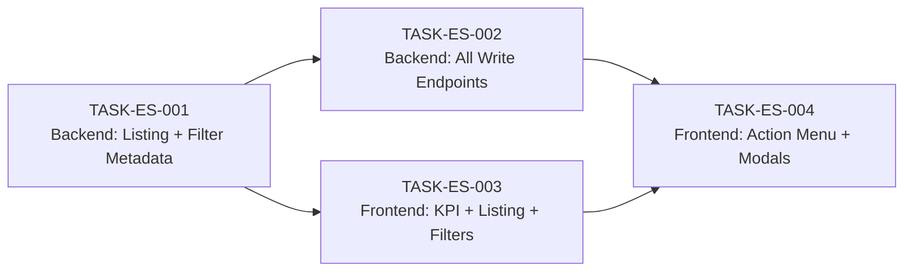

# Employee Support — Task Breakdown

**Module:** `ibp-service / employee-support`
**Jira Reference:** IIRM-10102
**TRD source:** [employee-support-TRD.md](employee-support-TRD.md)
**PRD source:** [employee-support-PRD.md](employee-support-PRD.md)
**Date:** 2026-05-05
**Author:** IIRM Engineering Team

> **Scope:** The Employee Support page (`HRPortalEmployeeSupport`, routed at `/hr-portal/employee-support`) is built with the full UI — KPI cards, employee listing table, filter bar, action menu, and all modals — already in place with stub handlers and no live API calls. The KPI SQL seed is applied to dev. Work remaining is: **(1)** creating the new `EmployeeSupportController` / `EmployeeSupportService` backend module with all read and write endpoints, and **(2)** replacing stub data in the UI with live API calls, matching the same integration pattern used by CD Management.
>
> **2026-05-06 implementation updates (applied to `HRPortalEnrolmentV2` / `HRPortalEmployeeProfile`):**
> - `email_enc`, `date_of_birth_enc`, `phone_number_enc` columns are now selected as raw values (`"email"`, `"dateOfBirth"`, `"phone"`) in both SQL scripts — encryption is not active in the current environment.
> - All API calls now use `useApiMutation` (POST/PUT) and `useApiQuery` (GET) hooks from `@ui/ui-lib` instead of calling `apiRequest` directly.
> - Dependents dialog in `HRPortalEnrolmentV2` now fetches live data from `endPoints.getRelationDetails(employeeId)` (GET) when opened.
> - Reset Password action in `HRPortalEmployeeProfile` action menu now calls `endPoints.ibpSendResetMailByEmail(email, domain)` (POST) and shows a success/error snackbar.

---

## What is already done

| Area | Status |
|---|---|
| `HRPortalEmployeeSupport` page + route + sidebar nav | Done — `apps/ui/ibp/src/app/pages/HRPortalEmployeeSupport/`, routed at `employee-support` in `HRPortal/index.tsx` |
| KPI card section UI (5 cards) | Done — Total, Active, Inactive, Enrolled, Not Enrolled |
| Employee listing table (columns, filter bar, search, pagination) | Done — stub/placeholder data |
| Action menu ("..." overflow) + all email / block / VIP / edit modal UI | Done — stub handlers, no live calls |
| Dependents modal + E-card modal | Done — UI built, no live data |
| HR Report Framework (`POST /hr-module/generate/:report`) | Done — `apps/services/ibp-service/src/app/hr-module/hr.controller.ts` / `hr.service.ts` |
| `HrModule` backend (NestJS module, service, repository) | Done — plugs in `EmployeeSupportModule` once created |
| `PolicyEnrollmentEmployee`, `User`, etc. entities | Done — `apps/services/service-lib/src/lib/entities/` |
| `company_email_template_map`, `notification_event_type` entities | Done — notification service integration already used elsewhere in ibp-service |
| KPI SQL seed (`emp_support_kpi_summary`) | Done — `apps/services/ibp-service/src/app/hr-module/hr-module-employee-support-scripts.sql` (schema-validated and applied to dev 2026-05-05) |
| Employee listing SQL (`ibp_hr_employee_listing`) | Done — idempotent block in both `hr-module-scripts.sql` and `hr-module-employee-support-scripts.sql`; columns `email`, `dateOfBirth`, `phone` return raw values |
| Employee profile summary SQL (`ibp_hr_employee_profile_summary`) | Done — idempotent block in `hr-module-employee-support-scripts.sql`; same raw-value column pattern |
| `HRPortalEnrolmentV2` KPI + listing live API wiring | Done — `useApiMutation` hooks; `?limit=0` pattern prevents double LIMIT/OFFSET |
| `HRPortalEmployeeProfile` profile live API wiring | Done — `useApiMutation`; navigates from listing row click |
| Dependents dialog live data | Done — `useApiQuery` on `endPoints.getRelationDetails(employeeId)` when dialog opens |
| Reset Password action (employee profile) | Done — `useApiMutation` → `endPoints.ibpSendResetMailByEmail`; success/error snackbar |
| `EmployeeSupportController` / `EmployeeSupportService` / `EmployeeSupportModule` | **Not yet created** |
| Endpoint constants in `endPoints.ts` | **Not yet created** |

---

## Integration Pattern

Two API paths serve this module. The KPI summary uses the existing HR Report Framework (same pattern as CD Management). All other endpoints use the new `EmployeeSupportController`.

All API calls use `useApiMutation` (POST/PUT/DELETE) or `useApiQuery` (GET) hooks from `@ui/ui-lib`. Endpoint URLs from `apps/ui/ui-lib/src/lib/constants/endPoints.ts`. `companyId` is read via `getCompanyId()` from `companyConfig`.

**Hook pattern — POST (mutation):**
```ts
const { mutate: fetchKpi, isPending: kpiLoading } = useApiMutation({
  config: {
    onSuccess: (res: any) => setKpiData(res?.data?.data?.[0] ?? null),
    onError: () => setKpiData(null),
  },
});
useEffect(() => {
  if (!companyId) return;
  fetchKpi({ endpoint: endPoints.generateHRReports + 'emp_support_kpi_summary', method: 'POST', data: { companyId } });
}, [companyId]);
```

**Hook pattern — GET (query):**
```ts
const { data, isLoading } = useApiQuery({
  url: endPoints.someGetEndpoint(id),
  queryKey: ['cacheKey', id],
  enabled: Boolean(id),
});
```

> **Response envelope note:** The framework path wraps rows as `{ statusCode: 201, data: { data: [...], count } }`. Read `result.data.data[0]` for the KPI row. The new `EmployeeSupportController` endpoints return `{ rows, count }` via `createResponse`, so `result.data.rows` is correct for those paths.

> **Double LIMIT/OFFSET note:** For framework report endpoints, always append `?limit=0` to the URL (e.g. `generateHRReports + 'report_name?limit=0'`). This prevents `HrService` from appending its own `LIMIT/OFFSET` on top of the SQL's own pagination parameters. Pass `limit` and `offset` in the POST body instead.

`companyId` is always taken from the JWT session on the backend — never passed from the frontend for the `EmployeeSupportController` endpoints.

---

## Task Summary

| ID | Summary | Type | Pts | Sprint | Role | Depends on |
|---|---|---|---|---|---|---|
| TASK-ES-001 | Backend: EmployeeSupportModule, employee listing endpoint, filter metadata endpoint | Story | 8 | 1 | Senior | — |
| TASK-ES-002 | Backend: Email actions, send reminder, block/unblock, VIP toggle, edit, dependents endpoints | Story | 8 | 1 | Senior | TASK-ES-001 |
| TASK-ES-003 | Frontend: Endpoint constants, KPI wiring, employee listing + filters + pagination + reminder | Story | 8 | 1 | Senior | TASK-ES-001 |
| TASK-ES-004 | Frontend: Action menu wiring — email dispatch, block/VIP/edit, E-card and Dependents modals | Story | 6 | 2 | Senior | TASK-ES-002, TASK-ES-003 |

**Total:** 30 story points across 4 tasks.

---

## Dependency Graph

TASK-ES-001 starts on day 1 with no dependencies. TASK-ES-002 and TASK-ES-003 run in parallel once ES-001 is merged — the backend developer continues with write endpoints while the frontend developer wires the listing. TASK-ES-004 completes the integration in Sprint 2 once both action endpoints and the wired listing table are available.



---

## Detailed Task List

---

#### TASK-ES-001: Backend — EmployeeSupportModule, employee listing endpoint, filter metadata endpoint

- **Type:** Story
- **Parent:** —
- **Epic:** Employee Support
- **Sprint:** Sprint 1
- **Points:** 8
- **Assignee:** Senior
- **Assigned to:** —
- **Traces to:** [US-01, US-02](employee-support-PRD.md#user-stories)
- **Depends on:** none
- **Description:** Scaffold the new NestJS module and implement two read endpoints: employee listing and filter metadata. This task unblocks both TASK-ES-002 (write endpoints) and TASK-ES-003 (frontend wiring) once merged.

  **(1) Module scaffold** — Create three files in `apps/services/ibp-service/src/app/hr-module/`:
  - `employee-support.controller.ts` — controller prefix `hr/employee-support` (verify with TL: check `main.ts` for a global prefix — if one exists the decorator must be just `'employee-support'`)
  - `employee-support.service.ts`
  - `employee-support.module.ts`

  Register `EmployeeSupportModule` in `HrModule` (`hr.module.ts`). Apply `JwtAuthGuard` and `RolesGuard(HR_ADMIN)` at the class level on the controller ([TRD §13.2](employee-support-TRD.md#132-authorization)).

  **(2) Employee listing — `GET /hr/employee-support/employees`** — Accepts query params: `page` (default 1), `limit` (default 25, max 100), `search` (partial match on `pee.full_name` or `pee.company_employee_id`), `status` (maps to `u.user_status_key`), `enrollmentStatus` (maps to `employee_enrollment_status_key`), and any dynamic JSONB param from filter-metadata (`pee.additional_params->>'param_name'`). `companyId` always comes from the JWT session — never from the query string ([TRD §8.1](employee-support-TRD.md#81-request)).

  Use the TypeORM entity path (not raw SQL) so that `email_enc` is decrypted automatically by the `@SensitiveField` decorator. The columns `email_enc`, `date_of_birth_enc`, and `phone_number_enc` must **never** be selected in raw SQL — only `IS NOT NULL` presence checks are safe ([TRD §4.3](employee-support-TRD.md#43-encrypted-field-rule)). Follow the reference query structure in [TRD §8.0](employee-support-TRD.md#80-reference-query-structure). Return `{ rows, count }` via `createResponse`.

  **(3) Filter metadata — `GET /hr/employee-support/filter-metadata`** — Follow [TRD §9.3](employee-support-TRD.md#93-resolution-logic): always prepend `status` and `enrollmentStatus` as system-level filters; fetch active `policy_enrollment_parameters` rows for the company's policies; deduplicate by parameter `name`; for `select`-type params, derive `options` from distinct non-null values of `pee.additional_params->>'name'`. Return `{ filters: [...] }`.

- **Decision budget:**
  - Junior can decide: DTO validation decorators (use `class-validator` matching patterns elsewhere in ibp-service), pagination response field names
  - Escalate to TL/PTL: controller route prefix convention — global prefix vs explicit `'hr/employee-support'` (check `main.ts` on day 1, blocks everything); whether a GIN index on `additional_params` exists (OQ-TRD-7 — flag for DBA before implementing JSONB filter)
- **Acceptance criteria:**
  - [ ] `GET /hr/employee-support/employees?page=1&limit=25` returns 200 with `data.rows` (array) and `data.count` (number)
  - [ ] `email` in each row is decrypted plaintext; `hasEmail: false` when null
  - [ ] `companyId` in query string is ignored — session value always applied
  - [ ] `search=Arjun` returns only employees whose name or `company_employee_id` contains "Arjun" (case-insensitive)
  - [ ] `status=USER_STATUS_ACTIVE` filter narrows results; unrecognised values return empty rows, not 400
  - [ ] Soft-deleted employees (`pee.deleted_at IS NOT NULL`) never appear
  - [ ] Dynamic JSONB filter (e.g. `gender=Female`) narrows results correctly
  - [ ] `GET /hr/employee-support/filter-metadata` returns 200 with `data.filters`; `status` and `enrollmentStatus` are always first
  - [ ] Unauthenticated request → 401; wrong role → 403
- **Definition of Done:**
  - [ ] Jira ticket updated to Done
  - [ ] Unit tests for service layer (mocked TypeORM repositories)
  - [ ] Integration test: listing verified against seeded fixture data; `email_enc` decrypted in response
  - [ ] PR reviewed and merged

---

#### TASK-ES-002: Backend — Email actions, send reminder, block/unblock, VIP toggle, edit, dependents

- **Type:** Story
- **Parent:** —
- **Epic:** Employee Support
- **Sprint:** Sprint 1
- **Points:** 8
- **Assignee:** Senior
- **Assigned to:** —
- **Traces to:** [US-04, US-07, US-08, US-09, US-10, US-13](employee-support-PRD.md#user-stories)
- **Depends on:** TASK-ES-001 (module and service scaffold must exist)
- **Description:** Add all write and additional read endpoints to `EmployeeSupportController`. Six endpoints shipped in this task — the module scaffold from TASK-ES-001 must be merged first.

  **(1) Send email — `POST /hr/employee-support/employees/:employeeId/send-email`** — Body: `{ actionType: 'ECARD_EMAIL' | 'RESET_PASSWORD_EMAIL' | 'ENROLLMENT_EXTENSION_EMAIL' | 'WELCOME_EMAIL' }`. Execution per [TRD §10.1](employee-support-TRD.md#101-send-email-action): load employee → verify company + `deleted_at IS NULL` + `email_enc` non-null → look up `company_email_template_map` by `event_type_id` → dispatch to notification service → write audit log → return 200. See the `actionType` → event name mapping in [TRD §10.2](employee-support-TRD.md#102-email-action-type-to-event-name-mapping).

  **(2) Send reminder — `POST /hr/employee-support/employees/:employeeId/send-reminder`** — No body. Same logic as send-email with `actionType` fixed to `REMINDER_EMAIL` / `HR_REMINDER`. Dedicated endpoint for the one-click row button so the frontend does not need to construct a body ([TRD §10.3](employee-support-TRD.md#103-send-reminder)).

  **(3) Block / Unblock — `POST /hr/employee-support/employees/:employeeId/block`** — No body. HR Admin service-layer check + guard. Toggles `user_status_key`: `USER_STATUS_ACTIVE → BLOCKED`, `BLOCKED → USER_STATUS_ACTIVE`. Also update `status_lid`. Confirm `BLOCKED` literal and LookUp ID with TL (OQ-TRD-3 — blocking). Write audit log. Return `{ updatedStatus, isBlocked }` ([TRD §10.4](employee-support-TRD.md#104-block--unblock-access)).

  **(4) VIP toggle — `POST /hr/employee-support/employees/:employeeId/vip`** — No body. Read `is_vip` from `PolicyEnrollmentEmployee`; toggle; save; write audit log; return `{ isVip: boolean }`. Confirm the column exists before writing any code (OQ-TRD-8 — blocking; a migration may be required).

  **(5) Edit Employee — `PATCH /hr/employee-support/employees/:employeeId`** — Body: partial update of `{ employeeName, gender, dateOfBirth, mobile }`. Validate with `class-validator`. Save to entity. Write audit log with the list of changed fields. Return the updated row in the shape of [TRD §8.2](employee-support-TRD.md#82-response-200). Confirm the full editable field list with product before coding (OQ-TRD-9 — blocking).

  **(6) Dependents list — `GET /hr/employee-support/employees/:employeeId/dependents`** — Verify `employeeId` belongs to the session company. Query `policy_enrollment_dependent WHERE employee_id = :employeeId AND deleted_at IS NULL`. Return `{ rows, count }` per [TRD §10.7](employee-support-TRD.md#107-dependents-list).

- **Decision budget:**
  - Junior can decide: DTO field names and `class-validator` rules, exact error message strings for 400 responses
  - Escalate to TL/PTL: `BLOCKED` status literal + `status_lid` LookUp ID (OQ-TRD-3 — needed before writing the block endpoint); exact `notification_event_type.name` values (OQ-TRD-4); `is_vip` column existence (OQ-TRD-8 — check before VIP endpoint); editable field list for PATCH (OQ-TRD-9)
- **Acceptance criteria:**
  - [ ] `POST .../send-email` with valid `actionType` → 200; audit log entry written
  - [ ] `POST .../send-email` for employee with no email → 400 "No email address on file"
  - [ ] `POST .../send-email` with unconfigured action type → 400 "No email template configured"
  - [ ] Notification service unreachable → 503
  - [ ] `POST .../send-reminder` → 200; sends REMINDER_EMAIL; audit log written
  - [ ] `POST .../block` on ACTIVE employee → 200; `isBlocked: true`; `user_status_key` updated
  - [ ] `POST .../block` on BLOCKED employee → 200; `isBlocked: false` (unblocked)
  - [ ] `POST .../block` on INACTIVE employee → 400 "Cannot block/unblock a permanently inactive account"
  - [ ] `POST .../block` by non-HR_ADMIN → 403
  - [ ] `POST .../vip` toggles correctly between `true` and `false`; audit log written
  - [ ] `PATCH /` with valid field → 200; updated row returned; listing reflects change
  - [ ] `PATCH /` with invalid field value → 422 with field-level error
  - [ ] `GET .../dependents` → 200 with `data.rows`; empty array when no dependents
  - [ ] All endpoints reject cross-company `employeeId` with 400
  - [ ] Audit log write failure does not fail the primary action
- **Definition of Done:**
  - [ ] Jira ticket updated to Done
  - [ ] Unit tests for all service methods (all error branches mocked)
  - [ ] E2E test: send-email → 200; block/unblock toggle → correct status; wrong role → 403
  - [ ] PR reviewed and merged

---

#### TASK-ES-003: Frontend — Endpoint constants, KPI wiring, employee listing, filters, pagination, reminder

- **Type:** Story
- **Parent:** —
- **Epic:** Employee Support
- **Sprint:** Sprint 1
- **Points:** 8
- **Assignee:** Senior
- **Assigned to:** —
- **Traces to:** [US-01, US-02, US-11, US-12](employee-support-PRD.md#user-stories)
- **Depends on:** TASK-ES-001 (employee listing + filter-metadata endpoints live)
- **Description:** Register all endpoint constants, then replace stub data in the page with live API calls for the KPI section, employee listing table, filter bar, and pagination. The UI shell, column renderers, filter controls, and modal placeholders are already built — this task wires them to real data.

  **(1) Endpoint constants** — Add all nine entries listed in the Integration Pattern above to the `ibpEndPoints` block in `apps/ui/ui-lib/src/lib/constants/endPoints.ts`. If `cdGenerateReport` is already registered and is generically named (takes a report key), confirm with TL whether to reuse it for `empSupportKpi`. Either way, `empSupportKpi()` must resolve to `/hr-module/generate/emp_support_kpi_summary`.

  **(2) KPI wiring** — On page mount, fire the KPI call in parallel with the listing and filter-metadata calls ([TRD §12.1](employee-support-TRD.md#121-initial-screen-load)):
  ```ts
  apiRequest(endPoints.empSupportKpi() + '?page=1&limit=0',
    { method: 'POST', data: { companyId: String(companyId) } })
  ```
  Read `result.data.data[0]`. Map to the five KPI card slots: `totalEmployees`, `activeEmployees`, `inactiveEmployees`, `enrolledEmployees`, `notEnrolledEmployees`. Show `"—"` for any null field. Show loading state while in flight.

  **(3) Employee listing** — On mount, call `GET /hr/employee-support/employees?page=1&limit=25`. Map `result.data.rows` to the table. All 14 fixed columns from [TRD §8.2](employee-support-TRD.md#82-response-200) must render. Column rules: `hasEmail: false` → email column shows `"—"`, Reminder button disabled, E-card cell greyed with tooltip "No e-card available"; `ecardKey` null → same grey treatment.

  **(4) Filter bar driven by filter-metadata** — On mount, call `GET /hr/employee-support/filter-metadata`. Use `result.data.filters` to render controls: `type: 'select'` → dropdown with `options`; `type: 'text'` → text input. Always render `status` and `enrollmentStatus` first (they are always present). When any filter changes (300ms debounce), re-fetch the listing with active filter params and reset to page 1. Search bar maps to the `search` query param on the same debounce trigger ([TRD §12.2](employee-support-TRD.md#122-filter-apply)).

  **(5) Pagination** — Standard page-based pagination using `data.count`. `Math.ceil(count / 25)` total pages. Offset computed server-side as `(page − 1) × 25`. Display current page and total pages.

  **(6) Reset** — Wire the Reset button to clear all active filter state to defaults (`status=''`, `enrollmentStatus=''`, `search=''`, all dynamic params cleared, `page=1`) and re-fetch ([TRD §12.3](employee-support-TRD.md#123-reset-filters)).

  **(7) Reminder "Send" row button** — The Send button in the Reminder column dispatches `POST .../send-reminder` immediately on click. Disabled when `hasEmail === false`. Shows a row-level loading indicator while in-flight. Success toast on 200; error toast on 400 / 503.

- **Decision budget:**
  - Junior can decide: debounce approach (match the pattern used in `HRPortalFinance`), status badge colour scheme, empty-state copy
  - Escalate to TL/PTL: whether KPI counts update when filters are applied (OQ-TRD-5 — if yes, re-fire KPI call on every filter change; this affects the mount sequence); whether `additionalParams` columns render inline or in a collapsible "More" section when many appear
- **Acceptance criteria:**
  - [ ] All nine endpoint constants present in `endPoints.ts` and TypeScript-checked (no `any`)
  - [ ] `empSupportKpi()` resolves to `/hr-module/generate/emp_support_kpi_summary`
  - [ ] Five KPI cards show live data for a seeded company; null field → `"—"`, no crash
  - [ ] Table loads with 25 rows on page mount; all 14 fixed columns render
  - [ ] `status` and `enrollmentStatus` filters narrow the table independently; any filter change resets to page 1
  - [ ] Search triggers re-fetch after 300ms debounce; clearing search restores all rows
  - [ ] Pagination controls work; total page count matches `Math.ceil(count / 25)`
  - [ ] `hasEmail: false` → email column `"—"`; Reminder button disabled; E-card greyed with tooltip
  - [ ] Reminder "Send" click → `send-reminder` dispatched; success/error toast; no crash if employee has no email (button was disabled)
  - [ ] Reset button clears all filters and re-fetches
  - [ ] Empty-result state ("No employees found") renders when `data.rows` is empty
- **Definition of Done:**
  - [ ] Jira ticket updated to Done
  - [ ] Verified in browser — KPI cards, all columns, filter combinations, pagination, Reminder button, and empty state spot-checked
  - [ ] PR reviewed and merged

---

#### TASK-ES-004: Frontend — Action menu wiring, email dispatch, block/VIP/edit, E-card and Dependents modals

- **Type:** Story
- **Parent:** —
- **Epic:** Employee Support
- **Sprint:** Sprint 2
- **Points:** 6
- **Assignee:** Senior
- **Assigned to:** —
- **Traces to:** [US-03, US-04, US-08, US-09, US-13](employee-support-PRD.md#user-stories)
- **Depends on:** TASK-ES-002 (action endpoints live), TASK-ES-003 (listing table wired and rows have real data)
- **Description:** Wire the `"..."` action menu and all modals to the live backend. The menu UI, modal shells, and disabled-state logic are already built — this task replaces stub handlers with real API calls and wires the success/error feedback loop.

  **(1) "..." action menu — 7 items per row:** Block Access / Unblock Access (label toggled by `row.isBlocked`), Tag as VIP / Remove VIP (toggled by `row.isVip`), Edit Employee, Reset Password, Send eCard Email, Extend Enrollment Window, Send Welcome Email.
  - `row.hasEmail === false` → disable the 4 email items; tooltip "No email address on file"
  - `row.status === 'INACTIVE'` → disable all 7 items; tooltip "Employee is inactive"
  - Block / Unblock — HR Admin only; hide or disable for other roles

  **(2) Email action dispatch** — Each of the 4 email menu items calls `POST .../send-email` with the matching `actionType` from [TRD §10.2](employee-support-TRD.md#102-email-action-type-to-event-name-mapping). 200 → success toast; 400 → error toast with message from response; 503 → error toast with Retry option (re-trigger same POST).

  **(3) Block / Unblock** — Calls `POST .../block`. No confirmation modal (action is reversible). 200 → update `row.isBlocked` and status badge in place; toggle the menu item label. 400 / 503 → error toast.

  **(4) Tag / Untag VIP** — Calls `POST .../vip`. 200 → update `row.isVip` in place; toggle the VIP badge on the name cell and the menu item label.

  **(5) Edit Employee** — Opens the Edit panel/modal pre-populated from current row values. On save: call `PATCH /hr/employee-support/employees/:id`; on 200, update the row in place and show success toast; on 422, show field-level validation errors inline. On cancel: no change.

  **(6) E-card Modal** — Triggered by the "View" link in the E-card column (wired in TASK-ES-003). Opens modal showing the e-card PDF loaded from `row.ecardKey`. Download button. Close on backdrop or ×. No separate API call — `ecardKey` already in the row.

  **(7) Dependents Modal** — Triggered by clicking the Dependents count cell (wired in TASK-ES-003). Calls `GET .../dependents` on open. Shows table: Name, Relation, DOB, Coverage. Empty state: "No dependents on record."

  **(8) Double-submit prevention** — The action menu is disabled for a row while any call is in-flight for that row. Show a row-level loading indicator. Prevent duplicate submissions on fast double-clicks.

- **Decision budget:**
  - Junior can decide: modal component choice (match MUI Dialog pattern used elsewhere in the HR portal), toast duration, exact loading indicator style per row
  - Escalate to TL/PTL: Edit Employee editable field list (OQ-TRD-9 — must be resolved before this task starts); whether KPI counts should re-fetch after Block/Unblock (client-side decrement vs full KPI re-fetch); whether Block should show a confirmation modal despite being reversible
- **Acceptance criteria:**
  - [ ] "..." menu renders 7 items; Block/VIP labels toggle correctly based on `row.isBlocked` / `row.isVip`
  - [ ] `hasEmail: false` → 4 email items disabled with tooltip; Unblock/VIP/Edit still enabled
  - [ ] `status === 'INACTIVE'` → all 7 items disabled
  - [ ] Each email action sends correct `actionType` → 200: success toast; 400: error toast; 503: retry toast
  - [ ] Block → 200: row status badge updates to "Blocked"; menu item → "Unblock Access"
  - [ ] Unblock → 200: row status badge → "Active"; menu item → "Block Access"
  - [ ] Tag as VIP → 200: VIP badge appears on name cell; menu → "Remove VIP"; second call removes badge
  - [ ] Edit → save with valid fields → 200: row updates in place, success toast; cancel → no change
  - [ ] Edit → save with invalid field → 422: field-level error shown inline, modal stays open
  - [ ] E-card Modal: opens with PDF from `ecardKey`; Download button works; closes on backdrop/×
  - [ ] Dependents Modal: calls `GET .../dependents` on open; shows table; empty state when 0 dependents
  - [ ] No double-submission while any call in-flight for a row; menu disabled during in-flight state
- **Definition of Done:**
  - [ ] Jira ticket updated to Done
  - [ ] Verified in browser — all 7 menu actions, both modals, and all toast/error states tested
  - [ ] PR reviewed and merged

---

## Open Questions

1. **OQ-TRD-3 — Block/Unblock status literal:** Confirm `user_status_key = 'BLOCKED'` is the correct value and identify the corresponding `status_lid` LookUp ID. Also confirm whether block/unblock must propagate to external systems beyond the portal. Blocking: TASK-ES-002, TASK-ES-004.

2. **OQ-TRD-4 — Notification event type names:** Confirm the `notification_event_type.name` values for all action types match the mapping in [TRD §10.2](employee-support-TRD.md#102-email-action-type-to-event-name-mapping) (`HR_ECARD`, `HR_RESET_PASSWORD`, `HR_ENROLLMENT_EXTENSION`, `HR_WELCOME`, `HR_REMINDER`). A mismatch causes template lookup to return no record and the action to fail with 400. Blocking: TASK-ES-002.

3. **OQ-TRD-5 — KPI filter linkage:** The PRD requires KPI counts to update when filters are applied. Two options: (a) extend the KPI SQL with filter placeholders matching the employee listing (backend change to seed script + SQL); (b) recompute counts client-side from the listing `data.rows` response. Confirm the preferred approach with product before TASK-ES-003 starts. Blocking: TASK-ES-003.

4. **OQ-TRD-7 — JSONB filter performance:** Filtering by `pee.additional_params->>'gender'` requires a GIN index on `additional_params` to remain fast at scale. Confirm with DBA whether the index exists before TASK-ES-001 implements the JSONB filter path. Blocking: TASK-ES-001 for large datasets.

5. **OQ-TRD-8 — VIP column:** Confirm whether `policy_enrollment_employee` has an `is_vip` boolean column, or whether VIP is tracked in a separate flag/tag table. If the column does not exist, a DB migration is required before TASK-ES-002 can implement the VIP endpoint. Blocking: TASK-ES-002.

6. **OQ-TRD-9 — Edit Employee field list:** Confirm the full set of fields editable via `PATCH` for Phase 1, and whether any edits must propagate to the enrollment service or an external insurer system. Blocking: TASK-ES-002 (PATCH body), TASK-ES-004 (Edit modal fields).

7. **Controller prefix convention:** Confirm whether `ibp-service` has a global route prefix `hr` already applied (check `main.ts` on day 1). If yes, the `@Controller()` decorator needs just `'employee-support'`; if no, it needs the full string `'hr/employee-support'`. Getting this wrong means all routes 404. Blocking: TASK-ES-001 (day 1).

---

## Approval

Leave blank. Architect and PTL sign-off required before implementation begins.

```
Approved by:
Role:
Date:

Approved by:
Role:
Date:
```
