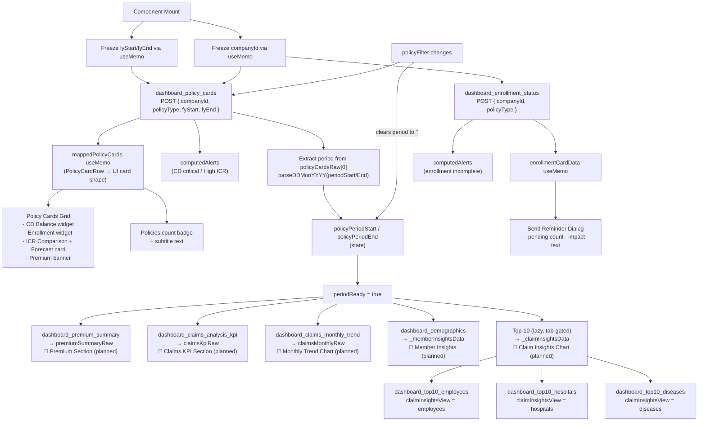

# HR Analytics Dashboard — Data Flow & API Integration Reference

**File:** `apps/ui/ibp/src/app/pages/HRPortalDashboard/index.tsx`  
**Hook:** `apps/ui/ibp/src/app/hooks/useHRReport.ts`  
**Types:** `apps/ui/ibp/src/app/pages/HRPortalDashboard/types.ts`  
**Utilities:** `apps/ui/ibp/src/app/utils/hrAnalytics.ts`  
**SQL Scripts:** `apps/services/ibp-service/src/app/hr-module/hr-module-analytics-scripts.sql`

---

## 1. Common API Contract

All reports share the same HTTP pattern.

| Property | Value |
|----------|-------|
| Method | `POST` |
| Endpoint | `/iirm/ibp-service/hr-module/generate/:reportKey` |
| Request body | JSON — `{ companyId, ...reportParams }` |
| Response envelope | `{ data: { data: T[], count?: number } }` |
| Row access | `res.data.data` (array) — `res.data.data[0]` for single-row reports |

**`endPoints.generateHRReports`** expands to the base URL prefix. The `reportKey` is appended directly (e.g., `generateHRReports + "dashboard_policy_cards"`).

---

## 2. Fetch Architecture & Dependency Chain

```
Mount
  │
  ├─► dashboard_policy_cards  (always enabled, uses frozen FY defaults)
  │         │
  │         └─ response → setPolicyPeriodStart / setPolicyPeriodEnd
  │                               │
  │                               └─► periodReady = true
  │                                         │
  │              ┌───────────────────────────┤
  │              │                           │
  ├─► dashboard_premium_summary              │
  ├─► dashboard_claims_analysis_kpi          │  (all enabled only after periodReady)
  ├─► dashboard_claims_monthly_trend         │
  ├─► dashboard_demographics                 │
  └─► dashboard_enrollment_status  ──────────┘  (no period dependency)

Lazy (tab-gated):
  claimInsightsView === "employees"  →  dashboard_top10_employees
  claimInsightsView === "hospitals"  →  dashboard_top10_hospitals
  claimInsightsView === "diseases"   →  dashboard_top10_diseases
```

### Why `dashboard_policy_cards` uses frozen FY dates

`policyPeriodStart/End` state is populated *from* the `policy_cards` response. If these state variables were also passed *into* `policy_cards` params, changing them after the response would re-trigger `policy_cards` — a circular re-fetch. Instead, `policy_cards` receives the frozen `fyStart/fyEnd` values (computed once on mount via `useMemo`), and all other reports receive the confirmed period state.

### `periodReady` gate

`periodReady = !!policyPeriodStart && !!policyPeriodEnd`

- Starts **false** (both values are `""` on mount)
- Becomes **true** once `policy_cards` returns and the period effect runs
- Resets to **false** on every `policyFilter` change (a `useEffect([policyFilter])` clears both period values), disabling downstream reports while `policy_cards` re-fetches for the new filter

---

## 3. UI Component & Widget Mapping

This section maps each report key to the exact dashboard section and widgets that consume its data. Status column indicates whether the JSX wiring is currently active or planned.

| Report Key | Dashboard Section | Widget / Component | Status |
|------------|------------------|--------------------|--------|
| `dashboard_policy_cards` | Policy Cards Grid — header, CD Balance, Enrollment, Claim Ratio | Policy card loop (`mappedPolicyCards.map`), Policy count badge, Alert engine | **Active** |
| `dashboard_enrollment_status` | Send Reminder Dialog | Pending count badge, impact text, post-send confirmation | **Active** |
| `dashboard_enrollment_status` | Alert Panel | Enrollment incomplete alert (< 80% confirmed) | **Active** |
| `dashboard_premium_summary` | Premium Summary Section *(planned)* | Premium breakdown bar/table, YoY delta badge | **Pending JSX** |
| `dashboard_claims_analysis_kpi` | Claims KPI Section *(planned)* | Total / Paid / Pending claim tiles, Claim ratio badge, YoY chips | **Pending JSX** |
| `dashboard_claims_monthly_trend` | Monthly Trend Chart *(planned)* | Line/bar chart — cashless vs reimbursement, prior-year overlay | **Pending JSX** |
| `dashboard_demographics` | Member Insights Section *(planned)* | Inception / Addition / Deletion / Total quadrant cards | **Pending JSX** |
| `dashboard_top10_employees` | Claim Insights — Employees tab *(planned)* | Horizontal bar chart, rank-change badges | **Pending JSX** |
| `dashboard_top10_hospitals` | Claim Insights — Hospitals tab *(planned)* | Horizontal bar chart, rank-change badges | **Pending JSX** |
| `dashboard_top10_diseases` | Claim Insights — Diseases tab *(planned)* | Horizontal bar chart, rank-change badges | **Pending JSX** |

---

## 4. Report Catalogue

Each report entry includes: purpose, fetch config, request params, response field mapping, **UI consumer details**, and data transformation notes.

---

### 4.1 `dashboard_policy_cards`

| Property | Detail |
|----------|--------|
| Purpose | Primary data source. One row per active policy. Drives the entire Policy Card grid and seeds period state for all downstream reports. |
| Enabled | `!!companyId` — fires immediately on mount |
| Request params | `{ companyId, policyType, policyPeriodStart: fyStart, policyPeriodEnd: fyEnd }` |
| TypeScript type | `PolicyCardRow[]` |
| Data variable | `policyCardsRaw` → `mappedPolicyCards` (via useMemo) |

#### UI Consumers

**1. Policy Cards Grid** — `mappedPolicyCards.map((policy) => ...)`  
The main repeating card layout. Each API row renders one full-width policy card with three sub-sections:

---

**Card Header**

| API Field | UI Element |
|-----------|-----------|
| `policyName` | Card title (Typography, 15px bold) |
| `policyTypeKey` + `policyName` | Policy type icon — `HeartHandshake` (GMC/GMP), `Shield` (GTL/Life), `Activity` (GPA), `Users` (GPC/Parental) via `getPolicyIconProps()` |
| `policyId` | Policy ID chip — formatted as `POL-{policyId}` |
| `insurer` | Metadata pill in header row |
| `periodStart` + `periodEnd` | Period metadata pill (e.g., "01 Apr 2025 – 31 Mar 2026") |
| `netPremium` | Annual Premium value (amber, 18px bold) |
| — | "Active" green badge (all returned policies are active) |
| — | Chevron arrow → click navigates to `/hr-portal/policy-summary/:policyId` |

---

**CD Balance Widget** (left side of Row 1)

| API Field | Derived Field | UI Element |
|-----------|--------------|-----------|
| `cdBalance` | `policy.available` | Large balance value (34px, coloured by `cdColor`) |
| `netPremium` | `policy.totalAmount` | "Total:" sub-label and right end of progress bar |
| `cdBalance`, `netPremium` | `policy.usedPct` = `100 - (cdBalance/netPremium)*100` | Filled portion of the balance progress bar |
| `cdBalance < safeLimit` | `policy.cdColor` | Bar fill colour: `#EF4444` (critical) / `#10B981` (healthy) |
| `netPremium * 0.05` | `policy.safeLimit` | Amber safe-limit strip line + label on the bar |
| `cdBalance < safeLimit` | `policy.cdStatus` | Status text — "Below safe limit" or "Above safe limit" |
| `cdBalance`, `netPremium` | `policy.cdInsightText` | Insight description below status |
| `annualPremium`, `safeLimit` | *(tooltip)* | "Safe limit = 5% of premium · ₹X × 5% = ₹Y" (visible on bar hover) |

---

**Enrollment Widget** (right side of Row 1)

| API Field | Derived Field | UI Element |
|-----------|--------------|-----------|
| `totalLives` | `policy.lives` | "Total Lives" tile value |
| `employeeCount` | `policy.totalEmployees` | "Total Employees" tile value |
| `dependentCount` | `policy.totalDependents` | "Total Dependents" tile value |
| `enrolledCount` | `policy.enrolled` | ENROLLED tile — count + % of `employeeCount` |
| `inProgressCount` | `policy.inProgress` | IN PROGRESS tile — count + % |
| `notEnrolledCount` | `policy.notEnrolled` | NOT ENROLLED tile — count + % |
| `notEnrolledCount` | — | Pending banner: "X pending · Ends {periodEnd}" |
| `periodEnd` | `policy.enrollEndDate` | Deadline shown in pending banner |

Emp/Dep breakdown within each enrollment tile is estimated from `(employeeCount / totalLives)` ratio since the API returns per-policy totals, not per-status employee/dependent splits.

---

**Claim Ratio (ICR) Section** (Row 2, full width)

*Section header & big ICR number:*

| API Field | Derived Field | UI Element |
|-----------|--------------|-----------|
| `icrPercent` | `policy.claimValue` | Large ICR % (34px bold) |
| `icrClaimCount` | `policy.claimCount` | "X claims" sub-label |
| `icrYoYChangePercent` | `policy.claimDelta` via `formatYoYDelta()` | "↓4%" / "↑26%" YoY chip |
| `icrYoYChangePercent <= 0` | `policy.claimDeltaGood` | Chip colour: green (decrease = good for ICR) |

*ICR Comparison Card (3 period columns — Full Year Avg / Same Period LY / Current):*

| Period | API Source | Fields shown |
|--------|-----------|--------------|
| Full Year Avg (LY) | `icrFullYearAvgLY`, `icrSamePeriodLYAmount` | ICR %, incurred amount, bar chart |
| Same Period LY | `icrSamePeriodLYPercent`, `icrSamePeriodLYAmount` | ICR %, incurred amount, bar chart |
| Current Period | `icrPercent`, `claimAmount` | ICR %, incurred amount, bar chart + delta chip |

Note: `lyClaimCount` / `lyAvgClaimCount` are stubbed to `0` since the SQL does not return prior-year claim counts — only amounts and percentages. Bar heights are computed from amounts only.

*Forecast Card (dashed purple card):*

| API Field | Derived Field | UI Element |
|-----------|--------------|-----------|
| `icrForecastPercent` | `policy.forecastICR` | Predicted ICR % (large, purple) |
| `forecastICR` (or client calc) | `predICR` | "~{N}%" forecast badge |
| `claimCount`, `predICR/icrPercent` | `predClaims` | Estimated next-year claim count |
| `claimAmount`, `predICR/icrPercent` | `predIncurredNum` | Estimated next-year incurred (₹L) |

If `icrForecastPercent` is `null`, a client-side fallback is used: `max(round(claimValue − (claimLYNum − claimValue)), 30)`.

*Premium Optimization Banner (bottom of ICR section):*

| API Field | UI Element |
|-----------|-----------|
| `icrPercent > 80` | Message tone — "Premium at risk" (red) vs "Premium outlook" (green) |
| `premiumOutlookText` | Body text derived from ICR status |
| `premiumSavingValue` | "Save ₹X.XL" chip (shown only when non-null) |

---

**2. Policies Header Bar** — `mappedPolicyCards.length`

| UI Element | Source |
|-----------|--------|
| "N Active" badge | `mappedPolicyCards.length` (hidden while loading) |
| Subtitle text | "Showing all N policies" / "Showing Life policies" etc. |

---

**3. Loading / Error States**

| State | UI |
|-------|-----|
| `policyCardsLoading = true` | 3-row shimmer skeleton (animated gradient boxes) |
| `policyCardsError = true` | Error message + Retry button calling `refetchPolicyCards()` |

---

**4. Alert Engine** — `computedAlerts` useMemo

| Alert | Trigger | UI |
|-------|---------|-----|
| `cd-{policyId}-critical` | `cdBalance < netPremium * 0.05` | CD Critical alert: "X balance critical — Y below safe limit" |
| `claims-ratio-spike` | Any policy `icrPercent > 80` | High ICR alert: "ICR above 80% on N policies" |

---

**5. Period Seed** — `useEffect([policyCardsRaw])`

`policyCardsRaw[0].periodStart` and `periodEnd` are parsed via `parseDDMonYYYY()` and written to `policyPeriodStart/End` state, which gates all downstream report fetches.

---

### 4.2 `dashboard_enrollment_status`

| Property | Detail |
|----------|--------|
| Purpose | Company-wide enrollment funnel — total eligible vs confirmed enrollment. |
| Enabled | `!!companyId` — fires immediately (no period dependency) |
| Request params | `{ companyId, policyType }` |
| TypeScript type | `EnrollmentStatusRow` (single row — `[0]` access) |
| Data variable | `enrollmentStatusRaw` → `enrollmentCardData` (via useMemo) |

#### UI Consumers

**1. Send Reminder Dialog** — `<Dialog open={sendReminderOpen}>`

The dialog is triggered from a separate action (e.g., a "Send Reminder" button not yet wired to JSX). It uses `enrollmentCardData` which is derived directly from `enrollmentStatusRaw[0]`.

| `enrollmentCardData` field | Source | UI Element |
|---------------------------|--------|-----------|
| `notEnrolledCount` = `totalEligible − enrollmentConfirmed` | Computed | "N employees pending" — large number in the dialog body |
| `notEnrolledCount` | Computed | Confirmation text after send: "Reminders have been sent to N employees" |
| `impact` | Conditional text | Descriptive paragraph: "N employees have not enrolled and may not access benefits…" |

**2. Alert Engine** — `computedAlerts` useMemo

| Alert | Trigger | UI |
|-------|---------|-----|
| `enrollment-incomplete` | `enrollmentConfirmedPercent < 80` | Enrollment warning: "N employees not enrolled — send reminders" |

**Planned additional consumers** (pending JSX implementation):
- Enrollment status widget / donut chart showing `loggedIn`, `enrollmentConfirmed`, `notLoggedIn` breakdown
- `loggedInPercent` / `enrollmentConfirmedPercent` for funnel visualization

---

### 4.3 `dashboard_premium_summary`

| Property | Detail |
|----------|--------|
| Purpose | Aggregate premium breakdown across the policy period with prior-year comparison. |
| Enabled | `!!companyId && periodReady` |
| Request params | `{ companyId, policyType, policyPeriodStart, policyPeriodEnd }` |
| TypeScript type | `PremiumSummaryRow` (single row) |
| Data variable | `premiumSummaryRaw` |
| JSX status | **Data fetched — UI section not yet built** |

#### Planned UI Consumers

| Dashboard Section | Widget | Fields to use |
|------------------|--------|---------------|
| Premium Summary Card | Premium breakdown bar or stacked chart | `inceptionPremium`, `additionPremium`, `deletionPremium`, `topUpPremium`, `totalPremium` |
| Premium Summary Card | YoY comparison row | `totalPremiumPrevYear`, `totalPremiumYoYChangePercent` |
| Premium Summary Card | Per-component YoY rows | `inceptionPremiumPrevYear` … `topUpPremiumPrevYear` |
| Premium KPI tiles | Current period totals | `totalPremium` formatted via `formatINR()` |
| YoY badge | Change direction chip | `totalPremiumYoYChangePercent` via `formatYoYDelta()` + `yoYBadgeColor()` |

---

### 4.4 `dashboard_claims_analysis_kpi`

| Property | Detail |
|----------|--------|
| Purpose | Aggregate claim KPIs for the period — total, paid, pending — with claim ratio and prior-year comparisons. |
| Enabled | `!!companyId && periodReady` |
| Request params | `{ companyId, policyType, startDate: policyPeriodStart, endDate: policyPeriodEnd, claimType: "", claimStatus: "", memberType: "" }` |
| TypeScript type | `ClaimsKpiRow` (single row) |
| Data variable | `claimsKpiRaw` |
| JSX status | **Data fetched — UI section not yet built** |

#### Planned UI Consumers

| Dashboard Section | Widget | Fields to use |
|------------------|--------|---------------|
| Claims Summary Section | Total Claims tile | `totalClaimsCount`, `totalClaimsAmount` via `formatINR()` |
| Claims Summary Section | Paid Claims tile | `paidClaimsCount`, `paidClaimsAmount` |
| Claims Summary Section | Pending Claims tile | `pendingClaimsCount`, `pendingClaimsAmount` |
| Claims Summary Section | Claim Ratio badge | `claimRatioPercent` — red if > 80% |
| Claims Summary Section | YoY chips (3 metrics) | `totalClaimsAmountYoYChangePercent`, `paidClaimsAmountYoYChangePercent`, `pendingClaimsAmountYoYChangePercent` via `formatYoYDelta()` |
| Claims Comparison table | Prior-year row | `totalClaimsAmountPrevYear`, `paidClaimsAmountPrevYear`, `pendingClaimsAmountPrevYear` |

---

### 4.5 `dashboard_claims_monthly_trend`

| Property | Detail |
|----------|--------|
| Purpose | Month-by-month claim amounts and counts, split by cashless vs reimbursement, with prior-year overlay. |
| Enabled | `!!companyId && periodReady` |
| Request params | `{ companyId, policyType, startDate: policyPeriodStart, endDate: policyPeriodEnd, claimType: "", claimStatus: "", memberType: "" }` |
| TypeScript type | `ClaimsMonthRow[]` (one row per month in period) |
| Data variable | `claimsMonthlyRaw` |
| JSX status | **Data fetched — UI section not yet built** |

#### Planned UI Consumers

| Dashboard Section | Widget | Fields to use |
|------------------|--------|---------------|
| Monthly Trend Chart | X-axis labels | `month` (e.g., "Apr 2025") |
| Monthly Trend Chart | Current-year bars/lines | `cashlessAmount`, `reimbursementAmount` |
| Monthly Trend Chart | Prior-year overlay bars/lines | `cashlessAmountPrevYear`, `reimbursementAmountPrevYear` |
| Monthly Trend Chart | Tooltip (hover) | `cashlessCount`, `reimbursementCount` + amounts |
| Claims Split Summary | Cashless vs reimbursement ratio | Aggregate `cashlessAmount / (cashless + reimbursement)` across all months |

---

### 4.6 `dashboard_demographics`

| Property | Detail |
|----------|--------|
| Purpose | Member movement quadrant — inception headcount, additions, deletions, and current totals — split by employee vs dependent. |
| Enabled | `!!companyId && periodReady` |
| Request params | `{ companyId, policyType, policyPeriodStart, policyPeriodEnd }` |
| TypeScript type | `DemographicsRow` (single row) |
| Data variable | `demographicsRaw` → `_memberInsightsData` (via useMemo) |
| JSX status | **Data fetched — UI section not yet built** |

#### Transformation — `_memberInsightsData`

The raw single row is reshaped into 4 quadrant cards:

```ts
[
  { title: "INCEPTION", total: "1,569", emp: 85.9, dep: 14.1 },
  { title: "ADDITION",  total: "105",   emp: 83.8, dep: 16.2 },
  { title: "DELETION",  total: "23",    emp: 78.3, dep: 21.7 },
  { title: "TOTAL",     total: "1,651", emp: 85.8, dep: 14.2 },
]
```

`emp` and `dep` are percentage-of-total values, rounded to 1 decimal place.

#### Planned UI Consumers

| Dashboard Section | Widget | Fields to use |
|------------------|--------|---------------|
| Member Insights Section | INCEPTION quadrant card | `inceptionMembersTotal`, `inceptionEmployees`, `inceptionDependents` |
| Member Insights Section | ADDITION quadrant card | `newAdditionsTotal`, `newAdditionsEmployees`, `newAdditionsDependents` |
| Member Insights Section | DELETION quadrant card | `deletionsTotal`, `deletionsEmployees`, `deletionsDependents` |
| Member Insights Section | TOTAL (active) quadrant card | `totalActiveMembers`, `totalActiveEmployees`, `totalActiveDependents` |
| Member Insights Section | Emp/Dep % bar within each quadrant | Computed `emp` / `dep` % from `_memberInsightsData` |
| Member Insights Section | Dependent penetration insight text | `totalActiveDependents / totalActiveMembers * 100` |

---

### 4.7 `dashboard_top10_employees`

| Property | Detail |
|----------|--------|
| Purpose | Top 10 employees by claim amount — for identifying high utilizers. |
| Enabled | `!!companyId && periodReady && claimInsightsView === "employees"` |
| Request params | `{ companyId, policyType, policyPeriodStart, policyPeriodEnd, claimType: "", claimStatus: "", memberType: "" }` |
| TypeScript type | `Top10EmployeeRow[]` |
| Data variable | `top10EmployeesRaw` → `_claimInsightsData` (when tab = "employees") |
| JSX status | **Data fetched — UI section not yet built** |

#### Transformation — `_claimInsightsData` (employees branch)

```ts
{
  title: "Top 10 Employees by Claim Amount",
  color: "#3158F5",
  data: top10EmployeesRaw.map(r => ({
    name: r.employeeName,          // Bar label
    value: r.totalAmount / 100000, // Amount in ₹L for bar length
    rankChange: r.rankChange,      // Rank delta badge
  })),
  isLoading: top10EmployeesLoading,
}
```

#### Planned UI Consumers

| Dashboard Section | Widget | Fields to use |
|------------------|--------|---------------|
| Claim Insights — Employees tab | Horizontal bar chart | `employeeName` (label), `totalAmount / 100000` (bar length) |
| Claim Insights — Employees tab | Rank-change badge per row | `rankChange`: `+N` (green) / `−N` (red) / `0` (neutral) |
| Claim Insights — Employees tab | Hover tooltip | `totalClaims`, `totalAmount`, `yoYChangePercent` |
| Claim Insights — Employees tab | Summary insight text | `_claimInsightsSummary` text (pre-computed static copy) |

---

### 4.8 `dashboard_top10_hospitals`

| Property | Detail |
|----------|--------|
| Purpose | Top 10 hospitals by claim amount — for network concentration analysis. |
| Enabled | `!!companyId && periodReady && claimInsightsView === "hospitals"` |
| Request params | `{ companyId, policyType, policyPeriodStart, policyPeriodEnd, claimType: "", claimStatus: "", memberType: "" }` |
| TypeScript type | `Top10HospitalRow[]` |
| Data variable | `top10HospitalsRaw` → `_claimInsightsData` (when tab = "hospitals") |
| JSX status | **Data fetched — UI section not yet built** |

#### Transformation — `_claimInsightsData` (hospitals branch)

```ts
{
  title: "Top 10 Hospitals by Claim Amount",
  color: "#F59E0B",
  data: top10HospitalsRaw.map(r => ({
    name: r.hospitalName,
    value: r.totalAmount / 100000,
    rankChange: r.rankChange,
  })),
  isLoading: top10HospitalsLoading,
}
```

#### Planned UI Consumers

| Dashboard Section | Widget | Fields to use |
|------------------|--------|---------------|
| Claim Insights — Hospitals tab | Horizontal bar chart | `hospitalName` + `city` (label), `totalAmount / 100000` (bar) |
| Claim Insights — Hospitals tab | Rank-change badge | `rankChange` |
| Claim Insights — Hospitals tab | Hover tooltip | `totalClaims`, `totalAmount`, `yoYChangePercent` |

---

### 4.9 `dashboard_top10_diseases`

| Property | Detail |
|----------|--------|
| Purpose | Top 10 disease categories by claim amount — for identifying high-cost diagnosis groups. |
| Enabled | `!!companyId && periodReady && claimInsightsView === "diseases"` |
| Request params | `{ companyId, policyType, policyPeriodStart, policyPeriodEnd, claimStatus: "", memberType: "" }` |
| **Note** | Does NOT accept `claimType` param — unlike employees/hospitals |
| TypeScript type | `Top10DiseaseRow[]` |
| Data variable | `top10DiseasesRaw` → `_claimInsightsData` (when tab = "diseases") |
| JSX status | **Data fetched — UI section not yet built** |

#### Transformation — `_claimInsightsData` (diseases branch)

```ts
{
  title: "Top 10 Diseases by Claim Amount",
  color: "#10B981",
  data: top10DiseasesRaw.map(r => ({
    name: r.diseaseCategory,
    value: r.totalAmount / 100000,
    rankChange: r.rankChange,
  })),
  isLoading: top10DiseasesLoading,
}
```

#### Planned UI Consumers

| Dashboard Section | Widget | Fields to use |
|------------------|--------|---------------|
| Claim Insights — Diseases tab | Horizontal bar chart | `diseaseCategory` (label), `totalAmount / 100000` (bar) |
| Claim Insights — Diseases tab | Rank-change badge | `rankChange` |
| Claim Insights — Diseases tab | Hover tooltip | `totalClaims`, `totalAmount`, `yoYChangePercent` |

---

## 5. Cross-API Consumer Overview

This table shows which data is **actively rendered** vs **fetched but pending** JSX wiring.

| API / Data | `computedAlerts` | Policy Cards Grid | Send Reminder Dialog | Premium Section | Claims KPI Section | Monthly Trend Chart | Member Insights | Claim Insights Chart |
|-----------|:-:|:-:|:-:|:-:|:-:|:-:|:-:|:-:|
| `dashboard_policy_cards` | ✅ | ✅ | — | — | — | — | — | — |
| `dashboard_enrollment_status` | ✅ | — | ✅ | — | — | — | — | — |
| `dashboard_premium_summary` | — | — | — | 🔲 | — | — | — | — |
| `dashboard_claims_analysis_kpi` | — | — | — | — | 🔲 | — | — | — |
| `dashboard_claims_monthly_trend` | — | — | — | — | — | 🔲 | — | — |
| `dashboard_demographics` | — | — | — | — | — | — | 🔲 | — |
| `dashboard_top10_employees` | — | — | — | — | — | — | — | 🔲 |
| `dashboard_top10_hospitals` | — | — | — | — | — | — | — | 🔲 |
| `dashboard_top10_diseases` | — | — | — | — | — | — | — | 🔲 |

**Legend:** ✅ Active   🔲 Pending JSX implementation   — Not applicable

---

## 6. Shared Params Reference

| Param | Source | Used by |
|-------|--------|---------|
| `companyId` | `useMemo(() => getCompanyId(), [])` — frozen on mount | All reports |
| `policyType` | `policyTypeParam` (derived from `policyFilter` state) | All reports |
| `policyPeriodStart` (policy_cards) | `fyStart` — frozen FY start from `useMemo` | `dashboard_policy_cards` only |
| `policyPeriodEnd` (policy_cards) | `fyEnd` — frozen FY end from `useMemo` | `dashboard_policy_cards` only |
| `policyPeriodStart` (downstream) | Set from `periodStart` of first `policy_cards` row | premium_summary, demographics, top10_* |
| `policyPeriodEnd` (downstream) | Set from `periodEnd` of first `policy_cards` row | Same as above |
| `startDate` / `endDate` | Same values as downstream `policyPeriodStart/End` | claims_kpi, claims_monthly |
| `claimType` | `""` (no filter — all claim types) | claims_kpi, claims_monthly, top10_employees, top10_hospitals |
| `claimStatus` | `""` (no filter — all statuses) | claims_kpi, claims_monthly, top10_* |
| `memberType` | `""` (no filter — all member types) | claims_kpi, claims_monthly, top10_* |

---

## 7. Alert Engine

Alerts are derived entirely from already-fetched data — no extra API call.

| Alert ID pattern | Source report | Trigger condition | UI placement |
|-----------------|---------------|-------------------|-------------|
| `cd-{policyId}-critical` | `policy_cards` | `cdBalance < netPremium * 0.05` | Alert panel (planned) — "X balance critical, Y below safe limit" |
| `claims-ratio-spike` | `policy_cards` | Any `icrPercent > 80` | Alert panel — "ICR above 80% on N policies" |
| `enrollment-incomplete` | `enrollment_status` | `enrollmentConfirmedPercent < 80` | Alert panel — "N employees not enrolled" |

Alerts can be dismissed per-session via `dismissedAlerts` Set state. `_handleAlertClick` scrolls to the relevant card on click (card IDs: `dashboard-card-cd`, `dashboard-card-claims`, `dashboard-card-enrollment`).

---

## 8. Utility Functions (`hrAnalytics.ts`)

| Function | Input | Output | Used by |
|----------|-------|--------|---------|
| `formatINR(amount)` | `number \| null` | `"₹1.50L"` / `"₹95,000"` | `mappedPolicyCards` — `available`, `totalAmount`, `usedAmount`, `safeLimit`, `annualPremium`, `incurred`, `lyIncurred` |
| `formatPct(value, decimals?)` | `number \| null` | `"68.0%"` / `"—"` | Enrollment percentage tiles (planned) |
| `formatYoYDelta(changePercent)` | `number \| null` | `"↓4.0%"` / `"↑26.0%"` | `mappedPolicyCards.claimDelta` → ICR YoY chips on each card |
| `isYoYSuppressed(prevYearValue)` | `number \| null` | `boolean` | Badge visibility — hide when prior-year data absent |
| `yoYBadgeColor(changePercent, decreaseIsGood?)` | `number \| null` | `"green"` / `"red"` / `null` | ICR chips (`decreaseIsGood: true`), premium/claims chips |
| `deriveSafeLimit(netPremium)` | `number` | `netPremium × 0.05` | CD safe limit strip line; CD alert threshold in `computedAlerts` |
| `parseDDMonYYYY(s)` | `"01 Apr 2025"` | `"2025-04-01"` | Period extraction `useEffect` — converts `periodStart/End` from SQL `TO_CHAR` format to ISO for downstream params |
| `currentFiscalYear()` | — | `{ start, end }` | `useMemo` on mount — provides `fyStart/fyEnd` seed dates for `policy_cards` |

---

## 9. Filter Behaviour

`policyFilter` state drives the `policyType` backend param. When the user switches filter chips:

1. `policyTypeParam` changes (`"" / "LIFE" / "NON_LIFE" / "INACTIVE"`)
2. A `useEffect([policyFilter])` immediately clears `policyPeriodStart/End` to `""`
3. `periodReady = false` → downstream reports disable (prevents stale-type + old-period requests)
4. `policy_cards` re-fetches with the new `policyType`
5. New `policy_cards` response sets the confirmed period
6. `periodReady = true` → downstream reports re-enable and fetch once

| `policyFilter` | `policyType` sent | Server returns |
|---------------|-------------------|----------------|
| `"all"` | `""` | All active policies |
| `"life"` | `"LIFE"` | Life policies only |
| `"nonlife"` | `"NON_LIFE"` | Non-life policies only |
| `"inactive"` | `"INACTIVE"` | Inactive policies (usually empty — empty state shown client-side) |

---

## 10. Data Flow Diagram



---

## 11. Re-Fetch Rules (Summary)

| Trigger | Reports re-fetched |
|---------|-------------------|
| Initial mount | `policy_cards`, `enrollment_status` immediately; all others after `periodReady` |
| `policyFilter` chip change | All (`policy_cards` fires immediately; others after period re-confirmed) |
| `claimInsightsView` tab change | Only the newly active top-10 report |
| Manual retry (`refetchPolicyCards`) | `policy_cards` only; downstream re-fires when `policyCardsRaw` updates |
| Parent component re-render | **None** — `companyId` and FY dates are memoized; stable params = no effect re-run |

---

## 12. Common Debugging Checklist

| Symptom | Likely cause | Fix |
|---------|-------------|-----|
| 400 on `policy_cards` | `fyStart/fyEnd` malformed | Check `currentFiscalYear()` returns valid ISO dates |
| All reports return 400 | `companyId` is null | Check `sessionStorage["company_id"]` is set before dashboard renders |
| Downstream reports never load | `periodReady` stuck at false | Check `policyCardsRaw` is non-empty and `periodStart/End` parse correctly via `parseDDMonYYYY` |
| Top-10 report never loads | `claimInsightsView` not switching | Confirm tab buttons call `setClaimInsightsView` with exact literals `"employees"` / `"hospitals"` / `"diseases"` |
| Double-fetch on page load | `policyPeriodStart/End` in `policy_cards` params | Confirm `policy_cards` uses `fyStart/fyEnd` (frozen), not the period state variables |
| Re-fetch on parent click | `companyId` not memoized | Confirm `useMemo(() => getCompanyId(), [])` |
| `EXTRACT…integer` SQL error | `policy_from/to` are `date` columns | Use `date - date` directly (returns integer days), wrap in `EXTRACT` only for `interval`/`timestamp` |
| Enrollment dialog shows 0 | `enrollmentStatusRaw` empty | Check `enrollment_status` API succeeded; `enrollmentCardData.notEnrolledCount` is `totalEligible − enrollmentConfirmed` |
| CD bar shows 0 / all red | `netPremium` is 0 | `deriveSafeLimit(0) = 0` → always below safe limit; verify premium data in DB |
| Forecast card stuck at 30% | `icrForecastPercent` is null | Server-side extrapolation failed; fallback uses `claimValue − (claimLYNum − claimValue)`, minimum 30 |
