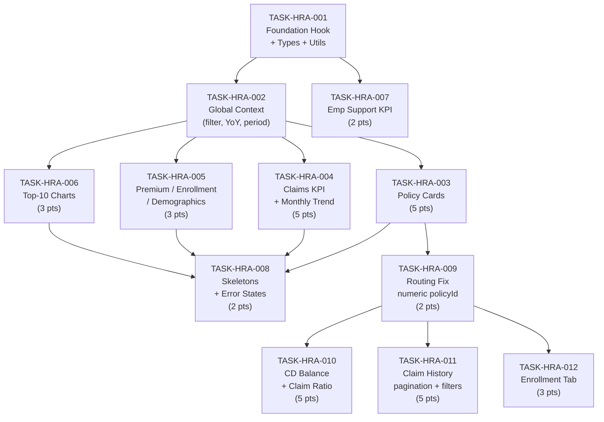

# HR Analytics — Dashboard API Integration Tasks

**Module:** HR Analytics — Feature Area 1 (HR Dashboard)
**TRD Reference:** [hr-analytics-trd.md](hr-analytics-trd.md) §5
**PRD Reference:** [hr-analytics-prd.md](hr-analytics-prd.md) §5
**Generated:** 2026-05-05
**Audience:** Frontend engineers integrating the 10 available report keys into `HRPortalDashboard/index.tsx`

> The HR Analytics UI is fully implemented with hardcoded static/scenario data.
> This task breakdown covers the complete API integration layer — replacing every hardcoded
> data object with live report API responses, establishing a reusable fetch framework,
> and wiring global context controls (policy filter, YoY toggle, period). The CD Management
> page (`HRPortalFinance`) serves as the proven integration reference pattern.

---

## Task Summary

The following table lists all 12 integration tasks in execution order. Tasks 001 and 002 are
foundation work that all other tasks depend on. Tasks 003–007 are independently executable
once the foundation is in place. Tasks 009–012 cover Policy Detail View integration
(`HRPortalPolicySummary`) and require TASK-HRA-003 to land first (policy list + routing).

| ID | Summary | Points | Assignee | Depends on |
|---|---|---|---|---|
| TASK-HRA-001 | Foundation: `useHRReport` hook, TypeScript types, data transformation utils | 3 | Senior | — |
| TASK-HRA-002 | Global context: policy filter, YoY toggle, period state | 3 | Senior | TASK-HRA-001 |
| TASK-HRA-003 | Policy Cards integration (`dashboard_policy_cards`) | 5 | Senior | TASK-HRA-001, TASK-HRA-002 |
| TASK-HRA-004 | Claims integration (`dashboard_claims_analysis_kpi` + `dashboard_claims_monthly_trend`) | 5 | Mid | TASK-HRA-001, TASK-HRA-002 |
| TASK-HRA-005 | Aggregate KPIs integration (`dashboard_premium_summary`, `dashboard_enrollment_status`, `dashboard_demographics`) | 3 | Mid | TASK-HRA-001, TASK-HRA-002 |
| TASK-HRA-006 | Top-10 charts integration (`dashboard_top10_employees`, `dashboard_top10_hospitals`, `dashboard_top10_diseases`) | 3 | Mid | TASK-HRA-001, TASK-HRA-002 |
| TASK-HRA-007 | Employee Support KPI integration (`emp_support_kpi_summary`) | 2 | Junior | TASK-HRA-001 |
| TASK-HRA-008 | Loading skeletons, error boundaries, empty states — all dashboard widgets | 2 | Junior | TASK-HRA-003, TASK-HRA-004, TASK-HRA-005, TASK-HRA-006 |
| TASK-HRA-009 | Routing fix: pass numeric `policyId` from dashboard to policy detail page | 2 | Mid | TASK-HRA-003 |
| TASK-HRA-010 | Policy Detail — CD Balance tab (`policy_cd_summary`) + Claim Ratio tab (router state) | 5 | Senior | TASK-HRA-009 |
| TASK-HRA-011 | Policy Detail — Claim History tab (`policy_claim_history`) with pagination, filters, export | 5 | Mid | TASK-HRA-009 |
| TASK-HRA-012 | Policy Detail — Enrollment tab (`policy_enrollment_summary`) | 3 | Mid | TASK-HRA-009 |

**Total: 41 story points across 12 tasks.**

---

## Dependency Graph

The diagram below shows the sequencing constraint. Foundation tasks (001, 002) must land first.
The five integration tasks (003–007) can then proceed in parallel across engineers.
Task 008 (polish) follows once each integration task is functionally complete.



---

## Detailed Task List

---

#### TASK-HRA-001: Foundation — `useHRReport` hook, TypeScript types, data transformation utilities

- **Type:** Task
- **Epic:** HR Analytics Integration
- **Sprint:** Sprint 1
- **Points:** 3
- **Assignee:** Senior
- **Traces to:** [PRD §4](hr-analytics-prd.md#4-global-context-controls), [TRD §1.2](hr-analytics-trd.md#12-framework-api-contracts-from-tech-spec-4)
- **Depends on:** none

- **Description:** Create the shared infrastructure that every dashboard integration task will use.
  This includes a `useHRReport<T>` hook, TypeScript response types for all 10 report keys,
  and data transformation utilities (currency, percentage, YoY suppression logic).
  The existing `HRPortalFinance/index.tsx` uses inline `useEffect` + `apiRequest` — extract
  and generalise that pattern into a reusable hook at `apps/ui/ibp/src/app/hooks/useHRReport.ts`.

- **Implementation details:**
  - Hook signature: `useHRReport<T>(reportKey: string, params: Record<string, unknown>, enabled?: boolean)`
  - Returns `{ data: T | null, isLoading: boolean, isError: boolean, refetch: () => void }`
  - Calls `apiRequest(endPoints.generateHRReports + reportKey, { method: "POST", data: params })`
    matching the established `HRPortalFinance` call pattern exactly
  - Response envelope shape: `{ statusCode: 201, data: { rows: T[], count: number } }`
  - For single-row reports (`data.rows[0]`), the hook returns `data.rows[0]` directly when the
    generic is typed as a single object
  - `enabled = false` defers the fetch (used for lazy/tab-click reports)
  - TypeScript interfaces to create in `apps/ui/ibp/src/app/pages/HRPortalDashboard/types.ts`:
    - `PolicyCardRow` — all fields from `dashboard_policy_cards` result mapping
    - `PremiumSummaryRow` — all fields from `dashboard_premium_summary`
    - `ClaimsKpiRow` — all fields from `dashboard_claims_analysis_kpi`
    - `ClaimsMonthRow` — all fields from `dashboard_claims_monthly_trend`
    - `EnrollmentStatusRow` — all fields from `dashboard_enrollment_status`
    - `DemographicsRow` — all fields from `dashboard_demographics`
    - `Top10Row` — shared shape for all three top-10 reports
    - `EmpSupportKpiRow` — fields from `emp_support_kpi_summary`
  - Transformation utilities in `apps/ui/ibp/src/app/utils/hrAnalytics.ts`:
    - `formatINR(value: number): string` — converts to ₹ + L/K abbreviation (reuse existing `fmt` from Finance page)
    - `formatPct(value: number | null, decimals = 1): string` — e.g. `"68.2%"`, `"—"` if null
    - `isYoYSuppressed(prevValue: number | null): boolean` — returns true if prior window had no records
    - `yoYBadgeColor(changePercent: number | null, decreaseIsGood = false): string` — handles direction-inverted metrics per [TRD §3A.8](hr-analytics-trd.md#3a8-frontend-contract)
    - `deriveSafeLimit(netPremium: number): number` — `netPremium × 0.05` (5% rule shown in CD bar tooltip)

- **Decision budget:**
  - Junior can decide: exact file name/location of types file, whether to use `useState` or `useReducer` internally
  - Escalate to TL/PTL: if `@tanstack/react-query` is preferred over manual `useEffect` (Finance page does not use it — keep consistent unless TL decides otherwise); any change to the `apiRequest` call signature

- **Acceptance criteria:**
  - [ ] `useHRReport("dashboard_policy_cards", { companyId: 1, policyType: "" })` returns `{ data, isLoading, isError, refetch }` with no TypeScript errors
  - [ ] All 10 report response type interfaces exist in `types.ts` with fields matching the result mappings in [hr-module-analytics-scripts.sql](../../../../apps/services/ibp-service/src/app/hr-module/hr-module-analytics-scripts.sql)
  - [ ] `formatINR(150000)` returns `"₹1.50L"`
  - [ ] `isYoYSuppressed(null)` returns `true`; `isYoYSuppressed(0)` returns `false`
  - [ ] `yoYBadgeColor(-4, true)` returns green color constant (decrease is good for ICR)
  - [ ] Unit tests for all 5 utility functions

- **Definition of Done:**
  - [ ] Jira ticket updated to Done
  - [ ] Tests passing
  - [ ] PR reviewed and merged to module branch
  - [ ] `types.ts` and `hrAnalytics.ts` documented with JSDoc for each export

---

#### TASK-HRA-002: Global context — policy type filter, YoY toggle, policy period state

- **Type:** Task
- **Epic:** HR Analytics Integration
- **Sprint:** Sprint 1
- **Points:** 3
- **Assignee:** Senior
- **Traces to:** [PRD §4](hr-analytics-prd.md#4-global-context-controls), [PRD §4A](hr-analytics-prd.md#4a-year-over-year-analytics), [TRD §4](hr-analytics-trd.md#4-global-context-controls)
- **Depends on:** TASK-HRA-001

- **Description:** Replace the existing scenario-switch state (`cdScenario`, `claimScenario`,
  `enrollmentScenario`) in `HRPortalDashboard/index.tsx` with real global context state that
  propagates to all report fetch calls. This task does not fetch any report data itself —
  it creates the shared state shape that tasks 003–006 consume.

- **Implementation details:**
  - Convert `policyFilter` state (already present: `"all" | "life" | "nonlife" | "inactive"`) into
    a `policyType` param: `"all" → ""`, `"life" → "LIFE"`, `"nonlife" → "NON_LIFE"`, `"inactive" → "INACTIVE"`
  - Add `showYoY: boolean` state (default `true`, per [PRD §4A.2](hr-analytics-prd.md#4a2-yoy-toggle-semantics))
    — **session-scoped only, do not persist to localStorage**; resets to `true` on page reload
  - Add `policyPeriodStart: string` and `policyPeriodEnd: string` state derived from the active
    policy context. Initial values: empty string `""` — the SQL handles empty as "no filter".
    When `dashboard_policy_cards` data loads, extract `policy_from` / `policy_to` from the first
    row and set these states so downstream reports use the active period
  - Lift `showYoY` and `policyType` into a local context object (or pass via props) so tasks 003–006
    can read them without prop drilling through 3+ JSX levels
  - When `policyFilter` chip is changed, call `refetch()` on all active `useHRReport` instances
    simultaneously — no sequential firing
  - Remove `cdScenario`, `claimScenario`, `enrollmentScenario` state variables and their derived
    `useMemo` objects (`cdCardData`, `claimCardData`, `enrollmentCardData`) after tasks 003–005 replace them
  - Keep the `simulatedAlert` trigger (`useEffect` that sets `cdScenario`) only until task 003 lands;
    remove it in that PR

- **Decision budget:**
  - Junior can decide: naming of the context shape object, exact mapping of filter chip values to `policyType` strings
  - Escalate to TL/PTL: if a React Context Provider is needed vs passing state down as props (decide based on component depth); whether to keep the `_setActivePolicyFilter` / `activePolicyFilter` as separate state or merge with `policyFilter`

- **Acceptance criteria:**
  - [ ] Changing the policy filter chip triggers a `policyType` param change (verifiable in Network tab)
  - [ ] `showYoY` defaults to `true` on page load and resets to `true` on hard refresh
  - [ ] `policyPeriodStart` / `policyPeriodEnd` are available to all report fetch hooks after `dashboard_policy_cards` responds
  - [ ] No TypeScript errors after removing hardcoded scenario states
  - [ ] All filter chip labels still render correctly (All / Life / Non-life / Inactive)

- **Definition of Done:**
  - [ ] Jira ticket updated to Done
  - [ ] No console errors or TypeScript compile errors
  - [ ] PR reviewed and merged

---

#### TASK-HRA-003: Policy Cards API integration (`dashboard_policy_cards`)

- **Type:** Story
- **Epic:** HR Analytics Integration
- **Sprint:** Sprint 1
- **Points:** 5
- **Assignee:** Senior
- **Traces to:** [PRD §5.3](hr-analytics-prd.md#53-widget--policies--sub-components), [TRD §5.2](hr-analytics-trd.md#52-screen-to-report-mapping)
- **Depends on:** TASK-HRA-001, TASK-HRA-002

- **Description:** Replace the 4 hardcoded policy objects in the `.map((policy) => ...)` block
  (line ~1291 in `HRPortalDashboard/index.tsx`) with live data from `dashboard_policy_cards`.
  This is the most complex integration task because each policy card renders three data-dense
  panels (CD Balance, Enrollment, Claim Ratio) and many display fields are derived, not returned
  directly by the API.

- **Field mapping strategy:**

  | UI field | API field | Derivation |
  |---|---|---|
  | `policy.name` | `policyName` | Direct |
  | `policy.policyNo` | `policyId` | Direct (use as display ID) |
  | `policy.insurer` | `insurer` | Direct |
  | `policy.policyPeriod` | `periodStart + " – " + periodEnd` | Concatenate |
  | `policy.annualPremium` | `netPremium` | `formatINR(netPremium)` |
  | `policy.available` | `cdBalance` | `formatINR(cdBalance)` |
  | `policy.safeLimit` | Derived | `formatINR(deriveSafeLimit(netPremium))` — 5% rule |
  | `policy.usedPct` | Derived | `100 − (cdBalance / netPremium × 100)` — approximate; cap at 100 |
  | `policy.safeMarkerPct` | Fixed | `50` (safe limit = 50% of totalAmount marker position) |
  | `policy.cdColor` | Derived | Red if `cdBalance < deriveSafeLimit(netPremium)`, else green |
  | `policy.enrolled` | `enrolledCount` | Direct |
  | `policy.inProgress` | `inProgressCount` | Direct |
  | `policy.notEnrolled` | `notEnrolledCount` | Direct |
  | `policy.total` | `employeeCount` | Direct (enrollment % based on employees) |
  | `policy.totalEmployees` | `employeeCount` | Direct |
  | `policy.totalDependents` | `dependentCount` | Direct |
  | `policy.lives` | `totalLives` | `totalLives.toLocaleString("en-IN")` |
  | `policy.claimValue` | `icrPercent` | Direct (number, not string) |
  | `policy.claimCount` | `icrClaimCount` | Direct |
  | `policy.claimDelta` | `icrYoYChangePercent` | `formatPct(icrYoYChangePercent)` with sign prefix |
  | `policy.claimDeltaGood` | `icrYoYChangePercent` | `icrYoYChangePercent <= 0` (decrease = good for ICR) |
  | `policy.claimLYNum` | `icrSamePeriodLYPercent` | Direct |
  | `policy.claimLYAvgNum` | `icrFullYearAvgLY` | Direct |
  | `policy.incurred` | `claimAmount` | `formatINR(claimAmount)` |
  | `policy.incurredNum` | `claimAmount / 100000` | For chart bar scaling |
  | `policy.memberAdditions` | `memberAdditions` | Direct |
  | `policy.memberDeletions` | `memberDeletions` | Direct |

  - Fields with no API equivalent (`tpaId`, `policyYear`, `icon`, `iconAccent`, `iconBg`):
    derive `icon`/`iconAccent`/`iconBg` from `policyTypeKey` using a local map constant;
    `tpaId` can be omitted or shown as `"—"` until a TPA join is available from backend.
  - The `lyClaimCount`, `lyIncurredNum`, `lyAvgClaimCount`, `lyAvgIncurredNum` fields used in the
    comparative chart columns: use `icrSamePeriodLYAmount` for `lyIncurredNum` and derive
    `lyClaimCount` from the count fields if available; mark as `0` with a code comment if not
    returned by the current report version — do not block the card render.

- **API call:**
  ```ts
  useHRReport<PolicyCardRow[]>("dashboard_policy_cards", {
    companyId,
    policyType,           // from global context — "" means all
    policyPeriodStart,    // derived from context after first load
    policyPeriodEnd,
  });
  // Reads: data.rows  (one row per policy)
  ```

- **Loading state:** Show 2 skeleton policy card placeholders (same height/structure as real cards,
  grey shimmer) while `isLoading === true`.

- **Empty state:** If `data.rows` is empty after load, show: "No active policies found for the
  selected filter." with a "Clear filter" action.

- **Decision budget:**
  - Junior can decide: exact shimmer animation style, icon-to-policyTypeKey mapping values
  - Escalate to TL/PTL: if `lyClaimCount` / `lyAvgClaimCount` are needed for the bar chart and are
    not in the current report — raise a change request to add fields rather than approximating; the
    `totalAmount` / `cdBalance` are used in the bar tooltip so accuracy matters

- **Acceptance criteria:**
  - [ ] Policy cards render with live API data — count matches active policies for the company
  - [ ] CD balance bar progress reflects `cdBalance` vs `netPremium × 0.05` safe limit accurately
  - [ ] ICR comparison card shows three periods: Full Year Avg LY / Same Period LY / Current
  - [ ] Enrollment tiles (Enrolled / In Progress / Not Enrolled) show API counts and derived percentages
  - [ ] Policy filter chips (All / Life / Non-life) trigger API refetch with correct `policyType` param
  - [ ] YoY delta badge is green for ICR decrease and red for ICR increase (direction-inverted metric)
  - [ ] Skeleton renders during loading; no flash of hardcoded data

- **Definition of Done:**
  - [ ] Jira ticket updated to Done
  - [ ] All hardcoded policy objects and scenario state removed from component
  - [ ] PR reviewed and merged

---

#### TASK-HRA-004: Claims analysis integration (`dashboard_claims_analysis_kpi` + `dashboard_claims_monthly_trend`)

- **Type:** Story
- **Epic:** HR Analytics Integration
- **Sprint:** Sprint 1–2
- **Points:** 5
- **Assignee:** Mid
- **Traces to:** [PRD §5.4](hr-analytics-prd.md#54-widget--claims-analysis), [TRD §5.2](hr-analytics-trd.md#52-screen-to-report-mapping)
- **Depends on:** TASK-HRA-001, TASK-HRA-002

- **Description:** Wire the two claims widgets on the dashboard: the 4-KPI card block and the
  monthly stacked bar chart. Both reports share the same filter parameters (`claimType`,
  `claimStatus`, `memberType`, `startDate`, `endDate`) and must re-fetch together when any
  filter changes. The current UI uses hardcoded `claimCardData` and `claimInsightsView` — replace
  these with live data.

- **KPI card mapping (`dashboard_claims_analysis_kpi`, reads `data.rows[0]`):**

  | UI element | API field |
  |---|---|
  | Total Claims count | `totalClaimsCount` |
  | Total Claims amount | `totalClaimsAmount` |
  | Paid Claims amount | `paidClaimsAmount` |
  | Pending Claims amount | `pendingClaimsAmount` |
  | Claim Ratio % | `claimRatioPercent` |
  | YoY badge — Claims amount | `totalClaimsAmountYoYChangePercent` |
  | YoY badge — Paid amount | `paidClaimsAmountYoYChangePercent` |
  | Prev year values (when `showYoY = true`) | `*PrevYear` fields |

- **Chart data mapping (`dashboard_claims_monthly_trend`, reads `data.rows`):**
  Each row becomes one data point:
  ```ts
  { month, cashlessAmount, reimbursementAmount, cashlessAmountPrevYear, reimbursementAmountPrevYear }
  ```
  Pass to the `<LineChart>` / `<BarChart>` Recharts component. When `showYoY = false`, exclude
  `*PrevYear` data series from the chart — do not re-fetch, just hide the series.

- **Local date filter:** The claims section has a local `startDate` / `endDate` filter independent
  of the global policy period. This filter already has UI controls — wire them to trigger re-fetch
  of both claims reports only (not global refetch). Default values: current policy `policy_from` /
  `policy_to` from global context.

- **Decision budget:**
  - Junior can decide: exact Recharts series color for prevYear series, label format for x-axis months
  - Escalate to TL/PTL: if `claimType` / `claimStatus` / `memberType` filter UI controls need to
    be added to the dashboard (they exist in the TRD params but may not have UI controls yet)

- **Acceptance criteria:**
  - [ ] 4 KPI cards show live `totalClaimsAmount`, `paidClaimsAmount`, `pendingClaimsAmount`, `claimRatioPercent`
  - [ ] YoY badges display when `showYoY = true` and are hidden when `showYoY = false`
  - [ ] Monthly trend chart renders `data.rows` with correct month labels
  - [ ] Prior-year series visible in chart when `showYoY = true`; hidden when `showYoY = false`
  - [ ] Local date filter change triggers re-fetch of both claims reports (and only those two)
  - [ ] Null `*YoYChangePercent` values render as no badge (not "0%" or "—"), per [PRD §4A.4](hr-analytics-prd.md#4a4-kpi-metric-yoy--math--suppression)

- **Definition of Done:**
  - [ ] Jira ticket updated to Done
  - [ ] Hardcoded `claimCardData` useMemo removed
  - [ ] PR reviewed and merged

---

#### TASK-HRA-005: Aggregate KPI integrations — Premium Summary, Enrollment Status, Demographics

- **Type:** Story
- **Epic:** HR Analytics Integration
- **Sprint:** Sprint 2
- **Points:** 3
- **Assignee:** Mid
- **Traces to:** [PRD §5.2](hr-analytics-prd.md#52-widget--premium-summary), [PRD §5.5](hr-analytics-prd.md#55-widget--enrollment-status), [PRD §5.6](hr-analytics-prd.md#56-widget--demographics-breakdown), [TRD §5.2](hr-analytics-trd.md#52-screen-to-report-mapping)
- **Depends on:** TASK-HRA-001, TASK-HRA-002

- **Description:** Three single-row aggregate reports that feed simple KPI card blocks. All three
  follow the same pattern: `POST` with `{ companyId, policyType, policyPeriodStart, policyPeriodEnd }`,
  read `data.rows[0]`, map fields directly to UI display values. Club these into one task because each
  mapping is straightforward and the integration structure is identical.

- **Report 1 — `dashboard_premium_summary` (reads `data.rows[0]`):**

  | UI KPI | API field |
  |---|---|
  | Inception Premium | `inceptionPremium` |
  | Addition Premium | `additionPremium` |
  | Deletion Premium | `deletionPremium` |
  | Top-Up Premium | `topUpPremium` |
  | Total Premium | `totalPremium` |
  | YoY badge per KPI | `inceptionPremiumPrevYear`, `additionPremiumPrevYear`, … `totalPremiumYoYChangePercent` |

- **Report 2 — `dashboard_enrollment_status` (reads `data.rows[0]`):**
  Map to the `enrollmentCardData` shape currently used by enrollment KPI cards.
  Replace the `enrollmentCardData` useMemo and `enrollmentScenario` state with API data.
  Fields include total enrolled, total pending, total employees, enrollment percentage,
  enrollment window deadline (if returned), and YoY fields.

- **Report 3 — `dashboard_demographics` (reads `data.rows[0]`):**
  Map to the demographics quadrant display (4 panels: Inception/Addition/Deletion/Total).
  Each panel shows total count, employee %, dependent %. Field names from `dashboard_demographics`
  result mappings in the analytics scripts file.

- **YoY suppression:** Apply `isYoYSuppressed()` utility from TASK-HRA-001 before rendering any
  badge. If suppressed, hide badge — do not show "0%" or a placeholder.

- **Decision budget:**
  - Junior can decide: loading skeleton shape per KPI (reuse shape from task 008), field order within each card
  - Escalate to TL/PTL: if the `enrollmentCardData.impact` string and `enrollmentCardData.policies` list
    (per-policy breakdown bars in the enrollment card) need separate API data — they are not in the
    `dashboard_enrollment_status` report; flag if those sections must remain hardcoded or a new report key is needed

- **Acceptance criteria:**
  - [ ] Premium summary shows 5 KPIs from live data; YoY badge shows for each when `showYoY = true`
  - [ ] Enrollment KPI cards show live enrolled/pending/total counts
  - [ ] Demographics quadrant renders 4 panels with live employee/dependent breakdown numbers
  - [ ] `enrollmentScenario` and `enrollmentCardData` useMemo removed from component

- **Definition of Done:**
  - [ ] Jira ticket updated to Done
  - [ ] All three reports wired and rendering
  - [ ] PR reviewed and merged

---

#### TASK-HRA-006: Top-10 charts integration (`dashboard_top10_employees`, `dashboard_top10_hospitals`, `dashboard_top10_diseases`)

- **Type:** Story
- **Epic:** HR Analytics Integration
- **Sprint:** Sprint 2
- **Points:** 3
- **Assignee:** Mid
- **Traces to:** [PRD §5.7](hr-analytics-prd.md#57-widget--top-10-claim-insights), [TRD §5.2](hr-analytics-trd.md#52-screen-to-report-mapping)
- **Depends on:** TASK-HRA-001, TASK-HRA-002

- **Description:** Wire the three Top-10 bar charts that are currently backed by hardcoded arrays
  (`_claimInsightsData` useMemo). Each chart fetches a different report key but shares the same
  rendering component. The active tab (`employees` / `hospitals` / `diseases`) determines which
  report to fetch; use `enabled: tabIsActive` in `useHRReport` to avoid fetching all three on page load.

- **API calls (one per tab, lazy):**
  ```ts
  // Only fetches when tab is active:
  useHRReport<Top10Row[]>("dashboard_top10_employees", params, claimInsightsView === "employees")
  useHRReport<Top10Row[]>("dashboard_top10_hospitals", params, claimInsightsView === "hospitals")
  useHRReport<Top10Row[]>("dashboard_top10_diseases",  params, claimInsightsView === "diseases")
  ```

- **Chart binding:** Each report returns `data.rows` where each row has a `name` / `displayName`
  field and `totalAmount`. Map to `{ name: string, value: number }` for the bar chart.
  Sort is already applied by the SQL (ORDER BY total_amount DESC).

- **YoY rank change badges (per [PRD §4A.6](hr-analytics-prd.md#4a6-ranked-lists--what-is-compared)):**
  Each row has `rankChange` (integer) and `rankPrevYear` (nullable integer).
  - `rankChange === null` → show "NEW" badge
  - `rankChange > 0` → show "↑{N}" in green
  - `rankChange < 0` → show "↓{N}" in red
  - `rankChange === 0` → show "—"
  These badges are shown only when `showYoY = true`.

- **Tab change behaviour:** When `claimInsightsView` changes, the new tab's report fetches if
  it hasn't been fetched yet in this session; cached data is reused if the tab was previously visited.
  No re-fetch on tab revisit unless global context (policyType, period) changed.

- **Decision budget:**
  - Junior can decide: badge size and color constants, whether to use Recharts `BarChart` or `HorizontalBar`
  - Escalate to TL/PTL: if `dashboard_top10_diseases` uses `clm_type` as the disease category
    (per the analytics scripts comment — not a true disease field) and the PM wants a different label

- **Acceptance criteria:**
  - [ ] "Employees" tab fetches `dashboard_top10_employees` on first click and shows top-10 bar chart
  - [ ] "Hospitals" tab fetches `dashboard_top10_hospitals` on first click
  - [ ] "Diseases" tab fetches `dashboard_top10_diseases` on first click
  - [ ] Rank change badges render correctly for NEW / improved / declined / unchanged entries
  - [ ] Rank badges hidden when `showYoY = false`
  - [ ] No duplicate API calls on tab revisit within the same session

- **Definition of Done:**
  - [ ] Jira ticket updated to Done
  - [ ] Hardcoded `_claimInsightsData` useMemo removed
  - [ ] PR reviewed and merged

---

#### TASK-HRA-007: Employee Support KPI summary integration (`emp_support_kpi_summary`)

- **Type:** Task
- **Epic:** HR Analytics Integration
- **Sprint:** Sprint 2
- **Points:** 2
- **Assignee:** Junior
- **Traces to:** Employee Support module spec (separate PRD — `emp_support_kpi_summary` is a cross-module report key available via the HR Report Framework)
- **Depends on:** TASK-HRA-001

- **Description:** `emp_support_kpi_summary` is not currently called in any page.
  Identify the correct page host (likely `HRPortalInsights` or the main `HRPortal` landing wrapper)
  by checking where "Support" or "Help Desk" KPIs are shown in the navigation. Wire the report to
  that page using the same `useHRReport` pattern established in TASK-HRA-001.
  Params: `{ companyId }` only (no policy-type or period scoping — this report aggregates
  across all policies).

- **Implementation steps:**
  1. Confirm the host page by checking `HRPortalInsights/index.tsx` and the HR portal router
  2. Call `useHRReport<EmpSupportKpiRow>("emp_support_kpi_summary", { companyId })` on mount
  3. Map `data.rows[0]` to the existing support KPI card placeholders
  4. Add loading skeleton and error state using the shared components from TASK-HRA-008

- **Decision budget:**
  - Junior can decide: exact KPI card layout if the current page has a placeholder; field label copy
  - Escalate to TL/PTL: if the host page is not yet implemented and a new page/section needs to be
    created — do not create new pages in this task; raise a separate task if needed

- **Acceptance criteria:**
  - [ ] `emp_support_kpi_summary` is called once on the correct host page mount
  - [ ] `data.rows[0]` fields render in the KPI card section
  - [ ] Loading and error states display correctly

- **Definition of Done:**
  - [ ] Jira ticket updated to Done
  - [ ] No TypeScript errors
  - [ ] PR reviewed and merged

---

#### TASK-HRA-008: Loading skeletons, error boundaries, and empty states — all dashboard widgets

- **Type:** Task
- **Epic:** HR Analytics Integration
- **Sprint:** Sprint 2
- **Points:** 2
- **Assignee:** Junior
- **Traces to:** [PRD §5](hr-analytics-prd.md#5-feature-area-1--hr-dashboard)
- **Depends on:** TASK-HRA-003, TASK-HRA-004, TASK-HRA-005, TASK-HRA-006

- **Description:** Once all integration tasks are functionally complete, this task standardises the
  visual states across the dashboard for loading, error, and empty conditions. Currently each
  task engineer adds their own skeleton — this task audits and normalises them into a consistent
  shared system.

- **Scope:**
  - **Loading skeleton:** Three skeleton variants to standardise:
    - `KPISkeleton` — for single-row aggregate reports (Premium Summary, Claims KPI, Enrollment, Demographics)
    - `PolicyCardSkeleton` — for policy card rows (CD balance bar + enrollment tiles + ICR section)
    - `ChartSkeleton` — for bar charts and line charts (grey placeholder box with shimmer)
  - **Error boundary:** Wrap each dashboard widget section in an independent error boundary so a
    single failing report API call does not crash the full page. On error, show:
    `"Unable to load [section name] data. [Retry]"` with a retry button that calls `refetch()`.
  - **Empty state:** If `data.rows` returns an empty array (not an error), show a section-level
    empty message: `"No data available for the selected period."` — no icon, no CTA beyond
    changing the filter.
  - **Global loading indicator:** When the policy type filter or period selector triggers a global
    refetch (from TASK-HRA-002), show a thin top-of-page loading bar (similar to NProgress) to
    indicate coordinated in-flight requests. Clear it when all active requests settle.

- **Decision budget:**
  - Junior can decide: shimmer animation duration, exact copy for error/empty messages
  - Escalate to TL/PTL: if a shared `WidgetShell` wrapper component is warranted (title + loading
    + error + children) — assess after seeing the integration task PRs; do not pre-build abstractions

- **Acceptance criteria:**
  - [ ] Every widget section has a visible loading state while its report is in-flight
  - [ ] A failing report API call shows an inline error message with retry — does not crash the page
  - [ ] Empty `data.rows` shows a section-level empty message
  - [ ] Global refetch (filter change) triggers top-of-page loading indicator
  - [ ] All three skeleton variants are visually consistent (same shimmer style, same border-radius)

- **Definition of Done:**
  - [ ] Jira ticket updated to Done
  - [ ] No regression in existing working integrations (TASK-HRA-003 through 006)
  - [ ] PR reviewed and merged

---

---

#### TASK-HRA-009: Routing fix — pass numeric `policyId` from dashboard to policy detail page

- **Type:** Task
- **Epic:** HR Analytics Integration — Policy Detail View
- **Sprint:** Sprint 2
- **Points:** 2
- **Assignee:** Mid
- **Traces to:** [TRD §6](hr-analytics-trd.md#6-policy-drilldown-page)
- **Depends on:** TASK-HRA-003

- **Description:** `HRPortalPolicySummary` currently reads a string shortcode (`gmc`, `gtl`) from
  the URL param and looks it up in a hardcoded `POLICY_DATA` map. The DB uses numeric policy IDs.
  This task fixes the routing layer so the detail page receives a real `policyId` number, enabling
  TASK-HRA-010/011/012 to call policy-scoped APIs.

- **Implementation details:**
  - In `HRPortalDashboard/index.tsx`, update the "View Details →" navigation from each policy card
    to pass the numeric `policyId` and the full `PolicyCardRow` via `useNavigate` state:
    ```ts
    navigate(`/hr-portal/policy-summary/${policy.policyId}`, {
      state: { policyRow: policy, policyList: data },
    });
    ```
    (`policy.policyId` is the numeric DB id returned by `dashboard_policy_cards`.)
  - In `HRPortalPolicySummary/index.tsx`:
    - Change `const { policyId } = useParams()` — the URL param is now a numeric string; parse with
      `const numericPolicyId = Number(useParams().policyId)`.
    - Read the passed data: `const { policyRow, policyList } = useLocation().state ?? {}`.
      Guard against direct URL navigation — redirect to `/hr-portal` if `numericPolicyId` is NaN
      or `policyRow` is undefined.
    - Remove the `POLICY_DATA` lookup line; replace with `policyRow` from router state.
  - Update the policy switcher dropdown to iterate `policyList` (full list from router state) instead
    of `Object.values(POLICY_DATA)`, navigating to `/hr-portal/policy-summary/{id}` for each entry.
  - Update the route definition if the param name changes (`:policyShortcode` → `:policyId`).

- **Decision budget:**
  - Junior can decide: exact router state shape (field names)
  - Escalate to TL/PTL: if the policy detail page must support direct URL access without dashboard
    context (would require a dedicated header-fetch API call instead of relying on router state)

- **Acceptance criteria:**
  - [ ] Clicking "View Details →" on any policy card navigates to `/hr-portal/policy-summary/{numericId}` with `policyRow` in router state
  - [ ] `HRPortalPolicySummary` renders policy name from `policyRow.policyName` (not hardcoded)
  - [ ] Policy switcher dropdown lists all policies from `policyList` and navigates between them
  - [ ] Direct URL navigation (no router state) redirects gracefully to the dashboard
  - [ ] No TypeScript errors after removing the `POLICY_DATA` map

- **Definition of Done:**
  - [ ] Jira ticket updated to Done
  - [ ] `POLICY_DATA` constant removed
  - [ ] PR reviewed and merged

---

#### TASK-HRA-010: Policy Detail — CD Balance tab (`policy_cd_summary`) + Claim Ratio tab (router state)

- **Type:** Story
- **Epic:** HR Analytics Integration — Policy Detail View
- **Sprint:** Sprint 2
- **Points:** 5
- **Assignee:** Senior
- **Traces to:** [TRD §6.1](hr-analytics-trd.md#61-cd-balance-tab), [TRD §6.2](hr-analytics-trd.md#62-claim-ratio-tab)
- **Depends on:** TASK-HRA-009

- **Description:** Wire two of the four tabs in `HRPortalPolicySummary`. The CD Balance tab calls
  `policy_cd_summary` for a single-row KPI response. The Claim Ratio tab does **not** require a
  new API call — the per-policy ICR comparison data is already in `policyRow` from router state,
  since `dashboard_policy_cards` returns all ICR fields per policy.

- **CD Balance tab — API call:**
  ```ts
  useHRReport<PolicyCdSummaryRow>("policy_cd_summary", {
    companyId,
    policyId: numericPolicyId,
  });
  // reads: data[0]
  ```

- **CD Balance field mapping:**

  | UI element | API field | Notes |
  |---|---|---|
  | CD Balance | `cdBalance` | `formatINR(cdBalance)` |
  | Net Premium | `netPremium` | `formatINR(netPremium)` |
  | Safe Limit | `safeLimit` | `formatINR(safeLimit)` — pre-computed in SQL (netPremium × 0.05) |
  | CD bar fill % | `usedPercent` | Direct — capped 0–100 by SQL |
  | Used Amount | `usedAmount` | `formatINR(usedAmount)` |
  | Insurer | `insurer` | Direct |
  | Period | `periodStart + " – " + periodEnd` | Concatenate (already `TO_CHAR` formatted) |

  - **CD Transactions section:** `caution_deposit` tracks current balance only — there is no DB table
    for a deposit/deduction ledger. Remove the hardcoded `CD_TRANSACTIONS` rows and render a
    `"Transaction history coming soon"` placeholder pending resolution of Open Question #6.

- **Claim Ratio tab — no new API call:**

  | UI element | `policyRow` field |
  |---|---|
  | Current period ICR | `icrPercent` |
  | Same-period LY ICR | `icrSamePeriodLYPercent` |
  | Full-year LY avg | `icrFullYearAvgLY` |
  | Forecast ICR | `icrForecastPercent` |
  | YoY delta badge | `icrYoYChangePercent` |
  | Claim count (current) | `icrClaimCount` |

  Apply `isYoYSuppressed()` before rendering the YoY badge.
  Direction-inverted: `yoYBadgeColor(icrYoYChangePercent, true)` — ICR decrease is green.

- **Decision budget:**
  - Junior can decide: CD bar color thresholds (reuse same logic as `cdColor` from TASK-HRA-003)
  - Escalate to TL/PTL: whether CD Transactions placeholder section should be hidden entirely or shown with a "coming soon" notice

- **Acceptance criteria:**
  - [ ] CD Balance tab renders `cdBalance`, `netPremium`, `safeLimit`, `usedPercent`, `insurer`, `periodStart/End` from live API
  - [ ] CD bar fill reflects `usedPercent` correctly (capped at 100)
  - [ ] CD Transactions section shows placeholder (no hardcoded rows)
  - [ ] Claim Ratio tab renders 3-column ICR comparison from `policyRow` router state
  - [ ] YoY badge green for ICR decrease, red for increase; hidden if `icrYoYChangePercent === null`
  - [ ] Loading and error states present on CD Balance tab

- **Definition of Done:**
  - [ ] Jira ticket updated to Done
  - [ ] `CD_TRANSACTIONS` hardcoded array removed
  - [ ] PR reviewed and merged

---

#### TASK-HRA-011: Policy Detail — Claim History tab (`policy_claim_history`) with pagination, filters, and export

- **Type:** Story
- **Epic:** HR Analytics Integration — Policy Detail View
- **Sprint:** Sprint 3
- **Points:** 5
- **Assignee:** Mid
- **Traces to:** [TRD §6.3](hr-analytics-trd.md#63-claim-history-tab)
- **Depends on:** TASK-HRA-009

- **Description:** Wire the Claim History tab in `HRPortalPolicySummary`. Replaces the 8-row
  hardcoded `CLAIM_HISTORY_ROWS` array with a live paginated, searchable, filterable claims list
  scoped to the active `policyId`.

- **API call:**
  ```ts
  useHRReport<ClaimHistoryRow[]>("policy_claim_history", {
    policyId: numericPolicyId,
    companyId,
    claimStatus,          // "" = all
    claimType,            // "" = all
    startYear,            // "" = no lower bound
    endYear,              // "" = no upper bound
    search,               // "" = no text filter
    limit: "50",
    offset: String(page * 50),
  }, claimHistoryTabActive);
  ```
  Lazy fetch — only triggers when the tab is active.

- **Filter state (local to the tab):**
  - `claimStatus`: dropdown — All / Pending / Approved / Rejected / Settled
  - `claimType`: dropdown — All / Cashless / Reimbursement
  - `startYear` / `endYear`: year inputs (default: `policy_from` / `policy_to` year from `policyRow`)
  - `search`: debounced text input (300 ms) — matches `patientName`, `claimNumber`, `hospital`
  - All filter changes reset `page` to 0 and trigger re-fetch.

- **Pagination:** `page` state (integer, 0-indexed). Previous / Next buttons update `offset`.
  `data.length < 50` signals the last page (disable Next). No caching — each page navigation re-fetches.

- **Table column mapping:**

  | Column | Field | Format |
  |---|---|---|
  | Claim No. | `claimNumber` | Direct |
  | Patient | `patientName` | Direct |
  | Relation | `relation` | Direct |
  | Hospital | `hospital` | Direct |
  | Date | `claimDate` | `DD MMM YYYY` |
  | Type | `claimType` | Direct |
  | Claimed | `claimedAmount` | `formatINR(claimedAmount)` |
  | Approved | `approvedAmount` | `formatINR(approvedAmount)` |
  | Settlement Date | `settlementDate` | `DD MMM YYYY` or `—` if null |
  | Status | `status` | Status chip: Pending=amber / Approved=green / Rejected=red / Settled=blue |

- **Export:** Replace hardcoded CSV generation with client-side CSV export of the current loaded
  `data` rows using the column mapping above. File name: `claim-history-{policyId}-{today}.csv`.
  No server-side export endpoint required in this task.

- **Empty state:** "No claims found for the selected filters." with a "Clear filters" action.

- **Decision budget:**
  - Junior can decide: status chip color constants, CSV delimiter
  - Escalate to TL/PTL: if full page count (not just `length < 50` heuristic) is needed — requires a separate count query; do not add it without explicit PM sign-off

- **Acceptance criteria:**
  - [ ] Claim History tab fetches `policy_claim_history` on first activation (lazy)
  - [ ] 50 rows per page; Next/Previous pagination works; Next disabled on last page
  - [ ] Claim Status and Claim Type dropdowns trigger re-fetch with correct params
  - [ ] Year range filter triggers re-fetch; defaults to policy period year from `policyRow`
  - [ ] Search input (300 ms debounce) triggers re-fetch
  - [ ] Export button downloads a CSV of the current loaded page
  - [ ] Empty state displays when `data.length === 0` after a successful fetch

- **Definition of Done:**
  - [ ] Jira ticket updated to Done
  - [ ] `CLAIM_HISTORY_ROWS` hardcoded array removed
  - [ ] PR reviewed and merged

---

#### TASK-HRA-012: Policy Detail — Enrollment tab (`policy_enrollment_summary`)

- **Type:** Story
- **Epic:** HR Analytics Integration — Policy Detail View
- **Sprint:** Sprint 3
- **Points:** 3
- **Assignee:** Mid
- **Traces to:** [TRD §6.4](hr-analytics-trd.md#64-enrollment-tab)
- **Depends on:** TASK-HRA-009

- **Description:** Wire the Enrollment tab in `HRPortalPolicySummary`. Replaces the hardcoded
  enrollment counts and percentages (sourced from `POLICY_DATA[policyId].enrolledCount` etc.) with
  live data from `policy_enrollment_summary`.

- **API call:**
  ```ts
  useHRReport<PolicyEnrollmentSummaryRow>("policy_enrollment_summary", {
    policyId: numericPolicyId,
    companyId,
  }, enrollmentTabActive);
  ```
  Lazy fetch — only triggers when the Enrollment tab is active.

- **Field mapping:**

  | UI element | Field |
  |---|---|
  | Total Employees | `totalEmployees` |
  | Total Dependents | `totalDependents` |
  | Enrolled count + % | `enrolledCount`, `enrolledPercent` |
  | In Progress count + % | `inProgressCount`, `inProgressPercent` |
  | Not Started count + % | `notStartedCount`, `notStartedPercent` |
  | Not Enrolled count | `notEnrolledCount` |

- **Bar chart dynamic axis:** Replace the hardcoded Y-axis domain `[0, 700]` and hardcoded tick
  values with a dynamic domain: `[0, Math.ceil(totalEmployees / 100) * 100]`. Map `<Bar>` data
  values to `enrolledCount`, `inProgressCount`, `notStartedCount` directly.

- **Loading + empty states:** Show `KPISkeleton` while in-flight.
  Empty state: "No enrollment data found for this policy."

- **Decision budget:**
  - Junior can decide: progress bar / bar chart color mapping (Enrolled=green, In Progress=amber, Not Started=grey)
  - Escalate to TL/PTL: if per-dependent breakdown by member type (spouse / child / parent) is required — not in this report; would need a new report key

- **Acceptance criteria:**
  - [ ] Enrollment tab fetches `policy_enrollment_summary` on first activation (lazy)
  - [ ] KPI tiles show live counts and percentages for all enrollment statuses
  - [ ] Bar chart Y-axis domain scales dynamically to `totalEmployees`
  - [ ] Loading skeleton displays while in-flight; no flash of hardcoded data
  - [ ] Empty state displays when `totalEmployees === 0`

- **Definition of Done:**
  - [ ] Jira ticket updated to Done
  - [ ] Hardcoded enrollment values from `POLICY_DATA` removed
  - [ ] Hardcoded Y-axis domain `[0, 700]` replaced with dynamic value
  - [ ] PR reviewed and merged

---

## Parallel Work Plan

After TASK-HRA-001 and TASK-HRA-002 land (both Sprint 1), the following tasks can proceed in parallel
across two or three engineers without blocking each other:

| Engineer A | Engineer B | Engineer C (if available) |
|---|---|---|
| TASK-HRA-003 (Policy Cards, 5pts) | TASK-HRA-004 (Claims, 5pts) | TASK-HRA-005 (KPI Aggregates, 3pts) + TASK-HRA-006 (Top-10, 3pts) |

TASK-HRA-007 (Support KPI, 2pts) is independent — can be picked up by any engineer with capacity
after 001 is merged.

TASK-HRA-008 (Polish, 2pts) is the dashboard integration gate — begin only after 003–006 are
functionally complete and merged.

**Policy Detail View (Sprint 2–3):** Once TASK-HRA-003 is merged, TASK-HRA-009 (routing fix, 2pts)
unblocks the three policy detail integration tasks. These can proceed in parallel:

| Engineer A | Engineer B |
|---|---|
| TASK-HRA-010 (CD Balance + Claim Ratio, 5pts) | TASK-HRA-011 (Claim History, 5pts) + TASK-HRA-012 (Enrollment, 3pts) |

---

## Open Questions

The following must be resolved before or during Sprint 1 to avoid mid-sprint blockers:

1. **`policyPeriodStart` / `policyPeriodEnd` source for dashboard reports:** The `dashboard_policy_cards`
   report does not filter by period (its SQL has no date WHERE clause). The downstream reports
   (`dashboard_premium_summary`, claims reports) DO use period params. Confirm: should period come
   from the first active policy's `policy_from`/`policy_to`, or from the policy period selector control
   described in [TRD §4](hr-analytics-trd.md#4-global-context-controls)?

2. **`tpaId` on policy cards:** There is no TPA join in the `dashboard_policy_cards` SQL. The UI
   shows a TPA ID field in the policy card header. Either accept `"—"` as the display value or
   add a TPA lookup field to the report. Confirm with PM whether this field is required on the card.

3. **Per-policy enrollment breakdown (policy filter bars in enrollment card):** The current UI shows
   per-policy enrollment percentages (e.g. "Group Mediclaim 91%, Group Term Life 85%…") as small
   progress bars inside the enrollment section. `dashboard_enrollment_status` is a company-level
   aggregate. A per-policy breakdown is available from `dashboard_policy_cards` `enrolledPercent`
   per row. Confirm whether the enrollment section should be replaced entirely by per-policy data
   from `dashboard_policy_cards`, or if a separate report is needed.

4. **`lyClaimCount` / `lyAvgClaimCount` for the ICR comparison bar chart:** The comparative ICR
   chart columns show claim counts for Full Year Avg LY and Same Period LY. The current
   `dashboard_policy_cards` script returns `icrSamePeriodLYAmount` (amount) but not the
   corresponding claim count. If the count is needed for the bar chart, a script update is
   required before TASK-HRA-003 can complete the comparative columns.

5. **`emp_support_kpi_summary` host page:** The report key exists in the script but no page
   currently calls it. Confirm the intended host page before TASK-HRA-007 begins.

6. **CD transaction ledger schema (TASK-HRA-010 blocker):** The UI's CD Transactions section shows
   a deposit/deduction ledger with banking mode (NEFT/RTGS) and reference numbers. The `caution_deposit`
   table only stores the current balance — it has no transaction log. The `policy_cd_transactions`
   report key cannot be implemented until the correct source table is identified. Until resolved,
   TASK-HRA-010 will render a "Transaction history coming soon" placeholder in that section.

---

## Approval

```
Approved by:
Role:
Date:

Approved by:
Role:
Date:
```
