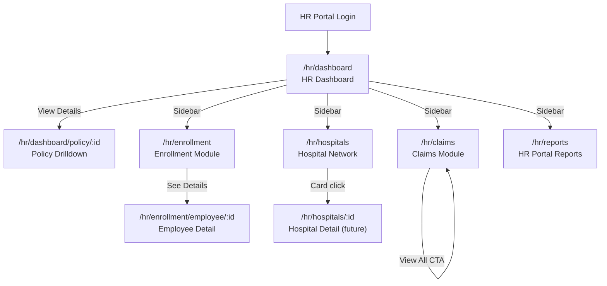

# IBP HR Portal — HR Analytics Module TRD

**Document Version:** 1.1
**Date:** 2026-04-30
**Author:** IIRM Engineering Team
**Jira Reference:** IIRM-9479
**PRD Reference:** `docs/implementation/ibp-service/hr-analytics/hr-analytics-prd.md`
**Framework Reference:** `docs/implementation/ibp-service/hr-module-report-framework-tech-spec.md`

> **Dependency Note (Framework Spec §9):** This TRD follows the mandatory module-level format defined in `hr-module-report-framework-tech-spec.md §9`. Any update to the framework spec must be reflected here immediately. Sections affected by framework changes are called out explicitly in Section 16.

> **Scope Note:** This TRD is the single source of truth for all 62 reports across all 5 HR Analytics feature areas. All SQL seed scripts, placeholder summaries, result mappings, and FE-BE call sequences are inline in this document. The individual module TRDs (Policy Drilldown, Enrollment, Claims, Hospital Network) are superseded by this document and may be archived. Do not add report definitions to those files.

---

## 1. Architecture Overview

HR Analytics is built entirely on the HR Report Framework. Every data-driven widget on every page, across all 5 feature areas, maps to a named report fetched via the same three framework endpoints. No custom controller methods, no hardcoded SQL in the service, no per-screen business logic.

```
POST /hr/report/generate/:report      — data display
POST /hr/report/download/:report      — file export
GET  /hr/report/reports_list          — discovery
```

All data is scoped to the authenticated user's `companyId` (from JWT). Feature-area-specific scoping (by `policyId`, `employeeId`, period) is handled via `###placeholder###` parameters per report.

### 1.1 Module Routes

| Feature Area | Route | Entry |
|---|---|---|
| HR Dashboard | `/hr/dashboard` | Default landing page after login |
| Policy Drilldown | `/hr/dashboard/policy/:policyId` | "View Details →" on policy card |
| Enrollment Module | `/hr/enrollment` | Left sidebar → Enrolment |
| Employee Detail | `/hr/enrollment/employee/:employeeId` | "See Details" in enrollment table |
| Claims Module | `/hr/claims` | Left sidebar → Claims |
| Hospital Network | `/hr/hospitals` | Left sidebar → Hospitals |
| HR Portal Reports | `/hr/reports` | Left sidebar → Reports |

### 1.2 Framework API Contracts (from tech spec §4)

| Operation | Method | Path | Success |
|---|---|---|---|
| Generate / fetch report | POST | `/hr/report/generate/:report` | 201 |
| Export report as file | POST | `/hr/report/download/:report?format=excel\|csv\|pdf` | 200 file |
| List available reports | GET | `/hr/report/reports_list` | 200 |

**Generate — success response (201):**
```json
{
  "statusCode": 201,
  "message": "Report generated successfully.",
  "data": {
    "rows": [ /* array of row objects */ ],
    "count": 240
  }
}
```

> **Frontend binding rule (Framework §4.1):** Read `data.rows` for lists/tables. Read `data.rows[0]` for single-row aggregates (KPI cards, financial summaries). Read `data.count` for pagination totals. Never assume `data` is a bare array.

**Generate — error (400):** `{ "statusCode": 400, "message": "Failed to generate report.", "error": "..." }`

**Export — success (200):** Binary file with `Content-Disposition: attachment; filename="<report>-<timestamp>.<ext>"`. No pagination on download path — full result set.

**Export — error (400):** Same JSON envelope as generate error.

**Unknown report key:** Returns 400 — fails at SQL metadata lookup, not 404.

---

## 2. Unified Report Registry

All reports across all 5 feature areas, one row each. `data.rows[0]` = single-row aggregate; `data.rows` = list.

### 2.1 HR Dashboard (9 reports — this TRD)

| Report Key | Widget | Reads |
|---|---|---|
| `dashboard_premium_summary` | Premium KPI cards (5) | `data.rows[0]` |
| `dashboard_policy_cards` | Policy cards grid | `data.rows` |
| `dashboard_claims_analysis_kpi` | Claims KPI cards (4) | `data.rows[0]` |
| `dashboard_claims_monthly_trend` | Claims stacked bar chart | `data.rows` |
| `dashboard_enrollment_status` | Enrollment KPI cards (3) | `data.rows[0]` |
| `dashboard_demographics` | Demographics quadrant cards (4) | `data.rows[0]` |
| `dashboard_top10_employees` | Top 10 employees bar chart | `data.rows` |
| `dashboard_top10_hospitals` | Top 10 hospitals bar chart | `data.rows` |
| `dashboard_top10_diseases` | Top 10 diseases bar chart | `data.rows` |

### 2.2 Policy Drilldown (21 reports — Section 6)

| Report Key | Tab | Widget |
|---|---|---|
| `policy_header_kpi` | Always | Policy KPI bar (9 cards, blocking) |
| `policy_sub_components` | Overview | Sub-components table |
| `policy_enrollment_progress` | Overview | Enrollment progress block |
| `policy_claim_utilisation` | Overview | Claim utilisation donut |
| `policy_monthly_claim_trend` | Overview | Dual-line chart |
| `policy_top_hospitals` | Overview | Top 5 hospitals ranked list |
| `policy_disease_category_breakdown` | Overview | Disease horizontal bars |
| `policy_claims_insights_stacked` | Claims Analytics | Stacked bar |
| `policy_claims_by_month` | Claims Analytics | Line chart |
| `policy_cashless_vs_reimbursement` | Claims Analytics | Donut |
| `policy_claims_by_hospital_type` | Claims Analytics | Grouped bar (top 10 hospitals) |
| `policy_claims_by_employee` | Claims Analytics | Searchable claims table (paginated) |
| `policy_members_by_age_group` | Member Analytics | Grouped bar chart |
| `policy_gender_distribution` | Member Analytics | Donut |
| `policy_employees_vs_dependents` | Member Analytics | Donut |
| `policy_department_wise_enrollment` | Member Analytics | Progress bar list |
| `policy_member_table` | Member Analytics | Searchable member table (paginated) |
| `policy_financial_kpi` | Financial Insights | Financial KPI cards (4) |
| `policy_premium_vs_claim_trend` | Financial Insights | Dual-line chart |
| `policy_utilisation` | Financial Insights | Policy utilisation progress bar |
| `policy_financial_summary` | Financial Insights | Financial summary table (6 rows) |

### 2.3 Enrollment Module (15 reports — Section 7)

| Report Key | Screen | Widget |
|---|---|---|
| `ibp_hr_enrollment_summary_cards` | Enrollment tab | KPI cards (5) |
| `ibp_hr_enrollment_employee_list` | Enrollment tab | Employee list table (paginated) |
| `ibp_hr_employee_profile_summary` | Employee detail | Profile header + policy summary |
| `ibp_hr_employee_dependents` | Employee detail | Dependents list |
| `ibp_hr_employee_claims_history` | Employee detail | Claims history table |
| `ibp_hr_employee_activity_log` | Employee detail | Activity timeline |
| `ibp_hr_employee_ecard` | Employee detail | E-card modal payload |
| `ibp_hr_endorsement_overview` | Endorsement tab | Overview KPI cards |
| `ibp_hr_endorsement_individual_list` | Endorsement tab | Endorsement accordion rows |
| `ibp_hr_claims_by_tenure` | Analytics tab — sub-tab 1 | Bar chart |
| `ibp_hr_claims_by_relation` | Analytics tab — sub-tab 2 | Donut chart |
| `ibp_hr_claims_by_age_band` | Analytics tab — sub-tab 3 | Bar chart |
| `ibp_hr_high_claim_employees` | Analytics tab — sub-tab 4 | Ranked table |
| `ibp_hr_resigned_employees` | Analytics tab — sub-tab 5 | Table |
| `ibp_hr_frequent_claimers` | Analytics tab — sub-tab 6 | Table |

### 2.4 Claims Module (10 reports — Section 8)

| Report Key | Tab | Widget |
|---|---|---|
| `ibp_hr_claims_summary_cards` | All Claims | KPI cards (6) |
| `ibp_hr_claims_list` | All Claims | Claims table (paginated) |
| `ibp_hr_process_claims_summary` | Process Claim | KPI cards (5) |
| `ibp_hr_process_claims_list` | Process Claim | Pipeline table (paginated) |
| `ibp_hr_claims_insights_kpi` | Insights | KPI cards (4) |
| `ibp_hr_claims_trend` | Insights | Trend line chart |
| `ibp_hr_claims_by_hospital` | Insights | Horizontal bar chart |
| `ibp_hr_claims_by_city` | Insights | Vertical bar chart |
| `ibp_hr_claims_by_amount_band` | Insights | Bar chart |
| `ibp_hr_claims_by_department` | Insights | Donut chart |

### 2.5 Hospital Network (7 reports — Section 9)

| Report Key | Tab | Widget |
|---|---|---|
| `hospital_network_kpi` | Network Hospitals | KPI cards (4) |
| `hospital_network_directory` | Network Hospitals | Hospital directory (paginated) |
| `hospital_claims_top6` | Claims by Hospital | Top 6 hospital cards |
| `hospital_performance_kpi` | Performance | KPI cards (4) |
| `hospital_performance_overview` | Performance | Performance overview table |
| `hospital_agreements_kpi` | Agreements | KPI cards (4) |
| `hospital_agreements_registry` | Agreements | Agreement registry table |

**Total: 64 reports across 6 feature areas.**

### 2.6 HR Portal Reports (4 live reports)

| Report Key | Screen | Widget |
|---|---|---|
| `policy_claim_history` | Reports page — Claims History card | Paginated claim transaction table |
| `endorsement_list` | Reports page — Endorsement Report card | Paginated endorsement table |
| `ibp_hr_employee_listing` | Reports page — Enrollment Report card | Employee enrollment listing |
| `company_policy_details_summary` | Reports page — Premium Report card | Policy premium breakdown table |

**Parameter contracts:**

`policy_claim_history` — required: `policyId` (string). Optional: `claimStatus`, `claimType`, `startYear`, `endYear`, `search`. Returns: `claimNumber`, `patientName`, `relation`, `hospital`, `claimDate`, `claimType`, `claimedAmount`, `approvedAmount`, `status`.

`endorsement_list` — required: `companyId`. Optional: `policyId` (empty string = all policies). Returns: `endorsementId`, `policyNumber`, `endorsementType`, `enrollmentStartDate`, `enrollmentEndDate`, `endorsementStatus`, `uploadCount`, `totalSuccessCount`. Date fields are pre-formatted as `DD/MM/YYYY` by the SQL layer (`TO_CHAR`) — no client-side date parsing required.

`ibp_hr_employee_listing` — required: `companyId`, `search` (`""`), `gender` (`""`), `enrollStatus` (`""` = all, or `EMPLOYEE_ENROLLMENT_STATUS_ENROLLED` / `EMPLOYEE_ENROLLMENT_STATUS_NOT_STARTED` / `EMPLOYEE_ENROLLMENT_STATUS_IN_PROGRESS`), `limit` (`""`), `offset` (`""`). All six params must be present; empty string = no filter. Returns: `companyEmployeeId`, `employeeName`, `gender`, `email`, `enrollStatus`, `sumInsured`, `dependentsCount`, `lastLoginAt`.

`company_policy_details_summary` — required: `companyId`. Returns: `policyName`, `policyType`, `policyFrom`, `policyTo`, `inceptionPremium`, `additionPremium`, `deletionPremium`, `totalPremium`, `totalLives`.

**Note on total count:** The header line above ("64 reports across 6 feature areas") remains correct — the 4 HR Portal Reports keys are already counted in that total.

### 2.7 YoY Enhancement Registry

Of the 62 reports, 40 are enhanced with Year-over-Year output columns. The remaining 22 are excluded — either live operational data (Process Claims pipeline), row-level transactional tables (employee list, claims list), or static content. The YoY SQL pattern is defined once in §3A and referenced here.

| Report Key | Feature Area | YoY Type | New Output Fields |
|---|---|---|---|
| `dashboard_premium_summary` | Dashboard | Aggregate | `inceptionPremiumPrevYear`, `additionPremiumPrevYear`, `deletionPremiumPrevYear`, `topUpPremiumPrevYear`, `totalPremiumPrevYear`, `totalPremiumYoYChangePercent` |
| `dashboard_policy_cards` | Dashboard | Aggregate per policy | `totalClaimsPrevYear`, `icrPercentPrevYear`, `icrFullYearAvgLY`, `icrSamePeriodLYPercent`, `icrSamePeriodLYAmount`, `memberAdditionsPrevYear`, `memberDeletionsPrevYear`, `totalLivesPrevYear`, `enrolledCountPrevYear`, `enrolledPercentPrevYear`, `inProgressCountPrevYear`, `notEnrolledCountPrevYear`, `netPremiumPrevYear` |
| `dashboard_claims_analysis_kpi` | Dashboard | Aggregate | `totalClaimsCountPrevYear`, `totalClaimsAmountPrevYear`, `paidClaimsAmountPrevYear`, `pendingClaimsAmountPrevYear`, `claimRatioPercentPrevYear`, `totalClaimsAmountYoYChangePercent`, `paidClaimsAmountYoYChangePercent` |
| `dashboard_claims_monthly_trend` | Dashboard | Monthly trend | `cashlessAmountPrevYear`, `reimbursementAmountPrevYear`, `cashlessCountPrevYear`, `reimbursementCountPrevYear` |
| `dashboard_enrollment_status` | Dashboard | Aggregate | `loggedInPrevYear`, `notLoggedInPrevYear`, `enrollmentConfirmedPrevYear`, `loggedInPercentPrevYear`, `enrollmentConfirmedPercentPrevYear` |
| `dashboard_demographics` | Dashboard | Aggregate | `newAdditionsTotalPrevYear`, `deletionsTotalPrevYear`, `totalActiveMembersPrevYear`, `newAdditionsYoYChangePercent`, `deletionsYoYChangePercent` |
| `dashboard_top10_employees` | Dashboard | Ranked list | `totalAmountPrevYear`, `rankPrevYear`, `rankChange`, `yoYChangePercent` |
| `dashboard_top10_hospitals` | Dashboard | Ranked list | `totalAmountPrevYear`, `rankPrevYear`, `rankChange`, `yoYChangePercent` |
| `dashboard_top10_diseases` | Dashboard | Ranked list | `totalAmountPrevYear`, `rankPrevYear`, `rankChange`, `yoYChangePercent` |
| `policy_header_kpi` | Policy Drilldown | Aggregate | `totalLivesPrevYear`, `netPremiumPrevYear`, `activeClaimsPrevYear`, `claimUtilPrevYear`, `totalClaimsPrevYear`, `avgClaimPrevYear`, `totalLivesYoYChangePercent`, `totalClaimsYoYChangePercent` |
| `policy_enrollment_progress` | Policy Drilldown | Aggregate | `enrolledPrevYear`, `enrolledPercentPrevYear`, `enrolledYoYChangePercent` |
| `policy_claim_utilisation` | Policy Drilldown | Aggregate | `utilisationPercentPrevYear`, `totalClaimsPrevYear`, `avgClaimPrevYear`, `utilisationYoYChangePercent` |
| `policy_monthly_claim_trend` | Policy Drilldown | Monthly trend | `claimsRaisedPrevYear`, `claimsSettledPrevYear` |
| `policy_top_hospitals` | Policy Drilldown | Ranked list | `totalAmountPrevYear`, `claimCountPrevYear`, `rankPrevYear`, `rankChange` |
| `policy_disease_category_breakdown` | Policy Drilldown | Ranked list | `claimCountPrevYear`, `percentPrevYear`, `rankPrevYear`, `rankChange` |
| `policy_claims_insights_stacked` | Policy Drilldown | Monthly trend | `paidAmountPrevYear`, `outstandingAmountPrevYear`, `rejectedAmountPrevYear`, `totalAmountPrevYear` |
| `policy_claims_by_month` | Policy Drilldown | Monthly trend | `claimAmountPrevYear`, `claimCountPrevYear` |
| `policy_cashless_vs_reimbursement` | Policy Drilldown | Aggregate | `cashlessCountPrevYear`, `reimbursementCountPrevYear`, `cashlessPercentPrevYear` |
| `policy_claims_by_hospital_type` | Policy Drilldown | Ranked list | `cashlessAmountPrevYear`, `reimbursementAmountPrevYear`, `rankPrevYear`, `rankChange` |
| `policy_members_by_age_group` | Policy Drilldown | Grouped agg | `employeePrevYear`, `dependentPrevYear` per age group |
| `policy_gender_distribution` | Policy Drilldown | Aggregate | `malePrevYear`, `femalePrevYear`, `malePercentPrevYear` |
| `policy_employees_vs_dependents` | Policy Drilldown | Aggregate | `employeesPrevYear`, `dependentsPrevYear`, `employeesYoYChangePercent` |
| `policy_department_wise_enrollment` | Policy Drilldown | Grouped agg | `enrolledPrevYear`, `enrolledRatioPrevYear` per department |
| `policy_financial_kpi` | Policy Drilldown | Aggregate | `totalPremiumPrevYear`, `totalClaimPaidPrevYear`, `outstandingClaimsPrevYear`, `lossRatioPrevYear`, `totalClaimPaidYoYChangePercent`, `lossRatioYoYChangePercent` |
| `policy_premium_vs_claim_trend` | Policy Drilldown | Monthly trend | `premiumPrevYear`, `claimAmountPrevYear` |
| `policy_utilisation` | Policy Drilldown | Aggregate | `utilisationPercentPrevYear`, `utilisationYoYChangePercent` |
| `policy_financial_summary` | Policy Drilldown | Summary table | `amountPrevYear`, `yoYChangePercent` per row |
| `ibp_hr_enrollment_summary_cards` | Enrollment | Aggregate | `totalLivesPrevYear`, `employeesPrevYear`, `dependentsPrevYear`, `totalAdditionPrevYear`, `totalDeletionPrevYear`, `totalEnrolledPrevYear`, `totalLivesYoYChangePercent` |
| `ibp_hr_endorsement_overview` | Enrollment | Aggregate | `netGrossPremiumPrevYear`, `totalEndorsementsPrevYear`, `netGrossPremiumYoYChangePercent` |
| `ibp_hr_claims_by_tenure` | Enrollment | Grouped agg | `claimAmountPrevYear`, `claimCountPrevYear` per tenure bucket |
| `ibp_hr_claims_by_relation` | Enrollment | Grouped agg | `claimAmountPrevYear`, `claimCountPrevYear` per relation |
| `ibp_hr_claims_by_age_band` | Enrollment | Grouped agg | `claimAmountPrevYear`, `claimCountPrevYear` per age band |
| `ibp_hr_high_claim_employees` | Enrollment | Ranked list | `totalSpentPrevYear`, `claimCountPrevYear`, `rankPrevYear`, `rankChange` |
| `ibp_hr_claims_summary_cards` | Claims | Aggregate | `totalClaimsPrevYear`, `paidPrevYear`, `outstandingPrevYear`, `rejectedPrevYear`, `closedPrevYear`, `deniedPrevYear`, `totalClaimsYoYChangePercent` |
| `ibp_hr_claims_insights_kpi` | Claims | Aggregate | `totalClaimsCountPrevYear`, `totalAmountPrevYear`, `avgClaimAmountPrevYear`, `approvalRatePrevYear`, `totalAmountYoYChangePercent`, `approvalRateYoYChangePercent` |
| `ibp_hr_claims_trend` | Claims | Monthly trend | `cashlessAmountPrevYear`, `reimbursementAmountPrevYear` |
| `ibp_hr_claims_by_hospital` | Claims | Ranked list | `totalAmountPrevYear`, `claimCountPrevYear`, `rankPrevYear`, `rankChange` |
| `ibp_hr_claims_by_city` | Claims | Grouped agg | `claimAmountPrevYear`, `claimCountPrevYear` per city |
| `ibp_hr_claims_by_amount_band` | Claims | Grouped agg | `claimAmountPrevYear`, `claimCountPrevYear` per band |
| `ibp_hr_claims_by_department` | Claims | Grouped agg | `claimAmountPrevYear`, `claimCountPrevYear` per dept |
| `hospital_network_kpi` | Hospital Network | Aggregate | `hospitalsUsedPrevYear`, `avgClaimPerHospitalPrevYear`, `hospitalsUsedYoYChangePercent` |
| `hospital_claims_top6` | Hospital Network | Ranked list | `totalAmountPrevYear`, `totalClaimsPrevYear`, `rankPrevYear`, `rankChange` |
| `hospital_performance_kpi` | Hospital Network | Aggregate | `avgApprovalRatePrevYear`, `avgSettlementTimePrevYear`, `highRiskHospitalsPrevYear`, `approvalRateYoYChangePercent` |
| `hospital_performance_overview` | Hospital Network | Per-hospital agg | `approvalRatePrevYear`, `rejectionRatePrevYear`, `avgSettlementPrevYear`, `approvalRateYoYChangePercent` |

**Reports excluded from YoY (22 total):**
- `dashboard_policy_cards` sub-plan count — static policy structure, not time-series
- `policy_sub_components` — sub-plan coverage is a policy-level attribute, not annual aggregate
- `policy_claims_by_employee`, `policy_member_table` — row-level transactional tables
- `ibp_hr_enrollment_employee_list` — row-level list
- `ibp_hr_employee_profile_summary`, `ibp_hr_employee_dependents`, `ibp_hr_employee_claims_history`, `ibp_hr_employee_activity_log`, `ibp_hr_employee_ecard` — individual-level data, not aggregates
- `ibp_hr_endorsement_individual_list` — individual endorsement rows
- `ibp_hr_resigned_employees`, `ibp_hr_frequent_claimers` — operational tables, not yearly comparisons
- `ibp_hr_claims_list`, `ibp_hr_process_claims_summary`, `ibp_hr_process_claims_list` — live pipeline
- `hospital_network_directory` — directory listing
- `hospital_agreements_kpi`, `hospital_agreements_registry` — contractual data, not annual aggregates

### 2.8 DB-Seeded HR Reports (Legacy Keys)

These are the report keys currently present in `hr-module-scripts.sql` and should be treated as the canonical DB-seeded keys for the matching report scripts:

| Report Key | Label |
|---|---|
| `company_demographics_breakdown` | Company Demographics Breakdown |
| `claims_summary` | Claims Summary |
| `processed_claims` | Processed Claims |
| `claims_by_hospital` | Claims by Hospital |
| `company_enrollment_status` | Company Enrollment Status |
| `top_claim_insights_by_member` | Top Claim Insights By Member |
| `top_claim_insights_by_hospital` | Top Claim Insights By Hospital |
| `top_claim_insights_by_disease` | Top Claim Insights By Disease |
| `ibp_hr_endorsement_listing` | IBP HR Endorsement Listing |
| `ibp_hr_employee_listing` | IBP HR Employee Listing |
| `company_policy_details_summary` | Company Policy Details Summary |
| `company_policy_kpi_summary` | Company Policy KPI Summary |
| `claims_insights_cashless_reimbursement_summary` | Claims Insights Cashless Reimbursement Summary |
| `claims_insights_cashless_reimbursement_monthly` | Claims Insights Cashless Reimbursement Monthly |

---

## 3. Shared Technical Contracts

### 3.1 Authentication & Authorisation

| Layer | Implementation | Failure |
|---|---|---|
| Authentication | `JwtAuthGuard` at controller class level — validates Bearer token | 401 |
| Authorisation | `RolesGuard(HR_ADMIN)` — checks `roles` claim in JWT | 403 |
| Company scoping | `companyId` from request body validated against JWT session company | 400 |

All 58 reports share the same auth guards via `ReportController`. No per-report auth override is permitted.

### 3.2 Pagination

- Default: 50 rows per page
- Maximum: 500 rows per page (enforced by DTO layer)
- Pattern in SQL: `LIMIT COALESCE(NULLIF('###limit###','')::int, 50) OFFSET COALESCE(NULLIF('###offset###','')::int, 0)`
- Export: no pagination — full result set returned; SQL must cap at a reasonable row limit for analytics reports

### 3.3 Soft-Delete Enforcement

Every query must include `AND <table>.deleted_at IS NULL` on every table with a soft-delete column. Omission is a release blocker.

### 3.4 Seed Pattern (Framework §3 invariants)

- `admin_reports.name` is the unique handle and URL path parameter
- `admin_reports.query` holds the full SQL body with `###placeholder###` tokens
- `admin_reports_parameters` rows use `report_id` FK, `query_parameter`, `parameter_value`
- `admin_reports_results_mappings` rows use `report_id` FK, `source_key`, `target_key`, `data_type`
- On upsert: parameters and mappings are **deleted then re-inserted** (no `ON CONFLICT` on these two tables)
- Soft-delete (`deleted_at`) exists only on `admin_reports`

---

## 3A. Year-over-Year Technical Contract

This section is the single definition of how YoY is implemented across all 40 enhanced reports (see §2.6 registry). Every enhanced report follows one of three SQL patterns defined here. Engineers must not invent per-report YoY approaches — choose the matching pattern and apply it.

### 3A.1 Rationale

YoY data is computed server-side, not frontend-computed. This keeps the business logic in one place (SQL), keeps the API contract stable regardless of frontend toggle state, and avoids a separate "prev year" API call per widget. The frontend receives both current-year and prior-year values in a single response and decides at render time whether to show the YoY badge or overlay based on the global toggle state.

### 3A.2 Date Window Derivation

The prior-year window is derived from the existing date parameters already present in every report. No new frontend parameters are required.

| Window | Derivation |
|---|---|
| Current year | `policyPeriodStart` to `policyPeriodEnd` (existing) |
| Prior year | `policyPeriodStart - INTERVAL '1 year'` to `policyPeriodEnd - INTERVAL '1 year'` |

For reports that use `startDate`/`endDate` instead of `policyPeriodStart`/`policyPeriodEnd` (e.g., `dashboard_claims_analysis_kpi`), apply the same offset to `startDate`/`endDate`.

### 3A.3 Output Field Naming Convention

| Field type | Naming pattern | Example |
|---|---|---|
| Prior-year absolute value | `{fieldName}PrevYear` | `totalClaimsAmountPrevYear` |
| YoY percentage change | `{fieldName}YoYChangePercent` | `totalClaimsAmountYoYChangePercent` |
| Rank in prior year (ranked lists) | `rankPrevYear` | `rankPrevYear` |
| Rank change delta (ranked lists) | `rankChange` | `rankChange` (positive = moved up, negative = moved down, null = new entry) |

YoY change percent formula: `ROUND((current - prev) * 100.0 / NULLIF(prev, 0), 1)`. Returns `NULL` when prior year has no data (do not return 0 — NULL means "no basis for comparison", 0 means "no change").

### 3A.4 Pattern 1 — Aggregate / KPI Report

Use for single-row aggregate reports (`data.rows[0]`). Add a `prev_year_*` CTE mirroring the existing `period_*` CTE with dates shifted by `-1 year`, then cross-join in the SELECT.

```sql
WITH cur_year AS (
  SELECT
    COUNT(c.id)                                                           AS total_count,
    COALESCE(SUM(c.claim_amount), 0)                                     AS total_amount,
    COALESCE(SUM(c.claim_amount) FILTER (WHERE c.claim_status IN ('settled','paid')), 0) AS paid_amount
  FROM claim c
  INNER JOIN policy p ON p.id = c.policy_id AND p.deleted_at IS NULL
  WHERE c.company_id = '###companyId###'
    AND c.deleted_at IS NULL
    AND ('###policyType###' = '' OR p.policy_type_key = '###policyType###')
    AND c.claim_dt BETWEEN '###startDate###'::date AND '###endDate###'::date
),
prev_year AS (
  SELECT
    COUNT(c.id)                                                           AS total_count,
    COALESCE(SUM(c.claim_amount), 0)                                     AS total_amount,
    COALESCE(SUM(c.claim_amount) FILTER (WHERE c.claim_status IN ('settled','paid')), 0) AS paid_amount
  FROM claim c
  INNER JOIN policy p ON p.id = c.policy_id AND p.deleted_at IS NULL
  WHERE c.company_id = '###companyId###'
    AND c.deleted_at IS NULL
    AND ('###policyType###' = '' OR p.policy_type_key = '###policyType###')
    AND c.claim_dt BETWEEN ('###startDate###'::date - INTERVAL '1 year')
                        AND ('###endDate###'::date   - INTERVAL '1 year')
)
SELECT
  cy.total_count                                                          AS "totalClaimsCount",
  cy.total_amount                                                        AS "totalClaimsAmount",
  cy.paid_amount                                                         AS "paidClaimsAmount",

  -- prior year values
  py.total_count                                                         AS "totalClaimsCountPrevYear",
  py.total_amount                                                        AS "totalClaimsAmountPrevYear",
  py.paid_amount                                                         AS "paidClaimsAmountPrevYear",

  -- YoY change percent
  ROUND((cy.total_amount - py.total_amount) * 100.0 / NULLIF(py.total_amount, 0), 1)
                                                                         AS "totalClaimsAmountYoYChangePercent",
  ROUND((cy.paid_amount  - py.paid_amount)  * 100.0 / NULLIF(py.paid_amount,  0), 1)
                                                                         AS "paidClaimsAmountYoYChangePercent"
FROM cur_year cy
CROSS JOIN prev_year py
```

### 3A.5 Pattern 2 — Monthly Trend / Chart Report

Use for multi-row time-series reports (`data.rows`). The date spine is unchanged. Add a `monthly_prev` CTE that aggregates prior-year data, offsetting each month forward by 1 year so it aligns with the current-year months in the date spine JOIN.

```sql
WITH date_spine AS (
  SELECT generate_series(
    date_trunc('month', '###startDate###'::date),
    date_trunc('month', '###endDate###'::date),
    INTERVAL '1 month'
  ) AS month_start
),
monthly_cur AS (
  SELECT
    date_trunc('month', c.claim_dt)                        AS claim_month,
    SUM(c.claim_amount) FILTER (WHERE c.claim_type = 'cashless')       AS cashless_amount,
    SUM(c.claim_amount) FILTER (WHERE c.claim_type = 'reimbursement')  AS reimbursement_amount,
    COUNT(c.id)         FILTER (WHERE c.claim_type = 'cashless')       AS cashless_count,
    COUNT(c.id)         FILTER (WHERE c.claim_type = 'reimbursement')  AS reimbursement_count
  FROM claim c
  INNER JOIN policy p ON p.id = c.policy_id AND p.deleted_at IS NULL
  WHERE c.company_id = '###companyId###'
    AND c.deleted_at IS NULL
    AND ('###policyType###' = '' OR p.policy_type_key = '###policyType###')
    AND c.claim_dt BETWEEN '###startDate###'::date AND '###endDate###'::date
  GROUP BY date_trunc('month', c.claim_dt)
),
monthly_prev AS (
  SELECT
    -- shift prior-year month +1 year to align with current date_spine
    date_trunc('month', c.claim_dt) + INTERVAL '1 year' AS claim_month,
    SUM(c.claim_amount) FILTER (WHERE c.claim_type = 'cashless')       AS cashless_amount_py,
    SUM(c.claim_amount) FILTER (WHERE c.claim_type = 'reimbursement')  AS reimbursement_amount_py,
    COUNT(c.id)         FILTER (WHERE c.claim_type = 'cashless')       AS cashless_count_py,
    COUNT(c.id)         FILTER (WHERE c.claim_type = 'reimbursement')  AS reimbursement_count_py
  FROM claim c
  INNER JOIN policy p ON p.id = c.policy_id AND p.deleted_at IS NULL
  WHERE c.company_id = '###companyId###'
    AND c.deleted_at IS NULL
    AND ('###policyType###' = '' OR p.policy_type_key = '###policyType###')
    AND c.claim_dt BETWEEN ('###startDate###'::date - INTERVAL '1 year')
                        AND ('###endDate###'::date   - INTERVAL '1 year')
  GROUP BY date_trunc('month', c.claim_dt)
)
SELECT
  TO_CHAR(ds.month_start, 'Mon ''YY')                                   AS "month",
  ds.month_start                                                         AS "monthStart",
  -- current year
  COALESCE(mc.cashless_amount, 0)                                       AS "cashlessAmount",
  COALESCE(mc.reimbursement_amount, 0)                                  AS "reimbursementAmount",
  COALESCE(mc.cashless_count, 0)                                        AS "cashlessCount",
  COALESCE(mc.reimbursement_count, 0)                                   AS "reimbursementCount",
  -- prior year (aligned to current-year month_start by +1yr offset in CTE)
  COALESCE(mp.cashless_amount_py, 0)                                    AS "cashlessAmountPrevYear",
  COALESCE(mp.reimbursement_amount_py, 0)                               AS "reimbursementAmountPrevYear",
  COALESCE(mp.cashless_count_py, 0)                                     AS "cashlessCountPrevYear",
  COALESCE(mp.reimbursement_count_py, 0)                                AS "reimbursementCountPrevYear"
FROM date_spine ds
LEFT JOIN monthly_cur  mc ON mc.claim_month = ds.month_start
LEFT JOIN monthly_prev mp ON mp.claim_month = ds.month_start
ORDER BY ds.month_start
```

**Key invariant:** The prior-year CTE uses `+ INTERVAL '1 year'` on the date_trunc result so that LEFT JOIN to the current-year `date_spine` works by month alignment. Without this shift, the JOIN would never match.

### 3A.6 Pattern 3 — Ranked List / Top-N Report

Use for reports that return ranked rows (Top 10 employees, Top hospitals, etc.). Add a `prev_year_ranked` CTE that aggregates the prior-year window and assigns ranks. LEFT JOIN to the current-year result set on the entity key (employee_id, hospital_id, etc.).

```sql
WITH cur_year AS (
  SELECT
    e.id                                                                 AS employee_id,
    CONCAT(e.first_name, ' ', e.last_name)                             AS employee_name,
    COALESCE(e.department, '—')                                        AS department,
    COUNT(c.id)                                                         AS total_claims,
    COALESCE(SUM(c.claim_amount), 0)                                   AS total_amount,
    RANK() OVER (ORDER BY COALESCE(SUM(c.claim_amount), 0) DESC)       AS cur_rank
  FROM claim c
  INNER JOIN policy p  ON p.id  = c.policy_id  AND p.deleted_at IS NULL
  INNER JOIN employee e ON e.id = c.employee_id AND e.deleted_at IS NULL
  WHERE c.company_id = '###companyId###'
    AND c.deleted_at IS NULL
    AND c.claim_dt BETWEEN '###policyPeriodStart###'::date AND '###policyPeriodEnd###'::date
  GROUP BY e.id, e.first_name, e.last_name, e.department
  ORDER BY total_amount DESC
  LIMIT 10
),
prev_year_ranked AS (
  SELECT
    c.employee_id,
    COALESCE(SUM(c.claim_amount), 0)                                   AS total_amount_py,
    RANK() OVER (ORDER BY COALESCE(SUM(c.claim_amount), 0) DESC)       AS prev_rank
  FROM claim c
  INNER JOIN policy p ON p.id = c.policy_id AND p.deleted_at IS NULL
  WHERE c.company_id = '###companyId###'
    AND c.deleted_at IS NULL
    AND c.claim_dt BETWEEN ('###policyPeriodStart###'::date - INTERVAL '1 year')
                        AND ('###policyPeriodEnd###'::date   - INTERVAL '1 year')
  GROUP BY c.employee_id
)
SELECT
  cy.employee_id                                                         AS "employeeId",
  cy.employee_name                                                       AS "employeeName",
  cy.department                                                          AS "department",
  cy.total_claims                                                        AS "totalClaims",
  cy.total_amount                                                        AS "totalAmount",
  -- prior year
  COALESCE(py.total_amount_py, 0)                                       AS "totalAmountPrevYear",
  py.prev_rank                                                           AS "rankPrevYear",
  -- rank change: positive = moved up in ranking (lower rank number is better)
  CASE
    WHEN py.prev_rank IS NULL THEN NULL            -- new entry, frontend shows "NEW"
    ELSE py.prev_rank - cy.cur_rank                -- positive = improved rank
  END                                                                    AS "rankChange",
  ROUND((cy.total_amount - COALESCE(py.total_amount_py, 0)) * 100.0
        / NULLIF(py.total_amount_py, 0), 1)                             AS "yoYChangePercent"
FROM cur_year cy
LEFT JOIN prev_year_ranked py ON py.employee_id = cy.employee_id
ORDER BY cy.total_amount DESC
```

### 3A.7 Result Mapping Extensions

For every enhanced report, the `admin_reports_results_mappings` seed block must be extended with one row per new output field. The data type for all `*PrevYear` numeric fields is `'number'`. The data type for `yoYChangePercent`, `rankChange` is `'number'` (nullable in SQL, frontend must handle null gracefully).

**Standard mapping block extension (add to every enhanced report's seed):**
```sql
-- Example: dashboard_claims_analysis_kpi
(v_report_id, 'totalClaimsCountPrevYear',          'totalClaimsCountPrevYear',          'number', NOW(), NOW()),
(v_report_id, 'totalClaimsAmountPrevYear',          'totalClaimsAmountPrevYear',          'number', NOW(), NOW()),
(v_report_id, 'paidClaimsAmountPrevYear',           'paidClaimsAmountPrevYear',           'number', NOW(), NOW()),
(v_report_id, 'pendingClaimsAmountPrevYear',        'pendingClaimsAmountPrevYear',        'number', NOW(), NOW()),
(v_report_id, 'claimRatioPercentPrevYear',          'claimRatioPercentPrevYear',          'number', NOW(), NOW()),
(v_report_id, 'totalClaimsAmountYoYChangePercent',  'totalClaimsAmountYoYChangePercent',  'number', NOW(), NOW()),
(v_report_id, 'paidClaimsAmountYoYChangePercent',   'paidClaimsAmountYoYChangePercent',   'number', NOW(), NOW());
```

The full mapping extensions for all 40 enhanced reports are specified in the YoY Enhancement subsections within each feature area (§5A, §6A, §7A, §8A, §9A).

### 3A.8 Frontend Contract

The frontend never sends new parameters for YoY. The YoY toggle is a display-layer control only.

| Contract | Detail |
|---|---|
| Parameters sent | Same as non-YoY — no change to request body |
| Response shape | Same `data.rows[0]` / `data.rows` envelope — additional `*PrevYear` and `*YoYChangePercent` fields appended |
| Null handling | `*YoYChangePercent = null` → badge hidden; `*PrevYear = 0` with no current data → badge shown as -100% if current is 0, otherwise normal computation |
| Toggle | `true` = show YoY indicators; `false` = hide indicators. No re-fetch triggered by toggle. |
| YoY badge direction for decrease-is-good metrics | `avgSettlementTime`, `rejectionRate`, `outstandingClaims`, `pendingClaims` — frontend must invert the colour logic: negative YoY = green (improvement) |

---

## 4. Global Context Controls

These controls are rendered at the top of every HR Analytics page and propagate to all data-driven widgets on that page.

| Control | Component | Default | Effect |
|---|---|---|---|
| **Policy selector** | Dropdown: All Policies / GMC / GPA / GTL / individual policy name | First active GMC policy | Passes `policyType` or `policyId` to all reports on the page |
| **Policy period selector** | Date range picker (e.g. Apr 2025 – Mar 2026) | Current active policy year | Passes `policyPeriodStart` + `policyPeriodEnd` to all reports |

**Propagation contract:**
- Changing either control invalidates all tab/section caches on the current page
- All active widgets re-fetch simultaneously
- Dashboard claims section has an additional local date filter (`startDate` / `endDate`) that does not affect other widgets

**Exceptions:** Global context does NOT apply to the Claim Procedure tab (static content) or the Dashboard Header/Welcome/Search bar (UI only, no API calls).

---

## 5. Feature Area 1 — HR Dashboard

### 5.1 Route & Entry Point

| Property | Value |
|---|---|
| Route | `/hr/dashboard` |
| Auth | `JwtAuthGuard` + `RolesGuard(HR_ADMIN)` |
| Entry | Default landing page after HR Portal login |
| Load priority | `dashboard_premium_summary` + `dashboard_policy_cards` (blocking, above the fold) → remaining widgets lazy as viewport scrolls |

### 5.2 Screen-to-Report Mapping

| Screen Section | Report Key | Widget Type | Reads from | Triggers |
|---|---|---|---|---|
| Premium Summary Cards (5) | `dashboard_premium_summary` | KPI cards | `data.rows[0]` | Page load; policy type or period change |
| Policy Cards grid | `dashboard_policy_cards` | Card per policy | `data.rows` | Page load; policy type or period change |
| Claims KPI Cards (4) | `dashboard_claims_analysis_kpi` | KPI cards | `data.rows[0]` | Page load; any claims filter change |
| Claims Stacked Bar Chart | `dashboard_claims_monthly_trend` | Chart | `data.rows` | Page load; any claims filter change |
| Enrollment KPI Cards (3) | `dashboard_enrollment_status` | KPI cards | `data.rows[0]` | Page load; policy type change |
| Demographics Cards (4) | `dashboard_demographics` | Quadrant cards | `data.rows[0]` | Page load; policy type or period change |
| Top 10 Employees bar | `dashboard_top10_employees` | Bar chart | `data.rows` | Tab click; Top 10 filter change |
| Top 10 Hospitals bar | `dashboard_top10_hospitals` | Bar chart | `data.rows` | Tab click; Top 10 filter change |
| Top 10 Diseases bar | `dashboard_top10_diseases` | Bar chart | `data.rows` | Tab click; Top 10 filter change |

### 5.3 Database Seed Scripts

All 9 dashboard reports are seeded in a single `DO` block. Each report: upserts `admin_reports` with full SQL in the `query` column, then deletes and re-inserts its parameters and result mappings using the returned `id`.

```sql
DO $$ DECLARE
  v_report_id INT;
BEGIN
  PERFORM setval(pg_get_serial_sequence('admin_reports', 'id'), COALESCE(MAX(id), 0), true)
  FROM admin_reports;

  -- ──────────────────────────────────────────────────────
  -- 1) dashboard_premium_summary
  -- ──────────────────────────────────────────────────────
  INSERT INTO admin_reports (name, label, end_point, query, order_no, created_at, updated_at)
  VALUES (
    'dashboard_premium_summary',
    'Dashboard Premium Summary',
    '/hr/report/generate/dashboard_premium_summary',
    $q$
SELECT
  COALESCE(SUM(p.inception_premium), 0)                                                AS "inceptionPremium",
  COALESCE(SUM(p.addition_premium), 0)                                                 AS "additionPremium",
  COALESCE(SUM(p.deletion_premium), 0)                                                 AS "deletionPremium",
  COALESCE(SUM(p.top_up_premium), 0)                                                   AS "topUpPremium",
  COALESCE(SUM(
    p.inception_premium + p.addition_premium - p.deletion_premium + p.top_up_premium
  ), 0)                                                                                AS "totalPremium"
FROM policy p
WHERE p.company_id = '###companyId###'
  AND p.deleted_at IS NULL
  AND p.is_active = true
  AND ('###policyType###' = '' OR p.policy_type_key = '###policyType###')
  AND p.period_start_date >= '###policyPeriodStart###'::date
  AND p.period_end_date   <= '###policyPeriodEnd###'::date
    $q$,
    10, NOW(), NOW()
  )
  ON CONFLICT (name) DO UPDATE SET
    label = EXCLUDED.label, end_point = EXCLUDED.end_point,
    query = EXCLUDED.query, updated_at = NOW()
  RETURNING id INTO v_report_id;

  DELETE FROM admin_reports_parameters       WHERE report_id = v_report_id;
  DELETE FROM admin_reports_results_mappings WHERE report_id = v_report_id;

  INSERT INTO admin_reports_parameters (report_id, query_parameter, parameter_value, created_at, updated_at) VALUES
    (v_report_id, '###companyId###',         '', NOW(), NOW()),
    (v_report_id, '###policyType###',        '', NOW(), NOW()),
    (v_report_id, '###policyPeriodStart###', '', NOW(), NOW()),
    (v_report_id, '###policyPeriodEnd###',   '', NOW(), NOW());

  INSERT INTO admin_reports_results_mappings (report_id, source_key, target_key, data_type, created_at, updated_at) VALUES
    (v_report_id, 'inceptionPremium', 'inceptionPremium', 'number', NOW(), NOW()),
    (v_report_id, 'additionPremium',  'additionPremium',  'number', NOW(), NOW()),
    (v_report_id, 'deletionPremium',  'deletionPremium',  'number', NOW(), NOW()),
    (v_report_id, 'topUpPremium',     'topUpPremium',     'number', NOW(), NOW()),
    (v_report_id, 'totalPremium',     'totalPremium',     'number', NOW(), NOW());

  -- ──────────────────────────────────────────────────────
  -- 2) dashboard_policy_cards
  -- ──────────────────────────────────────────────────────
  --
  -- Enrollment status breakdown uses pee.enrollment_status (values: 'enrolled' | 'in_progress' | 'not_enrolled').
  -- pendingEnrollmentCount = in_progress + not_enrolled.
  -- enrollmentDeadline comes from policy.enrollment_deadline.
  -- CD safe-limit warning: cdBalance < cdSafeLimit → frontend shows warning badge.
  -- ICR (Incurred Claim Ratio) replaces the old claimUtilisationPercent field.
  --   icrFullYearAvgLY : ICR for the 12-month window ending one day before the current period start.
  --   icrSamePeriodLY  : ICR for the same date window shifted back exactly 1 year.
  --   icrForecastPercent : linear pace extrapolation → (claim_amount / days_elapsed) × full_period_days / net_premium.
  --
  INSERT INTO admin_reports (name, label, end_point, query, order_no, created_at, updated_at)
  VALUES (
    'dashboard_policy_cards',
    'Dashboard Policy Cards',
    '/hr/report/generate/dashboard_policy_cards',
    $q$
WITH policy_lives AS (
  SELECT
    pee.policy_id,
    COUNT(pee.id)                                                                                            AS total_lives,
    COUNT(pee.id) FILTER (WHERE pee.member_type = 'employee')                                               AS employee_count,
    COUNT(pee.id) FILTER (WHERE pee.member_type != 'employee')                                              AS dependent_count,
    -- Enrolled
    COUNT(pee.id) FILTER (WHERE pee.enrollment_status = 'enrolled')                                         AS enrolled_count,
    COUNT(pee.id) FILTER (WHERE pee.enrollment_status = 'enrolled' AND pee.member_type = 'employee')        AS enrolled_employee_count,
    COUNT(pee.id) FILTER (WHERE pee.enrollment_status = 'enrolled' AND pee.member_type != 'employee')       AS enrolled_dependent_count,
    -- In Progress
    COUNT(pee.id) FILTER (WHERE pee.enrollment_status = 'in_progress')                                      AS in_progress_count,
    COUNT(pee.id) FILTER (WHERE pee.enrollment_status = 'in_progress' AND pee.member_type = 'employee')     AS in_progress_employee_count,
    COUNT(pee.id) FILTER (WHERE pee.enrollment_status = 'in_progress' AND pee.member_type != 'employee')    AS in_progress_dependent_count,
    -- Not Enrolled
    COUNT(pee.id) FILTER (WHERE pee.enrollment_status = 'not_enrolled')                                     AS not_enrolled_count,
    COUNT(pee.id) FILTER (WHERE pee.enrollment_status = 'not_enrolled' AND pee.member_type = 'employee')    AS not_enrolled_employee_count,
    COUNT(pee.id) FILTER (WHERE pee.enrollment_status = 'not_enrolled' AND pee.member_type != 'employee')   AS not_enrolled_dependent_count,
    -- Pending (in_progress + not_enrolled)
    COUNT(pee.id) FILTER (WHERE pee.enrollment_status IN ('in_progress', 'not_enrolled'))                   AS pending_enrollment_count
  FROM policy_enrollment_employee pee
  WHERE pee.company_id = '###companyId###'
    AND pee.deleted_at IS NULL
  GROUP BY pee.policy_id
),
policy_claims AS (
  -- Current period claims
  SELECT
    c.policy_id,
    COUNT(c.id)                      AS total_claims,
    COALESCE(SUM(c.claim_amount), 0) AS total_claim_amount
  FROM claim c
  WHERE c.company_id = '###companyId###'
    AND c.deleted_at IS NULL
    AND c.claim_dt BETWEEN '###policyPeriodStart###'::date AND '###policyPeriodEnd###'::date
  GROUP BY c.policy_id
),
policy_claims_same_period_ly AS (
  -- Same date window shifted back exactly 1 year (YoY same-period comparison)
  SELECT
    c.policy_id,
    COUNT(c.id)                      AS claim_count_sply,
    COALESCE(SUM(c.claim_amount), 0) AS claim_amount_sply
  FROM claim c
  WHERE c.company_id = '###companyId###'
    AND c.deleted_at IS NULL
    AND c.claim_dt BETWEEN ('###policyPeriodStart###'::date - INTERVAL '1 year')
                       AND ('###policyPeriodEnd###'::date   - INTERVAL '1 year')
  GROUP BY c.policy_id
),
policy_claims_full_year_ly AS (
  -- 12-month window ending the day before the current period start (full prior year baseline)
  SELECT
    c.policy_id,
    COALESCE(SUM(c.claim_amount), 0) AS claim_amount_full_year_ly
  FROM claim c
  WHERE c.company_id = '###companyId###'
    AND c.deleted_at IS NULL
    AND c.claim_dt BETWEEN ('###policyPeriodStart###'::date - INTERVAL '1 year')
                       AND ('###policyPeriodStart###'::date - INTERVAL '1 day')
  GROUP BY c.policy_id
),
policy_cd AS (
  SELECT
    cda.policy_id,
    COALESCE(SUM(cda.deposit_balance), 0) AS cd_balance,
    COALESCE(MAX(cda.safe_limit), 0)      AS cd_safe_limit
  FROM cd_account cda
  WHERE cda.company_id = '###companyId###'
    AND cda.deleted_at IS NULL
    AND cda.is_active = true
  GROUP BY cda.policy_id
),
policy_sub_plans AS (
  SELECT
    psp.policy_id,
    COUNT(psp.id) AS sub_plan_count
  FROM policy_sub_plan psp
  WHERE psp.deleted_at IS NULL
  GROUP BY psp.policy_id
),
policy_activity AS (
  SELECT
    pee.policy_id,
    COUNT(pee.id) FILTER (
      WHERE pee.addition_type = 'endorsement'
      AND pee.created_at BETWEEN '###policyPeriodStart###'::date AND '###policyPeriodEnd###'::date
    ) AS member_additions,
    COUNT(pee.id) FILTER (
      WHERE pee.is_active = false
      AND pee.updated_at BETWEEN '###policyPeriodStart###'::date AND '###policyPeriodEnd###'::date
    ) AS member_deletions
  FROM policy_enrollment_employee pee
  WHERE pee.company_id = '###companyId###'
    AND pee.deleted_at IS NULL
  GROUP BY pee.policy_id
)
SELECT
  -- Identity
  p.id                                                                                         AS "policyId",
  p.policy_name                                                                                AS "policyName",
  p.policy_type_key                                                                            AS "policyTypeKey",
  COALESCE(p.insurer_name, '—')                                                               AS "insurer",
  TO_CHAR(p.period_start_date, 'DD Mon YYYY')                                                  AS "periodStart",
  TO_CHAR(p.period_end_date,   'DD Mon YYYY')                                                  AS "periodEnd",
  COALESCE(psp.sub_plan_count, 0)                                                              AS "subPlansCount",
  -- Lives summary
  COALESCE(pl.total_lives, 0)                                                                  AS "totalLives",
  COALESCE(pl.employee_count, 0)                                                               AS "employeeCount",
  COALESCE(pl.dependent_count, 0)                                                              AS "dependentCount",
  -- Premium & CD balance
  COALESCE(p.net_premium, 0)                                                                   AS "netPremium",
  COALESCE(pcd.cd_balance, 0)                                                                  AS "cdBalance",
  COALESCE(pcd.cd_safe_limit, 0)                                                               AS "cdSafeLimit",
  -- Claims totals
  COALESCE(pc.total_claims, 0)                                                                 AS "totalClaims",
  COALESCE(pc.total_claim_amount, 0)                                                           AS "claimAmount",
  -- Enrollment — Enrolled
  COALESCE(pl.enrolled_count, 0)                                                               AS "enrolledCount",
  COALESCE(pl.enrolled_employee_count, 0)                                                      AS "enrolledEmployeeCount",
  COALESCE(pl.enrolled_dependent_count, 0)                                                     AS "enrolledDependentCount",
  ROUND(COALESCE(pl.enrolled_count, 0) * 100.0 / NULLIF(pl.total_lives, 0), 1)                AS "enrolledPercent",
  -- Enrollment — In Progress
  COALESCE(pl.in_progress_count, 0)                                                            AS "inProgressCount",
  COALESCE(pl.in_progress_employee_count, 0)                                                   AS "inProgressEmployeeCount",
  COALESCE(pl.in_progress_dependent_count, 0)                                                  AS "inProgressDependentCount",
  ROUND(COALESCE(pl.in_progress_count, 0) * 100.0 / NULLIF(pl.total_lives, 0), 1)             AS "inProgressPercent",
  -- Enrollment — Not Enrolled
  COALESCE(pl.not_enrolled_count, 0)                                                           AS "notEnrolledCount",
  COALESCE(pl.not_enrolled_employee_count, 0)                                                  AS "notEnrolledEmployeeCount",
  COALESCE(pl.not_enrolled_dependent_count, 0)                                                 AS "notEnrolledDependentCount",
  ROUND(COALESCE(pl.not_enrolled_count, 0) * 100.0 / NULLIF(pl.total_lives, 0), 1)            AS "notEnrolledPercent",
  -- Enrollment — Pending & deadline
  COALESCE(pl.pending_enrollment_count, 0)                                                     AS "pendingEnrollmentCount",
  TO_CHAR(p.enrollment_deadline, 'DD Mon YYYY')                                                AS "enrollmentDeadline",
  -- ICR — Current period
  ROUND(COALESCE(pc.total_claim_amount, 0) * 100.0 / NULLIF(p.net_premium, 0), 1)             AS "icrPercent",
  COALESCE(pc.total_claims, 0)                                                                 AS "icrClaimCount",
  -- ICR — Same period last year
  ROUND(COALESCE(pcsply.claim_amount_sply, 0) * 100.0 / NULLIF(p.net_premium, 0), 1)          AS "icrSamePeriodLYPercent",
  COALESCE(pcsply.claim_amount_sply, 0)                                                        AS "icrSamePeriodLYAmount",
  -- ICR — Full year last year (12-month window prior to current period start)
  ROUND(COALESCE(pcfly.claim_amount_full_year_ly, 0) * 100.0 / NULLIF(p.net_premium, 0), 1)   AS "icrFullYearAvgLY",
  -- ICR — YoY change (current period vs same period LY, percentage-point delta)
  ROUND(
    COALESCE(pc.total_claim_amount, 0) * 100.0 / NULLIF(p.net_premium, 0)
    - COALESCE(pcsply.claim_amount_sply, 0) * 100.0 / NULLIF(p.net_premium, 0),
    1
  )                                                                                            AS "icrYoYChangePercent",
  -- ICR — Forecast (linear pace: claim_amount / days_elapsed × total_policy_days / net_premium)
  ROUND(
    COALESCE(pc.total_claim_amount, 0)
    * (EXTRACT(DAY FROM (p.period_end_date - p.period_start_date)) + 1)
    / NULLIF(
        EXTRACT(DAY FROM (LEAST('###policyPeriodEnd###'::date, CURRENT_DATE) - p.period_start_date)) + 1,
        0
      )
    * 100.0 / NULLIF(p.net_premium, 0),
    1
  )                                                                                            AS "icrForecastPercent",
  -- Member activity
  COALESCE(pa.member_additions, 0)                                                             AS "memberAdditions",
  COALESCE(pa.member_deletions, 0)                                                             AS "memberDeletions"
FROM policy p
LEFT JOIN policy_lives pl                  ON pl.policy_id = p.id
LEFT JOIN policy_claims pc                 ON pc.policy_id = p.id
LEFT JOIN policy_claims_same_period_ly pcsply ON pcsply.policy_id = p.id
LEFT JOIN policy_claims_full_year_ly pcfly ON pcfly.policy_id = p.id
LEFT JOIN policy_cd pcd                    ON pcd.policy_id = p.id
LEFT JOIN policy_sub_plans psp             ON psp.policy_id = p.id
LEFT JOIN policy_activity pa               ON pa.policy_id = p.id
WHERE p.company_id = '###companyId###'
  AND p.deleted_at IS NULL
  AND p.is_active = true
  AND ('###policyType###' = '' OR p.policy_type_key = '###policyType###')
ORDER BY p.policy_type_key, p.policy_name
    $q$,
    11, NOW(), NOW()
  )
  ON CONFLICT (name) DO UPDATE SET
    label = EXCLUDED.label, end_point = EXCLUDED.end_point,
    query = EXCLUDED.query, updated_at = NOW()
  RETURNING id INTO v_report_id;

  DELETE FROM admin_reports_parameters       WHERE report_id = v_report_id;
  DELETE FROM admin_reports_results_mappings WHERE report_id = v_report_id;

  INSERT INTO admin_reports_parameters (report_id, query_parameter, parameter_value, created_at, updated_at) VALUES
    (v_report_id, '###companyId###',         '', NOW(), NOW()),
    (v_report_id, '###policyType###',        '', NOW(), NOW()),
    (v_report_id, '###policyPeriodStart###', '', NOW(), NOW()),
    (v_report_id, '###policyPeriodEnd###',   '', NOW(), NOW());

  INSERT INTO admin_reports_results_mappings (report_id, source_key, target_key, data_type, created_at, updated_at) VALUES
    -- Identity & header
    (v_report_id, 'policyId',                   'policyId',                   'uuid',   NOW(), NOW()),
    (v_report_id, 'policyName',                 'policyName',                 'string', NOW(), NOW()),
    (v_report_id, 'policyTypeKey',              'policyTypeKey',               'string', NOW(), NOW()),
    (v_report_id, 'insurer',                    'insurer',                    'string', NOW(), NOW()),
    (v_report_id, 'periodStart',                'periodStart',                'string', NOW(), NOW()),
    (v_report_id, 'periodEnd',                  'periodEnd',                  'string', NOW(), NOW()),
    (v_report_id, 'subPlansCount',              'subPlansCount',              'number', NOW(), NOW()),
    -- Lives summary
    (v_report_id, 'totalLives',                 'totalLives',                 'number', NOW(), NOW()),
    (v_report_id, 'employeeCount',              'employeeCount',              'number', NOW(), NOW()),
    (v_report_id, 'dependentCount',             'dependentCount',             'number', NOW(), NOW()),
    -- Premium & CD
    (v_report_id, 'netPremium',                 'netPremium',                 'number', NOW(), NOW()),
    (v_report_id, 'cdBalance',                  'cdBalance',                  'number', NOW(), NOW()),
    (v_report_id, 'cdSafeLimit',                'cdSafeLimit',                'number', NOW(), NOW()),
    -- Claims totals
    (v_report_id, 'totalClaims',                'totalClaims',                'number', NOW(), NOW()),
    (v_report_id, 'claimAmount',                'claimAmount',                'number', NOW(), NOW()),
    -- Enrollment — Enrolled
    (v_report_id, 'enrolledCount',              'enrolledCount',              'number', NOW(), NOW()),
    (v_report_id, 'enrolledEmployeeCount',      'enrolledEmployeeCount',      'number', NOW(), NOW()),
    (v_report_id, 'enrolledDependentCount',     'enrolledDependentCount',     'number', NOW(), NOW()),
    (v_report_id, 'enrolledPercent',            'enrolledPercent',            'number', NOW(), NOW()),
    -- Enrollment — In Progress
    (v_report_id, 'inProgressCount',            'inProgressCount',            'number', NOW(), NOW()),
    (v_report_id, 'inProgressEmployeeCount',    'inProgressEmployeeCount',    'number', NOW(), NOW()),
    (v_report_id, 'inProgressDependentCount',   'inProgressDependentCount',   'number', NOW(), NOW()),
    (v_report_id, 'inProgressPercent',          'inProgressPercent',          'number', NOW(), NOW()),
    -- Enrollment — Not Enrolled
    (v_report_id, 'notEnrolledCount',           'notEnrolledCount',           'number', NOW(), NOW()),
    (v_report_id, 'notEnrolledEmployeeCount',   'notEnrolledEmployeeCount',   'number', NOW(), NOW()),
    (v_report_id, 'notEnrolledDependentCount',  'notEnrolledDependentCount',  'number', NOW(), NOW()),
    (v_report_id, 'notEnrolledPercent',         'notEnrolledPercent',         'number', NOW(), NOW()),
    -- Enrollment — Pending & deadline
    (v_report_id, 'pendingEnrollmentCount',     'pendingEnrollmentCount',     'number', NOW(), NOW()),
    (v_report_id, 'enrollmentDeadline',         'enrollmentDeadline',         'string', NOW(), NOW()),
    -- ICR
    (v_report_id, 'icrPercent',                 'icrPercent',                 'number', NOW(), NOW()),
    (v_report_id, 'icrClaimCount',              'icrClaimCount',              'number', NOW(), NOW()),
    (v_report_id, 'icrSamePeriodLYPercent',     'icrSamePeriodLYPercent',     'number', NOW(), NOW()),
    (v_report_id, 'icrSamePeriodLYAmount',      'icrSamePeriodLYAmount',      'number', NOW(), NOW()),
    (v_report_id, 'icrFullYearAvgLY',           'icrFullYearAvgLY',           'number', NOW(), NOW()),
    (v_report_id, 'icrYoYChangePercent',        'icrYoYChangePercent',        'number', NOW(), NOW()),
    (v_report_id, 'icrForecastPercent',         'icrForecastPercent',         'number', NOW(), NOW()),
    -- Member activity
    (v_report_id, 'memberAdditions',            'memberAdditions',            'number', NOW(), NOW()),
    (v_report_id, 'memberDeletions',            'memberDeletions',            'number', NOW(), NOW());

  -- ──────────────────────────────────────────────────────
  -- 3) dashboard_claims_analysis_kpi
  -- ──────────────────────────────────────────────────────
  INSERT INTO admin_reports (name, label, end_point, query, order_no, created_at, updated_at)
  VALUES (
    'dashboard_claims_analysis_kpi',
    'Dashboard Claims Analysis KPI',
    '/hr/report/generate/dashboard_claims_analysis_kpi',
    $q$
WITH period_claims AS (
  SELECT
    COUNT(c.id)                                                                         AS total_count,
    COALESCE(SUM(c.claim_amount), 0)                                                    AS total_amount,
    COALESCE(SUM(c.claim_amount)   FILTER (WHERE c.claim_status IN ('settled','paid')), 0) AS paid_amount,
    COUNT(c.id)                    FILTER (WHERE c.claim_status IN ('settled','paid'))  AS paid_count,
    COALESCE(SUM(c.claim_amount)   FILTER (WHERE c.claim_status = 'outstanding'), 0)   AS pending_amount,
    COUNT(c.id)                    FILTER (WHERE c.claim_status = 'outstanding')        AS pending_count
  FROM claim c
  INNER JOIN policy p ON p.id = c.policy_id AND p.deleted_at IS NULL
  WHERE c.company_id = '###companyId###'
    AND c.deleted_at IS NULL
    AND ('###policyType###' = '' OR p.policy_type_key = '###policyType###')
    AND c.claim_dt BETWEEN '###startDate###'::date AND '###endDate###'::date
    AND ('###claimType###'   = '' OR c.claim_type   = '###claimType###')
    AND ('###claimStatus###' = '' OR c.claim_status = '###claimStatus###')
    AND ('###memberType###'  = '' OR
         ('###memberType###' = 'employee'  AND c.relation = 'employee') OR
         ('###memberType###' = 'dependent' AND c.relation != 'employee'))
),
net_premium_agg AS (
  SELECT COALESCE(SUM(p.net_premium), 0) AS total_net_premium
  FROM policy p
  WHERE p.company_id = '###companyId###'
    AND p.deleted_at IS NULL
    AND p.is_active = true
    AND ('###policyType###' = '' OR p.policy_type_key = '###policyType###')
)
SELECT
  pc.total_count                                                                        AS "totalClaimsCount",
  pc.total_amount                                                                       AS "totalClaimsAmount",
  pc.paid_amount                                                                        AS "paidClaimsAmount",
  pc.paid_count                                                                         AS "paidClaimsCount",
  pc.pending_amount                                                                     AS "pendingClaimsAmount",
  pc.pending_count                                                                      AS "pendingClaimsCount",
  ROUND(pc.paid_amount * 100.0 / NULLIF(np.total_net_premium, 0), 1)                  AS "claimRatioPercent"
FROM period_claims pc
CROSS JOIN net_premium_agg np
    $q$,
    12, NOW(), NOW()
  )
  ON CONFLICT (name) DO UPDATE SET
    label = EXCLUDED.label, end_point = EXCLUDED.end_point,
    query = EXCLUDED.query, updated_at = NOW()
  RETURNING id INTO v_report_id;

  DELETE FROM admin_reports_parameters       WHERE report_id = v_report_id;
  DELETE FROM admin_reports_results_mappings WHERE report_id = v_report_id;

  INSERT INTO admin_reports_parameters (report_id, query_parameter, parameter_value, created_at, updated_at) VALUES
    (v_report_id, '###companyId###',  '', NOW(), NOW()),
    (v_report_id, '###policyType###', '', NOW(), NOW()),
    (v_report_id, '###startDate###',  '', NOW(), NOW()),
    (v_report_id, '###endDate###',    '', NOW(), NOW()),
    (v_report_id, '###claimType###',  '', NOW(), NOW()),
    (v_report_id, '###claimStatus###','', NOW(), NOW()),
    (v_report_id, '###memberType###', '', NOW(), NOW());

  INSERT INTO admin_reports_results_mappings (report_id, source_key, target_key, data_type, created_at, updated_at) VALUES
    (v_report_id, 'totalClaimsCount',   'totalClaimsCount',   'number', NOW(), NOW()),
    (v_report_id, 'totalClaimsAmount',  'totalClaimsAmount',  'number', NOW(), NOW()),
    (v_report_id, 'paidClaimsAmount',   'paidClaimsAmount',   'number', NOW(), NOW()),
    (v_report_id, 'paidClaimsCount',    'paidClaimsCount',    'number', NOW(), NOW()),
    (v_report_id, 'pendingClaimsAmount','pendingClaimsAmount', 'number', NOW(), NOW()),
    (v_report_id, 'pendingClaimsCount', 'pendingClaimsCount',  'number', NOW(), NOW()),
    (v_report_id, 'claimRatioPercent',  'claimRatioPercent',   'number', NOW(), NOW());

  -- ──────────────────────────────────────────────────────
  -- 4) dashboard_claims_monthly_trend
  -- ──────────────────────────────────────────────────────
  INSERT INTO admin_reports (name, label, end_point, query, order_no, created_at, updated_at)
  VALUES (
    'dashboard_claims_monthly_trend',
    'Dashboard Claims Monthly Trend',
    '/hr/report/generate/dashboard_claims_monthly_trend',
    $q$
WITH date_spine AS (
  SELECT generate_series(
    date_trunc('month', '###startDate###'::date),
    date_trunc('month', '###endDate###'::date),
    INTERVAL '1 month'
  ) AS month_start
),
monthly_claims AS (
  SELECT
    date_trunc('month', c.claim_dt)                                                    AS claim_month,
    SUM(c.claim_amount) FILTER (WHERE c.claim_type = 'cashless')                       AS cashless_amount,
    SUM(c.claim_amount) FILTER (WHERE c.claim_type = 'reimbursement')                  AS reimbursement_amount,
    COUNT(c.id)         FILTER (WHERE c.claim_type = 'cashless')                       AS cashless_count,
    COUNT(c.id)         FILTER (WHERE c.claim_type = 'reimbursement')                  AS reimbursement_count
  FROM claim c
  INNER JOIN policy p ON p.id = c.policy_id AND p.deleted_at IS NULL
  WHERE c.company_id = '###companyId###'
    AND c.deleted_at IS NULL
    AND ('###policyType###' = '' OR p.policy_type_key = '###policyType###')
    AND c.claim_dt BETWEEN '###startDate###'::date AND '###endDate###'::date
    AND ('###claimType###'   = '' OR c.claim_type   = '###claimType###')
    AND ('###claimStatus###' = '' OR c.claim_status = '###claimStatus###')
    AND ('###memberType###'  = '' OR
         ('###memberType###' = 'employee'  AND c.relation = 'employee') OR
         ('###memberType###' = 'dependent' AND c.relation != 'employee'))
  GROUP BY date_trunc('month', c.claim_dt)
)
SELECT
  TO_CHAR(ds.month_start, 'Mon ''YY')                                                  AS "month",
  ds.month_start                                                                        AS "monthStart",
  COALESCE(mc.cashless_amount, 0)                                                       AS "cashlessAmount",
  COALESCE(mc.reimbursement_amount, 0)                                                  AS "reimbursementAmount",
  COALESCE(mc.cashless_count, 0)                                                        AS "cashlessCount",
  COALESCE(mc.reimbursement_count, 0)                                                   AS "reimbursementCount"
FROM date_spine ds
LEFT JOIN monthly_claims mc ON mc.claim_month = ds.month_start
ORDER BY ds.month_start
    $q$,
    13, NOW(), NOW()
  )
  ON CONFLICT (name) DO UPDATE SET
    label = EXCLUDED.label, end_point = EXCLUDED.end_point,
    query = EXCLUDED.query, updated_at = NOW()
  RETURNING id INTO v_report_id;

  DELETE FROM admin_reports_parameters       WHERE report_id = v_report_id;
  DELETE FROM admin_reports_results_mappings WHERE report_id = v_report_id;

  INSERT INTO admin_reports_parameters (report_id, query_parameter, parameter_value, created_at, updated_at) VALUES
    (v_report_id, '###companyId###',  '', NOW(), NOW()),
    (v_report_id, '###policyType###', '', NOW(), NOW()),
    (v_report_id, '###startDate###',  '', NOW(), NOW()),
    (v_report_id, '###endDate###',    '', NOW(), NOW()),
    (v_report_id, '###claimType###',  '', NOW(), NOW()),
    (v_report_id, '###claimStatus###','', NOW(), NOW()),
    (v_report_id, '###memberType###', '', NOW(), NOW());

  INSERT INTO admin_reports_results_mappings (report_id, source_key, target_key, data_type, created_at, updated_at) VALUES
    (v_report_id, 'month',                'month',                'string', NOW(), NOW()),
    (v_report_id, 'monthStart',           'monthStart',           'string', NOW(), NOW()),
    (v_report_id, 'cashlessAmount',       'cashlessAmount',       'number', NOW(), NOW()),
    (v_report_id, 'reimbursementAmount',  'reimbursementAmount',  'number', NOW(), NOW()),
    (v_report_id, 'cashlessCount',        'cashlessCount',        'number', NOW(), NOW()),
    (v_report_id, 'reimbursementCount',   'reimbursementCount',   'number', NOW(), NOW());

  -- ──────────────────────────────────────────────────────
  -- 5) dashboard_enrollment_status
  -- ──────────────────────────────────────────────────────
  INSERT INTO admin_reports (name, label, end_point, query, order_no, created_at, updated_at)
  VALUES (
    'dashboard_enrollment_status',
    'Dashboard Enrollment Status',
    '/hr/report/generate/dashboard_enrollment_status',
    $q$
WITH eligible_employees AS (
  SELECT DISTINCT pee.employee_id
  FROM policy_enrollment_employee pee
  INNER JOIN policy p ON p.id = pee.policy_id AND p.deleted_at IS NULL
  WHERE pee.company_id = '###companyId###'
    AND pee.is_active = true
    AND pee.deleted_at IS NULL
    AND pee.member_type = 'employee'
    AND ('###policyType###' = '' OR p.policy_type_key = '###policyType###')
),
login_stats AS (
  SELECT
    COUNT(ee.employee_id)                                                               AS total_eligible,
    COUNT(ee.employee_id) FILTER (WHERE pu.last_login_at IS NOT NULL)                  AS logged_in,
    COUNT(ee.employee_id) FILTER (WHERE pu.last_login_at IS NULL)                      AS not_logged_in
  FROM eligible_employees ee
  LEFT JOIN portal_user pu ON pu.employee_id = ee.employee_id AND pu.deleted_at IS NULL
),
enrollment_confirmed AS (
  SELECT COUNT(DISTINCT pee.employee_id) AS confirmed
  FROM policy_enrollment_employee pee
  INNER JOIN policy p ON p.id = pee.policy_id AND p.deleted_at IS NULL
  WHERE pee.company_id = '###companyId###'
    AND pee.is_active = true
    AND pee.deleted_at IS NULL
    AND pee.member_type = 'employee'
    AND pee.enrollment_status = 'confirmed'
    AND ('###policyType###' = '' OR p.policy_type_key = '###policyType###')
)
SELECT
  ls.total_eligible                                                                     AS "totalEligible",
  ls.logged_in                                                                          AS "loggedIn",
  ls.not_logged_in                                                                      AS "notLoggedIn",
  ec.confirmed                                                                          AS "enrollmentConfirmed",
  ROUND(ls.logged_in * 100.0 / NULLIF(ls.total_eligible, 0), 1)                       AS "loggedInPercent",
  ROUND(ls.not_logged_in * 100.0 / NULLIF(ls.total_eligible, 0), 1)                   AS "notLoggedInPercent",
  ROUND(ec.confirmed * 100.0 / NULLIF(ls.total_eligible, 0), 1)                       AS "enrollmentConfirmedPercent"
FROM login_stats ls
CROSS JOIN enrollment_confirmed ec
    $q$,
    14, NOW(), NOW()
  )
  ON CONFLICT (name) DO UPDATE SET
    label = EXCLUDED.label, end_point = EXCLUDED.end_point,
    query = EXCLUDED.query, updated_at = NOW()
  RETURNING id INTO v_report_id;

  DELETE FROM admin_reports_parameters       WHERE report_id = v_report_id;
  DELETE FROM admin_reports_results_mappings WHERE report_id = v_report_id;

  INSERT INTO admin_reports_parameters (report_id, query_parameter, parameter_value, created_at, updated_at) VALUES
    (v_report_id, '###companyId###',  '', NOW(), NOW()),
    (v_report_id, '###policyType###', '', NOW(), NOW());

  INSERT INTO admin_reports_results_mappings (report_id, source_key, target_key, data_type, created_at, updated_at) VALUES
    (v_report_id, 'totalEligible',               'totalEligible',               'number', NOW(), NOW()),
    (v_report_id, 'loggedIn',                    'loggedIn',                    'number', NOW(), NOW()),
    (v_report_id, 'notLoggedIn',                 'notLoggedIn',                 'number', NOW(), NOW()),
    (v_report_id, 'enrollmentConfirmed',          'enrollmentConfirmed',          'number', NOW(), NOW()),
    (v_report_id, 'loggedInPercent',             'loggedInPercent',             'number', NOW(), NOW()),
    (v_report_id, 'notLoggedInPercent',          'notLoggedInPercent',          'number', NOW(), NOW()),
    (v_report_id, 'enrollmentConfirmedPercent',  'enrollmentConfirmedPercent',  'number', NOW(), NOW());

  -- ──────────────────────────────────────────────────────
  -- 6) dashboard_demographics
  -- ──────────────────────────────────────────────────────
  INSERT INTO admin_reports (name, label, end_point, query, order_no, created_at, updated_at)
  VALUES (
    'dashboard_demographics',
    'Dashboard Demographics Breakdown',
    '/hr/report/generate/dashboard_demographics',
    $q$
WITH member_base AS (
  SELECT
    pee.id,
    pee.addition_type,
    pee.is_active,
    pee.member_type,
    pee.created_at,
    pee.updated_at
  FROM policy_enrollment_employee pee
  INNER JOIN policy p ON p.id = pee.policy_id AND p.deleted_at IS NULL
  WHERE pee.company_id = '###companyId###'
    AND pee.deleted_at IS NULL
    AND ('###policyType###' = '' OR p.policy_type_key = '###policyType###')
)
SELECT
  COUNT(id) FILTER (WHERE addition_type = 'inception')                                 AS "inceptionMembersTotal",
  COUNT(id) FILTER (WHERE addition_type = 'inception' AND member_type = 'employee')    AS "inceptionEmployees",
  COUNT(id) FILTER (WHERE addition_type = 'inception' AND member_type != 'employee')   AS "inceptionDependents",
  COUNT(id) FILTER (
    WHERE addition_type = 'endorsement'
    AND created_at BETWEEN '###policyPeriodStart###'::date AND '###policyPeriodEnd###'::date
  )                                                                                     AS "newAdditionsTotal",
  COUNT(id) FILTER (
    WHERE addition_type = 'endorsement' AND member_type = 'employee'
    AND created_at BETWEEN '###policyPeriodStart###'::date AND '###policyPeriodEnd###'::date
  )                                                                                     AS "newAdditionsEmployees",
  COUNT(id) FILTER (
    WHERE addition_type = 'endorsement' AND member_type != 'employee'
    AND created_at BETWEEN '###policyPeriodStart###'::date AND '###policyPeriodEnd###'::date
  )                                                                                     AS "newAdditionsDependents",
  COUNT(id) FILTER (
    WHERE is_active = false
    AND updated_at BETWEEN '###policyPeriodStart###'::date AND '###policyPeriodEnd###'::date
  )                                                                                     AS "deletionsTotal",
  COUNT(id) FILTER (
    WHERE is_active = false AND member_type = 'employee'
    AND updated_at BETWEEN '###policyPeriodStart###'::date AND '###policyPeriodEnd###'::date
  )                                                                                     AS "deletionsEmployees",
  COUNT(id) FILTER (
    WHERE is_active = false AND member_type != 'employee'
    AND updated_at BETWEEN '###policyPeriodStart###'::date AND '###policyPeriodEnd###'::date
  )                                                                                     AS "deletionsDependents",
  COUNT(id) FILTER (WHERE is_active = true)                                             AS "totalActiveMembers",
  COUNT(id) FILTER (WHERE is_active = true AND member_type = 'employee')               AS "totalActiveEmployees",
  COUNT(id) FILTER (WHERE is_active = true AND member_type != 'employee')              AS "totalActiveDependents"
FROM member_base
    $q$,
    15, NOW(), NOW()
  )
  ON CONFLICT (name) DO UPDATE SET
    label = EXCLUDED.label, end_point = EXCLUDED.end_point,
    query = EXCLUDED.query, updated_at = NOW()
  RETURNING id INTO v_report_id;

  DELETE FROM admin_reports_parameters       WHERE report_id = v_report_id;
  DELETE FROM admin_reports_results_mappings WHERE report_id = v_report_id;

  INSERT INTO admin_reports_parameters (report_id, query_parameter, parameter_value, created_at, updated_at) VALUES
    (v_report_id, '###companyId###',         '', NOW(), NOW()),
    (v_report_id, '###policyType###',        '', NOW(), NOW()),
    (v_report_id, '###policyPeriodStart###', '', NOW(), NOW()),
    (v_report_id, '###policyPeriodEnd###',   '', NOW(), NOW());

  INSERT INTO admin_reports_results_mappings (report_id, source_key, target_key, data_type, created_at, updated_at) VALUES
    (v_report_id, 'inceptionMembersTotal',   'inceptionMembersTotal',   'number', NOW(), NOW()),
    (v_report_id, 'inceptionEmployees',      'inceptionEmployees',      'number', NOW(), NOW()),
    (v_report_id, 'inceptionDependents',     'inceptionDependents',     'number', NOW(), NOW()),
    (v_report_id, 'newAdditionsTotal',       'newAdditionsTotal',       'number', NOW(), NOW()),
    (v_report_id, 'newAdditionsEmployees',   'newAdditionsEmployees',   'number', NOW(), NOW()),
    (v_report_id, 'newAdditionsDependents',  'newAdditionsDependents',  'number', NOW(), NOW()),
    (v_report_id, 'deletionsTotal',          'deletionsTotal',          'number', NOW(), NOW()),
    (v_report_id, 'deletionsEmployees',      'deletionsEmployees',      'number', NOW(), NOW()),
    (v_report_id, 'deletionsDependents',     'deletionsDependents',     'number', NOW(), NOW()),
    (v_report_id, 'totalActiveMembers',      'totalActiveMembers',      'number', NOW(), NOW()),
    (v_report_id, 'totalActiveEmployees',    'totalActiveEmployees',    'number', NOW(), NOW()),
    (v_report_id, 'totalActiveDependents',   'totalActiveDependents',   'number', NOW(), NOW());

  -- ──────────────────────────────────────────────────────
  -- 7) dashboard_top10_employees
  -- ──────────────────────────────────────────────────────
  INSERT INTO admin_reports (name, label, end_point, query, order_no, created_at, updated_at)
  VALUES (
    'dashboard_top10_employees',
    'Dashboard Top 10 Employees by Claim',
    '/hr/report/generate/dashboard_top10_employees',
    $q$
SELECT
  e.id                                                                                  AS "employeeId",
  e.company_employee_id                                                                 AS "employeeCode",
  CONCAT(e.first_name, ' ', e.last_name)                                               AS "employeeName",
  COALESCE(e.department, '—')                                                          AS "department",
  COUNT(c.id)                                                                           AS "totalClaims",
  COALESCE(SUM(c.claim_amount), 0)                                                     AS "totalAmount"
FROM claim c
INNER JOIN policy p  ON p.id = c.policy_id  AND p.deleted_at IS NULL
INNER JOIN employee e ON e.id = c.employee_id AND e.deleted_at IS NULL
WHERE c.company_id = '###companyId###'
  AND c.deleted_at IS NULL
  AND c.employee_id IS NOT NULL
  AND ('###policyType###'  = '' OR p.policy_type_key = '###policyType###')
  AND c.claim_dt BETWEEN '###policyPeriodStart###'::date AND '###policyPeriodEnd###'::date
  AND ('###claimType###'   = '' OR c.claim_type   = '###claimType###')
  AND ('###claimStatus###' = '' OR c.claim_status = '###claimStatus###')
  AND ('###memberType###'  = '' OR
       ('###memberType###' = 'employee'  AND c.relation = 'employee') OR
       ('###memberType###' = 'dependent' AND c.relation != 'employee'))
GROUP BY e.id, e.company_employee_id, e.first_name, e.last_name, e.department
ORDER BY SUM(c.claim_amount) DESC
LIMIT 10
    $q$,
    16, NOW(), NOW()
  )
  ON CONFLICT (name) DO UPDATE SET
    label = EXCLUDED.label, end_point = EXCLUDED.end_point,
    query = EXCLUDED.query, updated_at = NOW()
  RETURNING id INTO v_report_id;

  DELETE FROM admin_reports_parameters       WHERE report_id = v_report_id;
  DELETE FROM admin_reports_results_mappings WHERE report_id = v_report_id;

  INSERT INTO admin_reports_parameters (report_id, query_parameter, parameter_value, created_at, updated_at) VALUES
    (v_report_id, '###companyId###',         '', NOW(), NOW()),
    (v_report_id, '###policyType###',        '', NOW(), NOW()),
    (v_report_id, '###policyPeriodStart###', '', NOW(), NOW()),
    (v_report_id, '###policyPeriodEnd###',   '', NOW(), NOW()),
    (v_report_id, '###claimType###',         '', NOW(), NOW()),
    (v_report_id, '###claimStatus###',       '', NOW(), NOW()),
    (v_report_id, '###memberType###',        '', NOW(), NOW());

  INSERT INTO admin_reports_results_mappings (report_id, source_key, target_key, data_type, created_at, updated_at) VALUES
    (v_report_id, 'employeeId',   'employeeId',   'uuid',   NOW(), NOW()),
    (v_report_id, 'employeeCode', 'employeeCode', 'string', NOW(), NOW()),
    (v_report_id, 'employeeName', 'employeeName', 'string', NOW(), NOW()),
    (v_report_id, 'department',   'department',   'string', NOW(), NOW()),
    (v_report_id, 'totalClaims',  'totalClaims',  'number', NOW(), NOW()),
    (v_report_id, 'totalAmount',  'totalAmount',  'number', NOW(), NOW());

  -- ──────────────────────────────────────────────────────
  -- 8) dashboard_top10_hospitals
  -- ──────────────────────────────────────────────────────
  INSERT INTO admin_reports (name, label, end_point, query, order_no, created_at, updated_at)
  VALUES (
    'dashboard_top10_hospitals',
    'Dashboard Top 10 Hospitals by Claim',
    '/hr/report/generate/dashboard_top10_hospitals',
    $q$
SELECT
  COALESCE(h.id::text, 'unknown')                                                       AS "hospitalId",
  COALESCE(h.name, c.hospital_name, 'Unknown')                                         AS "hospitalName",
  COUNT(c.id)                                                                           AS "totalClaims",
  COALESCE(SUM(c.claim_amount), 0)                                                     AS "totalAmount"
FROM claim c
INNER JOIN policy p ON p.id = c.policy_id AND p.deleted_at IS NULL
LEFT JOIN hospital h ON h.id = c.hospital_id AND h.deleted_at IS NULL
WHERE c.company_id = '###companyId###'
  AND c.deleted_at IS NULL
  AND ('###policyType###'  = '' OR p.policy_type_key = '###policyType###')
  AND c.claim_dt BETWEEN '###policyPeriodStart###'::date AND '###policyPeriodEnd###'::date
  AND ('###claimType###'   = '' OR c.claim_type   = '###claimType###')
  AND ('###claimStatus###' = '' OR c.claim_status = '###claimStatus###')
  AND ('###memberType###'  = '' OR
       ('###memberType###' = 'employee'  AND c.relation = 'employee') OR
       ('###memberType###' = 'dependent' AND c.relation != 'employee'))
GROUP BY COALESCE(h.id::text, 'unknown'), COALESCE(h.name, c.hospital_name, 'Unknown')
ORDER BY SUM(c.claim_amount) DESC
LIMIT 10
    $q$,
    17, NOW(), NOW()
  )
  ON CONFLICT (name) DO UPDATE SET
    label = EXCLUDED.label, end_point = EXCLUDED.end_point,
    query = EXCLUDED.query, updated_at = NOW()
  RETURNING id INTO v_report_id;

  DELETE FROM admin_reports_parameters       WHERE report_id = v_report_id;
  DELETE FROM admin_reports_results_mappings WHERE report_id = v_report_id;

  INSERT INTO admin_reports_parameters (report_id, query_parameter, parameter_value, created_at, updated_at) VALUES
    (v_report_id, '###companyId###',         '', NOW(), NOW()),
    (v_report_id, '###policyType###',        '', NOW(), NOW()),
    (v_report_id, '###policyPeriodStart###', '', NOW(), NOW()),
    (v_report_id, '###policyPeriodEnd###',   '', NOW(), NOW()),
    (v_report_id, '###claimType###',         '', NOW(), NOW()),
    (v_report_id, '###claimStatus###',       '', NOW(), NOW()),
    (v_report_id, '###memberType###',        '', NOW(), NOW());

  INSERT INTO admin_reports_results_mappings (report_id, source_key, target_key, data_type, created_at, updated_at) VALUES
    (v_report_id, 'hospitalId',   'hospitalId',   'uuid',   NOW(), NOW()),
    (v_report_id, 'hospitalName', 'hospitalName', 'string', NOW(), NOW()),
    (v_report_id, 'totalClaims',  'totalClaims',  'number', NOW(), NOW()),
    (v_report_id, 'totalAmount',  'totalAmount',  'number', NOW(), NOW());

  -- ──────────────────────────────────────────────────────
  -- 9) dashboard_top10_diseases
  -- ──────────────────────────────────────────────────────
  INSERT INTO admin_reports (name, label, end_point, query, order_no, created_at, updated_at)
  VALUES (
    'dashboard_top10_diseases',
    'Dashboard Top 10 Diseases by Claim',
    '/hr/report/generate/dashboard_top10_diseases',
    $q$
SELECT
  INITCAP(REGEXP_REPLACE(TRIM(c.disease_category), '\s+', ' ', 'g'))                   AS "diseaseCategory",
  COUNT(c.id)                                                                           AS "totalClaims",
  COALESCE(SUM(c.claim_amount), 0)                                                     AS "totalAmount"
FROM claim c
INNER JOIN policy p ON p.id = c.policy_id AND p.deleted_at IS NULL
WHERE c.company_id = '###companyId###'
  AND c.deleted_at IS NULL
  AND c.disease_category IS NOT NULL
  AND ('###policyType###'  = '' OR p.policy_type_key = '###policyType###')
  AND c.claim_dt BETWEEN '###policyPeriodStart###'::date AND '###policyPeriodEnd###'::date
  AND ('###claimType###'   = '' OR c.claim_type   = '###claimType###')
  AND ('###claimStatus###' = '' OR c.claim_status = '###claimStatus###')
  AND ('###memberType###'  = '' OR
       ('###memberType###' = 'employee'  AND c.relation = 'employee') OR
       ('###memberType###' = 'dependent' AND c.relation != 'employee'))
GROUP BY INITCAP(REGEXP_REPLACE(TRIM(c.disease_category), '\s+', ' ', 'g'))
ORDER BY SUM(c.claim_amount) DESC
LIMIT 10
    $q$,
    18, NOW(), NOW()
  )
  ON CONFLICT (name) DO UPDATE SET
    label = EXCLUDED.label, end_point = EXCLUDED.end_point,
    query = EXCLUDED.query, updated_at = NOW()
  RETURNING id INTO v_report_id;

  DELETE FROM admin_reports_parameters       WHERE report_id = v_report_id;
  DELETE FROM admin_reports_results_mappings WHERE report_id = v_report_id;

  INSERT INTO admin_reports_parameters (report_id, query_parameter, parameter_value, created_at, updated_at) VALUES
    (v_report_id, '###companyId###',         '', NOW(), NOW()),
    (v_report_id, '###policyType###',        '', NOW(), NOW()),
    (v_report_id, '###policyPeriodStart###', '', NOW(), NOW()),
    (v_report_id, '###policyPeriodEnd###',   '', NOW(), NOW()),
    (v_report_id, '###claimType###',         '', NOW(), NOW()),
    (v_report_id, '###claimStatus###',       '', NOW(), NOW()),
    (v_report_id, '###memberType###',        '', NOW(), NOW());

  INSERT INTO admin_reports_results_mappings (report_id, source_key, target_key, data_type, created_at, updated_at) VALUES
    (v_report_id, 'diseaseCategory', 'diseaseCategory', 'string', NOW(), NOW()),
    (v_report_id, 'totalClaims',     'totalClaims',     'number', NOW(), NOW()),
    (v_report_id, 'totalAmount',     'totalAmount',     'number', NOW(), NOW());

END $$;
```

### 5.4 Placeholder Summary

Every `###placeholder###` in each SQL must have a matching row in `admin_reports_parameters`. Mismatch is a **release blocker** (Framework §9.4).

| Report Key | Placeholder | Default | Notes |
|---|---|---|---|
| `dashboard_premium_summary` | `###companyId###` | `''` | Required |
| | `###policyType###` | `''` | Empty = All Policies |
| | `###policyPeriodStart###` | `''` | Required |
| | `###policyPeriodEnd###` | `''` | Required |
| `dashboard_policy_cards` | `###companyId###` | `''` | Required |
| | `###policyType###` | `''` | Empty = All Policies |
| | `###policyPeriodStart###` | `''` | Required |
| | `###policyPeriodEnd###` | `''` | Required |
| `dashboard_claims_analysis_kpi` | `###companyId###` | `''` | Required |
| | `###policyType###` | `''` | Empty = All Policies |
| | `###startDate###` | `''` | Section-specific date; defaults to policy period start |
| | `###endDate###` | `''` | Section-specific date; defaults to policy period end |
| | `###claimType###` | `''` | Empty = All Types (cashless \| reimbursement) |
| | `###claimStatus###` | `''` | Empty = All Statuses |
| | `###memberType###` | `''` | Empty = All (employee \| dependent) |
| `dashboard_claims_monthly_trend` | Same 7 as claims KPI | | Uses generate_series — `startDate`/`endDate` must be valid dates |
| `dashboard_enrollment_status` | `###companyId###` | `''` | Required |
| | `###policyType###` | `''` | Empty = All Policies |
| `dashboard_demographics` | `###companyId###` | `''` | Required |
| | `###policyType###` | `''` | Empty = All Policies |
| | `###policyPeriodStart###` | `''` | Required |
| | `###policyPeriodEnd###` | `''` | Required |
| `dashboard_top10_employees` | `###companyId###` | `''` | Required |
| | `###policyType###` | `''` | |
| | `###policyPeriodStart###` | `''` | Required |
| | `###policyPeriodEnd###` | `''` | Required |
| | `###claimType###` | `''` | Shared filter with Top 10 section |
| | `###claimStatus###` | `''` | |
| | `###memberType###` | `''` | |
| `dashboard_top10_hospitals` | Same 7 as top10_employees | | |
| `dashboard_top10_diseases` | Same 7 as top10_employees | | |

### 5.5 Report Behaviour Notes

#### `dashboard_premium_summary`
- Returns 1 row. Frontend reads `data.rows[0]`.
- `topUpPremium = 0` when no top-up policy exists — show "₹0" or omit card based on PRD.
- Filters only active policies (`is_active = true`) whose period overlaps the selected policy year.

#### `dashboard_policy_cards`
- Returns 1 row per active policy matching the policy type filter.
- `enrollmentPercent` can exceed 100% if additions exceed inception count — frontend caps display at 100%.
- `claimUtilisationPercent` can exceed 100% — display in red per PRD.
- `cdBalance` is null if no CD account — show 0.
- `insurer_name` is a plain text column on the `policy` table (no join needed).

#### `dashboard_claims_analysis_kpi`
- Returns 1 row. Frontend reads `data.rows[0]`.
- `startDate` and `endDate` are the Claims Analysis section's own date filter, defaulting to the global policy period. The frontend must always pass non-empty values — the `generate_series` in the trend report requires valid dates.
- `claimRatioPercent` = paid claims / net premium × 100. Shown as a donut chart centre value.
- Prior-period comparison (% change on KPI cards) is computed client-side by the frontend making two parallel calls with different `startDate`/`endDate` ranges.

#### `dashboard_claims_monthly_trend`
- Returns 1 row per calendar month in the date range (including months with 0 claims, via `date_spine`).
- Chart toggle "Amount / Count" switches between `cashlessAmount`/`reimbursementAmount` vs `cashlessCount`/`reimbursementCount` — all 4 values are returned in every row; toggle is client-side only.
- Chart toggle "Stacked / Table" changes the render mode — no additional API call.
- Legend percentages (Cashless % / Reimbursement %) are computed client-side from the totals.

#### `dashboard_enrollment_status`
- Returns 1 row. Frontend reads `data.rows[0]`.
- Assumes a `portal_user` table with `employee_id` FK and `last_login_at` timestamp. Verify table name with the auth module before implementing.
- `enrollment_status = 'confirmed'` is the enrollment completion indicator on `policy_enrollment_employee`.

#### `dashboard_demographics`
- Returns 1 row. Frontend reads `data.rows[0]`.
- 4 KPI cards: "Inception Members", "New Additions", "Deletions", "Total Active".
- Each card shows total + employee count + % + dependent count + % (stacked horizontal bar).
- All 12 fields are returned in one row; the frontend maps them to the 4 card layout.

#### `dashboard_top10_employees / top10_hospitals / top10_diseases`
- Each returns exactly 10 rows (or fewer if data < 10).
- Top 10 section has 3 tabs (Employees / Hospitals / Diseases). Each tab calls its own report key. Switching tabs calls the next report only (other reports cached).
- All use policy period (`policyPeriodStart` / `policyPeriodEnd`), not the claims section date range.
- Filters (Claim Type, Status, Member Type) are shared across all 3 tabs and re-call all 3 reports on change.

### 5.6 Source Table Mapping (Dashboard)

| Table | Alias | Dashboard Reports |
|---|---|---|
| `policy` | `p` | All 9 |
| `policy_enrollment_employee` | `pee` | `policy_cards`, `enrollment_status`, `demographics` |
| `employee` | `e` | `enrollment_status` (via JOIN), `top10_employees` |
| `portal_user` | `pu` | `enrollment_status` (login tracking) |
| `claim` | `c` | `claims_analysis_kpi`, `claims_monthly_trend`, `top10_*` |
| `cd_account` | `cda` | `policy_cards` |
| `policy_sub_plan` | `psp` | `policy_cards` |
| `hospital` | `h` | `top10_hospitals` |

### 5.7 FE-BE Call Sequence — HR Dashboard

#### Initial Page Load
```
1. User navigates to /hr/dashboard
2. Frontend reads companyId from JWT + policyType = '' + period from stored preference or current year
3. [PARALLEL — above the fold]:
   POST /hr/report/generate/dashboard_premium_summary
   Body: { companyId, policyType: '', policyPeriodStart, policyPeriodEnd }
   Read: data.rows[0]

   POST /hr/report/generate/dashboard_policy_cards
   Body: { companyId, policyType: '', policyPeriodStart, policyPeriodEnd }
   Read: data.rows

4. [PARALLEL — lazy on scroll]:
   POST /hr/report/generate/dashboard_claims_analysis_kpi
   Body: { companyId, policyType: '', startDate: policyPeriodStart, endDate: policyPeriodEnd,
           claimType: '', claimStatus: '', memberType: '' }
   Read: data.rows[0]

   POST /hr/report/generate/dashboard_claims_monthly_trend
   Body: { same as KPI }
   Read: data.rows

   POST /hr/report/generate/dashboard_enrollment_status
   Body: { companyId, policyType: '' }
   Read: data.rows[0]

   POST /hr/report/generate/dashboard_demographics
   Body: { companyId, policyType: '', policyPeriodStart, policyPeriodEnd }
   Read: data.rows[0]

5. [LAZY — Top 10 widget renders active tab (default: Employees)]:
   POST /hr/report/generate/dashboard_top10_employees
   Body: { companyId, policyType: '', policyPeriodStart, policyPeriodEnd,
           claimType: '', claimStatus: '', memberType: '' }
   Read: data.rows
```

#### Policy Type Tab Change (e.g. GMC)
```
1. Update policyType = 'GMC'
2. Invalidate all caches
3. Re-fetch all 9 reports with policyType = 'GMC'
   (all calls parallel in same groups as initial load)
```

#### Claims Filter Change (date / claim type / status / member type)
```
1. Update filter value
2. Re-call [PARALLEL]:
   - dashboard_claims_analysis_kpi
   - dashboard_claims_monthly_trend
3. Re-call Top 10 tabs (all 3) if their filters match (claimType/Status/memberType shared)
```

#### Top 10 Tab Switch (Hospitals tab)
```
1. If dashboard_top10_hospitals data cached → render
2. Else:
   POST /hr/report/generate/dashboard_top10_hospitals
   Body: { companyId, policyType, policyPeriodStart, policyPeriodEnd,
           claimType, claimStatus, memberType }
   Read: data.rows
```

#### Export
```
POST /hr/report/download/dashboard_policy_cards?format=excel
Body: { companyId, policyType, policyPeriodStart, policyPeriodEnd }
→ File download: "dashboard-policy-{date}.xlsx"

POST /hr/report/download/dashboard_claims_analysis_kpi?format=pdf
Body: { companyId, policyType, startDate, endDate, claimType, claimStatus, memberType }

POST /hr/report/download/dashboard_top10_employees?format=excel
Body: { companyId, policyType, policyPeriodStart, policyPeriodEnd, claimType, claimStatus, memberType }
```

---

## 5A. YoY Enhancements — HR Dashboard

All 9 dashboard reports receive YoY output fields. Patterns reference §3A.

### 5A.1 Report Enhancement Summary

| Report Key | YoY Pattern | Key New Fields |
|---|---|---|
| `dashboard_premium_summary` | Pattern 1 (Aggregate) | `totalPremiumPrevYear`, `totalPremiumYoYChangePercent`, `inceptionPremiumPrevYear`, `additionPremiumPrevYear`, `deletionPremiumPrevYear`, `topUpPremiumPrevYear` |
| `dashboard_policy_cards` | Pattern 1 per policy row | `totalClaimsPrevYear`, `netPremiumPrevYear`, `totalLivesPrevYear`, `enrolledCountPrevYear`, `claimUtilisationPercentPrevYear`, `memberAdditionsPrevYear`, `memberDeletionsPrevYear` |
| `dashboard_claims_analysis_kpi` | Pattern 1 (Aggregate) | `totalClaimsCountPrevYear`, `totalClaimsAmountPrevYear`, `paidClaimsAmountPrevYear`, `pendingClaimsAmountPrevYear`, `claimRatioPercentPrevYear`, `totalClaimsAmountYoYChangePercent`, `paidClaimsAmountYoYChangePercent` |
| `dashboard_claims_monthly_trend` | Pattern 2 (Monthly Trend) | `cashlessAmountPrevYear`, `reimbursementAmountPrevYear`, `cashlessCountPrevYear`, `reimbursementCountPrevYear` |
| `dashboard_enrollment_status` | Pattern 1 (Aggregate) | `loggedInPrevYear`, `notLoggedInPrevYear`, `enrollmentConfirmedPrevYear`, `loggedInPercentPrevYear`, `notLoggedInPercentPrevYear`, `enrollmentConfirmedPercentPrevYear`, `loggedInYoYChangePercent`, `enrollmentConfirmedYoYChangePercent` |
| `dashboard_demographics` | Pattern 1 (Aggregate) | `newAdditionsTotalPrevYear`, `newAdditionsEmployeesPrevYear`, `newAdditionsDependentsPrevYear`, `deletionsTotalPrevYear`, `totalActiveMembersPrevYear`, `newAdditionsYoYChangePercent`, `deletionsYoYChangePercent`, `totalActiveMembersYoYChangePercent` |
| `dashboard_top10_employees` | Pattern 3 (Ranked List) | `totalAmountPrevYear`, `rankPrevYear`, `rankChange`, `yoYChangePercent` |
| `dashboard_top10_hospitals` | Pattern 3 (Ranked List) | `totalAmountPrevYear`, `rankPrevYear`, `rankChange`, `yoYChangePercent` |
| `dashboard_top10_diseases` | Pattern 3 (Ranked List) | `totalAmountPrevYear`, `rankPrevYear`, `rankChange`, `yoYChangePercent` |

### 5A.2 Enhanced SQL — `dashboard_claims_analysis_kpi` (Pattern 1 example)

This is the full enhanced SQL for `dashboard_claims_analysis_kpi`, replacing the existing query in §5.3. The `dashboard_premium_summary` and `dashboard_enrollment_status` follow the same pattern with their respective field sets.

```sql
WITH cur_year AS (
  SELECT
    COUNT(c.id)                                                                          AS total_count,
    COALESCE(SUM(c.claim_amount), 0)                                                    AS total_amount,
    COALESCE(SUM(c.claim_amount) FILTER (WHERE c.claim_status IN ('settled','paid')), 0) AS paid_amount,
    COUNT(c.id)                   FILTER (WHERE c.claim_status IN ('settled','paid'))   AS paid_count,
    COALESCE(SUM(c.claim_amount) FILTER (WHERE c.claim_status = 'outstanding'), 0)     AS pending_amount,
    COUNT(c.id)                   FILTER (WHERE c.claim_status = 'outstanding')         AS pending_count
  FROM claim c
  INNER JOIN policy p ON p.id = c.policy_id AND p.deleted_at IS NULL
  WHERE c.company_id = '###companyId###'
    AND c.deleted_at IS NULL
    AND ('###policyType###' = '' OR p.policy_type_key = '###policyType###')
    AND c.claim_dt BETWEEN '###startDate###'::date AND '###endDate###'::date
    AND ('###claimType###'   = '' OR c.claim_type   = '###claimType###')
    AND ('###claimStatus###' = '' OR c.claim_status = '###claimStatus###')
    AND ('###memberType###'  = '' OR
         ('###memberType###' = 'employee'  AND c.relation = 'employee') OR
         ('###memberType###' = 'dependent' AND c.relation != 'employee'))
),
prev_year AS (
  SELECT
    COUNT(c.id)                                                                          AS total_count,
    COALESCE(SUM(c.claim_amount), 0)                                                    AS total_amount,
    COALESCE(SUM(c.claim_amount) FILTER (WHERE c.claim_status IN ('settled','paid')), 0) AS paid_amount,
    COUNT(c.id)                   FILTER (WHERE c.claim_status IN ('settled','paid'))   AS paid_count,
    COALESCE(SUM(c.claim_amount) FILTER (WHERE c.claim_status = 'outstanding'), 0)     AS pending_amount,
    COUNT(c.id)                   FILTER (WHERE c.claim_status = 'outstanding')         AS pending_count
  FROM claim c
  INNER JOIN policy p ON p.id = c.policy_id AND p.deleted_at IS NULL
  WHERE c.company_id = '###companyId###'
    AND c.deleted_at IS NULL
    AND ('###policyType###' = '' OR p.policy_type_key = '###policyType###')
    AND c.claim_dt BETWEEN ('###startDate###'::date - INTERVAL '1 year')
                        AND ('###endDate###'::date   - INTERVAL '1 year')
    AND ('###claimType###'   = '' OR c.claim_type   = '###claimType###')
    AND ('###claimStatus###' = '' OR c.claim_status = '###claimStatus###')
    AND ('###memberType###'  = '' OR
         ('###memberType###' = 'employee'  AND c.relation = 'employee') OR
         ('###memberType###' = 'dependent' AND c.relation != 'employee'))
),
net_premium_agg AS (
  SELECT COALESCE(SUM(p.net_premium), 0) AS total_net_premium
  FROM policy p
  WHERE p.company_id = '###companyId###'
    AND p.deleted_at IS NULL
    AND p.is_active = true
    AND ('###policyType###' = '' OR p.policy_type_key = '###policyType###')
),
net_premium_prev AS (
  SELECT COALESCE(SUM(p.net_premium), 0) AS total_net_premium_prev
  FROM policy p
  WHERE p.company_id = '###companyId###'
    AND p.deleted_at IS NULL
    AND ('###policyType###' = '' OR p.policy_type_key = '###policyType###')
    AND p.period_start_date >= ('###startDate###'::date - INTERVAL '1 year')
    AND p.period_end_date   <= ('###endDate###'::date   - INTERVAL '1 year')
)
SELECT
  cy.total_count                                                                         AS "totalClaimsCount",
  cy.total_amount                                                                        AS "totalClaimsAmount",
  cy.paid_amount                                                                         AS "paidClaimsAmount",
  cy.paid_count                                                                          AS "paidClaimsCount",
  cy.pending_amount                                                                      AS "pendingClaimsAmount",
  cy.pending_count                                                                       AS "pendingClaimsCount",
  ROUND(cy.paid_amount * 100.0 / NULLIF(np.total_net_premium, 0), 1)                   AS "claimRatioPercent",
  -- prior year
  py.total_count                                                                         AS "totalClaimsCountPrevYear",
  py.total_amount                                                                        AS "totalClaimsAmountPrevYear",
  py.paid_amount                                                                         AS "paidClaimsAmountPrevYear",
  py.paid_count                                                                          AS "paidClaimsCountPrevYear",
  py.pending_amount                                                                      AS "pendingClaimsAmountPrevYear",
  py.pending_count                                                                       AS "pendingClaimsCountPrevYear",
  ROUND(py.paid_amount * 100.0 / NULLIF(npp.total_net_premium_prev, 0), 1)              AS "claimRatioPercentPrevYear",
  -- YoY change
  ROUND((cy.total_amount - py.total_amount) * 100.0 / NULLIF(py.total_amount, 0), 1)   AS "totalClaimsAmountYoYChangePercent",
  ROUND((cy.paid_amount  - py.paid_amount)  * 100.0 / NULLIF(py.paid_amount,  0), 1)   AS "paidClaimsAmountYoYChangePercent",
  ROUND((cy.pending_amount - py.pending_amount) * 100.0 / NULLIF(py.pending_amount, 0), 1)
                                                                                         AS "pendingClaimsAmountYoYChangePercent"
FROM cur_year cy
CROSS JOIN prev_year py
CROSS JOIN net_premium_agg np
CROSS JOIN net_premium_prev npp
```

**Additional result mappings to add for this report:**
```sql
(v_report_id, 'totalClaimsCountPrevYear',             'totalClaimsCountPrevYear',             'number', NOW(), NOW()),
(v_report_id, 'totalClaimsAmountPrevYear',             'totalClaimsAmountPrevYear',             'number', NOW(), NOW()),
(v_report_id, 'paidClaimsAmountPrevYear',              'paidClaimsAmountPrevYear',              'number', NOW(), NOW()),
(v_report_id, 'paidClaimsCountPrevYear',               'paidClaimsCountPrevYear',               'number', NOW(), NOW()),
(v_report_id, 'pendingClaimsAmountPrevYear',           'pendingClaimsAmountPrevYear',           'number', NOW(), NOW()),
(v_report_id, 'pendingClaimsCountPrevYear',            'pendingClaimsCountPrevYear',            'number', NOW(), NOW()),
(v_report_id, 'claimRatioPercentPrevYear',             'claimRatioPercentPrevYear',             'number', NOW(), NOW()),
(v_report_id, 'totalClaimsAmountYoYChangePercent',     'totalClaimsAmountYoYChangePercent',     'number', NOW(), NOW()),
(v_report_id, 'paidClaimsAmountYoYChangePercent',      'paidClaimsAmountYoYChangePercent',      'number', NOW(), NOW()),
(v_report_id, 'pendingClaimsAmountYoYChangePercent',   'pendingClaimsAmountYoYChangePercent',   'number', NOW(), NOW());
```

### 5A.3 Enhanced SQL — `dashboard_claims_monthly_trend` (Pattern 2 example)

Full enhanced SQL replacing the existing query in §5.3. The three Top 10 reports (`dashboard_top10_employees`, `_hospitals`, `_diseases`) follow Pattern 3 in §3A.6 exactly — substitute `employee`/`hospital`/`disease_category` as the GROUP BY entity.

```sql
WITH date_spine AS (
  SELECT generate_series(
    date_trunc('month', '###startDate###'::date),
    date_trunc('month', '###endDate###'::date),
    INTERVAL '1 month'
  ) AS month_start
),
monthly_cur AS (
  SELECT
    date_trunc('month', c.claim_dt)                                                     AS claim_month,
    SUM(c.claim_amount) FILTER (WHERE c.claim_type = 'cashless')                        AS cashless_amount,
    SUM(c.claim_amount) FILTER (WHERE c.claim_type = 'reimbursement')                   AS reimbursement_amount,
    COUNT(c.id)         FILTER (WHERE c.claim_type = 'cashless')                        AS cashless_count,
    COUNT(c.id)         FILTER (WHERE c.claim_type = 'reimbursement')                   AS reimbursement_count
  FROM claim c
  INNER JOIN policy p ON p.id = c.policy_id AND p.deleted_at IS NULL
  WHERE c.company_id = '###companyId###'
    AND c.deleted_at IS NULL
    AND ('###policyType###' = '' OR p.policy_type_key = '###policyType###')
    AND c.claim_dt BETWEEN '###startDate###'::date AND '###endDate###'::date
    AND ('###claimType###'   = '' OR c.claim_type   = '###claimType###')
    AND ('###claimStatus###' = '' OR c.claim_status = '###claimStatus###')
    AND ('###memberType###'  = '' OR
         ('###memberType###' = 'employee'  AND c.relation = 'employee') OR
         ('###memberType###' = 'dependent' AND c.relation != 'employee'))
  GROUP BY date_trunc('month', c.claim_dt)
),
monthly_prev AS (
  SELECT
    date_trunc('month', c.claim_dt) + INTERVAL '1 year'                                AS claim_month,
    SUM(c.claim_amount) FILTER (WHERE c.claim_type = 'cashless')                        AS cashless_amount_py,
    SUM(c.claim_amount) FILTER (WHERE c.claim_type = 'reimbursement')                   AS reimbursement_amount_py,
    COUNT(c.id)         FILTER (WHERE c.claim_type = 'cashless')                        AS cashless_count_py,
    COUNT(c.id)         FILTER (WHERE c.claim_type = 'reimbursement')                   AS reimbursement_count_py
  FROM claim c
  INNER JOIN policy p ON p.id = c.policy_id AND p.deleted_at IS NULL
  WHERE c.company_id = '###companyId###'
    AND c.deleted_at IS NULL
    AND ('###policyType###' = '' OR p.policy_type_key = '###policyType###')
    AND c.claim_dt BETWEEN ('###startDate###'::date - INTERVAL '1 year')
                        AND ('###endDate###'::date   - INTERVAL '1 year')
    AND ('###claimType###'   = '' OR c.claim_type   = '###claimType###')
    AND ('###claimStatus###' = '' OR c.claim_status = '###claimStatus###')
    AND ('###memberType###'  = '' OR
         ('###memberType###' = 'employee'  AND c.relation = 'employee') OR
         ('###memberType###' = 'dependent' AND c.relation != 'employee'))
  GROUP BY date_trunc('month', c.claim_dt)
)
SELECT
  TO_CHAR(ds.month_start, 'Mon ''YY')                                                   AS "month",
  ds.month_start                                                                         AS "monthStart",
  COALESCE(mc.cashless_amount, 0)                                                        AS "cashlessAmount",
  COALESCE(mc.reimbursement_amount, 0)                                                   AS "reimbursementAmount",
  COALESCE(mc.cashless_count, 0)                                                         AS "cashlessCount",
  COALESCE(mc.reimbursement_count, 0)                                                    AS "reimbursementCount",
  COALESCE(mp.cashless_amount_py, 0)                                                     AS "cashlessAmountPrevYear",
  COALESCE(mp.reimbursement_amount_py, 0)                                                AS "reimbursementAmountPrevYear",
  COALESCE(mp.cashless_count_py, 0)                                                      AS "cashlessCountPrevYear",
  COALESCE(mp.reimbursement_count_py, 0)                                                 AS "reimbursementCountPrevYear"
FROM date_spine ds
LEFT JOIN monthly_cur  mc ON mc.claim_month = ds.month_start
LEFT JOIN monthly_prev mp ON mp.claim_month = ds.month_start
ORDER BY ds.month_start
```

**Additional result mappings:**
```sql
(v_report_id, 'cashlessAmountPrevYear',      'cashlessAmountPrevYear',      'number', NOW(), NOW()),
(v_report_id, 'reimbursementAmountPrevYear', 'reimbursementAmountPrevYear', 'number', NOW(), NOW()),
(v_report_id, 'cashlessCountPrevYear',       'cashlessCountPrevYear',       'number', NOW(), NOW()),
(v_report_id, 'reimbursementCountPrevYear',  'reimbursementCountPrevYear',  'number', NOW(), NOW());
```

### 5A.4 Dashboard `dashboard_premium_summary` — New Fields Detail

Apply Pattern 1. The prev_year CTE mirrors the existing query with dates shifted by `-1 year`. New output columns:

```sql
  -- prior year
  py.inception_premium                                                                   AS "inceptionPremiumPrevYear",
  py.addition_premium                                                                    AS "additionPremiumPrevYear",
  py.deletion_premium                                                                    AS "deletionPremiumPrevYear",
  py.top_up_premium                                                                      AS "topUpPremiumPrevYear",
  (py.inception_premium + py.addition_premium - py.deletion_premium + py.top_up_premium) AS "totalPremiumPrevYear",
  ROUND(
    ((cy.total_premium - py.total_premium) * 100.0 / NULLIF(py.total_premium, 0)), 1
  )                                                                                       AS "totalPremiumYoYChangePercent"
```

### 5A.5 Dashboard `dashboard_demographics` — Prior Year Note

The `inceptionMembersTotal` field represents members present at policy inception — a point-in-time count for the inception date, not a period aggregate. The prior-year inception count (`inceptionMembersTotalPrevYear`) is the inception count for the prior policy year's inception date. For companies with policies that renew annually, this will differ from the current year's inception count when new members were added at renewal.

New fields: `newAdditionsTotalPrevYear`, `deletionsTotalPrevYear`, `totalActiveMembersPrevYear`, `newAdditionsYoYChangePercent`, `deletionsYoYChangePercent`, `totalActiveMembersYoYChangePercent`. The inception fields carry `PrevYear` variants but no `YoYChangePercent` (inception is a snapshot, not a flow).

---

## 6. Feature Area 2 — Policy Drilldown

### 6.1 Route & Entry Point

| Property | Value |
|---|---|
| Route | `/hr/dashboard/policy/:policyId` |
| Entry | "View Details →" on a policy card in the Dashboard |
| Auth | `JwtAuthGuard` + `RolesGuard(HR_ADMIN)` |
| Load priority | `policy_header_kpi` (blocking) → Tab 1 reports (parallel) → Tabs 2/3/4 (lazy on click) |

### 6.2 Screen-to-Report Mapping

| Tab | Report Key | Widget Type | Reads from |
|---|---|---|---|
| Always | `policy_header_kpi` | 9 KPI cards | `data.rows[0]` |
| Overview | `policy_sub_components` | Table | `data.rows` |
| Overview | `policy_enrollment_progress` | Progress bar + 3 stats | `data.rows[0]` |
| Overview | `policy_claim_utilisation` | Donut chart | `data.rows[0]` |
| Overview | `policy_monthly_claim_trend` | Dual-line chart | `data.rows` |
| Overview | `policy_top_hospitals` | Ranked list (top 5) | `data.rows` |
| Overview | `policy_disease_category_breakdown` | Horizontal bars | `data.rows` |
| Claims Analytics | `policy_claims_insights_stacked` | Stacked bar | `data.rows` |
| Claims Analytics | `policy_claims_by_month` | Line chart | `data.rows` |
| Claims Analytics | `policy_cashless_vs_reimbursement` | Donut | `data.rows[0]` |
| Claims Analytics | `policy_claims_by_hospital_type` | Grouped bar | `data.rows` |
| Claims Analytics | `policy_claims_by_employee` | Searchable table | `data.rows` |
| Member Analytics | `policy_members_by_age_group` | Grouped bar | `data.rows` |
| Member Analytics | `policy_gender_distribution` | Donut | `data.rows[0]` |
| Member Analytics | `policy_employees_vs_dependents` | Donut | `data.rows[0]` |
| Member Analytics | `policy_department_wise_enrollment` | Progress bar list | `data.rows` |
| Member Analytics | `policy_member_table` | Searchable table | `data.rows` |
| Financial Insights | `policy_financial_kpi` | 4 KPI cards | `data.rows[0]` |
| Financial Insights | `policy_premium_vs_claim_trend` | Dual-line chart | `data.rows` |
| Financial Insights | `policy_utilisation` | Progress bar | `data.rows[0]` |
| Financial Insights | `policy_financial_summary` | 6-row table | `data.rows[0]` |

### 6.3 Database Seed Scripts

```sql
DO $$ DECLARE
  v_report_id INT;
BEGIN
  PERFORM setval(pg_get_serial_sequence('admin_reports', 'id'), COALESCE(MAX(id), 0), true)
  FROM admin_reports;

  -- ──────────────────────────────────────────────────────
  -- 1) policy_header_kpi
  -- ──────────────────────────────────────────────────────
  INSERT INTO admin_reports (name, label, end_point, query, order_no, created_at, updated_at)
  VALUES (
    'policy_header_kpi',
    'Policy Header KPI',
    '/hr/report/generate/policy_header_kpi',
    $q$
SELECT
  COUNT(DISTINCT CASE WHEN m.member_type IN ('employee','dependent') AND m.deleted_at IS NULL THEN m.id END)
    AS "totalLives",
  p.sum_insured                                                       AS "sumInsured",
  p.net_premium                                                       AS "netPremium",
  COUNT(DISTINCT CASE WHEN m.member_type = 'employee' AND m.deleted_at IS NULL THEN m.id END)
    AS "employees",
  COUNT(DISTINCT CASE WHEN m.member_type = 'dependent' AND m.deleted_at IS NULL THEN m.id END)
    AS "dependents",
  COUNT(DISTINCT CASE WHEN c.claim_status IN ('outstanding','pending') THEN c.id END)
    AS "activeClaims",
  ROUND(
    COALESCE(SUM(c.claim_amount) FILTER (WHERE c.claim_status NOT IN ('rejected','denied')), 0)
    / NULLIF(p.net_premium, 0) * 100, 1
  )                                                                   AS "claimUtilisation",
  COALESCE(SUM(c.claim_amount) FILTER (WHERE c.claim_status NOT IN ('rejected','denied')), 0)
    AS "totalClaims",
  ROUND(
    COALESCE(AVG(c.claim_amount) FILTER (WHERE c.claim_status NOT IN ('rejected','denied')), 0), 0
  )                                                                   AS "avgClaim"
FROM policy p
LEFT JOIN member m  ON m.policy_id = p.id
LEFT JOIN claim  c  ON c.policy_id = p.id AND c.deleted_at IS NULL
WHERE p.id = '###policyId###'
  AND p.company_id = '###companyId###'
GROUP BY p.id, p.sum_insured, p.net_premium
    $q$,
    20, NOW(), NOW()
  )
  ON CONFLICT (name) DO UPDATE SET
    label = EXCLUDED.label, end_point = EXCLUDED.end_point,
    query = EXCLUDED.query, updated_at = NOW()
  RETURNING id INTO v_report_id;

  DELETE FROM admin_reports_parameters       WHERE report_id = v_report_id;
  DELETE FROM admin_reports_results_mappings WHERE report_id = v_report_id;

  INSERT INTO admin_reports_parameters (report_id, query_parameter, parameter_value, created_at, updated_at) VALUES
    (v_report_id, '###policyId###',   '', NOW(), NOW()),
    (v_report_id, '###companyId###',  '', NOW(), NOW());

  INSERT INTO admin_reports_results_mappings (report_id, source_key, target_key, data_type, created_at, updated_at) VALUES
    (v_report_id, 'totalLives',        'totalLives',        'number', NOW(), NOW()),
    (v_report_id, 'sumInsured',        'sumInsured',        'number', NOW(), NOW()),
    (v_report_id, 'netPremium',        'netPremium',        'number', NOW(), NOW()),
    (v_report_id, 'employees',         'employees',         'number', NOW(), NOW()),
    (v_report_id, 'dependents',        'dependents',        'number', NOW(), NOW()),
    (v_report_id, 'activeClaims',      'activeClaims',      'number', NOW(), NOW()),
    (v_report_id, 'claimUtilisation',  'claimUtilisation',  'number', NOW(), NOW()),
    (v_report_id, 'totalClaims',       'totalClaims',       'number', NOW(), NOW()),
    (v_report_id, 'avgClaim',          'avgClaim',          'number', NOW(), NOW());

  -- ──────────────────────────────────────────────────────
  -- 2) policy_sub_components
  -- ──────────────────────────────────────────────────────
  INSERT INTO admin_reports (name, label, end_point, query, order_no, created_at, updated_at)
  VALUES (
    'policy_sub_components',
    'Policy Sub-Components',
    '/hr/report/generate/policy_sub_components',
    $q$
SELECT
  sc.name                                                             AS "subComponent",
  COUNT(DISTINCT m.id) FILTER (WHERE m.deleted_at IS NULL)           AS "enrolled",
  sc.sum_insured                                                      AS "coverage",
  sc.monthly_premium                                                  AS "premiumPerMonth",
  COUNT(DISTINCT c.id) FILTER (WHERE c.deleted_at IS NULL)           AS "claims",
  CASE WHEN sc.is_active THEN 'Active' ELSE 'Inactive' END           AS "status"
FROM policy_sub_component sc
LEFT JOIN member m  ON m.sub_component_id = sc.id
LEFT JOIN claim  c  ON c.sub_component_id = sc.id
WHERE sc.policy_id = '###policyId###'
GROUP BY sc.id, sc.name, sc.sum_insured, sc.monthly_premium, sc.is_active
ORDER BY sc.order_no ASC
    $q$,
    21, NOW(), NOW()
  )
  ON CONFLICT (name) DO UPDATE SET
    label = EXCLUDED.label, end_point = EXCLUDED.end_point,
    query = EXCLUDED.query, updated_at = NOW()
  RETURNING id INTO v_report_id;

  DELETE FROM admin_reports_parameters       WHERE report_id = v_report_id;
  DELETE FROM admin_reports_results_mappings WHERE report_id = v_report_id;

  INSERT INTO admin_reports_parameters (report_id, query_parameter, parameter_value, created_at, updated_at) VALUES
    (v_report_id, '###policyId###', '', NOW(), NOW());

  INSERT INTO admin_reports_results_mappings (report_id, source_key, target_key, data_type, created_at, updated_at) VALUES
    (v_report_id, 'subComponent',    'subComponent',    'string', NOW(), NOW()),
    (v_report_id, 'enrolled',        'enrolled',        'number', NOW(), NOW()),
    (v_report_id, 'coverage',        'coverage',        'number', NOW(), NOW()),
    (v_report_id, 'premiumPerMonth', 'premiumPerMonth', 'number', NOW(), NOW()),
    (v_report_id, 'claims',          'claims',          'number', NOW(), NOW()),
    (v_report_id, 'status',          'status',          'string', NOW(), NOW());

  -- ──────────────────────────────────────────────────────
  -- 3) policy_enrollment_progress
  -- ──────────────────────────────────────────────────────
  INSERT INTO admin_reports (name, label, end_point, query, order_no, created_at, updated_at)
  VALUES (
    'policy_enrollment_progress',
    'Policy Enrollment Progress',
    '/hr/report/generate/policy_enrollment_progress',
    $q$
SELECT
  COUNT(DISTINCT m.id) FILTER (WHERE m.member_type = 'employee' AND m.enroll_status = 'EMPLOYEE_ENROLLMENT_STATUS_ENROLLED' AND m.deleted_at IS NULL)
    AS "enrolled",
  COUNT(DISTINCT m.id) FILTER (WHERE m.member_type = 'employee' AND m.enroll_status != 'EMPLOYEE_ENROLLMENT_STATUS_ENROLLED' AND m.deleted_at IS NULL)
    AS "pending",
  COUNT(DISTINCT m.id) FILTER (WHERE m.member_type = 'dependent' AND m.deleted_at IS NULL)
    AS "dependents",
  COUNT(DISTINCT m.id) FILTER (WHERE m.member_type = 'employee' AND m.deleted_at IS NULL)
    AS "totalEmployees"
FROM member m
WHERE m.policy_id = '###policyId###'
  AND m.company_id = '###companyId###'
    $q$,
    22, NOW(), NOW()
  )
  ON CONFLICT (name) DO UPDATE SET
    label = EXCLUDED.label, end_point = EXCLUDED.end_point,
    query = EXCLUDED.query, updated_at = NOW()
  RETURNING id INTO v_report_id;

  DELETE FROM admin_reports_parameters       WHERE report_id = v_report_id;
  DELETE FROM admin_reports_results_mappings WHERE report_id = v_report_id;

  INSERT INTO admin_reports_parameters (report_id, query_parameter, parameter_value, created_at, updated_at) VALUES
    (v_report_id, '###policyId###',  '', NOW(), NOW()),
    (v_report_id, '###companyId###', '', NOW(), NOW());

  INSERT INTO admin_reports_results_mappings (report_id, source_key, target_key, data_type, created_at, updated_at) VALUES
    (v_report_id, 'enrolled',        'enrolled',        'number', NOW(), NOW()),
    (v_report_id, 'pending',         'pending',         'number', NOW(), NOW()),
    (v_report_id, 'dependents',      'dependents',      'number', NOW(), NOW()),
    (v_report_id, 'totalEmployees',  'totalEmployees',  'number', NOW(), NOW());

  -- ──────────────────────────────────────────────────────
  -- 4) policy_claim_utilisation
  -- ──────────────────────────────────────────────────────
  INSERT INTO admin_reports (name, label, end_point, query, order_no, created_at, updated_at)
  VALUES (
    'policy_claim_utilisation',
    'Policy Claim Utilisation',
    '/hr/report/generate/policy_claim_utilisation',
    $q$
SELECT
  p.net_premium                                                                   AS "netPremium",
  COALESCE(SUM(c.claim_amount) FILTER (WHERE c.claim_status NOT IN ('rejected','denied')), 0)
    AS "totalClaims",
  ROUND(
    COALESCE(AVG(c.claim_amount) FILTER (WHERE c.claim_status NOT IN ('rejected','denied')), 0), 0
  )                                                                               AS "avgClaim",
  COALESCE(SUM(c.claim_amount) FILTER (WHERE c.claim_status IN ('outstanding','pending')), 0)
    AS "outstanding",
  ROUND(
    COALESCE(SUM(c.claim_amount) FILTER (WHERE c.claim_status NOT IN ('rejected','denied')), 0)
    / NULLIF(p.net_premium, 0) * 100, 1
  )                                                                               AS "utilisationPercent"
FROM policy p
LEFT JOIN claim c ON c.policy_id = p.id AND c.deleted_at IS NULL
WHERE p.id = '###policyId###'
  AND p.company_id = '###companyId###'
GROUP BY p.id, p.net_premium
    $q$,
    23, NOW(), NOW()
  )
  ON CONFLICT (name) DO UPDATE SET
    label = EXCLUDED.label, end_point = EXCLUDED.end_point,
    query = EXCLUDED.query, updated_at = NOW()
  RETURNING id INTO v_report_id;

  DELETE FROM admin_reports_parameters       WHERE report_id = v_report_id;
  DELETE FROM admin_reports_results_mappings WHERE report_id = v_report_id;

  INSERT INTO admin_reports_parameters (report_id, query_parameter, parameter_value, created_at, updated_at) VALUES
    (v_report_id, '###policyId###',  '', NOW(), NOW()),
    (v_report_id, '###companyId###', '', NOW(), NOW());

  INSERT INTO admin_reports_results_mappings (report_id, source_key, target_key, data_type, created_at, updated_at) VALUES
    (v_report_id, 'netPremium',         'netPremium',         'number', NOW(), NOW()),
    (v_report_id, 'totalClaims',        'totalClaims',        'number', NOW(), NOW()),
    (v_report_id, 'avgClaim',           'avgClaim',           'number', NOW(), NOW()),
    (v_report_id, 'outstanding',        'outstanding',        'number', NOW(), NOW()),
    (v_report_id, 'utilisationPercent', 'utilisationPercent', 'number', NOW(), NOW());

  -- ──────────────────────────────────────────────────────
  -- 5) policy_monthly_claim_trend
  -- ──────────────────────────────────────────────────────
  INSERT INTO admin_reports (name, label, end_point, query, order_no, created_at, updated_at)
  VALUES (
    'policy_monthly_claim_trend',
    'Policy Monthly Claim Trend',
    '/hr/report/generate/policy_monthly_claim_trend',
    $q$
WITH date_series AS (
  SELECT generate_series(
    date_trunc('month', NOW() - INTERVAL '###months### months'),
    date_trunc('month', NOW()),
    INTERVAL '1 month'
  ) AS month_start
),
monthly_agg AS (
  SELECT
    date_trunc('month', c.claim_dt) AS month_start,
    COALESCE(SUM(c.claim_amount), 0)                                              AS "claimAmount",
    COALESCE(SUM(c.settled_amount) FILTER (WHERE c.claim_status IN ('settled','paid')), 0)
      AS "settledAmount"
  FROM claim c
  WHERE c.policy_id = '###policyId###'
    AND c.deleted_at IS NULL
    AND c.claim_dt >= NOW() - INTERVAL '###months### months'
  GROUP BY date_trunc('month', c.claim_dt)
)
SELECT
  TO_CHAR(ds.month_start, 'Mon YYYY')                                             AS "month",
  COALESCE(ma."claimAmount", 0)                                                   AS "claimAmount",
  COALESCE(ma."settledAmount", 0)                                                 AS "settledAmount"
FROM date_series ds
LEFT JOIN monthly_agg ma ON ma.month_start = ds.month_start
ORDER BY ds.month_start ASC
    $q$,
    24, NOW(), NOW()
  )
  ON CONFLICT (name) DO UPDATE SET
    label = EXCLUDED.label, end_point = EXCLUDED.end_point,
    query = EXCLUDED.query, updated_at = NOW()
  RETURNING id INTO v_report_id;

  DELETE FROM admin_reports_parameters       WHERE report_id = v_report_id;
  DELETE FROM admin_reports_results_mappings WHERE report_id = v_report_id;

  INSERT INTO admin_reports_parameters (report_id, query_parameter, parameter_value, created_at, updated_at) VALUES
    (v_report_id, '###policyId###', '', NOW(), NOW()),
    (v_report_id, '###months###',   '12', NOW(), NOW());

  INSERT INTO admin_reports_results_mappings (report_id, source_key, target_key, data_type, created_at, updated_at) VALUES
    (v_report_id, 'month',         'month',         'string', NOW(), NOW()),
    (v_report_id, 'claimAmount',   'claimAmount',   'number', NOW(), NOW()),
    (v_report_id, 'settledAmount', 'settledAmount', 'number', NOW(), NOW());

  -- ──────────────────────────────────────────────────────
  -- 6) policy_top_hospitals
  -- ──────────────────────────────────────────────────────
  INSERT INTO admin_reports (name, label, end_point, query, order_no, created_at, updated_at)
  VALUES (
    'policy_top_hospitals',
    'Policy Top Hospitals',
    '/hr/report/generate/policy_top_hospitals',
    $q$
SELECT
  ROW_NUMBER() OVER (ORDER BY SUM(c.claim_amount) DESC)              AS "rank",
  COALESCE(h.name, c.hospital_name, 'Unknown')                       AS "hospitalName",
  SUM(c.claim_amount)                                                AS "totalAmount",
  COUNT(c.id)                                                        AS "claimCount"
FROM claim c
LEFT JOIN hospital h ON h.id = c.hospital_id
WHERE c.policy_id = '###policyId###'
  AND c.deleted_at IS NULL
GROUP BY COALESCE(h.name, c.hospital_name, 'Unknown')
ORDER BY SUM(c.claim_amount) DESC
LIMIT 5
    $q$,
    25, NOW(), NOW()
  )
  ON CONFLICT (name) DO UPDATE SET
    label = EXCLUDED.label, end_point = EXCLUDED.end_point,
    query = EXCLUDED.query, updated_at = NOW()
  RETURNING id INTO v_report_id;

  DELETE FROM admin_reports_parameters       WHERE report_id = v_report_id;
  DELETE FROM admin_reports_results_mappings WHERE report_id = v_report_id;

  INSERT INTO admin_reports_parameters (report_id, query_parameter, parameter_value, created_at, updated_at) VALUES
    (v_report_id, '###policyId###', '', NOW(), NOW());

  INSERT INTO admin_reports_results_mappings (report_id, source_key, target_key, data_type, created_at, updated_at) VALUES
    (v_report_id, 'rank',         'rank',         'number', NOW(), NOW()),
    (v_report_id, 'hospitalName', 'hospitalName', 'string', NOW(), NOW()),
    (v_report_id, 'totalAmount',  'totalAmount',  'number', NOW(), NOW()),
    (v_report_id, 'claimCount',   'claimCount',   'number', NOW(), NOW());

  -- ──────────────────────────────────────────────────────
  -- 7) policy_disease_category_breakdown
  -- ──────────────────────────────────────────────────────
  INSERT INTO admin_reports (name, label, end_point, query, order_no, created_at, updated_at)
  VALUES (
    'policy_disease_category_breakdown',
    'Policy Disease Category Breakdown',
    '/hr/report/generate/policy_disease_category_breakdown',
    $q$
WITH disease_agg AS (
  SELECT
    INITCAP(REGEXP_REPLACE(TRIM(c.disease_category), '\s+', ' ', 'g'))  AS "diseaseCategory",
    COUNT(c.id)                                                         AS "claimCount"
  FROM claim c
  WHERE c.policy_id = '###policyId###'
    AND c.deleted_at IS NULL
    AND c.disease_category IS NOT NULL
  GROUP BY INITCAP(REGEXP_REPLACE(TRIM(c.disease_category), '\s+', ' ', 'g'))
),
total AS (SELECT SUM("claimCount") AS grand_total FROM disease_agg)
SELECT
  da."diseaseCategory",
  da."claimCount",
  ROUND(da."claimCount" * 100.0 / NULLIF(t.grand_total, 0), 1)       AS "percentage"
FROM disease_agg da
CROSS JOIN total t
ORDER BY da."claimCount" DESC
LIMIT 6
    $q$,
    26, NOW(), NOW()
  )
  ON CONFLICT (name) DO UPDATE SET
    label = EXCLUDED.label, end_point = EXCLUDED.end_point,
    query = EXCLUDED.query, updated_at = NOW()
  RETURNING id INTO v_report_id;

  DELETE FROM admin_reports_parameters       WHERE report_id = v_report_id;
  DELETE FROM admin_reports_results_mappings WHERE report_id = v_report_id;

  INSERT INTO admin_reports_parameters (report_id, query_parameter, parameter_value, created_at, updated_at) VALUES
    (v_report_id, '###policyId###', '', NOW(), NOW());

  INSERT INTO admin_reports_results_mappings (report_id, source_key, target_key, data_type, created_at, updated_at) VALUES
    (v_report_id, 'diseaseCategory', 'diseaseCategory', 'string', NOW(), NOW()),
    (v_report_id, 'claimCount',      'claimCount',      'number', NOW(), NOW()),
    (v_report_id, 'percentage',      'percentage',      'number', NOW(), NOW());

  -- ──────────────────────────────────────────────────────
  -- 8) policy_claims_insights_stacked
  -- ──────────────────────────────────────────────────────
  INSERT INTO admin_reports (name, label, end_point, query, order_no, created_at, updated_at)
  VALUES (
    'policy_claims_insights_stacked',
    'Policy Claims Insights Stacked',
    '/hr/report/generate/policy_claims_insights_stacked',
    $q$
WITH period_def AS (
  SELECT
    CASE '###period###'
      WHEN 'last_3_months'  THEN NOW() - INTERVAL '3 months'
      WHEN 'last_12_months' THEN NOW() - INTERVAL '12 months'
      ELSE                       NOW() - INTERVAL '6 months'
    END AS period_start
),
date_series AS (
  SELECT generate_series(
    date_trunc('month', (SELECT period_start FROM period_def)),
    date_trunc('month', NOW()),
    INTERVAL '1 month'
  ) AS month_start
),
monthly_agg AS (
  SELECT
    date_trunc('month', c.claim_dt)                                             AS month_start,
    COALESCE(SUM(c.claim_amount) FILTER (WHERE c.claim_status IN ('settled','paid')), 0)     AS "paid",
    COALESCE(SUM(c.claim_amount) FILTER (WHERE c.claim_status IN ('outstanding','pending')), 0) AS "outstanding",
    COALESCE(SUM(c.claim_amount) FILTER (WHERE c.claim_status = 'rejected'), 0) AS "rejected",
    COALESCE(SUM(c.claim_amount) FILTER (WHERE c.claim_status = 'closed'), 0)   AS "closed",
    COALESCE(SUM(c.claim_amount) FILTER (WHERE c.claim_status = 'denied'), 0)   AS "denied"
  FROM claim c, period_def pd
  WHERE c.policy_id = '###policyId###'
    AND c.deleted_at IS NULL
    AND c.claim_dt >= pd.period_start
    AND ('###claimType###' = 'all' OR c.claim_type = '###claimType###')
    AND ('###claimStatus###' = 'all' OR c.claim_status = '###claimStatus###')
  GROUP BY date_trunc('month', c.claim_dt)
)
SELECT
  TO_CHAR(ds.month_start, 'Mon YYYY')   AS "month",
  COALESCE(ma."paid", 0)                AS "paid",
  COALESCE(ma."outstanding", 0)         AS "outstanding",
  COALESCE(ma."rejected", 0)            AS "rejected",
  COALESCE(ma."closed", 0)              AS "closed",
  COALESCE(ma."denied", 0)              AS "denied"
FROM date_series ds
LEFT JOIN monthly_agg ma ON ma.month_start = ds.month_start
ORDER BY ds.month_start ASC
    $q$,
    27, NOW(), NOW()
  )
  ON CONFLICT (name) DO UPDATE SET
    label = EXCLUDED.label, end_point = EXCLUDED.end_point,
    query = EXCLUDED.query, updated_at = NOW()
  RETURNING id INTO v_report_id;

  DELETE FROM admin_reports_parameters       WHERE report_id = v_report_id;
  DELETE FROM admin_reports_results_mappings WHERE report_id = v_report_id;

  INSERT INTO admin_reports_parameters (report_id, query_parameter, parameter_value, created_at, updated_at) VALUES
    (v_report_id, '###policyId###',    '', NOW(), NOW()),
    (v_report_id, '###period###',      '', NOW(), NOW()),
    (v_report_id, '###claimType###',   'all', NOW(), NOW()),
    (v_report_id, '###claimStatus###', 'all', NOW(), NOW());

  INSERT INTO admin_reports_results_mappings (report_id, source_key, target_key, data_type, created_at, updated_at) VALUES
    (v_report_id, 'month',       'month',       'string', NOW(), NOW()),
    (v_report_id, 'paid',        'paid',        'number', NOW(), NOW()),
    (v_report_id, 'outstanding', 'outstanding', 'number', NOW(), NOW()),
    (v_report_id, 'rejected',    'rejected',    'number', NOW(), NOW()),
    (v_report_id, 'closed',      'closed',      'number', NOW(), NOW()),
    (v_report_id, 'denied',      'denied',      'number', NOW(), NOW());

  -- ──────────────────────────────────────────────────────
  -- 9) policy_claims_by_month
  -- ──────────────────────────────────────────────────────
  INSERT INTO admin_reports (name, label, end_point, query, order_no, created_at, updated_at)
  VALUES (
    'policy_claims_by_month',
    'Policy Claims by Month',
    '/hr/report/generate/policy_claims_by_month',
    $q$
WITH period_def AS (
  SELECT
    CASE '###period###'
      WHEN 'last_3_months'  THEN NOW() - INTERVAL '3 months'
      WHEN 'last_12_months' THEN NOW() - INTERVAL '12 months'
      ELSE                       NOW() - INTERVAL '6 months'
    END AS period_start
),
date_series AS (
  SELECT generate_series(
    date_trunc('month', (SELECT period_start FROM period_def)),
    date_trunc('month', NOW()),
    INTERVAL '1 month'
  ) AS month_start
),
monthly_agg AS (
  SELECT
    date_trunc('month', c.claim_dt) AS month_start,
    COUNT(c.id)                     AS "claimCount",
    COALESCE(SUM(c.claim_amount), 0) AS "claimAmount"
  FROM claim c, period_def pd
  WHERE c.policy_id = '###policyId###'
    AND c.deleted_at IS NULL
    AND c.claim_dt >= pd.period_start
    AND ('###claimType###' = 'all' OR c.claim_type = '###claimType###')
    AND ('###claimStatus###' = 'all' OR c.claim_status = '###claimStatus###')
  GROUP BY date_trunc('month', c.claim_dt)
)
SELECT
  TO_CHAR(ds.month_start, 'Mon YYYY')   AS "month",
  COALESCE(ma."claimCount", 0)          AS "claimCount",
  COALESCE(ma."claimAmount", 0)         AS "claimAmount"
FROM date_series ds
LEFT JOIN monthly_agg ma ON ma.month_start = ds.month_start
ORDER BY ds.month_start ASC
    $q$,
    28, NOW(), NOW()
  )
  ON CONFLICT (name) DO UPDATE SET
    label = EXCLUDED.label, end_point = EXCLUDED.end_point,
    query = EXCLUDED.query, updated_at = NOW()
  RETURNING id INTO v_report_id;

  DELETE FROM admin_reports_parameters       WHERE report_id = v_report_id;
  DELETE FROM admin_reports_results_mappings WHERE report_id = v_report_id;

  INSERT INTO admin_reports_parameters (report_id, query_parameter, parameter_value, created_at, updated_at) VALUES
    (v_report_id, '###policyId###',    '', NOW(), NOW()),
    (v_report_id, '###period###',      '', NOW(), NOW()),
    (v_report_id, '###claimType###',   'all', NOW(), NOW()),
    (v_report_id, '###claimStatus###', 'all', NOW(), NOW());

  INSERT INTO admin_reports_results_mappings (report_id, source_key, target_key, data_type, created_at, updated_at) VALUES
    (v_report_id, 'month',       'month',       'string', NOW(), NOW()),
    (v_report_id, 'claimCount',  'claimCount',  'number', NOW(), NOW()),
    (v_report_id, 'claimAmount', 'claimAmount', 'number', NOW(), NOW());

  -- ──────────────────────────────────────────────────────
  -- 10) policy_cashless_vs_reimbursement
  -- ──────────────────────────────────────────────────────
  INSERT INTO admin_reports (name, label, end_point, query, order_no, created_at, updated_at)
  VALUES (
    'policy_cashless_vs_reimbursement',
    'Policy Cashless vs Reimbursement',
    '/hr/report/generate/policy_cashless_vs_reimbursement',
    $q$
WITH period_def AS (
  SELECT CASE '###period###'
    WHEN 'last_3_months'  THEN NOW() - INTERVAL '3 months'
    WHEN 'last_12_months' THEN NOW() - INTERVAL '12 months'
    ELSE                       NOW() - INTERVAL '6 months'
  END AS period_start
)
SELECT
  COUNT(c.id) FILTER (WHERE c.claim_type = 'cashless')                 AS "cashlessCount",
  COUNT(c.id) FILTER (WHERE c.claim_type = 'reimbursement')            AS "reimbursementCount",
  COALESCE(SUM(c.claim_amount) FILTER (WHERE c.claim_type = 'cashless'), 0)       AS "cashlessAmount",
  COALESCE(SUM(c.claim_amount) FILTER (WHERE c.claim_type = 'reimbursement'), 0)  AS "reimbursementAmount",
  ROUND(COUNT(c.id) FILTER (WHERE c.claim_type = 'cashless') * 100.0 / NULLIF(COUNT(c.id), 0), 1)
    AS "cashlessPercent",
  ROUND(COUNT(c.id) FILTER (WHERE c.claim_type = 'reimbursement') * 100.0 / NULLIF(COUNT(c.id), 0), 1)
    AS "reimbursementPercent"
FROM claim c, period_def pd
WHERE c.policy_id = '###policyId###'
  AND c.deleted_at IS NULL
  AND c.claim_dt >= pd.period_start
    $q$,
    29, NOW(), NOW()
  )
  ON CONFLICT (name) DO UPDATE SET
    label = EXCLUDED.label, end_point = EXCLUDED.end_point,
    query = EXCLUDED.query, updated_at = NOW()
  RETURNING id INTO v_report_id;

  DELETE FROM admin_reports_parameters       WHERE report_id = v_report_id;
  DELETE FROM admin_reports_results_mappings WHERE report_id = v_report_id;

  INSERT INTO admin_reports_parameters (report_id, query_parameter, parameter_value, created_at, updated_at) VALUES
    (v_report_id, '###policyId###', '', NOW(), NOW()),
    (v_report_id, '###period###',   '', NOW(), NOW());

  INSERT INTO admin_reports_results_mappings (report_id, source_key, target_key, data_type, created_at, updated_at) VALUES
    (v_report_id, 'cashlessCount',         'cashlessCount',         'number', NOW(), NOW()),
    (v_report_id, 'reimbursementCount',    'reimbursementCount',    'number', NOW(), NOW()),
    (v_report_id, 'cashlessAmount',        'cashlessAmount',        'number', NOW(), NOW()),
    (v_report_id, 'reimbursementAmount',   'reimbursementAmount',   'number', NOW(), NOW()),
    (v_report_id, 'cashlessPercent',       'cashlessPercent',       'number', NOW(), NOW()),
    (v_report_id, 'reimbursementPercent',  'reimbursementPercent',  'number', NOW(), NOW());

  -- ──────────────────────────────────────────────────────
  -- 11) policy_claims_by_hospital_type
  -- ──────────────────────────────────────────────────────
  INSERT INTO admin_reports (name, label, end_point, query, order_no, created_at, updated_at)
  VALUES (
    'policy_claims_by_hospital_type',
    'Policy Claims by Hospital Type',
    '/hr/report/generate/policy_claims_by_hospital_type',
    $q$
WITH period_def AS (
  SELECT CASE '###period###'
    WHEN 'last_3_months'  THEN NOW() - INTERVAL '3 months'
    WHEN 'last_12_months' THEN NOW() - INTERVAL '12 months'
    ELSE                       NOW() - INTERVAL '6 months'
  END AS period_start
)
SELECT
  COALESCE(h.name, c.hospital_name, 'Unknown')                        AS "hospitalName",
  COALESCE(SUM(c.claim_amount) FILTER (WHERE c.claim_type = 'cashless'), 0)        AS "cashlessAmount",
  COALESCE(SUM(c.claim_amount) FILTER (WHERE c.claim_type = 'reimbursement'), 0)   AS "reimbursementAmount",
  COUNT(c.id) FILTER (WHERE c.claim_type = 'cashless')                AS "cashlessCount",
  COUNT(c.id) FILTER (WHERE c.claim_type = 'reimbursement')           AS "reimbursementCount"
FROM claim c, period_def pd
LEFT JOIN hospital h ON h.id = c.hospital_id
WHERE c.policy_id = '###policyId###'
  AND c.deleted_at IS NULL
  AND c.claim_dt >= pd.period_start
GROUP BY COALESCE(h.name, c.hospital_name, 'Unknown')
ORDER BY (SUM(c.claim_amount)) DESC
LIMIT 10
    $q$,
    30, NOW(), NOW()
  )
  ON CONFLICT (name) DO UPDATE SET
    label = EXCLUDED.label, end_point = EXCLUDED.end_point,
    query = EXCLUDED.query, updated_at = NOW()
  RETURNING id INTO v_report_id;

  DELETE FROM admin_reports_parameters       WHERE report_id = v_report_id;
  DELETE FROM admin_reports_results_mappings WHERE report_id = v_report_id;

  INSERT INTO admin_reports_parameters (report_id, query_parameter, parameter_value, created_at, updated_at) VALUES
    (v_report_id, '###policyId###', '', NOW(), NOW()),
    (v_report_id, '###period###',   '', NOW(), NOW());

  INSERT INTO admin_reports_results_mappings (report_id, source_key, target_key, data_type, created_at, updated_at) VALUES
    (v_report_id, 'hospitalName',          'hospitalName',          'string', NOW(), NOW()),
    (v_report_id, 'cashlessAmount',        'cashlessAmount',        'number', NOW(), NOW()),
    (v_report_id, 'reimbursementAmount',   'reimbursementAmount',   'number', NOW(), NOW()),
    (v_report_id, 'cashlessCount',         'cashlessCount',         'number', NOW(), NOW()),
    (v_report_id, 'reimbursementCount',    'reimbursementCount',    'number', NOW(), NOW());

  -- ──────────────────────────────────────────────────────
  -- 12) policy_claims_by_employee
  -- ──────────────────────────────────────────────────────
  INSERT INTO admin_reports (name, label, end_point, query, order_no, created_at, updated_at)
  VALUES (
    'policy_claims_by_employee',
    'Policy Claims by Employee',
    '/hr/report/generate/policy_claims_by_employee',
    $q$
SELECT
  c.claim_number                                                         AS "claimNo",
  CONCAT(e.first_name, ' ', e.last_name)                               AS "employee",
  COALESCE(h.name, c.hospital_name, 'Unknown')                         AS "hospital",
  c.claim_type                                                          AS "type",
  c.claim_amount                                                        AS "claimAmt",
  COALESCE(c.settled_amount, NULL)                                      AS "settledAmt",
  c.claim_status                                                        AS "status",
  CASE
    WHEN c.clm_sett_date IS NOT NULL
    THEN EXTRACT(DAY FROM c.clm_sett_date - c.claim_dt)::int
    ELSE NULL
  END                                                                   AS "tat"
FROM claim c
LEFT JOIN employee e   ON e.id = c.employee_id
LEFT JOIN hospital h   ON h.id = c.hospital_id
WHERE c.policy_id = '###policyId###'
  AND c.company_id = '###companyId###'
  AND c.deleted_at IS NULL
  AND ('###claimStatus###' = 'all' OR c.claim_status = '###claimStatus###')
  AND ('###claimType###'   = 'all' OR c.claim_type   = '###claimType###')
  AND (
    '###search###' = ''
    OR c.claim_number ILIKE '%###search###%'
    OR CONCAT(e.first_name, ' ', e.last_name) ILIKE '%###search###%'
    OR COALESCE(h.name, c.hospital_name) ILIKE '%###search###%'
  )
ORDER BY c.claim_dt DESC
LIMIT COALESCE(NULLIF('###limit###','')::int, 50) OFFSET COALESCE(NULLIF('###offset###','')::int, 0)
    $q$,
    31, NOW(), NOW()
  )
  ON CONFLICT (name) DO UPDATE SET
    label = EXCLUDED.label, end_point = EXCLUDED.end_point,
    query = EXCLUDED.query, updated_at = NOW()
  RETURNING id INTO v_report_id;

  DELETE FROM admin_reports_parameters       WHERE report_id = v_report_id;
  DELETE FROM admin_reports_results_mappings WHERE report_id = v_report_id;

  INSERT INTO admin_reports_parameters (report_id, query_parameter, parameter_value, created_at, updated_at) VALUES
    (v_report_id, '###policyId###',    '', NOW(), NOW()),
    (v_report_id, '###companyId###',   '', NOW(), NOW()),
    (v_report_id, '###claimStatus###', 'all', NOW(), NOW()),
    (v_report_id, '###claimType###',   'all', NOW(), NOW()),
    (v_report_id, '###search###',      '', NOW(), NOW()),
    (v_report_id, '###limit###',       '', NOW(), NOW()),
    (v_report_id, '###offset###',      '', NOW(), NOW());

  INSERT INTO admin_reports_results_mappings (report_id, source_key, target_key, data_type, created_at, updated_at) VALUES
    (v_report_id, 'claimNo',    'claimNo',    'string', NOW(), NOW()),
    (v_report_id, 'employee',   'employee',   'string', NOW(), NOW()),
    (v_report_id, 'hospital',   'hospital',   'string', NOW(), NOW()),
    (v_report_id, 'type',       'type',       'string', NOW(), NOW()),
    (v_report_id, 'claimAmt',   'claimAmt',   'number', NOW(), NOW()),
    (v_report_id, 'settledAmt', 'settledAmt', 'number', NOW(), NOW()),
    (v_report_id, 'status',     'status',     'string', NOW(), NOW()),
    (v_report_id, 'tat',        'tat',        'number', NOW(), NOW());

  -- ──────────────────────────────────────────────────────
  -- 13) policy_members_by_age_group
  -- ──────────────────────────────────────────────────────
  INSERT INTO admin_reports (name, label, end_point, query, order_no, created_at, updated_at)
  VALUES (
    'policy_members_by_age_group',
    'Policy Members by Age Group',
    '/hr/report/generate/policy_members_by_age_group',
    $q$
SELECT
  CASE
    WHEN EXTRACT(YEAR FROM AGE(m.date_of_birth)) BETWEEN 15 AND 25 THEN '15-25'
    WHEN EXTRACT(YEAR FROM AGE(m.date_of_birth)) BETWEEN 26 AND 35 THEN '26-35'
    WHEN EXTRACT(YEAR FROM AGE(m.date_of_birth)) BETWEEN 36 AND 45 THEN '36-45'
    WHEN EXTRACT(YEAR FROM AGE(m.date_of_birth)) BETWEEN 46 AND 55 THEN '46-55'
    WHEN EXTRACT(YEAR FROM AGE(m.date_of_birth)) BETWEEN 56 AND 65 THEN '56-65'
    ELSE '65+'
  END                                                                   AS "ageGroup",
  COUNT(m.id) FILTER (WHERE m.member_type = 'employee')                AS "employees",
  COUNT(m.id) FILTER (WHERE m.member_type = 'dependent')               AS "dependents"
FROM member m
WHERE m.policy_id = '###policyId###'
  AND m.company_id = '###companyId###'
  AND m.deleted_at IS NULL
  AND m.date_of_birth IS NOT NULL
GROUP BY "ageGroup"
ORDER BY MIN(EXTRACT(YEAR FROM AGE(m.date_of_birth))) ASC
    $q$,
    32, NOW(), NOW()
  )
  ON CONFLICT (name) DO UPDATE SET
    label = EXCLUDED.label, end_point = EXCLUDED.end_point,
    query = EXCLUDED.query, updated_at = NOW()
  RETURNING id INTO v_report_id;

  DELETE FROM admin_reports_parameters       WHERE report_id = v_report_id;
  DELETE FROM admin_reports_results_mappings WHERE report_id = v_report_id;

  INSERT INTO admin_reports_parameters (report_id, query_parameter, parameter_value, created_at, updated_at) VALUES
    (v_report_id, '###policyId###',  '', NOW(), NOW()),
    (v_report_id, '###companyId###', '', NOW(), NOW());

  INSERT INTO admin_reports_results_mappings (report_id, source_key, target_key, data_type, created_at, updated_at) VALUES
    (v_report_id, 'ageGroup',   'ageGroup',   'string', NOW(), NOW()),
    (v_report_id, 'employees',  'employees',  'number', NOW(), NOW()),
    (v_report_id, 'dependents', 'dependents', 'number', NOW(), NOW());

  -- ──────────────────────────────────────────────────────
  -- 14) policy_gender_distribution
  -- ──────────────────────────────────────────────────────
  INSERT INTO admin_reports (name, label, end_point, query, order_no, created_at, updated_at)
  VALUES (
    'policy_gender_distribution',
    'Policy Gender Distribution',
    '/hr/report/generate/policy_gender_distribution',
    $q$
SELECT
  COUNT(m.id) FILTER (WHERE LOWER(m.gender) = 'male')                 AS "maleCount",
  COUNT(m.id) FILTER (WHERE LOWER(m.gender) = 'female')               AS "femaleCount",
  ROUND(COUNT(m.id) FILTER (WHERE LOWER(m.gender) = 'male') * 100.0 / NULLIF(COUNT(m.id), 0), 1)
    AS "malePercent",
  ROUND(COUNT(m.id) FILTER (WHERE LOWER(m.gender) = 'female') * 100.0 / NULLIF(COUNT(m.id), 0), 1)
    AS "femalePercent"
FROM member m
WHERE m.policy_id = '###policyId###'
  AND m.company_id = '###companyId###'
  AND m.deleted_at IS NULL
    $q$,
    33, NOW(), NOW()
  )
  ON CONFLICT (name) DO UPDATE SET
    label = EXCLUDED.label, end_point = EXCLUDED.end_point,
    query = EXCLUDED.query, updated_at = NOW()
  RETURNING id INTO v_report_id;

  DELETE FROM admin_reports_parameters       WHERE report_id = v_report_id;
  DELETE FROM admin_reports_results_mappings WHERE report_id = v_report_id;

  INSERT INTO admin_reports_parameters (report_id, query_parameter, parameter_value, created_at, updated_at) VALUES
    (v_report_id, '###policyId###',  '', NOW(), NOW()),
    (v_report_id, '###companyId###', '', NOW(), NOW());

  INSERT INTO admin_reports_results_mappings (report_id, source_key, target_key, data_type, created_at, updated_at) VALUES
    (v_report_id, 'maleCount',     'maleCount',     'number', NOW(), NOW()),
    (v_report_id, 'femaleCount',   'femaleCount',   'number', NOW(), NOW()),
    (v_report_id, 'malePercent',   'malePercent',   'number', NOW(), NOW()),
    (v_report_id, 'femalePercent', 'femalePercent', 'number', NOW(), NOW());

  -- ──────────────────────────────────────────────────────
  -- 15) policy_employees_vs_dependents
  -- ──────────────────────────────────────────────────────
  INSERT INTO admin_reports (name, label, end_point, query, order_no, created_at, updated_at)
  VALUES (
    'policy_employees_vs_dependents',
    'Policy Employees vs Dependents',
    '/hr/report/generate/policy_employees_vs_dependents',
    $q$
SELECT
  COUNT(m.id) FILTER (WHERE m.member_type = 'employee')               AS "employeeCount",
  COUNT(m.id) FILTER (WHERE m.member_type = 'dependent')               AS "dependentCount"
FROM member m
WHERE m.policy_id = '###policyId###'
  AND m.company_id = '###companyId###'
  AND m.deleted_at IS NULL
    $q$,
    34, NOW(), NOW()
  )
  ON CONFLICT (name) DO UPDATE SET
    label = EXCLUDED.label, end_point = EXCLUDED.end_point,
    query = EXCLUDED.query, updated_at = NOW()
  RETURNING id INTO v_report_id;

  DELETE FROM admin_reports_parameters       WHERE report_id = v_report_id;
  DELETE FROM admin_reports_results_mappings WHERE report_id = v_report_id;

  INSERT INTO admin_reports_parameters (report_id, query_parameter, parameter_value, created_at, updated_at) VALUES
    (v_report_id, '###policyId###',  '', NOW(), NOW()),
    (v_report_id, '###companyId###', '', NOW(), NOW());

  INSERT INTO admin_reports_results_mappings (report_id, source_key, target_key, data_type, created_at, updated_at) VALUES
    (v_report_id, 'employeeCount',  'employeeCount',  'number', NOW(), NOW()),
    (v_report_id, 'dependentCount', 'dependentCount', 'number', NOW(), NOW());

  -- ──────────────────────────────────────────────────────
  -- 16) policy_department_wise_enrollment
  -- ──────────────────────────────────────────────────────
  INSERT INTO admin_reports (name, label, end_point, query, order_no, created_at, updated_at)
  VALUES (
    'policy_department_wise_enrollment',
    'Policy Department-wise Enrollment',
    '/hr/report/generate/policy_department_wise_enrollment',
    $q$
SELECT
  COALESCE(e.department, '—')                                          AS "department",
  COUNT(m.id) FILTER (WHERE m.enroll_status = 'EMPLOYEE_ENROLLMENT_STATUS_ENROLLED' AND m.deleted_at IS NULL)
    AS "enrolled",
  COUNT(m.id) FILTER (WHERE m.deleted_at IS NULL)                      AS "total",
  ROUND(
    COUNT(m.id) FILTER (WHERE m.enroll_status = 'EMPLOYEE_ENROLLMENT_STATUS_ENROLLED' AND m.deleted_at IS NULL)
    * 100.0 / NULLIF(COUNT(m.id) FILTER (WHERE m.deleted_at IS NULL), 0), 1
  )                                                                     AS "enrollmentPercent"
FROM member m
LEFT JOIN employee e ON e.id = m.employee_id
WHERE m.policy_id = '###policyId###'
  AND m.company_id = '###companyId###'
  AND m.member_type = 'employee'
GROUP BY COALESCE(e.department, '—')
ORDER BY "enrollmentPercent" DESC
    $q$,
    35, NOW(), NOW()
  )
  ON CONFLICT (name) DO UPDATE SET
    label = EXCLUDED.label, end_point = EXCLUDED.end_point,
    query = EXCLUDED.query, updated_at = NOW()
  RETURNING id INTO v_report_id;

  DELETE FROM admin_reports_parameters       WHERE report_id = v_report_id;
  DELETE FROM admin_reports_results_mappings WHERE report_id = v_report_id;

  INSERT INTO admin_reports_parameters (report_id, query_parameter, parameter_value, created_at, updated_at) VALUES
    (v_report_id, '###policyId###',  '', NOW(), NOW()),
    (v_report_id, '###companyId###', '', NOW(), NOW());

  INSERT INTO admin_reports_results_mappings (report_id, source_key, target_key, data_type, created_at, updated_at) VALUES
    (v_report_id, 'department',        'department',        'string', NOW(), NOW()),
    (v_report_id, 'enrolled',          'enrolled',          'number', NOW(), NOW()),
    (v_report_id, 'total',             'total',             'number', NOW(), NOW()),
    (v_report_id, 'enrollmentPercent', 'enrollmentPercent', 'number', NOW(), NOW());

  -- ──────────────────────────────────────────────────────
  -- 17) policy_member_table
  -- ──────────────────────────────────────────────────────
  INSERT INTO admin_reports (name, label, end_point, query, order_no, created_at, updated_at)
  VALUES (
    'policy_member_table',
    'Policy Member Table',
    '/hr/report/generate/policy_member_table',
    $q$
SELECT
  e.company_employee_id                                                AS "empId",
  CONCAT(e.first_name, ' ', e.last_name)                              AS "name",
  COALESCE(e.department, '—')                                         AS "department",
  p.sum_insured                                                       AS "sumInsured",
  COUNT(DISTINCT dep.id) FILTER (WHERE dep.deleted_at IS NULL)        AS "dependents",
  COUNT(DISTINCT c.id) FILTER (WHERE c.deleted_at IS NULL)            AS "claims",
  COALESCE(SUM(c.claim_amount) FILTER (WHERE c.deleted_at IS NULL), 0)
    AS "totalClaimAmt"
FROM member m
INNER JOIN employee e  ON e.id = m.employee_id
INNER JOIN policy p    ON p.id = m.policy_id
LEFT JOIN member dep   ON dep.employee_id = e.id AND dep.policy_id = m.policy_id AND dep.member_type = 'dependent'
LEFT JOIN claim c      ON c.employee_id = e.id AND c.policy_id = m.policy_id
WHERE m.policy_id = '###policyId###'
  AND m.company_id = '###companyId###'
  AND m.member_type = 'employee'
  AND m.deleted_at IS NULL
  AND (
    '###search###' = ''
    OR e.company_employee_id ILIKE '%###search###%'
    OR CONCAT(e.first_name, ' ', e.last_name) ILIKE '%###search###%'
    OR e.department ILIKE '%###search###%'
  )
GROUP BY e.id, e.company_employee_id, e.first_name, e.last_name, e.department, p.sum_insured
ORDER BY e.first_name ASC
LIMIT COALESCE(NULLIF('###limit###','')::int, 50) OFFSET COALESCE(NULLIF('###offset###','')::int, 0)
    $q$,
    36, NOW(), NOW()
  )
  ON CONFLICT (name) DO UPDATE SET
    label = EXCLUDED.label, end_point = EXCLUDED.end_point,
    query = EXCLUDED.query, updated_at = NOW()
  RETURNING id INTO v_report_id;

  DELETE FROM admin_reports_parameters       WHERE report_id = v_report_id;
  DELETE FROM admin_reports_results_mappings WHERE report_id = v_report_id;

  INSERT INTO admin_reports_parameters (report_id, query_parameter, parameter_value, created_at, updated_at) VALUES
    (v_report_id, '###policyId###',  '', NOW(), NOW()),
    (v_report_id, '###companyId###', '', NOW(), NOW()),
    (v_report_id, '###search###',    '', NOW(), NOW()),
    (v_report_id, '###limit###',     '', NOW(), NOW()),
    (v_report_id, '###offset###',    '', NOW(), NOW());

  INSERT INTO admin_reports_results_mappings (report_id, source_key, target_key, data_type, created_at, updated_at) VALUES
    (v_report_id, 'empId',         'empId',         'string', NOW(), NOW()),
    (v_report_id, 'name',          'name',          'string', NOW(), NOW()),
    (v_report_id, 'department',    'department',    'string', NOW(), NOW()),
    (v_report_id, 'sumInsured',    'sumInsured',    'number', NOW(), NOW()),
    (v_report_id, 'dependents',    'dependents',    'number', NOW(), NOW()),
    (v_report_id, 'claims',        'claims',        'number', NOW(), NOW()),
    (v_report_id, 'totalClaimAmt', 'totalClaimAmt', 'number', NOW(), NOW());

  -- ──────────────────────────────────────────────────────
  -- 18) policy_financial_kpi
  -- ──────────────────────────────────────────────────────
  INSERT INTO admin_reports (name, label, end_point, query, order_no, created_at, updated_at)
  VALUES (
    'policy_financial_kpi',
    'Policy Financial KPI',
    '/hr/report/generate/policy_financial_kpi',
    $q$
SELECT
  p.net_premium                                                                     AS "totalPremium",
  COALESCE(SUM(c.settled_amount) FILTER (WHERE c.claim_status IN ('settled','paid')), 0)
    AS "totalClaimPaid",
  COALESCE(SUM(c.claim_amount) FILTER (WHERE c.claim_status IN ('outstanding','pending')), 0)
    AS "outstandingClaims",
  ROUND(
    COALESCE(SUM(c.settled_amount) FILTER (WHERE c.claim_status IN ('settled','paid')), 0)
    / NULLIF(p.net_premium, 0) * 100, 1
  )                                                                                 AS "lossRatio"
FROM policy p
LEFT JOIN claim c ON c.policy_id = p.id AND c.deleted_at IS NULL
WHERE p.id = '###policyId###'
  AND p.company_id = '###companyId###'
GROUP BY p.id, p.net_premium
    $q$,
    37, NOW(), NOW()
  )
  ON CONFLICT (name) DO UPDATE SET
    label = EXCLUDED.label, end_point = EXCLUDED.end_point,
    query = EXCLUDED.query, updated_at = NOW()
  RETURNING id INTO v_report_id;

  DELETE FROM admin_reports_parameters       WHERE report_id = v_report_id;
  DELETE FROM admin_reports_results_mappings WHERE report_id = v_report_id;

  INSERT INTO admin_reports_parameters (report_id, query_parameter, parameter_value, created_at, updated_at) VALUES
    (v_report_id, '###policyId###',  '', NOW(), NOW()),
    (v_report_id, '###companyId###', '', NOW(), NOW());

  INSERT INTO admin_reports_results_mappings (report_id, source_key, target_key, data_type, created_at, updated_at) VALUES
    (v_report_id, 'totalPremium',      'totalPremium',      'number', NOW(), NOW()),
    (v_report_id, 'totalClaimPaid',    'totalClaimPaid',    'number', NOW(), NOW()),
    (v_report_id, 'outstandingClaims', 'outstandingClaims', 'number', NOW(), NOW()),
    (v_report_id, 'lossRatio',         'lossRatio',         'number', NOW(), NOW());

  -- ──────────────────────────────────────────────────────
  -- 19) policy_premium_vs_claim_trend
  -- ──────────────────────────────────────────────────────
  INSERT INTO admin_reports (name, label, end_point, query, order_no, created_at, updated_at)
  VALUES (
    'policy_premium_vs_claim_trend',
    'Policy Premium vs Claim Trend',
    '/hr/report/generate/policy_premium_vs_claim_trend',
    $q$
WITH date_series AS (
  SELECT generate_series(
    date_trunc('month', NOW() - INTERVAL '###months### months'),
    date_trunc('month', NOW()),
    INTERVAL '1 month'
  ) AS month_start
),
monthly_claims AS (
  SELECT
    date_trunc('month', c.claim_dt)  AS month_start,
    COALESCE(SUM(c.claim_amount), 0) AS "claimAmount"
  FROM claim c
  WHERE c.policy_id = '###policyId###'
    AND c.deleted_at IS NULL
    AND c.claim_dt >= NOW() - INTERVAL '###months### months'
  GROUP BY date_trunc('month', c.claim_dt)
),
policy_premium AS (
  SELECT p.net_premium / 12.0 AS monthly_premium
  FROM policy p
  WHERE p.id = '###policyId###'
)
SELECT
  TO_CHAR(ds.month_start, 'Mon YYYY')               AS "month",
  pp.monthly_premium                                 AS "premium",
  COALESCE(mc."claimAmount", 0)                      AS "claimAmount"
FROM date_series ds
CROSS JOIN policy_premium pp
LEFT JOIN monthly_claims mc ON mc.month_start = ds.month_start
ORDER BY ds.month_start ASC
    $q$,
    38, NOW(), NOW()
  )
  ON CONFLICT (name) DO UPDATE SET
    label = EXCLUDED.label, end_point = EXCLUDED.end_point,
    query = EXCLUDED.query, updated_at = NOW()
  RETURNING id INTO v_report_id;

  DELETE FROM admin_reports_parameters       WHERE report_id = v_report_id;
  DELETE FROM admin_reports_results_mappings WHERE report_id = v_report_id;

  INSERT INTO admin_reports_parameters (report_id, query_parameter, parameter_value, created_at, updated_at) VALUES
    (v_report_id, '###policyId###', '', NOW(), NOW()),
    (v_report_id, '###months###',   '12', NOW(), NOW());

  INSERT INTO admin_reports_results_mappings (report_id, source_key, target_key, data_type, created_at, updated_at) VALUES
    (v_report_id, 'month',       'month',       'string', NOW(), NOW()),
    (v_report_id, 'premium',     'premium',     'number', NOW(), NOW()),
    (v_report_id, 'claimAmount', 'claimAmount', 'number', NOW(), NOW());

  -- ──────────────────────────────────────────────────────
  -- 20) policy_utilisation
  -- ──────────────────────────────────────────────────────
  INSERT INTO admin_reports (name, label, end_point, query, order_no, created_at, updated_at)
  VALUES (
    'policy_utilisation',
    'Policy Utilisation',
    '/hr/report/generate/policy_utilisation',
    $q$
SELECT
  p.sum_insured * COUNT(DISTINCT m.id) FILTER (WHERE m.deleted_at IS NULL)
    AS "totalSumInsured",
  COALESCE(SUM(c.claim_amount) FILTER (WHERE c.claim_status NOT IN ('rejected','denied')), 0)
    AS "utilisedAmount",
  ROUND(
    COALESCE(SUM(c.claim_amount) FILTER (WHERE c.claim_status NOT IN ('rejected','denied')), 0)
    / NULLIF(
        p.sum_insured * COUNT(DISTINCT m.id) FILTER (WHERE m.deleted_at IS NULL), 0
    ) * 100, 1
  )                                                                       AS "utilisationRate"
FROM policy p
LEFT JOIN member m ON m.policy_id = p.id
LEFT JOIN claim  c ON c.policy_id = p.id AND c.deleted_at IS NULL
WHERE p.id = '###policyId###'
  AND p.company_id = '###companyId###'
GROUP BY p.id, p.sum_insured
    $q$,
    39, NOW(), NOW()
  )
  ON CONFLICT (name) DO UPDATE SET
    label = EXCLUDED.label, end_point = EXCLUDED.end_point,
    query = EXCLUDED.query, updated_at = NOW()
  RETURNING id INTO v_report_id;

  DELETE FROM admin_reports_parameters       WHERE report_id = v_report_id;
  DELETE FROM admin_reports_results_mappings WHERE report_id = v_report_id;

  INSERT INTO admin_reports_parameters (report_id, query_parameter, parameter_value, created_at, updated_at) VALUES
    (v_report_id, '###policyId###',  '', NOW(), NOW()),
    (v_report_id, '###companyId###', '', NOW(), NOW());

  INSERT INTO admin_reports_results_mappings (report_id, source_key, target_key, data_type, created_at, updated_at) VALUES
    (v_report_id, 'totalSumInsured', 'totalSumInsured', 'number', NOW(), NOW()),
    (v_report_id, 'utilisedAmount',  'utilisedAmount',  'number', NOW(), NOW()),
    (v_report_id, 'utilisationRate', 'utilisationRate', 'number', NOW(), NOW());

  -- ──────────────────────────────────────────────────────
  -- 21) policy_financial_summary
  -- ──────────────────────────────────────────────────────
  INSERT INTO admin_reports (name, label, end_point, query, order_no, created_at, updated_at)
  VALUES (
    'policy_financial_summary',
    'Policy Financial Summary',
    '/hr/report/generate/policy_financial_summary',
    $q$
SELECT
  p.net_premium                                                                         AS "policyPremium",
  COALESCE(SUM(c.settled_amount) FILTER (WHERE c.claim_status IN ('settled','paid')), 0)
    AS "claimPaidYTD",
  COALESCE(SUM(c.claim_amount) FILTER (WHERE c.claim_status IN ('outstanding','pending')), 0)
    AS "outstandingClaims",
  ROUND(
    COALESCE(SUM(c.settled_amount) FILTER (WHERE c.claim_status IN ('settled','paid')), 0)
    / NULLIF(p.net_premium, 0) * 100, 1
  )                                                                                     AS "lossRatioPercent",
  COALESCE(p.admin_charges, 0)                                                          AS "adminCharges",
  COALESCE(SUM(c.settled_amount) FILTER (WHERE c.claim_status IN ('settled','paid')), 0)
  + COALESCE(SUM(c.claim_amount) FILTER (WHERE c.claim_status IN ('outstanding','pending')), 0)
  + COALESCE(p.admin_charges, 0)                                                        AS "netLiability"
FROM policy p
LEFT JOIN claim c ON c.policy_id = p.id AND c.deleted_at IS NULL
WHERE p.id = '###policyId###'
  AND p.company_id = '###companyId###'
GROUP BY p.id, p.net_premium, p.admin_charges
    $q$,
    40, NOW(), NOW()
  )
  ON CONFLICT (name) DO UPDATE SET
    label = EXCLUDED.label, end_point = EXCLUDED.end_point,
    query = EXCLUDED.query, updated_at = NOW()
  RETURNING id INTO v_report_id;

  DELETE FROM admin_reports_parameters       WHERE report_id = v_report_id;
  DELETE FROM admin_reports_results_mappings WHERE report_id = v_report_id;

  INSERT INTO admin_reports_parameters (report_id, query_parameter, parameter_value, created_at, updated_at) VALUES
    (v_report_id, '###policyId###',  '', NOW(), NOW()),
    (v_report_id, '###companyId###', '', NOW(), NOW());

  INSERT INTO admin_reports_results_mappings (report_id, source_key, target_key, data_type, created_at, updated_at) VALUES
    (v_report_id, 'policyPremium',     'policyPremium',     'number', NOW(), NOW()),
    (v_report_id, 'claimPaidYTD',      'claimPaidYTD',      'number', NOW(), NOW()),
    (v_report_id, 'outstandingClaims', 'outstandingClaims', 'number', NOW(), NOW()),
    (v_report_id, 'lossRatioPercent',  'lossRatioPercent',  'number', NOW(), NOW()),
    (v_report_id, 'adminCharges',      'adminCharges',      'number', NOW(), NOW()),
    (v_report_id, 'netLiability',      'netLiability',      'number', NOW(), NOW());

END $$;
```

### 6.4 Placeholder Summary

| Report Key | Placeholders | Default | Notes |
|---|---|---|---|
| `policy_header_kpi` | `###policyId###`, `###companyId###` | `''` | Blocking load |
| `policy_sub_components` | `###policyId###` | `''` | |
| `policy_enrollment_progress` | `###policyId###`, `###companyId###` | `''` | |
| `policy_claim_utilisation` | `###policyId###`, `###companyId###` | `''` | |
| `policy_monthly_claim_trend` | `###policyId###`, `###months###` | `''`, `'12'` | `###months###` default 12 — empty string causes invalid INTERVAL |
| `policy_top_hospitals` | `###policyId###` | `''` | LIMIT 5 hardcoded |
| `policy_disease_category_breakdown` | `###policyId###` | `''` | LIMIT 6 hardcoded |
| `policy_claims_insights_stacked` | `###policyId###`, `###period###`, `###claimType###`, `###claimStatus###` | `''`, `''`, `'all'`, `'all'` | Empty `###period###` → ELSE branch = last 6 months |
| `policy_claims_by_month` | Same 4 as stacked | Same defaults | |
| `policy_cashless_vs_reimbursement` | `###policyId###`, `###period###` | `''`, `''` | |
| `policy_claims_by_hospital_type` | `###policyId###`, `###period###` | `''`, `''` | LIMIT 10 hardcoded |
| `policy_claims_by_employee` | `###policyId###`, `###companyId###`, `###claimStatus###`, `###claimType###`, `###search###`, `###limit###`, `###offset###` | various | Paginated |
| `policy_members_by_age_group` | `###policyId###`, `###companyId###` | `''` | |
| `policy_gender_distribution` | `###policyId###`, `###companyId###` | `''` | |
| `policy_employees_vs_dependents` | `###policyId###`, `###companyId###` | `''` | |
| `policy_department_wise_enrollment` | `###policyId###`, `###companyId###` | `''` | |
| `policy_member_table` | `###policyId###`, `###companyId###`, `###search###`, `###limit###`, `###offset###` | various | Paginated |
| `policy_financial_kpi` | `###policyId###`, `###companyId###` | `''` | |
| `policy_premium_vs_claim_trend` | `###policyId###`, `###months###` | `''`, `'12'` | |
| `policy_utilisation` | `###policyId###`, `###companyId###` | `''` | |
| `policy_financial_summary` | `###policyId###`, `###companyId###` | `''` | |

### 6.5 Report Behaviour Notes

- **`policy_header_kpi`** — Blocking render. Page skeleton shows until this resolves. `claimUtilisation > 100%` → display in red. `—` for any null value.
- **`policy_sub_components`** — Returns all sub-plans regardless of count. No pagination.
- **`policy_enrollment_progress`** — Frontend computes `progressPercent = enrolled / (enrolled + pending) * 100`. Progress bar width = `progressPercent`.
- **`policy_claim_utilisation`** — `utilisationPercent > 100%` → red donut centre text.
- **`policy_monthly_claim_trend`** — `###months###` must not be empty; frontend passes hardcoded `12` or a period selector value. Chart toggle "Claims / Settled" is client-side only — both values in every row.
- **`policy_claims_insights_stacked`** — Empty `###period###` defaults to last 6 months via ELSE branch. Chart colour map: paid=green, outstanding=blue, rejected=red, closed=dark, denied=grey.
- **`policy_cashless_vs_reimbursement`** — Returns 1 row (`data.rows[0]`). Donut uses `cashlessCount` / `reimbursementCount`.
- **`policy_claims_by_employee`** — Only paginated report in this feature area. `tat` shown as `"Nd"` format. `settledAmt = null` → `"—"`.
- **`policy_member_table`** — Paginated. Search debounced 300ms.
- **`policy_financial_kpi`** — `lossRatio > 100` → display in red.
- **`policy_financial_summary`** — Returns 1 row; frontend maps to 6-row label-value table. Has section-level export button.

### 6.6 Source Table Mapping (Policy Drilldown)

| Table | Used by |
|---|---|
| `policy` | All reports |
| `member` | `header_kpi`, `enrollment_progress`, `claim_utilisation`, `members_by_age_group`, `gender_distribution`, `employees_vs_dependents`, `department_wise_enrollment`, `member_table`, `utilisation` |
| `claim` | `header_kpi`, `claim_utilisation`, `monthly_claim_trend`, `top_hospitals`, `disease_category_breakdown`, all Claims Analytics reports, `premium_vs_claim_trend`, `utilisation`, `financial_kpi`, `financial_summary` |
| `employee` | `department_wise_enrollment`, `member_table`, `claims_by_employee` |
| `hospital` | `top_hospitals`, `claims_by_hospital_type`, `claims_by_employee` |
| `policy_sub_component` | `sub_components` |

### 6.7 FE-BE Call Sequence — Policy Drilldown

```
1. User clicks "View Details →" on policy card
2. Navigate to /hr/dashboard/policy/:policyId

3. [BLOCKING] POST /hr/report/generate/policy_header_kpi
   Body: { policyId, companyId }
   Read: data.rows[0] → render KPI bar

4. [PARALLEL — Tab 1 Overview]:
   POST .../policy_sub_components          Body: { policyId }
   POST .../policy_enrollment_progress     Body: { policyId, companyId }
   POST .../policy_claim_utilisation       Body: { policyId, companyId }
   POST .../policy_monthly_claim_trend     Body: { policyId, months: 12 }
   POST .../policy_top_hospitals           Body: { policyId }
   POST .../policy_disease_category_breakdown  Body: { policyId }

5. [LAZY — Tab 2 Claims Analytics on first click]:
   [PARALLEL]
   POST .../policy_claims_insights_stacked  Body: { policyId, period: '', claimType: 'all', claimStatus: 'all' }
   POST .../policy_claims_by_month          Body: { same }
   POST .../policy_cashless_vs_reimbursement Body: { policyId, period: '' }
   POST .../policy_claims_by_hospital_type  Body: { policyId, period: '' }
   POST .../policy_claims_by_employee       Body: { policyId, companyId, claimStatus: 'all', claimType: 'all', search: '', limit: 50, offset: 0 }

6. [LAZY — Tab 3 Member Analytics on first click]:
   [PARALLEL]
   POST .../policy_members_by_age_group
   POST .../policy_gender_distribution
   POST .../policy_employees_vs_dependents
   POST .../policy_department_wise_enrollment
   POST .../policy_member_table  Body: { policyId, companyId, search: '', limit: 50, offset: 0 }

7. [LAZY — Tab 4 Financial Insights on first click]:
   [PARALLEL]
   POST .../policy_financial_kpi
   POST .../policy_premium_vs_claim_trend  Body: { policyId, months: 12 }
   POST .../policy_utilisation
   POST .../policy_financial_summary

Tab 2 filter change → re-call all 5 Tab 2 reports simultaneously
Search change in claims table → re-call policy_claims_by_employee (debounced 300ms)
```

### 6.8 Export Contract

| Report | Formats | Section |
|---|---|---|
| `policy_claims_insights_stacked` | Excel, PDF | Claims Analytics section button |
| `policy_claims_by_employee` | Excel | Claims Analytics section button |
| `policy_member_table` | Excel | Member Analytics section button |
| `policy_financial_summary` | Excel, PDF | Financial Insights section button |
| Full page export | All 21 reports, multi-sheet XLSX | Header export button |

---

## 6A. YoY Enhancements — Policy Drilldown

15 of the 21 Policy Drilldown reports are enhanced with YoY. The 6 excluded reports are row-level tables (`policy_claims_by_employee`, `policy_member_table`) and static/structural data (`policy_sub_components`). `policy_sub_components` carries plan-level coverage data that does not vary annually in a meaningful way for YoY comparison.

### 6A.1 Report Enhancement Summary

| Report Key | YoY Pattern | Key New Fields |
|---|---|---|
| `policy_header_kpi` | Pattern 1 | `totalLivesPrevYear`, `netPremiumPrevYear`, `activeClaimsPrevYear`, `claimUtilPrevYear`, `totalClaimsPrevYear`, `avgClaimPrevYear`, `totalLivesYoYChangePercent`, `totalClaimsYoYChangePercent`, `avgClaimYoYChangePercent` |
| `policy_enrollment_progress` | Pattern 1 | `enrolledPrevYear`, `pendingPrevYear`, `dependentsPrevYear`, `enrolledPercentPrevYear`, `enrolledYoYChangePercent` |
| `policy_claim_utilisation` | Pattern 1 | `utilisationPercentPrevYear`, `totalClaimsPrevYear`, `avgClaimPrevYear`, `outstandingPrevYear`, `utilisationYoYChangePercent` |
| `policy_monthly_claim_trend` | Pattern 2 | `claimsRaisedPrevYear`, `claimsSettledPrevYear` per month |
| `policy_top_hospitals` | Pattern 3 | `totalAmountPrevYear`, `claimCountPrevYear`, `rankPrevYear`, `rankChange` |
| `policy_disease_category_breakdown` | Pattern 3 | `claimCountPrevYear`, `percentPrevYear`, `rankPrevYear`, `rankChange` |
| `policy_claims_insights_stacked` | Pattern 2 | `paidAmountPrevYear`, `outstandingAmountPrevYear`, `rejectedAmountPrevYear`, `closedAmountPrevYear`, `deniedAmountPrevYear` per month |
| `policy_claims_by_month` | Pattern 2 | `claimAmountPrevYear`, `claimCountPrevYear`, `avgClaimPrevYear` per month |
| `policy_cashless_vs_reimbursement` | Pattern 1 | `cashlessCountPrevYear`, `reimbursementCountPrevYear`, `cashlessPercentPrevYear`, `cashlessCountYoYChangePercent` |
| `policy_claims_by_hospital_type` | Pattern 3 | `cashlessAmountPrevYear`, `reimbursementAmountPrevYear`, `rankPrevYear`, `rankChange` |
| `policy_members_by_age_group` | Grouped Pattern 1 | `employeePrevYear`, `dependentPrevYear` per age group |
| `policy_gender_distribution` | Pattern 1 | `malePrevYear`, `femalePrevYear`, `malePercentPrevYear`, `maleYoYChangePercent` |
| `policy_employees_vs_dependents` | Pattern 1 | `employeesPrevYear`, `dependentsPrevYear`, `employeesYoYChangePercent`, `dependentsYoYChangePercent` |
| `policy_department_wise_enrollment` | Grouped Pattern 1 | `enrolledPrevYear`, `totalPrevYear`, `enrolledRatioPrevYear` per department |
| `policy_financial_kpi` | Pattern 1 | `totalPremiumPrevYear`, `totalClaimPaidPrevYear`, `outstandingClaimsPrevYear`, `lossRatioPrevYear`, `totalClaimPaidYoYChangePercent`, `lossRatioYoYChangePercent` |
| `policy_premium_vs_claim_trend` | Pattern 2 | `premiumPrevYear`, `claimAmountPrevYear` per month |
| `policy_utilisation` | Pattern 1 | `utilisationPercentPrevYear`, `utilisationYoYChangePercent` |
| `policy_financial_summary` | Pattern 1 | `amountPrevYear`, `yoYChangePercent` per summary row |

### 6A.2 `policy_header_kpi` — Enhanced SQL (Pattern 1)

The header KPI is a blocking single-row aggregate. The prior-year block uses the same `policyId` scoping with dates shifted by `-1 year`. Apply Pattern 1 from §3A.4 to the existing header KPI query.

New output columns to append after the current-year columns:

```sql
  -- prior year
  py.total_lives                                                                        AS "totalLivesPrevYear",
  py.net_premium                                                                        AS "netPremiumPrevYear",
  py.active_claims                                                                      AS "activeClaimsPrevYear",
  ROUND(py.claim_util_percent, 1)                                                       AS "claimUtilPrevYear",
  py.total_claims_amount                                                                AS "totalClaimsPrevYear",
  ROUND(py.avg_claim, 0)                                                                AS "avgClaimPrevYear",
  -- YoY change
  ROUND((cy.total_lives - py.total_lives) * 100.0 / NULLIF(py.total_lives, 0), 1)     AS "totalLivesYoYChangePercent",
  ROUND((cy.total_claims_amount - py.total_claims_amount) * 100.0
        / NULLIF(py.total_claims_amount, 0), 1)                                         AS "totalClaimsYoYChangePercent",
  ROUND((cy.avg_claim - py.avg_claim) * 100.0 / NULLIF(py.avg_claim, 0), 1)            AS "avgClaimYoYChangePercent"
```

### 6A.3 `policy_financial_summary` — Table Row YoY Pattern

`policy_financial_summary` returns 6 rows (one per financial metric). Each row must carry both `amount` (current year) and `amountPrevYear` (prior year). The YoY change percent is computed per row.

```sql
SELECT
  metric_label                                                                           AS "metricLabel",
  current_amount                                                                         AS "amount",
  prev_amount                                                                            AS "amountPrevYear",
  ROUND((current_amount - prev_amount) * 100.0 / NULLIF(prev_amount, 0), 1)             AS "yoYChangePercent"
FROM (
  VALUES
    ('Policy Premium',      cy.net_premium,         py.net_premium),
    ('Claim Paid (YTD)',    cy.claim_paid,           py.claim_paid),
    ('Outstanding Claims',  cy.outstanding,          py.outstanding),
    ('Loss Ratio %',        cy.loss_ratio,           py.loss_ratio),
    ('Admin Charges',       cy.admin_charges,        py.admin_charges),
    ('Net Liability',       cy.net_liability,        py.net_liability)
) AS t(metric_label, current_amount, prev_amount)
```

---

## 7. Feature Area 3 — Enrollment Module

### 7.1 Route & Entry Point

| Property | Value |
|---|---|
| Route (list) | `/hr/enrollment` |
| Route (detail) | `/hr/enrollment/employee/:employeeId` |
| Auth | `JwtAuthGuard` + `RolesGuard(HR_ADMIN)` |
| Entry | Left sidebar → Enrolment |
| Load priority | `ibp_hr_enrollment_summary_cards` (blocking, above fold) → list lazy after |

> **Scope:** Scripts in this section seed reports for `HRPortalEnrolmentV2` (`/hr/enrollment`) only. Per-employee action endpoints (Reset Password, Extend Enrollment Window) and the Employee Support KPI (`emp_support_kpi_summary`) are specified and implemented in [Employee Support TRD](../employee-support/employee-support-TRD.md).

### 7.2 Screen-to-Report Mapping

| Report Key | Screen | Tab / Section | Widget | Reads from |
|---|---|---|---|---|
| `ibp_hr_enrollment_summary_cards` | Enrollment list | Header | KPI cards (5) | `data.rows[0]` |
| `ibp_hr_enrollment_employee_list` | Enrollment list | Main table | Employee list (paginated) | `data.rows` |
| `ibp_hr_employee_profile_summary` | Employee detail | Header | Profile + policy summary | `data.rows[0]` |
| `ibp_hr_employee_dependents` | Employee detail | Dependents | Dependent rows | `data.rows` |
| `ibp_hr_employee_claims_history` | Employee detail | Claims History | Claims table | `data.rows` |
| `ibp_hr_employee_activity_log` | Employee detail | Activity Log | Timeline entries | `data.rows` |
| `ibp_hr_employee_ecard` | Employee detail | E-Card modal | E-card payload | `data.rows[0]` |
| `ibp_hr_endorsement_overview` | Enrollment list | Endorsement tab | Overview KPI cards | `data.rows[0]` |
| `ibp_hr_endorsement_individual_list` | Enrollment list | Endorsement tab | Accordion rows | `data.rows` |
| `ibp_hr_claims_by_tenure` | Enrollment list | Analytics — sub-tab 1 | Bar chart | `data.rows` |
| `ibp_hr_claims_by_relation` | Enrollment list | Analytics — sub-tab 2 | Donut chart | `data.rows` |
| `ibp_hr_claims_by_age_band` | Enrollment list | Analytics — sub-tab 3 | Bar chart | `data.rows` |
| `ibp_hr_high_claim_employees` | Enrollment list | Analytics — sub-tab 4 | Ranked table | `data.rows` |
| `ibp_hr_resigned_employees` | Enrollment list | Analytics — sub-tab 5 | Table | `data.rows` |
| `ibp_hr_frequent_claimers` | Enrollment list | Analytics — sub-tab 6 | Table | `data.rows` |

### 7.3 Database Seed Scripts

All 15 enrollment reports are seeded in a single `DO` block. `companyId` and `policyId` are integer IDs in enrollment tables — placeholders appear without surrounding single quotes in SQL (raw integer substitution).

```sql
DO $ DECLARE
  v_report_id INT;
BEGIN
  PERFORM setval(pg_get_serial_sequence('admin_reports', 'id'), COALESCE(MAX(id), 0), true)
  FROM admin_reports;

  -- ── 1. ibp_hr_enrollment_summary_cards ──────────────────────────────────────
  INSERT INTO admin_reports (name, label, end_point, query, order_no, created_at, updated_at)
  VALUES (
    'ibp_hr_enrollment_summary_cards',
    'IBP HR Enrollment Summary Cards',
    '/hr/report/generate/ibp_hr_enrollment_summary_cards',
    $q$
WITH emp AS (
  SELECT id, company_id
  FROM policy_enrollment_employee
  WHERE company_id = ###companyId### AND deleted_at IS NULL
),
enr AS (
  SELECT DISTINCT ON (employee_id, company_id)
    employee_id, company_id, employee_enrollment_status_key
  FROM policy_employee_enrollment
  WHERE deleted_at IS NULL
  ORDER BY employee_id, company_id, updated_at DESC, id DESC
),
dep AS (
  SELECT d.employee_id, COUNT(*) AS dependents_count
  FROM policy_enrollment_dependent d
  JOIN emp e ON e.id = d.employee_id
  WHERE d.deleted_at IS NULL
  GROUP BY d.employee_id
)
SELECT
  COUNT(*)::int AS "employees",
  COUNT(*) FILTER (WHERE COALESCE(enr.employee_enrollment_status_key,'') <> 'EMPLOYEE_ENROLLMENT_STATUS_DELETED')::int AS "activeEmployees",
  COUNT(*) FILTER (WHERE COALESCE(enr.employee_enrollment_status_key,'') = 'EMPLOYEE_ENROLLMENT_STATUS_DELETED')::int AS "inactiveEmployees",
  COALESCE(SUM(dep.dependents_count),0)::int AS "dependents",
  (COUNT(*) + COALESCE(SUM(dep.dependents_count),0))::int AS "totalLives"
FROM emp
LEFT JOIN enr ON enr.employee_id = emp.id AND enr.company_id = emp.company_id
LEFT JOIN dep ON dep.employee_id = emp.id
    $q$,
    101, NOW(), NOW()
  )
  ON CONFLICT (name) DO UPDATE SET
    label = EXCLUDED.label, end_point = EXCLUDED.end_point,
    query = EXCLUDED.query, updated_at = NOW()
  RETURNING id INTO v_report_id;

  DELETE FROM admin_reports_parameters       WHERE report_id = v_report_id;
  DELETE FROM admin_reports_results_mappings WHERE report_id = v_report_id;

  INSERT INTO admin_reports_parameters (report_id, query_parameter, parameter_value, created_at, updated_at) VALUES
    (v_report_id, '###companyId###', '', NOW(), NOW());

  INSERT INTO admin_reports_results_mappings (report_id, source_key, target_key, data_type, created_at, updated_at) VALUES
    (v_report_id, 'employees',         'employees',         'number', NOW(), NOW()),
    (v_report_id, 'activeEmployees',   'activeEmployees',   'number', NOW(), NOW()),
    (v_report_id, 'inactiveEmployees', 'inactiveEmployees', 'number', NOW(), NOW()),
    (v_report_id, 'dependents',        'dependents',        'number', NOW(), NOW()),
    (v_report_id, 'totalLives',        'totalLives',        'number', NOW(), NOW());

  -- ── 2. ibp_hr_enrollment_employee_list ──────────────────────────────────────
  INSERT INTO admin_reports (name, label, end_point, query, order_no, created_at, updated_at)
  VALUES (
    'ibp_hr_enrollment_employee_list',
    'IBP HR Enrollment Employee List',
    '/hr/report/generate/ibp_hr_enrollment_employee_list',
    $q$
WITH base_employees AS (
  SELECT
    pee.id AS "employeeId",
    pee.company_id AS "companyId",
    pee.user_id AS "userId",
    pee.company_employee_id AS "companyEmployeeId",
    pee.employee_name AS "employeeName",
    COALESCE(NULLIF(pee.full_name,''), pee.employee_name) AS "fullName",
    pee.email AS "email",
    pee.gender AS "gender",
    pee.date_of_birth AS "dateOfBirth",
    pee.phone_number AS "mobile"
  FROM policy_enrollment_employee pee
  WHERE pee.company_id = ###companyId###
    AND pee.deleted_at IS NULL
    AND (NULLIF(###search###,'') IS NULL
      OR pee.employee_name ILIKE '%' || ###search### || '%'
      OR pee.full_name ILIKE '%' || ###search### || '%'
      OR pee.email ILIKE '%' || ###search### || '%'
      OR pee.company_employee_id ILIKE '%' || ###search### || '%')
),
latest_enrollment AS (
  SELECT DISTINCT ON (pe.employee_id, pe.company_id)
    pe.employee_id, pe.company_id, pe.employee_enrollment_status_key, pe.sum_insured
  FROM policy_employee_enrollment pe
  JOIN base_employees be ON be."employeeId" = pe.employee_id AND be."companyId" = pe.company_id
  WHERE pe.deleted_at IS NULL
  ORDER BY pe.employee_id, pe.company_id, pe.updated_at DESC, pe.id DESC
),
dependents AS (
  SELECT d.employee_id, COUNT(*) AS dependents_count
  FROM policy_enrollment_dependent d
  JOIN base_employees be ON be."employeeId" = d.employee_id
  WHERE d.deleted_at IS NULL
  GROUP BY d.employee_id
),
last_login AS (
  SELECT ual.user_id, MAX(ual.action_date) AS last_login_at
  FROM user_activity_log ual
  JOIN base_employees be ON be."userId" = ual.user_id
  WHERE ual.deleted_at IS NULL AND ual.activity_key='LOGGED_IN' AND ual.activity_category='AUTH'
  GROUP BY ual.user_id
)
SELECT
  be."employeeId", be."companyEmployeeId", be."employeeName", be."fullName",
  be."email", be."gender", be."dateOfBirth", be."mobile",
  COALESCE(le.employee_enrollment_status_key,'EMPLOYEE_ENROLLMENT_STATUS_NOT_STARTED') AS "enrollStatus",
  COALESCE(le.sum_insured,0) AS "sumInsured",
  COALESCE(dep.dependents_count,0) AS "dependentsCount",
  CONCAT('uploads/e-cards/company/', be."companyId", '/', be."companyEmployeeId", '.pdf') AS "ecardKey",
  ll.last_login_at AS "lastLoginAt"
FROM base_employees be
LEFT JOIN latest_enrollment le ON le.employee_id = be."employeeId" AND le.company_id = be."companyId"
LEFT JOIN dependents dep ON dep.employee_id = be."employeeId"
LEFT JOIN last_login ll ON ll.user_id = be."userId"
ORDER BY be."employeeId" DESC
LIMIT COALESCE(NULLIF(###limit###,'')::int, 50)
OFFSET COALESCE(NULLIF(###offset###,'')::int, 0)
    $q$,
    102, NOW(), NOW()
  )
  ON CONFLICT (name) DO UPDATE SET
    label = EXCLUDED.label, end_point = EXCLUDED.end_point,
    query = EXCLUDED.query, updated_at = NOW()
  RETURNING id INTO v_report_id;

  DELETE FROM admin_reports_parameters       WHERE report_id = v_report_id;
  DELETE FROM admin_reports_results_mappings WHERE report_id = v_report_id;

  INSERT INTO admin_reports_parameters (report_id, query_parameter, parameter_value, created_at, updated_at) VALUES
    (v_report_id, '###companyId###',        '', NOW(), NOW()),
    (v_report_id, '###search###',           '', NOW(), NOW()),
    (v_report_id, '###limit###',            '', NOW(), NOW()),
    (v_report_id, '###offset###',           '', NOW(), NOW()),
    (v_report_id, '###status###',           '', NOW(), NOW()),
    (v_report_id, '###memberType###',       '', NOW(), NOW()),
    (v_report_id, '###enrollmentStatus###', '', NOW(), NOW()),
    (v_report_id, '###gender###',           '', NOW(), NOW()),
    (v_report_id, '###additionType###',     '', NOW(), NOW());

  INSERT INTO admin_reports_results_mappings (report_id, source_key, target_key, data_type, created_at, updated_at) VALUES
    (v_report_id, 'employeeId',        'employeeId',        'number', NOW(), NOW()),
    (v_report_id, 'companyEmployeeId', 'companyEmployeeId', 'string', NOW(), NOW()),
    (v_report_id, 'employeeName',      'employeeName',      'string', NOW(), NOW()),
    (v_report_id, 'fullName',          'fullName',          'string', NOW(), NOW()),
    (v_report_id, 'email',             'email',             'string', NOW(), NOW()),
    (v_report_id, 'gender',            'gender',            'string', NOW(), NOW()),
    (v_report_id, 'dateOfBirth',       'dateOfBirth',       'string', NOW(), NOW()),
    (v_report_id, 'mobile',            'mobile',            'string', NOW(), NOW()),
    (v_report_id, 'enrollStatus',      'enrollStatus',      'string', NOW(), NOW()),
    (v_report_id, 'sumInsured',        'sumInsured',        'number', NOW(), NOW()),
    (v_report_id, 'dependentsCount',   'dependentsCount',   'number', NOW(), NOW()),
    (v_report_id, 'ecardKey',          'ecardKey',          'string', NOW(), NOW()),
    (v_report_id, 'lastLoginAt',       'lastLoginAt',       'string', NOW(), NOW());

  -- ── 3. ibp_hr_employee_profile_summary ──────────────────────────────────────
  INSERT INTO admin_reports (name, label, end_point, query, order_no, created_at, updated_at)
  VALUES (
    'ibp_hr_employee_profile_summary',
    'IBP HR Employee Profile Summary',
    '/hr/report/generate/ibp_hr_employee_profile_summary',
    $q$
WITH emp AS (
  SELECT
    pee.id AS employee_id, pee.company_id, pee.user_id, pee.company_employee_id,
    COALESCE(NULLIF(pee.full_name,''), pee.employee_name) AS full_name,
    pee.employee_name, pee.gender, pee.email, pee.phone_number, pee.date_of_birth
  FROM policy_enrollment_employee pee
  WHERE pee.company_id = ###companyId### AND pee.id = ###employeeId### AND pee.deleted_at IS NULL
),
pol AS (
  SELECT DISTINCT ON (pe.employee_id)
    pe.employee_id, pe.policy_id, pe.sum_insured, pe.balance, pe.employee_enrollment_status_key,
    p.policy_name, p.insurer_policy_number, p.policy_from, p.policy_to
  FROM policy_employee_enrollment pe
  JOIN policy p ON p.id = pe.policy_id
  WHERE pe.employee_id = ###employeeId### AND pe.deleted_at IS NULL
  ORDER BY pe.employee_id, pe.updated_at DESC, pe.id DESC
),
ll AS (
  SELECT MAX(action_date) AS last_login_at
  FROM user_activity_log
  WHERE user_id = (SELECT user_id FROM emp) AND deleted_at IS NULL
    AND activity_key='LOGGED_IN' AND activity_category='AUTH'
)
SELECT
  emp.employee_id AS "employeeId",
  emp.company_employee_id AS "employeeCode",
  emp.full_name AS "fullName",
  emp.employee_name AS "employeeName",
  emp.gender AS "gender",
  emp.email AS "email",
  emp.phone_number AS "mobile",
  emp.date_of_birth AS "dateOfBirth",
  COALESCE(pol.policy_id,0) AS "latestPolicyId",
  pol.policy_name AS "latestPolicyName",
  pol.insurer_policy_number AS "policyNumber",
  COALESCE(pol.sum_insured,0) AS "totalSumInsured",
  COALESCE(pol.balance,0) AS "availableBalance",
  pol.employee_enrollment_status_key AS "latestEnrollStatus",
  pol.policy_from AS "policyFrom",
  pol.policy_to AS "policyTo",
  ll.last_login_at AS "lastLoginAt"
FROM emp
LEFT JOIN pol ON pol.employee_id = emp.employee_id
LEFT JOIN ll ON true
    $q$,
    103, NOW(), NOW()
  )
  ON CONFLICT (name) DO UPDATE SET
    label = EXCLUDED.label, end_point = EXCLUDED.end_point,
    query = EXCLUDED.query, updated_at = NOW()
  RETURNING id INTO v_report_id;

  DELETE FROM admin_reports_parameters       WHERE report_id = v_report_id;
  DELETE FROM admin_reports_results_mappings WHERE report_id = v_report_id;

  INSERT INTO admin_reports_parameters (report_id, query_parameter, parameter_value, created_at, updated_at) VALUES
    (v_report_id, '###companyId###',  '', NOW(), NOW()),
    (v_report_id, '###employeeId###', '', NOW(), NOW());

  INSERT INTO admin_reports_results_mappings (report_id, source_key, target_key, data_type, created_at, updated_at) VALUES
    (v_report_id, 'employeeId',         'employeeId',         'number', NOW(), NOW()),
    (v_report_id, 'employeeCode',       'employeeCode',       'string', NOW(), NOW()),
    (v_report_id, 'fullName',           'fullName',           'string', NOW(), NOW()),
    (v_report_id, 'employeeName',       'employeeName',       'string', NOW(), NOW()),
    (v_report_id, 'gender',             'gender',             'string', NOW(), NOW()),
    (v_report_id, 'email',              'email',              'string', NOW(), NOW()),
    (v_report_id, 'mobile',             'mobile',             'string', NOW(), NOW()),
    (v_report_id, 'dateOfBirth',        'dateOfBirth',        'string', NOW(), NOW()),
    (v_report_id, 'latestPolicyId',     'latestPolicyId',     'number', NOW(), NOW()),
    (v_report_id, 'latestPolicyName',   'latestPolicyName',   'string', NOW(), NOW()),
    (v_report_id, 'policyNumber',       'policyNumber',       'string', NOW(), NOW()),
    (v_report_id, 'totalSumInsured',    'totalSumInsured',    'number', NOW(), NOW()),
    (v_report_id, 'availableBalance',   'availableBalance',   'number', NOW(), NOW()),
    (v_report_id, 'latestEnrollStatus', 'latestEnrollStatus', 'string', NOW(), NOW()),
    (v_report_id, 'policyFrom',         'policyFrom',         'string', NOW(), NOW()),
    (v_report_id, 'policyTo',           'policyTo',           'string', NOW(), NOW()),
    (v_report_id, 'lastLoginAt',        'lastLoginAt',        'string', NOW(), NOW());

  -- ── 4. ibp_hr_employee_dependents ───────────────────────────────────────────
  INSERT INTO admin_reports (name, label, end_point, query, order_no, created_at, updated_at)
  VALUES (
    'ibp_hr_employee_dependents',
    'IBP HR Employee Dependents',
    '/hr/report/generate/ibp_hr_employee_dependents',
    $q$
WITH dependent_coverage AS (
  SELECT
    d.id AS dependent_id,
    COALESCE(
      MAX(CASE WHEN pecd.dependent_id IS NOT NULL THEN pec.sum_insured END),
      MAX(pe.sum_insured),
      0
    ) AS coverage
  FROM policy_enrollment_dependent d
  LEFT JOIN policy_employee_enrollment pe
    ON pe.employee_id = d.employee_id AND pe.policy_id = d.policy_id AND pe.deleted_at IS NULL
  LEFT JOIN policy_employee_enrollment_choice pec
    ON pec.employee_enrollment_id = pe.id
  LEFT JOIN policy_employee_enrollment_choice_dependent pecd
    ON pecd.employee_enrollment_choice_id = pec.id
   AND pecd.dependent_id = d.id
   AND pecd.deleted_at IS NULL
  WHERE d.employee_id = ###employeeId### AND d.deleted_at IS NULL
  GROUP BY d.id
)
SELECT
  d.id AS "dependentId",
  d.employee_id AS "employeeId",
  d.name AS "name",
  COALESCE(d.relation, d.relationship_type) AS "relation",
  d.gender AS "gender",
  d.date_of_birth AS "dateOfBirth",
  d.claim_status AS "claimStatus",
  COALESCE(dc.coverage,0) AS "coverage"
FROM policy_enrollment_dependent d
LEFT JOIN dependent_coverage dc ON dc.dependent_id = d.id
WHERE d.employee_id = ###employeeId### AND d.deleted_at IS NULL
ORDER BY d.id
    $q$,
    104, NOW(), NOW()
  )
  ON CONFLICT (name) DO UPDATE SET
    label = EXCLUDED.label, end_point = EXCLUDED.end_point,
    query = EXCLUDED.query, updated_at = NOW()
  RETURNING id INTO v_report_id;

  DELETE FROM admin_reports_parameters       WHERE report_id = v_report_id;
  DELETE FROM admin_reports_results_mappings WHERE report_id = v_report_id;

  INSERT INTO admin_reports_parameters (report_id, query_parameter, parameter_value, created_at, updated_at) VALUES
    (v_report_id, '###employeeId###', '', NOW(), NOW());

  INSERT INTO admin_reports_results_mappings (report_id, source_key, target_key, data_type, created_at, updated_at) VALUES
    (v_report_id, 'dependentId', 'dependentId', 'number', NOW(), NOW()),
    (v_report_id, 'employeeId',  'employeeId',  'number', NOW(), NOW()),
    (v_report_id, 'name',        'name',        'string', NOW(), NOW()),
    (v_report_id, 'relation',    'relation',    'string', NOW(), NOW()),
    (v_report_id, 'gender',      'gender',      'string', NOW(), NOW()),
    (v_report_id, 'dateOfBirth', 'dateOfBirth', 'string', NOW(), NOW()),
    (v_report_id, 'claimStatus', 'claimStatus', 'string', NOW(), NOW()),
    (v_report_id, 'coverage',    'coverage',    'number', NOW(), NOW());

  -- ── 5. ibp_hr_employee_claims_history ───────────────────────────────────────
  INSERT INTO admin_reports (name, label, end_point, query, order_no, created_at, updated_at)
  VALUES (
    'ibp_hr_employee_claims_history',
    'IBP HR Employee Claims History',
    '/hr/report/generate/ibp_hr_employee_claims_history',
    $q$
WITH latest_settlement AS (
  SELECT DISTINCT ON (pcs.claim_id)
    pcs.claim_id, pcs.clm_sett_amt AS settled_amount
  FROM policy_claim_settlement pcs
  ORDER BY pcs.claim_id, pcs.clm_sett_date DESC NULLS LAST, pcs.id DESC
)
SELECT
  c.id AS "claimId",
  c.policy_id AS "policyId",
  p.insurer_policy_number AS "policyNumber",
  COALESCE(c.clm_hospital,'Unknown') AS "hospital",
  c.clm_type AS "claimType",
  COALESCE(c.claim_dt, c.created_at::date) AS "claimDate",
  COALESCE(c.claim_amount,0) AS "claimedAmount",
  COALESCE(ls.settled_amount,0) AS "settledAmount",
  c.claim_status AS "status"
FROM policy_claim c
LEFT JOIN latest_settlement ls ON ls.claim_id = c.id
LEFT JOIN policy p ON p.id = c.policy_id
WHERE c.employee_id = ###employeeId### AND c.deleted_at IS NULL
ORDER BY COALESCE(c.claim_dt, c.created_at::date) DESC, c.id DESC
    $q$,
    105, NOW(), NOW()
  )
  ON CONFLICT (name) DO UPDATE SET
    label = EXCLUDED.label, end_point = EXCLUDED.end_point,
    query = EXCLUDED.query, updated_at = NOW()
  RETURNING id INTO v_report_id;

  DELETE FROM admin_reports_parameters       WHERE report_id = v_report_id;
  DELETE FROM admin_reports_results_mappings WHERE report_id = v_report_id;

  INSERT INTO admin_reports_parameters (report_id, query_parameter, parameter_value, created_at, updated_at) VALUES
    (v_report_id, '###employeeId###', '', NOW(), NOW());

  INSERT INTO admin_reports_results_mappings (report_id, source_key, target_key, data_type, created_at, updated_at) VALUES
    (v_report_id, 'claimId',       'claimId',       'number', NOW(), NOW()),
    (v_report_id, 'policyId',      'policyId',      'number', NOW(), NOW()),
    (v_report_id, 'policyNumber',  'policyNumber',  'string', NOW(), NOW()),
    (v_report_id, 'hospital',      'hospital',      'string', NOW(), NOW()),
    (v_report_id, 'claimType',     'claimType',     'string', NOW(), NOW()),
    (v_report_id, 'claimDate',     'claimDate',     'string', NOW(), NOW()),
    (v_report_id, 'claimedAmount', 'claimedAmount', 'number', NOW(), NOW()),
    (v_report_id, 'settledAmount', 'settledAmount', 'number', NOW(), NOW()),
    (v_report_id, 'status',        'status',        'string', NOW(), NOW());

  -- ── 6. ibp_hr_employee_activity_log ─────────────────────────────────────────
  INSERT INTO admin_reports (name, label, end_point, query, order_no, created_at, updated_at)
  VALUES (
    'ibp_hr_employee_activity_log',
    'IBP HR Employee Activity Log',
    '/hr/report/generate/ibp_hr_employee_activity_log',
    $q$
WITH emp AS (
  SELECT id AS employee_id, user_id, employee_name
  FROM policy_enrollment_employee
  WHERE id = ###employeeId### AND company_id = ###companyId### AND deleted_at IS NULL
)
SELECT
  ual.id AS "activityId",
  ual.user_id AS "userId",
  e.employee_name AS "employeeName",
  ual.activity_key AS "activityKey",
  ual.activity_category AS "activityCategory",
  ual.reference_id AS "referenceId",
  ual.reference_type AS "referenceType",
  ual.metadata AS "metadata",
  ual.action_date AS "actionDate"
FROM user_activity_log ual
JOIN emp e ON e.user_id = ual.user_id
WHERE ual.deleted_at IS NULL
ORDER BY ual.action_date DESC, ual.id DESC
    $q$,
    106, NOW(), NOW()
  )
  ON CONFLICT (name) DO UPDATE SET
    label = EXCLUDED.label, end_point = EXCLUDED.end_point,
    query = EXCLUDED.query, updated_at = NOW()
  RETURNING id INTO v_report_id;

  DELETE FROM admin_reports_parameters       WHERE report_id = v_report_id;
  DELETE FROM admin_reports_results_mappings WHERE report_id = v_report_id;

  INSERT INTO admin_reports_parameters (report_id, query_parameter, parameter_value, created_at, updated_at) VALUES
    (v_report_id, '###companyId###',  '', NOW(), NOW()),
    (v_report_id, '###employeeId###', '', NOW(), NOW());

  INSERT INTO admin_reports_results_mappings (report_id, source_key, target_key, data_type, created_at, updated_at) VALUES
    (v_report_id, 'activityId',       'activityId',       'number', NOW(), NOW()),
    (v_report_id, 'userId',           'userId',           'number', NOW(), NOW()),
    (v_report_id, 'employeeName',     'employeeName',     'string', NOW(), NOW()),
    (v_report_id, 'activityKey',      'activityKey',      'string', NOW(), NOW()),
    (v_report_id, 'activityCategory', 'activityCategory', 'string', NOW(), NOW()),
    (v_report_id, 'referenceId',      'referenceId',      'string', NOW(), NOW()),
    (v_report_id, 'referenceType',    'referenceType',    'string', NOW(), NOW()),
    (v_report_id, 'metadata',         'metadata',         'string', NOW(), NOW()),
    (v_report_id, 'actionDate',       'actionDate',       'string', NOW(), NOW());

  -- ── 7. ibp_hr_employee_ecard ─────────────────────────────────────────────────
  INSERT INTO admin_reports (name, label, end_point, query, order_no, created_at, updated_at)
  VALUES (
    'ibp_hr_employee_ecard',
    'IBP HR Employee E-Card',
    '/hr/report/generate/ibp_hr_employee_ecard',
    $q$
SELECT
  pee.id AS "employeeId",
  pee.company_employee_id AS "employeeCode",
  COALESCE(NULLIF(pee.full_name,''), pee.employee_name) AS "fullName",
  pee.date_of_birth AS "dateOfBirth",
  pee.gender AS "gender",
  p.policy_name AS "policyName",
  p.insurer_policy_number AS "policyNumber",
  pe.sum_insured AS "sumInsured",
  p.policy_from AS "validFrom",
  p.policy_to AS "validTo",
  CONCAT('uploads/e-cards/company/', pee.company_id, '/', pee.company_employee_id, '.pdf') AS "ecardKey"
FROM policy_enrollment_employee pee
JOIN policy_employee_enrollment pe ON pe.employee_id = pee.id AND pe.deleted_at IS NULL
JOIN policy p ON p.id = pe.policy_id
WHERE pee.id = ###employeeId### AND pee.company_id = ###companyId### AND pee.deleted_at IS NULL
ORDER BY pe.updated_at DESC, pe.id DESC
LIMIT 1
    $q$,
    107, NOW(), NOW()
  )
  ON CONFLICT (name) DO UPDATE SET
    label = EXCLUDED.label, end_point = EXCLUDED.end_point,
    query = EXCLUDED.query, updated_at = NOW()
  RETURNING id INTO v_report_id;

  DELETE FROM admin_reports_parameters       WHERE report_id = v_report_id;
  DELETE FROM admin_reports_results_mappings WHERE report_id = v_report_id;

  INSERT INTO admin_reports_parameters (report_id, query_parameter, parameter_value, created_at, updated_at) VALUES
    (v_report_id, '###companyId###',  '', NOW(), NOW()),
    (v_report_id, '###employeeId###', '', NOW(), NOW());

  INSERT INTO admin_reports_results_mappings (report_id, source_key, target_key, data_type, created_at, updated_at) VALUES
    (v_report_id, 'employeeId',   'employeeId',   'number', NOW(), NOW()),
    (v_report_id, 'employeeCode', 'employeeCode', 'string', NOW(), NOW()),
    (v_report_id, 'fullName',     'fullName',     'string', NOW(), NOW()),
    (v_report_id, 'dateOfBirth',  'dateOfBirth',  'string', NOW(), NOW()),
    (v_report_id, 'gender',       'gender',       'string', NOW(), NOW()),
    (v_report_id, 'policyName',   'policyName',   'string', NOW(), NOW()),
    (v_report_id, 'policyNumber', 'policyNumber', 'string', NOW(), NOW()),
    (v_report_id, 'sumInsured',   'sumInsured',   'number', NOW(), NOW()),
    (v_report_id, 'validFrom',    'validFrom',    'string', NOW(), NOW()),
    (v_report_id, 'validTo',      'validTo',      'string', NOW(), NOW()),
    (v_report_id, 'ecardKey',     'ecardKey',     'string', NOW(), NOW());

  -- ── 8. ibp_hr_endorsement_overview ──────────────────────────────────────────
  INSERT INTO admin_reports (name, label, end_point, query, order_no, created_at, updated_at)
  VALUES (
    'ibp_hr_endorsement_overview',
    'IBP HR Endorsement Overview',
    '/hr/report/generate/ibp_hr_endorsement_overview',
    $q$
WITH scoped AS (
  SELECT pe.*
  FROM policy_employee_enrollment pe
  JOIN policy_enrollment_employee pee
    ON pee.id = pe.employee_id
   AND pee.company_id = ###companyId###
   AND pee.deleted_at IS NULL
  WHERE pe.deleted_at IS NULL
    AND pe.policy_id = ###policyId###
),
latest AS (
  SELECT DISTINCT ON (employee_id)
    employee_id,
    employee_enrollment_status_key,
    COALESCE(sum_insured,0) AS sum_insured
  FROM scoped
  ORDER BY employee_id, updated_at DESC, id DESC
)
SELECT
  COALESCE(SUM(sum_insured),0) AS "netGrossPremium",
  COUNT(*) FILTER (WHERE employee_enrollment_status_key ILIKE '%ADDITION%')::int
  + COUNT(*) FILTER (WHERE employee_enrollment_status_key ILIKE '%DELETION%')::int AS "totalEndorsements",
  COUNT(*)::int AS "totalEmployees",
  COUNT(*) FILTER (WHERE employee_enrollment_status_key ILIKE '%ENROLLED%')::int AS "activeEmployees"
FROM latest
    $q$,
    108, NOW(), NOW()
  )
  ON CONFLICT (name) DO UPDATE SET
    label = EXCLUDED.label, end_point = EXCLUDED.end_point,
    query = EXCLUDED.query, updated_at = NOW()
  RETURNING id INTO v_report_id;

  DELETE FROM admin_reports_parameters       WHERE report_id = v_report_id;
  DELETE FROM admin_reports_results_mappings WHERE report_id = v_report_id;

  INSERT INTO admin_reports_parameters (report_id, query_parameter, parameter_value, created_at, updated_at) VALUES
    (v_report_id, '###companyId###', '', NOW(), NOW()),
    (v_report_id, '###policyId###',  '', NOW(), NOW());

  INSERT INTO admin_reports_results_mappings (report_id, source_key, target_key, data_type, created_at, updated_at) VALUES
    (v_report_id, 'netGrossPremium',   'netGrossPremium',   'number', NOW(), NOW()),
    (v_report_id, 'totalEndorsements', 'totalEndorsements', 'number', NOW(), NOW()),
    (v_report_id, 'totalEmployees',    'totalEmployees',    'number', NOW(), NOW()),
    (v_report_id, 'activeEmployees',   'activeEmployees',   'number', NOW(), NOW());

  -- ── 9. ibp_hr_endorsement_individual_list ───────────────────────────────────
  INSERT INTO admin_reports (name, label, end_point, query, order_no, created_at, updated_at)
  VALUES (
    'ibp_hr_endorsement_individual_list',
    'IBP HR Endorsement Individual List',
    '/hr/report/generate/ibp_hr_endorsement_individual_list',
    $q$
WITH scoped AS (
  SELECT pe.*
  FROM policy_employee_enrollment pe
  JOIN policy_enrollment_employee pee
    ON pee.id = pe.employee_id
   AND pee.company_id = ###companyId###
   AND pee.deleted_at IS NULL
  WHERE pe.deleted_at IS NULL
    AND pe.policy_id = ###policyId###
),
bucketed AS (
  SELECT
    date_trunc('month', COALESCE(updated_at, created_at))::date AS bucket_date,
    CASE
      WHEN employee_enrollment_status_key ILIKE '%ADDITION%' THEN 'Addition'
      WHEN employee_enrollment_status_key ILIKE '%DELETION%' THEN 'Deletion'
      WHEN employee_enrollment_status_key ILIKE '%CORRECTION%' THEN 'Correction'
      ELSE 'Inception'
    END AS endorsement_type,
    COALESCE(sum_insured,0) AS sum_insured
  FROM scoped
)
SELECT
  ROW_NUMBER() OVER (ORDER BY bucket_date DESC, endorsement_type) AS "endorsementId",
  CONCAT('END-', to_char(bucket_date,'YYYYMM'), '-', ROW_NUMBER() OVER (PARTITION BY bucket_date ORDER BY endorsement_type)) AS "endorsementNo",
  endorsement_type AS "type",
  bucket_date AS "endorsementDate",
  COUNT(*)::int AS "employeeCount",
  COALESCE(SUM(sum_insured),0) AS "grossPremium"
FROM bucketed
GROUP BY bucket_date, endorsement_type
ORDER BY bucket_date DESC, endorsement_type
    $q$,
    109, NOW(), NOW()
  )
  ON CONFLICT (name) DO UPDATE SET
    label = EXCLUDED.label, end_point = EXCLUDED.end_point,
    query = EXCLUDED.query, updated_at = NOW()
  RETURNING id INTO v_report_id;

  DELETE FROM admin_reports_parameters       WHERE report_id = v_report_id;
  DELETE FROM admin_reports_results_mappings WHERE report_id = v_report_id;

  INSERT INTO admin_reports_parameters (report_id, query_parameter, parameter_value, created_at, updated_at) VALUES
    (v_report_id, '###companyId###', '', NOW(), NOW()),
    (v_report_id, '###policyId###',  '', NOW(), NOW());

  INSERT INTO admin_reports_results_mappings (report_id, source_key, target_key, data_type, created_at, updated_at) VALUES
    (v_report_id, 'endorsementId',   'endorsementId',   'number', NOW(), NOW()),
    (v_report_id, 'endorsementNo',   'endorsementNo',   'string', NOW(), NOW()),
    (v_report_id, 'type',            'type',            'string', NOW(), NOW()),
    (v_report_id, 'endorsementDate', 'endorsementDate', 'string', NOW(), NOW()),
    (v_report_id, 'employeeCount',   'employeeCount',   'number', NOW(), NOW()),
    (v_report_id, 'grossPremium',    'grossPremium',    'number', NOW(), NOW());

  -- ── 10. ibp_hr_claims_by_tenure ─────────────────────────────────────────────
  INSERT INTO admin_reports (name, label, end_point, query, order_no, created_at, updated_at)
  VALUES (
    'ibp_hr_claims_by_tenure',
    'IBP HR Claims by Tenure',
    '/hr/report/generate/ibp_hr_claims_by_tenure',
    $q$
WITH claims_base AS (
  SELECT
    c.id,
    c.claim_amount,
    pee.id AS employee_id,
    EXTRACT(YEAR FROM age(CURRENT_DATE, COALESCE(pee.date_of_joining, pee.created_at::date))) AS tenure_years
  FROM policy_claim c
  JOIN policy_enrollment_employee pee ON pee.id = c.employee_id
  WHERE c.deleted_at IS NULL
    AND pee.deleted_at IS NULL
    AND pee.company_id = ###companyId###
    AND c.policy_id = ###policyId###
    AND COALESCE(c.claim_dt, c.created_at::date) BETWEEN ###policyPeriodStart###::date AND ###policyPeriodEnd###::date
),
bucketed AS (
  SELECT
    CASE
      WHEN tenure_years < 1 THEN '0-1 yr'
      WHEN tenure_years < 2 THEN '1-2 yr'
      WHEN tenure_years < 5 THEN '2-5 yr'
      WHEN tenure_years < 10 THEN '5-10 yr'
      ELSE '10+ yr'
    END AS bucket,
    claim_amount
  FROM claims_base
)
SELECT
  bucket,
  CASE WHEN UPPER(COALESCE(###metricMode###,'COUNT')) = 'AMOUNT'
       THEN COALESCE(SUM(claim_amount),0)::numeric
       ELSE COUNT(*)::numeric
  END AS "value",
  COUNT(*)::int AS "claimCount",
  COALESCE(SUM(claim_amount),0)::numeric AS "claimAmount"
FROM bucketed
GROUP BY bucket
ORDER BY CASE bucket
  WHEN '0-1 yr' THEN 1
  WHEN '1-2 yr' THEN 2
  WHEN '2-5 yr' THEN 3
  WHEN '5-10 yr' THEN 4
  ELSE 5
END
    $q$,
    110, NOW(), NOW()
  )
  ON CONFLICT (name) DO UPDATE SET
    label = EXCLUDED.label, end_point = EXCLUDED.end_point,
    query = EXCLUDED.query, updated_at = NOW()
  RETURNING id INTO v_report_id;

  DELETE FROM admin_reports_parameters       WHERE report_id = v_report_id;
  DELETE FROM admin_reports_results_mappings WHERE report_id = v_report_id;

  INSERT INTO admin_reports_parameters (report_id, query_parameter, parameter_value, created_at, updated_at) VALUES
    (v_report_id, '###companyId###',         '', NOW(), NOW()),
    (v_report_id, '###policyId###',          '', NOW(), NOW()),
    (v_report_id, '###policyPeriodStart###', '', NOW(), NOW()),
    (v_report_id, '###policyPeriodEnd###',   '', NOW(), NOW()),
    (v_report_id, '###metricMode###',        '', NOW(), NOW()),
    (v_report_id, '###department###',        '', NOW(), NOW()),
    (v_report_id, '###city###',              '', NOW(), NOW());

  INSERT INTO admin_reports_results_mappings (report_id, source_key, target_key, data_type, created_at, updated_at) VALUES
    (v_report_id, 'bucket',      'bucket',      'string', NOW(), NOW()),
    (v_report_id, 'value',       'value',       'number', NOW(), NOW()),
    (v_report_id, 'claimCount',  'claimCount',  'number', NOW(), NOW()),
    (v_report_id, 'claimAmount', 'claimAmount', 'number', NOW(), NOW());

  -- ── 11. ibp_hr_claims_by_relation ───────────────────────────────────────────
  INSERT INTO admin_reports (name, label, end_point, query, order_no, created_at, updated_at)
  VALUES (
    'ibp_hr_claims_by_relation',
    'IBP HR Claims by Relation',
    '/hr/report/generate/ibp_hr_claims_by_relation',
    $q$
WITH relation_claims AS (
  SELECT
    COALESCE(NULLIF(c.relationship,''), 'Employee') AS relation,
    COALESCE(c.claim_amount,0) AS claim_amount
  FROM policy_claim c
  JOIN policy_enrollment_employee pee ON pee.id = c.employee_id
  WHERE c.deleted_at IS NULL
    AND pee.deleted_at IS NULL
    AND pee.company_id = ###companyId###
    AND c.policy_id = ###policyId###
    AND COALESCE(c.claim_dt, c.created_at::date) BETWEEN ###policyPeriodStart###::date AND ###policyPeriodEnd###::date
)
SELECT
  relation,
  CASE WHEN UPPER(COALESCE(###metricMode###,'COUNT')) = 'AMOUNT'
       THEN COALESCE(SUM(claim_amount),0)::numeric
       ELSE COUNT(*)::numeric
  END AS "value",
  COUNT(*)::int AS "claimCount",
  COALESCE(SUM(claim_amount),0)::numeric AS "claimAmount"
FROM relation_claims
GROUP BY relation
ORDER BY "value" DESC
    $q$,
    111, NOW(), NOW()
  )
  ON CONFLICT (name) DO UPDATE SET
    label = EXCLUDED.label, end_point = EXCLUDED.end_point,
    query = EXCLUDED.query, updated_at = NOW()
  RETURNING id INTO v_report_id;

  DELETE FROM admin_reports_parameters       WHERE report_id = v_report_id;
  DELETE FROM admin_reports_results_mappings WHERE report_id = v_report_id;

  INSERT INTO admin_reports_parameters (report_id, query_parameter, parameter_value, created_at, updated_at) VALUES
    (v_report_id, '###companyId###',         '', NOW(), NOW()),
    (v_report_id, '###policyId###',          '', NOW(), NOW()),
    (v_report_id, '###policyPeriodStart###', '', NOW(), NOW()),
    (v_report_id, '###policyPeriodEnd###',   '', NOW(), NOW()),
    (v_report_id, '###metricMode###',        '', NOW(), NOW()),
    (v_report_id, '###department###',        '', NOW(), NOW()),
    (v_report_id, '###city###',              '', NOW(), NOW());

  INSERT INTO admin_reports_results_mappings (report_id, source_key, target_key, data_type, created_at, updated_at) VALUES
    (v_report_id, 'relation',    'relation',    'string', NOW(), NOW()),
    (v_report_id, 'value',       'value',       'number', NOW(), NOW()),
    (v_report_id, 'claimCount',  'claimCount',  'number', NOW(), NOW()),
    (v_report_id, 'claimAmount', 'claimAmount', 'number', NOW(), NOW());

  -- ── 12. ibp_hr_claims_by_age_band ───────────────────────────────────────────
  INSERT INTO admin_reports (name, label, end_point, query, order_no, created_at, updated_at)
  VALUES (
    'ibp_hr_claims_by_age_band',
    'IBP HR Claims by Age Band',
    '/hr/report/generate/ibp_hr_claims_by_age_band',
    $q$
WITH age_claims AS (
  SELECT
    EXTRACT(YEAR FROM age(CURRENT_DATE, pee.date_of_birth))::int AS age_years,
    COALESCE(c.claim_amount,0) AS claim_amount,
    COALESCE(pee.additional_params->>'department', 'Unknown') AS department
  FROM policy_claim c
  JOIN policy_enrollment_employee pee ON pee.id = c.employee_id
  WHERE c.deleted_at IS NULL
    AND pee.deleted_at IS NULL
    AND pee.company_id = ###companyId###
    AND c.policy_id = ###policyId###
    AND COALESCE(c.claim_dt, c.created_at::date) BETWEEN ###policyPeriodStart###::date AND ###policyPeriodEnd###::date
),
bucketed AS (
  SELECT
    CASE
      WHEN age_years BETWEEN 20 AND 30 THEN '20-30'
      WHEN age_years BETWEEN 31 AND 40 THEN '31-40'
      WHEN age_years BETWEEN 41 AND 50 THEN '41-50'
      WHEN age_years BETWEEN 51 AND 60 THEN '51-60'
      ELSE '60+'
    END AS band,
    claim_amount,
    department
  FROM age_claims
)
SELECT
  band,
  CASE WHEN UPPER(COALESCE(###metricMode###,'COUNT')) = 'AMOUNT'
       THEN COALESCE(SUM(claim_amount),0)::numeric
       ELSE COUNT(*)::numeric
  END AS "value",
  COUNT(*)::int AS "claimCount",
  COALESCE(SUM(claim_amount),0)::numeric AS "claimAmount"
FROM bucketed
GROUP BY band
ORDER BY CASE band
  WHEN '20-30' THEN 1
  WHEN '31-40' THEN 2
  WHEN '41-50' THEN 3
  WHEN '51-60' THEN 4
  ELSE 5
END
    $q$,
    112, NOW(), NOW()
  )
  ON CONFLICT (name) DO UPDATE SET
    label = EXCLUDED.label, end_point = EXCLUDED.end_point,
    query = EXCLUDED.query, updated_at = NOW()
  RETURNING id INTO v_report_id;

  DELETE FROM admin_reports_parameters       WHERE report_id = v_report_id;
  DELETE FROM admin_reports_results_mappings WHERE report_id = v_report_id;

  INSERT INTO admin_reports_parameters (report_id, query_parameter, parameter_value, created_at, updated_at) VALUES
    (v_report_id, '###companyId###',         '', NOW(), NOW()),
    (v_report_id, '###policyId###',          '', NOW(), NOW()),
    (v_report_id, '###policyPeriodStart###', '', NOW(), NOW()),
    (v_report_id, '###policyPeriodEnd###',   '', NOW(), NOW()),
    (v_report_id, '###metricMode###',        '', NOW(), NOW()),
    (v_report_id, '###department###',        '', NOW(), NOW()),
    (v_report_id, '###city###',              '', NOW(), NOW());

  INSERT INTO admin_reports_results_mappings (report_id, source_key, target_key, data_type, created_at, updated_at) VALUES
    (v_report_id, 'band',        'band',        'string', NOW(), NOW()),
    (v_report_id, 'value',       'value',       'number', NOW(), NOW()),
    (v_report_id, 'claimCount',  'claimCount',  'number', NOW(), NOW()),
    (v_report_id, 'claimAmount', 'claimAmount', 'number', NOW(), NOW());

  -- ── 13. ibp_hr_high_claim_employees ─────────────────────────────────────────
  INSERT INTO admin_reports (name, label, end_point, query, order_no, created_at, updated_at)
  VALUES (
    'ibp_hr_high_claim_employees',
    'IBP HR High Claim Employees',
    '/hr/report/generate/ibp_hr_high_claim_employees',
    $q$
WITH agg AS (
  SELECT
    pee.id AS employee_id,
    COALESCE(NULLIF(pee.full_name,''), pee.employee_name) AS employee_name,
    pee.company_employee_id AS employee_code,
    COALESCE(pee.additional_params->>'department', 'Unknown') AS department,
    COALESCE(pee.additional_params->>'location', 'Unknown') AS location,
    EXTRACT(YEAR FROM age(CURRENT_DATE, pee.date_of_birth))::int AS age,
    COUNT(c.id)::int AS claims,
    COALESCE(SUM(c.claim_amount),0)::numeric AS total_spent
  FROM policy_claim c
  JOIN policy_enrollment_employee pee ON pee.id = c.employee_id
  WHERE c.deleted_at IS NULL
    AND pee.deleted_at IS NULL
    AND pee.company_id = ###companyId###
    AND c.policy_id = ###policyId###
    AND COALESCE(c.claim_dt, c.created_at::date) BETWEEN ###policyPeriodStart###::date AND ###policyPeriodEnd###::date
  GROUP BY pee.id, employee_name, pee.company_employee_id, department, location, age
)
SELECT
  ROW_NUMBER() OVER (ORDER BY total_spent DESC, claims DESC, employee_id) AS "rank",
  employee_name AS "employeeName",
  employee_code AS "employeeCode",
  department AS "department",
  location AS "location",
  age AS "age",
  claims AS "claims",
  total_spent AS "totalSpent",
  'Active'::text AS "status"
FROM agg
ORDER BY total_spent DESC, claims DESC, employee_id
LIMIT 8
    $q$,
    113, NOW(), NOW()
  )
  ON CONFLICT (name) DO UPDATE SET
    label = EXCLUDED.label, end_point = EXCLUDED.end_point,
    query = EXCLUDED.query, updated_at = NOW()
  RETURNING id INTO v_report_id;

  DELETE FROM admin_reports_parameters       WHERE report_id = v_report_id;
  DELETE FROM admin_reports_results_mappings WHERE report_id = v_report_id;

  INSERT INTO admin_reports_parameters (report_id, query_parameter, parameter_value, created_at, updated_at) VALUES
    (v_report_id, '###companyId###',         '', NOW(), NOW()),
    (v_report_id, '###policyId###',          '', NOW(), NOW()),
    (v_report_id, '###policyPeriodStart###', '', NOW(), NOW()),
    (v_report_id, '###policyPeriodEnd###',   '', NOW(), NOW()),
    (v_report_id, '###department###',        '', NOW(), NOW()),
    (v_report_id, '###city###',              '', NOW(), NOW());

  INSERT INTO admin_reports_results_mappings (report_id, source_key, target_key, data_type, created_at, updated_at) VALUES
    (v_report_id, 'rank',         'rank',         'number', NOW(), NOW()),
    (v_report_id, 'employeeName', 'employeeName', 'string', NOW(), NOW()),
    (v_report_id, 'employeeCode', 'employeeCode', 'string', NOW(), NOW()),
    (v_report_id, 'department',   'department',   'string', NOW(), NOW()),
    (v_report_id, 'location',     'location',     'string', NOW(), NOW()),
    (v_report_id, 'age',          'age',          'number', NOW(), NOW()),
    (v_report_id, 'claims',       'claims',       'number', NOW(), NOW()),
    (v_report_id, 'totalSpent',   'totalSpent',   'number', NOW(), NOW()),
    (v_report_id, 'status',       'status',       'string', NOW(), NOW());

  -- ── 14. ibp_hr_resigned_employees ───────────────────────────────────────────
  INSERT INTO admin_reports (name, label, end_point, query, order_no, created_at, updated_at)
  VALUES (
    'ibp_hr_resigned_employees',
    'IBP HR Resigned Employees',
    '/hr/report/generate/ibp_hr_resigned_employees',
    $q$
WITH resigned AS (
  SELECT
    pee.id,
    COALESCE(NULLIF(pee.full_name,''), pee.employee_name) AS employee_name,
    pee.company_employee_id AS employee_code,
    COALESCE(pee.additional_params->>'department', 'Unknown') AS department,
    COALESCE(pee.additional_params->>'location', 'Unknown') AS location,
    COALESCE(pee.resignation_date, pee.updated_at::date) AS last_day,
    EXTRACT(YEAR FROM age(COALESCE(pee.resignation_date, CURRENT_DATE), COALESCE(pee.date_of_joining, pee.created_at::date)))::numeric(10,1) AS tenure
  FROM policy_enrollment_employee pee
  WHERE pee.company_id = ###companyId###
    AND pee.deleted_at IS NULL
    AND COALESCE(pee.is_active, false) = false
),
claim_agg AS (
  SELECT
    c.employee_id,
    COUNT(*)::int AS claims,
    COALESCE(SUM(c.claim_amount),0)::numeric AS amount,
    STRING_AGG(DISTINCT COALESCE(c.disease,'Unknown'), ', ') AS diseases
  FROM policy_claim c
  WHERE c.deleted_at IS NULL
    AND c.policy_id = ###policyId###
    AND COALESCE(c.claim_dt, c.created_at::date) BETWEEN ###policyPeriodStart###::date AND ###policyPeriodEnd###::date
  GROUP BY c.employee_id
)
SELECT
  r.employee_name AS "employeeName",
  r.employee_code AS "employeeCode",
  r.department AS "department",
  r.location AS "location",
  r.last_day AS "lastDay",
  r.tenure AS "tenure",
  COALESCE(ca.claims,0) AS "claims",
  COALESCE(ca.diseases,'') AS "diseases",
  COALESCE(ca.amount,0) AS "amount"
FROM resigned r
LEFT JOIN claim_agg ca ON ca.employee_id = r.id
ORDER BY "amount" DESC, "claims" DESC
    $q$,
    114, NOW(), NOW()
  )
  ON CONFLICT (name) DO UPDATE SET
    label = EXCLUDED.label, end_point = EXCLUDED.end_point,
    query = EXCLUDED.query, updated_at = NOW()
  RETURNING id INTO v_report_id;

  DELETE FROM admin_reports_parameters       WHERE report_id = v_report_id;
  DELETE FROM admin_reports_results_mappings WHERE report_id = v_report_id;

  INSERT INTO admin_reports_parameters (report_id, query_parameter, parameter_value, created_at, updated_at) VALUES
    (v_report_id, '###companyId###',         '', NOW(), NOW()),
    (v_report_id, '###policyId###',          '', NOW(), NOW()),
    (v_report_id, '###policyPeriodStart###', '', NOW(), NOW()),
    (v_report_id, '###policyPeriodEnd###',   '', NOW(), NOW()),
    (v_report_id, '###department###',        '', NOW(), NOW()),
    (v_report_id, '###city###',              '', NOW(), NOW());

  INSERT INTO admin_reports_results_mappings (report_id, source_key, target_key, data_type, created_at, updated_at) VALUES
    (v_report_id, 'employeeName', 'employeeName', 'string', NOW(), NOW()),
    (v_report_id, 'employeeCode', 'employeeCode', 'string', NOW(), NOW()),
    (v_report_id, 'department',   'department',   'string', NOW(), NOW()),
    (v_report_id, 'location',     'location',     'string', NOW(), NOW()),
    (v_report_id, 'lastDay',      'lastDay',      'string', NOW(), NOW()),
    (v_report_id, 'tenure',       'tenure',       'number', NOW(), NOW()),
    (v_report_id, 'claims',       'claims',       'number', NOW(), NOW()),
    (v_report_id, 'diseases',     'diseases',     'string', NOW(), NOW()),
    (v_report_id, 'amount',       'amount',       'number', NOW(), NOW());

  -- ── 15. ibp_hr_frequent_claimers ────────────────────────────────────────────
  INSERT INTO admin_reports (name, label, end_point, query, order_no, created_at, updated_at)
  VALUES (
    'ibp_hr_frequent_claimers',
    'IBP HR Frequent Claimers',
    '/hr/report/generate/ibp_hr_frequent_claimers',
    $q$
WITH agg AS (
  SELECT
    pee.id AS employee_id,
    COALESCE(NULLIF(pee.full_name,''), pee.employee_name) AS employee_name,
    pee.company_employee_id AS employee_code,
    COALESCE(pee.additional_params->>'department', 'Unknown') AS department,
    COALESCE(pee.additional_params->>'location', 'Unknown') AS location,
    EXTRACT(YEAR FROM age(CURRENT_DATE, pee.date_of_birth))::int AS age,
    EXTRACT(YEAR FROM age(CURRENT_DATE, COALESCE(pee.date_of_joining, pee.created_at::date)))::numeric(10,1) AS tenure,
    COUNT(c.id)::int AS claims,
    COALESCE(SUM(c.claim_amount),0)::numeric AS total,
    STRING_AGG(DISTINCT COALESCE(c.disease,'Unknown'), ', ') AS diseases
  FROM policy_claim c
  JOIN policy_enrollment_employee pee ON pee.id = c.employee_id
  WHERE c.deleted_at IS NULL
    AND pee.deleted_at IS NULL
    AND pee.company_id = ###companyId###
    AND c.policy_id = ###policyId###
    AND COALESCE(c.claim_dt, c.created_at::date) BETWEEN ###policyPeriodStart###::date AND ###policyPeriodEnd###::date
  GROUP BY pee.id, employee_name, pee.company_employee_id, department, location, age, tenure
)
SELECT
  employee_name AS "employeeName",
  employee_code AS "employeeCode",
  department AS "department",
  location AS "location",
  age AS "age",
  tenure AS "tenure",
  claims AS "claims",
  diseases AS "diseases",
  total AS "total",
  'Active'::text AS "status"
FROM agg
WHERE claims >= 3
ORDER BY claims DESC, total DESC, employee_id
    $q$,
    115, NOW(), NOW()
  )
  ON CONFLICT (name) DO UPDATE SET
    label = EXCLUDED.label, end_point = EXCLUDED.end_point,
    query = EXCLUDED.query, updated_at = NOW()
  RETURNING id INTO v_report_id;

  DELETE FROM admin_reports_parameters       WHERE report_id = v_report_id;
  DELETE FROM admin_reports_results_mappings WHERE report_id = v_report_id;

  INSERT INTO admin_reports_parameters (report_id, query_parameter, parameter_value, created_at, updated_at) VALUES
    (v_report_id, '###companyId###',         '', NOW(), NOW()),
    (v_report_id, '###policyId###',          '', NOW(), NOW()),
    (v_report_id, '###policyPeriodStart###', '', NOW(), NOW()),
    (v_report_id, '###policyPeriodEnd###',   '', NOW(), NOW()),
    (v_report_id, '###department###',        '', NOW(), NOW()),
    (v_report_id, '###city###',              '', NOW(), NOW());

  INSERT INTO admin_reports_results_mappings (report_id, source_key, target_key, data_type, created_at, updated_at) VALUES
    (v_report_id, 'employeeName', 'employeeName', 'string', NOW(), NOW()),
    (v_report_id, 'employeeCode', 'employeeCode', 'string', NOW(), NOW()),
    (v_report_id, 'department',   'department',   'string', NOW(), NOW()),
    (v_report_id, 'location',     'location',     'string', NOW(), NOW()),
    (v_report_id, 'age',          'age',          'number', NOW(), NOW()),
    (v_report_id, 'tenure',       'tenure',       'number', NOW(), NOW()),
    (v_report_id, 'claims',       'claims',       'number', NOW(), NOW()),
    (v_report_id, 'diseases',     'diseases',     'string', NOW(), NOW()),
    (v_report_id, 'total',        'total',        'number', NOW(), NOW()),
    (v_report_id, 'status',       'status',       'string', NOW(), NOW());

END $;
```

### 7.4 Placeholder Summary

| Report Key | Placeholders | Notes |
|---|---|---|
| `ibp_hr_enrollment_summary_cards` | `companyId` | Single-row aggregate |
| `ibp_hr_enrollment_employee_list` | `companyId`, `search`, `limit`, `offset`, `status`, `memberType`, `enrollmentStatus`, `gender`, `additionType` | Empty `search` = no filter |
| `ibp_hr_employee_profile_summary` | `companyId`, `employeeId` | Single-row (`data.rows[0]`) |
| `ibp_hr_employee_dependents` | `employeeId` | Scoped by employee only |
| `ibp_hr_employee_claims_history` | `employeeId` | No date filter — full history |
| `ibp_hr_employee_activity_log` | `companyId`, `employeeId` | Full timeline, no pagination |
| `ibp_hr_employee_ecard` | `companyId`, `employeeId` | Hard LIMIT 1 — latest enrollment |
| `ibp_hr_endorsement_overview` | `companyId`, `policyId` | Single-row (`data.rows[0]`) |
| `ibp_hr_endorsement_individual_list` | `companyId`, `policyId` | Grouped by month + type |
| `ibp_hr_claims_by_tenure` | `companyId`, `policyId`, `policyPeriodStart`, `policyPeriodEnd`, `metricMode`, `department`, `city` | `metricMode` = `'COUNT'` or `'AMOUNT'` |
| `ibp_hr_claims_by_relation` | same as tenure | Same filter set |
| `ibp_hr_claims_by_age_band` | same as tenure | Age buckets: 20-30, 31-40, 41-50, 51-60, 60+ |
| `ibp_hr_high_claim_employees` | `companyId`, `policyId`, `policyPeriodStart`, `policyPeriodEnd`, `department`, `city` | LIMIT 8 — no metricMode |
| `ibp_hr_resigned_employees` | same as high_claim | `is_active = false` filter |
| `ibp_hr_frequent_claimers` | same as high_claim | `WHERE claims >= 3` |

### 7.5 Report Behaviour Notes

- `enrollment_summary_cards` returns one row; FE binds each alias to a KPI card.
- `enrollment_employee_list` is paginated. `data.count` drives the pagination control. `###search###` is debounced 300ms — re-triggers the report call.
- Employee detail page fires `profile_summary`, `dependents`, `claims_history`, `activity_log`, and `ecard` concurrently on mount.
- `employee_ecard` has hard `LIMIT 1` — always the most recent policy enrollment.
- Endorsement tab fires `endorsement_overview` + `endorsement_individual_list` in parallel on tab activate.
- Analytics sub-tabs 1–3 share `metricMode`, `department`, `city`. Sub-tabs 4–6 share `department`, `city` only (no `metricMode`).
- `high_claim_employees` returns maximum 8 rows. No pagination.
- `frequent_claimers` filters `claims >= 3` server-side.

### 7.6 Source Table Mapping

| Report Key | Primary Tables |
|---|---|
| `enrollment_summary_cards` | `policy_enrollment_employee`, `policy_employee_enrollment`, `policy_enrollment_dependent` |
| `enrollment_employee_list` | Same + `user_activity_log` |
| `employee_profile_summary` | `policy_enrollment_employee`, `policy_employee_enrollment`, `policy`, `user_activity_log` |
| `employee_dependents` | `policy_enrollment_dependent`, `policy_employee_enrollment`, `policy_employee_enrollment_choice`, `policy_employee_enrollment_choice_dependent` |
| `employee_claims_history` | `policy_claim`, `policy_claim_settlement`, `policy` |
| `employee_activity_log` | `policy_enrollment_employee`, `user_activity_log` |
| `employee_ecard` | `policy_enrollment_employee`, `policy_employee_enrollment`, `policy` |
| `endorsement_overview` / `endorsement_individual_list` | `policy_employee_enrollment`, `policy_enrollment_employee` |
| `claims_by_tenure` / `claims_by_relation` / `claims_by_age_band` | `policy_claim`, `policy_enrollment_employee` |
| `high_claim_employees` / `resigned_employees` / `frequent_claimers` | `policy_claim`, `policy_enrollment_employee` |

### 7.7 FE-BE Call Sequence

```
Enrollment list page load (parallel):
  POST /hr/report/generate/ibp_hr_enrollment_summary_cards  { companyId }
  POST /hr/report/generate/ibp_hr_enrollment_employee_list  { companyId, limit: 50, offset: 0 }

Search / filter change (300ms debounce):
  POST /hr/report/generate/ibp_hr_enrollment_employee_list  { companyId, search, ...filters }

Endorsement tab activate (parallel):
  POST /hr/report/generate/ibp_hr_endorsement_overview        { companyId, policyId }
  POST /hr/report/generate/ibp_hr_endorsement_individual_list { companyId, policyId }

Analytics sub-tab 1 (default on tab activate):
  POST /hr/report/generate/ibp_hr_claims_by_tenure  { companyId, policyId, policyPeriodStart, policyPeriodEnd }

Analytics sub-tab switch:
  POST /hr/report/generate/ibp_hr_claims_by_relation | ibp_hr_claims_by_age_band |
       ibp_hr_high_claim_employees | ibp_hr_resigned_employees | ibp_hr_frequent_claimers

Employee detail page load (all concurrent):
  POST /hr/report/generate/ibp_hr_employee_profile_summary { companyId, employeeId }
  POST /hr/report/generate/ibp_hr_employee_dependents      { employeeId }
  POST /hr/report/generate/ibp_hr_employee_claims_history  { employeeId }
  POST /hr/report/generate/ibp_hr_employee_activity_log    { companyId, employeeId }

E-card modal open:
  POST /hr/report/generate/ibp_hr_employee_ecard { companyId, employeeId }
```

### 7.8 Export Contract

| Report Key | Excel | PDF | CSV | Word |
|---|---|---|---|---|
| `ibp_hr_enrollment_employee_list` | ✓ | ✓ | ✓ | ✓ |
| `ibp_hr_endorsement_individual_list` | ✓ | ✓ | — | — |
| `ibp_hr_claims_by_tenure/relation/age_band` | ✓ | ✓ | — | — |
| `ibp_hr_high_claim_employees` / `resigned` / `frequent` | ✓ | ✓ | — | — |
| Employee detail reports (profile, dependents, claims, activity) | — | ✓ | — | — |

> Enrollment is the only HR Analytics module with CSV and Word export support.

---

## 7A. YoY Enhancements — Enrollment Module

6 of the 15 Enrollment reports receive YoY enhancements. Individual-level reports (employee profile, dependents, activity log, e-card), row-level tables (employee list, endorsement list), and operational tables (resigned employees, frequent claimers) are excluded per §2.6.

### 7A.1 Report Enhancement Summary

| Report Key | YoY Pattern | Key New Fields |
|---|---|---|
| `ibp_hr_enrollment_summary_cards` | Pattern 1 | `totalLivesPrevYear`, `employeesPrevYear`, `dependentsPrevYear`, `totalAdditionPrevYear`, `totalDeletionPrevYear`, `totalEnrolledPrevYear`, `totalLivesYoYChangePercent`, `totalAdditionYoYChangePercent`, `totalDeletionYoYChangePercent` |
| `ibp_hr_endorsement_overview` | Pattern 1 | `netGrossPremiumPrevYear`, `totalEndorsementsPrevYear`, `netGrossPremiumYoYChangePercent`, `totalEndorsementsYoYChangePercent` |
| `ibp_hr_claims_by_tenure` | Grouped Pattern 1 | `claimAmountPrevYear`, `claimCountPrevYear`, `yoYChangePercent` per tenure bucket |
| `ibp_hr_claims_by_relation` | Grouped Pattern 1 | `claimAmountPrevYear`, `claimCountPrevYear`, `percentPrevYear`, `yoYChangePercent` per relation |
| `ibp_hr_claims_by_age_band` | Grouped Pattern 1 | `claimAmountPrevYear`, `claimCountPrevYear`, `yoYChangePercent` per age band |
| `ibp_hr_high_claim_employees` | Pattern 3 | `totalSpentPrevYear`, `claimCountPrevYear`, `rankPrevYear`, `rankChange`, `yoYChangePercent` |

### 7A.2 Grouped Aggregate Pattern (Tenure / Relation / Age Band)

These three reports group claims by a categorical dimension (tenure bucket, relation, age band). The YoY approach is a variation of Pattern 1 where both the current-year and prior-year CTEs aggregate by the same category, then LEFT JOIN on the category key.

```sql
WITH cur_year AS (
  SELECT
    CASE
      WHEN EXTRACT(YEAR FROM AGE(NOW(), e.date_of_joining)) < 1  THEN '0-1yr'
      WHEN EXTRACT(YEAR FROM AGE(NOW(), e.date_of_joining)) < 2  THEN '1-2yr'
      WHEN EXTRACT(YEAR FROM AGE(NOW(), e.date_of_joining)) < 5  THEN '2-5yr'
      WHEN EXTRACT(YEAR FROM AGE(NOW(), e.date_of_joining)) < 10 THEN '5-10yr'
      ELSE '10+yr'
    END                                                           AS tenure_bucket,
    COUNT(c.id)                                                   AS claim_count,
    COALESCE(SUM(c.claim_amount), 0)                             AS claim_amount
  FROM claim c
  INNER JOIN policy p  ON p.id  = c.policy_id  AND p.deleted_at IS NULL
  INNER JOIN employee e ON e.id = c.employee_id AND e.deleted_at IS NULL
  WHERE c.company_id = '###companyId###'
    AND c.deleted_at IS NULL
    AND ('###policyId###' = '' OR c.policy_id::text = '###policyId###')
    AND c.claim_dt BETWEEN '###policyPeriodStart###'::date AND '###policyPeriodEnd###'::date
  GROUP BY tenure_bucket
),
prev_year AS (
  SELECT
    CASE
      WHEN EXTRACT(YEAR FROM AGE(NOW(), e.date_of_joining)) < 1  THEN '0-1yr'
      WHEN EXTRACT(YEAR FROM AGE(NOW(), e.date_of_joining)) < 2  THEN '1-2yr'
      WHEN EXTRACT(YEAR FROM AGE(NOW(), e.date_of_joining)) < 5  THEN '2-5yr'
      WHEN EXTRACT(YEAR FROM AGE(NOW(), e.date_of_joining)) < 10 THEN '5-10yr'
      ELSE '10+yr'
    END                                                           AS tenure_bucket,
    COUNT(c.id)                                                   AS claim_count_py,
    COALESCE(SUM(c.claim_amount), 0)                             AS claim_amount_py
  FROM claim c
  INNER JOIN policy p  ON p.id  = c.policy_id  AND p.deleted_at IS NULL
  INNER JOIN employee e ON e.id = c.employee_id AND e.deleted_at IS NULL
  WHERE c.company_id = '###companyId###'
    AND c.deleted_at IS NULL
    AND ('###policyId###' = '' OR c.policy_id::text = '###policyId###')
    AND c.claim_dt BETWEEN ('###policyPeriodStart###'::date - INTERVAL '1 year')
                        AND ('###policyPeriodEnd###'::date   - INTERVAL '1 year')
  GROUP BY tenure_bucket
)
SELECT
  cy.tenure_bucket                                                AS "tenureBucket",
  cy.claim_count                                                  AS "claimCount",
  cy.claim_amount                                                 AS "claimAmount",
  COALESCE(py.claim_count_py, 0)                                 AS "claimCountPrevYear",
  COALESCE(py.claim_amount_py, 0)                                AS "claimAmountPrevYear",
  ROUND((cy.claim_amount - COALESCE(py.claim_amount_py, 0)) * 100.0
        / NULLIF(py.claim_amount_py, 0), 1)                      AS "yoYChangePercent"
FROM cur_year cy
LEFT JOIN prev_year py ON py.tenure_bucket = cy.tenure_bucket
ORDER BY cy.claim_amount DESC
```

Apply the same pattern to `ibp_hr_claims_by_relation` (GROUP BY `c.relation`) and `ibp_hr_claims_by_age_band` (GROUP BY age band CASE).

---

## 8. Feature Area 4 — Claims Module

### 8.1 Route & Entry Point

| Property | Value |
|---|---|
| Route | `/hr/claims` |
| Auth | `JwtAuthGuard` + `RolesGuard(HR_ADMIN)` |
| Entry | Left sidebar → Claims |
| Load priority | `ibp_hr_claims_summary_cards` + `ibp_hr_claims_list` (blocking, above fold) |

### 8.2 Screen-to-Report Mapping

| Report Key | Tab | Widget | Reads from |
|---|---|---|---|
| `ibp_hr_claims_summary_cards` | All Claims | KPI cards (6) | `data.rows[0]` |
| `ibp_hr_claims_list` | All Claims | Claims table (paginated) | `data.rows` |
| `ibp_hr_process_claims_summary` | Process Claim | KPI cards (5) | `data.rows[0]` |
| `ibp_hr_process_claims_list` | Process Claim | Pipeline table (paginated) | `data.rows` |
| `ibp_hr_claims_insights_kpi` | Insights | KPI cards (4) | `data.rows[0]` |
| `ibp_hr_claims_trend` | Insights | Trend line chart | `data.rows` |
| `ibp_hr_claims_by_hospital` | Insights | Horizontal bar (top 10) | `data.rows` |
| `ibp_hr_claims_by_city` | Insights | Vertical bar (top 10) | `data.rows` |
| `ibp_hr_claims_by_amount_band` | Insights | Bar chart (bands) | `data.rows` |
| `ibp_hr_claims_by_department` | Insights | Donut chart | `data.rows` |

> Claim Procedure tab (Tab 4) is entirely static — no report calls.

### 8.3 Database Seed Scripts

All 10 Claims reports in a single `DO` block. `companyId` and `policyId` are integer IDs — placeholders appear without surrounding single quotes in SQL.

```sql
DO $ DECLARE
  v_report_id INT;
BEGIN
  PERFORM setval(pg_get_serial_sequence('admin_reports', 'id'), COALESCE(MAX(id), 0), true)
  FROM admin_reports;

  -- ── 1. ibp_hr_claims_summary_cards ──────────────────────────────────────────
  INSERT INTO admin_reports (name, label, end_point, query, order_no, created_at, updated_at)
  VALUES (
    'ibp_hr_claims_summary_cards',
    'IBP HR Claims Summary Cards',
    '/hr/report/generate/ibp_hr_claims_summary_cards',
    $q$
WITH scoped AS (
  SELECT c.id, c.claim_status
  FROM policy_claim c
  JOIN policy_enrollment_employee pee ON pee.id = c.employee_id
  WHERE pee.company_id = ###companyId###
    AND c.policy_id = ###policyId###
    AND c.deleted_at IS NULL
    AND pee.deleted_at IS NULL
    AND COALESCE(c.claim_dt, c.created_at::date) BETWEEN ###policyPeriodStart###::date AND ###policyPeriodEnd###::date
)
SELECT
  COUNT(*)::int AS "totalClaims",
  COUNT(*) FILTER (WHERE UPPER(claim_status) IN ('PAID','SETTLED'))::int AS "paid",
  COUNT(*) FILTER (WHERE UPPER(claim_status) = 'OUTSTANDING')::int AS "outstanding",
  COUNT(*) FILTER (WHERE UPPER(claim_status) = 'REJECTED')::int AS "rejected",
  COUNT(*) FILTER (WHERE UPPER(claim_status) = 'CLOSED')::int AS "closed",
  COUNT(*) FILTER (WHERE UPPER(claim_status) = 'DENIED')::int AS "denied"
FROM scoped
    $q$,
    201, NOW(), NOW()
  )
  ON CONFLICT (name) DO UPDATE SET
    label = EXCLUDED.label, end_point = EXCLUDED.end_point,
    query = EXCLUDED.query, updated_at = NOW()
  RETURNING id INTO v_report_id;

  DELETE FROM admin_reports_parameters       WHERE report_id = v_report_id;
  DELETE FROM admin_reports_results_mappings WHERE report_id = v_report_id;

  INSERT INTO admin_reports_parameters (report_id, query_parameter, parameter_value, created_at, updated_at) VALUES
    (v_report_id, '###companyId###',         '', NOW(), NOW()),
    (v_report_id, '###policyId###',          '', NOW(), NOW()),
    (v_report_id, '###policyPeriodStart###', '', NOW(), NOW()),
    (v_report_id, '###policyPeriodEnd###',   '', NOW(), NOW());

  INSERT INTO admin_reports_results_mappings (report_id, source_key, target_key, data_type, created_at, updated_at) VALUES
    (v_report_id, 'totalClaims', 'totalClaims', 'number', NOW(), NOW()),
    (v_report_id, 'paid',        'paid',        'number', NOW(), NOW()),
    (v_report_id, 'outstanding', 'outstanding', 'number', NOW(), NOW()),
    (v_report_id, 'rejected',    'rejected',    'number', NOW(), NOW()),
    (v_report_id, 'closed',      'closed',      'number', NOW(), NOW()),
    (v_report_id, 'denied',      'denied',      'number', NOW(), NOW());

  -- ── 2. ibp_hr_claims_list ────────────────────────────────────────────────────
  INSERT INTO admin_reports (name, label, end_point, query, order_no, created_at, updated_at)
  VALUES (
    'ibp_hr_claims_list',
    'IBP HR Claims List',
    '/hr/report/generate/ibp_hr_claims_list',
    $q$
WITH latest_settlement AS (
  SELECT DISTINCT ON (pcs.claim_id)
    pcs.claim_id,
    pcs.clm_sett_amt AS settled_amount,
    pcs.clm_sett_date AS settled_date
  FROM policy_claim_settlement pcs
  ORDER BY pcs.claim_id, pcs.clm_sett_date DESC NULLS LAST, pcs.id DESC
)
SELECT
  c.id AS "claimId",
  c.claim_no AS "claimNumber",
  pee.company_employee_id AS "employeeId",
  COALESCE(NULLIF(pee.full_name,''), pee.employee_name) AS "employeeName",
  COALESCE(pee.additional_params->>'department', '') AS "department",
  COALESCE(c.relationship, 'Self') AS "relation",
  COALESCE(c.tpa_claim_id, '') AS "tpaId",
  c.clm_type AS "claimType",
  COALESCE(c.claim_dt, c.created_at::date) AS "claimDate",
  COALESCE(c.claim_amount, 0) AS "claimAmount",
  COALESCE(ls.settled_amount, 0) AS "settledAmount",
  c.claim_status AS "status",
  CASE
    WHEN UPPER(c.claim_status) IN ('PAID','SETTLED','CLOSED')
      THEN EXTRACT(DAY FROM (
        COALESCE(ls.settled_date, c.updated_at::date)::timestamp
        - COALESCE(c.claim_dt, c.created_at::date)::timestamp
      ))::int
    ELSE
      EXTRACT(DAY FROM (CURRENT_DATE - COALESCE(c.claim_dt, c.created_at::date)))::int
  END AS "tatDays"
FROM policy_claim c
JOIN policy_enrollment_employee pee ON pee.id = c.employee_id
LEFT JOIN latest_settlement ls ON ls.claim_id = c.id
WHERE pee.company_id = ###companyId###
  AND c.policy_id = ###policyId###
  AND c.deleted_at IS NULL
  AND pee.deleted_at IS NULL
  AND COALESCE(c.claim_dt, c.created_at::date) BETWEEN ###policyPeriodStart###::date AND ###policyPeriodEnd###::date
  AND (NULLIF(###search###,'') IS NULL
    OR pee.employee_name ILIKE '%' || ###search### || '%'
    OR pee.full_name ILIKE '%' || ###search### || '%'
    OR c.claim_no ILIKE '%' || ###search### || '%')
  AND (NULLIF(###status###,'') IS NULL
    OR UPPER(c.claim_status) = UPPER(###status###))
  AND (NULLIF(###claimType###,'') IS NULL
    OR UPPER(c.clm_type) = UPPER(###claimType###))
ORDER BY COALESCE(c.claim_dt, c.created_at::date) DESC, c.id DESC
LIMIT COALESCE(NULLIF(###limit###,'')::int, 10)
OFFSET COALESCE(NULLIF(###offset###,'')::int, 0)
    $q$,
    202, NOW(), NOW()
  )
  ON CONFLICT (name) DO UPDATE SET
    label = EXCLUDED.label, end_point = EXCLUDED.end_point,
    query = EXCLUDED.query, updated_at = NOW()
  RETURNING id INTO v_report_id;

  DELETE FROM admin_reports_parameters       WHERE report_id = v_report_id;
  DELETE FROM admin_reports_results_mappings WHERE report_id = v_report_id;

  INSERT INTO admin_reports_parameters (report_id, query_parameter, parameter_value, created_at, updated_at) VALUES
    (v_report_id, '###companyId###',         '', NOW(), NOW()),
    (v_report_id, '###policyId###',          '', NOW(), NOW()),
    (v_report_id, '###policyPeriodStart###', '', NOW(), NOW()),
    (v_report_id, '###policyPeriodEnd###',   '', NOW(), NOW()),
    (v_report_id, '###search###',            '', NOW(), NOW()),
    (v_report_id, '###status###',            '', NOW(), NOW()),
    (v_report_id, '###claimType###',         '', NOW(), NOW()),
    (v_report_id, '###limit###',             '', NOW(), NOW()),
    (v_report_id, '###offset###',            '', NOW(), NOW());

  INSERT INTO admin_reports_results_mappings (report_id, source_key, target_key, data_type, created_at, updated_at) VALUES
    (v_report_id, 'claimId',       'claimId',       'number', NOW(), NOW()),
    (v_report_id, 'claimNumber',   'claimNumber',   'string', NOW(), NOW()),
    (v_report_id, 'employeeId',    'employeeId',    'string', NOW(), NOW()),
    (v_report_id, 'employeeName',  'employeeName',  'string', NOW(), NOW()),
    (v_report_id, 'department',    'department',    'string', NOW(), NOW()),
    (v_report_id, 'relation',      'relation',      'string', NOW(), NOW()),
    (v_report_id, 'tpaId',         'tpaId',         'string', NOW(), NOW()),
    (v_report_id, 'claimType',     'claimType',     'string', NOW(), NOW()),
    (v_report_id, 'claimDate',     'claimDate',     'string', NOW(), NOW()),
    (v_report_id, 'claimAmount',   'claimAmount',   'number', NOW(), NOW()),
    (v_report_id, 'settledAmount', 'settledAmount', 'number', NOW(), NOW()),
    (v_report_id, 'status',        'status',        'string', NOW(), NOW()),
    (v_report_id, 'tatDays',       'tatDays',       'number', NOW(), NOW());

  -- ── 3. ibp_hr_process_claims_summary ────────────────────────────────────────
  INSERT INTO admin_reports (name, label, end_point, query, order_no, created_at, updated_at)
  VALUES (
    'ibp_hr_process_claims_summary',
    'IBP HR Process Claims Summary',
    '/hr/report/generate/ibp_hr_process_claims_summary',
    $q$
WITH active AS (
  SELECT c.id, c.claim_status
  FROM policy_claim c
  JOIN policy_enrollment_employee pee ON pee.id = c.employee_id
  WHERE pee.company_id = ###companyId###
    AND c.policy_id = ###policyId###
    AND c.deleted_at IS NULL
    AND pee.deleted_at IS NULL
    AND UPPER(c.claim_status) NOT IN ('PAID','SETTLED','REJECTED','DENIED','CLOSED')
    AND COALESCE(c.claim_dt, c.created_at::date) BETWEEN ###policyPeriodStart###::date AND ###policyPeriodEnd###::date
)
SELECT
  COUNT(*)::int AS "totalInProcess",
  COUNT(*) FILTER (WHERE UPPER(claim_status) IN ('UNDER_REVIEW','REVIEW'))::int AS "underReview",
  COUNT(*) FILTER (WHERE UPPER(claim_status) = 'MEDICAL_ASSESSMENT')::int AS "medicalAssessment",
  COUNT(*) FILTER (WHERE UPPER(claim_status) IN ('APPROVAL_PENDING','PENDING_APPROVAL'))::int AS "approvalPending",
  COUNT(*) FILTER (WHERE UPPER(claim_status) IN ('SETTLEMENT','SETTLEMENT_PENDING'))::int AS "settlement"
FROM active
    $q$,
    203, NOW(), NOW()
  )
  ON CONFLICT (name) DO UPDATE SET
    label = EXCLUDED.label, end_point = EXCLUDED.end_point,
    query = EXCLUDED.query, updated_at = NOW()
  RETURNING id INTO v_report_id;

  DELETE FROM admin_reports_parameters       WHERE report_id = v_report_id;
  DELETE FROM admin_reports_results_mappings WHERE report_id = v_report_id;

  INSERT INTO admin_reports_parameters (report_id, query_parameter, parameter_value, created_at, updated_at) VALUES
    (v_report_id, '###companyId###',         '', NOW(), NOW()),
    (v_report_id, '###policyId###',          '', NOW(), NOW()),
    (v_report_id, '###policyPeriodStart###', '', NOW(), NOW()),
    (v_report_id, '###policyPeriodEnd###',   '', NOW(), NOW());

  INSERT INTO admin_reports_results_mappings (report_id, source_key, target_key, data_type, created_at, updated_at) VALUES
    (v_report_id, 'totalInProcess',    'totalInProcess',    'number', NOW(), NOW()),
    (v_report_id, 'underReview',       'underReview',       'number', NOW(), NOW()),
    (v_report_id, 'medicalAssessment', 'medicalAssessment', 'number', NOW(), NOW()),
    (v_report_id, 'approvalPending',   'approvalPending',   'number', NOW(), NOW()),
    (v_report_id, 'settlement',        'settlement',        'number', NOW(), NOW());

  -- ── 4. ibp_hr_process_claims_list ───────────────────────────────────────────
  INSERT INTO admin_reports (name, label, end_point, query, order_no, created_at, updated_at)
  VALUES (
    'ibp_hr_process_claims_list',
    'IBP HR Process Claims List',
    '/hr/report/generate/ibp_hr_process_claims_list',
    $q$
SELECT
  c.id AS "claimId",
  c.claim_no AS "claimNo",
  COALESCE(NULLIF(pee.full_name,''), pee.employee_name) AS "employeeName",
  pee.company_employee_id AS "employeeCode",
  COALESCE(c.clm_hospital, 'Unknown') AS "hospital",
  COALESCE(c.disease, '') AS "diagnosis",
  c.clm_type AS "type",
  COALESCE(c.claim_amount, 0) AS "amount",
  c.claim_status AS "stage",
  CASE UPPER(c.claim_status)
    WHEN 'SUBMITTED'           THEN 1
    WHEN 'DOCUMENTS_SUBMITTED' THEN 1
    WHEN 'UNDER_REVIEW'        THEN 2
    WHEN 'REVIEW'              THEN 2
    WHEN 'MEDICAL_ASSESSMENT'  THEN 3
    WHEN 'APPROVAL_PENDING'    THEN 4
    WHEN 'PENDING_APPROVAL'    THEN 4
    WHEN 'SETTLEMENT'          THEN 5
    WHEN 'SETTLEMENT_PENDING'  THEN 5
    ELSE 1
  END AS "stageOrder",
  COALESCE(c.assigned_to, '') AS "assignedTo",
  COALESCE(c.claim_dt, c.created_at::date) AS "submittedDate",
  c.updated_at::date AS "lastUpdated",
  COALESCE(c.pending_docs_count, 0) AS "pendingDocs",
  COALESCE(SUM(c.claim_amount) OVER (), 0) AS "totalPipelineValue"
FROM policy_claim c
JOIN policy_enrollment_employee pee ON pee.id = c.employee_id
WHERE pee.company_id = ###companyId###
  AND c.policy_id = ###policyId###
  AND c.deleted_at IS NULL
  AND pee.deleted_at IS NULL
  AND UPPER(c.claim_status) NOT IN ('PAID','SETTLED','REJECTED','DENIED','CLOSED')
  AND COALESCE(c.claim_dt, c.created_at::date) BETWEEN ###policyPeriodStart###::date AND ###policyPeriodEnd###::date
  AND (NULLIF(###search###,'') IS NULL
    OR pee.employee_name ILIKE '%' || ###search### || '%'
    OR pee.full_name ILIKE '%' || ###search### || '%'
    OR c.claim_no ILIKE '%' || ###search### || '%'
    OR c.clm_hospital ILIKE '%' || ###search### || '%')
  AND (NULLIF(###stage###,'') IS NULL
    OR UPPER(c.claim_status) = UPPER(###stage###))
  AND (NULLIF(###claimType###,'') IS NULL
    OR UPPER(c.clm_type) = UPPER(###claimType###))
ORDER BY COALESCE(c.claim_dt, c.created_at::date) DESC, c.id DESC
LIMIT COALESCE(NULLIF(###limit###,'')::int, 50)
OFFSET COALESCE(NULLIF(###offset###,'')::int, 0)
    $q$,
    204, NOW(), NOW()
  )
  ON CONFLICT (name) DO UPDATE SET
    label = EXCLUDED.label, end_point = EXCLUDED.end_point,
    query = EXCLUDED.query, updated_at = NOW()
  RETURNING id INTO v_report_id;

  DELETE FROM admin_reports_parameters       WHERE report_id = v_report_id;
  DELETE FROM admin_reports_results_mappings WHERE report_id = v_report_id;

  INSERT INTO admin_reports_parameters (report_id, query_parameter, parameter_value, created_at, updated_at) VALUES
    (v_report_id, '###companyId###',         '', NOW(), NOW()),
    (v_report_id, '###policyId###',          '', NOW(), NOW()),
    (v_report_id, '###policyPeriodStart###', '', NOW(), NOW()),
    (v_report_id, '###policyPeriodEnd###',   '', NOW(), NOW()),
    (v_report_id, '###search###',            '', NOW(), NOW()),
    (v_report_id, '###stage###',             '', NOW(), NOW()),
    (v_report_id, '###claimType###',         '', NOW(), NOW()),
    (v_report_id, '###limit###',             '', NOW(), NOW()),
    (v_report_id, '###offset###',            '', NOW(), NOW());

  INSERT INTO admin_reports_results_mappings (report_id, source_key, target_key, data_type, created_at, updated_at) VALUES
    (v_report_id, 'claimId',            'claimId',            'number', NOW(), NOW()),
    (v_report_id, 'claimNo',            'claimNo',            'string', NOW(), NOW()),
    (v_report_id, 'employeeName',       'employeeName',       'string', NOW(), NOW()),
    (v_report_id, 'employeeCode',       'employeeCode',       'string', NOW(), NOW()),
    (v_report_id, 'hospital',           'hospital',           'string', NOW(), NOW()),
    (v_report_id, 'diagnosis',          'diagnosis',          'string', NOW(), NOW()),
    (v_report_id, 'type',               'type',               'string', NOW(), NOW()),
    (v_report_id, 'amount',             'amount',             'number', NOW(), NOW()),
    (v_report_id, 'stage',              'stage',              'string', NOW(), NOW()),
    (v_report_id, 'stageOrder',         'stageOrder',         'number', NOW(), NOW()),
    (v_report_id, 'assignedTo',         'assignedTo',         'string', NOW(), NOW()),
    (v_report_id, 'submittedDate',      'submittedDate',      'string', NOW(), NOW()),
    (v_report_id, 'lastUpdated',        'lastUpdated',        'string', NOW(), NOW()),
    (v_report_id, 'pendingDocs',        'pendingDocs',        'number', NOW(), NOW()),
    (v_report_id, 'totalPipelineValue', 'totalPipelineValue', 'number', NOW(), NOW());

  -- ── 5. ibp_hr_claims_insights_kpi ───────────────────────────────────────────
  INSERT INTO admin_reports (name, label, end_point, query, order_no, created_at, updated_at)
  VALUES (
    'ibp_hr_claims_insights_kpi',
    'IBP HR Claims Insights KPI',
    '/hr/report/generate/ibp_hr_claims_insights_kpi',
    $q$
WITH scoped AS (
  SELECT c.id, c.claim_amount, c.claim_status
  FROM policy_claim c
  JOIN policy_enrollment_employee pee ON pee.id = c.employee_id
  WHERE pee.company_id = ###companyId###
    AND c.policy_id = ###policyId###
    AND c.deleted_at IS NULL
    AND pee.deleted_at IS NULL
    AND COALESCE(c.claim_dt, c.created_at::date) BETWEEN ###policyPeriodStart###::date AND ###policyPeriodEnd###::date
)
SELECT
  COUNT(*)::int AS "totalClaims",
  COALESCE(SUM(claim_amount), 0)::numeric AS "totalAmount",
  COALESCE(AVG(claim_amount), 0)::numeric AS "avgClaimAmount",
  CASE
    WHEN COUNT(*) = 0 THEN 0
    ELSE ROUND(
      COUNT(*) FILTER (WHERE UPPER(claim_status) IN ('PAID','SETTLED','APPROVED'))::numeric
      / COUNT(*)::numeric * 100, 1
    )
  END AS "approvalRate"
FROM scoped
    $q$,
    205, NOW(), NOW()
  )
  ON CONFLICT (name) DO UPDATE SET
    label = EXCLUDED.label, end_point = EXCLUDED.end_point,
    query = EXCLUDED.query, updated_at = NOW()
  RETURNING id INTO v_report_id;

  DELETE FROM admin_reports_parameters       WHERE report_id = v_report_id;
  DELETE FROM admin_reports_results_mappings WHERE report_id = v_report_id;

  INSERT INTO admin_reports_parameters (report_id, query_parameter, parameter_value, created_at, updated_at) VALUES
    (v_report_id, '###companyId###',         '', NOW(), NOW()),
    (v_report_id, '###policyId###',          '', NOW(), NOW()),
    (v_report_id, '###policyPeriodStart###', '', NOW(), NOW()),
    (v_report_id, '###policyPeriodEnd###',   '', NOW(), NOW());

  INSERT INTO admin_reports_results_mappings (report_id, source_key, target_key, data_type, created_at, updated_at) VALUES
    (v_report_id, 'totalClaims',    'totalClaims',    'number', NOW(), NOW()),
    (v_report_id, 'totalAmount',    'totalAmount',    'number', NOW(), NOW()),
    (v_report_id, 'avgClaimAmount', 'avgClaimAmount', 'number', NOW(), NOW()),
    (v_report_id, 'approvalRate',   'approvalRate',   'number', NOW(), NOW());

  -- ── 6. ibp_hr_claims_trend ───────────────────────────────────────────────────
  INSERT INTO admin_reports (name, label, end_point, query, order_no, created_at, updated_at)
  VALUES (
    'ibp_hr_claims_trend',
    'IBP HR Claims Trend',
    '/hr/report/generate/ibp_hr_claims_trend',
    $q$
WITH monthly AS (
  SELECT
    date_trunc('month', COALESCE(c.claim_dt, c.created_at::date))::date AS month_bucket,
    UPPER(c.clm_type) AS claim_type,
    COALESCE(c.claim_amount, 0) AS claim_amount
  FROM policy_claim c
  JOIN policy_enrollment_employee pee ON pee.id = c.employee_id
  WHERE pee.company_id = ###companyId###
    AND c.policy_id = ###policyId###
    AND c.deleted_at IS NULL
    AND pee.deleted_at IS NULL
    AND COALESCE(c.claim_dt, c.created_at::date) BETWEEN ###policyPeriodStart###::date AND ###policyPeriodEnd###::date
)
SELECT
  month_bucket AS "month",
  to_char(month_bucket, 'Mon') AS "monthLabel",
  CASE WHEN UPPER(COALESCE(###metricMode###,'COUNT')) = 'AMOUNT'
       THEN COALESCE(SUM(CASE WHEN claim_type IN ('CASHLESS','CASH_LESS') THEN claim_amount END), 0)::numeric
       ELSE COUNT(CASE WHEN claim_type IN ('CASHLESS','CASH_LESS') THEN 1 END)::numeric
  END AS "cashlessValue",
  CASE WHEN UPPER(COALESCE(###metricMode###,'COUNT')) = 'AMOUNT'
       THEN COALESCE(SUM(CASE WHEN claim_type IN ('REIMBURSEMENT','REIMBURSE') THEN claim_amount END), 0)::numeric
       ELSE COUNT(CASE WHEN claim_type IN ('REIMBURSEMENT','REIMBURSE') THEN 1 END)::numeric
  END AS "reimbursementValue",
  COUNT(*)::int AS "totalCount",
  COALESCE(SUM(claim_amount), 0)::numeric AS "totalAmount"
FROM monthly
GROUP BY month_bucket
ORDER BY month_bucket ASC
    $q$,
    206, NOW(), NOW()
  )
  ON CONFLICT (name) DO UPDATE SET
    label = EXCLUDED.label, end_point = EXCLUDED.end_point,
    query = EXCLUDED.query, updated_at = NOW()
  RETURNING id INTO v_report_id;

  DELETE FROM admin_reports_parameters       WHERE report_id = v_report_id;
  DELETE FROM admin_reports_results_mappings WHERE report_id = v_report_id;

  INSERT INTO admin_reports_parameters (report_id, query_parameter, parameter_value, created_at, updated_at) VALUES
    (v_report_id, '###companyId###',         '', NOW(), NOW()),
    (v_report_id, '###policyId###',          '', NOW(), NOW()),
    (v_report_id, '###policyPeriodStart###', '', NOW(), NOW()),
    (v_report_id, '###policyPeriodEnd###',   '', NOW(), NOW()),
    (v_report_id, '###metricMode###',        '', NOW(), NOW());

  INSERT INTO admin_reports_results_mappings (report_id, source_key, target_key, data_type, created_at, updated_at) VALUES
    (v_report_id, 'month',              'month',              'string', NOW(), NOW()),
    (v_report_id, 'monthLabel',         'monthLabel',         'string', NOW(), NOW()),
    (v_report_id, 'cashlessValue',      'cashlessValue',      'number', NOW(), NOW()),
    (v_report_id, 'reimbursementValue', 'reimbursementValue', 'number', NOW(), NOW()),
    (v_report_id, 'totalCount',         'totalCount',         'number', NOW(), NOW()),
    (v_report_id, 'totalAmount',        'totalAmount',        'number', NOW(), NOW());

  -- ── 7. ibp_hr_claims_by_hospital ────────────────────────────────────────────
  INSERT INTO admin_reports (name, label, end_point, query, order_no, created_at, updated_at)
  VALUES (
    'ibp_hr_claims_by_hospital',
    'IBP HR Claims by Hospital',
    '/hr/report/generate/ibp_hr_claims_by_hospital',
    $q$
WITH hospital_claims AS (
  SELECT
    COALESCE(NULLIF(c.clm_hospital,''), 'Unknown') AS hospital,
    COALESCE(c.claim_amount, 0) AS claim_amount
  FROM policy_claim c
  JOIN policy_enrollment_employee pee ON pee.id = c.employee_id
  WHERE pee.company_id = ###companyId###
    AND c.policy_id = ###policyId###
    AND c.deleted_at IS NULL
    AND pee.deleted_at IS NULL
    AND COALESCE(c.claim_dt, c.created_at::date) BETWEEN ###policyPeriodStart###::date AND ###policyPeriodEnd###::date
    AND (NULLIF(###claimType###,'') IS NULL
      OR UPPER(c.clm_type) = UPPER(###claimType###))
)
SELECT
  hospital AS "hospital",
  CASE WHEN UPPER(COALESCE(###metricMode###,'COUNT')) = 'AMOUNT'
       THEN COALESCE(SUM(claim_amount), 0)::numeric
       ELSE COUNT(*)::numeric
  END AS "value",
  COUNT(*)::int AS "claimCount",
  COALESCE(SUM(claim_amount), 0)::numeric AS "claimAmount"
FROM hospital_claims
GROUP BY hospital
ORDER BY "value" DESC
LIMIT 10
    $q$,
    207, NOW(), NOW()
  )
  ON CONFLICT (name) DO UPDATE SET
    label = EXCLUDED.label, end_point = EXCLUDED.end_point,
    query = EXCLUDED.query, updated_at = NOW()
  RETURNING id INTO v_report_id;

  DELETE FROM admin_reports_parameters       WHERE report_id = v_report_id;
  DELETE FROM admin_reports_results_mappings WHERE report_id = v_report_id;

  INSERT INTO admin_reports_parameters (report_id, query_parameter, parameter_value, created_at, updated_at) VALUES
    (v_report_id, '###companyId###',         '', NOW(), NOW()),
    (v_report_id, '###policyId###',          '', NOW(), NOW()),
    (v_report_id, '###policyPeriodStart###', '', NOW(), NOW()),
    (v_report_id, '###policyPeriodEnd###',   '', NOW(), NOW()),
    (v_report_id, '###metricMode###',        '', NOW(), NOW()),
    (v_report_id, '###claimType###',         '', NOW(), NOW());

  INSERT INTO admin_reports_results_mappings (report_id, source_key, target_key, data_type, created_at, updated_at) VALUES
    (v_report_id, 'hospital',    'hospital',    'string', NOW(), NOW()),
    (v_report_id, 'value',       'value',       'number', NOW(), NOW()),
    (v_report_id, 'claimCount',  'claimCount',  'number', NOW(), NOW()),
    (v_report_id, 'claimAmount', 'claimAmount', 'number', NOW(), NOW());

  -- ── 8. ibp_hr_claims_by_city ─────────────────────────────────────────────────
  INSERT INTO admin_reports (name, label, end_point, query, order_no, created_at, updated_at)
  VALUES (
    'ibp_hr_claims_by_city',
    'IBP HR Claims by City',
    '/hr/report/generate/ibp_hr_claims_by_city',
    $q$
WITH city_claims AS (
  SELECT
    COALESCE(NULLIF(pee.additional_params->>'location',''), 'Unknown') AS city,
    COALESCE(c.claim_amount, 0) AS claim_amount,
    UPPER(c.clm_type) AS claim_type
  FROM policy_claim c
  JOIN policy_enrollment_employee pee ON pee.id = c.employee_id
  WHERE pee.company_id = ###companyId###
    AND c.policy_id = ###policyId###
    AND c.deleted_at IS NULL
    AND pee.deleted_at IS NULL
    AND COALESCE(c.claim_dt, c.created_at::date) BETWEEN ###policyPeriodStart###::date AND ###policyPeriodEnd###::date
    AND (NULLIF(###claimType###,'') IS NULL
      OR UPPER(c.clm_type) = UPPER(###claimType###))
)
SELECT
  city AS "city",
  CASE WHEN UPPER(COALESCE(###metricMode###,'COUNT')) = 'AMOUNT'
       THEN COALESCE(SUM(claim_amount), 0)::numeric
       ELSE COUNT(*)::numeric
  END AS "value",
  COUNT(*)::int AS "claimCount",
  COALESCE(SUM(claim_amount), 0)::numeric AS "claimAmount"
FROM city_claims
GROUP BY city
ORDER BY "value" DESC
LIMIT 10
    $q$,
    208, NOW(), NOW()
  )
  ON CONFLICT (name) DO UPDATE SET
    label = EXCLUDED.label, end_point = EXCLUDED.end_point,
    query = EXCLUDED.query, updated_at = NOW()
  RETURNING id INTO v_report_id;

  DELETE FROM admin_reports_parameters       WHERE report_id = v_report_id;
  DELETE FROM admin_reports_results_mappings WHERE report_id = v_report_id;

  INSERT INTO admin_reports_parameters (report_id, query_parameter, parameter_value, created_at, updated_at) VALUES
    (v_report_id, '###companyId###',         '', NOW(), NOW()),
    (v_report_id, '###policyId###',          '', NOW(), NOW()),
    (v_report_id, '###policyPeriodStart###', '', NOW(), NOW()),
    (v_report_id, '###policyPeriodEnd###',   '', NOW(), NOW()),
    (v_report_id, '###metricMode###',        '', NOW(), NOW()),
    (v_report_id, '###claimType###',         '', NOW(), NOW());

  INSERT INTO admin_reports_results_mappings (report_id, source_key, target_key, data_type, created_at, updated_at) VALUES
    (v_report_id, 'city',        'city',        'string', NOW(), NOW()),
    (v_report_id, 'value',       'value',       'number', NOW(), NOW()),
    (v_report_id, 'claimCount',  'claimCount',  'number', NOW(), NOW()),
    (v_report_id, 'claimAmount', 'claimAmount', 'number', NOW(), NOW());

  -- ── 9. ibp_hr_claims_by_amount_band ─────────────────────────────────────────
  INSERT INTO admin_reports (name, label, end_point, query, order_no, created_at, updated_at)
  VALUES (
    'ibp_hr_claims_by_amount_band',
    'IBP HR Claims by Amount Band',
    '/hr/report/generate/ibp_hr_claims_by_amount_band',
    $q$
WITH banded AS (
  SELECT
    CASE
      WHEN COALESCE(c.claim_amount, 0) < 50000  THEN '<₹50K'
      WHEN COALESCE(c.claim_amount, 0) < 200000 THEN '₹50K-₹2L'
      WHEN COALESCE(c.claim_amount, 0) < 500000 THEN '₹2L-₹5L'
      ELSE '>₹5L'
    END AS band,
    CASE
      WHEN COALESCE(c.claim_amount, 0) < 50000  THEN 1
      WHEN COALESCE(c.claim_amount, 0) < 200000 THEN 2
      WHEN COALESCE(c.claim_amount, 0) < 500000 THEN 3
      ELSE 4
    END AS band_order,
    COALESCE(c.claim_amount, 0) AS claim_amount
  FROM policy_claim c
  JOIN policy_enrollment_employee pee ON pee.id = c.employee_id
  WHERE pee.company_id = ###companyId###
    AND c.policy_id = ###policyId###
    AND c.deleted_at IS NULL
    AND pee.deleted_at IS NULL
    AND COALESCE(c.claim_dt, c.created_at::date) BETWEEN ###policyPeriodStart###::date AND ###policyPeriodEnd###::date
)
SELECT
  band AS "band",
  CASE WHEN UPPER(COALESCE(###metricMode###,'COUNT')) = 'AMOUNT'
       THEN COALESCE(SUM(claim_amount), 0)::numeric
       ELSE COUNT(*)::numeric
  END AS "value",
  COUNT(*)::int AS "claimCount",
  COALESCE(SUM(claim_amount), 0)::numeric AS "claimAmount"
FROM banded
GROUP BY band, band_order
ORDER BY band_order ASC
    $q$,
    209, NOW(), NOW()
  )
  ON CONFLICT (name) DO UPDATE SET
    label = EXCLUDED.label, end_point = EXCLUDED.end_point,
    query = EXCLUDED.query, updated_at = NOW()
  RETURNING id INTO v_report_id;

  DELETE FROM admin_reports_parameters       WHERE report_id = v_report_id;
  DELETE FROM admin_reports_results_mappings WHERE report_id = v_report_id;

  INSERT INTO admin_reports_parameters (report_id, query_parameter, parameter_value, created_at, updated_at) VALUES
    (v_report_id, '###companyId###',         '', NOW(), NOW()),
    (v_report_id, '###policyId###',          '', NOW(), NOW()),
    (v_report_id, '###policyPeriodStart###', '', NOW(), NOW()),
    (v_report_id, '###policyPeriodEnd###',   '', NOW(), NOW()),
    (v_report_id, '###metricMode###',        '', NOW(), NOW());

  INSERT INTO admin_reports_results_mappings (report_id, source_key, target_key, data_type, created_at, updated_at) VALUES
    (v_report_id, 'band',        'band',        'string', NOW(), NOW()),
    (v_report_id, 'value',       'value',       'number', NOW(), NOW()),
    (v_report_id, 'claimCount',  'claimCount',  'number', NOW(), NOW()),
    (v_report_id, 'claimAmount', 'claimAmount', 'number', NOW(), NOW());

  -- ── 10. ibp_hr_claims_by_department ─────────────────────────────────────────
  INSERT INTO admin_reports (name, label, end_point, query, order_no, created_at, updated_at)
  VALUES (
    'ibp_hr_claims_by_department',
    'IBP HR Claims by Department',
    '/hr/report/generate/ibp_hr_claims_by_department',
    $q$
WITH dept_claims AS (
  SELECT
    COALESCE(NULLIF(pee.additional_params->>'department',''), 'Unknown') AS department,
    COALESCE(c.claim_amount, 0) AS claim_amount
  FROM policy_claim c
  JOIN policy_enrollment_employee pee ON pee.id = c.employee_id
  WHERE pee.company_id = ###companyId###
    AND c.policy_id = ###policyId###
    AND c.deleted_at IS NULL
    AND pee.deleted_at IS NULL
    AND COALESCE(c.claim_dt, c.created_at::date) BETWEEN ###policyPeriodStart###::date AND ###policyPeriodEnd###::date
    AND (NULLIF(###department###,'') IS NULL
      OR UPPER(pee.additional_params->>'department') = UPPER(###department###))
),
totals AS (
  SELECT COUNT(*)::numeric AS grand_total FROM dept_claims
)
SELECT
  dc.department AS "department",
  COUNT(*)::int AS "claimCount",
  COALESCE(SUM(dc.claim_amount), 0)::numeric AS "claimAmount",
  CASE WHEN t.grand_total = 0 THEN 0
       ELSE ROUND(COUNT(*)::numeric / t.grand_total * 100, 1)
  END AS "percentage"
FROM dept_claims dc
CROSS JOIN totals t
GROUP BY dc.department, t.grand_total
ORDER BY "claimCount" DESC
    $q$,
    210, NOW(), NOW()
  )
  ON CONFLICT (name) DO UPDATE SET
    label = EXCLUDED.label, end_point = EXCLUDED.end_point,
    query = EXCLUDED.query, updated_at = NOW()
  RETURNING id INTO v_report_id;

  DELETE FROM admin_reports_parameters       WHERE report_id = v_report_id;
  DELETE FROM admin_reports_results_mappings WHERE report_id = v_report_id;

  INSERT INTO admin_reports_parameters (report_id, query_parameter, parameter_value, created_at, updated_at) VALUES
    (v_report_id, '###companyId###',         '', NOW(), NOW()),
    (v_report_id, '###policyId###',          '', NOW(), NOW()),
    (v_report_id, '###policyPeriodStart###', '', NOW(), NOW()),
    (v_report_id, '###policyPeriodEnd###',   '', NOW(), NOW()),
    (v_report_id, '###department###',        '', NOW(), NOW());

  INSERT INTO admin_reports_results_mappings (report_id, source_key, target_key, data_type, created_at, updated_at) VALUES
    (v_report_id, 'department',  'department',  'string', NOW(), NOW()),
    (v_report_id, 'claimCount',  'claimCount',  'number', NOW(), NOW()),
    (v_report_id, 'claimAmount', 'claimAmount', 'number', NOW(), NOW()),
    (v_report_id, 'percentage',  'percentage',  'number', NOW(), NOW());

END $;
```

### 8.4 Placeholder Summary

| Report Key | Placeholders | Notes |
|---|---|---|
| `ibp_hr_claims_summary_cards` | `companyId`, `policyId`, `policyPeriodStart`, `policyPeriodEnd` | Single-row (`data.rows[0]`) |
| `ibp_hr_claims_list` | above + `search`, `status`, `claimType`, `limit`, `offset` | Default limit 10 |
| `ibp_hr_process_claims_summary` | `companyId`, `policyId`, `policyPeriodStart`, `policyPeriodEnd` | Single-row (`data.rows[0]`) |
| `ibp_hr_process_claims_list` | above + `search`, `stage`, `claimType`, `limit`, `offset` | Default limit 50 |
| `ibp_hr_claims_insights_kpi` | `companyId`, `policyId`, `policyPeriodStart`, `policyPeriodEnd` | Single-row (`data.rows[0]`) |
| `ibp_hr_claims_trend` | above + `metricMode` | `metricMode` = `'COUNT'` or `'AMOUNT'` |
| `ibp_hr_claims_by_hospital` | above + `metricMode`, `claimType` | LIMIT 10 |
| `ibp_hr_claims_by_city` | above + `metricMode`, `claimType` | LIMIT 10 |
| `ibp_hr_claims_by_amount_band` | above + `metricMode` | 4 fixed bands |
| `ibp_hr_claims_by_department` | above + `department` | Donut, no metricMode |

### 8.5 Report Behaviour Notes

- `claims_summary_cards` and `process_claims_summary` return single rows — FE binds each alias to a KPI card.
- `claims_list` default limit is 10 (not 50) per the source TRD.
- `process_claims_list` excludes terminal states (PAID, SETTLED, REJECTED, DENIED, CLOSED) server-side. It is **excluded from export**.
- `process_claims_list` uses a window function (`SUM OVER ()`) to compute `totalPipelineValue`; FE takes from any row for the footer.
- `stageOrder` (1–5) drives the pipeline progress bar — 20% width per step.
- All 5 insights chart reports share `metricMode`, `claimType`, and period filter state. A toggle affects all 5 simultaneously.
- `claims_by_hospital` and `claims_by_city` both cap at LIMIT 10.

### 8.6 Source Table Mapping

| Report Key | Primary Tables |
|---|---|
| `claims_summary_cards`, `process_claims_summary`, `claims_insights_kpi` | `policy_claim`, `policy_enrollment_employee` |
| `claims_list`, `process_claims_list` | `policy_claim`, `policy_enrollment_employee`, `policy_claim_settlement` |
| `claims_trend`, `claims_by_hospital`, `claims_by_city`, `claims_by_amount_band`, `claims_by_department` | `policy_claim`, `policy_enrollment_employee` |

### 8.7 FE-BE Call Sequence

```
All Claims tab load (parallel):
  POST /hr/report/generate/ibp_hr_claims_summary_cards { companyId, policyId, period... }
  POST /hr/report/generate/ibp_hr_claims_list          { companyId, policyId, period..., limit: 10, offset: 0 }

Process Claim tab activate (parallel):
  POST /hr/report/generate/ibp_hr_process_claims_summary { companyId, policyId, period... }
  POST /hr/report/generate/ibp_hr_process_claims_list    { companyId, policyId, period..., limit: 50, offset: 0 }

Insights tab activate (all parallel):
  POST /hr/report/generate/ibp_hr_claims_insights_kpi   { companyId, policyId, period... }
  POST /hr/report/generate/ibp_hr_claims_trend          { ..., metricMode: '' }
  POST /hr/report/generate/ibp_hr_claims_by_hospital    { ..., metricMode: '', claimType: '' }
  POST /hr/report/generate/ibp_hr_claims_by_city        { ..., metricMode: '', claimType: '' }
  POST /hr/report/generate/ibp_hr_claims_by_amount_band { ..., metricMode: '' }
  POST /hr/report/generate/ibp_hr_claims_by_department  { ..., department: '' }

Chart metricMode toggle → re-call relevant chart report(s) with updated metricMode
Claim Procedure tab → no API call; static content only
```

### 8.8 Export Contract

| Report Key | Excel | PDF | CSV | Word |
|---|---|---|---|---|
| `ibp_hr_claims_list` | ✓ | ✓ | — | — |
| `ibp_hr_process_claims_list` | — | — | — | — |
| Insights chart reports | ✓ | ✓ | — | — |

> Process Claims list is excluded from export (live pipeline data).

---

## 8A. YoY Enhancements — Claims Module

7 of the 10 Claims reports receive YoY enhancements. The Process Claims tab (2 reports) is excluded entirely — live pipeline data is not meaningful for year-over-year comparison. `ibp_hr_claims_list` is a paginated transactional table and is excluded from YoY (per §2.6).

### 8A.1 Report Enhancement Summary

| Report Key | YoY Pattern | Key New Fields |
|---|---|---|
| `ibp_hr_claims_summary_cards` | Pattern 1 | `totalClaimsPrevYear`, `paidPrevYear`, `outstandingPrevYear`, `rejectedPrevYear`, `closedPrevYear`, `deniedPrevYear`, `totalClaimsYoYChangePercent`, `paidYoYChangePercent` |
| `ibp_hr_claims_insights_kpi` | Pattern 1 | `totalClaimsCountPrevYear`, `totalAmountPrevYear`, `avgClaimAmountPrevYear`, `approvalRatePrevYear`, `totalAmountYoYChangePercent`, `avgClaimAmountYoYChangePercent`, `approvalRateYoYChangePercent` |
| `ibp_hr_claims_trend` | Pattern 2 | `cashlessAmountPrevYear`, `reimbursementAmountPrevYear` per month |
| `ibp_hr_claims_by_hospital` | Pattern 3 | `totalAmountPrevYear`, `claimCountPrevYear`, `rankPrevYear`, `rankChange`, `yoYChangePercent` |
| `ibp_hr_claims_by_city` | Grouped Pattern 1 | `claimAmountPrevYear`, `claimCountPrevYear`, `yoYChangePercent` per city |
| `ibp_hr_claims_by_amount_band` | Grouped Pattern 1 | `claimAmountPrevYear`, `claimCountPrevYear`, `yoYChangePercent` per band |
| `ibp_hr_claims_by_department` | Grouped Pattern 1 | `claimAmountPrevYear`, `claimCountPrevYear`, `percentPrevYear`, `yoYChangePercent` per dept |

### 8A.2 `ibp_hr_claims_insights_kpi` — Approval Rate YoY Note

Approval Rate = `(Settled + Approved) / Total Claims × 100`. For `approvalRateYoYChangePercent`, a positive value means approval rate improved (more claims settled/approved as a percentage). Frontend must render this as green for positive, red for negative — consistent with other KPIs. This differs from `avgSettlementTimePrevYear` on the Hospital Network side, which inverts the direction (lower is better). The claims approval rate follows the standard direction.

### 8A.3 `ibp_hr_claims_by_hospital` — Ranked List Pattern

Apply Pattern 3 from §3A.6 exactly, substituting `hospital_id` as the JOIN key and `hospital.name` as the label. The ranking is by `total_amount DESC` in both current and prior year. Hospitals that appear in current top-N but had no claims in prior year return `rankPrevYear = NULL` and `rankChange = NULL`, which the frontend renders as "NEW".

---

## 9. Feature Area 5 — Hospital Network

### 9.1 Route & Entry Point

| Property | Value |
|---|---|
| Route | `/hr/hospitals` |
| Auth | `JwtAuthGuard` + `RolesGuard(HR_ADMIN)` |
| Entry | Left sidebar → Hospitals |
| Load priority | `hospital_network_kpi` + `hospital_network_directory` (Tab 1, blocking) → remaining tabs lazy |

### 9.2 Screen-to-Report Mapping

| Report Key | Tab | Widget | Reads from |
|---|---|---|---|
| `hospital_network_kpi` | Network Hospitals | KPI cards (4 + sub-labels) | `data.rows[0]` |
| `hospital_network_directory` | Network Hospitals | Hospital directory (paginated) | `data.rows` |
| `hospital_claims_top6` | Claims by Hospital | Top 6 hospital cards | `data.rows` |
| `hospital_performance_kpi` | Performance | KPI cards (4) | `data.rows[0]` |
| `hospital_performance_overview` | Performance | Performance overview table | `data.rows` |
| `hospital_agreements_kpi` | Agreements | KPI cards (4) | `data.rows[0]` |
| `hospital_agreements_registry` | Agreements | Agreement registry table | `data.rows` |

### 9.3 Database Seed Scripts

All 7 hospital network reports in a single `DO` block. These reports use UUID `companyId`/`policyId` — placeholders appear with surrounding single quotes in SQL (same convention as Policy Drilldown). Source tables: `hospital`, `hospital_specialty`, `specialty`, `hospital_empanelment`, `claim`, `hospital_complaint`.

```sql
DO $ DECLARE
  v_report_id INT;
BEGIN
  PERFORM setval(pg_get_serial_sequence('admin_reports', 'id'), COALESCE(MAX(id), 0), true)
  FROM admin_reports;

  -- ── 1. hospital_network_kpi ──────────────────────────────────────────────────
  INSERT INTO admin_reports (name, label, end_point, query, order_no, created_at, updated_at)
  VALUES (
    'hospital_network_kpi',
    'Hospital Network KPI',
    '/hr/report/generate/hospital_network_kpi',
    $q$
WITH empanelled AS (
  SELECT DISTINCT h.id, h.city
  FROM hospital_empanelment he
  INNER JOIN hospital h ON h.id = he.hospital_id AND h.deleted_at IS NULL
  WHERE he.policy_id = '###policyId###'
    AND he.deleted_at IS NULL
),
used_hospitals AS (
  SELECT DISTINCT c.hospital_id
  FROM claim c
  WHERE c.policy_id = '###policyId###'
    AND c.company_id = '###companyId###'
    AND c.deleted_at IS NULL
    AND c.claim_dt BETWEEN '###policyPeriodStart###' AND '###policyPeriodEnd###'
    AND c.hospital_id IS NOT NULL
),
top_hospital AS (
  SELECT
    COALESCE(h.name, c.hospital_name, 'Unknown') AS hospital_name,
    COUNT(c.id)                                  AS claim_count,
    SUM(c.claim_amount)                          AS total_amount
  FROM claim c
  LEFT JOIN hospital h ON h.id = c.hospital_id AND h.deleted_at IS NULL
  WHERE c.policy_id = '###policyId###'
    AND c.company_id = '###companyId###'
    AND c.deleted_at IS NULL
    AND c.claim_dt BETWEEN '###policyPeriodStart###' AND '###policyPeriodEnd###'
  GROUP BY COALESCE(h.name, c.hospital_name, 'Unknown')
  ORDER BY SUM(c.claim_amount) DESC
  LIMIT 1
),
avg_claim AS (
  SELECT
    COUNT(DISTINCT c.hospital_id)        AS hospitals_with_claims,
    COALESCE(SUM(c.claim_amount), 0)     AS total_claim_amount
  FROM claim c
  WHERE c.policy_id = '###policyId###'
    AND c.company_id = '###companyId###'
    AND c.deleted_at IS NULL
    AND c.claim_dt BETWEEN '###policyPeriodStart###' AND '###policyPeriodEnd###'
    AND c.hospital_id IS NOT NULL
)
SELECT
  (SELECT COUNT(*) FROM empanelled)                                 AS "totalNetworkHospitals",
  (SELECT COUNT(DISTINCT city) FROM empanelled)                     AS "citiesCount",
  (SELECT COUNT(*) FROM used_hospitals)                             AS "hospitalsUsedThisYear",
  ROUND(
    (SELECT COUNT(*) FROM used_hospitals) * 100.0
    / NULLIF((SELECT COUNT(*) FROM empanelled), 0), 1
  )                                                                 AS "networkUtilisationPercent",
  (SELECT hospital_name FROM top_hospital)                          AS "topClaimHospitalName",
  (SELECT claim_count FROM top_hospital)                            AS "topClaimHospitalClaimCount",
  (SELECT total_amount FROM top_hospital)                           AS "topClaimHospitalAmount",
  ROUND(
    (SELECT total_claim_amount FROM avg_claim)
    / NULLIF((SELECT hospitals_with_claims FROM avg_claim), 0), 0
  )                                                                 AS "avgClaimPerHospital"
    $q$,
    301, NOW(), NOW()
  )
  ON CONFLICT (name) DO UPDATE SET
    label = EXCLUDED.label, end_point = EXCLUDED.end_point,
    query = EXCLUDED.query, updated_at = NOW()
  RETURNING id INTO v_report_id;

  DELETE FROM admin_reports_parameters       WHERE report_id = v_report_id;
  DELETE FROM admin_reports_results_mappings WHERE report_id = v_report_id;

  INSERT INTO admin_reports_parameters (report_id, query_parameter, parameter_value, created_at, updated_at) VALUES
    (v_report_id, '###companyId###',         '', NOW(), NOW()),
    (v_report_id, '###policyId###',          '', NOW(), NOW()),
    (v_report_id, '###policyPeriodStart###', '', NOW(), NOW()),
    (v_report_id, '###policyPeriodEnd###',   '', NOW(), NOW());

  INSERT INTO admin_reports_results_mappings (report_id, source_key, target_key, data_type, created_at, updated_at) VALUES
    (v_report_id, 'totalNetworkHospitals',       'totalNetworkHospitals',       'number', NOW(), NOW()),
    (v_report_id, 'citiesCount',                 'citiesCount',                 'number', NOW(), NOW()),
    (v_report_id, 'hospitalsUsedThisYear',        'hospitalsUsedThisYear',        'number', NOW(), NOW()),
    (v_report_id, 'networkUtilisationPercent',    'networkUtilisationPercent',    'number', NOW(), NOW()),
    (v_report_id, 'topClaimHospitalName',         'topClaimHospitalName',         'string', NOW(), NOW()),
    (v_report_id, 'topClaimHospitalClaimCount',   'topClaimHospitalClaimCount',   'number', NOW(), NOW()),
    (v_report_id, 'topClaimHospitalAmount',       'topClaimHospitalAmount',       'number', NOW(), NOW()),
    (v_report_id, 'avgClaimPerHospital',          'avgClaimPerHospital',          'number', NOW(), NOW());

  -- ── 2. hospital_network_directory ───────────────────────────────────────────
  INSERT INTO admin_reports (name, label, end_point, query, order_no, created_at, updated_at)
  VALUES (
    'hospital_network_directory',
    'Hospital Network Directory',
    '/hr/report/generate/hospital_network_directory',
    $q$
WITH hospital_specialties AS (
  SELECT
    hs.hospital_id,
    array_agg(sp.name ORDER BY sp.name) AS speciality_list
  FROM hospital_specialty hs
  INNER JOIN specialty sp ON sp.id = hs.specialty_id AND sp.deleted_at IS NULL
  WHERE hs.deleted_at IS NULL
  GROUP BY hs.hospital_id
),
hospital_claims AS (
  SELECT
    c.hospital_id,
    COUNT(c.id)                              AS total_claims,
    COALESCE(SUM(c.claim_amount), 0)         AS total_amount,
    ROUND(COALESCE(AVG(c.claim_amount), 0), 0) AS avg_claim
  FROM claim c
  WHERE c.policy_id = '###policyId###'
    AND c.company_id = '###companyId###'
    AND c.deleted_at IS NULL
    AND c.claim_dt BETWEEN '###policyPeriodStart###' AND '###policyPeriodEnd###'
    AND c.hospital_id IS NOT NULL
  GROUP BY c.hospital_id
)
SELECT
  h.id                                                                AS "hospitalId",
  h.name                                                              AS "hospitalName",
  COALESCE(h.hospital_type, 'Multi-Specialty')                       AS "hospitalType",
  h.city                                                              AS "city",
  h.state                                                             AS "state",
  COALESCE(hsp.speciality_list, ARRAY[]::text[])                     AS "specialities",
  h.is_cashless                                                       AS "isCashless",
  COALESCE(hc.total_claims, 0)                                       AS "totalClaims",
  COALESCE(hc.total_amount, 0)                                       AS "totalAmount",
  COALESCE(hc.avg_claim, 0)                                          AS "avgClaim",
  CASE WHEN h.is_active THEN 'Active' ELSE 'Inactive' END            AS "status"
FROM hospital h
INNER JOIN hospital_empanelment he
  ON he.hospital_id = h.id
  AND he.policy_id = '###policyId###'
  AND he.deleted_at IS NULL
LEFT JOIN hospital_specialties hsp ON hsp.hospital_id = h.id
LEFT JOIN hospital_claims hc ON hc.hospital_id = h.id
WHERE h.deleted_at IS NULL
  AND ('###city###' = '' OR h.city = '###city###')
  AND ('###specialty###' = '' OR '###specialty###' = ANY(COALESCE(hsp.speciality_list, ARRAY[]::text[])))
  AND ('###status###' = '' OR '###status###' = 'all'
       OR (h.is_active = true AND '###status###' = 'active')
       OR (h.is_active = false AND '###status###' = 'inactive'))
  AND ('###cashless###' = '' OR '###cashless###' = 'all'
       OR (h.is_cashless = true AND '###cashless###' = 'cashless')
       OR (h.is_cashless = false AND '###cashless###' = 'non-cashless'))
  AND ('###search###' = '' OR h.name ILIKE '%###search###%' OR h.city ILIKE '%###search###%')
ORDER BY COALESCE(hc.total_claims, 0) DESC
LIMIT COALESCE(NULLIF('###limit###','')::int, 10)
OFFSET COALESCE(NULLIF('###offset###','')::int, 0)
    $q$,
    302, NOW(), NOW()
  )
  ON CONFLICT (name) DO UPDATE SET
    label = EXCLUDED.label, end_point = EXCLUDED.end_point,
    query = EXCLUDED.query, updated_at = NOW()
  RETURNING id INTO v_report_id;

  DELETE FROM admin_reports_parameters       WHERE report_id = v_report_id;
  DELETE FROM admin_reports_results_mappings WHERE report_id = v_report_id;

  INSERT INTO admin_reports_parameters (report_id, query_parameter, parameter_value, created_at, updated_at) VALUES
    (v_report_id, '###companyId###',         '', NOW(), NOW()),
    (v_report_id, '###policyId###',          '', NOW(), NOW()),
    (v_report_id, '###policyPeriodStart###', '', NOW(), NOW()),
    (v_report_id, '###policyPeriodEnd###',   '', NOW(), NOW()),
    (v_report_id, '###city###',              '', NOW(), NOW()),
    (v_report_id, '###specialty###',         '', NOW(), NOW()),
    (v_report_id, '###status###',            '', NOW(), NOW()),
    (v_report_id, '###cashless###',          '', NOW(), NOW()),
    (v_report_id, '###search###',            '', NOW(), NOW()),
    (v_report_id, '###limit###',             '', NOW(), NOW()),
    (v_report_id, '###offset###',            '', NOW(), NOW());

  INSERT INTO admin_reports_results_mappings (report_id, source_key, target_key, data_type, created_at, updated_at) VALUES
    (v_report_id, 'hospitalId',   'hospitalId',   'uuid',   NOW(), NOW()),
    (v_report_id, 'hospitalName', 'hospitalName', 'string', NOW(), NOW()),
    (v_report_id, 'hospitalType', 'hospitalType', 'string', NOW(), NOW()),
    (v_report_id, 'city',         'city',         'string', NOW(), NOW()),
    (v_report_id, 'state',        'state',        'string', NOW(), NOW()),
    (v_report_id, 'specialities', 'specialities', 'string', NOW(), NOW()),
    (v_report_id, 'isCashless',   'isCashless',   'string', NOW(), NOW()),
    (v_report_id, 'totalClaims',  'totalClaims',  'number', NOW(), NOW()),
    (v_report_id, 'totalAmount',  'totalAmount',  'number', NOW(), NOW()),
    (v_report_id, 'avgClaim',     'avgClaim',     'number', NOW(), NOW()),
    (v_report_id, 'status',       'status',       'string', NOW(), NOW());

  -- ── 3. hospital_claims_top6 ──────────────────────────────────────────────────
  INSERT INTO admin_reports (name, label, end_point, query, order_no, created_at, updated_at)
  VALUES (
    'hospital_claims_top6',
    'Claims by Hospital (Top 6)',
    '/hr/report/generate/hospital_claims_top6',
    $q$
WITH hospital_agg AS (
  SELECT
    COALESCE(h.id::text, 'unknown')                    AS hospital_id,
    COALESCE(h.name, c.hospital_name, 'Unknown')       AS hospital_name,
    COALESCE(h.city, 'Unknown')                        AS city,
    COUNT(c.id)                                        AS total_claims,
    COALESCE(SUM(c.claim_amount), 0)                   AS total_amount
  FROM claim c
  LEFT JOIN hospital h ON h.id = c.hospital_id AND h.deleted_at IS NULL
  WHERE c.policy_id = '###policyId###'
    AND c.company_id = '###companyId###'
    AND c.deleted_at IS NULL
    AND c.claim_dt BETWEEN '###policyPeriodStart###' AND '###policyPeriodEnd###'
  GROUP BY COALESCE(h.id::text, 'unknown'), COALESCE(h.name, c.hospital_name, 'Unknown'), COALESCE(h.city, 'Unknown')
  ORDER BY COUNT(c.id) DESC
  LIMIT 6
),
top_disease_per_hospital AS (
  SELECT DISTINCT ON (COALESCE(h2.id::text, 'unknown'))
    COALESCE(h2.id::text, 'unknown')                   AS hospital_id,
    INITCAP(REGEXP_REPLACE(TRIM(c2.disease_category), '\s+', ' ', 'g')) AS top_disease
  FROM claim c2
  LEFT JOIN hospital h2 ON h2.id = c2.hospital_id AND h2.deleted_at IS NULL
  WHERE c2.policy_id = '###policyId###'
    AND c2.company_id = '###companyId###'
    AND c2.deleted_at IS NULL
    AND c2.claim_dt BETWEEN '###policyPeriodStart###' AND '###policyPeriodEnd###'
    AND c2.disease_category IS NOT NULL
  ORDER BY COALESCE(h2.id::text, 'unknown'), COUNT(c2.id) DESC
)
SELECT
  ROW_NUMBER() OVER (ORDER BY ha.total_claims DESC) AS "rank",
  ha.hospital_id                                    AS "hospitalId",
  ha.hospital_name                                  AS "hospitalName",
  ha.city                                           AS "city",
  ha.total_claims                                   AS "totalClaims",
  ha.total_amount                                   AS "totalAmount",
  COALESCE(td.top_disease, '—')                     AS "topDisease"
FROM hospital_agg ha
LEFT JOIN top_disease_per_hospital td ON td.hospital_id = ha.hospital_id
ORDER BY ha.total_claims DESC
    $q$,
    303, NOW(), NOW()
  )
  ON CONFLICT (name) DO UPDATE SET
    label = EXCLUDED.label, end_point = EXCLUDED.end_point,
    query = EXCLUDED.query, updated_at = NOW()
  RETURNING id INTO v_report_id;

  DELETE FROM admin_reports_parameters       WHERE report_id = v_report_id;
  DELETE FROM admin_reports_results_mappings WHERE report_id = v_report_id;

  INSERT INTO admin_reports_parameters (report_id, query_parameter, parameter_value, created_at, updated_at) VALUES
    (v_report_id, '###companyId###',         '', NOW(), NOW()),
    (v_report_id, '###policyId###',          '', NOW(), NOW()),
    (v_report_id, '###policyPeriodStart###', '', NOW(), NOW()),
    (v_report_id, '###policyPeriodEnd###',   '', NOW(), NOW());

  INSERT INTO admin_reports_results_mappings (report_id, source_key, target_key, data_type, created_at, updated_at) VALUES
    (v_report_id, 'rank',         'rank',         'number', NOW(), NOW()),
    (v_report_id, 'hospitalId',   'hospitalId',   'string', NOW(), NOW()),
    (v_report_id, 'hospitalName', 'hospitalName', 'string', NOW(), NOW()),
    (v_report_id, 'city',         'city',         'string', NOW(), NOW()),
    (v_report_id, 'totalClaims',  'totalClaims',  'number', NOW(), NOW()),
    (v_report_id, 'totalAmount',  'totalAmount',  'number', NOW(), NOW()),
    (v_report_id, 'topDisease',   'topDisease',   'string', NOW(), NOW());

  -- ── 4. hospital_performance_kpi ─────────────────────────────────────────────
  INSERT INTO admin_reports (name, label, end_point, query, order_no, created_at, updated_at)
  VALUES (
    'hospital_performance_kpi',
    'Hospital Performance KPI',
    '/hr/report/generate/hospital_performance_kpi',
    $q$
WITH claim_stats AS (
  SELECT
    c.hospital_id,
    COUNT(c.id)                                                          AS total_claims,
    COUNT(c.id) FILTER (WHERE c.claim_status IN ('settled','paid'))      AS approved_claims,
    COUNT(c.id) FILTER (WHERE c.claim_status = 'rejected')               AS rejected_claims,
    COALESCE(
      AVG(EXTRACT(DAY FROM c.clm_sett_date - c.claim_dt))
      FILTER (WHERE c.clm_sett_date IS NOT NULL), 0
    )                                                                    AS avg_settlement_days
  FROM claim c
  WHERE c.policy_id = '###policyId###'
    AND c.company_id = '###companyId###'
    AND c.deleted_at IS NULL
    AND c.claim_dt BETWEEN '###policyPeriodStart###' AND '###policyPeriodEnd###'
    AND c.hospital_id IS NOT NULL
  GROUP BY c.hospital_id
),
hospital_risk AS (
  SELECT
    cs.hospital_id,
    ROUND(cs.approved_claims * 100.0 / NULLIF(cs.total_claims, 0), 1) AS approval_rate,
    ROUND(cs.rejected_claims * 100.0 / NULLIF(cs.total_claims, 0), 1) AS rejection_rate,
    ROUND(cs.avg_settlement_days, 1)                                    AS avg_settlement,
    CASE
      WHEN ROUND(cs.approved_claims * 100.0 / NULLIF(cs.total_claims, 0), 1) < 85
        OR ROUND(cs.rejected_claims * 100.0 / NULLIF(cs.total_claims, 0), 1) > 15
        OR ROUND(cs.avg_settlement_days, 1) > 8
      THEN 'High'
      WHEN ROUND(cs.approved_claims * 100.0 / NULLIF(cs.total_claims, 0), 1) < 90
        OR ROUND(cs.rejected_claims * 100.0 / NULLIF(cs.total_claims, 0), 1) > 10
        OR ROUND(cs.avg_settlement_days, 1) > 6
      THEN 'Medium'
      ELSE 'Low'
    END AS risk_level
  FROM claim_stats cs
)
SELECT
  ROUND(AVG(hr.approval_rate), 1)                                       AS "avgApprovalRate",
  ROUND(AVG(hr.avg_settlement), 1)                                      AS "avgSettlementDays",
  (SELECT COUNT(*) FROM hospital_complaint hc
   WHERE hc.company_id = '###companyId###'
     AND hc.deleted_at IS NULL
     AND hc.created_at BETWEEN '###policyPeriodStart###' AND '###policyPeriodEnd###')
    AS "totalComplaints",
  COUNT(*) FILTER (WHERE hr.risk_level = 'High')                        AS "highRiskHospitalsCount",
  STRING_AGG(
    CASE WHEN hr.risk_level = 'High' THEN
      (SELECT h.name FROM hospital h WHERE h.id = hr.hospital_id)
    END, ', '
  )                                                                      AS "highRiskHospitalNames"
FROM hospital_risk hr
    $q$,
    304, NOW(), NOW()
  )
  ON CONFLICT (name) DO UPDATE SET
    label = EXCLUDED.label, end_point = EXCLUDED.end_point,
    query = EXCLUDED.query, updated_at = NOW()
  RETURNING id INTO v_report_id;

  DELETE FROM admin_reports_parameters       WHERE report_id = v_report_id;
  DELETE FROM admin_reports_results_mappings WHERE report_id = v_report_id;

  INSERT INTO admin_reports_parameters (report_id, query_parameter, parameter_value, created_at, updated_at) VALUES
    (v_report_id, '###companyId###',         '', NOW(), NOW()),
    (v_report_id, '###policyId###',          '', NOW(), NOW()),
    (v_report_id, '###policyPeriodStart###', '', NOW(), NOW()),
    (v_report_id, '###policyPeriodEnd###',   '', NOW(), NOW());

  INSERT INTO admin_reports_results_mappings (report_id, source_key, target_key, data_type, created_at, updated_at) VALUES
    (v_report_id, 'avgApprovalRate',        'avgApprovalRate',        'number', NOW(), NOW()),
    (v_report_id, 'avgSettlementDays',      'avgSettlementDays',      'number', NOW(), NOW()),
    (v_report_id, 'totalComplaints',        'totalComplaints',        'number', NOW(), NOW()),
    (v_report_id, 'highRiskHospitalsCount', 'highRiskHospitalsCount', 'number', NOW(), NOW()),
    (v_report_id, 'highRiskHospitalNames',  'highRiskHospitalNames',  'string', NOW(), NOW());

  -- ── 5. hospital_performance_overview ────────────────────────────────────────
  INSERT INTO admin_reports (name, label, end_point, query, order_no, created_at, updated_at)
  VALUES (
    'hospital_performance_overview',
    'Hospital Performance Overview',
    '/hr/report/generate/hospital_performance_overview',
    $q$
WITH empanelled_hospitals AS (
  SELECT DISTINCT h.id AS hospital_id, h.name AS hospital_name, h.city
  FROM hospital_empanelment he
  INNER JOIN hospital h ON h.id = he.hospital_id AND h.deleted_at IS NULL
  WHERE he.policy_id = '###policyId###'
    AND he.deleted_at IS NULL
),
claim_stats AS (
  SELECT
    c.hospital_id,
    COUNT(c.id)                                                              AS total_claims,
    COUNT(c.id) FILTER (WHERE c.claim_status IN ('settled','paid'))          AS approved_claims,
    COUNT(c.id) FILTER (WHERE c.claim_status = 'rejected')                   AS rejected_claims,
    COALESCE(
      AVG(EXTRACT(DAY FROM c.clm_sett_date - c.claim_dt))
      FILTER (WHERE c.clm_sett_date IS NOT NULL AND c.claim_status IN ('settled','paid')), 0
    )                                                                        AS avg_settlement_days
  FROM claim c
  WHERE c.policy_id = '###policyId###'
    AND c.company_id = '###companyId###'
    AND c.deleted_at IS NULL
    AND c.claim_dt BETWEEN '###policyPeriodStart###' AND '###policyPeriodEnd###'
    AND c.hospital_id IS NOT NULL
  GROUP BY c.hospital_id
),
complaint_stats AS (
  SELECT hc.hospital_id, COUNT(hc.id) AS complaints_count
  FROM hospital_complaint hc
  WHERE hc.company_id = '###companyId###'
    AND hc.deleted_at IS NULL
    AND hc.created_at BETWEEN '###policyPeriodStart###' AND '###policyPeriodEnd###'
  GROUP BY hc.hospital_id
)
SELECT
  eh.hospital_id                                                           AS "hospitalId",
  eh.hospital_name                                                         AS "hospitalName",
  eh.city                                                                  AS "city",
  COALESCE(ROUND(cs.approved_claims * 100.0 / NULLIF(cs.total_claims, 0), 1), 0) AS "approvalRate",
  COALESCE(ROUND(cs.rejected_claims * 100.0 / NULLIF(cs.total_claims, 0), 1), 0) AS "rejectionRate",
  ROUND(COALESCE(cs.avg_settlement_days, 0), 1)                           AS "avgSettlementDays",
  COALESCE(cps.complaints_count, 0)                                       AS "complaintsCount",
  CASE
    WHEN COALESCE(ROUND(cs.approved_claims * 100.0 / NULLIF(cs.total_claims, 0), 1), 100) < 85
      OR COALESCE(ROUND(cs.rejected_claims * 100.0 / NULLIF(cs.total_claims, 0), 1), 0) > 15
      OR ROUND(COALESCE(cs.avg_settlement_days, 0), 1) > 8
    THEN 'High'
    WHEN COALESCE(ROUND(cs.approved_claims * 100.0 / NULLIF(cs.total_claims, 0), 1), 100) < 90
      OR COALESCE(ROUND(cs.rejected_claims * 100.0 / NULLIF(cs.total_claims, 0), 1), 0) > 10
      OR ROUND(COALESCE(cs.avg_settlement_days, 0), 1) > 6
    THEN 'Medium'
    ELSE 'Low'
  END                                                                      AS "riskLevel"
FROM empanelled_hospitals eh
LEFT JOIN claim_stats cs ON cs.hospital_id = eh.hospital_id
LEFT JOIN complaint_stats cps ON cps.hospital_id = eh.hospital_id
ORDER BY "approvalRate" DESC
    $q$,
    305, NOW(), NOW()
  )
  ON CONFLICT (name) DO UPDATE SET
    label = EXCLUDED.label, end_point = EXCLUDED.end_point,
    query = EXCLUDED.query, updated_at = NOW()
  RETURNING id INTO v_report_id;

  DELETE FROM admin_reports_parameters       WHERE report_id = v_report_id;
  DELETE FROM admin_reports_results_mappings WHERE report_id = v_report_id;

  INSERT INTO admin_reports_parameters (report_id, query_parameter, parameter_value, created_at, updated_at) VALUES
    (v_report_id, '###companyId###',         '', NOW(), NOW()),
    (v_report_id, '###policyId###',          '', NOW(), NOW()),
    (v_report_id, '###policyPeriodStart###', '', NOW(), NOW()),
    (v_report_id, '###policyPeriodEnd###',   '', NOW(), NOW());

  INSERT INTO admin_reports_results_mappings (report_id, source_key, target_key, data_type, created_at, updated_at) VALUES
    (v_report_id, 'hospitalId',        'hospitalId',        'uuid',   NOW(), NOW()),
    (v_report_id, 'hospitalName',      'hospitalName',      'string', NOW(), NOW()),
    (v_report_id, 'city',              'city',              'string', NOW(), NOW()),
    (v_report_id, 'approvalRate',      'approvalRate',      'number', NOW(), NOW()),
    (v_report_id, 'rejectionRate',     'rejectionRate',     'number', NOW(), NOW()),
    (v_report_id, 'avgSettlementDays', 'avgSettlementDays', 'number', NOW(), NOW()),
    (v_report_id, 'complaintsCount',   'complaintsCount',   'number', NOW(), NOW()),
    (v_report_id, 'riskLevel',         'riskLevel',         'string', NOW(), NOW());

  -- ── 6. hospital_agreements_kpi ──────────────────────────────────────────────
  INSERT INTO admin_reports (name, label, end_point, query, order_no, created_at, updated_at)
  VALUES (
    'hospital_agreements_kpi',
    'Hospital Agreements KPI',
    '/hr/report/generate/hospital_agreements_kpi',
    $q$
SELECT
  COUNT(he.id)                                                          AS "totalAgreements",
  COUNT(he.id) FILTER (
    WHERE he.agreement_end_date BETWEEN NOW() AND NOW() + INTERVAL '60 days'
  )                                                                     AS "expiringIn60Days",
  COUNT(he.id) FILTER (WHERE h.is_cashless = true)                     AS "cashlessEnabledCount",
  COUNT(DISTINCT h.city)                                                AS "citiesCovered"
FROM hospital_empanelment he
INNER JOIN hospital h ON h.id = he.hospital_id AND h.deleted_at IS NULL
WHERE he.policy_id = '###policyId###'
  AND he.deleted_at IS NULL
    $q$,
    306, NOW(), NOW()
  )
  ON CONFLICT (name) DO UPDATE SET
    label = EXCLUDED.label, end_point = EXCLUDED.end_point,
    query = EXCLUDED.query, updated_at = NOW()
  RETURNING id INTO v_report_id;

  DELETE FROM admin_reports_parameters       WHERE report_id = v_report_id;
  DELETE FROM admin_reports_results_mappings WHERE report_id = v_report_id;

  INSERT INTO admin_reports_parameters (report_id, query_parameter, parameter_value, created_at, updated_at) VALUES
    (v_report_id, '###policyId###', '', NOW(), NOW());

  INSERT INTO admin_reports_results_mappings (report_id, source_key, target_key, data_type, created_at, updated_at) VALUES
    (v_report_id, 'totalAgreements',      'totalAgreements',      'number', NOW(), NOW()),
    (v_report_id, 'expiringIn60Days',     'expiringIn60Days',     'number', NOW(), NOW()),
    (v_report_id, 'cashlessEnabledCount', 'cashlessEnabledCount', 'number', NOW(), NOW()),
    (v_report_id, 'citiesCovered',        'citiesCovered',        'number', NOW(), NOW());

  -- ── 7. hospital_agreements_registry ─────────────────────────────────────────
  INSERT INTO admin_reports (name, label, end_point, query, order_no, created_at, updated_at)
  VALUES (
    'hospital_agreements_registry',
    'Hospital Agreements Registry',
    '/hr/report/generate/hospital_agreements_registry',
    $q$
SELECT
  h.id                                                                  AS "hospitalId",
  h.name                                                                AS "hospitalName",
  h.city                                                                AS "hospitalCity",
  COALESCE(h.hospital_type, 'Multi-Specialty')                         AS "hospitalType",
  TO_CHAR(he.agreement_start_date, 'DD Mon YYYY')                      AS "agreementStart",
  TO_CHAR(he.agreement_end_date, 'DD Mon YYYY')                        AS "agreementEnd",
  he.contact_person                                                     AS "contactPerson",
  he.contact_phone                                                      AS "phone",
  he.contact_email                                                      AS "email",
  he.document_url                                                       AS "documentUrl",
  CASE
    WHEN he.agreement_end_date BETWEEN NOW() AND NOW() + INTERVAL '60 days'
    THEN true ELSE false
  END                                                                   AS "isExpiringSoon"
FROM hospital_empanelment he
INNER JOIN hospital h ON h.id = he.hospital_id AND h.deleted_at IS NULL
WHERE he.policy_id = '###policyId###'
  AND he.deleted_at IS NULL
ORDER BY he.agreement_end_date ASC
    $q$,
    307, NOW(), NOW()
  )
  ON CONFLICT (name) DO UPDATE SET
    label = EXCLUDED.label, end_point = EXCLUDED.end_point,
    query = EXCLUDED.query, updated_at = NOW()
  RETURNING id INTO v_report_id;

  DELETE FROM admin_reports_parameters       WHERE report_id = v_report_id;
  DELETE FROM admin_reports_results_mappings WHERE report_id = v_report_id;

  INSERT INTO admin_reports_parameters (report_id, query_parameter, parameter_value, created_at, updated_at) VALUES
    (v_report_id, '###policyId###', '', NOW(), NOW());

  INSERT INTO admin_reports_results_mappings (report_id, source_key, target_key, data_type, created_at, updated_at) VALUES
    (v_report_id, 'hospitalId',     'hospitalId',     'uuid',   NOW(), NOW()),
    (v_report_id, 'hospitalName',   'hospitalName',   'string', NOW(), NOW()),
    (v_report_id, 'hospitalCity',   'hospitalCity',   'string', NOW(), NOW()),
    (v_report_id, 'hospitalType',   'hospitalType',   'string', NOW(), NOW()),
    (v_report_id, 'agreementStart', 'agreementStart', 'string', NOW(), NOW()),
    (v_report_id, 'agreementEnd',   'agreementEnd',   'string', NOW(), NOW()),
    (v_report_id, 'contactPerson',  'contactPerson',  'string', NOW(), NOW()),
    (v_report_id, 'phone',          'phone',          'string', NOW(), NOW()),
    (v_report_id, 'email',          'email',          'string', NOW(), NOW()),
    (v_report_id, 'documentUrl',    'documentUrl',    'string', NOW(), NOW()),
    (v_report_id, 'isExpiringSoon', 'isExpiringSoon', 'string', NOW(), NOW());

END $;
```

### 9.4 Placeholder Summary

| Report Key | Placeholders | Notes |
|---|---|---|
| `hospital_network_kpi` | `companyId`, `policyId`, `policyPeriodStart`, `policyPeriodEnd` | Single-row (`data.rows[0]`) |
| `hospital_network_directory` | above + `city`, `specialty`, `status`, `cashless`, `search`, `limit`, `offset` | Default limit 10 |
| `hospital_claims_top6` | `companyId`, `policyId`, `policyPeriodStart`, `policyPeriodEnd` | Hard LIMIT 6 |
| `hospital_performance_kpi` | `companyId`, `policyId`, `policyPeriodStart`, `policyPeriodEnd` | Single-row (`data.rows[0]`) |
| `hospital_performance_overview` | `companyId`, `policyId`, `policyPeriodStart`, `policyPeriodEnd` | All network hospitals |
| `hospital_agreements_kpi` | `policyId` | Single-row — no period filter in SQL |
| `hospital_agreements_registry` | `policyId` | Sorted by `agreementEnd ASC` (expiring first) |

### 9.5 Report Behaviour Notes

- Tab 1 (Network Hospitals) fires both `hospital_network_kpi` and `hospital_network_directory` in parallel on page load. All other tabs lazy-load on first click.
- `hospital_network_directory` filter bar state (`city`, `specialty`, `status`, `cashless`, `search`) propagates as parameters on each change. Supports pagination.
- `hospital_claims_top6` always returns exactly 6 rows (LIMIT 6 in SQL). `hospitalId` is used for drill-down navigation on card click.
- `hospital_performance_kpi` risk computation uses CASE thresholds: approval rate < 85% OR rejection rate > 15% OR avg settlement > 8d = High risk.
- `hospital_performance_overview` risk level drives badge colour: Low = green, Medium = amber, High = red.
- `hospital_agreements_kpi`: `expiringIn60Days > 0` → render KPI card 2 with amber/warning styling.
- `hospital_agreements_registry`: `documentUrl` is a signed URL — rendered as "Download" button. Null = show "—". `isExpiringSoon = true` → render `agreementEnd` cell text in red.
- Contact fields (`phone`, `email`) in `hospital_empanelment` are plain business contacts — not employee PII, no decryption needed.

### 9.6 Source Table Mapping

| Report Key | Primary Tables |
|---|---|
| `hospital_network_kpi` | `hospital`, `hospital_empanelment`, `claim` |
| `hospital_network_directory` | `hospital`, `hospital_empanelment`, `hospital_specialty`, `specialty`, `claim` |
| `hospital_claims_top6` | `claim`, `hospital` |
| `hospital_performance_kpi` | `claim`, `hospital_complaint` |
| `hospital_performance_overview` | `hospital`, `hospital_empanelment`, `claim`, `hospital_complaint` |
| `hospital_agreements_kpi` | `hospital_empanelment`, `hospital` |
| `hospital_agreements_registry` | `hospital_empanelment`, `hospital` |

### 9.7 FE-BE Call Sequence

```
Page load (Tab 1, parallel):
  POST /hr/report/generate/hospital_network_kpi       { companyId, policyId, policyPeriodStart, policyPeriodEnd }
  POST /hr/report/generate/hospital_network_directory { ..., city:'', specialty:'', status:'', cashless:'', search:'', limit:10, offset:0 }

Directory filter/search change:
  POST /hr/report/generate/hospital_network_directory { ..., city, specialty, status, cashless, search }

Tab 2 activate (lazy):
  POST /hr/report/generate/hospital_claims_top6 { companyId, policyId, policyPeriodStart, policyPeriodEnd }

Tab 3 activate (lazy, parallel):
  POST /hr/report/generate/hospital_performance_kpi      { companyId, policyId, policyPeriodStart, policyPeriodEnd }
  POST /hr/report/generate/hospital_performance_overview { companyId, policyId, policyPeriodStart, policyPeriodEnd }

Tab 4 activate (lazy, parallel):
  POST /hr/report/generate/hospital_agreements_kpi      { policyId }
  POST /hr/report/generate/hospital_agreements_registry { policyId }

Policy / period filter change → re-fetch all previously fetched tabs
```

### 9.8 Export Contract

| Report Key | Excel | PDF |
|---|---|---|
| `hospital_network_directory` | ✓ | ✓ |
| `hospital_performance_overview` | ✓ | ✓ |
| `hospital_agreements_registry` | ✓ | ✓ |
| KPI reports (network_kpi, performance_kpi, agreements_kpi) | — | — |
| `hospital_claims_top6` | — | ✓ |

---

## 9A. YoY Enhancements — Hospital Network

4 of the 7 Hospital Network reports receive YoY enhancements. `hospital_network_directory`, `hospital_agreements_kpi`, and `hospital_agreements_registry` are excluded. The directory is a reference listing; agreement KPIs and the registry represent contractual state, not annual volume metrics.

### 9A.1 Report Enhancement Summary

| Report Key | YoY Pattern | Key New Fields |
|---|---|---|
| `hospital_network_kpi` | Pattern 1 | `hospitalsUsedPrevYear`, `networkUtilisationPrevYear`, `avgClaimPerHospitalPrevYear`, `hospitalsUsedYoYChangePercent`, `avgClaimPerHospitalYoYChangePercent` |
| `hospital_claims_top6` | Pattern 3 | `totalAmountPrevYear`, `totalClaimsPrevYear`, `rankPrevYear`, `rankChange`, `yoYChangePercent` |
| `hospital_performance_kpi` | Pattern 1 | `avgApprovalRatePrevYear`, `avgSettlementTimePrevYear`, `totalComplaintsPrevYear`, `highRiskHospitalsPrevYear`, `approvalRateYoYChangePercent`, `settlementTimeYoYChangePercent` |
| `hospital_performance_overview` | Grouped Pattern 1 per hospital | `approvalRatePrevYear`, `rejectionRatePrevYear`, `avgSettlementPrevYear`, `complaintsPrevYear`, `approvalRateYoYChangePercent` |

### 9A.2 Direction Inversion for Performance Metrics

For `avgSettlementTimePrevYear` and `rejectionRatePrevYear`, a negative YoY change is an improvement (faster settlement, fewer rejections). The frontend must invert the colour logic for these two fields:
- `settlementTimeYoYChangePercent < 0` → render badge in green (improvement)
- `settlementTimeYoYChangePercent > 0` → render badge in red (deterioration)
- `rejectionRateYoYChangePercent` follows the same inversion

This inversion contract is documented in §3A.8 and must be applied identically on both the Performance KPI cards and the Performance Overview table rows.

### 9A.3 `hospital_performance_overview` — Per-Hospital YoY Pattern

`hospital_performance_overview` returns one row per hospital. Apply the Grouped Pattern 1 approach from §7A.2 — GROUP BY `hospital_id` in both current and prior-year CTEs, then LEFT JOIN on `hospital_id`. The risk level badge (`Low`/`Medium`/`High`) in the table is computed from current-year metrics only — it does not carry a YoY badge. The risk level change (e.g., "was Medium, now High") is represented by the `approvalRateYoYChangePercent` and `settlementTimeYoYChangePercent` columns, from which a frontend tooltip can state the prior-year risk level if needed.

---

## 9B. Feature Area 6 — HR Portal Reports

### 9B.1 Overview

Route: `/hr/reports` — Left sidebar → Reports

The Reports page presents 15 report cards grouped by category. Four cards are live (backed by registered `admin_reports` SQL); eleven are disabled ("Coming soon"). No YoY indicators apply. Export uses the backend download endpoint: `POST /hr-module/download/:reportKey` — not client-side CSV. The response is a full-column CSV blob covering all columns in the SQL result set. Disabled cards have `pointer-events: none` and a "Coming soon" pill badge; they cannot be expanded or exported.

### 9B.2 Report: Claims History (`policy_claim_history`)

**Trigger:** Card expanded AND policy selected.

**Request:**
```json
POST /hr/report/generate/policy_claim_history
{
  "policyId": "<selected policy id as string>",
  "claimStatus": "<status filter or empty string>",
  "claimType": "<type filter or empty string>",
  "startYear": "",
  "endYear": "",
  "search": ""
}
```

**Result mapping (`data.rows`):**

| Field | Column Label | Notes |
|---|---|---|
| `claimNumber` | Claim No | — |
| `patientName` | Patient Name | — |
| `relation` | Relation | — |
| `hospital` | Hospital | — |
| `claimDate` | Claim Date | ISO timestamp → formatted `DD Mon YYYY` on FE |
| `claimType` | Type | Badge |
| `claimedAmount` | Claimed (₹) | Right-aligned |
| `approvedAmount` | Approved (₹) | Right-aligned |
| `status` | Status | Badge |

**Frontend filters (all map to request body params):**

| Filter | Param | Values |
|---|---|---|
| Policy selector | `policyId` | From `dashboard_policy_cards` — required |
| Claim Type | `claimType` | `""` / `"Cashless"` / `"Reimbursement"` |
| Status | `claimStatus` | `""` / `"Active"` / `"Closed"` / `"Rejected"` |

**Export:** Backend CSV via `POST /hr-module/download/policy_claim_history`. All DB columns included. `claimDate` is an ISO timestamp formatted client-side as `DD Mon YYYY` for table display; in the CSV it appears as the raw ISO value from the DB.

### 9B.3 Report: Endorsement Report (`endorsement_list`)

**Trigger:** Card expanded (no additional filter required).

**Request:**
```json
POST /hr/report/generate/endorsement_list
{
  "companyId": <number>,
  "policyId": ""
}
```

**Result mapping (`data.rows`):**

| Field | Column Label | Notes |
|---|---|---|
| `endorsementId` | Endorsement ID | — |
| `policyNumber` | Policy No | — |
| `endorsementType` | Type | — |
| `enrollmentStartDate` | Start Date | Pre-formatted `DD/MM/YYYY` by SQL `TO_CHAR` — no FE transformation |
| `enrollmentEndDate` | End Date | Pre-formatted `DD/MM/YYYY` by SQL `TO_CHAR` — no FE transformation |
| `endorsementStatus` | Status | Badge |
| `uploadCount` | Uploads | Right-aligned |
| `totalSuccessCount` | Successful | Right-aligned |

**Export:** Backend CSV via `POST /hr-module/download/endorsement_list`. All DB columns included. Date columns already formatted `DD/MM/YYYY` by SQL.

### 9B.4 Report: Enrollment Report (`ibp_hr_employee_listing`)

**Trigger:** Card expanded. Table loads immediately (no required filter).

**Request:**
```json
POST /hr-module/generate/ibp_hr_employee_listing
{
  "companyId": <number>,
  "search": "",
  "gender": "",
  "enrollStatus": "<EMPLOYEE_ENROLLMENT_STATUS_ENROLLED | EMPLOYEE_ENROLLMENT_STATUS_NOT_STARTED | EMPLOYEE_ENROLLMENT_STATUS_IN_PROGRESS | \"\">",
  "limit": "",
  "offset": ""
}
```

All six params must be present. Empty string = no filter applied. `enrollStatus` defaults to `""` (all statuses); card UI provides a dropdown to narrow by status.

**Result mapping (`data.rows`):**

| Field | Column Label | Notes |
|---|---|---|
| `companyEmployeeId` | Emp ID | — |
| `employeeName` | Name | — |
| `gender` | Gender | — |
| `email` | Email | — |
| `enrollStatus` | Status | Badge; raw enum key |
| `sumInsured` | Sum Insured (₹) | Right-aligned |
| `dependentsCount` | Dependents | Right-aligned |
| `lastLoginAt` | Last Login | ISO timestamp → `DD Mon YYYY` |

**Frontend filter:**

| Filter | Param | Values |
|---|---|---|
| Enrollment Status | `enrollStatus` | `""` / `EMPLOYEE_ENROLLMENT_STATUS_ENROLLED` / `EMPLOYEE_ENROLLMENT_STATUS_NOT_STARTED` / `EMPLOYEE_ENROLLMENT_STATUS_IN_PROGRESS` |

**Export:** `POST /hr-module/download/ibp_hr_employee_listing` — all DB columns included.

### 9B.5 Report: Premium Report (`company_policy_details_summary`)

**Trigger:** Card expanded. Table loads immediately (no required filter).

**Request:**
```json
POST /hr-module/generate/company_policy_details_summary
{
  "companyId": <number>
}
```

**Result mapping (`data.rows`):**

| Field | Column Label | Notes |
|---|---|---|
| `policyName` | Policy | — |
| `policyType` | Type | Badge |
| `policyFrom` | Period From | ISO date → `DD Mon YYYY` |
| `policyTo` | Period To | ISO date → `DD Mon YYYY` |
| `inceptionPremium` | Inception (₹) | Right-aligned |
| `additionPremium` | Additions (₹) | Right-aligned |
| `deletionPremium` | Deletions (₹) | Right-aligned |
| `totalPremium` | Total Premium (₹) | Right-aligned |
| `totalLives` | Total Lives | Right-aligned |

**DB seeding note:** The `company_policy_details_summary` entry in `hr-module-scripts.sql` uses a plain `INSERT` (no upsert guard). Use the idempotent `DO $$` block in `hr-module-employee-support-scripts.sql` to seed or re-seed this report safely.

**Export:** `POST /hr-module/download/company_policy_details_summary` — all DB columns included.

### 9B.6 Disabled "Coming Soon" Cards

Eleven report cards have no `reportKey` wired in the frontend. They render at 50% opacity with `pointer-events: none` and a "Coming soon" pill badge in place of the expand chevron. To activate a card: register the SQL in `admin_reports` and set `reportKey` on the corresponding entry in `HRReports/data.ts`.

| Report Name | Category |
|---|---|
| Demography Report | Employees |
| Employee Diff Report | Employees |
| Login Credential Report | Employees |
| Cashless TAT Report | Claims |
| Reimbursement TAT Report | Claims |
| DNR Report | Claims |
| Enrollment Communication Report | Communication |
| Life Events Report | Communication |
| Midterm Addition Report | Endorsement |
| Midterm Deletion Report | Endorsement |
| Endorsement Status Tracker | Endorsement |

### 9B.7 Load Sequence

```
Card clicked
  ├── isDisabled (no reportKey) → no-op (pointer-events: none)
  ├── policy_claim_history → wait for policy selection
  │     └── POST /hr-module/generate/policy_claim_history → render table
  ├── endorsement_list → immediate
  │     └── POST /hr-module/generate/endorsement_list → render table
  ├── ibp_hr_employee_listing → immediate
  │     └── POST /hr-module/generate/ibp_hr_employee_listing → render table
  └── company_policy_details_summary → immediate
        └── POST /hr-module/generate/company_policy_details_summary → render table

Export button clicked (any live card)
  └── POST /hr-module/download/:reportKey → blob → browser save-file dialog
```

No caching — re-fetch on filter change.

---

## 10. Navigation Contract



**Cross-area navigation triggers:**
| Source | Action | Destination | Pre-applied filter |
|---|---|---|---|
| Dashboard policy card | "View Details →" | Policy Drilldown | `policyId` from card |
| Claims Insights widget | "View All" | All Claims tab | Hospital or Dept filter |
| Hospital Network Tab 2 | Card click | Hospital Detail (future) | `hospitalId` |
| Enrollment table | "See Details" | Employee Detail | `employeeId` |

---

## 11. Load Sequence & Caching Strategy

| Page | Load order | Cache invalidation |
|---|---|---|
| Dashboard | Premium Summary + Policy Cards (blocking) → remaining widgets lazy | Policy type or period change invalidates all |
| Policy Drilldown | `policy_header_kpi` (blocking) → Tab 1 reports → Tabs 2/3/4 lazy | No filter changes on this page; back-navigation re-uses cache |
| Enrollment | KPI + list (parallel, immediate) → analytics sub-tabs lazy | Filter/search change invalidates list only |
| Claims | KPI + list (parallel) per active tab | Tab switch lazy-loads; filter change invalidates active tab |
| Hospital Network | Tab 1 KPI + directory (parallel) → Tabs 2/3/4 lazy | Policy/period change invalidates all |

**Lazy-load rule:** A tab's reports are not called until the user first clicks that tab. On subsequent clicks, cached data is served. Cache is invalidated only by global filter changes (policy type, period).

---

## 12. Export Contract Summary

| Feature Area | Sections | Formats |
|---|---|---|
| HR Dashboard | Policy Cards, Claims Analysis, Top 10 | Excel, PDF |
| Policy Drilldown | Full page, Claims Insights, Claims by Employee, Member Table, Financial Summary | Excel, PDF |
| Enrollment | Employee list | Excel, PDF, CSV, Word |
| Claims | All Claims list, Insights charts | Excel, PDF |
| Hospital Network | Directory, Claims Top 6, Performance, Agreements | Excel, PDF |

**CSV and Word** are supported only for the Enrollment module. Requesting CSV/Word for other modules returns 400.

**Framework export contract (all modules):**
- `POST /hr/report/download/:report?format=excel|csv|pdf`
- Same filter body as generate — no separate export auth
- No pagination — full result set returned
- Analytics reports (Top 10, charts) return all rows; no artificial cap needed given LIMIT 10 SQL
- `Content-Disposition: attachment; filename="<report>-<timestamp>.<ext>"`

---

## 13. Security

| Layer | Implementation | Failure |
|---|---|---|
| Authentication | `JwtAuthGuard` at `ReportController` class level | 401 |
| Authorisation | `RolesGuard(HR_ADMIN)` | 403 |
| Company scoping | `companyId` from request body validated against JWT session company | 400 |
| SQL injection | `###placeholder###` substitution via `HrReportService` — no raw string interpolation | N/A |
| Soft-delete | All queries enforce `deleted_at IS NULL` on every soft-deletable table | Release blocker if omitted |
| Export scope | Same filter body as generate; no separate export permission | Equivalent data scope |

---

## 14. QA Checklist

### Cross-Module Data Consistency

- [ ] `totalLives` in Dashboard policy card = sum of active enrollment rows for that policy
- [ ] `claimAmount` in policy card = `data.rows[0].totalClaimsAmount` from Claims Analysis KPI (same policy, same period)
- [ ] `cdBalance` in policy card = `cd_kpi_summary.totalDepositBalance` for that policy
- [ ] Dashboard Top 10 Hospitals rank 1 = Hospital Network Tab 2 card rank 1 (same policy type, same period)
- [ ] `enrolledCount / totalLives` in policy card = Enrollment KPI `totalEnrolled / totalLives`

### Dashboard Widget Behaviour

- [ ] Premium cards sum: Inception + Addition − Deletion + Top-Up = Total Premium displayed
- [ ] Claims stacked bar has a month bucket for every month in the date range, even months with 0 claims
- [ ] Top 10 tab switch does not reload the previously-viewed tabs' data
- [ ] `claimRatioPercent` donut shows 0% when no claims in period; not null
- [ ] Policy card with no CD account shows CD Balance = ₹0, not empty
- [ ] `enrollmentConfirmedPercent` = 0% when no employees have `enrollment_status = 'confirmed'`

### Filter Behaviour

- [ ] Policy type tab "All" sends `policyType = ''` to all 9 reports
- [ ] Claims date filter "Last 3 Months" sends correct startDate/endDate
- [ ] Reset button in claims filter restores defaults without page reload
- [ ] Changing Top 10 filter re-calls all 3 Top 10 reports simultaneously
- [ ] Period change invalidates ALL widget caches, not just the active one

### Response Envelope

- [ ] KPI reports → frontend reads `data.rows[0]` (not `data` directly)
- [ ] List reports → frontend reads `data.rows`
- [ ] `data.count` read only on paginated reports

### Performance

- [ ] Dashboard initial load (premium summary + policy cards) < 2s
- [ ] Policy Drilldown header KPI resolves < 2s
- [ ] Tab switch (lazy-loaded) < 1s (data cached after first load)
- [ ] Export < 5s for typical dataset

### Edge Cases

- [ ] Company with 0 active policies → all dashboard widgets show empty state, no 500 error
- [ ] No claims in period → claims KPI shows 0s; trend chart shows all-zero months; Top 10 empty
- [ ] `claimRatioPercent > 100` → display in red (PRD requirement)
- [ ] `enrollmentPercent > 100` → cap at 100% on display
- [ ] Claims Procedure tab — no API call fires on tab click (static content)
- [ ] `dashboard_claims_monthly_trend` with startDate = endDate → returns 1 row for that month

### YoY Correctness

- [ ] All 40 enhanced reports return `*PrevYear` fields — none return null for the field itself (null means no prior-year data, 0 means zero claims/amount in prior year; these must be distinguished in SQL)
- [ ] `*YoYChangePercent` is null (not 0) when prior-year value is 0 or null — `NULLIF` in denominator ensures this
- [ ] `dashboard_claims_monthly_trend` `cashlessAmountPrevYear` aligns month-for-month with `cashlessAmount` (same `month_start` in date_spine JOIN) — verified by checking that `+ INTERVAL '1 year'` is applied in `monthly_prev` CTE
- [ ] Ranked list `rankChange`: positive = improved rank (moved toward position 1), negative = declined, null = new entry. Verify: if entity was rank 3 last year and rank 1 this year, `rankChange = 3 - 1 = 2` (positive)
- [ ] YoY toggle off → no additional API calls fired; response still contains `*PrevYear` fields (they are just not rendered)
- [ ] First policy year (no prior-year data exists): all `*PrevYear` fields = 0, all `*YoYChangePercent` = null → frontend shows no badges (null suppressed correctly)
- [ ] Performance metrics (settlement time, rejection rate): negative `YoYChangePercent` is green — verify frontend direction inversion per §3A.8
- [ ] Export with YoY on → Excel sheet contains `(Prior Year)` column headers; PDF does not include YoY columns
- [ ] `policy_financial_summary` returns exactly 6 rows with both `amount` and `amountPrevYear` columns — not a flat single-row aggregate
- [ ] `hospital_performance_overview` prior-year metrics join on `hospital_id` — hospitals with no claims in prior year return 0 for all `*PrevYear` fields, not null

---

## 15. Implementation File Locations

| Artefact | Path |
|---|---|
| Report controller | `apps/services/ibp-service/src/app/hr/report.controller.ts` |
| Report service | `apps/services/ibp-service/src/app/hr/hr-report.service.ts` |
| SQL seed script (dashboard) | `apps/services/ibp-service/src/app/hr-module/hr-module-dashboard-scripts.sql` |
| Metadata entities | `apps/services/ibp-service/src/app/hr/entities/` |
| Chart transformer | `libs/ui-lib/src/lib/utils/transformChartData.ts` |
| Response utils | `libs/service-lib/src/lib/utils/response.utils.ts` |
| Frontend dashboard page | `apps/portals/ibp-portal/src/app/hr/dashboard/` |
| Frontend enrollment page | `apps/portals/ibp-portal/src/app/hr/enrollment/` |
| Frontend claims page | `apps/portals/ibp-portal/src/app/hr/claims/` |
| Frontend hospitals page | `apps/portals/ibp-portal/src/app/hr/hospitals/` |

---

## 16. Module TRD Registry

This document is now the **single source of truth** for all 62 reports across all 5 HR Analytics feature areas. All SQL seed scripts, placeholder definitions, result mappings, and FE-BE call sequences are inline in Sections 5–9. The individual module TRDs listed below are **superseded** and should be treated as archived references only.

| Feature Area | Section | Reports | YoY Enhanced | YoY Section |
|---|---|---|---|---|
| HR Dashboard | §5 | 9 | 9 | §5A |
| Policy Drilldown | §6 | 21 | 18 | §6A |
| Enrollment Module | §7 | 15 | 6 | §7A |
| Claims Module | §8 | 10 | 7 | §8A |
| Hospital Network | §9 | 7 | 4 | §9A |
| **Total** | §5–§9 | **62** | **40 of 62** | §3A (pattern contract) |

> **Do not add report definitions to the individual module TRDs.** All additions, changes, and deletions must be made in this document. The individual TRDs may be archived or deleted after implementation is complete.

---

## 17. Dependency Sync Rule

| Upstream document | What changes trigger an update | Sections to update in this TRD |
|---|---|---|
| `hr-module-report-framework-tech-spec.md` | API paths, response envelope, seed pattern, security design, pagination defaults, export contract | §1.2, §3, §5.3–§9.3 (seed scripts), §5.7–§9.7 (call sequences), §12 (export), §13 (security) |
| `hr-analytics-prd.md` | New widget, new filter, changed KPI definition, new feature area, YoY field removal or refinement | §2 (registry), §2.6 (YoY registry), §5.2–§9.2 (screen mappings), §5.3–§9.3 (SQL), §5A–§9A (YoY enhancements), §14 (QA) |
| Any module TRD | If a module TRD is changed before archival, sync the change to the corresponding section here | §2, §5–§9, §5A–§9A as applicable |
| YoY business decision (field removal) | If business decides a specific YoY field is not needed, remove from §2.6 registry, remove from the corresponding §*A enhancement table, update the SQL seed, remove the result mapping | §2.6, §5A–§9A, §14 YoY Checklist |

---

---

## 18. YoY Coverage Reference

Quick-reference for which of the 62 reports received Year-over-Year enhancements and which did not. Use this during implementation to confirm scope and during QA to determine which reports to test for prior-year fields.

### 18.1 YoY Applied — 40 of 62 Reports

#### HR Dashboard (9 / 9)

| Report Key | Widget |
|---|---|
| `dashboard_premium_summary` | Premium KPI cards (5) |
| `dashboard_policy_cards` | Policy cards grid |
| `dashboard_claims_analysis_kpi` | Claims KPI cards (4) |
| `dashboard_claims_monthly_trend` | Claims stacked bar chart |
| `dashboard_enrollment_status` | Enrollment KPI cards (3) |
| `dashboard_demographics` | Demographics quadrant cards (4) |
| `dashboard_top10_employees` | Top 10 employees bar chart |
| `dashboard_top10_hospitals` | Top 10 hospitals bar chart |
| `dashboard_top10_diseases` | Top 10 diseases bar chart |

#### Policy Drilldown (18 / 21)

| Report Key | Widget |
|---|---|
| `policy_header_kpi` | KPI bar (9 cards, blocking) |
| `policy_enrollment_progress` | Enrollment progress block |
| `policy_claim_utilisation` | Claim utilisation donut |
| `policy_monthly_claim_trend` | Dual-line chart |
| `policy_top_hospitals` | Top 5 hospitals ranked list |
| `policy_disease_category_breakdown` | Disease horizontal bars |
| `policy_claims_insights_stacked` | Claims stacked bar |
| `policy_claims_by_month` | Claims line chart |
| `policy_cashless_vs_reimbursement` | Cashless vs Reimbursement donut |
| `policy_claims_by_hospital_type` | Claims by hospital grouped bar |
| `policy_members_by_age_group` | Members by age group grouped bar |
| `policy_gender_distribution` | Gender donut |
| `policy_employees_vs_dependents` | Employees vs Dependents donut |
| `policy_department_wise_enrollment` | Department enrollment progress bars |
| `policy_financial_kpi` | Financial KPI cards (4) |
| `policy_premium_vs_claim_trend` | Premium vs Claim dual-line chart |
| `policy_utilisation` | Policy utilisation progress bar |
| `policy_financial_summary` | Financial summary table (6 rows) |

#### Enrollment Module (6 / 15)

| Report Key | Widget |
|---|---|
| `ibp_hr_enrollment_summary_cards` | Enrollment KPI cards (6) |
| `ibp_hr_endorsement_overview` | Endorsement overview KPIs |
| `ibp_hr_claims_by_tenure` | Claims by tenure bar chart |
| `ibp_hr_claims_by_relation` | Claims by relation donut |
| `ibp_hr_claims_by_age_band` | Claims by age band bar chart |
| `ibp_hr_high_claim_employees` | High claim employees ranked table |

#### Claims Module (7 / 10)

| Report Key | Widget |
|---|---|
| `ibp_hr_claims_summary_cards` | Claims KPI cards (6) |
| `ibp_hr_claims_insights_kpi` | Insights KPI cards (4) |
| `ibp_hr_claims_trend` | Claims trend line chart |
| `ibp_hr_claims_by_hospital` | Claims by hospital horizontal bar |
| `ibp_hr_claims_by_city` | Claims by city vertical bar |
| `ibp_hr_claims_by_amount_band` | Claims by amount band vertical bar |
| `ibp_hr_claims_by_department` | Claims by department donut |

#### Hospital Network (4 / 7)

| Report Key | Widget |
|---|---|
| `hospital_network_kpi` | Network KPI cards (4) |
| `hospital_claims_top6` | Top 6 hospital cards |
| `hospital_performance_kpi` | Performance KPI cards (4) |
| `hospital_performance_overview` | Performance overview table |

---

### 18.2 YoY Not Applied — 22 of 62 Reports

| Report Key | Feature Area | Reason |
|---|---|---|
| `policy_sub_components` | Policy Drilldown | Plan coverage is a policy contract attribute, not an annual volume aggregate |
| `policy_claims_by_employee` | Policy Drilldown | Paginated transactional table — row-level, not aggregated |
| `policy_member_table` | Policy Drilldown | Paginated member list — row-level |
| `ibp_hr_enrollment_employee_list` | Enrollment | Row-level employee list |
| `ibp_hr_employee_profile_summary` | Enrollment | Individual employee data, not an annual aggregate |
| `ibp_hr_employee_dependents` | Enrollment | Individual-level list |
| `ibp_hr_employee_claims_history` | Enrollment | Individual-level transactional table |
| `ibp_hr_employee_activity_log` | Enrollment | Timestamped event log, not a yearly aggregate |
| `ibp_hr_employee_ecard` | Enrollment | Point-in-time document payload |
| `ibp_hr_endorsement_individual_list` | Enrollment | Individual endorsement rows |
| `ibp_hr_resigned_employees` | Enrollment | Operational table — not a yearly comparison metric |
| `ibp_hr_frequent_claimers` | Enrollment | Operational table — not a yearly comparison metric |
| `ibp_hr_claims_list` | Claims | Paginated transactional table |
| `ibp_hr_process_claims_summary` | Claims | Live pipeline — prior-year pipeline state is not meaningful |
| `ibp_hr_process_claims_list` | Claims | Live pipeline — same reason as above |
| `hospital_network_directory` | Hospital Network | Reference directory listing, not a volume metric |
| `hospital_agreements_kpi` | Hospital Network | Contractual state, not an annual aggregate |
| `hospital_agreements_registry` | Hospital Network | Contractual registry — agreement terms do not yield YoY rate comparisons |
| `policy_claim_history` | HR Portal Reports | Row-level transactional table — individual claim rows are not annual aggregates |
| `endorsement_list` | HR Portal Reports | Row-level transactional table — individual endorsement rows are not annual aggregates |

**Exclusion categories:**

| Category | Reports | Examples |
|---|---|---|
| Live operational / pipeline data | 2 | Process Claims summary + list |
| Row-level transactional / list tables | 11 | Employee list, claims list, endorsement list, individual-level profile views, policy_claim_history, endorsement_list |
| Structural / contractual data | 7 | Policy sub-components, hospital agreements KPI + registry, hospital directory, individual employee sections |

> If the business later decides to add YoY to any excluded report, add it to §2.7, add a subsection to the relevant §*A section, update the SQL seed, add result mappings, and add a QA check to §14. Update this table accordingly.

---

*HR Analytics TRD — IBP HR Portal — April 2026 | v1.1: Year-over-Year analytics added (§3A, §2.6, §5A–§9A)*
