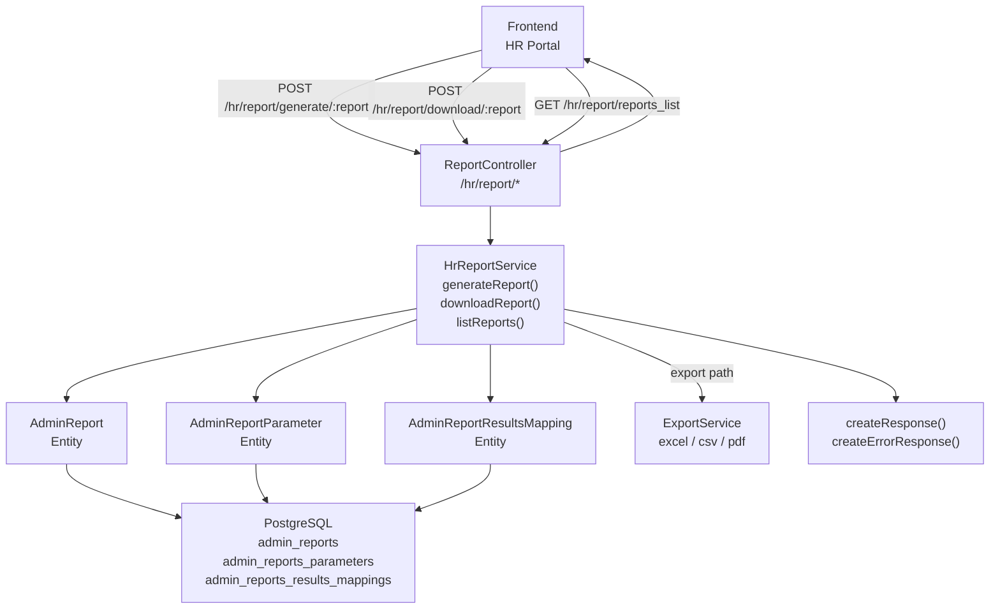
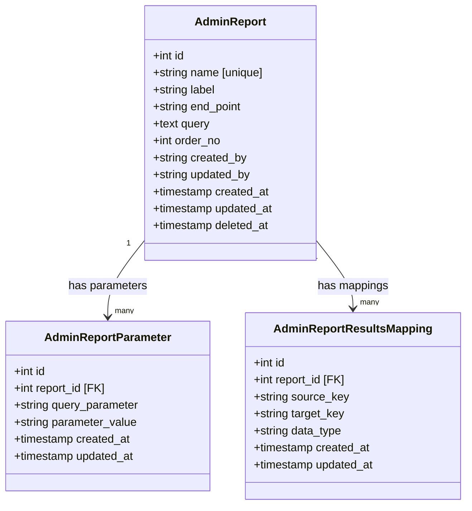
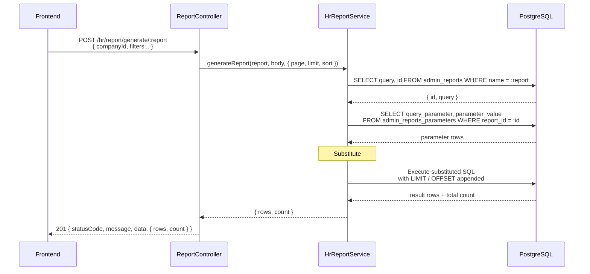
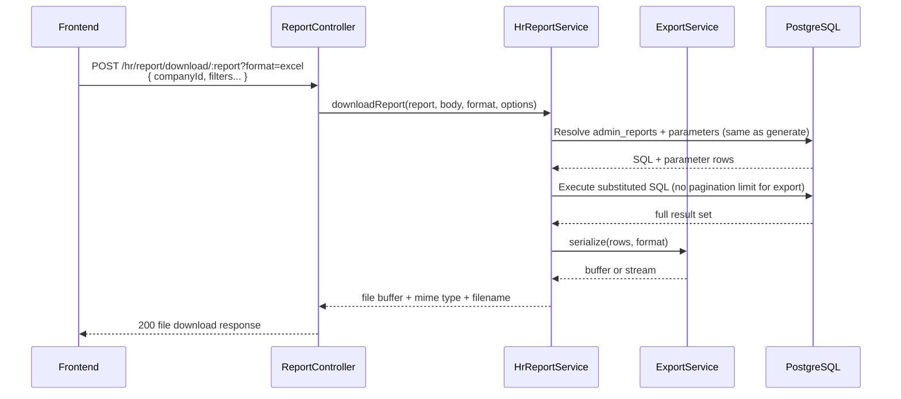

# TRD: HR Module Report Generation Framework (ibp-service)

This document is the authoritative technical design for the shared report generation framework that powers all HR portal screens in `ibp-service`. It translates the metadata-driven report pattern inherited from `scheduler-service` into a concrete, deployment-ready specification. Every backend developer building an HR module report, and every frontend developer binding a widget to a report response, must read this document in full before writing a line of code.

---

## 1. Scope

**In scope:**

- The three framework endpoints: generate, download, and list reports.
- The three database entities that store report definitions: `admin_reports`, `admin_reports_parameters`, and `admin_reports_results_mappings`.
- The service layer (`HrReportService`) that resolves metadata and executes parameterized SQL.
- The placeholder substitution contract (`###param###`) binding frontend input to SQL.
- The mandatory standards every module-level TRD (Enrollment, Claims, etc.) must follow when using this framework.
- The frontend chart data transformer utility that converts raw report payloads into chart-library-ready shapes.

**Out of scope:**

- Module-specific SQL queries (defined in each module's own TRD, e.g., `enrollment-module-trd.md`).
- Authentication and session management (handled by the shared auth guard in `ibp-service`).
- File storage for exported files (handled by the object storage layer outside this service).
- Admin UI for creating or editing report definitions.

---

## 2. Architecture Overview

The framework is built on a single design premise: **no hardcoded report logic in the controller or service**. Every report — regardless of screen or module — flows through the same three-step runtime: resolve metadata from the database, substitute placeholders with caller-supplied values, execute the resulting SQL, and return a consistent response envelope.

This approach was chosen over individual controller-per-screen handlers because: (a) adding a new report requires only a database upsert, not a code deploy; (b) the response envelope stays identical across all reports, so frontend binding code is reusable; and (c) SQL changes can be hot-patched in the database without a service restart.

The alternative — hardcoded service methods per screen — was rejected because it would create an unbounded surface area as the number of HR screens grows, and would couple deployment cadence to schema evolution.

The framework sits entirely within the `ibp-service` NestJS application. It exposes three HTTP routes, delegates execution to `HrReportService`, and reads its report definitions from three PostgreSQL tables that are seeded as part of each module's migration.



---

## 3. Data Model

The framework stores all report intelligence in three tables. No report-specific logic lives in code — the tables are the source of truth.

`admin_reports` holds one row per report key: its name (which doubles as the URL path parameter), a human label, the raw SQL body with `###placeholder###` tokens, and a display order. `admin_reports_parameters` maps each placeholder token to a default or injected value for a given report. `admin_reports_results_mappings` maps SQL output column aliases to stable frontend response keys, insulating the frontend from internal SQL renaming.



**Invariants:**

- `admin_reports.name` must be unique. It is the handle used in the URL path and in all module TRDs.
- Every `###placeholder###` token in `admin_reports.query` must have a corresponding row in `admin_reports_parameters` with a matching `query_parameter` value. A mismatch is a release blocker.
- `admin_reports_results_mappings` keys must remain stable after a report is deployed. Renaming a `target_key` without coordinating a frontend change will break widget bindings silently.
- Soft-delete (`deleted_at`) is supported on `admin_reports` only. Parameter and mapping rows are deleted and re-inserted on each upsert cycle.

---

## 4. API Contracts

All endpoints live under the `/hr/report` prefix. The path parameter `:report` is the exact value of `admin_reports.name`.

### 4.1 Generate Report

Fetches report data for display in a grid, card, chart, or detail panel.

#### Generate — Request

```
POST /hr/report/generate/:report
Authorization: Bearer <jwt>
Content-Type: application/json

Query parameters:
  page    (number, optional) — 1-based page number; defaults to 1
  limit   (number, optional) — rows per page; defaults to 50; max 500
  sort    (string, optional) — e.g. "date_desc" or "employeeName_asc"

Body: flat JSON object of report-specific filter parameters
  companyId          (string, required for all reports)
  policyId           (string, required where applicable)
  policyPeriodStart  (ISO date string, required for date-scoped reports)
  policyPeriodEnd    (ISO date string, required for date-scoped reports)
  employeeId         (string, required for detail/profile reports)
  search             (string, optional)
  [additional filters defined per module TRD]
```

#### Generate — Success (201)

```json
{
  "statusCode": 201,
  "message": "Report generated successfully.",
  "data": {
    "rows": [ /* array of report row objects */ ],
    "count": 240
  }
}
```

Card-type reports return a single-element array or a flat object in `data.rows`. The frontend must not assume `data` is always an array — it reads `data.rows` for lists and `data.rows[0]` for single-row aggregates.

#### Generate — Error (400)

```json
{
  "statusCode": 400,
  "message": "Failed to generate report.",
  "error": "<error detail string>"
}
```

There is no 404 for an unknown report key. An unknown key will fail at SQL lookup time and return 400.

---

### 4.2 Export Report

Downloads report data as a file. Accepts the same filter body as generate.

#### Export — Request

```
POST /hr/report/download/:report
Authorization: Bearer <jwt>
Content-Type: application/json

Query parameters:
  format  (string, required) — one of: "excel" | "csv" | "pdf"
  page    (number, optional)
  limit   (number, optional)
  sort    (string, optional)

Body: same filter parameters as generate endpoint
```

#### Export — Success (200)

```
Content-Type: application/vnd.openxmlformats-officedocument.spreadsheetml.sheet
               | text/csv
               | application/pdf
Content-Disposition: attachment; filename="<report-name>-<timestamp>.<ext>"

<binary file content>
```

#### Export — Error (400)

```json
{
  "statusCode": 400,
  "message": "Failed to export report.",
  "error": "<error detail string>"
}
```

Not all formats are available for all modules. Each module TRD must explicitly state which formats are supported. Requesting an unsupported format returns 400.

---

### 4.3 List Available Reports

Returns report metadata for discovery and filter-panel rendering.

#### List — Request

```
GET /hr/report/reports_list
Authorization: Bearer <jwt>
```

#### List — Success (200)

```json
{
  "statusCode": 200,
  "message": "Reports fetched successfully.",
  "data": [
    {
      "name": "ibp_hr_enrollment_employee_list",
      "label": "IBP HR Enrollment Employee List",
      "endPoint": "ibp_hr_enrollment_employee_list",
      "filters": [
        { "name": "search", "type": "text" },
        { "name": "status", "type": "select", "options": ["ACTIVE", "INACTIVE"] }
      ],
      "exportFormats": ["excel", "csv", "pdf"]
    }
  ]
}
```

---

## 5. Data Flow

### 5.1 Generate Report Flow

The sequence below shows a generate call from the moment the frontend fires the POST to the point where the response is returned. The service resolves the report by name, builds a parameter map from the request body, substitutes all `###placeholder###` tokens in the stored SQL, appends pagination, executes the query, and returns the result set.



### 5.2 Export Report Flow

Export follows the same metadata resolution and SQL execution path, then pipes the result set through the format serializer before streaming the file response.



---

## 6. Technology Choices

| Layer | Choice | Justification |
|---|---|---|
| Runtime framework | NestJS (TypeScript) | Matches the rest of `ibp-service`; decorator-based routing and DI align with the framework's controller/service split. |
| ORM | TypeORM | Already in use across all entities in `ibp-service`; no benefit to introducing a second data access layer. |
| Database | PostgreSQL | The `admin_reports.query` field stores raw SQL; only PostgreSQL's `$q$` dollar-quoting and parameterized `DO $$` blocks are supported by the upsert migration scripts. |
| Placeholder substitution | String replace at runtime | Simpler than a template engine for the `###param###` pattern; safe because all substituted values are validated via DTO before reaching the service. |
| Export serialization | `exceljs` (Excel), `papaparse` or native (CSV), `pdfmake` (PDF) | These are the libraries already present in `ibp-service`. The choice between them is owned by `ExportService`. |
| Response utilities | `createResponse` / `createErrorResponse` from `libs/service-lib` | Enforces the standard envelope across all ibp-service endpoints. |
| API documentation | `@nestjs/swagger` decorators | Auto-generates OpenAPI spec consumed by the internal developer portal. |

**Alternatives considered and rejected:**

- GraphQL for dynamic field selection — rejected because report shapes are already defined in `admin_reports_results_mappings`; adding a GraphQL schema layer would duplicate that contract.
- Stored procedures per report — rejected because they require a DB deploy for every report change, defeating the metadata-driven goal.

---

## 7. Security Design

**SQL injection prevention.** The `###placeholder###` substitution is the only point where caller-supplied values enter the SQL string. All body parameters are validated by a NestJS DTO decorated with `class-validator` before reaching the service. Numeric IDs are cast to integers; date strings are validated as ISO 8601 before substitution. No raw string interpolation from unvalidated input reaches the database driver.

**Authentication.** All three endpoints require a valid JWT issued by the ibp-service auth system. The `JwtAuthGuard` is applied at the controller class level. Requests without a valid token receive 401 before the controller method executes.

**Authorization.** HR portal report endpoints are restricted to the `HR_ADMIN` role. The `RolesGuard` checks the `roles` claim in the JWT. Requests from authenticated users without the `HR_ADMIN` role receive 403.

**Data scoping.** Every report SQL is expected (and enforced by the module TRD standards in Section 9) to filter by `company_id = ###companyId###`. The `companyId` value is read from the request body and must match the company associated with the authenticated user's session. The service layer validates this match before substitution. A user who tampers the `companyId` in the request body receives a 400 if the substituted company does not match their session company.

**Soft-delete enforcement.** All queries must include `deleted_at IS NULL` on every table that carries a soft-delete column. This is a mandatory rule in Section 9 — violation is a release blocker.

**Export data scope.** Export requests apply the same filter body as generate requests. There is no separate export-specific auth check, but the SQL executed is identical to the generate path (minus pagination), so the data scope is equivalent.

**Audit.** No audit log is currently written for report access. See Open Questions.

---

## 8. NFR Design

**Pagination.** The `limit` and `offset` parameters are appended to the SQL at runtime using `COALESCE(NULLIF(###limit###,'')::int, 50)` and equivalent for offset. The default page size is 50 rows. The maximum enforced at the DTO layer is 500 rows. Export requests bypass pagination and return the full result set — reports with very large result sets should define a row cap in their SQL (e.g., analytics reports returning top-N records).

**Performance.** The framework does not cache query results. Each POST to `/generate` executes a live SQL query. Report SQL authors are responsible for indexing strategies — each module TRD must include a note on which columns are used in `WHERE` clauses so the DBA can confirm index coverage before the report goes to production.

**Scalability.** Because the framework is stateless (metadata resolved per request, no in-memory cache), horizontal scaling of `ibp-service` is straightforward. PostgreSQL connection pooling via TypeORM's pool configuration manages concurrent report queries.

**Reliability.** All errors in the service layer are caught and converted to a 400 response — no uncaught exception reaches the framework. The service does not retry failed queries; transient DB errors are surfaced to the caller immediately.

**Export file size.** No hard cap is currently enforced on export result sets at the framework level. Module TRDs must define a maximum row count for exports and add a SQL `LIMIT` where appropriate to avoid memory exhaustion.

---

## 9. Mandatory Standards for Module-Level TRDs

This section defines the rules every module TRD (Enrollment, Claims, Hospital Network, etc.) must follow when using this framework. These are not suggestions — any module TRD that violates them is incomplete and must be revised before sign-off.

### 9.1 No-Assumption Rule

A module TRD must be self-contained. Do not write "use existing query" or "refer to script." Include the full SQL body for every report key in the TRD itself. A developer must be able to seed all metadata rows from the TRD alone, without reading any other document.

### 9.2 Mandatory Sections in Each Module TRD

1. Screen-to-report-key mapping (which screen action calls which report key).
2. Full `admin_reports` insert/upsert plan for all keys.
3. Full `admin_reports_parameters` rows for each key, with exact placeholder names.
4. `admin_reports_results_mappings` plan listing stable frontend response keys.
5. Source table mapping, join path, and foreign key notes.
6. Frontend-to-backend call sequence per screen action.
7. Filter, search, and reset behavior contract.
8. Export contract: supported formats and row cap.
9. QA checklist covering cards, list, drilldown, and export consistency.

### 9.3 SQL Delivery Standard

For each report key, the TRD must define:

1. Report key name (matches `admin_reports.name`).
2. Label and endpoint value (matches `admin_reports.label` and `end_point`).
3. Full SQL body including all CTEs and `WHERE` clauses.
4. All `###placeholder###` tokens used in the SQL.
5. All `SELECT` output aliases (these become the frontend-facing keys).
6. Pagination behavior: whether `LIMIT`/`OFFSET` are applied and where.
7. Confirmation that `deleted_at IS NULL` is enforced on every soft-deletable table in the query.

### 9.4 Parameter Placeholder Standard

All `###placeholder###` tokens in the SQL must have a matching row in `admin_reports_parameters`. Naming is exact — a space or case difference breaks substitution at runtime. Canonical placeholder names:

| Placeholder | Purpose |
|---|---|
| `###companyId###` | Company scope filter |
| `###policyId###` | Policy scope filter |
| `###policyPeriodStart###` | Policy period start date (ISO date) |
| `###policyPeriodEnd###` | Policy period end date (ISO date) |
| `###employeeId###` | Employee-level detail filter |
| `###search###` | Free-text search term |
| `###limit###` | Pagination page size |
| `###offset###` | Pagination row offset |
| `###metricMode###` | Chart toggle (COUNT vs AMOUNT) |
| `###department###` | Department filter |
| `###city###` | City filter |

A placeholder in SQL without a matching parameter row is a release blocker. A parameter row without a corresponding placeholder in SQL is a dead row and must be removed.

### 9.5 Plain vs Encrypted Field Rule

Module TRDs must explicitly state whether plain or encrypted column values are used for PII fields. The current system stores the following columns as plain text — encrypted column variants must not be referenced in report SQL:

- `policy_enrollment_employee.email`
- `policy_enrollment_employee.phone_number`
- `policy_enrollment_employee.date_of_birth`

If encrypted variants are introduced in future, this rule must be updated and all affected module TRDs revised.

### 9.6 FE-BE Integration Contract

Module TRDs must define the exact API call sequence for each of these screen interactions:

| Interaction | What must be specified |
|---|---|
| Initial screen load | Which report keys are called, in parallel or sequence |
| Filter apply | Which params change and which report keys are re-called |
| Reset | Which state is cleared and which report keys are re-called |
| Row expand (inline) | Which report key is called with which row identifier |
| Detail modal / page navigation | Which report keys compose the detail view |
| Export | Which report key is used, with which format(s) |
| Tab switch | Which report keys correspond to each tab |

### 9.7 Definition of Done for a Module TRD

A module TRD is complete only when all three of the following hold:

1. A backend developer can create or update all `admin_reports`, `admin_reports_parameters`, and `admin_reports_results_mappings` rows from the TRD without asking a single question.
2. A frontend developer can bind every widget, grid column, card field, and chart to a named response key from the TRD without asking a single question.
3. A QA engineer can validate every screen behavior, filter interaction, export format, and data consistency rule from the TRD checklists without asking a single question.

---

## 10. Frontend Chart Data Transformer

Dashboard chart widgets receive raw report payloads and must not pass them directly to charting libraries. All chart widgets must route their data through the `transformChartData` utility before render. This decouples the backend's SQL alias conventions from the charting library's expected input shapes.

**Function signature**

```typescript
type ChartType = 'bar' | 'pie' | 'line';

type BarLineConfig = { xKey: string; yKey: string };
type PieConfig = { labelKey: string; valueKey: string };

type BarLinePoint = { x: unknown; y: unknown };
type PiePoint = { label: unknown; value: unknown };

function transformChartData(
  type: 'bar' | 'line',
  data: Record<string, unknown>[],
  config: BarLineConfig,
): BarLinePoint[];

function transformChartData(
  type: 'pie',
  data: Record<string, unknown>[],
  config: PieConfig,
): PiePoint[];
```

**Behavior contract**

- Missing or `null` values in the source data are replaced with `0` for numeric y/value fields and `'Unknown'` for string label/x fields.
- The transformer does not modify the source array. It returns a new array.
- If `data` is empty, the transformer returns an empty array. The widget is responsible for rendering an empty state.

**Usage examples**

```typescript
// Bar chart: claims by tenure bucket
transformChartData('bar', reportData, { xKey: 'bucket', yKey: 'value' });

// Pie chart: claims by relation
transformChartData('pie', reportData, { labelKey: 'relation', valueKey: 'value' });

// Line chart: claim trend over months
transformChartData('line', reportData, { xKey: 'month', yKey: 'claimAmount' });
```

**Implementation location:** `libs/ui-lib/src/lib/utils/transformChartData.ts`

Every dashboard chart widget implementation note must reference this utility explicitly. Widgets that directly pass raw API data to charting libraries without using this transformer will fail code review.

---

## 11. Testing Strategy

**Unit tests — service layer**

Test `HrReportService.generateReport` with mocked TypeORM repositories. Verify: (a) placeholder substitution replaces all tokens correctly; (b) unknown report name returns an error; (c) pagination parameters are appended to SQL; (d) a body param not matching any placeholder token does not cause a crash.

Do not test the SQL business logic at the unit level — SQL correctness belongs in integration tests.

**Integration tests — SQL execution**

Each module TRD is responsible for integration tests that execute the module's report keys against a real PostgreSQL test database seeded with fixture data. The framework itself does not own module-specific integration tests. The framework integration test suite covers: (a) a synthetic test report seeded in `admin_reports`; (b) round-trip generate call returning expected rows; (c) round-trip export call returning a valid file buffer.

**E2E tests — endpoint contract**

Supertest-based E2E tests covering:

1. `POST /hr/report/generate/:report` — happy path, unknown report key, missing required body param.
2. `POST /hr/report/download/:report` — valid format, invalid format, export with filters applied.
3. `GET /hr/report/reports_list` — returns metadata array with correct shape.
4. Unauthenticated request to any endpoint — returns 401.
5. Authenticated request with wrong role — returns 403.

**What must hit real dependencies:** SQL execution in integration tests must run against a real PostgreSQL instance. Mocking the DB driver in SQL-correctness tests is not permitted.

---

## 12. File Locations

| Artifact | Path |
|---|---|
| Controller | `apps/services/ibp-service/src/app/hr/report.controller.ts` |
| Service | `apps/services/ibp-service/src/app/hr/hr-report.service.ts` |
| `AdminReport` entity | `apps/services/ibp-service/src/app/hr/entities/admin-report.entity.ts` |
| `AdminReportParameter` entity | `apps/services/ibp-service/src/app/hr/entities/admin-report-parameter.entity.ts` |
| `AdminReportResultsMapping` entity | `apps/services/ibp-service/src/app/hr/entities/admin-report-results-mapping.entity.ts` |
| Response utilities | `libs/service-lib/src/lib/utils/response.utils.ts` |
| Chart transformer | `libs/ui-lib/src/lib/utils/transformChartData.ts` |

---

## 13. Open Questions

The following design decisions are deferred to stage 40c (task breakdown) or to implementation:

1. **Response caching.** Should generate responses be cached per (report key + filter hash) for a short TTL (e.g., 30 seconds)? The current design executes a live query on every POST. For high-frequency screens (enrollment list), caching could reduce DB load, but adds cache invalidation complexity. Decision owner: backend tech lead.

2. **Audit logging.** Should each report access be written to `user_activity_log`? Currently no audit trail exists for which HR user viewed which report. Useful for compliance but adds a write on every read path. Decision owner: product and compliance.

3. **Row cap on exports.** No hard limit is enforced at the framework level. Should the service enforce a maximum (e.g., 10,000 rows) before delegating to the export serializer, to prevent memory exhaustion on large date ranges? Decision owner: backend tech lead.

4. **Encrypted field support.** The plain vs. encrypted column rule (Section 9.5) assumes plain columns for PII. If the database migrates to encrypted columns, all module SQL queries need updates. A registry of which reports touch PII columns would make this migration tractable. Decision owner: DBA and security.

5. **Unknown report key handling.** Currently an unknown `:report` path parameter surfaces as a 400. Should it return a more explicit 404 to help frontend developers diagnose typos in report key names during development?

---

## 14. Approval

```
Approved by:
Role:
Date:

Approved by:
Role:
Date:
```

---

*HR Module Report Generation Framework TRD — ibp-service — April 2026.*
