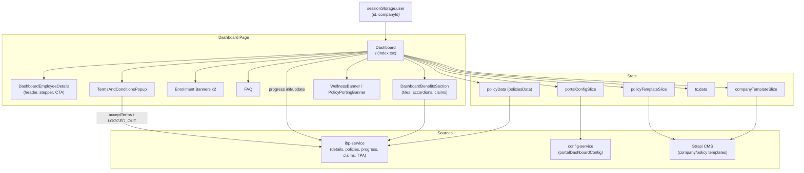
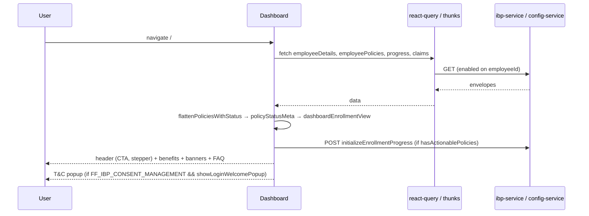
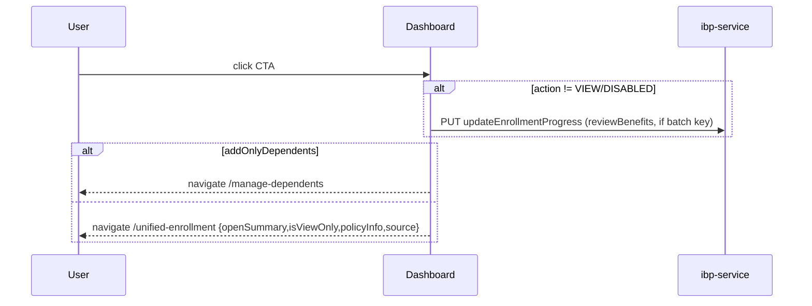

# IBP Dashboard — Technical Requirements Document (TRD)

**Document Version:** 2.0  
**Date:** 2026-07-20  
**Author:** IIRM Engineering Team  
**Module:** IBP-DASHBOARD  
**PRD Reference:** [`prd.md`](prd.md)

> Reverse-engineered from production code. This document describes the as-built design of the shipped Dashboard screen so that developers changing it and the architect/PTL signing off share one accurate picture. It implements the [IBP Dashboard PRD](prd.md); business rules referenced as `BR-DASH-NNN` are defined there.

---

## 1. Architecture Overview

The Dashboard is a **client-only** module in the IBP employee app (`apps/ui/ibp`). It owns no server-side persistence — it is a composition/orchestration screen that reads employee, policy, claims, template, and tenant-config data, resolves an enrollment view-state, and renders. Its only writes are ephemeral (enrollment-progress init/update, a consent record, a logout activity).

The screen mounts at route `/` (`Dashboard`) and composes three regions: the employee-details header (`DashboardEmployeeDetails`), the benefits section (`DashboardBenefitsSection`), and the support/consent surfaces (two enrollment banners, `FAQ`, `PolicyPortingBanner`, `WellnessBanner`, `TermsAndConditionsPopup`).

### 1.1 Route & Entry Points

| Surface | Route | Component | Notes |
| --- | --- | --- | --- |
| Dashboard | `/` | `apps/ui/ibp/src/app/pages/Dashboard/index.tsx` | Authenticated landing screen |
| Enrollment hand-off | → `/unified-enrollment` | (UNIFIED-ENROLLMENT) | CTA navigation with `{openSummary, isViewOnly, policyInfo, source:"dashboard"}` |
| Add-dependents hand-off | → `/manage-dependents` | (Manage Dependents) | CTA reroute in `addOnlyDependents` mode |
| Quick tiles | → `/e-card`, `/policy-features`, `/hospital`, `/my-documents`, `/life-events`, TPA SSO | (destination modules) | Visible only when `hasViewablePolicies` |
| Claims | → `/claims-corner` | (Claims) | Claim-number cell link |
| FAQ | → `/faqs` | (FAQ) | "View More" |
| Consent decline | → `/landing` | (Landing) | On T&C Decline |

### 1.2 Identity & Auth

Identity is read from `sessionStorage.user` (`id`, `companyId`). All data queries are enabled on `Boolean(employeeId)`. There is no dashboard-specific guard; route protection is handled by the app shell. Tenant config is resolved by subdomain via `useCompanyConfig` → `companyAuthConfigBySubdomain`.

---

## 2. Scope

**In scope for this TRD:**

- The `Dashboard` page composition and its enrollment view-state resolution
- `DashboardEmployeeDetails` (header, stepper, CTA, days-left, alternate contact, DOB mask)
- `DashboardBenefitsSection` (quick tiles, dynamic TPA features, accordions, contribution summary, claim table)
- Consumed API contracts and Redux/session state
- Consent gate (`TermsAndConditionsPopup`), wellness/porting banners
- Client-side derivations: status meta, date meta, stepper, GST, claim maps

**Non-goals:**

- The `/unified-enrollment` flow and destination pages (own modules/TRDs)
- Backend implementation of consumed endpoints (owned by `ibp-service`, `config-service`)
- Strapi CMS authoring of company/policy templates
- The unrouted `DashboardPage` and unused `useDashboardContent` hook (see Open Items)

---

## 3. Component Diagram

The Dashboard composes three regions and reads from Redux slices, react-query, and session storage. It writes only ephemeral progress/consent/activity.



---

## 4. State Model

The Dashboard holds no durable state of its own. Its rendering is a pure function of the following inputs plus local UI state.

### 4.1 Redux slices consumed

| Slice / selector | Provides | Source |
| --- | --- | --- |
| `companyTemplate.data` (`companyTemplateSlice`) | dashboard content, FAQs, banners, headings, year range, contact matrix | Strapi via `fetchCompanyTemplate(companyId)` |
| `policyTemplate.byPolicyId` (`policyTemplateSlice`) | per-policy template (info points, GST/contribution flags) | Strapi via `fetchPolicyTemplate([policyIds])` (dispatched once with an **array** of policyIds) |
| `policyData.policiesData` | `employeePolicies` / `enrolledPolicies` | `ibp-service` |
| `tc.data` | T&C introduction + sections | `ibp-service` |
| `portalConfigSlice` | portal config; `clearPortalConfiguration` on decline | `config-service` |

### 4.2 react-query

`useApiQuery` for employee details, policies, claims overview — keyed on `employeeId`, enabled on its presence; cache shared across components.

### 4.3 Local / session state

- Local UI: accordion expansion refs, DOB reveal toggles, TPA fetch flags, banner visibility.
- `sessionStorage`: `user` (identity + alternate contact, live-synced via the `ibp:user-updated` window event), `sessionStartedAt`, `showLoginWelcomePopup` (consent gate, removed after read).

---

## 5. Enrollment View-State Resolution

This is the core algorithm of the module (BR-DASH-001..005, 009).

1. **Per-policy status** — `getEmployeePolicyStatus` / `flattenPoliciesWithStatus` (`utils/flattenPolicies.ts`) maps each policy to `PolicyStatus`: `NOTIFY`, `NOT_STARTED`, `CAN_ENROLL`, `EDIT_ENROLL`, `LOCKED`. `CAN_ENROLL` is returned **only** when `employeeEnrollmentStatusKey === IN_PROGRESS` (BR-DASH-002); an open window with `NOT_STARTED` resolves to `NOT_STARTED`, not `CAN_ENROLL`.
2. **`policyStatusMeta`** (memo) — counts per status plus `hasActionablePolicies`, `hasViewablePolicies` (`EDIT_ENROLL` | `LOCKED`), `isAllNotify`, `enrollmentEligibleCount`.
3. **CTA resolution** (`dashboardEnrollmentView`) — resolves one action from the ladder `CAN_ENROLL → EDIT_ENROLL → NOT_STARTED → LOCKED → all-NOTIFY → fallback`. A `NOT_STARTED` policy with saved progress ≥ "add dependents" flips to Continue (BR-DASH-003). Labels are computed **inline** (the exported `getEnrollmentButtonLabel` is not used — see Open Items).
4. **CTA action** — on click (non-VIEW/non-DISABLED): mark `reviewBenefits` complete when a batch key exists, then navigate. VIEW → `/unified-enrollment` with `isViewOnly` (BR-DASH-005). `addOnlyDependents` (every policy flagged) → `/manage-dependents` (BR-DASH-008).
5. **`dateMeta`** (memo) — open/close date derivation, `daysUntilOpen` / `daysUntilClose` for the days-left counter (BR-DASH-009).
6. **Phase gating** — `hasViewablePolicies` gates the quick-access row; `addOnlyDependents` hides banner #2 + Policy-Features/E-Cards tiles.

---

## 6. Screen-to-API Mapping

| UI element | Endpoint | Method | Purpose |
| --- | --- | --- | --- |
| Header, status | `employeeDetails` | GET | employee meta, `policyEnrollmentStatuses`, alternate contact |
| Accordions, CTA | `employeePolicies(employeeId)` | GET | employee + enrolled policies |
| Stepper, progress-flip | `enrollmentProgress(employeeId)` | GET | progress + batch key |
| Claim table | claims overview | GET | claim rows + settled/intimated amounts |
| Relation filtering | `getRelationDetails(id)` | GET | policy relations / configuration |
| TPA Login tile | `employeeTpaPortalSso(id)` | GET | TPA SSO redirect |
| Dynamic TPA buttons | `employeeTpaFeatures(id)` | GET | admin-configured TPA feature list |
| E-card / TPA feature | `eCardExternalUrl` | POST | generic TPA feature |
| Wellness | `alyveWellnessUrl` | POST | wellness SSO (`appKey:"alyve-wellness"`) |
| Tenant flags | `companyAuthConfigBySubdomain(subdomain)` | GET | `portalDashboardConfig`, password rules, branding |
| CTA click | `updateEnrollmentProgress` | PUT | mark `reviewBenefits` |
| Init | `initializeEnrollmentProgress` | POST | gated on `hasActionablePolicies` |
| T&C Accept | `acceptTerms` | POST | consent record (`tcVersion`) |
| T&C Decline | `getActivityLogs` | POST | `LOGGED_OUT` activity |

---

## 7. API Contracts (Consumed)

The Dashboard consumes envelopes of the form `{ statusCode, message, data }` from `ibp-service` / `config-service`, and Strapi template payloads. Key shapes:

- **employeePolicies** → `data: { employeePolicies: Policy[], enrolledPolicies: Policy[] }`. Each `Policy` carries `policyId`, `policyTypeKey`, `isEditable`, `dueDate`, `addOnlyDependents`, `configuration` (constraints incl. `gstApplicable`, `showGstToEmployee`, `premiumPerLife`, sum-insured model), and per-employee status keys.
- **employeeDetails** → `data: { employeeName, companyEmployeeId, dateOfBirth, gender, additionalDetails, phone, email, alternate*, policyEnrollmentStatuses[] }`.
- **enrollmentProgress** → `data: { enrollmentBatchKey, steps[] }`.
- **employeeTpaFeatures** → `data: TpaFeature[]` (`type: REDIRECT|BASE64|DISPLAY|SYNC`, label, endpoint/appKey).
- **portalDashboardConfig** (config-service, subdomain-keyed) → `{ wellnessBanner:{enabled}, portingBanner:{enabled}, passwordRules, branding }`.

Response-handling rule: single-row aggregates read `data`; list reads iterate `data.<collection>`.

---

## 8. Data-Flow Sequences

### 8.1 Page load



### 8.2 CTA click



### 8.3 T&C decline

```mermaid
sequenceDiagram
    participant U as User
    participant TC as TermsAndConditionsPopup
    participant S as ibp-service
    U->>TC: Decline
    TC->>S: POST getActivityLogs (LOGGED_OUT)
    TC->>TC: clearPortalConfiguration; remove user, sessionStartedAt
    TC-->>U: navigate /landing
```

---

## 9. Frontend Implementation

Key derivations in `DashboardBenifitsSection`:

- **`globalGstApplicable`** — gates GST on `constraints.gstApplicable` / `showGstToEmployee` (BR-DASH-012).
- **`sectionContributions`** — company contribution + employee total; 18% GST applied to the **employee** amount only, and only when `globalGstApplicable`; label switches to "(incl. GST)". GMC contributions ×member-count (BR-DASH-013).
- **Sum-insured MULTIPLE** — factor from `additionalDetails` (e.g. CTC) bounded by min/max.
- **`claimedAmountByPolicyId`** (settled) / **`claimIntimatedAmountByPolicyId`** — claim maps for the summary table (BR-DASH-014).
- **`POLICY_PRIORITY`** — sort order GMC, GMC_TOP-UP, GPA, GTL.
- **Accordion control** — auto-expand first accordion + first nested group; auto-scroll; re-anchor on shrink (BR-DASH-016).
- **TPA feature dispatch** — per `type`: REDIRECT (SSO), BASE64 (inline PDF), DISPLAY (modal), SYNC (BR-DASH-011).

Component props contracts:

- `DashboardBenefitsSection`: `title, subtitle, features, buttonText, overAllEnrollmentStatus, onOpenPolicyFeatures, onAccordionControlReady, addOnlyDependents`.
- `DashboardEmployeeDetails`: `enrollmentSteps, currentStepIndex, daysLeft, hasCompletedEnrollmentPolicy, infoLines, actionButtonDisabled, onStartEnrollment, overAllEnrollmentStatus, …`.

DOB masking: header DOB rendered via `formatDate(dob, "MMM YYYY")`; dependent DOBs hidden with a per-value reveal toggle (BR-DASH-012 / PII).

---

## 10. Security Design

- **Authentication** — identity from `sessionStorage.user`; queries gated on `employeeId`. Route protection at the app shell.
- **Company scoping** — all reads are employee/company-scoped by `id` / `companyId` from session; the dashboard never accepts a company id from the URL.
- **PII handling** — employee DOB masked to month+year; dependent DOBs hidden by default with explicit reveal. Alternate contact rendered from the session record.
- **Consent** — `TermsAndConditionsPopup` cannot be dismissed via backdrop/escape; T&C HTML is sanitized (`sanitizeHtml`) at that render boundary. Decline clears portal config + session and logs `LOGGED_OUT`.
- **No server-side persistence owned here** — the module only triggers ephemeral progress/consent/activity writes; the source of truth lives in `ibp-service`.

---

## 11. Technology Choices

React + TypeScript (`apps/ui/ibp`), MUI, Redux Toolkit slices (`companyTemplate`, `policyTemplate`, `policyData`, `tc`, `portalConfig`), react-query (`useApiQuery`) for server reads, React Router for navigation. Content sourced from Strapi CMS via the template slices.

---

## 12. Testing Strategy

- **Unit** — `flattenPoliciesWithStatus` status mapping (all five statuses + the `CAN_ENROLL` == IN_PROGRESS rule); `dashboardEnrollmentView` CTA resolution across the ladder incl. progress-flip; `sectionContributions` GST gating; `dateMeta` open/close derivation.
- **Integration** — page-load composition with mocked envelopes; T&C accept/decline side-effects; TPA feature dispatch per type; add-dependents-only reroute.
- **E2E** — land → resolve CTA → navigate to `/unified-enrollment`; consent gate accept/decline; enrolled layout with claim table.

---

## 13. Implementation File Locations

| Concern | File |
| --- | --- |
| Page | `apps/ui/ibp/src/app/pages/Dashboard/index.tsx` |
| Header | `apps/ui/ibp/src/app/components/DashboardEmployeeDetails/index.tsx` |
| Benefits | `apps/ui/ibp/src/app/components/DashboardBenifitsSection/index.tsx` |
| Status util | `apps/ui/ibp/src/app/utils/flattenPolicies.ts` |
| Consent | `apps/ui/ibp/src/app/components/Dashboard/TermsAndConditionsPopup/index.tsx` |
| Porting / Wellness | `apps/ui/ibp/src/app/components/Dashboard/PolicyPortingBanner`, `WellnessBanner` |
| FAQ | `apps/ui/ibp/src/app/components/FAQ/index.tsx` |
| Tenant config | `apps/ui/ibp/src/app/hooks/useCompanyConfig.ts` |

---

## 14. Open Items

Carried from the PRD Gap Register — technical cleanups the TRD flags for implementation:

1. **GMC tile gating inert** (GAP-DASH-01) — no tile sets `requiresGMC`; life-events GMC filter commented. Remove dead gating or implement per product decision.
2. **Dead utilities** (GAP-DASH-02/03) — `getEnrollmentButtonLabel` and `usePolicyTemplateFaqs` unused. Remove or wire in. FAQ merge is not implemented; page passes company FAQs only.
3. **FAQ sanitization** (GAP-DASH-04) — FAQ answers render without a visible DOMPurify call in this path; confirm requirement.
4. **`useDashboardContent`** (GAP-DASH-05) — imported but never invoked; contains a duplicate `companyTemplate` fetch + console logs. Drop.
5. **Stray console.logs** (GAP-DASH-06) — in the live path (policy dump, TPA handlers). Strip.
6. **Unrouted `DashboardPage`** (GAP-DASH-07) — imported in `app.tsx`, attached to no route, but the live page imports styled containers from its `styles`. Relocate styles, remove.

---

## Approval

```
Approved by:
Role:
Date:

Approved by:
Role:
Date:
```
