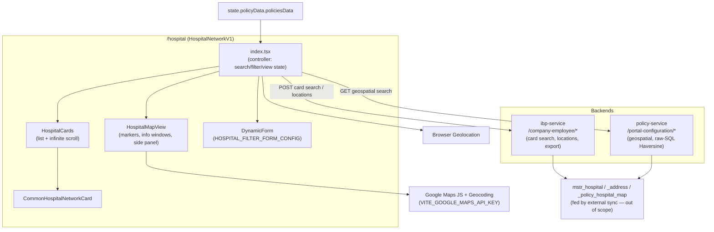
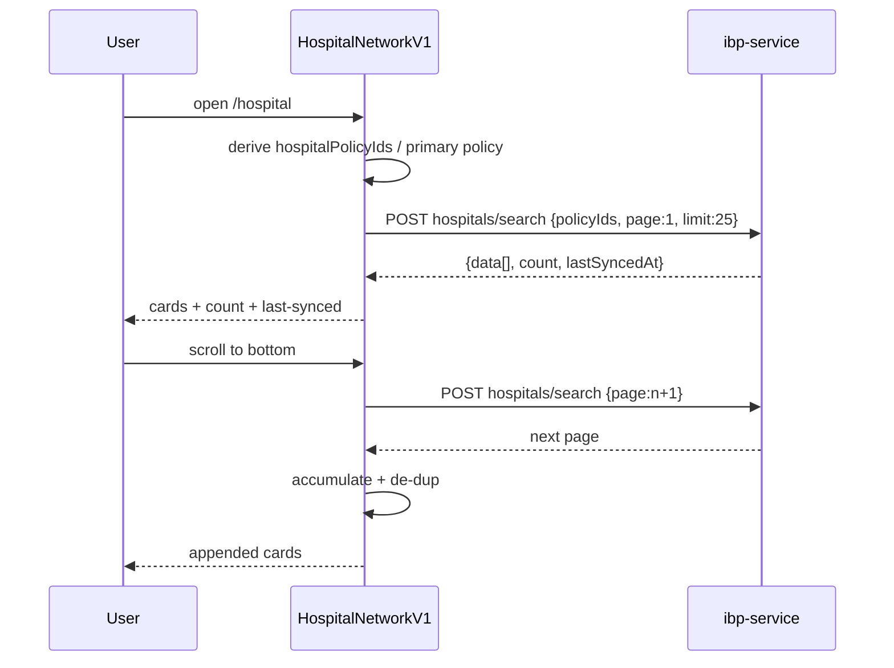
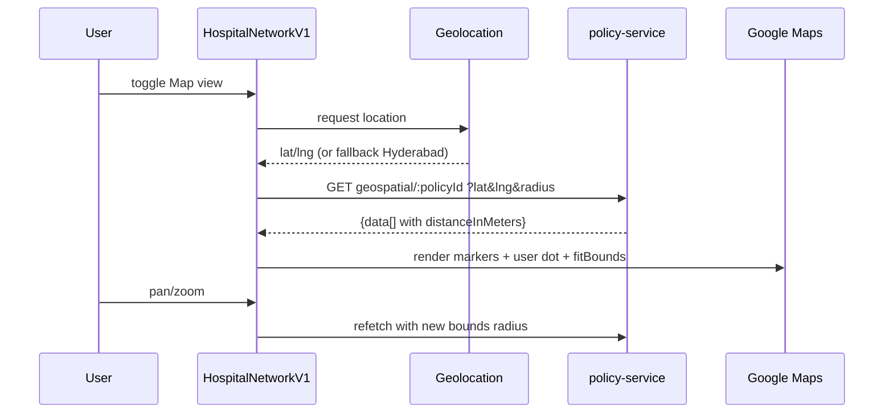

# IBP Hospital Network — Technical Requirements Document (TRD)

**Document Version:** 1.0  
**Date:** 2026-07-20  
**Author:** IIRM Engineering Team  
**Module:** IBP-HOSPITAL-NETWORK  
**PRD Reference:** [`prd.md`](prd.md)

> Reverse-engineered from production code. Documents the as-built design of the employee-facing Hospital Network screen (`/hospital`) so developers changing it and the architect/PTL signing off share one accurate picture. Implements the [Hospital Network PRD](prd.md); rules referenced as `BR-HN-NNN` are defined there.

---

## 1. Architecture Overview

Hospital Network is a **client-only** module in the IBP employee app (`apps/ui/ibp`). It is a read surface over the policy-scoped hospital network: it fetches hospitals from two backends and renders them as a paginated card list or a Google map. It owns no server state — its only write is an on-demand Excel export blob (currently unreachable in the UI) and toast messages.

The screen reads from **two backends**:

- **`ibp-service`** (`/company-employee/*`) — the card/list search (POST), state/city filter options, and the export endpoint. This path returns the policy-scoped network with a `lastSyncedAt` marker and supports the `source: "API_SYNC"` filter for TPA-synced hospitals.
- **`policy-service`** (`/portal-configuration/*`) — the map geospatial search (GET), a **DB-agnostic raw-SQL Haversine approximation** (`RADIANS`/`COS`/`SIN` — deliberately *not* PostGIS, see `portal-configuration.repository.ts:1167`), returning `distanceInMeters` for a lat/lng + radius. **Note:** in the default config this path is not actually used by the UI (see §5 / Open Items).

The underlying hospital data is produced by a separate **external sync pipeline** (scheduler-service cron + file upload) into `mstr_hospital` / `mstr_hospital_address` / `mstr_policy_hospital_map` — out of scope here (see `docs/external-hospital-sync.md`).

### 1.1 Route & Entry Points

| Surface | Route | Component |
| --- | --- | --- |
| Hospital Network | `/hospital` | `apps/ui/ibp/src/app/pages/HospitalNetworkV1/index.tsx` (LIVE) |
| Dashboard entry | tile → `/hospital` | `components/Header` / dashboard quick tile |
| Legacy (dead) | — (unrouted) | `pages/HospitalNetwork/*` (mock/GSAP demo — delete) |

### 1.2 Identity & Auth

Identity/policy scope comes from `state.policyData.policiesData` (loaded app-wide from the employee session). There is no hospital-specific guard; route protection is at the app shell. The module derives `hospitalPolicyIds` and a primary policy id (preferring Group Mediclaim) from the policy data (BR-HN-001).

---

## 2. Scope

**In scope:** the `HospitalNetworkV1` controller and its children (`HospitalCards`, `HospitalMapView`, `CommonHospitalNetworkCard`), the consumed API contracts, local/query state, Google Maps integration, and the client-side search/filter/view logic.

**Non-goals:** HR-portal hospital management (`HRPortalHospitals`), the external-sync ingestion pipeline (scheduler-service, master-data, geocoding at ingest), claims-intimation hospital search, and the backend implementation of the consumed endpoints.

---

## 3. Component Diagram



---

## 4. State Model

The module is state-heavy on the client (a single controller in `index.tsx`) with minimal Redux/query.

### 4.1 Redux

- Read: `state.policyData.policiesData` (policy scoping). No dedicated hospital slice.
- Write: `setToastMessage` (export outcomes only).

### 4.2 react-query

One query: key `["hospitalNetworksGeo", primaryHospitalPolicyId, activeTab, fullSearchTerm, mapLocationParams, mapLimit]`, enabled only in map + geo mode. Card search, the map POST fallback, and the locations calls use `useApiMutation` (no query cache).

### 4.3 Local state (controller)

`searchTerm` / `fullSearchTerm`, `filterParams` / `filterDraft`, `selectedPolicyId`, `activeTab` (Included/Excluded), `page`, `isFilterOpen`, `isMapView`, `useGeoSearch`, `lastRefreshed`, `focusHospital`, `mapRadiusKm` (default 5), `mapLimit` (12→200), `mapCenterLocation`, `actualUserLocation`, `accumulatedHospitals`, `isLoadingMore`; plus refs for user location, geocode de-dup, previous filters, card-click origin, and last-requested page. **No** sessionStorage/localStorage persistence of filters or view mode.

---

## 5. Search / Filter / View Resolution

The controller picks a data path from `(isMapView, useGeoSearch, filters, syncedFlag)`:

1. **Card view** → `POST getHospitalNetworks()` with `{ ...parsedSearchParams, policyIds[], isNetworkHospital, source?:"API_SYNC", page, limit:25 }`. Response: `data.data[]`, `data.count`, `data.lastSyncedAt`. Pages accumulate + de-dup (id, or name+addr+pin). (BR-HN-006)
2. **Map view + geo** (no filters, synced flag off) → `GET getHospitalNetworksGeospatial(primaryHospitalPolicyId)` with `latitude/longitude/radius(km)/page/limit`; radius derived from map bounds. (BR-HN-008/009)
3. **Map view + filters or synced flag** → falls back to the **card POST** endpoint with `page:1, limit:mapLimit`; then a client-side name filter is applied on top. (BR-HN-008)
4. **Filter options** → `POST hospitalNetworkLocations()` — states (`{policyIds}`) and cities (`{policyIds, state}`). (BR-HN-015)

Search is debounced 400 ms; card search is server-side (matching name/code/addr1/addr2/landmark; pincode prefix; `sort` supported but unused), map search adds a client-side name filter (BR-HN-003).

**Default-config reality (important).** The synced flag `VITE_FF_SHOW_SYNCED_HOSPITALS` defaults ON, so in the shipped config:
- Path 1 always runs in **synced-only mode** — backend returns only `source='API_SYNC'` rows, does not join the policy-hospital map, and **skips the `isNetworkHospital` filter** (`portal-configuration.util.ts:485-506`). Employees see only synced hospitals, not the policy-mapped network.
- Path 2 (geo) is **never used** — its result is discarded at `index.tsx:548` in favor of Path 3, yet the geo query still fires (its `enabled` omits `!showSyncedHospitals`) and is thrown away.
- **Defect:** even outside synced mode, `isNetworkHospital` is sent as a JSON boolean but the card DTO transform accepts only the strings `'true'`/`'false'`, yielding `undefined` — so Included/Excluded is dropped on the card path (works on the GET geo path, which sends a query string). See GAP-HN-08.
- Backend pagination is **in-memory** (`getMany()` then `.slice`); the multi-policy geo service path fetches `limit:10000` per policy then dedups/paginates in JS.

---

## 6. Screen-to-API Mapping

| UI action | Endpoint | Method | Purpose |
| --- | --- | --- | --- |
| Card list / search / filter | `getHospitalNetworks()` `/company-employee/policy/hospitals/search` | POST | policy-scoped card search (page 25) |
| Map (geo) | `getHospitalNetworksGeospatial(policyId)` `/portal-configuration/policy/hospitals/search/:policyId` | GET | lat/lng + radius geospatial search |
| Map (filtered/synced) | `getHospitalNetworks()` | POST | fallback card search for map |
| State / City options | `hospitalNetworkLocations()` `/company-employee/policy/locations` | POST | filter dropdown options |
| Export | `hospitalNetworkExport(policyId)` | GET (blob) | Excel export (unreachable in UI) |

> **Doc-drift correction (BR-HN-008 / GAP-HN-05):** the card view is a **POST** with `policyIds[]` in the body — not a `GET …/:policyId` as `hospital-network-map-flow.md` states. The `endPoints` helper ignores its `_policyId` argument for the card search.

---

## 7. API Contracts (Consumed)

### 7.1 Card search — `POST /company-employee/policy/hospitals/search`

Request:
```json
{
  "policyIds": [12, 34],
  "isNetworkHospital": true,
  "source": "API_SYNC",
  "search": "apollo",
  "state": "Telangana",
  "city": "Hyderabad",
  "pincode": "500034",
  "page": 1,
  "limit": 25
}
```
Response: `{ data: Hospital[], count, networkHospitalCount, excludedHospitalCount, lastSyncedAt }`. `Hospital` carries `id`, `name`, `code`, `addresses` (array **or** object), `phone`/`phoneNumber`/`alternatePhoneNumber`, optional `latitude/longitude`, `createdAt`. In synced-only mode `lastSyncedAt`/`networkHospitalCount` are computed globally over all `API_SYNC` rows (may diverge from the returned set).

### 7.2 Geospatial search — `GET /portal-configuration/policy/hospitals/search/:policyId`

Query: `?isNetworkHospital=…&<filters>&latitude=&longitude=&radius=<km>&page=1&limit=<mapLimit>`. Response: `{ data: Hospital[], count }` where records may carry `distanceInMeters` and `latitude/longitude`. Distance is a raw-SQL **Haversine** computation (`portal-configuration.repository.ts:1201-1248`), **not** PostGIS. Backend paginates in memory (`getMany()` then `.slice`); the multi-policy service path fetches `limit:10000` per policy then dedups/paginates in JS.

### 7.3 Locations — `POST /company-employee/policy/locations`

Request `{ policyIds, state? }` → `{ states: string[] }` (no `state`) or `{ cities: string[] }` (with `state`).

### 7.4 Export — `GET …/policies/:policyId/hospitals/export` → xlsx blob (`hospital-network-<policyId>.xlsx`).

---

## 8. Data-Flow Sequences

### 8.1 Card load + infinite scroll



### 8.2 Map geospatial search



---

## 9. Map Integration

- **Library:** Google Maps JS API, injected dynamically (`<script src=".../maps/api/js?key=VITE_GOOGLE_MAPS_API_KEY">`). Uses `Map`, `Marker`, `InfoWindow`, `Geocoder`, `LatLngBounds`, `SymbolPath`. Missing key → error state.
- **Coordinates (BR-HN-010):** resolved from `address.latitude/longitude` → `hospital.latitude/longitude` → `location.lat/lng` → `lat/lng`; else client-side geocode of the address string. Pin-center geocoding uses the REST Geocoding API.
- **Markers:** individual (no clustering — GAP-HN-07); "H" label; red for focused, blue dot for user location; `fitBounds` includes user + hospitals; POI/transit labels hidden; `gestureHandling:"greedy"`.
- **Directions (BR-HN-012):** `https://www.google.com/maps/dir/?api=1&origin=…&destination=…` from the marker's live position.

---

## 10. Data Source / Sync (context)

The network the employee reads is populated by out-of-scope ingestion paths into `mstr_hospital` / `mstr_hospital_address` (+ `mstr_policy_hospital_map`). There is exactly **one external (third-party) API** in the chain, and the employee UI never calls it directly — it reads the already-synced rows.

**External API — GoodHealth TPA `GetHospitalInfo`:**

| Field | Value |
|---|---|
| Endpoint | `POST https://webserv.goodhealthtpa.in/api/Intermediary/GetHospitalInfo` |
| Auth | body `{ UserName, Password }` from `GOODHEALTH_TPA_USERNAME` / `GOODHEALTH_TPA_PASSWORD` env (default `IIRMHO`) |
| Request | `{ UserName, Password, StartIndex:"0", EndIndex:"0" }`, 60s timeout |
| Response | `GoodHealthHospital[]` — `HOSPITALID`, `HOSPITALNAME`, `ADDRESSLINE1/2`, `CITYNAME`, `STATENAME`, `PINCODE`, `STDCODE`, `PHONENUMBER`, `FAXNUMBER`, `EMAIL`, `LEVELOFCARE`, `NETWORKTYPE`, `INSURANCECOMPANY` |
| Ingest | new rows keyed by `HOSPITALID` → `mstr_hospital.external_hospital_id`; `source = "API_SYNC"`; addresses geocoded via Google Geocoding; **`mstr_policy_hospital_map` is not populated** (synced hospitals are informational, BR-HN-013) |

**Which scheduler runs it (accuracy correction):** the dedicated `external-hospital-sync.scheduler.ts` (`ExternalHospitalSyncScheduler`, which held the hardcoded `GOODHEALTH_API_URL` above) is **disabled** — its `@Cron("30 13 * * *")` is commented out with the note *"replaced by GenericTpaSyncScheduler"*. The active ingestion is the **config-driven `GenericTpaSyncScheduler`** (`generic-tpa-sync.scheduler.ts`), which polls (`@Cron("*/5 * * * *")` / `"*/2 * * * *"` workers) and fires each TPA sync when its per-config `syncSchedule` cron is due (`isCronDue`), parsing the same `hospitalsResponse[].HOSPITALNAME`-style payload into `mstr_hospital` / `mstr_hospital_address`. So the GoodHealth endpoint/creds are now sourced from TPA sync **config**, not the hardcoded constant.

**File-upload path (no external API):** HR/admin `POST /portal-configuration/policy/:policyId/hospitals/upload` populates the hospital tables **and** the policy map.

The employee UI reads the card/locations/export from ibp-service and the geospatial map from policy-service; the `source:"API_SYNC"` flag (BR-HN-013) controls whether synced rows surface. **Note:** `docs/external-hospital-sync.md` describes the now-disabled dedicated scheduler and a 2 AM/§6.2 cadence that no longer matches the code — treat this TRD as the current source and reconcile that spec (GAP-HN-06).

---

## 11. Security Design

- **Mandatory `userid` header** — the card search, export, and geospatial endpoints require a `userid` header and return **400** if absent (`company-employee.controller.ts:2328-2351,2472-2495`, `portal-configuration.controller.ts:557-583`). The `policy/locations` endpoint does **not** require it (asymmetry).
- **Policy scoping** — the network is always scoped to the employee's own `policyIds` derived from session policy data; no policy id is accepted from the URL for the card path (the geospatial path takes the primary policy id derived client-side, still from the employee's own policies).
- **Geolocation** — requested with explicit browser permission; denial falls back to a default center. No location is persisted server-side by this module.
- **API key** — Google Maps key is a build-time `VITE_` env var (client-exposed by nature); restrict it by HTTP referrer at the Google console.
- **No PII writes** — read-only over hospital master data; the only output is an export blob and directions hand-off.

---

## 12. Technology Choices

React + TypeScript (`apps/ui/ibp`), MUI, Redux Toolkit (read-only `policyData`), react-query + `useApiMutation`, React Router, Google Maps JS + Geocoding API. Card/locations/export via `ibp-service`; geospatial via `policy-service` (raw-SQL Haversine, not PostGIS).

---

## 13. Testing Strategy

- **Unit** — `hospitalPolicyIds` / primary-policy derivation; page accumulation + de-dup; filter→payload mapping (`isNetworkHospital`, state/city/pincode); distance formatting; coordinate-resolution fallback chain.
- **Integration** — card infinite scroll; filter apply/clear with dependent city options; map geo vs card-fallback path selection; geolocation grant/deny fallback.
- **E2E** — dashboard tile → `/hospital`; search + filter narrow the list; toggle to map, see markers + distance, open directions; multi-policy dropdown re-scopes.

---

## 14. Implementation File Locations

| Concern | File |
| --- | --- |
| Controller | `apps/ui/ibp/src/app/pages/HospitalNetworkV1/index.tsx` |
| Card list | `apps/ui/ibp/src/app/pages/HospitalNetworkV1/HospitalCards/index.tsx` |
| Map view | `apps/ui/ibp/src/app/pages/HospitalNetworkV1/HospitalMapView.tsx` |
| Filter/config | `apps/ui/ibp/src/app/pages/HospitalNetworkV1/config.ts` |
| Card component | `apps/ui/ibp/src/app/common/CommonHospitatNetworkcard/index.tsx` |
| Copy constants | `apps/ui/ibp/src/app/constants/index.ts` (`HOSPITALNETWORK`, `HOSPITAL_CARDS`) |
| Endpoints | `apps/ui/ui-lib/src/lib/constants/endPoints.ts` |
| Legacy (dead) | `apps/ui/ibp/src/app/pages/HospitalNetwork/*` |

---

## 15. Open Items

Carried from the PRD Gap Register:

1. **Legacy dead page** (GAP-HN-01) — delete `pages/HospitalNetwork/*` and its dead import in `app.tsx`.
2. **Export unreachable** (GAP-HN-02) — Export button + tab buttons are commented out; `handleExportClick` + `hospitalNetworkExport` are dead. Restore or remove.
3. **Dead handlers/refs** (GAP-HN-03) — `handleBackNavigation`, no-op `sentinelRef`.
4. **Console statements** (GAP-HN-04) — strip/gate.
5. **Doc drift** (GAP-HN-05/06) — reconcile `hospital-network-map-flow.md` (card POST vs GET, map fallback, synced-hospital flag) or supersede it with this PRD/TRD; cross-reference `external-hospital-sync.md`.
6. **Map clustering** (GAP-HN-07) — evaluate clustering for large networks.
7. **Map search parity** — map search filters client-side on name only; consider server-side parity with card view.
8. **Included/Excluded boolean defect** (GAP-HN-08) — `isNetworkHospital` boolean dropped by the card DTO transform; filter is inert.
9. **Synced-only default** (GAP-HN-09) — with the flag ON, employees see only API-synced hospitals, the geo path is discarded, distance is not shown, and a wasted geo query fires. Confirm intent and fix.
10. **Geospatial impl** (GAP-HN-10) — raw-SQL Haversine (not PostGIS) + in-memory pagination; note for scale.
11. **Dropdown vs geo scope** (GAP-HN-11) — policy dropdown does not re-scope the geo map.
12. **No-policy vs synced contract** (GAP-HN-12) — UI guard blocks synced hospitals for policy-less employees despite the DTO's empty-`policyIds` allowance.

---

## Approval

```
Approved by:
Role:
Date:

Approved by:
Role:
Date:
```
