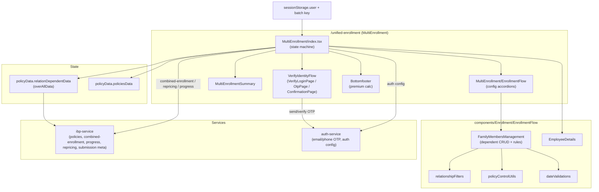
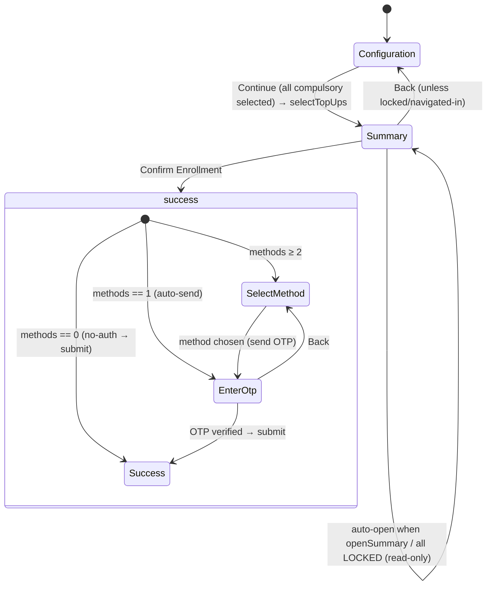
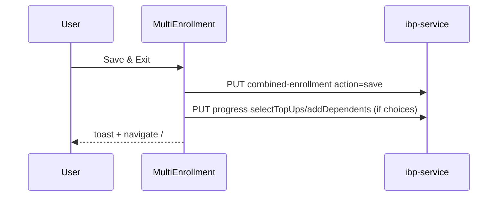

# IBP Unified Enrollment — Technical Requirements Document (TRD)

**Document Version:** 2.0  
**Date:** 2026-07-20  
**Author:** IIRM Engineering Team  
**Module:** UNIFIED-ENROLLMENT  
**PRD Reference:** [`prd.md`](prd.md)

> Reverse-engineered from production code. Documents the as-built design of a shipped, multi-thousand-line flow so developers changing it and the architect/PTL signing off share one accurate picture. Implements the [Unified Enrollment PRD](prd.md); rules referenced as `BR-UE-NNN` are defined there.

---

## 1. Architecture Overview

Unified Enrollment is a **client-only** module in the IBP employee app (`apps/ui/ibp`). It reads policy configuration, employee, and auth-config data; orchestrates a two-view state machine with an identity-verification overlay; and writes a single combined enrollment plus progress and confirmation triggers. It owns no durable server state — the source of truth is `ibp-service`.

**Two code trees, one module** (see PRD "Two code trees"):

1. **Orchestrator** — `pages/MultiEnrollment/index.tsx` (route `/unified-enrollment`). Owns the view state machine, OTP verification, combined submit, relationship-group repricing, GST/premium, and the progress pipeline. Uses components under `components/MultiEnrollment/`.
2. **Shared dependent rule engine** — `components/Enrollment/EnrollmentFlow/` (`FamilyMembersManagement`, `relationshipFilters`, `policyControlUtils`, `dateValidations`, `EmployeeDetails`). Consumed by the orchestrator, the legacy single-policy flow, and Life Events.
3. **Legacy single-policy flow** — `pages/Enrollment` (route `/enrollment`) renders the shared `EnrollmentFlow` + a static `ConfirmationPage`. No summary/OTP/combined-submit/footer/GST. Retained mainly as host of the shared engine.

### 1.1 Route & Entry Points

| Surface | Route | Component |
| --- | --- | --- |
| Unified enrollment | `/unified-enrollment` | `pages/MultiEnrollment/index.tsx` |
| Legacy single-policy | `/enrollment` | `pages/Enrollment/index.tsx` → `EnrollmentFlow` + `ConfirmationPage` |
| Confirmation → | `/dashboard` | (Dashboard) |

### 1.2 Identity & Auth

Identity from `sessionStorage.user` (`employeeId`, `employeeCompanyId`, email, phone). OTP method resolution via `useAuthConfig` (gated by `FF_MULTI_AUTH`); when off, a single `EMAIL_PASSWORD` method is used and no OTP methods are derived (no-auth submit path, BR-UE-027).

---

## 2. Scope

**In scope:** the `MultiEnrollment` orchestrator (state machine, OTP, combined save/submit, repricing, GST, progress, confirmation); the shared dependent rule engine; the legacy single-policy flow's distinct behaviors.

**Non-goals:** Dashboard (own module), Life Events (own module — shares the engine), backend implementation of the consumed endpoints (`ibp-service`, `auth-service`), policy authoring (Policy Configurations), the Endorsement/Service-Team workflow.

---

## 3. Component Diagram



---

## 4. State Model

### 4.1 View-state enums (`MultiEnrollment/index.tsx`)

- `EnrollmentStep` = `Configuration (0)` → `Summary (1)` → `success (2)` (state: `step`).
- `VerificationStep` = `SelectMethod (0)` → `EnterOtp (1)` → `Success (2)` (state: `verificationStep`), active only in the `success` view as an overlay.

### 4.2 Redux / data

- `state.policyData.relationDependentData` → `overAllData` — the primary policy/config/dependent source (constraints, choices, existing dependents).
- `state.policyData.policiesData` → flattened with `flattenPoliciesWithStatus` (actionable-policy resolution, footer stats).
- `state.policyData.loading` → `isLoading`.
- Dispatches: `fetchEmployeePolicies()`, `setToastMessage`; summary also uses `fetchCompanyTemplate`.

### 4.3 Session

- `user` — identity + email/phone for OTP.
- `enrollment_batch_key_${employeeId}` — progress batch key (from `GET enrollmentProgress`).

---

## 5. State Machine & Transitions



Transition triggers (BR-UE-001, 002, 027):

- `Configuration → Summary`: `handleContinue`, gated on `hasAllCompulsoryOptionsSelected`; marks `selectTopUps`.
- `Summary → success`: `handleStartSubmitVerification` — branches on `allowedVerificationMethods.length` (0 → direct submit; 1 → auto-send OTP; ≥2 → method picker).
- `EnterOtp → Success`: `handleVerifyOtp` → `handleSave("submit")` → `verificationStep=Success`.
- Auto-open Summary: `openSummary` route state or all-`LOCKED` → `step=Summary`, `isReadOnly`.

---

## 6. Screen-to-API Mapping

| UI action | Endpoint | Method | Purpose |
| --- | --- | --- | --- |
| Load | `employeePolicies(id)` + `getRelationDetails(id)` (thunk) | GET | policies + config/dependents |
| Load | `enrollmentProgress(id)` | GET | progress + batch key |
| OTP method resolution | `companyAuthConfigBySubdomain(subdomain)` | GET | auth methods (via `useAuthConfig`) |
| Dependent change (rel-group) | `policyConfigurationByDependents` | POST | repricing |
| Save & Exit / Submit | `updateEnrollmentData` (`/company-employee/policy/combined-enrollment`) | PUT | combined save/submit |
| Confirm (email) | `sendEmailOtp` / `verifyEmailOtp` | POST | email OTP |
| Confirm (mobile) | `sendPhoneOtp` / `verifyPhoneOtp` | POST | phone OTP |
| Submit success | `enrollmentConfirmation` | POST | confirmation mail + `receiveConfirmation` |
| Submit success | `getActivityLogs` | POST | `SUBMITTED_ENROLLMENT` activity |
| Confirmation | `latestEnrollmentSubmissionMeta(id, companyId)` | GET | ref/submission fallback |
| Progress | `updateEnrollmentProgress(id)` | PUT | step updates |

---

## 7. API Contracts (Consumed & Produced)

### 7.1 Combined enrollment (save/submit) — `PUT /company-employee/policy/combined-enrollment`

```json
{
  "employeeId": 123,
  "companyId": 45,
  "action": "save | submit",
  "dependents": [ { "id?": 1, "name": "…", "relation": "…", "relationshipType": "…", "gender": "…", "dateOfBirth": "YYYY-MM-DD", "choices": [ … ] } ],
  "combinedChoices": [ { "policyId": 9, "policyName": "…", "choices": [ { "id?": 7, "sumInsured": 500000, "premium": 0, "companyPay": 0, "employeePay": 0, "policyComponentActionTypeId": …, "policyComponentActionType": …, "parentpolicyComponentActionTypeId": …, "policyComponentActionLabel": "…" } ] } ],
  "deletedDependentIds?": [ 4 ],
  "disclaimersAccepted?": [ … ]
}
```

`combinedChoices` grouped per policy with per-component dedup (newest `updatedAt` wins), filtered to non-`LOCKED`/non-`NOTIFY` policies. `deletedDependentIds` sent only when non-empty; `disclaimersAccepted` only on submit when non-empty (BR-UE-028).

### 7.2 Relationship-group repricing — `POST /company-employee/company-employee-policy-components`

Request `{ policyId, employeeId, dependents: [{ id?, name, relation, relationshipType, dateOfBirth, gender }], isModified }`. Response carries `data.policyComponentsConfiguration` + `data.enrollmentChoicesMade`, which patch the policy in `overAllData` (BR-UE-029). Deduped by pricing key (relation/relationshipType/gender); skipped for self-only policies.

### 7.3 OTP — `auth-service`

Email: `POST /auth/email-otp/send` `{email, domain, scenario:"ENROLLMENT_VERIFICATION", passwordMethodCode}` → `/auth/email-otp/verify` `{email, otp, domain}`. Mobile: `POST /auth/phone-otp/send-phone` / `verify-phone` `{phoneNumber(+91), otp, domain, scenario, passwordMethodCode}` (BR-UE-025).

### 7.4 Progress — `PUT enrollmentProgress` `{ enrollmentBatchKey, stepName, completed }` for `reviewBenefits | selectTopUps | addDependents | submitEnrollment | receiveConfirmation` (BR-UE-030).

---

## 8. Data-Flow Sequences

### 8.1 Configuration → Summary → Submit (with OTP)

```mermaid
sequenceDiagram
    participant U as User
    participant ME as MultiEnrollment
    participant IBP as ibp-service
    participant AUTH as auth-service
    U->>ME: select components + dependents
    ME->>IBP: (rel-group) POST repricing on dependent change
    U->>ME: Continue to Summary
    ME->>IBP: PUT progress selectTopUps
    U->>ME: Confirm Enrollment
    ME->>AUTH: POST send OTP (email/phone)
    U->>ME: enter OTP
    ME->>AUTH: POST verify OTP
    AUTH-->>ME: verified
    ME->>IBP: PUT combined-enrollment action=submit
    IBP-->>ME: { referenceNumber, submissionCount }
    ME->>IBP: POST enrollmentConfirmation; PUT progress submit/receive
    ME-->>U: Confirmation (Ref Id, Submission #)
```

### 8.2 Save & Exit



---

## 9. Dependent Rule Engine (shared)

Implemented in `components/Enrollment/EnrollmentFlow/` and consumed by both flows (BR-UE-005..020, 032).

- **Eligibility** — `relationshipFilters.getEligibleRelationsFromTemplate` resolves relations per component (base/parental main vs addon, parentId `null→0` / `undefined→NaN→0`). Alias normalization: spouse/partner/wife/husband; parent/father/mother; child/son/daughter.
- **Capacity** — per-relation `maxCount`; single-select parents (father/mother/father-in-law/mother-in-law) once each; missing `maxCount` = unlimited.
- **Parent combination** — `crossParentsAllowed`, `sameGenderParentsAllowed`, male/female cover-parents / cover-in-laws gates; generic "Parent" → one Male + one Female via gender-dropdown filtering.
- **Age / DOB** — `dateValidations`: per-relation min/max age, `ageGapBetweenParentAndEmployee` / `ageGapBetweenChildrenAndEmployee`; studying-son / unmarried-daughter extensions (confirm popups). Name regex (Unicode letters, hyphen/apostrophe, 2–100, no double space). DOB masking with eye-toggle.
- **Twin/triplet** — `allowFirstChildAsTwin`, `twinsSecondChildAllowed`, `tripletsSecondChildAllowed`; `isChildDobSetValid` (distinct events ≤ base `maxCount`, each group ≤ cap); extra child DOB must match an eligible birth event; Twin/Triplet labels (`buildMultipleBirthLabels`).
- **Identity / merge** — dependent key = `tempKey || name_dob_gender`; `normalizeDobForKey` reconciles ISO vs DD/MM/YYYY; `matchesPolicySelection` (empty `choices[]` = not enrolled); cross-policy merge `mergeDependentsByPersonFuzzyDob` (±1 epoch day, id excluded from key).
- **Delete / self-exclusion** — impacted-choices modal; `canDeleteDependent` (Self deletable only for optional components); `onEmployeeExclusionChange` / `onPolicyComponentRemoval`; locked dependents read-only.
- **Callback contract** — `FamilyMembersManagement`: `onFamilyMemberChange`, `onProfileSuggestedDepDeleted`, `onEmployeeExclusionChange`, `onPolicyComponentRemoval`, `lockedDependents`, `acceptRelationsFromParent`, `isEmployeeExcluded`, per-component `policyComponentActionType*` IDs.

---

## 10. Premium & GST Implementation

- **Footer calculator** (`calculateFooterStats` → `footerStats`): plans selected, members covered (+1 self), total/company/your premium; over actionable policies; ₹ formatting.
- **GST** (`calculateEnrollmentSummary` → `enrollmentSummaryData`): `resolveGstConfig` default `{applicable:true, showToEmployee:true, rate:0.18}`; rate hardcoded 0.18; `applicable` gated by `gstApplicable !== false`, `showToEmployee` by `showGstToEmployee !== false`; employee & company GST computed separately; returns `user/company` `{base, gst, total}` (BR-UE-023).
- **Member multiplier** (`getDependentMultiplierForSelection`): ×member-count only when component `premiumPerLife` and policy GMC; Self counted when eligible relations include "self"; non-GMC per-life stays self-only (BR-UE-022).

---

## 11. Security Design

- **Identity verification** — OTP over email/phone gated by `FF_MULTI_AUTH`; verified state required before submit unless no methods are configured (no-auth path — flag/tenant-dependent; see Open Items).
- **Session** — identity + batch key in `sessionStorage`; company id taken from session, never the URL.
- **PII** — dependent DOB masked with reveal toggle; OTP delivery masks email/phone in the picker.
- **Debug** — `debugLog` gated by `window.__ENROLL_DEBUG__`; ungated `console.*` in the live path is a cleanup item (Open Items).

---

## 12. Technology Choices

React + TypeScript (`apps/ui/ibp`), MUI, Redux Toolkit (`policyData` slice + thunks), react-query, React Router. OTP via `auth-service`. The dependent engine is shared TS modules under `components/Enrollment/EnrollmentFlow/utils`.

---

## 13. Testing Strategy

- **Unit** — `isChildDobSetValid` twin/triplet caps; `relationshipFilters` eligibility + `maxCount` + parent-combination; `dateValidations` age/age-gap + extensions; `mergeDependentsByPersonFuzzyDob` ±1-day; `resolveGstConfig` gating; `getDependentMultiplierForSelection` GMC per-life.
- **Integration** — Configuration→Summary gating on compulsory selection; repricing on rel-group dependent change; combined-enrollment payload shape (save vs submit); OTP send/verify branches (0/1/≥2 methods).
- **E2E** — full submit with OTP; no-auth submit; auto-open read-only summary (LOCKED); Save & Exit; twin/triplet add; studying-son extension confirm.

---

## 14. Implementation File Locations

| Concern | File |
| --- | --- |
| Orchestrator | `apps/ui/ibp/src/app/pages/MultiEnrollment/index.tsx` |
| Config accordions | `apps/ui/ibp/src/app/components/MultiEnrollment/EnrollmentFlow/index.tsx` |
| Summary | `apps/ui/ibp/src/app/components/MultiEnrollment/MultiEnrollmentSummary/{index,utils}.tsx` |
| Verification / OTP | `apps/ui/ibp/src/app/components/MultiEnrollment/VerifyIdentityFlow/*` |
| Dependent engine | `apps/ui/ibp/src/app/components/Enrollment/EnrollmentFlow/FamilyMembersManagement.tsx` |
| Rules/utils | `…/EnrollmentFlow/utils/{relationshipFilters,policyControlUtils,dateValidations}.ts` |
| Legacy flow | `apps/ui/ibp/src/app/pages/Enrollment/index.tsx`, `components/Enrollment/{EnrollmentFlow,ConfirmationPage}` |
| Auth config | `apps/ui/ibp/src/app/hooks/useAuthConfig.ts` |

---

## 15. Open Items

Carried from the PRD Gap Register:

1. **Wrong-tree doc drift** (GAP-UE-01/02/06) — corrected here: both trees documented; confirmation ref/count and GST/footer belong to the orchestrator, not the legacy `ConfirmationPage`/`EnrollmentFlow`.
2. **Dead code** (GAP-UE-03) — commented employee-edit form in `EmployeeDetails.tsx`; `ConfirmationPage` feature-grid + orphaned styles. Remove.
3. **Ungated logs** (GAP-UE-04) — strip ungated `console.*` (keep `__ENROLL_DEBUG__`-gated `debugLog`).
4. **Parental lock-in flag** (GAP-UE-05) — confirm `FF_IBP_PARENTAL_LOCK_IN` default/permanence.
5. **Repricing failure handling** (OQ-2) — confirm whether a rel-group repricing failure hard-blocks navigation (as Life Events specifies) or currently allows stale pricing.
6. **GST rate config** (OQ-3) — 18% is hardcoded; decide whether to source from config.
7. **`FF_MULTI_AUTH` default** (OQ-4) — OTP-less submit when off; confirm production intent.
8. **Legacy `/enrollment`** (OQ-1) — decide whether to retire the legacy flow and relocate the shared engine.

---

## Approval

```
Approved by:
Role:
Date:

Approved by:
Role:
Date:
```
