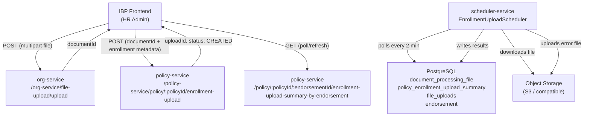
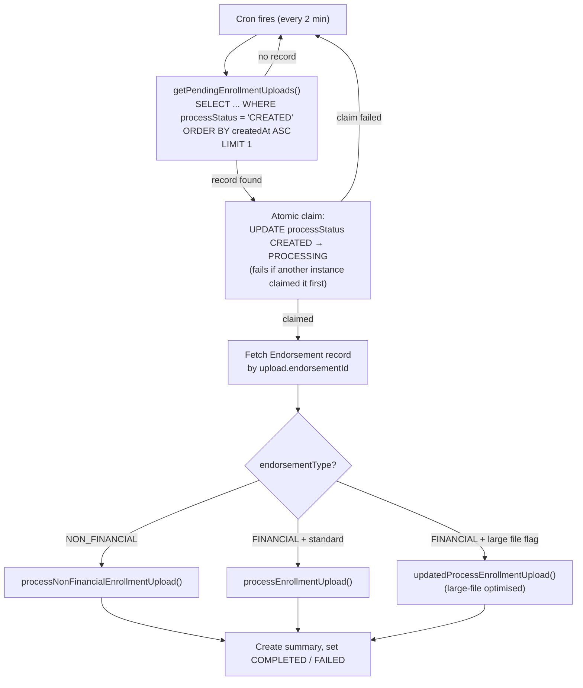
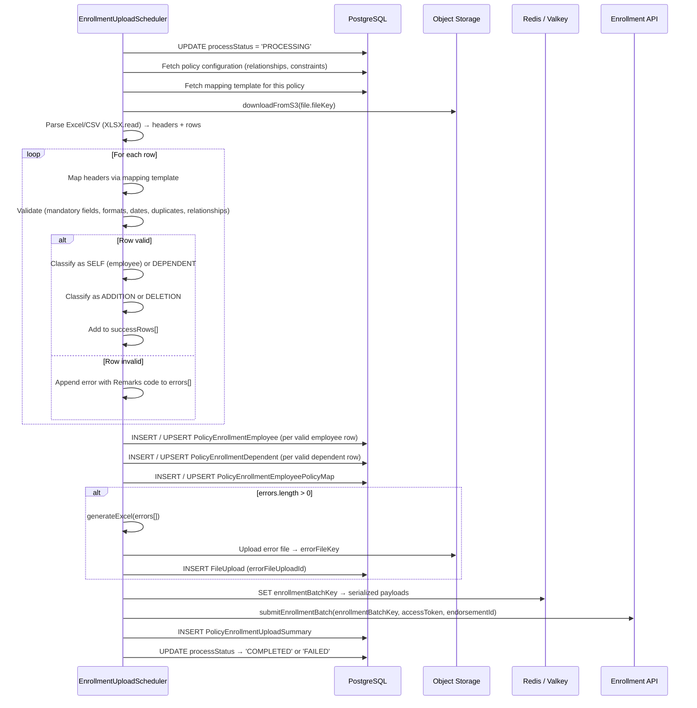
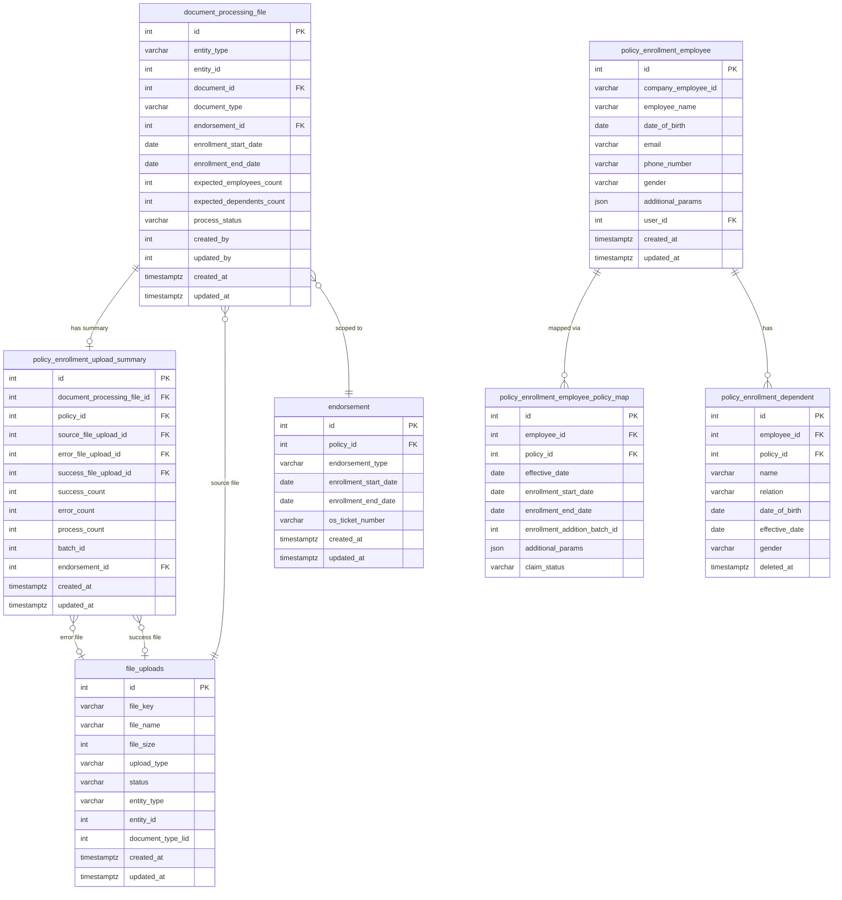
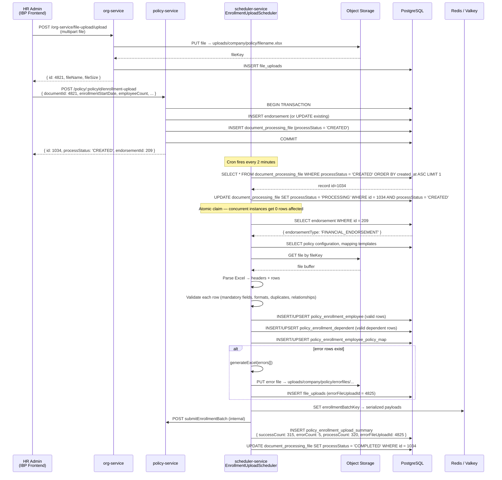
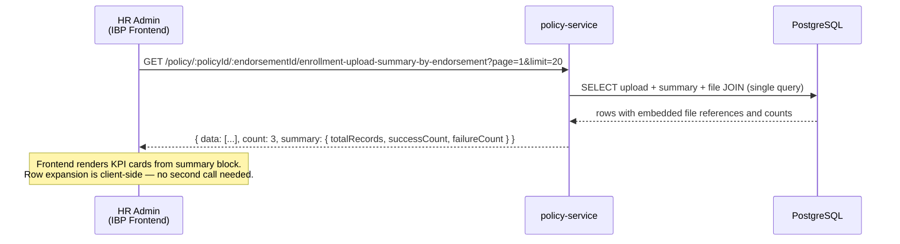

# IBP HR Portal — Endorsement Tab TRD

**Document Version:** 3.4
**Date:** 2026-08-06
**Author:** IIRM Engineering Team
**Jira Reference:** IIRM-10101
**PRD Reference:** `hr-portal-inception-endorsement-prd.md`
**SDS Reference:** `hr-portal-inception-endorsement-sds.md`
**Framework Reference:** `docs/implementation/ibp-service/hr-module-report-framework-tech-spec.md`

> **Revision note (v3.4, 2026-08-06).** Fixed two remaining bugs in `endorsement_employee_metrics`/`endorsement_list`'s Added/Deleted computation (a "still active" condition that silently netted out later, unrelated endorsements' changes, and a `deleted_at` condition that made deletion headcounts structurally unable to ever register), added `rawAddedCount`/`rawDeletedCount`/`stillActiveAddedCount` fields, fixed a `completedCount` bug in `getEndorsementStats` (`hr.repository.ts`), and — new §14 — documented CD Balance and Claims tab fixes made on the same screen this round. See §13.1, §13.4, §14.
>
> **Revision note (v3.3, 2026-08-05).** `endorsement_employee_metrics` and `endorsement_list` (§1a, §13.4) were both extended with new enrolled-only and lifetime-premium fields to support the "Policy Journey & Enrolment Summary" redesign (PRD §3.5), implemented in the Policy Summary screen's Enrolment tab (`HRPortalPolicySummary/index.tsx`). §13.4 field tables updated with the new fields.

> **Revision note (v3.2).** §13 updated to reflect Stage 50 implementation outcomes: resolved gaps marked closed; implementation deviations from original spec documented (component placement, state model, API call pattern, per-card mock data deferral). No design decisions changed; all deviations are implementation-layer choices consistent with the existing platform conventions.

> **Revision note (v3.1).** Added §1a — HR Module Report Framework section documenting how the Endorsement tab display data (overview KPIs, employee/lives metrics, premium components, endorsement list) is served via the existing `admin_reports` framework. SQL seed scripts added at `apps/services/ibp-service/src/app/hr-module/hr-module-inception-endorsement-scripts.sql`. Framework dependency note and file inventory updated accordingly.

> **Revision note (v3.0).** This version replaces v2.x, which described a hypothetical Bull queue architecture. This version documents the actual implemented flow: a two-service architecture where `policy-service` handles upload queuing and `scheduler-service` processes files via a cron-based scheduler. The data model reflects the live entities — `document_processing_file`, `policy_enrollment_upload_summary`, `file_uploads`, and the `endorsement` table as the primary organising unit.

---

## 1. Architecture Overview

The module spans two services and follows a three-phase flow:

| Phase | Service | Action |
|---|---|---|
| 1 — File Upload | `org-service` | HR Admin uploads the raw file to object storage; receives a `documentId` |
| 2 — Upload Queue | `policy-service` | HR Admin submits the enrollment upload request; a `DocumentProcessingFile` record is created in `CREATED` status |
| 3 — Processing | `scheduler-service` | `EnrollmentUploadScheduler` polls for `CREATED` records every 2 minutes, claims one, processes it, and writes the result |

There is no Bull queue. Async processing is driven entirely by the `EnrollmentUploadScheduler` cron handler. Status and results are retrieved from `policy-service` via a dedicated summary endpoint.



### 1.1 Route Inventory

| Route | Service | Method | Purpose | Auth |
|---|---|---|---|---|
| `/org-service/file-upload/upload` | org-service | POST | Upload file to object storage; returns `documentId` | `HR_ADMIN` |
| `/policy-service/policy/:policyId/enrollment-upload` | policy-service | POST | Queue enrollment upload; create `DocumentProcessingFile` | `HR_ADMIN` |
| `/policy-service/policy/:policyId/:endorsementId/enrollment-upload-summary-by-endorsement` | policy-service | GET | Fetch upload history and summary for an endorsement | `HR_ADMIN`, `HR_VIEWER` |
| `POST /hr-module/generate/endorsement_overview` | ibp-service | POST | KPI tiles — Total Endorsements + Net Gross Premium | `HR_ADMIN`, `HR_VIEWER` |
| `POST /hr-module/generate/endorsement_employee_metrics` | ibp-service | POST | 8 cumulative employee/lives metrics | `HR_ADMIN`, `HR_VIEWER` |
| `POST /hr-module/generate/endorsement_list` | ibp-service | POST | Per-endorsement accordion listing with upload counts | `HR_ADMIN`, `HR_VIEWER` |
| `POST /hr-module/generate/endorsement_premium_components` | ibp-service | POST | 10 premium component rows | `HR_ADMIN`, `HR_VIEWER` |

---

## 1a. HR Module Report Framework — Endorsement Display Data

> **Dependency Note (Framework Spec §9):** This section follows the mandatory module-level format defined in `hr-module-report-framework-tech-spec.md §9`. Any update to the framework spec must be reflected here immediately.

The Endorsement tab **display** sections (SDS §5–§8.3) — overview KPIs, cumulative employee/lives metrics, premium component table, and the per-endorsement accordion listing — are served through the same `admin_reports` framework used by the CD Management module. No new backend controller or service is required. The four report keys are seeded via the SQL script referenced below.

**Framework call pattern (same as CD Management):**

```http
POST /hr-module/generate/:reportKey
Authorization: Bearer <jwt>
Content-Type: application/json

{ "companyId": 12, "policyId": "" }
```

`companyId` is always required and is the primary scope — data is joined through the `policy` table: `INNER JOIN policy p ON p.id = e.policy_id WHERE p.company_id = ###companyId###`. `policyId` is an optional secondary filter; pass `""` (empty string) for "All Policies". This matches the exact pattern used in `hr-module-cd-scripts.sql` (`cd_transactions`) and `hr-module-scripts.sql`.

**Report keys and their display sections:**

| Report key | SDS section | Served to |
|---|---|---|
| `endorsement_overview` | §5 — Overview Block (2 stat tiles) | `EndorsementManagement` component |
| `endorsement_employee_metrics` | §6 — Employee/Lives Cumulative Metrics (8 values) | `EndorsementManagement` component |
| `endorsement_list` | §8.1–§8.3 — Endorsement Accordion (collapsed + expanded data) | `EndorsementManagement` component |
| `endorsement_premium_components` | §7 — Premium Component Table (10 rows) | `EndorsementManagement` component |

**SQL seed script:** `apps/services/ibp-service/src/app/hr-module/hr-module-inception-endorsement-scripts.sql`

**Schema notes applicable to these queries (from the seed script header):**

- `endorsement` has no `deleted_at` — no soft-delete filter needed
- `policy` has no `deleted_at` — do not add `p.deleted_at IS NULL`
- `policy_enrollment_employee_policy_map` has `deleted_at` and both `enrollment_addition_batch_id` + `enrollment_deletion_batch_id`
- `policy_enrollment_dependent` has `deleted_at` and both batch ID columns

**Premium components scaffold:** Report 4 (`endorsement_premium_components`) returns NULL amounts until the iWork premium source table is confirmed in TASK-IE-017. The 10 component keys and labels are fixed. Once TASK-IE-017 identifies the correct table, the SQL body must be updated — see the TODO comment in the seed script.

---

## 2. Phase 1 — File Upload to Object Storage

**`POST /org-service/file-upload/upload`**
**Content-Type:** `multipart/form-data`
**Auth:** JWT required; `HR_ADMIN` role

The HR Admin selects a file in the upload form. The frontend sends the raw file to the `org-service` file upload endpoint. The service stores the file in object storage and returns a `documentId` (the `FileUpload` record ID). No processing occurs at this stage.

**Response:**

```json
{
  "statusCode": 201,
  "data": {
    "id": 4821,
    "fileKey": "uploads/company/policy/members_q1.xlsx",
    "fileName": "members_q1.xlsx",
    "fileSize": 8673
  }
}
```

The `id` returned here is the `documentId` used in Phase 2.

---

## 3. Phase 2 — Enrollment Upload Queue

**`POST /policy-service/policy/:policyId/enrollment-upload`**
**Auth:** JWT required; `HR_ADMIN` role
**Controller:** `PolicyController.queueEnrollmentUpload`
**Service:** `PolicyService.createEnrollmentUpload`
**Repository:** `PolicyRepository.createEnrollmentUpload`

### 3.1 Request

| Field | Type | Required | Notes |
|---|---|---|---|
| `policyId` | number | Yes | Path parameter |
| `documentId` | number | Yes | `FileUpload.id` returned from Phase 1 |
| `documentType` | string | Yes | Document type constant — determines processing path in the scheduler |
| `enrollmentStartDate` | ISO date-time | No | Enrollment window start; stored on both `Endorsement` and `DocumentProcessingFile` |
| `enrollmentEndDate` | ISO date-time | No | Enrollment window end |
| `employeeCount` | number | No | Expected employee count entered by the HR Admin |
| `dependentCount` | number | No | Expected dependent count entered by the HR Admin |
| `endorsementId` | number | No | If provided, the upload is associated with an existing endorsement; otherwise a new endorsement is created |
| `endorsementType` | string | No | Type of endorsement (e.g., `FINANCIAL_ENDORSEMENT`); drives processing routing in the scheduler |
| `endorsementEntryDate` | ISO date | No | Endorsement entry date |
| `isInception` | boolean | No | Indicates an inception upload; stored for reference |
| `osTicketNumber` | string | No | Optional OS ticket reference |

### 3.2 Transactional Operations

The repository method runs within a database transaction:

1. If `endorsementId` is provided: fetch the existing `Endorsement` record; update `enrollmentStartDate` / `enrollmentEndDate` if they differ from the request values.
2. If no `endorsementId`: insert a new `Endorsement` row scoped to `policyId`.
3. Insert a `DocumentProcessingFile` row with `processStatus = 'CREATED'`.

The `Endorsement` record is the primary organising unit — the scheduler uses `endorsementId` to route processing, and the summary endpoint is scoped to `endorsementId`.

### 3.3 DocumentProcessingFile — Initial State

| Column | Value at creation |
|---|---|
| `entityType` | `'policy'` |
| `entityId` | `policyId` |
| `documentId` | `documentId` (FK to `file_uploads.id`) |
| `documentType` | value from request |
| `endorsementId` | ID of the created or fetched endorsement |
| `enrollmentStartDate` | from request, or `endorsement.createdAt` as fallback |
| `enrollmentEndDate` | from request, or `endorsement.createdAt + 15 days` as fallback |
| `expectedEmployeesCount` | `employeeCount` from request (default `0`) |
| `expectedDependentsCount` | `dependentCount` from request (default `0`) |
| `processStatus` | `'CREATED'` |
| `createdBy` / `updatedBy` | `userId` from JWT |

### 3.4 Response (201 Created)

```json
{
  "statusCode": 201,
  "message": "Upload queued",
  "data": {
    "id": 1034,
    "entityType": "policy",
    "entityId": 77,
    "documentId": 4821,
    "documentType": "POLICY_EMPLOYEE_ENROLLMENT_DATA",
    "endorsementId": 209,
    "enrollmentStartDate": "2026-01-01T00:00:00.000Z",
    "enrollmentEndDate": "2026-12-31T00:00:00.000Z",
    "expectedEmployeesCount": 250,
    "expectedDependentsCount": 70,
    "processStatus": "CREATED",
    "createdBy": 88,
    "createdAt": "2026-05-04T10:30:00.000Z"
  }
}
```

---

## 4. Phase 3 — Scheduler-Based Processing

### 4.1 Scheduler Overview

`EnrollmentUploadScheduler` (`scheduler-service`) is a NestJS `@Injectable()` service that implements `OnModuleInit`. It registers its handlers with `DynamicCronService` on startup, which allows cron schedules to be configured per environment.

The handler relevant to member data uploads is `handleEnrollmentUploads`, which runs on the configured cron schedule (default: **every 2 minutes**).

### 4.2 `handleEnrollmentUploads` — Entry Point



**Concurrency safety:** The `CREATED → PROCESSING` transition is performed as an atomic `UPDATE … WHERE processStatus = 'CREATED'`. If two scheduler instances fire simultaneously, only one successfully claims the record; the other gets zero rows affected and skips to the next poll cycle.

### 4.3 Standard Processing — `processEnrollmentUpload()`

Applies to financial endorsement uploads when the large-file flag is disabled. Executes six sequential phases:



### 4.4 Large-File Processing — `updatedProcessEnrollmentUpload()`

Used when the `ENABLE_LARGE_FILE_HANDLING` environment flag is true and the upload is a financial endorsement. Follows the same validation logic but introduces memory management optimisations:

- Rows are processed in **Redis buckets** (max 50 records per bucket) rather than held entirely in memory
- Explicit garbage-collection pauses between phases
- Reduced concurrency limit for database writes (`PHASE3_CONCURRENCY_LIMIT = 15`)
- Seven explicit processing phases with status checkpoints
- Terminal status is the same: `COMPLETED` or `FAILED`

### 4.5 Non-Financial Processing — `processNonFinancialEnrollmentUpload()`

Used for non-financial endorsement types. Applies the same file parsing, row validation, and record-writing logic. Does not submit to the enrollment batch API after processing. Summary and status update logic is identical.

### 4.6 Status Transitions

`DocumentProcessingFile.processStatus` progresses through the following states:

| State | Set by | Meaning |
|---|---|---|
| `CREATED` | Phase 2 API (policy-service) | Upload queued; waiting for scheduler pickup |
| `PROCESSING` | Scheduler — atomic claim | Scheduler has claimed this record and is actively processing |
| `COMPLETED` | Scheduler — end of processing | File was parsed and records were written; row-level errors may exist but are reported in the summary |
| `FAILED` | Scheduler — on unrecoverable error | File could not be processed (e.g., download failure, unparseable file, unhandled exception) |

`COMPLETED` is the success outcome even when some rows produced errors — per PRD BR-MDU-005, partial success with row-level errors is `COMPLETED`, not `FAILED`.

### 4.7 Error Tracking

Row-level errors are not stored as individual database records. Instead:

1. All failing rows (with a `Remarks` field containing the error code/message) are accumulated in an in-memory `errors[]` array during processing.
2. When processing completes, if `errors.length > 0`, an Excel error file is generated (`generateExcel(errors[])`) and uploaded to S3 at `uploads/company/{entityType}/errorfiles/policy-{policyId}-errorfile{timestamp}.xlsx`.
3. A `FileUpload` record is created for the error file.
4. The `PolicyEnrollmentUploadSummary` record stores the `errorFileUploadId` linking to this file.

HR Admins can download the error file to see which rows failed and why.

---

## 5. Status and Summary Endpoint

**`GET /policy-service/policy/:policyId/:endorsementId/enrollment-upload-summary-by-endorsement`**
**Auth:** JWT required; `HR_ADMIN` or `HR_VIEWER`
**Controller:** `PolicyController.listEnrollmentUploadSummaryForEndorsement`

### 5.1 Query Parameters

| Parameter | Type | Default | Notes |
|---|---|---|---|
| `page` | number | 1 | Pagination page |
| `limit` | number | 10 | Results per page |
| `usePolicyAssetEndorsement` | string | — | If truthy, joins against `PolicyAssetEndorsement` instead of `Endorsement` |
| `tpaData` | string | — | If truthy, returns only TPA ID upload records; otherwise excludes them |

### 5.2 Response

```json
{
  "statusCode": 200,
  "data": {
    "data": [
      {
        "id": 88,
        "documentProcessingFileId": 1034,
        "policyId": 77,
        "sourceFileUploadId": 4821,
        "errorFileUploadId": 4825,
        "successFileUploadId": null,
        "successCount": 315,
        "errorCount": 5,
        "processCount": 320,
        "batchId": 1034,
        "documentProcessingFile": {
          "id": 1034,
          "entityType": "policy",
          "entityId": 77,
          "documentType": "POLICY_EMPLOYEE_ENROLLMENT_DATA",
          "enrollmentStartDate": "2026-01-01",
          "enrollmentEndDate": "2026-12-31",
          "processStatus": "COMPLETED",
          "updatedAt": "2026-05-04T10:32:11.000Z"
        },
        "sourceFile": {
          "id": 4821,
          "fileName": "members_q1.xlsx",
          "fileSize": 8673
        },
        "errorFile": {
          "id": 4825,
          "fileName": "policy-77-errorfile1746351131000.xlsx",
          "fileSize": 3104
        },
        "successFile": null,
        "createdAt": "2026-05-04T10:30:00.000Z"
      }
    ],
    "count": 3,
    "summary": {
      "totalRecords": 320,
      "successCount": 315,
      "failureCount": 5
    }
  }
}
```

The `summary` block at the top level aggregates across all uploads for the endorsement. The `data` array lists individual upload records, each with embedded source/error/success file references. No secondary API call is required to expand a record.

### 5.3 Query Structure

```sql
SELECT
  upload.id,
  upload.entity_type,
  upload.entity_id,
  upload.document_type,
  upload.enrollment_start_date,
  upload.enrollment_end_date,
  upload.expected_employees_count,
  upload.expected_dependents_count,
  upload.process_status,
  upload.updated_at,
  summary.id                        AS summary_id,
  summary.source_file_upload_id,
  summary.error_file_upload_id,
  summary.success_file_upload_id,
  summary.success_count,
  summary.error_count,
  summary.process_count,
  summary.batch_id,
  sourceFile.file_name              AS source_file_name,
  sourceFile.file_size              AS source_file_size,
  errorFile.file_name               AS error_file_name,
  errorFile.file_size               AS error_file_size,
  successFile.file_name             AS success_file_name,
  successFile.file_size             AS success_file_size
FROM document_processing_file upload
INNER JOIN endorsement e
  ON e.id = upload.endorsement_id
  AND e.policy_id = :policyId
LEFT JOIN policy_enrollment_upload_summary summary
  ON summary.document_processing_file_id = upload.id
LEFT JOIN file_uploads sourceFile
  ON sourceFile.id = upload.document_id
LEFT JOIN file_uploads errorFile
  ON errorFile.id = summary.error_file_upload_id
LEFT JOIN file_uploads successFile
  ON successFile.id = summary.success_file_upload_id
WHERE upload.entity_type = 'policy'
  AND upload.entity_id = :policyId
  AND upload.endorsement_id = :endorsementId
  AND upload.document_type != 'POLICY_TPA_ID_UPLOAD'
  AND upload.document_type != 'POLICY_ENDORSEMENT_CREATION'
ORDER BY sourceFile.created_at DESC
LIMIT :limit OFFSET :offset;
```

---

## 6. Data Model



**`document_processing_file.process_status` values:** `CREATED | PROCESSING | COMPLETED | FAILED`

**Required indexes:**

| Table | Index | Purpose |
|---|---|---|
| `document_processing_file` | `(process_status, document_type, created_at ASC)` | Scheduler poll for pending records |
| `document_processing_file` | `(entity_id, endorsement_id)` | Summary endpoint lookup |
| `policy_enrollment_upload_summary` | `(document_processing_file_id)` | Join from upload to summary |
| `policy_enrollment_employee_policy_map` | `(policy_id)` | Duplicate detection during processing |

---

## 7. Data Flow — Sequence Diagrams

### 7.1 Complete Upload and Processing Flow



### 7.2 Summary Retrieval (Frontend Refresh)



---

## 8. Security Design

| Concern | Design |
|---|---|
| Authentication | All endpoints require a valid JWT from the IBP auth service |
| Company isolation | `companyId` is embedded in JWT; policy ownership is verified before any write via `SELECT policy WHERE id = :policyId AND company_id = :jwtCompanyId` |
| Role enforcement | File upload (org-service) and enrollment queue (policy-service POST): `HR_ADMIN` only. Summary read: `HR_ADMIN` or `HR_VIEWER` |
| Endorsement scoping | Summary endpoint verifies `endorsement.policy_id = :policyId` via INNER JOIN — cross-endorsement or cross-policy access returns no rows |
| Object storage isolation | File paths are namespaced by company and policy: `uploads/company/{entityType}/policy-{policyId}-*` |
| Error file access | Error files are accessed via the `FileUpload.id` returned in the summary; the serving endpoint applies the same policy-scoping check |
| Audit trail | `document_processing_file.created_by` stores the JWT `userId`; `created_at` is system-set; not accepted from the caller |

---

## 9. Technology Choices

| Choice | Justification | Alternative considered |
|---|---|---|
| Cron-based scheduler (NestJS `@Cron` / `DynamicCronService`) | Consistent with the existing platform async processing pattern. Cron schedule is configurable per environment without redeployment. Retries are implicit — if the scheduler instance restarts, `PROCESSING` records left in a stuck state can be reclaimed by an explicit cleanup job. | Bull queue (Redis-backed): adds an external dependency; the cron pattern already handles concurrency via the atomic `CREATED → PROCESSING` claim |
| Two-step upload (org-service file upload → policy-service enrollment queue) | Separates file storage concerns from domain logic. `org-service` owns file management; `policy-service` owns policy domain state. | Single combined endpoint: would violate service boundary and require `policy-service` to handle raw multipart uploads |
| Error materialized as Excel file (S3) | Errors may involve hundreds of rows. Storing them as an Excel file is directly consumable by HR Admins and avoids a large-row error table that needs separate querying. | `member_upload_errors` table (row-per-error): requires an additional endpoint and pagination for large error sets; Excel download is simpler for the HR Admin |
| `endorsement` as organising unit | Uploads are grouped under endorsements to match the iWork domain model. The summary endpoint is scoped to `endorsementId`, which reflects the business concept of a batch of changes to a policy. | Direct policy-level grouping: loses the endorsement context needed for downstream iWork integration |
| Redis / Valkey for enrollment batch payloads | Decouples the processing worker from the downstream enrollment submission API. Payloads can be large (hundreds of employees); storing them in Redis allows the scheduler to hand off asynchronously without blocking on the enrollment API response. | Synchronous inline submission: ties the scheduler's transaction to the downstream API availability |

---

## 10. NFR Design

| Requirement | Design decision |
|---|---|
| Upload API < 3 seconds | Phase 1 (file upload) writes to object storage and returns `documentId`. Phase 2 (enrollment queue) performs a single transaction (INSERT endorsement + INSERT document_processing_file) and returns immediately. No file parsing in the HTTP path. |
| Processing < 2 minutes for 5,000 rows | Scheduler processes rows in batches with DB transactions batched at 100 rows. Sub-plan tier and mapping template lookups are loaded once per job and cached in memory. Large-file mode uses Redis buckets to avoid OOM. |
| History load < 2 seconds | Single SQL query with INNER JOIN on indexed `(entity_id, endorsement_id)` and LEFT JOINs to embedded summary and file records. No N+1 per row. |
| Detail expand — no extra API call | All error and success file references are embedded in each summary row. Frontend expands client-side from the already-loaded payload. |
| Concurrency safety | The `CREATED → PROCESSING` transition is an atomic `UPDATE … WHERE processStatus = 'CREATED'`. Multiple scheduler instances cannot claim the same record. |
| File retention | Object storage has no lifecycle deletion rule. Files persist until a deliberate admin action. |
| Idempotency | Employee and dependent records are written with UPSERT on `(company_employee_id, policy_id)`. A restarted scheduler job re-processes the same rows without creating duplicates. |

---

## 11. Testing Strategy

| Layer | Coverage target |
|---|---|
| Unit — validation logic | All row-level validation rules; boundary values (DOB edge dates, 10/9-digit mobile, case variations, duplicate employee IDs within file) |
| Unit — `EnrollmentUploadScheduler` | Status transitions (`CREATED → PROCESSING → COMPLETED`, `FAILED`); atomic claim behaviour (concurrent claim attempt returns null); error file generation path (errors present / errors absent) |
| Unit — `PolicyRepository.createEnrollmentUpload` | New endorsement created when `endorsementId` absent; existing endorsement updated when provided; `processStatus = 'CREATED'` on all code paths |
| Integration — Full upload pipeline | POST file upload → POST enrollment queue → wait for scheduler → verify `document_processing_file.processStatus = 'COMPLETED'` and `policy_enrollment_upload_summary` record created |
| Integration — Summary endpoint | Seeded dataset with multiple uploads across statuses; verify JOIN aggregation, file references, `summary` block counts |
| E2E — Happy path | Upload 50-row valid file; poll summary endpoint until `processStatus = 'COMPLETED'`; verify `successCount = 50`, `errorCount = 0`, no error file |
| E2E — Partial failure | Upload file with 20% invalid rows; verify `processStatus = 'COMPLETED'`, `errorCount > 0`, error file downloadable |
| E2E — Multiple uploads | Submit 3 files for the same endorsement; verify all 3 appear in summary response ordered by date |
| Security | Attempt to read summary for a `policyId` belonging to a different company; expect 200 with empty `data` (INNER JOIN on `endorsement.policy_id` yields no rows) |

---

## 12. Open Questions

| # | Question | Owner |
|---|---|---|
| OQ-01 | When the scheduler restarts while a record is in `PROCESSING` state (e.g., pod crash mid-job), the record stays stuck in `PROCESSING` indefinitely. Is there a cleanup job that resets stale `PROCESSING` records back to `CREATED` after a timeout? | Platform / DevOps |
| OQ-02 | The current summary endpoint groups uploads by `endorsementId`. The SDS KPI cards (Total Records, Success, Failed) show cumulative counts across all uploads for a policy — not just one endorsement. Is there a policy-level aggregation endpoint, or should the frontend sum across endorsements? | Product / Frontend |
| OQ-03 | Should individual row-level errors be downloadable as a structured report (JSON or CSV with row numbers), or is the generated Excel error file sufficient? If structured export is required, an additional endpoint is needed. | Product Manager |
| OQ-04 | The `successFile` in `PolicyEnrollmentUploadSummary` is always `null` in current code (success file generation is disabled). Is success file generation a planned feature, or can the column be dropped? | Engineering Lead |
| OQ-05 | Does the IBP HR Portal frontend call `org-service` directly for file upload, or does the call route through a BFF/gateway? The security model differs — if `org-service` is called directly, it must independently verify company scope. | Frontend / Platform |
| OQ-06 | The `dataType` concept from the SDS (dropdown: "Employee Data Only" vs "Employee + Dependents Data") maps to the `endorsementType` + policy template `relationship` flag. Is there a need for an explicit `dataType` field in the API, or is the existing routing (via `documentType` and `endorsementType`) sufficient? | Product / Engineering |

---

## 13. Known Implementation Gaps and Stage 50 Deviations

### 13.1 Resolved Gaps (as of 2026-05-05 Stage 50)

| Gap | Resolution |
|---|---|
| Upload form not implemented (SDS §8.4) | ✅ Implemented as `EndorsementUploadSection` component in `HRPortalEnrolmentV2/index.tsx`. Covers all form fields, file upload, template download, error display. |
| Uploaded files table not implemented (SDS §8.5) | ✅ Implemented inside `EndorsementUploadSection`. 7-column table with status chips, polling, refresh button, download links, and empty state. |
| Display data hardcoded | ✅ `EndorsementManagement` now calls all four `admin_reports` POST endpoints on mount. Mock data is used only as fallback when the API returns no data (for backward compatibility during DB seed lag). |
| KPI aggregation scope | ✅ Confirmed: overview KPIs (`endorsement_overview`) and premium table (`endorsement_premium_components`) are served by the framework report. Upload-summary endpoint remains scoped to `endorsementId`. |
| `getEndorsementStats` counted deleted/not-started employees as "completed" (v3.4) | `hr.repository.ts`'s `getEndorsementStats` computed "completed" as `employee_enrollment_status_key != 'IN_PROGRESS'` (folding `NOT_STARTED` in) and separately added `deletionCompleted` directly into the same total — so `employeeCompletedCount` (which feeds the accordion's "Enrolment completed" tile and, since v3.4's classification fix above, the "Enrolled" pill too) could count a deleted or not-yet-started employee as having completed enrolment. Confirmed live on a real endorsement: 1 genuinely enrolled + 1 not-started employee both counted as "completed," showing 2 when only 1 had actually enrolled. | ✅ Resolved (v3.4) — "completed" now strictly requires `employee_enrollment_status_key = 'EMPLOYEE_ENROLLMENT_STATUS_ENROLLED'`; `deletionCompleted` is no longer added into the completed total (still correctly subtracted out of `notStartedCount`, unchanged). Same fix mirrored in the dependent-side query. **Flagged, not fixed:** the dependent-side query also has an outer `dep.deleted_at IS NULL` filter that may exclude deleted dependents from the query entirely (not just miscount them) if dependent deletion sets `deleted_at` the same way employee deletion does — unverified against a real deleted-dependent row. |

### 13.2 Ongoing Gaps

| Gap | Detail | Resolution path |
|---|---|---|
| Premium components source unknown | `endorsement_premium_components` SQL returns NULL amounts until the iWork premium source table is identified (OQ-07 / TASK-IE-017). | Engineering Lead to identify source table in TASK-IE-017; seed script updated accordingly. |
| Per-card employee and premium snapshot data | The expanded endorsement card employee info snapshot and premium component snapshot (SDS §8.2–§8.3) still render from static constants (`ENDORSEMENT_EMPLOYEE_SUMMARY`, `ENDORSEMENT_PREMIUM_ROWS`). A per-endorsement drill-down API is required. | TASK-IE-017 to deliver a dedicated endpoint or extend `endorsement_list` to include per-card detail. |
| `endorsementStatus` / Step 2 lock field | The `endorsement_list` SQL query returns `COALESCE(e.status, '')` as `endorsementStatus`. The column name `e.status` on the `endorsement` table is assumed but not confirmed from the live schema. The frontend checks if this value is in `['COMPLETED', 'LOCKED', 'APPROVED', 'FINALIZED']` to disable upload inside individual cards. | Confirm the exact column name and the set of "Step 2 completed" status values with the iWork team before production. Update the SQL seed script accordingly. |
| `policyId` for new endorsement top-level form | The top-level New Endorsement upload form derives `policyId` from the first item in the loaded `endorsement_list`. If the list is empty, `policyId` is null and upload buttons are disabled. | A dedicated policy selector within the top-level form would remove this dependency. Track as a future enhancement. |
| Stale `PROCESSING` records | No cleanup job exists to reset records stuck in `PROCESSING` after a pod crash (OQ-01). | Platform / DevOps must implement a timeout-based reset job before production. |
| Success file column always null | `PolicyEnrollmentUploadSummary.success_file_upload_id` is always `null`. The column exists but is never populated. | OQ-04: engineering lead must decide whether to drop the column or document it as planned future work. |

### 13.3 Stage 50 Implementation Deviations

The following document where the implementation diverges from what the TRD v3.1 implicitly assumed. No design decisions were changed; these are all implementation-layer choices.

| Deviation | What TRD implied | What was implemented | Impact |
|---|---|---|---|
| `EndorsementUploadSection` placement | Would naturally be a sibling component file | Implemented inline in `HRPortalEnrolmentV2/index.tsx` to keep all Endorsement-tab logic co-located. Consistent with `EndorsementManagement` and other tab sections already in that file. | None — internal structure only. |
| API call pattern for admin_reports | TRD §13 (v3.1 gap note) mentioned `useApiQuery` for wire-up | All four hr-module report calls use `useEffect` + `apiRequest` with `method: "POST"`. `useApiQuery` is a GET wrapper and cannot be used for these POST endpoints. Pattern matches `HRPortalFinance` exactly. | None — correct pattern for POST endpoints. |
| `expandedCard` state is index-based | Not specified | `useState<number>(-1)` tracking the accordion row index (-1 = none). `endorsementId` and `policyId` are derived from `accordionItems[expandedCard]` when needed. Sufficient for the current single-expand model. | If multi-expand is required later, refactor to `Set<number>` of indices or `Set<number>` of endorsementIds. |
| `policyId` for upload section | Not specified in original TRD | Sourced from `item.policyId` in each `endorsement_list` row (camelCase field aliased in the SQL seed script). Falls back to `null` for mock-data fallback rows. `EndorsementUploadSection` skips Phase 2 API call if `policyId` is null. | None — policyId is present in real API data. |
| `ibpEndorsementDocTypeMap` — IBP-local copy | Not specified | An IBP-local `ibpEndorsementDocTypeMap` constant was created in `index.tsx`, mapping the two UI data type strings to `download` and `process` endpoint functions via `endPoints.*`. It mirrors iWork's `endorsementDocTypeMap` structure but is not imported from iWork (cross-service import not possible). | Must be kept in sync with iWork's map when new document types are added. |
| Upload table initial state | Not specified | `useState<UploadRow[]>([])` — starts empty and fills from the real API on card expand. No mock initial state. | None — correct behavior per SDS §8.5. |
| `companyId` resolution | `getCompanyId()` (reads `company_id` sessionStorage key) | `getCompanyId()` is used, matching the pattern in `HRPortalFinance`. In HR Admin portal sessions where `company_id` is not populated, the four display API calls are skipped (guard: `if (!companyId) return`). This is handled by the login session providing the correct key. | If `company_id` key is absent after login, fall back to `JSON.parse(sessionStorage.getItem('user') || '{}').companyId`. |

### 13.4 API Field Names — Confirmed from SQL Seed Script

These camelCase aliases are established in the SQL seed script and are the authoritative field names the frontend must use.

**`endorsement_overview` response row:**

| Field | Type |
|---|---|
| `netGrossPremium` | numeric |
| `totalEndorsements` | integer |

**`endorsement_employee_metrics` response row:**

| Field | Type | Notes |
|---|---|---|
| `employeesAtInception` | integer | Roster event, lifetime — not enrolment-status filtered. **v3.4:** no longer requires the person to still be un-deleted at query time — see lifetime-tally note below. |
| `employeesInAddition` | integer | Roster event, lifetime. **v3.4:** same lifetime-tally fix as `employeesAtInception`. |
| `employeesInDeletion` | integer | Roster event, lifetime (unchanged — see PRD §3.2 scoping rule). **v3.4:** dropped an `AND pepm.deleted_at IS NULL` condition that made this structurally unable to ever be nonzero — the deletion process sets `deleted_at` on the roster mapping row as part of performing the deletion, so requiring it to be NULL excluded every real deletion. `enrollment_deletion_batch_id` alone is now the sole signal. |
| `activeEmployees` | integer | Strictly `employee_enrollment_status_key = 'EMPLOYEE_ENROLLMENT_STATUS_ENROLLED'`, policy-wide, not batch-scoped |
| `livesAtInception` | integer | |
| `livesInAddition` | integer | |
| `livesInDeletion` | integer | |
| `activeLives` | integer | `activeEmployees + activeDependents` (enrolled-only, policy-wide) |
| `activePremium` *(new, v3.2)* | numeric | `SUM(policy_employee_enrollment.total_premium)` for the same enrolled population as `activeEmployees`, policy-wide. Labelled "Enrolled Premium" on screen. |
| `totalEligible` *(new, v3.2; recomputed, v3.4)* | integer | **v3.4:** now a direct `COUNT(DISTINCT ...)` of the policy's current roster (not-yet-deleted employees), not an arithmetic rollup of the three fields above. Mathematically equivalent when all three inputs are trustworthy, but can no longer drift out of sync with reality if one of them is stale — which was happening in practice before the lifetime-tally fix above. |
| `premiumAtInception` *(new, v3.2)* | numeric | `policy.premium_at_inception` — **not** `endorsement.net_premium`, which is frequently `NULL` on the inception row itself |
| `additionPremium` *(new, v3.2)* | numeric | `SUM(endorsement.net_premium)` across all lifetime addition-type endorsements (`is_inception = false AND net_premium > 0`) — no date-window filter |
| `deletionPremium` *(new, v3.2)* | numeric | `SUM(ABS(endorsement.net_premium))` across all lifetime deletion-type endorsements — extends the pre-existing `deletion_counts` CTE (same WHERE clause as `employeesInDeletion`), no new CTE needed |
| `totalPremium` *(new, v3.2)* | numeric | `GREATEST(premiumAtInception + additionPremium - deletionPremium, 0)` |
| `enrolledOfEligiblePercent` *(new, v3.2)* | numeric (1 decimal) | `ROUND(activeEmployees * 100.0 / totalEligible, 1)` |
| `premiumCoveragePercent` *(new, v3.2)* | numeric (1 decimal) | `ROUND(activePremium * 100.0 / totalPremium, 1)` |

**Lifetime-tally mechanism (v3.4).** `employeesInAddition`/`employeesInDeletion` previously classified an endorsement as an "addition batch" or "deletion batch" by `endorsement.net_premium`'s sign (`> 0` / `< 0`) — fragile, since `net_premium` can be `NULL` (not yet computed — a freshly-created endorsement sits at status `ENDORSEMENT_REQUEST_RECEIVED` with `net_premium`/`endorsment_count` both unpopulated) or genuinely `0`. Confirmed live: a real endorsement that added 4 employees had `net_premium = NULL`, `endorsment_count = 0`, and `endorsement_type = 'FINANCIAL_ENDORSEMENT'` (not `'ADDITION'`) — so it was invisible to every premium-sign-based or type-string-based check in the codebase simultaneously. Fixed by not classifying by premium at all: a new `non_inception_endorsements` CTE gathers every non-inception endorsement regardless of premium, and `policy_enrollment_employee_policy_map`/`policy_enrollment_dependent` — which already record, per person, which batch/endorsement added them (`enrollment_addition_batch_id` / `addition_endorsement_id`) and which removed them (`enrollment_deletion_batch_id` / `deletion_endorsement_id`) — decide addition vs. deletion directly. Same pattern applied to `endorsement_list`'s new `rawAddedCount`/`rawDeletedCount` (below), scoped to one endorsement instead of the whole policy.

**`endorsement_list` response rows (one per endorsement):**

| Field | Type | Notes |
|---|---|---|
| `endorsementId` | integer | |
| `policyId` | integer | |
| `policyNumber` | string | |
| `endorsementType` | string (`INCEPTION` / `ADDITION` / `DELETION` / `CORRECTION`) | |
| `enrollmentStartDate` | date | |
| `enrollmentEndDate` | date | |
| `createdAt` | timestamptz | |
| `osTicketNumber` | string | |
| `endorsementStatus` | string — empty string until iWork status column confirmed; values `COMPLETED`/`LOCKED`/`APPROVED`/`FINALIZED` disable upload in card | |
| `uploadCount` | integer | |
| `totalSuccessCount` | integer | |
| `totalErrorCount` | integer | |
| `totalProcessCount` | integer | |
| `netPremium` / `grossPremium` / `taxAmount` / `netGrossPremium` *(behavior changed, v3.2)* | numeric | For addition/inception rows (`is_inception = true OR net_premium > 0`): **enrolled-only** — `SUM(policy_employee_enrollment.total_premium)` for employees added by *this specific endorsement's batch* who are currently Enrolled (gross/tax derived by applying the batch's own gross-to-net ratio). For deletion rows and rows with no premium impact: the endorsement's own raw `net_premium`/`gross_premium`/`gst_amount` column, with **no policy-level fallback** (a `NULL` here now renders as "—", not the policy's total — see PRD §13 for the bug this closed). |
| `rawNetPremium` / `rawGrossPremium` *(new, v3.2)* | numeric | The raw value `netPremium`/`grossPremium` held **before** the v3.2 enrolled-only change — i.e. `endorsement.net_premium`/`gross_premium` directly, with a `policy.premium_at_inception` fallback for the inception row specifically (mirrors `premiumAtInception` above). Added so consumers needing the raw batch premium (e.g. the Policy Journey summary card) don't have to re-derive it, while `netPremium` itself stays enrolled-only for the per-endorsement accordion badge. |
| `endorsmentCount` / `endorsmentDependentCount` *(behavior changed, v3.2)* | integer | Same enrolled-only-for-addition/inception, raw-for-deletion split as `netPremium` above, using `enrolled.enrolled_employee_count`/`enrolled_dependent_count` from the same per-batch `LEFT JOIN LATERAL`. |
| `rawAddedCount` *(new, v3.4)* | integer | This endorsement's own real addition headcount — direct join against `policy_enrollment_employee_policy_map` via `enrollment_addition_batch_id`, never gated on `net_premium`/`is_inception`/enrolment status. A lifetime, permanent fact (no "still active" condition — see lifetime-tally mechanism note above). Powers the accordion's "Additions" row and, combined with `endorsementType`, whether the "Enrolled"/"Enrolled Premium" pill renders at all. |
| `rawDeletedCount` *(new, v3.4)* | integer | Same mechanism as `rawAddedCount`, via `enrollment_deletion_batch_id`. Powers the accordion's "Deletions" row and "Exited" pill, replacing the stale stored `employee_endorsement_deletion_count` column those previously read. |
| `stillActiveAddedCount` *(new, v3.4)* | integer | The currently-active subset of this same batch — i.e. the *old*, pre-v3.4 definition of `rawAddedCount` (requires `deleted_at IS NULL AND enrollment_deletion_batch_id IS NULL`). Not used for the Additions figure itself; the frontend diffs it against `rawAddedCount` to detect "N of these were later removed via a different endorsement" and render an inline disclaimer instead of a silent, unexplained mismatch (PRD §3.2 disclaimer rule). |

**Scope note (v3.2):** `endorsement_list` continues to be filtered to `current_period_endorsements` (enrolment window open right now) — this was already true before v3.2 and is unchanged. What changed is that **`endorsement_employee_metrics`' new `additionPremium`/`deletionPremium` fields are lifetime, not window-scoped** — consumers that need a *lifetime* Added/Deleted premium figure (like the Policy Journey card) must read it from `endorsement_employee_metrics`, not sum it from `endorsement_list` rows, or they will silently under-count whenever no enrolment window is currently open.

**`endorsement_premium_components` response row:**

| Field | Notes |
|---|---|
| `basePremium`, `taxAmount`, `grossPremium`, `additionPremium`, `deletionPremium`, `correctionAdditionPremium`, `correctionDeletionPremium`, `netPremium`, `netTaxAmount`, `netGrossPremium` | All return NULL until TASK-IE-017 confirms the iWork source table. |

**File inventory:**

| Artefact | Path | Status |
|---|---|---|
| Report controller | `apps/services/ibp-service/src/app/hr/report.controller.ts` | Pre-existing |
| Report service | `apps/services/ibp-service/src/app/hr/hr-report.service.ts` | Pre-existing |
| `AdminReport` entity | `apps/services/ibp-service/src/app/hr/entities/admin-report.entity.ts` | Pre-existing |
| SQL seed script — Endorsement display reports | `apps/services/ibp-service/src/app/hr-module/hr-module-inception-endorsement-scripts.sql` | ✅ Created |
| `Endorsement` entity | `apps/services/ibp-service/src/app/policy/entities/endorsement.entity.ts` (confirm path) | Pre-existing |
| `DocumentProcessingFile` entity | `apps/services/ibp-service/src/app/policy/entities/document-processing-file.entity.ts` (confirm path) | Pre-existing |
| `PolicyEnrollmentUploadSummary` entity | `apps/services/ibp-service/src/app/policy/entities/policy-enrollment-upload-summary.entity.ts` (confirm path) | Pre-existing |
| Frontend — Policy Summary Enrolment tab (v3.2 "Policy Journey & Enrolment Summary") | `apps/ui/ibp/src/app/pages/HRPortalPolicySummary/index.tsx` | ✅ Updated (v3.2, 2026-08-05); further updated v3.4 (lifetime-tally, disclaimer banner, `rawDeletedCount` wiring) |
| `getEndorsementStats` | `apps/services/ibp-service/src/app/hr-module/hr.repository.ts` | ✅ Updated (v3.4) — `completedCount` fix, §13.1 |
| Consolidated admin_reports migration (all fixes, this module + §14) | `database-migrations/sql/hr-policy-summary-enrolled-only-fix.sql` | ✅ Updated (v3.4) — single file, run once, idempotent (guarded, safe to re-run) |

---

## 14. CD Balance and Claims Tab Fixes (v3.4, 2026-08-06)

> **Scope exception.** Same screen (`HRPortalPolicySummary/index.tsx`), different tabs (CD Balance, Claims) — outside §1's Endorsement-tab boundary. Recorded here per explicit product request; see PRD §14 for the product-level framing of the same fixes. `admin_reports` IDs below refer to the same instance documented in §1a.

| admin_reports id | Report name | Bug | Fix |
|---|---|---|---|
| 46 | `cd_transactions` | Scoped by `caution_deposit.company_id` — denormalized, can drift from the policy's real `company_id` (confirmed: one CD account's stored `company_id` disagreed with every policy mapped to it). Returned zero transactions for a policy that had real ones. | `WHERE COALESCE(p.company_id, cd.company_id) = ###companyId###` — prefers the policy's own live `company_id` (already joined via `LEFT JOIN policy p ON p.id = cdt.policy_id`), falls back to the CD account's stored value only for the transactions with no linked policy at all (~3.3% of rows). |
| 33 | `linked_policies_of_cd_account` | Same root cause as id=46: `input_cd_accounts` CTE required `cd.company_id = ###companyId###`. | `INNER JOIN policy p0 ON p0.id = cdpm.policy_id ... AND p0.company_id = ###companyId###` — verifies company ownership through the requested policy itself, not the CD account's stored column. The final SELECT's own `p.company_id = ###companyId###` re-check on every returned linked policy is unchanged (no isolation weakened). |
| 18 | `upcoming_installments` | Query never selected `policyId`/`policyNumber` at all, despite the frontend's `UpcomingInstallmentRow` type declaring them (always `undefined` at runtime). Rendered as a blank "Policy:" label. | Not a SQL fix — this report is already filtered to one `policyId`, so a per-row policy field is redundant. Frontend now reads the page's own `policyRow.policyNumber` instead; the two now-fictional fields were removed from `UpcomingInstallmentRow`. |
| 31 | `policy_claim_history` | `claimStatus` filter did `LOWER(c.claim_status) = LOWER(###claimStatus###)` — exact match against the UI's 4 labels, but `claim_status` holds 16+ distinct free-text raw values. "Approved"/"Rejected" matched zero rows. | Replaced with `OR`-chained `ILIKE` keyword buckets per label (see full bucket mapping in the migration file). 4 ambiguous raw values (Cancelled, Under Rejection Approval, Outstanding, Bank details awaited) are flagged inline for product confirmation. |
| 31 | `policy_claim_history` | `approvedAmount` was `COALESCE(ls.settled_amount, 0)` — `latest_settlement` only has a row once a claim is paid, so an approved-but-unpaid claim showed ₹0. | `COALESCE(c.clm_allowed_amt, ls.settled_amount, 0)` — `policy_claim.clm_allowed_amt` is populated from the TPA sync's `APPROVED_AMOUNT` field independent of settlement (`tpa-claims-parser.scheduler.ts:250,283`). |
| 22 | `dashboard_policy_cards` | `claims_relevant` CTE (the base every claim/ICR figure is built from) had no `claim_status` filter — a fully denied/rejected/cancelled claim counted its full amount toward ICR as if paid. Confirmed on a real policy: ICR dropped from 30.1% to 26.0% once excluded. | Added `AND NOT (c.claim_status ILIKE '%denied%' OR ILIKE '%rejection%' OR ILIKE '%cancelled%')` to `claims_relevant` — same bucket keywords as the id=31 status fix, for consistency. Pending/approved/settled claims unaffected. |
| 31 | `policy_claim_history` | "Claim TAT Overview" KPI cards (frontend, `claimTatCards` in `HRPortalPolicySummary/index.tsx`) classified rows with a separate rule from the Claim Search table's server-side filter — `row.status === "Ready For Payment"` / `"Claim Denied"` / `"Settled"`, else "Pending" — an exact match against the `INITCAP`'d display string. Confirmed on a real policy: TAT card showed Pending=88 / Rejected=0, Claim Search showed 42 for the same filter; the 46-claim gap was raw status "DENIED" (`INITCAP` → "Denied", not "Claim Denied"), silently absorbed into the Pending catch-all. | New `"statusBucket"` field added to the SELECT (see §14.1 for the mapping and CASE expression) — one server-side classification, computed once. Frontend's `claimTatCards` now filters on `row.statusBucket` instead of re-deriving buckets from `row.status`; `ClaimHistoryRow.statusBucket?: string` added to the type (no per-row mapping function exists for this hook — the API row is consumed directly, so no second edit site to keep in sync). |

### 14.1 `statusBucket` — Mapping and SQL (Pending Product Approval)

Added directly after the existing `"status"` column in `policy_claim_history`'s SELECT:

```sql
CASE
  WHEN c.claim_status ILIKE '%settled%' THEN 'Settled'
  WHEN c.claim_status ILIKE '%denied%' OR c.claim_status ILIKE '%rejection%' OR c.claim_status ILIKE '%cancelled%' THEN 'Rejected'
  WHEN c.claim_status ILIKE '%ready for payment%' OR c.claim_status ILIKE '%payment initiated%' OR c.claim_status ILIKE '%bank details%' THEN 'Approved'
  ELSE 'Pending'
END AS "statusBucket"
```

Same keyword set as the `###claimStatus###` filter condition (this same report, added when that filter was fixed) — kept identical on purpose so a claim's bucket membership can never disagree between "which chip is it under when filtered" and "which bucket does the KPI card count it in." `ELSE 'Pending'` is a deliberate catch-all: an unrecognized future raw value defaults to "still unresolved" rather than being silently miscounted as a final outcome.

| UI Bucket | Raw `claim_status` values matched |
|---|---|
| **Settled** | SETTLED, Settled |
| **Approved** | Ready for payment, READY FOR PAYMENT, Payment Initiated, PAYMENT INITIATED, Bank details awaited |
| **Rejected** | Claim denied, DENIED, CLAIM DENIED, Cancelled, Under Rejection Approval, UNDER REJECTION APPROVAL |
| **Pending** | PENDING, Under Process, UNDER PROCESS, CLAIM BILLS PENDING, Claim Bills Pending, Deficiency, "Claim Intimation " (trailing space in source data), RAL Intimation, RAL Deficiency, OUTSTANDING |

Checked for cross-bucket collisions: all 16 distinct raw values seen in production match exactly one `WHEN` branch — none matches more than one bucket's keywords, so results can't double-count across chips/cards.

**Awaiting product sign-off (see PRD §14.1 for the same list at product level) — 4 raw values assigned by judgment call, not an unambiguous mapping:**

| Raw value | Bucketed as | Alternative reading | To change |
|---|---|---|---|
| Cancelled | Rejected | Could be its own "Withdrawn" bucket, distinct from insurer-denied. | Move `'%cancelled%'` out of the `Rejected` `WHEN` branch into a new one. |
| Under Rejection Approval | Rejected | Outcome isn't finalized yet — could read as Pending. | Move `'%rejection%'` (or a more specific `'%under rejection%'` keyword, to avoid also catching a hypothetical future "Rejection Confirmed" value) into the `Pending` branch. |
| Outstanding | Pending | Could mean "payment amount outstanding" — Approved-adjacent. | Move `'%outstanding%'` into the `Approved` branch. |
| Bank details awaited | Approved | Could read as still Pending — no payment has happened yet. | Move `'%bank details%'` into the `Pending` branch. |

Any of these changes is a one-line move of a keyword between `WHEN` branches in the CASE expression above — no other query, entity, or frontend change required.

**Investigated, not a bug:** reports filtered only by `policyId` with no `companyId` cross-check (`upcoming_installments`, `dashboard_claims_monthly_trend`, `dashboard_top10_hospitals`, `dashboard_top10_diseases`, `policy_claim_history`) were initially flagged as a possible cross-tenant gap. Confirmed this is not a bug specific to these reports: `policy.id` is a primary key and fully determines the policy (and its one `company_id`) regardless of what `companyId` value is also passed, so a single-`policyId` request returns correct data with or without a redundant cross-check. The controller (`hr.controller.ts`'s `generate/:report` endpoint) also has no policy↔company authorization guard at all — if that is ever a real concern, it needs a systemic guard on the endpoint, not a per-query patch to five of many reports sharing this same generic framework.

**Cache note:** `HrService.generateReport`'s `reportMetaCache` holds each report's `query` text in memory for up to 5 minutes per report name (`hr.service.ts`, `REPORT_META_TTL_MS`) so that a migration takes effect without a service restart — but for up to 5 minutes after running the migration, the running process will still serve the old query. Restart the service to see a fix immediately instead of waiting.

---

## 15. Approval

Leave blank. TL/PTL sign-off authority. Required before Stage 50 (implementation) begins.

```
Approved by:
Role:
Date:

Approved by:
Role:
Date:
```

---

# END OF TRD
