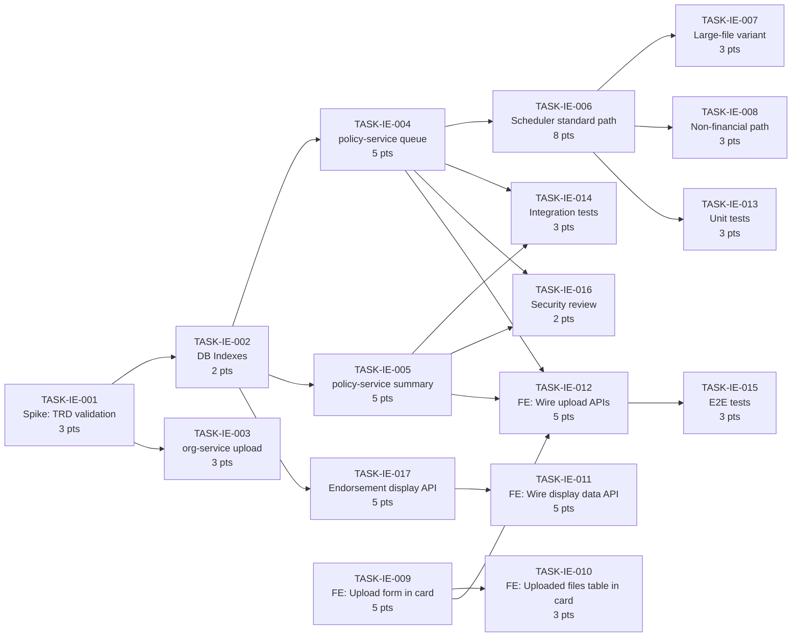

# IBP HR Portal — Endorsement Tab: Task Breakdown

**Module:** `inception-endorsement`
**Epic:** Endorsement Tab — IBP HR Portal
**TRD Reference:** [hr-portal-inception-endorsement-trd.md](hr-portal-inception-endorsement-trd.md)
**PRD Reference:** [hr-portal-inception-endorsement-prd.md](hr-portal-inception-endorsement-prd.md)
**SDS Reference:** [hr-portal-inception-endorsement-sds.md](hr-portal-inception-endorsement-sds.md)
**Jira Reference:** IIRM-10101
**Date:** 2026-05-05
**Author:** Daksh Delivery Lead (auto-generated via /daksh task)

> This document breaks the spec into executable tasks for one sprint squad. Every task carries a decision budget so that the engineer picking it up cold at 11pm knows what to resolve independently and what to escalate. Backend tasks drive sequencing; frontend tasks that depend on API contracts are flagged with their blocking dependency. Both tracks can start in Sprint 1; API integration tasks wait on Phase 2 being deployed.

---

## What Is Already Done

| Area | Status | Location |
|---|---|---|
| `HRPortalEnrolmentV2` page + route + tab switcher | Done | `apps/ui/ibp/src/app/pages/HRPortalEnrolmentV2/index.tsx` routed at `/hr-portal/enrollment` |
| `EndorsementManagement` component — visual structure | Done (mock data) | Same file, `function EndorsementManagement()` |
| Overview block — Net Gross Premium + Total Endorsements | Done (hardcoded) | Inline in `EndorsementManagement`, `["₹2.36 Cr", "#16A34A"]` and `["5", "#111827"]` |
| Employee/lives metrics grid (8 metrics) | Done (hardcoded) | `const endorsementSummary` — all values `"1250"` |
| Premium information table (10 rows) | Done (hardcoded) | `const premiumRows` — 9 rows + 1 Net Gross hardcoded row rendered separately |
| Individual Endorsements accordion — collapsed + expanded | Done (hardcoded) | `const INDIVIDUAL_ENDORSEMENTS` — 4 items; `expandedCard` state (index-based); expanded shows `ENDORSEMENT_EMPLOYEE_SUMMARY` (4 metrics) + `ENDORSEMENT_PREMIUM_ROWS` (5 rows) + illustration image |
| Upload form inside expanded endorsement card | **Not built** | — |
| Uploaded files table inside expanded endorsement card | **Not built** | — |
| All backend APIs (file upload, queue, summary, scheduler) | **Not built** | — |

---

## Integration Pattern

All API calls use `apiRequest` from `@ui/ui-lib` and endpoint URLs from `apps/ui/ui-lib/src/lib/constants/endPoints.ts`. `companyId` is read from session:

```ts
const { companyId } = JSON.parse(sessionStorage.getItem('user') || '{}');
```

**These are the same APIs used in iWork's `EndorsementDataUploadPage` and `PolicyEmployeeDataTab`. Use the same endpoint functions — do not invent new ones.**

**Step 1 — File upload (same as iWork):**
```ts
// Build multipart form data exactly as iWork does it
const formData = new FormData();
formData.append('file', file);
formData.append('companyType', 'policy');
formData.append('companyId', String(policyId));
formData.append('documentTypeLid', documentTypeId); // lookup ID for DOCUMENT_TYPE_POLICY_DOCUMENT

const uploadResult = await apiRequest(endPoints.fileUpload, {
  method: 'POST',
  data: formData,
});
const documentId = uploadResult?.data?.id || uploadResult?.data?.[0]?.id;
```

**Step 2 — Queue upload (same as iWork):**
```ts
// endorsementDocTypeMap maps docType key → { download(policyId), process(policyId) }
// "Employee Data Only"         → docType = "policy_employee_data"
// "Employee + Dependents Data" → docType = "policy_employee_enrollment_data"
const resp = await apiRequest(
  endorsementDocTypeMap[docType].process(policyId),
  {
    method: HTTP_METHODS.POST,
    data: {
      documentId,
      documentType: docType,
      employeeCount: Number(noOfEmployees),
      dependentCount: Number(noOfDependents),
      enrollmentStartDate,
      enrollmentEndDate,
      endorsementId,          // from the individual endorsement card
      // isInception: true/undefined — set based on endorsement type (see OQ-04)
    }
  }
);
const newEndorsementId = typeof resp?.data === 'number'
  ? resp?.data
  : resp?.data?.endorsementId;
```

**Download template (same as iWork — two-step):**
```ts
// Step 1: fetch template metadata
const tmpl = await apiRequest(
  endorsementDocTypeMap[docType].download(policyId),
  { method: HTTP_METHODS.GET }
);
const documentId = tmpl?.data?.documentId;
const fallbackFileName = tmpl?.data?.fileName || 'template.xlsx';
const fileUrl = tmpl?.data?.url;

// If direct URL returned: use it
if (fileUrl) {
  const a = document.createElement('a');
  a.href = fileUrl; a.download = fallbackFileName;
  document.body.appendChild(a); a.click(); document.body.removeChild(a);
  return;
}

// Otherwise: download blob via file service
const moduleKey = 'endorsement'; // or 'inception' based on endorsement type
const blobResp = await apiRequest(
  `${endPoints.fileUploadDownload}/${documentId}/download?moduleKey=${encodeURIComponent(moduleKey)}`,
  { method: HTTP_METHODS.GET, responseType: 'blob' }
);
const blob = blobResp.data as Blob;
// check for HTML error page: blob.type.includes('text/html') && textCheck.includes('<html')
// extract filename from content-disposition header or use fallbackFileName
// create object URL → click → revoke
```

**Uploaded files summary (same endpoint as iWork):**
```ts
// Poll this after each upload and on Refresh button click
const summary = await apiRequest(
  `${endPoints.policyEnrollmentSummaryByEndorsement(policyId, endorsementId)}`,
  { method: HTTP_METHODS.GET }
);
// rows at summary?.data?.data[]   count at summary?.data?.count
// each row: { id, submittedAt, originalFileName, totalCount, successCount,
//             errorCount, processStatus, sourceFile, errorFile }
```

**Endorsement display API (TASK-IE-017 — endpoint TBD):**
```ts
// Endpoint to be specified in TASK-IE-017 and registered in endPoints.ts
const endorsementData = await apiRequest(
  endPoints.endorsementSummary(companyId),
  { method: HTTP_METHODS.GET }
);
// overview: endorsementData?.data?.netGrossPremium, totalEndorsements
// metrics:  endorsementData?.data?.employeeMetrics  (8 fields)
// premium:  endorsementData?.data?.premiumComponents (10 fields)
// list:     endorsementData?.data?.endorsements[]
```

**Reference files in iWork (read these before implementing TASK-IE-012):**
- `apps/ui/iwork/src/app/pages/EndorsementPage/EndorsementDataUpload/EndorsementDataUploadPage.tsx` — full upload + download template logic
- `apps/ui/iwork/src/app/components/PolicyEmployeeDataTab/index.tsx` — uploaded files table pattern
- `apps/ui/iwork/src/app/pages/EndorsementPage/utils/endorsementDocTypeMap.ts` — docType → endpoint mapping

**Note on `endPoints.ts`:** `endPoints.fileUpload`, `endPoints.fileUploadDownload`, `endPoints.policyEnrollmentUpload(policyId)`, and `endPoints.policyEnrollmentSummaryByEndorsement(policyId, endorsementId)` must all exist in the IBP portal's `apps/ui/ui-lib/src/lib/constants/endPoints.ts`. Grep for each before TASK-IE-012 begins; add any that are missing.

---

---

## Task Summary Table

The table below is the sprint-planning view. One row per task; use it to assign and sequence.

| ID | Type | Summary | Pts | Sprint | Role | Depends on |
|---|---|---|---|---|---|---|
| TASK-IE-001 | Spike | Validate live codebase state against TRD v3.0 | 3 | 1 | Senior | — |
| TASK-IE-002 | Task | Create missing DB indexes per [TRD §6](trd.md#6-data-model) | 2 | 1 | Mid | TASK-IE-001 |
| TASK-IE-003 | Story | Verify/harden org-service file upload endpoint | 3 | 1 | Mid | TASK-IE-001 |
| TASK-IE-004 | Story | Implement policy-service enrollment upload queue endpoint | 5 | 1 | Senior | TASK-IE-002 |
| TASK-IE-005 | Story | Implement policy-service enrollment-upload-summary endpoint | 5 | 1 | Senior | TASK-IE-002 |
| TASK-IE-006 | Story | Implement scheduler standard financial processing path | 8 | 1–2 | Senior | TASK-IE-004 |
| TASK-IE-007 | Sub-task | Large-file processing variant (Redis bucket mode) | 3 | 2 | Mid | TASK-IE-006 |
| TASK-IE-008 | Sub-task | Non-financial endorsement processing path | 3 | 2 | Mid | TASK-IE-006 |
| TASK-IE-009 | Story | Frontend — Add upload form inside individual endorsement expanded card (SDS §8.4) | 5 | 1 | Mid | — |
| TASK-IE-010 | Sub-task | Frontend — Uploaded files table inside individual endorsement expanded card (SDS §8.5) | 3 | 1–2 | Mid | TASK-IE-009 |
| TASK-IE-011 | Story | Frontend — Wire endorsement display data (SDS §5–§7) to real API | 5 | 2 | Mid | TASK-IE-017 |
| TASK-IE-012 | Task | Frontend — Wire upload form and files table to real upload + summary APIs | 5 | 2 | Mid | TASK-IE-004, TASK-IE-005, TASK-IE-009 |
| TASK-IE-017 | Story | Backend — Endorsement display API: summary metrics + per-endorsement list endpoint | 5 | 1–2 | Senior | TASK-IE-002 |
| TASK-IE-013 | Task | Unit tests — validation logic and scheduler state machine | 3 | 2 | Mid | TASK-IE-006 |
| TASK-IE-014 | Task | Integration tests — full upload pipeline | 3 | 2 | Mid | TASK-IE-006, TASK-IE-005 |
| TASK-IE-015 | Task | E2E tests — happy path, partial failure, security | 3 | 2 | Mid | TASK-IE-012 |
| TASK-IE-016 | Task | Security review — endpoint auth and company scoping | 2 | 2 | Senior | TASK-IE-004, TASK-IE-005 |

**Total story points:** 70 across 2 sprints. Split between frontend (23 pts) and backend (47 pts). TASK-IE-017 added 2026-05-05 to cover the endorsement display API that was previously missing from the backend scope.

---

## Dependency Graph

Tasks flow left to right. Parallel tracks are shown side by side. Backend (B) and frontend (F) tracks run independently until API integration in Sprint 2.



---

## Detailed Task List

---

#### TASK-IE-001: Spike — Validate live codebase state against TRD v3.0

- **Type:** Spike
- **Parent:** Epic — Member Data Upload
- **Epic:** Member Data Upload — IBP HR Portal
- **Sprint:** Sprint 1
- **Points:** 3
- **Assignee:** Senior
- **Assigned to:** —
- **Traces to:** All user stories — this spike unblocks accurate sizing for all dependent tasks
- **Depends on:** None
- **Description:** The TRD v3.0 documents a specific architecture (two-service, cron-scheduler, no Bull queue) but was written as a "what it should be" document, not a "what has shipped" document. Before implementation begins, a senior engineer must audit `policy-service`, `org-service`, and `scheduler-service` to confirm which endpoints, entities, and scheduler handlers exist in the live codebase. The output is a written gap list filed as a comment on this ticket. Timebox: 1 day.
- **Decision budget:**
  - Junior can decide: which files to read, how to structure the gap list
  - Escalate to TL/PTL: any finding that contradicts the data model in [TRD §6](trd.md#6-data-model) (missing columns, renamed tables, different status enum values)
- **Acceptance criteria:**
  - [ ] Gap list written covering: routes (exist / missing), entities (columns match / differ), scheduler handlers (registered / absent), indexes (present / missing)
  - [ ] Gap list reviewed by TL and attached to this ticket before Sprint 1 planning closes
  - [ ] Any entity naming differences from [TRD §6](trd.md#6-data-model) are flagged for resolution in TASK-IE-002 or TASK-IE-004
- **Definition of Done:**
  - [ ] Jira ticket updated to Done
  - [ ] Gap list document posted as ticket comment
  - [ ] TL sign-off comment on the ticket

---

#### TASK-IE-002: Create missing DB indexes per TRD §6

- **Type:** Task
- **Parent:** Epic — Member Data Upload
- **Epic:** Member Data Upload — IBP HR Portal
- **Sprint:** Sprint 1
- **Points:** 2
- **Assignee:** Mid
- **Assigned to:** —
- **Traces to:** [US-MDU-03](prd.md#6-user-stories) (history load < 2 seconds NFR)
- **Depends on:** TASK-IE-001 (gap list confirms which indexes are missing)
- **Description:** [TRD §6](trd.md#6-data-model) specifies four required indexes. Create a database migration that adds any missing indexes. Run the migration against a staging database and verify with `EXPLAIN ANALYZE` that the summary endpoint query ([TRD §5.3](trd.md#53-query-structure)) uses the index on `(entity_id, endorsement_id)`.

  Required indexes:
  | Table | Index |
  |---|---|
  | `document_processing_file` | `(process_status, document_type, created_at ASC)` |
  | `document_processing_file` | `(entity_id, endorsement_id)` |
  | `policy_enrollment_upload_summary` | `(document_processing_file_id)` |
  | `policy_enrollment_employee_policy_map` | `(policy_id)` |

- **Decision budget:**
  - Junior can decide: migration naming convention, whether to use `CREATE INDEX CONCURRENTLY` (always prefer this on a live table)
  - Escalate to TL/PTL: if any index conflicts with an existing unique constraint, or if `EXPLAIN ANALYZE` shows a seq scan despite the index
- **Acceptance criteria:**
  - [ ] Migration file created in the correct service migration directory
  - [ ] All four indexes exist in staging after `migrate:run`
  - [ ] `EXPLAIN ANALYZE` on the summary endpoint query shows index scan on `document_processing_file`
  - [ ] Rollback migration (`migrate:revert`) tested and confirmed
- **Definition of Done:**
  - [ ] Jira ticket updated to Done
  - [ ] Tests passing per testing strategy in TRD
  - [ ] PR reviewed and merged to module branch

---

#### TASK-IE-003: Verify and harden org-service file upload endpoint

- **Type:** Story
- **Parent:** Epic — Member Data Upload
- **Epic:** Member Data Upload — IBP HR Portal
- **Sprint:** Sprint 1
- **Points:** 3
- **Assignee:** Mid
- **Assigned to:** —
- **Traces to:** [US-MDU-01](prd.md#6-user-stories)
- **Depends on:** TASK-IE-001 (spike confirms endpoint exists and its current contract)
- **Description:** `POST /org-service/file-upload/upload` ([TRD §2](trd.md#2-phase-1--file-upload-to-object-storage)) is the first phase of the upload pipeline. This task verifies that the endpoint exists, accepts multipart file uploads, stores files in object storage, and returns the `documentId` format the frontend expects. If the endpoint exists but does not enforce the `HR_ADMIN` role guard, add it. If file-level validation (10 MB cap, accepted MIME types) is not present, add it. Do not redesign the endpoint — harden what exists.
- **Decision budget:**
  - Junior can decide: which MIME types to allow (`application/vnd.openxmlformats-officedocument.spreadsheetml.sheet` for xlsx, `text/csv` for csv), how to write the guard decorator
  - Escalate to TL/PTL: if the endpoint is absent entirely (requires architecture decision), if the object storage path format differs from `uploads/company/policy/filename` (may require S3 policy update)
- **Acceptance criteria:**
  - [ ] `POST /org-service/file-upload/upload` accepts `.xlsx` and `.csv` only; rejects other types with HTTP 415
  - [ ] Files larger than 10 MB are rejected with HTTP 413 before reaching the storage layer
  - [ ] Endpoint requires `HR_ADMIN` JWT role; returns HTTP 403 for other roles
  - [ ] Response body matches [TRD §2](trd.md#2-phase-1--file-upload-to-object-storage) shape: `{ statusCode: 201, data: { id, fileKey, fileName, fileSize } }`
  - [ ] `fileKey` path is namespaced by company/policy: `uploads/company/{entityType}/...`
- **Definition of Done:**
  - [ ] Jira ticket updated to Done
  - [ ] Tests passing per [TRD §11](trd.md#11-testing-strategy)
  - [ ] PR reviewed and merged to module branch

---

#### TASK-IE-004: Implement policy-service enrollment upload queue endpoint

- **Type:** Story
- **Parent:** Epic — Member Data Upload
- **Epic:** Member Data Upload — IBP HR Portal
- **Sprint:** Sprint 1
- **Points:** 5
- **Assignee:** Senior
- **Assigned to:** —
- **Traces to:** [US-MDU-01](prd.md#6-user-stories)
- **Depends on:** TASK-IE-002 (indexes must exist before writing to `document_processing_file`)
- **Description:** Implement `POST /policy-service/policy/:policyId/enrollment-upload` per [TRD §3](trd.md#3-phase-2--enrollment-upload-queue). The controller delegates to `PolicyService.createEnrollmentUpload`, which delegates to `PolicyRepository.createEnrollmentUpload`. The repository runs a database transaction: (1) create or update an `Endorsement` record, (2) insert a `DocumentProcessingFile` record with `processStatus = 'CREATED'`. All column initial values are specified in [TRD §3.3](trd.md#33-documentprocessingfile--initial-state). The `endorsementId` in the response is the organising unit for the scheduler and the summary endpoint — it must be correct.
- **Decision budget:**
  - Junior can decide: DTO validation decorators (use `class-validator`), fallback date logic (`enrollmentEndDate = endorsement.createdAt + 15 days` when not provided)
  - Escalate to TL/PTL: if `Endorsement` entity is shared with iWork and adding columns may break iWork flows; if the transaction isolation level needs to be non-default; if `endorsementType` enum values differ from what iWork expects
- **Acceptance criteria:**
  - [ ] `POST /policy-service/policy/:policyId/enrollment-upload` returns HTTP 201 with the shape in [TRD §3.4](trd.md#34-response-201-created)
  - [ ] When `endorsementId` is absent: new `Endorsement` row is created scoped to `policyId`
  - [ ] When `endorsementId` is present: existing `Endorsement` row is updated if start/end dates differ
  - [ ] `DocumentProcessingFile.processStatus` is `'CREATED'` in all code paths
  - [ ] `createdBy` / `updatedBy` come from JWT `userId`, not from the request body
  - [ ] Company isolation enforced: `policyId` ownership verified via `policy.company_id = jwtCompanyId`; returns HTTP 404 for foreign policy
  - [ ] `HR_ADMIN` role required; HTTP 403 for other roles
  - [ ] Transaction rolls back cleanly if either INSERT fails
- **Definition of Done:**
  - [ ] Jira ticket updated to Done
  - [ ] Unit test: new endorsement created when `endorsementId` absent
  - [ ] Unit test: existing endorsement updated when `endorsementId` provided
  - [ ] Unit test: `processStatus = 'CREATED'` on all code paths
  - [ ] PR reviewed and merged to module branch

---

#### TASK-IE-005: Implement policy-service enrollment-upload-summary endpoint

- **Type:** Story
- **Parent:** Epic — Member Data Upload
- **Epic:** Member Data Upload — IBP HR Portal
- **Sprint:** Sprint 1
- **Points:** 5
- **Assignee:** Senior
- **Assigned to:** —
- **Traces to:** [US-MDU-02](prd.md#6-user-stories), [US-MDU-03](prd.md#6-user-stories), [US-MDU-04](prd.md#6-user-stories)
- **Depends on:** TASK-IE-002 (indexes required for < 2 second query target)
- **Description:** Implement `GET /policy-service/policy/:policyId/:endorsementId/enrollment-upload-summary-by-endorsement` per [TRD §5](trd.md#5-status-and-summary-endpoint). The controller is `PolicyController.listEnrollmentUploadSummaryForEndorsement`. The query ([TRD §5.3](trd.md#53-query-structure)) is a single SQL join — no N+1 queries. The response embeds source/error/success file references and includes a top-level `summary` block aggregating `totalRecords`, `successCount`, and `failureCount` across all uploads for the endorsement. The frontend uses this block to render the KPI cards without a second API call — the embed contract is load-bearing.
- **Decision budget:**
  - Junior can decide: pagination defaults (`page=1, limit=10`), null handling for missing file references (return `null` not omit the key)
  - Escalate to TL/PTL: the `usePolicyAssetEndorsement` query param behaviour (join target changes — confirm with product if IBP needs this path); if `summary` block aggregation should be across the endorsement or the whole policy (see [TRD OQ-02](trd.md#12-open-questions))
- **Acceptance criteria:**
  - [ ] Returns HTTP 200 with shape matching [TRD §5.2](trd.md#52-response)
  - [ ] `summary.totalRecords` = sum of `process_count` across all uploads for this endorsement
  - [ ] `summary.successCount` = sum of `success_count`; `summary.failureCount` = sum of `error_count`
  - [ ] Each row in `data[]` embeds `sourceFile`, `errorFile`, `successFile` references (null when absent — never omitted)
  - [ ] `HR_ADMIN` and `HR_VIEWER` roles allowed; HTTP 403 for other roles
  - [ ] Cross-policy access: endorsement scoped to different policy returns empty `data: []`, not HTTP 403
  - [ ] Query completes in < 2 seconds on staging with 1000 upload records (verified with `EXPLAIN ANALYZE`)
- **Definition of Done:**
  - [ ] Jira ticket updated to Done
  - [ ] Integration test: seeded dataset with multiple uploads across statuses; verify JOIN aggregation and `summary` block counts
  - [ ] PR reviewed and merged to module branch

---

#### TASK-IE-006: Implement scheduler standard financial processing path

- **Type:** Story
- **Parent:** Epic — Member Data Upload
- **Epic:** Member Data Upload — IBP HR Portal
- **Sprint:** Sprint 1–2
- **Points:** 8
- **Assignee:** Senior
- **Assigned to:** —
- **Traces to:** [US-MDU-01](prd.md#6-user-stories), [US-MDU-02](prd.md#6-user-stories)
- **Depends on:** TASK-IE-004 (scheduler polls `document_processing_file` records created by the queue endpoint)
- **Description:** Implement the `handleEnrollmentUploads` entry point and `processEnrollmentUpload()` processing path in `EnrollmentUploadScheduler` (`scheduler-service`) per [TRD §4](trd.md#4-phase-3--scheduler-based-processing). This is the largest backend task and covers: (1) poll for `CREATED` records; (2) atomic `CREATED → PROCESSING` claim; (3) fetch endorsement record and route to the correct handler; (4) download file from S3; (5) parse Excel/CSV; (6) per-row validation against the policy mapping template; (7) classify rows as employee/dependent and addition/deletion; (8) UPSERT `PolicyEnrollmentEmployee`, `PolicyEnrollmentDependent`, `PolicyEnrollmentEmployeePolicyMap`; (9) generate and upload error Excel if errors exist; (10) push batch to Redis; (11) call `submitEnrollmentBatch`; (12) insert `PolicyEnrollmentUploadSummary`; (13) set `COMPLETED` or `FAILED`. The flow is diagrammed in [TRD §4.3](trd.md#43-standard-processing--processenrollmentupload). This task covers only the standard financial path (`ENABLE_LARGE_FILE_HANDLING = false`). Large-file and non-financial paths are sub-tasks TASK-IE-007 and TASK-IE-008.

  > This task scores 8 points. If spike findings (TASK-IE-001) reveal that the scheduler exists in a partial state, split into two tickets before Sprint 1 closes.

- **Decision budget:**
  - Junior can decide: Redis key naming convention for `enrollmentBatchKey`, error Excel column layout (match existing error file format in the codebase), concurrency limit for DB writes
  - Escalate to TL/PTL: `COMPLETED` vs `FAILED` boundary decision (per [PRD BR-MDU-005](prd.md#5-business-rules): partial success with row errors = `COMPLETED`; only unrecoverable file-level errors = `FAILED`); behavior when `submitEnrollmentBatch` returns a non-2xx (retry vs fail the job); how to handle stale `PROCESSING` records (see [TRD OQ-01](trd.md#12-open-questions))
- **Acceptance criteria:**
  - [ ] `handleEnrollmentUploads` runs every 2 minutes via `DynamicCronService`
  - [ ] Atomic claim: concurrent scheduler instances cannot claim the same record (`UPDATE … WHERE processStatus = 'CREATED'` returns 0 rows for the second instance)
  - [ ] Endorsement routing: `FINANCIAL_ENDORSEMENT` → `processEnrollmentUpload()`; `NON_FINANCIAL` → `processNonFinancialEnrollmentUpload()` (stub for TASK-IE-008)
  - [ ] All row-level validation rules from [PRD §3.5](prd.md#35-validation-rules) are applied; invalid rows skipped; valid rows committed
  - [ ] UPSERT on `(company_employee_id, policy_id)` — restarted job does not create duplicate records
  - [ ] Error Excel generated and uploaded to S3 when `errors.length > 0`; `errorFileUploadId` populated in summary
  - [ ] `PolicyEnrollmentUploadSummary` inserted with correct `successCount`, `errorCount`, `processCount`
  - [ ] `processStatus` transitions: `CREATED → PROCESSING → COMPLETED` (success or partial); `CREATED → PROCESSING → FAILED` (unrecoverable error only)
- **Definition of Done:**
  - [ ] Jira ticket updated to Done
  - [ ] Unit tests: status transitions; atomic claim behaviour; error file generation path
  - [ ] Integration test: POST upload → wait for scheduler → verify `COMPLETED` and summary created
  - [ ] PR reviewed and merged to module branch

---

#### TASK-IE-007: Large-file processing variant (Redis bucket mode)

- **Type:** Sub-task
- **Parent:** TASK-IE-006
- **Epic:** Member Data Upload — IBP HR Portal
- **Sprint:** Sprint 2
- **Points:** 3
- **Assignee:** Mid
- **Assigned to:** —
- **Traces to:** [US-MDU-01](prd.md#6-user-stories)
- **Depends on:** TASK-IE-006 (standard path must be complete and tested first)
- **Description:** Implement `updatedProcessEnrollmentUpload()` for the large-file code path per [TRD §4.4](trd.md#44-large-file-processing--updatedprocessenrollmentupload). This variant activates when `ENABLE_LARGE_FILE_HANDLING = true` and the upload is a financial endorsement. Differences from the standard path: rows are processed in Redis buckets (max 50 per bucket), explicit GC pauses between phases, `PHASE3_CONCURRENCY_LIMIT = 15` for DB writes, and seven explicit processing phases with status checkpoints. Terminal status is identical to the standard path.
- **Decision budget:**
  - Junior can decide: Redis bucket key structure, GC pause duration (start with 100ms, tune if OOM observed)
  - Escalate to TL/PTL: if `ENABLE_LARGE_FILE_HANDLING` should be a per-policy config rather than a global env flag
- **Acceptance criteria:**
  - [ ] When `ENABLE_LARGE_FILE_HANDLING = true`, scheduler routes financial endorsements to `updatedProcessEnrollmentUpload()`
  - [ ] Rows processed in buckets of ≤ 50; no single bucket exceeds Redis 512 MB value limit
  - [ ] Processing completes within 2 minutes for a 5,000-row file on the staging environment
  - [ ] Terminal status matches standard path: `COMPLETED` (partial ok) or `FAILED` (unrecoverable)
- **Definition of Done:**
  - [ ] Jira ticket updated to Done
  - [ ] Load test: 5,000-row file processed in < 2 minutes with `ENABLE_LARGE_FILE_HANDLING = true`
  - [ ] PR reviewed and merged to module branch

---

#### TASK-IE-008: Non-financial endorsement processing path

- **Type:** Sub-task
- **Parent:** TASK-IE-006
- **Epic:** Member Data Upload — IBP HR Portal
- **Sprint:** Sprint 2
- **Points:** 3
- **Assignee:** Mid
- **Assigned to:** —
- **Traces to:** [US-MDU-01](prd.md#6-user-stories)
- **Depends on:** TASK-IE-006 (standard path provides the shared validation and UPSERT logic)
- **Description:** Implement `processNonFinancialEnrollmentUpload()` per [TRD §4.5](trd.md#45-non-financial-processing--processnonfinalcialenrollmentupload). The flow is identical to the standard financial path through validation and UPSERT, but it does not call `submitEnrollmentBatch` after processing. Summary and status update logic is the same.
- **Decision budget:**
  - Junior can decide: whether to extract shared validation/UPSERT into a private method to avoid duplication (preferred)
  - Escalate to TL/PTL: if non-financial endorsements need different field validations or a different mapping template lookup
- **Acceptance criteria:**
  - [ ] `endorsementType = NON_FINANCIAL` routes to `processNonFinancialEnrollmentUpload()`
  - [ ] `submitEnrollmentBatch` is NOT called
  - [ ] `PolicyEnrollmentUploadSummary` is inserted; `processStatus` transitions correctly
- **Definition of Done:**
  - [ ] Jira ticket updated to Done
  - [ ] Tests passing per [TRD §11](trd.md#11-testing-strategy)
  - [ ] PR reviewed and merged to module branch

---

#### TASK-IE-009: Frontend — Add upload form inside individual endorsement expanded card

- **Type:** Story
- **Parent:** Epic — Endorsement Tab
- **Epic:** Endorsement Tab — IBP HR Portal
- **Sprint:** Sprint 1
- **Points:** 5
- **Assignee:** Mid
- **Assigned to:** —
- **Traces to:** [US-MDU-01](prd.md#7-user-stories)
- **Depends on:** None (can start immediately; API integration is TASK-IE-012)
- **Description:** File: `apps/ui/ibp/src/app/pages/HRPortalEnrolmentV2/index.tsx`. Do **not** remove or change `EndorsementManagement()` or the `INDIVIDUAL_ENDORSEMENTS` mock data — that structure stays. This task adds a new upload section at the **bottom of the expanded card body**, inside the `{expandedCard === index ? (...) : null}` block that begins around line 1593. Currently the expanded body renders `ENDORSEMENT_EMPLOYEE_SUMMARY` → `ENDORSEMENT_PREMIUM_ROWS` → illustration image. The new upload section goes after the illustration box, before the closing `</Box>` of the expanded body.

  Extract the upload section as a new component `EndorsementUploadSection` in the same file (or a sibling file in the same folder):

  ```tsx
  function EndorsementUploadSection({ mockEndorsementId }: { mockEndorsementId: number }) {
    const [dataType, setDataType] = useState('');
    const [enrollmentStartDate, setEnrollmentStartDate] = useState(
      new Date().toISOString().split('T')[0]           // today
    );
    const [enrollmentEndDate, setEnrollmentEndDate] = useState(
      (() => { const d = new Date(); d.setDate(d.getDate() + 15); return d.toISOString().split('T')[0]; })()
    );
    const [noOfEmployees, setNoOfEmployees] = useState('');
    const [noOfDependents, setNoOfDependents] = useState('');
    const [fileError, setFileError] = useState('');

    const uploadDisabled = !dataType || !enrollmentStartDate || !enrollmentEndDate
      || !noOfEmployees || !noOfDependents;
    // ...
  }
  ```

  Five integration points to complete in this task:

  **(1) Divider** — add a `borderTop: "1px solid #E7EEF6"` divider box below the illustration, matching the existing divider style used between the employee info and premium rows in the expanded body.

  **(2) Data Type dropdown** — two static options: `"Employee Data Only"` and `"Employee + Dependents Data"`. Use a `PortalSelectControl` (already imported in the file) with `width={220}`. Store selection in `dataType` state. When empty, the Download Template button must be disabled.

  **(3) Enrollment dates + counts** — render as a 2×2 grid: Enrollment Start Date (date input, defaults to today), Enrollment End Date (date input, defaults to today + 15 days), Number of Employees (number input, min 0), Number of Dependents (number input, min 0). Use `<input type="date">` or the existing portal date picker if one is available. Use `<input type="number" min="0">` for the counts. All four are required; `uploadDisabled` is `true` until all have values.

  **(4) Download Template button** — a button with a `Download` lucide icon (already imported). Disabled when `dataType` is empty. In Sprint 1, clicking shows a console log: `"Download template for", dataType, mockEndorsementId`. Wire to real API in TASK-IE-012.

  **(5) File upload input** — a hidden `<input type="file" accept=".xlsx,.csv">` triggered by a visible "Upload File" button. Disabled when `uploadDisabled` is `true`. On file select, validate before any API call:
  - Not `.xlsx` or `.csv` → set `fileError` to `"Unsupported file type. Please upload an .xlsx or .csv file."` and clear the input
  - Size > 10 MB (10 × 1024 × 1024 bytes) → set `fileError` to `"File too large. Maximum allowed size is 10 MB."` and clear the input
  - Valid file → clear `fileError`, log `"File selected:", file.name` (real upload wired in TASK-IE-012)
  
  Show `fileError` inline below the upload button. In Sprint 1, mock a successful upload by showing `"File selected: {filename}"` as a success message when file passes validation.

- **Decision budget:**
  - Junior can decide: whether `EndorsementUploadSection` lives in the same file or a separate file in the same folder; exact label strings; spacing
  - Escalate to TL/PTL: whether to keep `expandedCard` as an index or change it to store `endorsementId` — discuss before TASK-IE-011 begins, because TASK-IE-011 will need real `endorsementId` values per card; whether IBP portal has an existing date picker component to reuse
- **Acceptance criteria:**
  - [ ] Existing expanded card content (`ENDORSEMENT_EMPLOYEE_SUMMARY` grid, `ENDORSEMENT_PREMIUM_ROWS` table, illustration image) is **unchanged**
  - [ ] Upload section renders below the illustration, separated by a divider, when any card is expanded
  - [ ] Data Type dropdown shows two options; selecting one enables the Download Template button
  - [ ] Enrollment Start Date defaults to today; Enrollment End Date defaults to today + 15 days
  - [ ] Upload button is disabled when any of the 5 fields (dataType, startDate, endDate, noOfEmployees, noOfDependents) is empty
  - [ ] `.xlsx` and `.csv` accepted; any other type shows the inline rejection message without calling any API
  - [ ] Files > 10 MB show the inline size rejection message without calling any API
  - [ ] Download Template button is present and disabled when dataType is empty
  - [ ] Visually consistent with existing card style (matching font sizes, colors, and divider pattern)
- **Definition of Done:**
  - [ ] Jira ticket updated to Done
  - [ ] Verified in browser at `/hr-portal/enrollment` → Endorsement tab → expand an endorsement card
  - [ ] PR reviewed and merged to module branch

---

#### TASK-IE-010: Frontend — Uploaded files table inside individual endorsement expanded card

- **Type:** Sub-task
- **Parent:** TASK-IE-009
- **Epic:** Endorsement Tab — IBP HR Portal
- **Sprint:** Sprint 1–2
- **Points:** 3
- **Assignee:** Mid
- **Assigned to:** —
- **Traces to:** [US-MDU-02](prd.md#7-user-stories), [US-MDU-03](prd.md#7-user-stories)
- **Depends on:** TASK-IE-009 (upload section must exist; table renders directly below it)
- **Description:** File: `apps/ui/ibp/src/app/pages/HRPortalEnrolmentV2/index.tsx`. Add the uploaded files table inside `EndorsementUploadSection` (built in TASK-IE-009), positioned below the file upload button. The table is scoped to the specific endorsement — it shows only files submitted for this endorsement, not all uploads for the whole policy.

  In Sprint 1, seed the table with this mock data shape matching what the real API will return ([TRD §5.2](trd.md#52-response)):

  ```ts
  const MOCK_UPLOADS = [
    {
      id: 1,
      submittedAt: "05 May 2026 10:32",
      originalFileName: "employees-q1.xlsx",
      totalCount: 120,
      successCount: 118,
      errorCount: 2,
      processStatus: "COMPLETED",
      sourceFile: { id: 11, fileName: "employees-q1.xlsx" },
      errorFile: { id: 12, fileName: "errors-q1.xlsx" },
    },
    {
      id: 2,
      submittedAt: "04 May 2026 14:10",
      originalFileName: "employees-inception.xlsx",
      totalCount: 250,
      successCount: 250,
      errorCount: 0,
      processStatus: "COMPLETED",
      sourceFile: { id: 9, fileName: "employees-inception.xlsx" },
      errorFile: null,
    },
    {
      id: 3,
      submittedAt: "05 May 2026 11:15",
      originalFileName: "employees-update.xlsx",
      totalCount: 0,
      successCount: 0,
      errorCount: 0,
      processStatus: "PROCESSING",
      sourceFile: { id: 14, fileName: "employees-update.xlsx" },
      errorFile: null,
    },
  ];
  ```

  Three integration points to complete in this task:

  **(1) Table header and rows** — render a table with seven columns per [SDS §8.5](sds.md#85-expanded-state--uploaded-files-table):

  | Column | Source field | Rendering |
  |---|---|---|
  | Upload Date | `submittedAt` | String as-is |
  | File Name | `originalFileName` | Text + `Download` lucide icon (16px); icon click = `console.log("download source", row.sourceFile?.id)` in Sprint 1 |
  | Total Records | `totalCount` | Numeric |
  | Success | `successCount` | Numeric, color `#16A34A` |
  | Failed | `errorCount` | Numeric, color `#EF4444` |
  | Error File | `errorFile` | `Download` icon at 16px; visible and clickable only when `errorFile !== null`; grey and non-clickable when `null` |
  | Status | `processStatus` | Chip: `PROCESSING` → amber (`#F59E0B` bg), `COMPLETED` → green (`#16A34A` bg), `FAILED` → red (`#EF4444` bg); white text |

  **(2) Refresh button** — show a `Refresh` button (with `RefreshCw` lucide icon) above the table header row whenever any row has `processStatus === "PROCESSING"`. In Sprint 1, clicking reloads the mock data unchanged. In TASK-IE-012, it triggers a real API refetch.

  **(3) Empty state** — when the uploads array is empty (length 0), show instead of the table:
  ```tsx
  <Box sx={{ textAlign: 'center', py: 4 }}>
    <Upload size={32} color="#98A2B3" />
    <Typography sx={{ fontSize: 13, color: '#667085', mt: 1 }}>No uploads yet</Typography>
    <Typography sx={{ fontSize: 12, color: '#98A2B3' }}>
      Upload a member data file using the form above.
    </Typography>
  </Box>
  ```

  No pagination needed in Sprint 1 (mock data has 3 rows). Pagination can be added in TASK-IE-012 when the real API response includes `count`.

- **Decision budget:**
  - Junior can decide: exact table cell padding and font size (match the existing `ENDORSEMENT_PREMIUM_ROWS` table style — same `fontSize: 12.5`, same border pattern `1px solid #EEF2F6`)
  - Escalate to TL/PTL: whether `RefreshCw` is the right lucide icon (confirm it is already imported or available in the project)
- **Acceptance criteria:**
  - [ ] Table renders all seven columns with mock data
  - [ ] `PROCESSING` row shows amber chip; `COMPLETED` shows green chip; `FAILED` shows red chip
  - [ ] File Name column has a download icon that logs the `sourceFile.id` on click
  - [ ] Error File download icon is active (clickable) only when `errorFile !== null`; greyed out when null
  - [ ] Refresh button appears above the table when any row is `PROCESSING`; hidden when all rows are terminal
  - [ ] Empty state renders (swap the mock array to `[]` to verify)
  - [ ] No API call is made in Sprint 1 — all data from the mock const
- **Definition of Done:**
  - [ ] Jira ticket updated to Done
  - [ ] All states verified in the browser with mock data — including empty state and Refresh button visibility
  - [ ] PR reviewed and merged to module branch

---

#### TASK-IE-011: Frontend — Wire endorsement display data (overview, metrics, premium) to real API

- **Type:** Story
- **Parent:** Epic — Endorsement Tab
- **Epic:** Endorsement Tab — IBP HR Portal
- **Sprint:** Sprint 2
- **Points:** 5
- **Assignee:** Mid
- **Assigned to:** —
- **Traces to:** [PRD §3](prd.md#3-feature-area-1--endorsement-tab-display)
- **Depends on:** TASK-IE-017 (endorsement display API must be implemented and TRD updated with final response shape)
- **Description:** File: `apps/ui/ibp/src/app/pages/HRPortalEnrolmentV2/index.tsx`. The `EndorsementManagement()` function (defined around line 1208) renders the entire Endorsement tab from seven hardcoded mock data consts. This task replaces all of them with a single real API call to the endpoint delivered by TASK-IE-017, then rebinds each section. **Do not restructure the component — only replace data sources and add the three loading/error states listed below.**

  **Prerequisite — expandedCard decision (coordinate with TASK-IE-009 before this task starts):**
  The `expandedCard` state (line 1209) currently stores an integer index into `INDIVIDUAL_ENDORSEMENTS`. Once real endorsements arrive from the API, `EndorsementUploadSection` (built in TASK-IE-009) needs a real `endorsementId` to pass to the upload and summary endpoints. Before Sprint 2 begins, confirm with TL/PTL whether `expandedCard` should remain index-based (and the real endorsementId is accessed as `endorsements[expandedCard]?.endorsementId`) or be changed to store the `endorsementId` directly. Whichever is decided — implement consistently here and in TASK-IE-009/TASK-IE-012.

  **Six hardcoded consts to replace** (read the file before starting; line numbers are approximate):

  | Const | Lines | Section it feeds | API field path |
  |---|---|---|---|
  | Overview tiles inline `["₹2.36 Cr", "#16A34A"]` and `["5", "#111827"]` | ~line 1230–1260 | Section 1 — Overview block | `data.netGrossPremium`, `data.totalEndorsements` |
  | `const endorsementSummary` (8 tuples, all `"1250"`) | ~lines 90–98 | Section 2 — Employee/lives metrics grid | `data.employeeMetrics` (8 named fields — confirm names with TASK-IE-017) |
  | `const premiumRows` (9 hardcoded rows) | ~lines 100–110 | Section 3 — Premium information table | `data.premiumComponents` (10 named fields — confirm names with TASK-IE-017) |
  | `const INDIVIDUAL_ENDORSEMENTS` (4 hardcoded objects) | ~lines 127–172 | Section 4 — Endorsement accordion (collapsed cards) | `data.endorsements[]` (each: `endorsementId`, `type`, `date`, summary counts) |
  | `const ENDORSEMENT_EMPLOYEE_SUMMARY` (4 tuples per card) | ~lines 112–117 | Section 4 — Expanded card: employee info snapshot | `data.endorsements[i].employeeSnapshot[]` |
  | `const ENDORSEMENT_PREMIUM_ROWS` (5 rows per card) | ~lines 119–125 | Section 4 — Expanded card: premium snapshot | `data.endorsements[i].premiumSnapshot[]` |

  **Numbered sub-steps:**

  **(1) Add API hook** — at the top of `EndorsementManagement()`, call the endorsement display endpoint (endpoint name confirmed in TASK-IE-017). Use `useApiQuery` from `@ui/ui-lib` — this is the standard fetch hook used across all IBP pages (see `Enrollment/index.tsx` line 211, `DashboardPage/index.tsx` line 179 for identical usage). `policyId` comes from the route params or parent component props — follow the same pattern used by other API calls in the file.

  ```ts
  import { useApiQuery, endPoints } from '@ui/ui-lib';

  // Inside EndorsementManagement()
  const { data: endorsementData, isLoading, refetch } = useApiQuery({
    queryKey: ['endorsementSummary', policyId],
    url: endPoints.endorsementSummary(policyId),   // endpoint to be registered in TASK-IE-017
    enabled: Boolean(policyId),
  });
  // isError is not returned by useApiQuery — check: !endorsementData && !isLoading
  ```

  **(2) Replace overview tiles** — find the two inline tile objects near the `EndorsementManagement` render and replace the hardcoded strings:
  ```tsx
  // Before: ["₹2.36 Cr", "#16A34A"] and ["5", "#111827"]
  // After: derive from API response
  const netGrossPremium = endorsementData?.data?.netGrossPremium ?? '—';
  const totalEndorsements = endorsementData?.data?.totalEndorsements ?? '—';
  ```
  Pass these into the same tile render path — do not change the tile component structure.

  **(3) Replace `endorsementSummary`** — the 8-tuple array feeds the Employee/lives metrics grid. Delete the `const endorsementSummary` declaration and replace with a derived value:
  ```ts
  // The tuple format is [label, value] — confirm label strings stay hardcoded (they are display labels)
  // Only the value (second element) comes from the API
  const endorsementSummary = endorsementData?.data?.employeeMetrics
    ? buildEndorsementSummaryTuples(endorsementData.data.employeeMetrics)
    : FALLBACK_ENDORSEMENT_SUMMARY; // keep the existing mock as the loading fallback
  ```
  Add a `buildEndorsementSummaryTuples` helper in the same file that maps the API field names (confirmed by TASK-IE-017) to the existing label strings. Values render as strings — `String(value)` — and zero renders as `"0"`, never `"—"`.

  **(4) Replace `premiumRows`** — same pattern as step 3:
  ```ts
  const premiumRows = endorsementData?.data?.premiumComponents
    ? buildPremiumRows(endorsementData.data.premiumComponents)
    : FALLBACK_PREMIUM_ROWS;
  ```
  Add `buildPremiumRows` helper. The table has 10 rows per spec but the existing mock has 9 — confirm with TASK-IE-017 which field maps to the missing row (likely "Net Gross Premium" which is currently rendered separately as the last row — unify or keep separate as-is).

  **(5) Replace `INDIVIDUAL_ENDORSEMENTS`** — the accordion list. Delete the const and derive from the API response:
  ```ts
  const endorsements = endorsementData?.data?.endorsements ?? [];
  ```
  The `endorsements` array feeds the `{endorsements.map((endorsement, index) => ...)}` loop that renders collapsed cards. Each collapsed card currently reads from `INDIVIDUAL_ENDORSEMENTS[index]` — replace those field reads with the API field names (confirmed by TASK-IE-017). Chip type colors (Inception=`#2563EB`, Addition=`#16A34A`, Deletion=`#EF4444`, Correction=`#D97706`) are determined by `endorsement.type` — keep that logic.

  **(6) Replace per-card `ENDORSEMENT_EMPLOYEE_SUMMARY` and `ENDORSEMENT_PREMIUM_ROWS`** — inside the `expandedCard === index` block, these currently read from static consts shared across all cards. Replace with per-card data:
  ```ts
  // Inside the expanded card body
  const cardEmployee = endorsement.employeeSnapshot ?? [];
  const cardPremium = endorsement.premiumSnapshot ?? [];
  ```
  The existing `ENDORSEMENT_EMPLOYEE_SUMMARY` and `ENDORSEMENT_PREMIUM_ROWS` consts can be deleted once all cards use per-card data.

  **(7) Loading and error states** — wrap the entire `EndorsementManagement` return in a state guard per [SDS §9](sds.md#9-loading-and-error-states). `useApiQuery` returns `isLoading` but not `isError` — derive error from the absence of data after loading completes:
  - `isLoading === true` → render a skeleton (match the existing skeleton pattern used in `HRPortalEnrolmentV2`; if none exists, render a centred `CircularProgress`)
  - `!isLoading && !endorsementData` → render an inline error banner with a **Retry** button that calls `refetch()`
  - `endorsements.length === 0` and not loading → show "No endorsements yet" empty state (centred text, same style as TASK-IE-010 empty state)

- **Decision budget:**
  - Junior can decide: whether `buildEndorsementSummaryTuples` and `buildPremiumRows` live in the same file or in a sibling `utils.ts`; exact loading skeleton layout; whether to keep `FALLBACK_` consts as loading placeholders or show the skeleton instead (skeleton preferred)
  - Escalate to TL/PTL: if the API response shape from TASK-IE-017 does not match the field names assumed above — do not cast or coerce; surface the mismatch and update the TRD first; whether `expandedCard` changes to store `endorsementId` (this decision affects TASK-IE-009 and TASK-IE-012 — must be resolved before Sprint 2 begins)
- **Acceptance criteria:**
  - [ ] Overview block shows real `netGrossPremium` and `totalEndorsements` from the API; no hardcoded `"₹2.36 Cr"` or `"5"` remains
  - [ ] Employee/lives grid shows all 8 real metric values; zero renders as `"0"`, never `"—"`
  - [ ] Premium table shows all 10 real component amounts in the correct row order
  - [ ] Individual endorsements accordion renders real endorsement records; count matches the API response
  - [ ] Collapsed card shows real `type` chip (correct colour), real date, and real summary counts
  - [ ] Expanded card shows real `employeeSnapshot` grid and `premiumSnapshot` table — different cards show different data
  - [ ] Loading state shown while fetch is in-flight (spinner or skeleton)
  - [ ] Error state with Retry button shown if fetch fails; clicking Retry refetches
  - [ ] Empty state shown when `endorsements.length === 0`
  - [ ] No hardcoded mock data remains in the component (`INDIVIDUAL_ENDORSEMENTS`, `endorsementSummary`, `premiumRows`, `ENDORSEMENT_EMPLOYEE_SUMMARY`, `ENDORSEMENT_PREMIUM_ROWS` consts deleted or replaced)
  - [ ] `EndorsementUploadSection` still receives a valid `endorsementId` per card (not an index) after the replacement
- **Definition of Done:**
  - [ ] Jira ticket updated to Done
  - [ ] Verified in the browser against staging API — expand multiple cards and confirm each shows distinct employee/premium snapshot data
  - [ ] PR reviewed and merged to module branch

---

#### TASK-IE-012: Frontend — Wire upload form and files table to real APIs

- **Type:** Task
- **Parent:** Epic — Endorsement Tab
- **Epic:** Endorsement Tab — IBP HR Portal
- **Sprint:** Sprint 2
- **Points:** 5
- **Assignee:** Mid
- **Assigned to:** —
- **Traces to:** [US-MDU-01](prd.md#7-user-stories), [US-MDU-02](prd.md#7-user-stories), [US-MDU-03](prd.md#7-user-stories)
- **Depends on:** TASK-IE-004 (queue endpoint live), TASK-IE-005 (summary endpoint live), TASK-IE-009 (`EndorsementUploadSection` built), TASK-IE-010 (files table built with `MOCK_UPLOADS`)
- **Description:** File: `apps/ui/ibp/src/app/pages/HRPortalEnrolmentV2/index.tsx` (and the `EndorsementUploadSection` component built in TASK-IE-009). Replace all stub handlers and mock data in `EndorsementUploadSection` with real API calls. **Read `apps/ui/iwork/src/app/pages/EndorsementPage/EndorsementDataUpload/EndorsementDataUploadPage.tsx` and `apps/ui/iwork/src/app/pages/EndorsementPage/utils/endorsementDocTypeMap.ts` before starting — all API calls here must match the iWork implementation exactly.**

  **Prerequisite — resolve OQ-03 before starting:** confirm whether IBP calls `org-service` directly or via BFF. This changes the base URL and auth headers for Step 1.

  **Five numbered integration points:**

  **(1) Download template** — replace the Sprint 1 `console.log` stub in the Download Template button with the iWork two-step download pattern. The `dataType` state in `EndorsementUploadSection` maps directly to the `endorsementDocTypeMap` key:

  ```ts
  // Map from Data Type dropdown value to endorsementDocTypeMap key
  const DOC_TYPE_MAP: Record<string, string> = {
    'Employee Data Only': 'policy_employee_data',
    'Employee + Dependents Data': 'policy_employee_enrollment_data',
  };

  async function handleDownloadTemplate() {
    const docType = DOC_TYPE_MAP[dataType];
    if (!docType || !policyId) return;

    // Step 1: fetch template metadata — same as iWork endorsementDocTypeMap
    const tmpl = await apiRequest(
      endorsementDocTypeMap[docType].download(policyId),
      { method: HTTP_METHODS.GET }
    );
    const templateDocumentId = tmpl?.data?.documentId;
    const fallbackFileName = tmpl?.data?.fileName || 'template.xlsx';
    const fileUrl = tmpl?.data?.url;

    // Step 2a: if direct URL returned, download it
    if (fileUrl) {
      const a = document.createElement('a');
      a.href = fileUrl; a.download = fallbackFileName;
      document.body.appendChild(a); a.click(); document.body.removeChild(a);
      return;
    }

    // Step 2b: no direct URL — fetch blob via file service (same as iWork)
    const moduleKey = 'endorsement';
    const blobResp = await apiRequest(
      `${endPoints.fileUploadDownload}/${templateDocumentId}/download?moduleKey=${encodeURIComponent(moduleKey)}`,
      { method: HTTP_METHODS.GET, responseType: 'blob' }
    );
    const blob = blobResp.data as Blob;
    // Guard: if response is an HTML error page, surface inline error instead of downloading it
    const text = await blob.slice(0, 200).text();
    if (blob.type.includes('text/html') && text.includes('<html')) {
      setFileError('Template download failed. Please try again.');
      return;
    }
    // Extract filename from Content-Disposition header or use fallback
    const cd = (blobResp.headers as Record<string, string>)?.['content-disposition'] ?? '';
    const match = cd.match(/filename="?([^";\n]+)"?/);
    const fileName = match?.[1] || fallbackFileName;
    const url = URL.createObjectURL(blob);
    const a = document.createElement('a'); a.href = url; a.download = fileName;
    document.body.appendChild(a); a.click();
    document.body.removeChild(a); URL.revokeObjectURL(url);
  }
  ```

  **(2) File upload — Step 1: file → documentId** — replace the Sprint 1 "File selected" mock with the real multipart upload to `org-service`. This is the same call iWork makes in `EndorsementDataUploadPage`:

  ```ts
  // Called after client-side validation passes (correct extension + size ≤ 10 MB)
  async function handleFileUpload(file: File) {
    setIsUploading(true); setFileError('');
    try {
      const formData = new FormData();
      formData.append('file', file);
      formData.append('companyType', 'policy');
      formData.append('companyId', String(policyId));
      formData.append('documentTypeLid', documentTypeId); // lookup ID — grep iWork for DOCUMENT_TYPE_POLICY_DOCUMENT

      const uploadResult = await apiRequest(endPoints.fileUpload, {
        method: 'POST',
        data: formData,
      });
      const documentId = uploadResult?.data?.id || uploadResult?.data?.[0]?.id;
      if (!documentId) throw new Error('No documentId returned from file upload');

      await queueUpload(documentId, file);
    } catch (err) {
      setFileError('File upload failed. Please try again.');
    } finally {
      setIsUploading(false);
    }
  }
  ```

  **(3) File upload — Step 2: queue the upload** — call the enrollment upload queue endpoint using `endorsementDocTypeMap[docType].process(policyId)`. This is the same function used in iWork:

  ```ts
  async function queueUpload(documentId: number, file: File) {
    const docType = DOC_TYPE_MAP[dataType];
    const resp = await apiRequest(
      endorsementDocTypeMap[docType].process(policyId),
      {
        method: HTTP_METHODS.POST,
        data: {
          documentId,
          documentType: docType,
          employeeCount: Number(noOfEmployees),
          dependentCount: Number(noOfDependents),
          enrollmentStartDate,   // string in "YYYY-MM-DD" format from the date input
          enrollmentEndDate,
          endorsementId,         // real endorsementId from the current card (TASK-IE-011 decision)
        }
      }
    );
    const newEndorsementId = typeof resp?.data === 'number'
      ? resp?.data
      : resp?.data?.endorsementId;
    // After queuing, immediately reload the files table for this endorsement
    await fetchUploadSummary(endorsementId ?? newEndorsementId);
  }
  ```

  **(4) Uploaded files table — real data + polling** — replace `MOCK_UPLOADS` in `EndorsementUploadSection` with a state variable and a fetch function that calls the summary endpoint:

  ```ts
  const [uploads, setUploads] = useState<UploadRow[]>([]);
  const [isSummaryLoading, setIsSummaryLoading] = useState(false);
  const pollingRef = useRef<ReturnType<typeof setInterval> | null>(null);

  async function fetchUploadSummary(eid: number) {
    setIsSummaryLoading(true);
    try {
      const summary = await apiRequest(
        endPoints.policyEnrollmentSummaryByEndorsement(policyId, eid),
        { method: HTTP_METHODS.GET }
      );
      const rows: UploadRow[] = summary?.data?.data ?? [];
      setUploads(rows);
      // Auto-poll while any row is PROCESSING
      const hasProcessing = rows.some(r => r.processStatus === 'PROCESSING');
      if (hasProcessing && !pollingRef.current) {
        pollingRef.current = setInterval(() => fetchUploadSummary(eid), 5000);
      } else if (!hasProcessing && pollingRef.current) {
        clearInterval(pollingRef.current);
        pollingRef.current = null;
      }
    } finally {
      setIsSummaryLoading(false);
    }
  }

  // Fetch on mount (card expanded) and clean up polling on unmount
  useEffect(() => {
    if (endorsementId) fetchUploadSummary(endorsementId);
    return () => { if (pollingRef.current) clearInterval(pollingRef.current); };
  }, [endorsementId]);
  ```

  The **Refresh** button's `onClick` calls `fetchUploadSummary(endorsementId)` directly — the same function.

  **(5) File Name and Error File downloads from the table** — replace the Sprint 1 `console.log("download source", ...)` with real downloads using the `sourceFile` / `errorFile` references from the summary API response. The download pattern is the same blob fetch from Step 1 of the download template flow — use the same `endPoints.fileUploadDownload/${documentId}/download?moduleKey=endorsement` path:

  ```ts
  async function handleFileDownload(fileRef: { id: number; fileName: string } | null) {
    if (!fileRef) return;
    const blobResp = await apiRequest(
      `${endPoints.fileUploadDownload}/${fileRef.id}/download?moduleKey=endorsement`,
      { method: HTTP_METHODS.GET, responseType: 'blob' }
    );
    const blob = blobResp.data as Blob;
    const url = URL.createObjectURL(blob);
    const a = document.createElement('a'); a.href = url; a.download = fileRef.fileName;
    document.body.appendChild(a); a.click();
    document.body.removeChild(a); URL.revokeObjectURL(url);
  }
  ```
  Pass `handleFileDownload` as the click handler for both File Name download icon and Error File download icon in the table.

  **Before starting, grep the IBP `apps/ui/ui-lib/src/lib/constants/endPoints.ts` for each of these and add any that are missing:**
  - `endPoints.fileUpload`
  - `endPoints.fileUploadDownload`
  - `endPoints.policyEnrollmentSummaryByEndorsement(policyId, endorsementId)`

  `endorsementDocTypeMap` must also be imported into the IBP file — grep `apps/ui/ibp/` first; if it does not exist, copy from iWork's `endorsementDocTypeMap.ts` into a shared utilities file.

- **Decision budget:**
  - Junior can decide: polling interval (5 seconds is the default; do not go below 2 seconds), retry count on failed API calls (3 attempts with exponential backoff before showing an inline error), exact TypeScript type for `UploadRow` (derive from the `MOCK_UPLOADS` shape in TASK-IE-010)
  - Escalate to TL/PTL: OQ-03 — BFF vs. direct call to org-service (must be resolved before this task starts); OQ-04 — exact `documentType` and `endorsementType` values for the two Data Type dropdown options if the backend contract differs from the `endorsementDocTypeMap` keys; signed URL download if the platform team returns a pre-signed S3 URL instead of a blob (in which case Step 2b of download is replaced with a direct redirect)
- **Acceptance criteria:**
  - [ ] Download Template button downloads a real `.xlsx` file for each Data Type option; no console.log stub remains
  - [ ] Submitting a valid file with all fields filled creates a `DocumentProcessingFile` record visible in the uploaded files table with `PROCESSING` status
  - [ ] Uploaded files table auto-refreshes every 5 seconds while any row shows `PROCESSING`; stops polling when all rows are terminal
  - [ ] Manual Refresh button triggers an immediate refetch at any time
  - [ ] File Name download icon downloads the original uploaded file (not the template)
  - [ ] Error File download icon downloads the error Excel when `errorCount > 0`; grey and non-clickable when `errorFile === null`
  - [ ] Upload button is disabled (spinner visible) during an in-flight upload — no double-submit possible
  - [ ] All API errors surface as inline text within the card — no uncaught console errors, no full-page error
  - [ ] `MOCK_UPLOADS` const is removed; `uploads` state is populated only from the real summary API
- **Definition of Done:**
  - [ ] Jira ticket updated to Done
  - [ ] Verified in browser on staging: upload → polling → COMPLETED visible in table → file download works
  - [ ] E2E test coverage via TASK-IE-015
  - [ ] PR reviewed and merged to module branch

---

#### TASK-IE-017: Backend — Endorsement display API: summary metrics and per-endorsement list endpoint

- **Type:** Story
- **Parent:** Epic — Endorsement Tab
- **Epic:** Endorsement Tab — IBP HR Portal
- **Sprint:** Sprint 1–2
- **Points:** 5
- **Assignee:** Senior
- **Assigned to:** —
- **Traces to:** [PRD §3](prd.md#3-feature-area-1--endorsement-tab-display)
- **Depends on:** TASK-IE-002 (indexes required for query performance)
- **Description:** Design and implement the backend endpoint that serves the Endorsement tab display data. This endpoint is currently missing from the TRD — it must be specified by Engineering Lead before implementation begins (see OQ-07). The endpoint serves the data for [SDS §5–§8.3](sds.md): Net Gross Premium, Total Endorsements, 8 cumulative employee/lives metrics, 10 premium components, and the individual endorsement listing with per-endorsement employee info and premium snapshot data.

  The endpoint is likely a GET on the `policy-service` scoped to a `policyId`, returning a shape similar to:
  ```
  GET /policy-service/policy/:policyId/endorsement-summary
  Response: {
    netGrossPremium, totalEndorsements,
    employeeMetrics: { employeesAtInception, ... },   // 8 fields
    premiumComponents: { basePremium, ... },           // 10 fields
    endorsements: [{
      endorsementId, type, date, summary,
      employeeSnapshot: [...], premiumSnapshot: [...]
    }]
  }
  ```

  The exact shape must be agreed between Engineering Lead and Frontend before TASK-IE-011 begins. Add the finalised API spec to the TRD as a new section before implementation.

- **Decision budget:**
  - Junior can decide: response pagination strategy for the endorsement list (start with no pagination; add if count > 100)
  - Escalate to TL/PTL: whether this data is sourced from iWork's database or from a separate aggregation service; what the correct data source tables/views are for the premium component and employee metric values (these may live in iWork schema and require a join or a separate query service)
- **Acceptance criteria:**
  - [ ] TRD is updated with the finalised endpoint spec before development begins
  - [ ] Endpoint returns the overview KPIs, 8 employee/lives metrics, 10 premium components, and endorsement list for the given `policyId`
  - [ ] Each endorsement in the list includes type, date, summary counts, and expandable employee/premium snapshot data
  - [ ] `HR_ADMIN` and `HR_VIEWER` roles allowed; HTTP 403 for other roles
  - [ ] Company isolation enforced: `policyId` belonging to a different company returns HTTP 404
  - [ ] Response time < 2 seconds on staging for a policy with 50 endorsements
- **Definition of Done:**
  - [ ] Jira ticket updated to Done
  - [ ] TRD updated with API spec
  - [ ] Integration test: seeded policy with known endorsement data; verify all metric values in response
  - [ ] PR reviewed and merged to module branch

---

#### TASK-IE-013: Unit tests — validation logic and scheduler state machine

- **Type:** Task
- **Parent:** Epic — Member Data Upload
- **Epic:** Member Data Upload — IBP HR Portal
- **Sprint:** Sprint 2
- **Points:** 3
- **Assignee:** Mid
- **Assigned to:** —
- **Traces to:** [US-MDU-01](prd.md#6-user-stories), [US-MDU-02](prd.md#6-user-stories)
- **Depends on:** TASK-IE-006 (scheduler must be implemented)
- **Description:** Write unit tests covering the two areas with the highest complexity per [TRD §11](trd.md#11-testing-strategy): row-level validation rules and the scheduler state machine. Tests must not hit the database or S3 — mock all external dependencies.

  Validation rules to cover: `MISSING_FIELD`, `DUPLICATE_EMPLOYEE_ID`, `INVALID_EMAIL_FORMAT`, `INVALID_MOBILE_FORMAT`, `INVALID_DOB_FUTURE_DATE`, `INVALID_DOB_UNREASONABLE`, `INVALID_GENDER_VALUE`, `INVALID_SUM_INSURED_TIER`, `ORPHAN_DEPENDENT`, `INVALID_RELATIONSHIP_VALUE`. Boundary values: DOB exactly at the 100-year boundary (should pass), DOB one day beyond (should fail).

  State machine scenarios: `CREATED → PROCESSING → COMPLETED`; `CREATED → PROCESSING → FAILED`; concurrent claim attempt (second UPDATE returns 0 rows affected → skips to next poll cycle).

- **Decision budget:**
  - Junior can decide: test file locations (co-locate with the source file, `.spec.ts` suffix), mock library (use Jest built-ins)
  - Escalate to TL/PTL: if the validation logic is not isolated into a pure function and requires significant refactor to unit-test
- **Acceptance criteria:**
  - [ ] All 10 row-level error codes have at least one positive and one negative test case
  - [ ] DOB boundary tests: exactly 100 years passes; 100 years + 1 day fails
  - [ ] Duplicate Employee ID: first occurrence passes; second occurrence returns `DUPLICATE_EMPLOYEE_ID`
  - [ ] Atomic claim: mock returns 0 rows affected → handler returns without processing
  - [ ] `FAILED` path: unrecoverable error mid-processing → `processStatus = 'FAILED'`, no summary inserted
- **Definition of Done:**
  - [ ] Jira ticket updated to Done
  - [ ] `npm run test` passes with no failures
  - [ ] Coverage report shows > 80% branch coverage on validation module
  - [ ] PR reviewed and merged to module branch

---

#### TASK-IE-014: Integration tests — full upload pipeline

- **Type:** Task
- **Parent:** Epic — Member Data Upload
- **Epic:** Member Data Upload — IBP HR Portal
- **Sprint:** Sprint 2
- **Points:** 3
- **Assignee:** Mid
- **Assigned to:** —
- **Traces to:** [US-MDU-01](prd.md#6-user-stories), [US-MDU-02](prd.md#6-user-stories), [US-MDU-03](prd.md#6-user-stories)
- **Depends on:** TASK-IE-006 (scheduler), TASK-IE-005 (summary endpoint)
- **Description:** Write integration tests that exercise the full pipeline against a real test database and a mock S3 (localstack or equivalent). Tests must not call the production scheduler — instead trigger `handleEnrollmentUploads()` directly after seeding the test database. Scenarios per [TRD §11](trd.md#11-testing-strategy).
- **Decision budget:**
  - Junior can decide: test database seeding strategy (factory functions preferred over SQL fixtures), localstack vs. MinIO for S3 mock
  - Escalate to TL/PTL: if the CI environment does not have localstack available (may need DevOps config)
- **Acceptance criteria:**
  - [ ] Happy path: 50-row valid file → `processStatus = COMPLETED`, `successCount = 50`, `errorCount = 0`, no error file
  - [ ] Partial failure: 20% invalid rows → `processStatus = COMPLETED`, `errorCount > 0`, error file uploaded to S3, `errorFileUploadId` set in summary
  - [ ] Multiple uploads: 3 files for same endorsement → all 3 in summary response ordered by date
  - [ ] Summary endpoint: seeded dataset; verify JOIN aggregation and `summary` block
  - [ ] Security: summary request with `policyId` belonging to a different company returns `data: []`
- **Definition of Done:**
  - [ ] Jira ticket updated to Done
  - [ ] `npm run test:integration` passes in CI
  - [ ] PR reviewed and merged to module branch

---

#### TASK-IE-015: E2E tests — happy path, partial failure, security

- **Type:** Task
- **Parent:** Epic — Member Data Upload
- **Epic:** Member Data Upload — IBP HR Portal
- **Sprint:** Sprint 2
- **Points:** 3
- **Assignee:** Mid
- **Assigned to:** —
- **Traces to:** [US-MDU-01](prd.md#6-user-stories), [US-MDU-02](prd.md#6-user-stories), [US-MDU-03](prd.md#6-user-stories), [US-MDU-04](prd.md#6-user-stories)
- **Depends on:** TASK-IE-012 (API integration must be complete before E2E)
- **Description:** Write Playwright (or existing E2E framework) tests that drive the browser through the full upload flow against the staging environment. Tests run against staging, not localhost, so the scheduler must be deployed.
- **Decision budget:**
  - Junior can decide: test file location (follow existing E2E project conventions), polling timeout (default 90 seconds for scheduler to complete before the test times out)
  - Escalate to TL/PTL: if the staging scheduler is not deployed or if E2E tests are not part of the CI pipeline for this service
- **Acceptance criteria:**
  - [ ] Happy path: upload valid 50-row file → poll until status "complete" → verify `successCount = 50` in KPI cards
  - [ ] Partial failure: upload file with known invalid rows → verify status "complete with row errors" → verify error file download link is present in the table
  - [ ] Multiple uploads: upload 2 files sequentially → verify both appear in the table ordered by most recent first
  - [ ] Security: log in as `HR_VIEWER` → upload form is not accessible (form submit button absent or disabled)
- **Definition of Done:**
  - [ ] Jira ticket updated to Done
  - [ ] E2E suite passes in the staging CI pipeline without flakiness on 3 consecutive runs
  - [ ] PR reviewed and merged to module branch

---

#### TASK-IE-016: Security review — endpoint auth and company scoping

- **Type:** Task
- **Parent:** Epic — Member Data Upload
- **Epic:** Member Data Upload — IBP HR Portal
- **Sprint:** Sprint 2
- **Points:** 2
- **Assignee:** Senior
- **Assigned to:** —
- **Traces to:** [US-MDU-01](prd.md#6-user-stories), [PRD BR-MDU-001](prd.md#5-business-rules), [PRD BR-MDU-008](prd.md#5-business-rules)
- **Depends on:** TASK-IE-004 (queue endpoint), TASK-IE-005 (summary endpoint)
- **Description:** Perform a security walkthrough of the three implemented endpoints against the security design in [TRD §8](trd.md#8-security-design). Verify company isolation, role enforcement, object storage path namespacing, and audit trail. Document findings as a review comment on this ticket; any failed check becomes a blocking bug before release.
- **Decision budget:**
  - Junior can decide: which test credentials to use for cross-company testing (use the staging test accounts)
  - Escalate to TL/PTL: any finding where company isolation can be bypassed
- **Acceptance criteria:**
  - [ ] Cross-company file upload attempt returns HTTP 404 (policy not found for that company)
  - [ ] Cross-company summary read returns `data: []` (INNER JOIN on `endorsement.policy_id` yields no rows)
  - [ ] File paths in object storage are namespaced: `uploads/company/{entityType}/...` — no path traversal possible
  - [ ] `document_processing_file.created_by` is always the JWT `userId`, not a value from the request body
  - [ ] `HR_VIEWER` cannot POST to the queue endpoint; can GET the summary endpoint
- **Definition of Done:**
  - [ ] Jira ticket updated to Done
  - [ ] Security review comment posted on this ticket listing all checks and their pass/fail status
  - [ ] Any FAIL → blocking bug ticket created and linked to this task
  - [ ] PR reviewed and merged to module branch

---

## Parallel Work Plan

The following work can proceed simultaneously within Sprint 1.

```mermaid
gantt
    title Sprint 1 — Parallel Work Plan
    dateFormat  D
    axisFormat  Day %d

    section Backend
    Spike TRD validation (IE-001)          : s1, 1, 1d
    DB Indexes (IE-002)                    : s2, after s1, 1d
    org-service hardening (IE-003)         : s3, after s1, 2d
    queue endpoint (IE-004)                : s4, after s2, 3d
    summary endpoint (IE-005)              : s5, after s2, 3d
    endorsement display API (IE-017)       : s17, after s2, 3d

    section Frontend
    Upload form in card (IE-009)           : f9, 1, 3d
    Uploaded files table in card (IE-010)  : f10, after f9, 2d
```



- **Backend and frontend are fully independent until Sprint 2.** Both frontend tasks (TASK-IE-009, TASK-IE-010) use mock data and can be built and tested while backend is being implemented.
- Within the backend, TASK-IE-004, TASK-IE-005, and TASK-IE-017 can all be assigned to different engineers in parallel once the indexes (TASK-IE-002) are done.
- TASK-IE-003 (org-service) is independent of the database work and can start as soon as the spike is done.
- TASK-IE-011 (wire display data) and TASK-IE-012 (wire upload APIs) both start Sprint 2 after their respective backend tasks are deployed.

---

## Open Questions

These must be resolved before the tasks that depend on them begin. Each maps to an existing open question in the TRD, plus new ones surfaced during this breakdown.

| # | Question | Blocks | Owner | TRD Ref |
|---|---|---|---|---|
| OQ-01 | When a pod crashes with a record in `PROCESSING`, does a cleanup job reset it to `CREATED`? Without this, stuck records never retry. | TASK-IE-006 | Platform / DevOps | [TRD OQ-01](trd.md#12-open-questions) |
| OQ-02 | The uploaded files table in [SDS §8.5](sds.md#85-expanded-state--uploaded-files-table) is scoped to a specific `endorsementId`. The summary endpoint ([TRD §5](trd.md)) is also `endorsementId`-scoped. Confirm that this is the correct scope — i.e., each endorsement card shows only files submitted for that endorsement, not all files for the whole policy. | TASK-IE-010, TASK-IE-012 | Product Manager | [TRD OQ-02](trd.md#12-open-questions) |
| OQ-03 | Does the frontend call `org-service` directly for file upload, or does the call route through a BFF/gateway? This changes the CORS and auth configuration. | TASK-IE-012 | Frontend / Platform | [TRD OQ-05](trd.md#12-open-questions) |
| OQ-04 | What are the exact `documentType` and `endorsementType` values that correspond to "Employee Data Only" vs "Employee + Dependents Data" in the Data Type dropdown? These must be agreed between frontend and backend before TASK-IE-012. | TASK-IE-012 | Product / Engineering | [TRD OQ-06](trd.md#12-open-questions) |
| OQ-05 | The `successFile` in `PolicyEnrollmentUploadSummary` is always null. Can the column be dropped, or is success file generation a planned future feature? If dropping, a migration is needed. | TASK-IE-002 | Engineering Lead | [TRD OQ-04](trd.md#12-open-questions) |
| OQ-07 | **New — endorsement display API missing.** The real API endpoint for serving endorsement overview metrics, employee/lives metrics, premium components, and the per-endorsement list does not exist in the TRD. Engineering Lead must specify this endpoint before TASK-IE-017 begins. The TRD must be updated with the finalised spec before TASK-IE-011 can start. | TASK-IE-017, TASK-IE-011 | Engineering Lead | New |

---

## Approval

Leave blank. PTL/TL sign-off authority.

```
Approved by:
Role:
Date:

Approved by:
Role:
Date:
```
