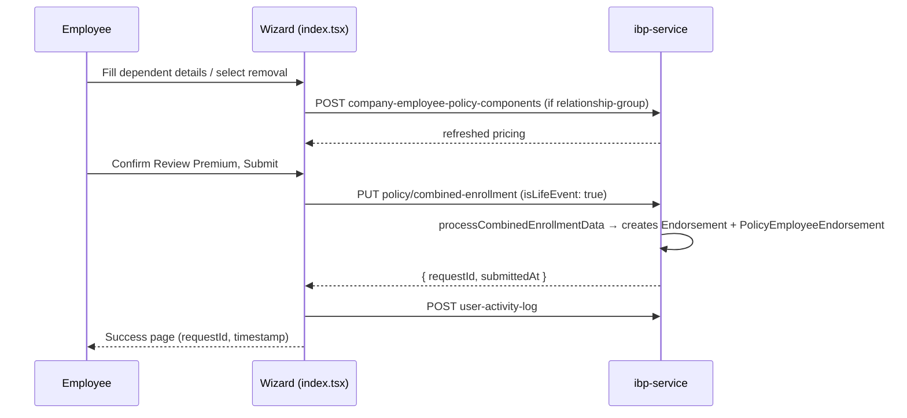
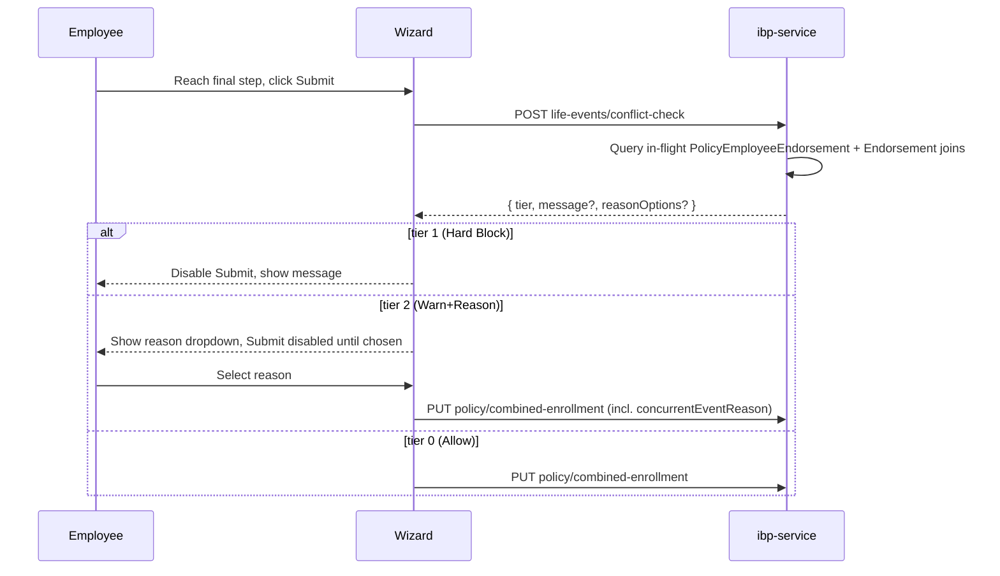
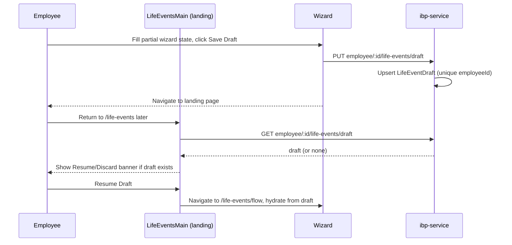

# IBP Life Events — Technical Requirements Document (Stage 40b)

**Module:** LIFE-EVENTS · **Product:** Integrated Benefits Portal (IBP)
**Stage:** 40b — Module TRD (complements [IBP-Life Events-PRD.md](./IBP-Life%20Events-PRD.md), Stage 40a)
**Authored:** 2026-07-20 · **Audience:** Tech leads, backend/frontend engineers implementing the Gap Register

---

This TRD covers exactly what the PRD deliberately left out: internal architecture, data model, API contracts, and concrete engineering decisions for every item the PRD marked "Tech Lead to decide." Every Gap (GAP-01 through GAP-14) gets a technical design here. Section 9 also documents defects and architectural gaps discovered during this investigation that are **not** in the PRD's original Gap Register — flagged explicitly as new findings.

---

## 1. Current architecture

### 1.1 Routing

`apps/ui/ibp/src/app/app.tsx:216-219`:
```tsx
<Route element={<LifeEventsRoute />}>
  <Route path="/life-events" element={<LifeEventsMain />} />
  <Route path="/life-events/flow" element={<LifeEvents />} />
</Route>
```

`/life-events` → landing/carousel. `/life-events/flow` → the wizard shell (both addition and deletion flows live under this one route; flow type is resolved from sessionStorage, not the URL — see §1.3).

### 1.2 Component map

| File | Lines | Role |
|---|---|---|
| `LifeEventsMain.tsx` | 725 | Landing carousel. `handleLifeEventSelection` (line 474) sets sessionStorage flow-type/event keys and navigates to `/life-events/flow` (line 480). |
| `index.tsx` | 1991 | Wizard shell/orchestrator. Owns all wizard state, builds the stepper header (1905-1983), dispatches to `LifeEventsSteps` via `renderStepContent()` (1861). Contains `prepareDeletionPayload` (965-1052) and `prepareAdditionPayload` (1054+). |
| `LifeEventsSteps.tsx` | 131 | Pure dispatcher: addition → `AdditionSteps`, deletion → `DeletionSteps` (72-126). |
| `LifeEventsAdditionSteps.tsx` | 504 | Addition step switch (352-501): reason → `LifeEventsDependentManagement` → `LifeEventsChoiceSelection` → `PremiumSummary` → `LifeEventsSuccessPage`. |
| `LifeEventsDeletionSteps.tsx` | 1198 | Deletion step switch (1144-1195): `SelectDependentStep` (wraps `LifeEventsDependentRemoval`) → `ConfirmAndUploadStep` (**inline**, uploads docs) → `ReviewPremiumStep` (**inline premium UI — does NOT reuse `PremiumSummary.tsx`**) → `LifeEventsSuccessPage`. |
| `LifeEventsDependentManagement.tsx` | 2181 | Addition dependent-details form. Age-constraint helper text logic at line 855 (`getAgeConstraintsForRelationship`). |
| `LifeEventsChoiceSelection.tsx` | 1891 | Addition "Choose Components" step. |
| `LifeEventsDependentRemoval.tsx` | 508 | Deletion "Select Dependent" step; reads `policyData.configuration.dependents`. |
| `PremiumSummary.tsx` | 857 | **Addition-flow-only** Review Premium screen. |
| `LifeEventsSuccessPage.tsx` | 63 | Shared success screen; exports `LifeEventsSubmissionMeta` (`requestId`, `submittedAt`, `reasonTitle`, `newAnnualPremium`). |
| `constants.ts` | 313 | Event catalogs, step configs, sessionStorage key constants. |

**Correction to the PRD's implicit assumption (important for GAP-03/GAP-12 scope):** the PRD's Gap Register targets `PremiumSummary.tsx` for Review Premium changes affecting *both* flows (GAP-03, GAP-12). **`PremiumSummary.tsx` is addition-only.** The deletion flow's Review Premium step is a separate, inline `ReviewPremiumStep` component defined inside `LifeEventsDeletionSteps.tsx` — it does not import or reuse `PremiumSummary.tsx` at all. Any deletion-side premium/refund change (BR-LE-013b deletion math, BR-LE-032 deletion labels, BR-LE-034 refund lines/claim disclaimer) must be implemented in `LifeEventsDeletionSteps.tsx`'s inline component, not `PremiumSummary.tsx`. See §5.3, §5.11.

**Dead component files** (not wired into any route/step — verified via repo-wide grep, each only self-referencing): `LifeEventsChooseBenefits.tsx` (479 lines, superseded by `LifeEventsChoiceSelection.tsx`), `LifeEventsUploadDocuments.tsx` (286 lines, superseded by the inline `ConfirmAndUploadStep`), `LifeEventsPremiumReview.tsx` (206 lines, superseded by `PremiumSummary.tsx`/inline `ReviewPremiumStep`). Recommend deleting these in the same pass as the Gap Register work, to avoid future engineers editing dead code by mistake.

### 1.3 State management

**sessionStorage** — `constants.ts:307-313` declares 7 keys, but only 2 are actually wired:

| Key | Status |
|---|---|
| `FLOW_TYPE_KEY` (`lifeEvents_flowType`) | **Active.** Set in `LifeEventsMain.tsx:478`, read in `index.tsx:394,400`. |
| `SELECTED_EVENT_KEY` (`lifeEvents_selectedEvent`) | **Active.** Set `LifeEventsMain.tsx:479`, read `index.tsx:400`. |
| `CURRENT_STEP_KEY`, `DEPENDENTS_DATA_KEY`, `SELECTED_CHOICE_IDS_KEY`, `SUBMISSION_META_KEY`, `UPLOADED_DOCUMENTS_KEY` | **Declared, never read or written anywhere outside `constants.ts` itself.** |

**Consequence — a real, currently-shipped gap not in the PRD's register:** the wizard does **not** survive a hard page refresh mid-flow beyond which event was selected. `dependentsData`, `selectedChoiceIds`, uploaded document IDs, and submission metadata all live in plain React `useState` inside `index.tsx` (seeded once from `flowType`/`initialSelectedLifeEvent`, `index.tsx:402-407`) and are lost on reload. This matters directly for GAP-07 (Save Draft): the draft feature isn't just a "nice to have," it is the *only* mechanism that will make wizard progress durable at all — today there is no fallback persistence to fall back on if a draft isn't saved.

**"Current user" source** — every reference to "the logged-in employee" inside Life Events reads `sessionStorage.getItem('user')` directly (`index.tsx:397`, `LifeEventsDependentManagement.tsx:406,1128`, `LifeEventsDeletionSteps.tsx:282`, `PremiumSummary.tsx:218`, `LifeEventsMain.tsx:141`), **not Redux `state.user`.** The PRD's Data Contract table lists `state.user` as a consumed source — this should be corrected to `sessionStorage('user')` for accuracy; the actual Redux `userSlice` (`apps/ui/ibp/src/app/redux/slice.ts`) holds only toast/lookup-cache state and has zero relevance to Life Events.

**Redux `state.policyData`** — `apps/ui/ui-lib/src/lib/redux/policiesSlice.ts`, shape `{ policiesData, relationDependentData, loading, error }`, populated by the `fetchEmployeePolicies` thunk (parallel calls to `endPoints.employeePolicies`/`endPoints.getRelationDetails`). This part of the PRD's Data Contract is accurate — read at `LifeEventsMain.tsx:129-133`, `index.tsx:458-464`, `PremiumSummary.tsx:208-214`.

### 1.4 Route guard — no-op today (new finding, not in PRD Gap Register)

`apps/ui/ibp/src/app/Auth/LifeEventsRoute.tsx` is a **pure passthrough**: `return <Outlet />;` — no eligibility check, no redirect logic. BR-LE-001/AC-LE-001 require that an employee with no policy at `isEditable = false` be **redirected to the dashboard** when they navigate to Life Events. Today, eligibility is enforced **only as soft UX filtering** of which life-event *cards* render inside `LifeEventsMain.tsx` (`availableLifeEvents`) — an ineligible employee can still load `/life-events` directly (e.g., via a bookmarked URL or manual navigation) and see an empty/degraded carousel rather than being redirected. **This is a genuine defect against AC-LE-001 as written**, distinct from anything in the PRD's Gap Register. See D-NEW-1 (§9).

---

## 2. Data model

### 2.1 `Endorsement` entity (`apps/services/service-lib/src/lib/entities/endorsement.entity.ts`, table `endorsement`)

Full current column list: `id, policyId, companyId, endorsementType, endorsementDate, insurerEndorsementNumber, provisionalEndorsementNumber, insurerAcknowledgementNumber, insurerEndorsementDate, insurerCommunicationDate, endorsementEntryDate, enrollmentStartDate, enrollmentEndDate, endorsmentFileId, endorsmentCount, endorsmentDependentCount, ackFileId, endorsementAckCount, employeeEndorsementAdditionCount, employeeEndorsementDeletionCount, tpaDocumentId, tpaErrorFileId, tpaProcessedCount, tpaErrorCount, endorsementEffectiveDate, dateOfBusiness, businessMonth, clientConfirmationDate, tpaAcknowledgedDate, sumInsured, premiumAtInception, grossPremium, netPremium, premiumCollected, gstAmount, terrorismAmount, incomeMonth, dateOfIncome, incomeTypeLid, basicBrokeragePercentage, brokerageAmountAsperIwork, brokerageAmountAsperIsg, feeAmount, commissionTerrorismAmount, otherAmount, odPercentage, tpPercentage, netPercentage, sharePercentage, terrorismBrokeragePercentage, insurerEndorsedDependentCount, insurerEndorsedEmployeeCount, dealConfirmedLid, remarks, clientConfirmationMessage, tpaUploadRemarks, insurerCommunicationDetails, financialNonFinancially, osTicketNumber, endorsementStatus, brokerageCollected, basicPremium, srccAmount, adminCharges, cessAmount, gstPercentage, srccPercentage, basicBrokerageAmount, srccBrokerageAmount, tcBrokerageAmount, currentEndorsementStep, uniqueIworkedgeReference, uniqueExternalReference, enabledForPerformanceLid, createdBy, updatedBy, createdAt, updatedAt, isInception, toBeMappedPostUploadLid, clientMappingFileId, clientMappingFileIdCreatedAt, premiumCalculationFileId, premiumCalculationFileIdCreatedAt, organisationId, sbuId, verticalId, departmentId, branchId, uniqueRefKey, financialYear, iworkUniqueId`.

**No `eventDate` column, no life-event-specific metadata column exists** — confirms GAP-08/09/BR-LE-041's premise that new columns are required (§5.9, §5.10, §5.14).

There is already a generic `remarks` (text) column — considered and rejected as a home for BR-LE-041's structured reason (§5.14 explains why a dedicated column is proposed instead).

### 2.2 `PolicyEmployeeEndorsement` entity (table `policy_employee_endorsement`)

Columns: `id, policyId, employeeId, companyId, employeeEndorsementStatusKey, createdAt, updatedAt, endorsementAdditionFileId, endorsementDeletionFileId, endorsementAdditionCreatedAt, endorsementDeletedCreatedAt, endorsementUpdationFileId, endorsementUpdationCreatedAt, endorsementId, deletionEndorsementId`.

**Confirmed defect (new finding):** `endorsementId` has a formal `@ManyToOne(() => Endorsement) @JoinColumn({name:'endorsement_id'})` relation (lines 82-84). **`deletionEndorsementId` does not** — it's a bare `number` column with no relation decorator. Any query needing to join "the deletion endorsement" for an employee (which the conflict-check engine in GAP-13/14 needs, see §5.13) must either add this relation or hand-write the join. **D-NEW-2 (§9) proposes adding the missing relation** as a prerequisite for GAP-13.

### 2.3 Dependent entity (`policy-enrollment-dependent.entity.ts`, table `policy_enrollment_dependent`)

Columns: `id, policyId, employeeId, name, relation, relationshipType, dateOfBirth (encrypted), gender, claimStatus, dependentTpaId, enrollmentAdditionBatchId, enrollmentDeletionBatchId, effectiveDate, documentIds (jsonb), isLifeEvent, endorsementAdditionBatchId, endorsementDeletionBatchId, additionEndorsementId, deletionEndorsementId, endorsementAdditionCreatedAt, endorsementDeletionCreatedAt, endorsementUpdationFileId, endorsementUpdationCreatedAt, endorsementStatusKey, bypassPremiumAmount, bypassSumInsured, additionalAttributes (jsonb), createdBy, updatedBy, createdAt, updatedAt, deletedAt (soft-delete column)`.

**Confirmed defect (new finding, relevant to GAP-12/BR-LE-034):** the codebase pattern `dep.additionalParams?.claimStatus ?? dep.claimStatus` (cited by the PRD as the working claim-status read, appearing in `enrollment-processing.util.ts:2839`, `policy.repository.ts:30240`, `enrollment-upload.scheduler.ts:8433`) references a field, `additionalParams`, **that does not exist on this entity** — only `additionalAttributes` does. This is confirmed as a genuine `tsc` compile error (`error TS2339: Property 'additionalParams' does not exist on type 'PolicyEnrollmentDependent'`), not a stylistic quirk. The real, type-safe claim-status source for a dependent is `dep.claimStatus` (the direct column) or `dep.additionalAttributes?.claimStatus`, never `dep.additionalParams`. **GAP-12's implementation must use `dep.claimStatus`/`dep.additionalAttributes?.claimStatus` and should fix (or at minimum not propagate) the broken `additionalParams` reference** — see §5.11.

`dependentTpaId` already exists on this entity and is the natural candidate for a stable cross-policy identity key (see §5.10 on the fingerprint-matching fragility).

### 2.4 Draft storage — confirmed does not exist

No `LifeEventDraft` entity, table, or anything draft-related for enrollment/life-events exists anywhere in `apps/services` or `apps/ui` (repo-wide grep, zero hits besides an unrelated MIR-report match). GAP-07 is a from-scratch build. See §5.7.

---

## 3. Existing API contracts

All four endpoints Life Events depends on resolve to **`ibp-service`** (not policy-service), and all route through the same controller: `apps/services/ibp-service/src/app/company-employee/company-employee.controller.ts` (`@Controller("company-employee")`).

| UI endpoint key | Route | Controller method |
|---|---|---|
| `updateEnrollmentData` | `PUT /company-employee/policy/combined-enrollment` | `updateCombinedEnrollmentData` → `companyEmployeeService.processCombinedEnrollmentData(payload, userId, true)` |
| `policyConfigurationByDependents` | `POST /company-employee/company-employee-policy-components` | `getEmployeePolicyComponentDetails` |
| `ibpFileUpload` | `POST /company-employee/file-upload/upload` | `uploadFile` |
| `getActivityLogs` | `GET /company-employee/user-activity-log` | `getUserActivityLogs` |

### 3.1 `UpsertCombinedEnrollmentDataDto` (submission payload, `upsert-enrollment-data.dto.ts:72-127`)

```ts
class UpsertCombinedEnrollmentDataDto {
  employeeId: number;
  companyId: number;
  action: EnrollmentAction;          // 'save' | 'submit'
  isLifeEvent?: boolean;
  dependents?: UpsertEnrollmentDependentDto[];
  combinedChoices?: CombinedEnrollmentChoiceDto[];
  deletedDependentIds?: number[];
  disclaimersAccepted?: { policyId; text; isMandatory; acceptedAt }[];
}
```

`UpsertEnrollmentDependentDto` (`upsert-enrollment-dependent.dto.ts:19-172`) already has: `id, name, relation, relationshipType, dateOfBirth, gender, effectiveDate, documentIds, lifeEventAction (enum ADD/UPDATE/DELETE), enrollmentAdditionBatchId, claimStatus, policyComponentActionType(Id/Label), parentpolicyComponentActionTypeId, choices[], tempKey, isLifeEvent, additionalAttributes`.

**Confirmed via direct grep of the DTO file: no `eventDate` field, no `deletedAt` field exist today.** `lifeEventAction` already exists as a validated enum — GAP-10/11's cascade fix does not need to add this field, only change *which* records carry `DELETE` (§5.10).

---

## 4. `prepareDeletionPayload` — current behavior (`index.tsx:965-1052`)

```ts
const prepareDeletionPayload = () => {
  const existingDependents = (effectiveLifeEventChoicePolicySources || [])
    .flatMap((policy) => policy?.configuration?.dependents || []);

  const getDepFingerprint = (dep) => [name, relationshipType||relation, gender]...;
  const selectedFingerprints = new Set(dependentsData.map(getDepFingerprint));
  const fingerprintToDocIds = new Map(); // per selected dependent's uploaded docs

  const dependentsForSubmit = existingDependents.map((dependent) => {
    const fingerprint = getDepFingerprint(dependent);
    const isDeleting = selectedFingerprints.has(fingerprint);
    return isDeleting
      ? { ...rest, id: dependent.id, lifeEventAction: "DELETE",
          documentIds: fingerprintToDocIds.get(fingerprint) ?? getProofDocumentIdsForDependent(dependent.id) }
      : { ...rest, id: dependent.id };
  });

  return { employeeId, companyId, action: "submit", isLifeEvent: true,
           dependents: dependentsForSubmit, combinedChoices: cleanedCombinedChoices };
};
```

**Facts that shape the GAP-10/11 technical design:**

1. **The "cross-policy" scope is already the full `effectiveLifeEventChoicePolicySources` set**, not a single policy — matching is by **fingerprint** (`name | relationshipType||relation | gender`), which is fragile: two policies recording the same dependent's name with different casing/whitespace, or a differently-worded relationship label, will fail to match and the cascade will silently miss a policy. `dependentTpaId` (already on the entity, §2.3) is a materially more stable key wherever it's populated.
2. `effectiveLifeEventChoicePolicySources` is filtered to policies with `isEditable === false` (consistent with BR-LE-001's eligibility gate — **not a bug**, this correctly restricts Life Events to locked/enrolled policies) and `!isPolicyExpired(dueDate)` — so the existing "cross-policy" set is already scoped correctly to "policies this employee has completed enrollment on," which is the right universe for cascade.
3. Every dependent (deleting or not) is included in the outgoing payload; only the matched ones get `lifeEventAction: "DELETE"` added. Non-deleting dependents get no `lifeEventAction` field at all (not `"NONE"` or similar).
4. `documentIds` fallback (`getProofDocumentIdsForDependent`) attaches **all** uploaded documents to a dependent's deletion record if no per-dependent-ID match is found — a risk of over-attaching unrelated documents when multiple dependents are removed in the same submission without explicit per-dependent doc tagging. Flagged for GAP-10's fix to tighten.
5. **No `eventDate` is ever set** (confirms GAP-08/09). `action` is hardcoded `"submit"` with a stale comment (`// or "save" based on your flow`) suggesting a draft path was scaffolded but never wired — consistent with GAP-07 being a from-scratch build, not a partial one.
6. `prepareAdditionPayload` (immediately following) mirrors this pattern for `"ADD"` and is the template to model GAP-10/11's fix against for consistency.

---

## 5. Per-Gap technical design

### 5.1 GAP-01 — 5 MB file-size limit (both flows)

**Change:** `LifeEventsDependentManagement.tsx:902` currently allows 10 MB for the addition flow; reduce to `5 * 1024 * 1024` bytes, matching the deletion flow's existing (correct) 5 MB limit. Update the toast copy to the exact string specified in BR-LE-011/AC-LE-009: *"Please upload PDF, JPG, or PNG files up to 5 MB only."* Grep `constants.ts` for any shared file-size constant used by both flows — if one exists, change it there once rather than in two places, to prevent this exact drift from recurring.

**Risk:** none — a stricter client-side limit only rejects a superset of previously-accepted files; no backend change.

### 5.2 GAP-02 — `age_limit_exceeded` key/id mismatch

**Change:** in `constants.ts`, `DELETION_LIFE_EVENTS[2].key` currently reads `'eligibility_change'` while `.id` reads `'age_limit_exceeded'`. Change `key` to `'age_limit_exceeded'`. **Before merging, grep the entire `apps/ui/ibp/src/app/pages/LifeEvents/` tree (and `apps/ui/ibp/src/app` broadly, in case any shared constant importer references it) for the literal string `'eligibility_change'`** — any switch/conditional keyed on it must be updated to `'age_limit_exceeded'` or removed if dead. No API/DB change — the wire value (`.id`) is already correct.

### 5.3 GAP-03 — Review Premium before/after employee-contribution labels (BR-LE-013b, BR-LE-032)

**Scope correction (see §1.2):** this must be implemented in **two places**, not one:
- **Addition flow** → `PremiumSummary.tsx`.
- **Deletion flow** → the inline `ReviewPremiumStep` component inside `LifeEventsDeletionSteps.tsx` (not `PremiumSummary.tsx`, contrary to the PRD's file citation).

**Design:** both components branch on `policy.configuration.isRelationshipGroup`:
- **Per-life policies** (BR-LE-013): compute `Additional Premium = Σ(choice.premiumPerLife × newDependentCount)` client-side, as today.
- **Bucket policies** (BR-LE-013b): `Additional Premium = newBucketPrice − currentBucketPrice`, both values already present in the cached BR-LE-010 refresh response (`endPoints.policyConfigurationByDependents`) — no new API call.

Apply the "Before / After / Change / Monthly" 4-row table layout from BR-LE-032 to both components identically, with label "Additional Premium" (addition) / "Premium Reduction" (deletion) in both. Extract the shared row-rendering JSX into a small presentational component (e.g. `PremiumBreakdownTable`) used by both `PremiumSummary.tsx` and the deletion `ReviewPremiumStep`, rather than duplicating markup — this also gives GAP-12's refund lines (§5.11) one place to extend for the deletion side.

### 5.4 GAP-04 — "No Longer Eligible" card copy

Copy-only change in `constants.ts`'s card description for the `no_longer_eligible` entry, adding the study-extension and marital-status-change examples from BR-LE-028. No code logic change, no API/DB change.

### 5.5 GAP-05 — Age constraint helper text / inline DOB error

`LifeEventsDependentManagement.tsx:855`'s `getAgeConstraintsForRelationship` already resolves `minAge`/`maxAge` — confirm (via manual QA, not just code read) that the helper-text and inline-error rendering described in AC-LE-027/AC-LE-028 are wired to its output; if the helper text isn't currently rendered from this value, add it. The existing DOB-clearing-on-relationship-change behavior (AC-LE-028) stays; add the informational message alongside the clear.

### 5.6 GAP-06 — Life Events History + read-only stepper drill-down

**This is the largest feasibility finding of this TRD: the iwork stepper cannot be "reused as-is."**

`apps/ui/iwork/src/app/common/CustomStepper/index.tsx` (102 lines):
1. Defines its **own hardcoded 4-step list** (`upload_employee`, `insurer_ack`, `upload_tpa_ids`, `final_review`) — this does **not** match the 6-key `ENDORSEMENT_STEP_KEYS` the PRD's stepper requirement is built around.
2. Is **not read-only** — `onCurrentStepClick` is a required prop wired to the active step's click handler, intended to open an action drawer in iwork's own context.
3. Lives in `apps/ui/iwork/src/app/common/*`, which has **no cross-app import alias** in `tsconfig.base.json` (only `@ui/container/*` and `@ui/ui-lib*` are exposed) and is not re-exported from `@ui/ui-lib`. A deep relative import from `ibp` into `iwork`'s internals would violate this repo's established app/lib boundary (everything shared goes through `@ui/ui-lib`), even though the current lint config's permissive `depConstraints` might not technically block it.

**Decision (D-6):** build a new, **read-only, 6-step-driven** stepper component in `@ui/ui-lib` (e.g. `EndorsementStepperReadOnly`), taking `steps: {key,label}[]`, `currentStepKey`, and `status` as props, with no click handlers at all. Do not attempt to import or adapt iwork's `CustomStepper` directly. This is now a **prerequisite sub-task of GAP-06**, not an incidental detail.

**Backend:** new endpoint, e.g. `GET /company-employee/employee/:employeeId/life-events/history`, returning one row per `PolicyEmployeeEndorsement` (joined to its `Endorsement` via `endorsementId` and, once D-NEW-2's relation fix lands, `deletionEndorsementId`) for that employee — `requestId` (map to `Endorsement.id` or a stable field TBD), `flowType` (addition/deletion, derivable from which of `endorsementId`/`deletionEndorsementId` is populated), `endorsementStatus`, `currentEndorsementStep`, `submittedAt` (endorsement `createdAt`), `policyName`. Sorted by `createdAt DESC` per BR-LE-018.

**Frontend:** new route `/life-events/history` (exact path per PRD confirmed here), a list component consuming the above endpoint, and a drill-down that renders `EndorsementStepperReadOnly` fed by the selected row's `currentEndorsementStep`/`endorsementStatus`, mapped through `ENDORSEMENT_STEP_KEYS`/`ENDORSEMENT_STATUS` (imported from `apps/ui/iwork/src/app/constants/index.ts` — confirm these constants themselves are importable cross-app the same way, or promote them to `@ui/ui-lib` alongside the new stepper for consistency). `LifeEventsSuccessPage.tsx` gets a new link to this route.

### 5.7 GAP-07 — Save Draft (from-scratch build)

**New entity `LifeEventDraft`** (table `life_event_draft`):

| Column | Type | Notes |
|---|---|---|
| `id` | serial PK | |
| `employeeId` | int, **unique** | Enforces the BR-LE-021 singleton constraint at the DB level via a unique constraint — not just application logic, so a race condition can't create two drafts for one employee. |
| `policyId` | int | Policy the draft is bound to (BR-LE-022). |
| `flowType` | enum(`addition`,`deletion`) | |
| `selectedLifeEventId` | text | |
| `currentStepIndex` | int | |
| `dependentFormValues` | jsonb | |
| `selectedChoiceIds` | jsonb | |
| `documentIds` | jsonb (int[]) | |
| `createdAt`, `updatedAt` | timestamptz | |

**Endpoints (new, on `ibp-service`, same controller family):**
- `PUT /company-employee/employee/:employeeId/life-events/draft` — upsert (create-or-replace, enforcing the one-row-per-employee constraint via the unique index — an upsert on conflict, not insert-then-check).
- `GET /company-employee/employee/:employeeId/life-events/draft` — fetch the current draft, if any (used by the landing-page banner, BR-LE-024).
- `DELETE /company-employee/employee/:employeeId/life-events/draft` — discard (banner Discard, second-event-warning Discard & Start New, or post-submit consumption).

**Discard file cleanup (BR-LE-025):** on `DELETE`, a background job (can be synchronous in the same request for v1 given expected low volume, or queued — Tech Lead to size based on expected concurrent draft count) checks each `documentIds` entry: if no other entity (Endorsement's dependent documentIds, another draft) references that file ID, delete the file record/storage object. Reuse whatever existing "is this file still referenced" utility exists for other document-lifecycle cleanup in this codebase if one exists — confirm during implementation rather than writing a bespoke check.

**Scheduled cleanup (BR-LE-022):** a scheduled job (this repo already has a `scheduler-service` app used for exactly this kind of periodic maintenance — the enrollment-upload scheduler already referenced in §2.3/BR-LE-026 lives there) queries `LifeEventDraft` joined to `Policy` where `policy.policyTo < now()` and deletes the draft (plus its exclusively-referenced files, same logic as manual discard).

**Frontend:** a "Save Draft" button on every wizard step, calling the `PUT` above with the current in-memory wizard state (no validation, per BR-LE-020). The landing-page banner and the second-event warning dialog both call `GET`/`DELETE` as specified in BR-LE-023/024.

### 5.8 GAP-08 — Addition flow: Event Date field

**New DTO field:** `eventDate?: string` (ISO date) on `UpsertEnrollmentDependentDto` (§3.1) — confirmed absent today via direct grep.

**New column:** `eventDate` (date) on the `Endorsement` entity (§2.1) — this is where BR-LE-031 says the value must persist "for audit and HR review," and Endorsement is the natural home since it's the one record created per submission (rather than per-dependent, where multiple dependent rows in one submission would otherwise need to agree on the same value redundantly).

**UI:** add an "Event Date" input to `LifeEventsDependentManagement.tsx`, shown for Marriage and Age-Dependent Addition only; skipped for Child Birth/Adoption (DOB substitutes, per BR-LE-031). Validation: not future, not before current policy period start (read from the same policy-period data already available via `state.policyData.policiesData`).

### 5.9 GAP-09 — Deletion flow: Event Date field, wiring `deletedAt`

**New DTO field:** `deletedAt?: string` (ISO date) on `UpsertEnrollmentDependentDto` — confirmed absent today. Populate it from the deletion wizard's new Event Date input, set on every dependent record carrying `lifeEventAction: "DELETE"` in `prepareDeletionPayload` (§4, §5.10).

**Backend gate confirmed:** `apps/services/service-lib/src/lib/utils/enrollment-processing.util.ts:2603` gates the refund-calculation branch on a **truthy `deletedAt`** — today this field is never sent, so that branch never fires. Wiring `deletedAt` through is a strict prerequisite for GAP-12's refund display to have real data to show. No schema change needed on the dependent entity — `deletedAt` already exists as a column there (§2.3), the gap is purely that the request payload never populates it.

**UI:** add the same Event Date input pattern as GAP-08 to the deletion wizard's first step (`LifeEventsDependentRemoval.tsx` or the `SelectDependentStep` wrapper — Tech Lead's placement call per the PRD is resolved here as: **on the Select Dependent step**, since Event Date conceptually belongs with "which dependent, and why" rather than the later confirm/upload step). Same validation bounds as GAP-08.

### 5.10 GAP-10 / GAP-11 — Cross-policy cascade (terminal events) and policy-specific age-out filtering

**Problem restated (§4):** `prepareDeletionPayload` currently marks `lifeEventAction: "DELETE"` on every dependent record matching the selected row's **fingerprint** across the already-correctly-scoped `effectiveLifeEventChoicePolicySources` set. Functionally this is close to correct for GAP-10's "cascade to every enrolled policy" requirement — the remaining gap is exactly the fingerprint-matching fragility (§4, point 1) and the lack of GAP-11's per-policy age filter.

**Decision (D-10) — move cascade *resolution* server-side, keep cascade *application* the existing DTO shape:**

Rather than trying to make client-side fingerprint matching more robust (string-normalization band-aids), resolve "which policies/dependent-records does this terminal-event submission affect" **server-side**, keyed primarily by `dependentTpaId` (stable, already on the entity, §2.3) with fingerprint as a fallback only when `dependentTpaId` is null. Concretely:
- The frontend still sends the submission with `lifeEventAction: "DELETE"` set on the dependent record(s) it knows about from the currently-loaded policy sources (no change to the DTO shape).
- `processCombinedEnrollmentData` (the existing backend handler), on receiving an `isLifeEvent: true` submission with `deletedAt` populated and the terminal-event flag (see below) set, **additionally** queries all of that employee's other enrolled dependent records matching the same `dependentTpaId`/fingerprint and applies the same deletion — so a client-side miss (stale/unloaded policy source, string mismatch) can't cause a partial cascade.
- **New DTO field** `isTerminalDeletionEvent?: boolean` (or reuse `lifeEventType` if the backend already receives the selected event's id — confirm during implementation) so the backend knows to run the cascade-completion check; without a signal, the backend can't distinguish "delete from this one policy" (age-out, GAP-11) from "delete everywhere" (terminal, GAP-10).

**GAP-11 (age-out is per-policy, not terminal):** for `age_limit_exceeded`, `prepareDeletionPayload` must filter which policies get `lifeEventAction: "DELETE"` by `dependent.age >= policy.maxAge` for that relationship — both values already available client-side via `state.policyData.relationDependentData` (BR-LE-026's existing config source), so this is a pure frontend filtering change, no new backend call. **Do not** set the `isTerminalDeletionEvent` flag for this event type — it must not trigger the server-side full cascade from D-10.

**Policy-impact summary (BR-LE-029/BR-LE-030):** compute this client-side from the same filtered set used to build the payload (terminal: every policy in `effectiveLifeEventChoicePolicySources`; age-out: only the policies passing the age filter) — no new endpoint needed, this is a rendering concern over data already in hand.

**Document over-attachment (§4, point 4):** tighten `getProofDocumentIdsForDependent`'s fallback so that when multiple dependents are being removed in one submission, an unmatched dependent does not silently inherit *all* uploaded documents — require an explicit per-dependent document tag in the upload UI when more than one dependent is selected for removal in the same submission (single-dependent removals can keep the current "attach everything uploaded" behavior, since there's no ambiguity).

**Endorsement-per-policy question (PRD, BR-LE-029's "Technical changes implied"):** **Decision — one `Endorsement` row per affected policy**, each linked via its own `PolicyEmployeeEndorsement` row. Rationale: `Endorsement.policyId` is a single FK (§2.1) — there is no array/JSON structure for multi-policy on that entity today, and each policy's own downstream endorsement lifecycle (insurer dispatch, TPA upload, brokerage) genuinely differs per policy, which the existing 1:1 `Endorsement`↔`Policy` model already supports correctly. Building a "combined" multi-policy endorsement would require restructuring `Endorsement` itself and duplicating per-policy state anyway — creating N independent `Endorsement` rows (all carrying the same `eventDate`/`concurrentEventReason` where applicable) is the lower-risk choice and requires zero schema change beyond §5.8/§5.9/§5.14's new columns.

### 5.11 GAP-12 — Deletion Review Premium: refund lines and claim-status handling

**Scope correction (repeats §1.2/§5.3):** implement in the **inline `ReviewPremiumStep`** inside `LifeEventsDeletionSteps.tsx`, not `PremiumSummary.tsx`.

**Data source correction (§2.3):** read `dep.claimStatus` (direct column) or `dep.additionalAttributes?.claimStatus` — **never** `dep.additionalParams?.claimStatus`, which is a confirmed type error / broken reference on this entity. If the existing broader codebase pattern (`enrollment-processing.util.ts:2839` etc.) is touched as part of this work, correct it there too rather than propagating the same broken fallback into new deletion-flow code.

**Rendering:** extend the shared `PremiumBreakdownTable` (proposed in §5.3) with a refund section, branching on the dependent's claim status:
- **No claim:** show Employee refund (pro-rated from `eventDate` to policy period end — needs `deletedAt`/`eventDate` from GAP-09 to compute) and, only if the company-level "show employer contribution" flag is enabled, Employer refund. Locate this flag (Redux store location TBD by Tech Lead per the PRD) during implementation — confirm it's already surfaced somewhere in the app for other employer-contribution displays (My Insurance / Enrollment screens likely already read it) and reuse that same source rather than introducing a second lookup path.
- **Claim made:** suppress all refund lines; show the fixed disclaimer copy from BR-LE-034. Submit remains enabled (deletion is never blocked by claim status).
- **Family-floater zero-delta (BR-LE-013b edge case):** Premium Reduction = ₹0, refund = ₹0, explanatory note per BR-LE-013b — already covered by GAP-03's before/after math, no additional logic needed here beyond making sure the ₹0 case doesn't accidentally suppress the refund-section rendering entirely (it should still render, just showing zeros with the note).

### 5.12 — 5.14: Concurrent life-event conflict engine (GAP-13, GAP-14, BR-LE-035 through BR-LE-041)

**New endpoint:** `POST /company-employee/employee/:employeeId/life-events/conflict-check`

Request:
```ts
{
  employeeId: number;
  targetEventId: string;              // e.g. "age_limit_exceeded", "marriage", "child_birth"
  targetDependentFingerprint?: { name, relationshipType, gender, dateOfBirth };
  targetRelationshipGroup?: "spouse" | "child" | "parent"; // for capacity/singleton checks
}
```
Response:
```ts
{
  tier: 0 | 1 | 2;                    // 0 = Allow, 1 = Hard Block, 2 = Warn+Reason
  message?: string;                   // populated for tier 1/2, exact copy per the matched BR
  reasonOptions?: string[];           // populated only for tier 2 (BR-LE-041)
}
```

**Query:** all `PolicyEmployeeEndorsement` rows for the employee where the joined `Endorsement.endorsementStatus !== 'Processed'` (BR-LE-036's "in-flight" definition), joined via both `endorsementId` and `deletionEndorsementId` — **requires D-NEW-2's relation fix (§2.2)** to be a clean TypeORM join rather than a manual query on the addition side's link.

**Evaluation order** (§ BR-LE-037 through 041, evaluated in this order since an earlier Hard Block should short-circuit before a later Warn+Reason check runs):
1. **BR-LE-037 (singleton spouse slot):** any in-flight endorsement targeting the spouse relationship group → Hard Block.
2. **BR-LE-038 (same-dependent identity):** any in-flight endorsement whose target dependent fingerprint (prefer `dependentTpaId`, same rationale as §5.10) matches the new submission's target → Hard Block.
3. **BR-LE-039 (terminal precedence):** any in-flight *terminal* event (Dependent Death, Divorce, No Longer Eligible) on the same dependent → Hard Block, regardless of what the new event is.
4. **BR-LE-040 (capacity overshoot):** for addition events only — enrolled count + in-flight-addition count for that relationship type ≥ policy `maxCount` → Hard Block.
5. **BR-LE-041 (Warn+Reason):** only reached if none of 1-4 blocked — child-addition event with DOB/event-date predating an in-flight Marriage's wedding date by >9 months → Tier 2, with the reason dropdown.
6. Otherwise → Tier 0 (Allow).

**Frontend:** the wizard's final step calls this endpoint before enabling Submit. Tier 1 → disable Submit, render `message`. Tier 2 → render the reason dropdown (+ conditional free-text for "Other"), keep Submit disabled until a reason is chosen, then include the chosen reason in the submission payload.

**New DTO field / column (BR-LE-041):** `concurrentEventReason` (enum/text) + `concurrentEventReasonNote` (free text, populated only when reason = "Other") — **decision: two new nullable columns on `Endorsement`**, not a reuse of the existing generic `remarks` column, so the structured reason remains queryable/reportable independently of any other free-text remarks a Service Team member might separately add to `remarks` during processing.

**No changes** to `ENDORSEMENT_STATUS`/`ENDORSEMENT_STEP_KEYS` or the 6-step workflow itself — confirmed consistent with the PRD's own statement.

---

## 6. Sequence diagrams

### 6.1 Current submission flow (both flows, as-built)



### 6.2 Proposed conflict-check flow (GAP-13/14)



### 6.3 Proposed draft save/resume flow (GAP-07)



---

## 7. New/changed API contracts — summary

| Endpoint | Method | Status | Purpose |
|---|---|---|---|
| `company-employee/policy/combined-enrollment` | PUT | Existing, **payload extended** | Add `eventDate`, `deletedAt`, `concurrentEventReason`/`concurrentEventReasonNote` to `UpsertEnrollmentDependentDto`/`Endorsement`-derived write path |
| `company-employee/employee/:employeeId/life-events/history` | GET | **New** | GAP-06 |
| `company-employee/employee/:employeeId/life-events/draft` | GET/PUT/DELETE | **New** | GAP-07 |
| `company-employee/employee/:employeeId/life-events/conflict-check` | POST | **New** | GAP-13/14 |

## 8. New/changed schema — summary

| Entity | Change |
|---|---|
| `Endorsement` | + `eventDate` (date), + `concurrentEventReason` (text/enum, nullable), + `concurrentEventReasonNote` (text, nullable) |
| `PolicyEmployeeEndorsement` | + `@ManyToOne(() => Endorsement) @JoinColumn({name:'deletion_endorsement_id'})` relation for `deletionEndorsementId` (currently a bare column with no relation — D-NEW-2) |
| `LifeEventDraft` | **New table**, unique on `employeeId` (§5.7) |

No changes to `PolicyEnrollmentDependent` (its existing `deletedAt`, `claimStatus`, `dependentTpaId` columns already cover what's needed — the gap was in the request payload never populating/reading them correctly, not the schema).

---

## 9. Newly discovered findings (not in the PRD's original Gap Register)

| # | Finding | Recommendation |
|---|---|---|
| D-NEW-1 | `LifeEventsRoute.tsx` is a no-op passthrough — no route-level eligibility redirect exists, contrary to BR-LE-001/AC-LE-001. Only soft card-level filtering exists inside `LifeEventsMain.tsx`. This is also the root cause of PRD GAP-15 (BR-LE-001b): since the guard checks nothing at all today, it obviously doesn't re-verify policy expiry either. | Add both the `isEditable === false` check **and** the `!isPolicyExpired(policyTo)` check (BR-LE-001b) to the route guard itself, redirecting to `/dashboard` when neither condition is met by any policy — this single fix closes AC-LE-001 and GAP-15/AC-LE-001b together, rather than as two separate changes. |
| D-NEW-2 | `PolicyEmployeeEndorsement.deletionEndorsementId` has no `@ManyToOne` relation (unlike `endorsementId`, which does). | Add the missing relation decorator — required for GAP-13/14's conflict-check query to cleanly join both addition and deletion in-flight endorsements. |
| D-NEW-3 | `dep.additionalParams?.claimStatus` is a broken/dead reference (confirmed `tsc` compile error) appearing in three existing files (`enrollment-processing.util.ts:2839`, `policy.repository.ts:30240`, `enrollment-upload.scheduler.ts:8433`) — the entity only has `additionalAttributes`, not `additionalParams`. | GAP-12 must not copy this pattern; use `dep.claimStatus`/`dep.additionalAttributes?.claimStatus`. Consider filing a separate defect ticket to fix the three existing broken references, independent of Life Events. |
| D-NEW-4 | Only 2 of the 7 declared sessionStorage keys are wired; wizard progress (dependent data, choices, documents) does not survive a page refresh today, independent of whether GAP-07 (Save Draft) ships. | No action required beyond awareness — GAP-07 is the fix, not a "nice to have" layered on top of already-working persistence. Consider removing the 5 dead constants as cleanup, or wiring them properly if Save Draft is deprioritized and basic refresh-survival is wanted sooner as a smaller interim fix. |
| D-NEW-5 | The deletion flow's Review Premium step is a separate inline component in `LifeEventsDeletionSteps.tsx`, not a reuse of `PremiumSummary.tsx` — the PRD's GAP-03/GAP-12 file citations (`PremiumSummary.tsx`) only cover the addition side. | Implement GAP-03/GAP-12's deletion-side changes in the inline `ReviewPremiumStep`; extract shared rendering into a common component (§5.3) to avoid the two diverging further. |
| D-NEW-6 | Three component files (`LifeEventsChooseBenefits.tsx`, `LifeEventsUploadDocuments.tsx`, `LifeEventsPremiumReview.tsx`) are dead code — not imported by any active route/step. | Delete in the same PR as Gap Register work, or file as separate cleanup — low risk, avoids future confusion. |
| D-NEW-7 | The iwork `CustomStepper` cannot be reused as-is for GAP-06 (different step list, not read-only, no cross-app import path — see §5.6). | Build a new read-only stepper in `@ui/ui-lib` rather than importing/adapting iwork's component. Treat as a GAP-06 prerequisite, not a detail. |

---

## 10. Testing plan (by Gap)

- **GAP-01/02:** unit test on the constant/validation change; manual upload of a 6-10 MB file on both flows, confirm rejection + exact toast copy on both.
- **GAP-03/12:** manual walk-through of Review Premium for per-life and bucket policies, addition and deletion, including the zero-delta family-floater case and the claim-made disclaimer case.
- **GAP-06:** manual — submit a life event, follow the success-page link to History, confirm the new request appears first; drill into it and confirm the read-only stepper matches the endorsement's actual `currentEndorsementStep`/`endorsementStatus`, and that no interactive control is present.
- **GAP-07:** save a draft mid-wizard, navigate away, confirm the landing-page banner appears; Resume and confirm exact state restoration (including uploaded documents); Discard and confirm the banner disappears and referenced-only files are cleaned up (verify via a storage/DB check, not just UI).
- **GAP-08/09:** confirm Event Date is required/validated for the correct event subset in both flows, and that `deletedAt` reaching the backend actually triggers the refund branch at `enrollment-processing.util.ts:2603` (previously dead) — this is the one gap where a backend-side assertion, not just UI, is the real test.
- **GAP-10/11:** the exact scenarios in AC-LE-032/AC-LE-033 (multi-policy father death cascades to both; age-out son removed from only the policy whose `maxAge` he's exceeded) — plus a case designed to defeat naive fingerprint matching (same dependent, differently-cased name across two policies) to confirm the server-side `dependentTpaId`-based resolution (D-10) actually catches it.
- **GAP-13/14:** one test per Hard Block rule (BR-LE-037-040) and the Warn+Reason rule (BR-LE-041), each via the exact scenario given in AC-LE-041 through AC-LE-046.

## 11. Rollout / risk

- Schema changes (§8) are additive-only (new nullable columns, one new table, one new relation) — no destructive migration, safe to deploy ahead of the corresponding frontend work.
- GAP-10's server-side cascade-resolution (D-10) is the highest-risk item in this TRD: it changes backend deletion behavior for an irreversible action (BR-LE-012). Recommend a feature flag gating the server-side cascade completion specifically, so it can be rolled back to "trust the client payload only" without a deploy if an issue surfaces, while the rest of GAP-10/11 (client-side age filtering, policy-impact summary) ships unconditionally.
- GAP-13/14's conflict-check is additive (a new pre-submit gate) and fails closed in the sense that if the endpoint errors, the wizard should default to **not** allowing submission (block on inconclusive check) rather than silently allowing a potentially conflicting submission through — specify this fail-mode explicitly during implementation, since the PRD doesn't state it.
