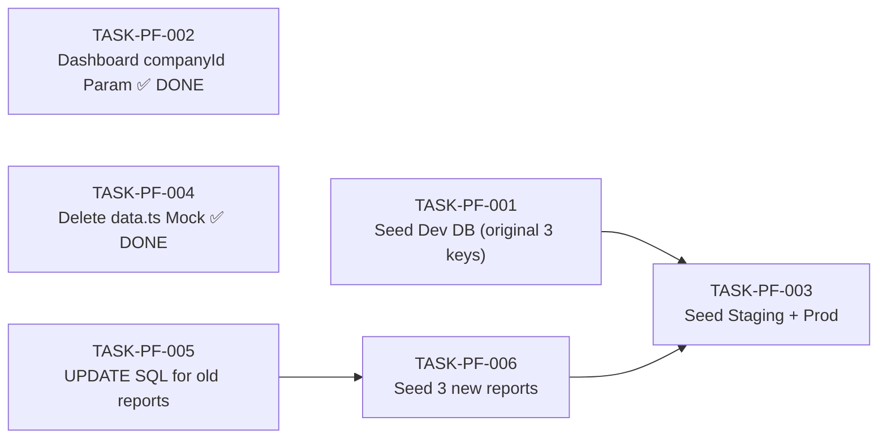

# Portfolio Page — Task Breakdown

**Module:** `ibp-service / portfolio`
**Jira Reference:** IIRM-PORTFOLIO
**TRD source:** [hr-portal-portfolio-TRD.md](hr-portal-portfolio-TRD.md)
**PRD source:** [hr-portal-portfolio-PRD.md](hr-portal-portfolio-PRD.md)
**SDS source:** [hr-portal-portfolio-SDS.md](hr-portal-portfolio-SDS.md)
**Date:** 2026-05-07
**Author:** IIRM Engineering Team

> **Scope:** The Portfolio UI (`HRPortalPortfolio`) is fully built at `apps/ui/ibp/src/app/pages/HRPortalPortfolio/index.tsx` and has been wired to the HR module API framework. The `useHRReport` hook replaces all mock data. The seed SQL at `apps/services/ibp-service/src/app/hr-module/hr-module-portfolio-scripts.sql` uses verified real column names. Work remaining: seed the dev DB, apply to staging/prod, fix Dashboard navigation to read the `companyId` query param, and clean up.

---

## What is Already Done

| Area | Status | File(s) |
|---|---|---|
| `HRPortalPortfolio` component + route + sidebar nav | Done | `apps/ui/ibp/src/app/pages/HRPortalPortfolio/index.tsx` |
| KPI cards UI + Active/Inactive filter chips | Done | Inline in `HRPortalPortfolio` |
| Group Clients accordion (expand/collapse groups and companies) | Done | `GroupRow`, `CompanyRow` components inline |
| Individual Clients accordion with INDIVIDUAL badge | Done | `IndividualCompanyCard` component inline |
| Policy table within company expansion (header + rows) | Done | `IndividualPolicyRow`, `PolicyRow` components inline |
| Policy type badge colors (GMC, GTL, GPA, GPC) | Done | `POLICY_COLORS` constant |
| Status badge colors (Active, Renewal Due, Expired) | Done | `STATUS_COLORS` constant |
| `useHRReport` hook wired for all 3 report keys | Done | `HRPortalPortfolio/index.tsx` |
| KPI cards wired to `portfolio_kpi_summary` | Done | `HRPortalPortfolio/index.tsx` |
| Company list wired to `portfolio_companies` with client-side grouping | Done | `HRPortalPortfolio/index.tsx` |
| Policy rows wired to `portfolio_policies` with client-side company join | Done | `HRPortalPortfolio/index.tsx` |
| Policy navigation fixed to use `policyId` integer | Done | `navigate('/hr-portal/policy-summary/${policy.policyId}')` |
| Company navigation updated to pass `?companyId=` query param | Done | `navigate('/hr-portal/dashboard?companyId=${company.companyId}')` |
| Loading states (skeleton) per section | Done | `SectionSkeleton` component inline |
| Error states with retry per section | Done | `SectionError` component inline |
| SQL seed script with verified real column names | Done | `hr-module-portfolio-scripts.sql` |
| HR module backend framework (generate + download endpoints) | Done | `hr.controller.ts` / `hr.service.ts` |

---

## Integration Pattern

> **Architecture change:** The page now uses a paginated + on-demand model. `portfolio_companies` and `portfolio_policies` (load-all) are superseded by `portfolio_group_companies`, `portfolio_individual_companies` (paginated, 20/page, scroll load-more via `useApiMutation`), and `portfolio_company_policies` (on-demand per company expand, cached in `policyCache`). See TRD §8 for full details.

`companyId` is read from sessionStorage via `getCompanyId()`:

```ts
import { useHRReport } from '../../hooks/useHRReport';
import { useApiMutation } from '../../hooks/useApiMutation';
import { getCompanyId } from '../../utils/companyConfig';

const companyId = useMemo(() => getCompanyId(), []);
```

**KPI summary** — `useHRReport` on mount:
```ts
const { data: kpiRaw } = useHRReport<KpiRow>('portfolio_kpi_summary', params, !!companyId, { page: 1, limit: 0 });
const kpi = kpiRaw[0] ?? null;
```

**Company lists** — `useApiMutation` with page accumulation + IntersectionObserver sentinel:
- `portfolio_group_companies` → accumulated into `groupCompanies` state; grouped client-side by `groupId`
- `portfolio_individual_companies` → accumulated into `individualCompanies` state

**Active/Inactive filter** — works on `activePolicyCount` / `inactivePolicyCount` from company rows; no policy data required.

**Policies** — `apiRequest` on expand; results stored in `policyCache: Map<number, PolicyItem[]>` (ref, keyed by companyId).

---

## Task Summary

| ID | Summary | Type | Pts | Sprint | Role | Depends on | Status |
|---|---|---|---|---|---|---|---|
| TASK-PF-001 | Seed dev DB — apply `hr-module-portfolio-scripts.sql` and verify report keys | Task | 2 | 1 | Senior BE | — | Pending |
| TASK-PF-002 | Verify Dashboard page reads `?companyId=` query param and pre-scopes correctly | Story | 3 | 1 | Senior FE | — | **DONE** |
| TASK-PF-003 | Seed staging and production environments idempotently | Task | 1 | 2 | DevOps / BE | TASK-PF-001 | Pending |
| TASK-PF-004 | Delete `data.ts` mock file; verify no remaining mock references | Task | 1 | 1 | Mid FE | — | **DONE** |
| TASK-PF-005 | Run UPDATE SQL for superseded `portfolio_companies` and `portfolio_policies` report rows | Task | 1 | 1 | Senior BE | — | Pending user action |
| TASK-PF-006 | Seed 3 new reports: `portfolio_group_companies`, `portfolio_individual_companies`, `portfolio_company_policies` | Task | 2 | 1 | Senior BE | TASK-PF-005 | Pending |

**Total:** 10 story points across 6 tasks (2 already done).

> Architecture has changed to paginated + on-demand loading. TASK-PF-005 and TASK-PF-006 cover the new report keys. TASK-PF-002 and TASK-PF-004 are complete.

---

## Dependency Graph



**Sprint 1:** TASK-PF-001, TASK-PF-005, TASK-PF-006 in sequence (005 → 006); TASK-PF-002 and TASK-PF-004 already done.
**Sprint 2:** TASK-PF-003 after dev seed (both original and new keys) is verified.

---

## Detailed Task List

---

#### TASK-PF-001: Seed dev DB — apply `hr-module-portfolio-scripts.sql` and verify report keys

- **Type:** Task
- **Parent:** —
- **Epic:** Portfolio Backend
- **Sprint:** Sprint 1
- **Points:** 2
- **Assignee:** Senior BE
- **Assigned to:** —
- **Traces to:** [US-01, US-02, US-03, US-04, US-05](hr-portal-portfolio-PRD.md#7-user-stories)
- **Depends on:** none
- **Description:** Apply the seed script `apps/services/ibp-service/src/app/hr-module/hr-module-portfolio-scripts.sql` against the dev database. The script uses plain `INSERT INTO admin_reports` — if the dev DB already has rows from a previous run, drop them first:
  ```sql
  DELETE FROM admin_reports_results_mappings WHERE admin_report_id IN (
    SELECT id FROM admin_reports WHERE name IN (
      'portfolio_kpi_summary', 'portfolio_companies', 'portfolio_policies'));
  DELETE FROM admin_reports_parameters WHERE admin_report_id IN (
    SELECT id FROM admin_reports WHERE name IN (
      'portfolio_kpi_summary', 'portfolio_companies', 'portfolio_policies'));
  DELETE FROM admin_reports WHERE name IN (
    'portfolio_kpi_summary', 'portfolio_companies', 'portfolio_policies');
  ```
  Then run the script. After seeding, run the three verification queries from TRD §10 to confirm:
  1. All three original report keys exist in `admin_reports`
  2. Each report key has at least one row in `admin_reports_parameters`
  3. Each report key has at least one row in `admin_reports_results_mappings`

  > **Architecture change note:** The 3 NEW report keys (`portfolio_group_companies`, `portfolio_individual_companies`, `portfolio_company_policies`) must also be seeded as part of the updated architecture. These are covered by TASK-PF-006 and may be combined with this task or run separately. If running them here, extend the verification query to check for all 6 keys.

  Then open the Portfolio page in the browser and confirm the KPI cards show real numbers (non-zero if data exists in dev), the Group Clients section shows group names, and the Individual Clients section shows standalone companies. If any section is empty but companies exist in dev, run the `portfolio_group_companies` report SQL directly in psql to diagnose.

  **Key schema notes (confirmed in entities — do not re-investigate):**
  - Policy dates: `policy_from` / `policy_to` (not `start_date` / `end_date`)
  - Policy number: `insurer_policy_number`
  - Premium: `net_premium`
  - Insurer: via `policy_insurer_map` CTE joining `insurer.display_name`
  - Policy status: derived from `policy_to` date vs `CURRENT_DATE` (not a DB column)
  - Group hierarchy: `group_company_map` (not `client_group`); group parent = `group_company_id`; member = `company_id`
- **Decision budget:**
  - Junior can decide: order to run the DELETE + INSERT statements, psql connection approach
  - Escalate to TL/PTL: if any table referenced in the SQL (`group_company_map`, `policy_insurer_map`, `policy_enrollment_employee_policy_map`) does not exist in the dev DB schema — flag before running; if KPI `totalLives` is always 0 despite enrolled employees — confirm `policy_enrollment_employee_policy_map.deleted_at` column exists
- **Acceptance criteria:**
  - [ ] `SELECT name FROM admin_reports WHERE name IN ('portfolio_kpi_summary', 'portfolio_companies', 'portfolio_policies')` returns 3 rows
  - [ ] `portfolio_kpi_summary` returns exactly 1 row in dev
  - [ ] `portfolio_companies` returns rows with `companyRole` = `GROUP_MEMBER` or `INDIVIDUAL`
  - [ ] `portfolio_policies` returns rows; `policyStatus` values are `Active`, `Renewal Due`, or `Expired`
  - [ ] Portfolio page in browser shows live data (non-mock)
- **Definition of Done:**
  - [ ] Jira ticket updated to Done
  - [ ] Verified in browser against dev data
  - [ ] PR with any script fixes reviewed and merged

---

#### TASK-PF-002: Verify Dashboard page reads `?companyId=` query param and pre-scopes correctly ✅ DONE

- **Type:** Story
- **Status:** **DONE** (completed)
- **Parent:** —
- **Epic:** Portfolio Frontend
- **Sprint:** Sprint 1
- **Points:** 3
- **Assignee:** Senior FE
- **Assigned to:** —
- **Traces to:** [US-04](hr-portal-portfolio-PRD.md#7-user-stories)
- **Depends on:** none
- **Description:** The Portfolio page now navigates to the Dashboard with a `companyId` query param:
  ```ts
  navigate(`/hr-portal/dashboard?companyId=${company.companyId}`);
  ```
  The Dashboard page at `apps/ui/ibp/src/app/pages/HRPortalDashboard/index.tsx` must read this param and pre-scope all its reports to the given company.

  **Step 1 — Check if the Dashboard already reads `?companyId`:** Grep for `useSearchParams`, `useLocation`, or `companyId` query param handling in `HRPortalDashboard/index.tsx`. If it already reads the param, verify the behavior in the browser: navigate from Portfolio → company name → confirm Dashboard shows that company's data. If it works, this task is done in 30 minutes.

  **Step 2 — If the Dashboard does NOT read `?companyId`:** The Dashboard currently reads `companyId` from `getCompanyId()` (sessionStorage). Add param-based override:
  ```ts
  import { useSearchParams } from 'react-router-dom';
  const [searchParams] = useSearchParams();
  const paramCompanyId = searchParams.get('companyId');
  const companyId = useMemo(
    () => paramCompanyId ? Number(paramCompanyId) : getCompanyId(),
    [paramCompanyId]
  );
  ```
  This must be the single `companyId` value passed to all `useHRReport` calls on the Dashboard page. Do not add a new state variable — just change the `companyId` derivation. Confirm the param override does not break the default Dashboard (no param case).

  **Step 3 — Add a visible company name display** (if not already present): When `paramCompanyId` is set, show a breadcrumb or sub-header like "Viewing: [company name]" so the user knows they are scoped to a specific company from the Portfolio.
- **Decision budget:**
  - Junior can decide: breadcrumb placement and label copy
  - Escalate to TL/PTL: if the Dashboard has a company selector dropdown that also sets `companyId` — confirm whether to keep that dropdown or hide it when `paramCompanyId` is present; if `getCompanyId()` returns the IBP org's own company ID (not a client company), confirm whether all Dashboard reports accept an arbitrary client `companyId` or only the session company
- **Acceptance criteria:**
  - [ ] Clicking a company name in Portfolio navigates to Dashboard with `?companyId=N` in the URL
  - [ ] Dashboard reports fire with the param `companyId`, not the session company ID
  - [ ] Dashboard without `?companyId` still works as before (regression check)
  - [ ] Some visible indication (breadcrumb or title) shows which company is being viewed
- **Definition of Done:**
  - [ ] Jira ticket updated to Done
  - [ ] Verified in browser: Portfolio → company name → Dashboard scoped to that company
  - [ ] PR reviewed and merged

---

#### TASK-PF-003: Seed staging and production environments idempotently

- **Type:** Task
- **Parent:** —
- **Epic:** Portfolio Backend
- **Sprint:** Sprint 2
- **Points:** 1
- **Assignee:** DevOps / BE
- **Assigned to:** —
- **Traces to:** [US-01 through US-05](hr-portal-portfolio-PRD.md#7-user-stories)
- **Depends on:** TASK-PF-001
- **Description:** Before applying to staging or production, update the seed script to use an upsert pattern so it is safe to re-run:
  ```sql
  INSERT INTO admin_reports (name, label, end_point, query, created_by, updated_by, order_no)
  VALUES (...)
  ON CONFLICT (name) DO UPDATE SET
    query      = EXCLUDED.query,
    label      = EXCLUDED.label,
    updated_by = 'SYSTEM',
    updated_at = NOW()
  RETURNING id INTO report_id;
  ```
  For `admin_reports_parameters` and `admin_reports_results_mappings`, use the `DELETE … WHERE admin_report_id = report_id` then re-insert pattern (already safe). After making the script idempotent, apply it to staging, then production, and add a comment block at the top of the file listing which environments have been applied and when:
  ```sql
  -- Applied environments:
  -- dev:     2026-05-07 by SYSTEM
  -- staging: (date) by (name)
  -- prod:    (date) by (name)
  ```
  After each environment, run the verification query to confirm 3 rows exist:
  ```sql
  SELECT name FROM admin_reports
  WHERE name IN ('portfolio_kpi_summary', 'portfolio_companies', 'portfolio_policies');
  ```
- **Decision budget:**
  - Junior can decide: exact columns in the `DO UPDATE SET` clause, comment format
  - Escalate to TL/PTL: who holds DB access for staging and production; whether to use a migrations table going forward
- **Acceptance criteria:**
  - [ ] Script runs twice on the same DB with no error
  - [ ] Verification query returns 3 rows in all environments
  - [ ] Comment block at top of script records all applied environments and dates
  - [ ] Portfolio page loads in staging with live data
- **Definition of Done:**
  - [ ] Jira ticket updated to Done
  - [ ] Updated idempotent script committed to repo
  - [ ] PR reviewed and merged

---

#### TASK-PF-004: Delete `data.ts` mock file; verify no remaining mock references ✅ DONE

- **Type:** Task
- **Status:** **DONE** (completed)
- **Parent:** —
- **Epic:** Portfolio Frontend
- **Sprint:** Sprint 1
- **Points:** 1
- **Assignee:** Mid FE
- **Assigned to:** —
- **Traces to:** [US-01 through US-05](hr-portal-portfolio-PRD.md#7-user-stories)
- **Depends on:** none
- **Description:** The mock data file `apps/ui/ibp/src/app/pages/HRPortalPortfolio/data.ts` is no longer imported by the component. Delete it. Then grep across the codebase for any remaining references:
  ```bash
  grep -r "HRPortalPortfolio/data\|from.*portfolio.*data\|GROUP_COMPANIES\|INDIVIDUAL_COMPANIES\|PORTFOLIO_STATS" \
    apps/ui/ibp/src/
  ```
  If any references remain outside `data.ts` itself, remove them. Also confirm the Portfolio page builds without TypeScript errors after deletion:
  ```bash
  nx build ibp --skip-nx-cache
  ```
  If the build fails, check the import list in `index.tsx` — the `data.ts` types (`PolicyItem`, `CompanyItem`, `GroupCompany`) have been replaced with local API row types in the component. Remove any remaining imported types from `data.ts`.
- **Decision budget:**
  - Junior can decide: whether to use `git rm` or manual deletion
  - Escalate to TL/PTL: if any other page in the ibp app imports from `data.ts` (unlikely, but grep first)
- **Acceptance criteria:**
  - [ ] `apps/ui/ibp/src/app/pages/HRPortalPortfolio/data.ts` does not exist in the repo
  - [ ] `grep -r "PORTFOLIO_STATS\|GROUP_COMPANIES\|INDIVIDUAL_COMPANIES" apps/ui/ibp/src/` returns no results
  - [ ] `nx build ibp` completes without TypeScript errors
  - [ ] Portfolio page renders correctly in the browser after deletion
- **Definition of Done:**
  - [ ] Jira ticket updated to Done
  - [ ] File deletion committed to repo
  - [ ] PR reviewed and merged

---

---

#### TASK-PF-005: Run UPDATE SQL for superseded `portfolio_companies` and `portfolio_policies` report rows

- **Type:** Task
- **Status:** Pending user action
- **Parent:** —
- **Epic:** Portfolio Backend
- **Sprint:** Sprint 1
- **Points:** 1
- **Assignee:** Senior BE
- **Assigned to:** —
- **Traces to:** [US-01 through US-05](hr-portal-portfolio-PRD.md#7-user-stories)
- **Depends on:** none
- **Description:** The old `portfolio_companies` and `portfolio_policies` report rows in `admin_reports` are superseded by the new paginated reports. If patch queries have already been run by the user on dev, verify the rows are in the expected state. If not, run the UPDATE SQL to mark them as deprecated/inactive or update their labels to make clear they are no longer used by the active frontend:
  ```sql
  UPDATE admin_reports
  SET label = '[SUPERSEDED] ' || label,
      updated_by = 'SYSTEM',
      updated_at = NOW()
  WHERE name IN ('portfolio_companies', 'portfolio_policies');
  ```
  Do NOT delete them until all environments have the new reports seeded and verified, to avoid breaking any environment still on the old frontend.
- **Decision budget:**
  - Junior can decide: exact label text for the superseded rows
  - Escalate to TL/PTL: if any other module or report in the codebase references `portfolio_companies` or `portfolio_policies` by name
- **Acceptance criteria:**
  - [ ] `portfolio_companies` and `portfolio_policies` rows updated in `admin_reports`
  - [ ] No active frontend code references these report keys
- **Definition of Done:**
  - [ ] Jira ticket updated to Done
  - [ ] Verified in dev DB

---

#### TASK-PF-006: Seed 3 new reports — `portfolio_group_companies`, `portfolio_individual_companies`, `portfolio_company_policies`

- **Type:** Task
- **Parent:** —
- **Epic:** Portfolio Backend
- **Sprint:** Sprint 1
- **Points:** 2
- **Assignee:** Senior BE
- **Assigned to:** —
- **Traces to:** [US-01, US-02, US-03, US-04, US-05](hr-portal-portfolio-PRD.md#7-user-stories)
- **Depends on:** TASK-PF-005
- **Description:** Add the 3 new report keys to `apps/services/ibp-service/src/app/hr-module/hr-module-portfolio-scripts.sql` and seed them against the dev database. Report SQL is in TRD §6 (`portfolio_group_companies`, `portfolio_individual_companies`) and TRD §7 (`portfolio_company_policies`).

  Key differences from the old reports:
  - `portfolio_group_companies` — GROUP_MEMBER only; adds `activePolicyCount` and `inactivePolicyCount` columns (policy count sub-query with FILTER clauses).
  - `portfolio_individual_companies` — INDIVIDUAL only; same extra columns.
  - `portfolio_company_policies` — single-company policy fetch; uses `###targetCompanyId###` placeholder in addition to `###companyId###`.

  After seeding, verify:
  ```sql
  SELECT name FROM admin_reports
  WHERE name IN ('portfolio_group_companies', 'portfolio_individual_companies', 'portfolio_company_policies');
  -- must return 3 rows
  ```

  Then smoke-test via the Portfolio page: Group Clients and Individual Clients sections should load with scroll-triggered pagination, and expanding a company should load its policies.
- **Decision budget:**
  - Junior can decide: INSERT order, label text for the new reports
  - Escalate to TL/PTL: if `###targetCompanyId###` placeholder name needs to match an existing convention in `admin_reports_parameters`
- **Acceptance criteria:**
  - [ ] All 3 new report keys exist in `admin_reports`
  - [ ] `portfolio_group_companies` returns `activePolicyCount` and `inactivePolicyCount` columns
  - [ ] `portfolio_company_policies` accepts a `targetCompanyId` parameter and returns policies for that company only
  - [ ] Portfolio page loads group companies in pages of 20; scroll loads more
  - [ ] Expanding a company row loads policies on demand (no prefetch for unexpanded rows)
  - [ ] Active/Inactive filter works without expanding any company
- **Definition of Done:**
  - [ ] Jira ticket updated to Done
  - [ ] Verified in browser against dev data
  - [ ] PR with seed script additions reviewed and merged

---

## Open Questions

1. **Dashboard `?companyId` param** — Does `HRPortalDashboard` already read `?companyId` from the URL, or does it only read from `getCompanyId()` sessionStorage? Check before TASK-PF-002. If already handled, TASK-PF-002 becomes a verification task only.

2. **`policy_enrollment_employee_policy_map.deleted_at`** — The `portfolio_kpi_summary` SQL filters `WHERE deleted_at IS NULL` on this table. Confirm this column exists. If not, remove the filter. Blocking: TASK-PF-001.

3. **`totalLives` is always 0** — If `portfolio_kpi_summary` returns 0 for `totalLives` despite enrolled employees, confirm `policy_enrollment_employee_policy_map.employee_id` maps to the same ID used in enrollment. It may be a `policy_enrollment_employee.id` join, not a raw employee ID. Blocking: TASK-PF-001.

4. **`net_premium` null vs 0** — If many policies have `net_premium = NULL` (e.g., migrated policies), the KPI `totalPremium` will undercount. Confirm whether `premium_at_inception` is a better column for this context. Non-blocking for launch but affects data accuracy.

5. **Seed environments scope** — Which environments need the script applied and who holds DB access? Blocking: TASK-PF-003.

---

## Approval

```
Approved by:
Role:
Date:

Approved by:
Role:
Date:
```
