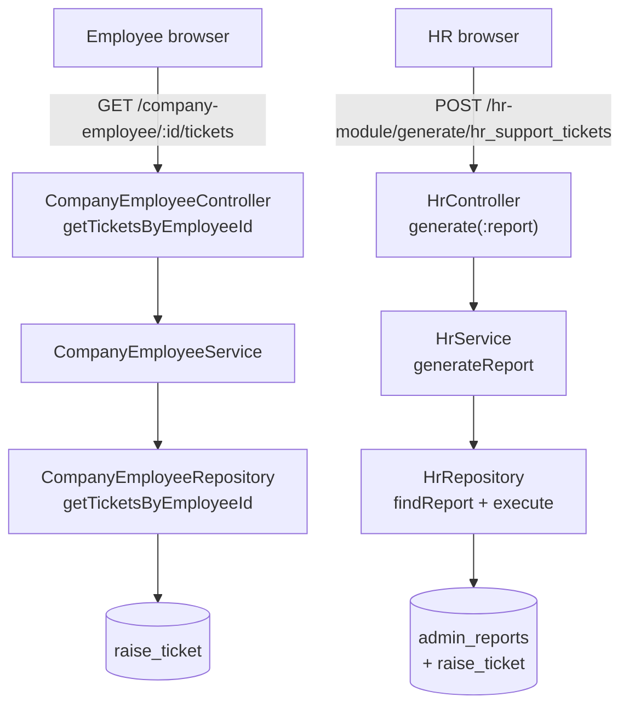

# Support Ticket Listing — Technical Requirements Document (TRD)

**Document Version:** 1.0
**Date:** 2026-05-19
**Author:** IIRM Engineering Team
**Jira Reference:** TBD
**Related Documents:**
- PRD: `support-ticket-listing-PRD.md`
- SDS: `support-ticket-listing-SDS.md`
- Framework: `../hr-module-report-framework-tech-spec.md`

> This document is the authoritative engineering spec. Business intent is
> in the PRD. Screen layout and field mapping are in the SDS. Any
> divergence between code and this document must be resolved by raising
> a change record (`/daksh change support-ticket-listing`) and updating
> the doc before merge.

---

## 1. Architecture Overview

The listing surfaces and the HR raise-ticket action are served by three backend paths:

| Surface | Path | Handler | Why this path |
| --- | --- | --- | --- |
| Employee — own tickets | `GET /company-employee/:employeeId/tickets` | `CompanyEmployeeController.getTicketsByEmployeeId()` (already implemented) | The endpoint is employee-scoped, requires JWT employee identity equality check, and uses a TypeORM QueryBuilder that respects the `@SensitiveField` decryption on related employee columns. |
| HR — company tickets | `POST /hr-module/generate/hr_support_tickets` | `HrController.generate()` via the existing `admin_reports` framework | Per PRD §3.1 and the framework spec, every HR Portal data screen flows through the metadata-driven report pipeline. A new report row is the only addition; no new controller, service or DTO is introduced. |
| HR — raise ticket | `POST /company-employee/:employeeId/tickets` | `CompanyEmployeeController.createTicket()` (already implemented) | The HR Portal reuses the same raise endpoint as the Employee Portal. No new backend work is required. See §2.5. |

The split is deliberate. The employee path already exists and works; reusing it avoids a parallel implementation. The HR path is a brand-new aggregate view and is the canonical use case for the report framework: read-only SELECT, company-scoped via JWT placeholder substitution.



---

## 2. Employee Endpoint — Already in Place

### 2.1 Route

| Property | Value |
| --- | --- |
| Method | `GET` |
| Path | `/company-employee/:employeeId/tickets` |
| Guard | `JwtAuthGuard` (via `@AuthProtected()`) |
| Controller | [CompanyEmployeeController.getTicketsByEmployeeId](../../../../apps/services/ibp-service/src/app/company-employee/company-employee.controller.ts) |
| Service | [CompanyEmployeeService.getTicketsByEmployeeId](../../../../apps/services/ibp-service/src/app/company-employee/company-employee.service.ts) |
| Repository | [CompanyEmployeeRepository.getTicketsByEmployeeId](../../../../apps/services/ibp-service/src/app/company-employee/company-employee.repository.ts) |

### 2.2 Request

| Param | In | Type | Required | Default | Notes |
| --- | --- | --- | --- | --- | --- |
| `employeeId` | path | number | yes | — | Must equal `req.user.employeeId` (see §2.4) |
| `page` | query | number | no | 1 | 1-indexed |
| `limit` | query | number | no | 10 | Capped at 100 server-side |
| `status` | query | `OPEN \| IN_PROGRESS \| RESOLVED \| CLOSED` | no | — | When omitted, all statuses returned |
| `category` | query | `BILLING \| CLAIMS \| POLICY \| ENROLLMENT \| OTHER` | no | — | When omitted, all categories returned |

DTO: [GetTicketsQueryDto](../../../../apps/services/ibp-service/src/app/company-employee/dto/get-tickets.dto.ts).

### 2.3 Response

DTO: [GetTicketsResponseDto](../../../../apps/services/ibp-service/src/app/company-employee/dto/get-tickets.dto.ts) — `{ data: TicketResponseDto[], pagination: { currentPage, totalPages, totalItems, hasNext, hasPrev } }`.

```json
{
  "statusCode": 200,
  "message": "Tickets fetched successfully",
  "data": {
    "data": [
      {
        "id": 412,
        "ticketId": "TKT-20260519-001",
        "employeeId": 241,
        "category": "BILLING",
        "status": "OPEN",
        "priority": "MEDIUM",
        "mailId": "jane.doe@acme.com",
        "escalationDescription": "Mismatch on monthly premium…",
        "documentIds": [1024, 1025],
        "createdAt": "2026-05-19T09:14:22.000Z",
        "updatedAt": "2026-05-19T09:14:22.000Z",
        "employee": { "id": 241, "firstName": "Jane", "lastName": "Doe", "email": "jane.doe@acme.com" }
      }
    ],
    "pagination": { "currentPage": 1, "totalPages": 1, "totalItems": 1, "hasNext": false, "hasPrev": false }
  }
}
```

### 2.5 HR Portal — Raise Ticket (Reuses This Endpoint)

The HR Portal's "Raise Ticket" button calls `POST /company-employee/:employeeId/tickets` — the same endpoint already used by the Employee Portal. No new controller, service, DTO, or migration is introduced for this flow.

| Property | Value |
| --- | --- |
| Method | `POST` |
| Path | `/company-employee/:employeeId/tickets` |
| Guard | `JwtAuthGuard` (via `@AuthProtected()`) |
| Controller | `CompanyEmployeeController.createTicket` (existing) |
| Payload | Identical to the Employee Portal raise form — category, mailId, escalationDescription, priority, documentIds |
| Response | 201 + created ticket record |

The UI for this button is already built and merged on the user's branch. No backend action is required. The raised ticket is immediately queryable via `POST /hr-module/generate/hr_support_tickets` once the TASK-STL-002 seed migration is applied (the INNER JOIN includes it on the next request).

---

### 2.4 Authorisation Hardening Required (Action Item)

The existing controller takes `employeeId` from the URL path and queries on it directly. **The implementation must enforce, before executing the repository call, that `req.user.employeeId === Number(params.employeeId)`.** If the equality check is missing in the current handler, this is a **Phase 1 hardening item** captured here: the listing feature must not ship until the equality check is verified or added. The check must throw `ForbiddenException` (HTTP 403) on mismatch.

Verification steps for the implementer:

1. Open `CompanyEmployeeController.getTicketsByEmployeeId`.
2. Confirm the comparison exists between the JWT-derived employee ID and the path parameter.
3. If missing, add it before the service call. Cover with a unit test that 403s when the IDs mismatch.

This is called out explicitly because BR-STKT-001 (PRD §4) requires it and the same controller hosts other handlers where the check may or may not already be present.

---

## 3. HR Endpoint — New `admin_reports` Report

### 3.1 Route

| Property | Value |
| --- | --- |
| Method | `POST` |
| Path | `/hr-module/generate/hr_support_tickets` |
| Guard | `JwtAuthGuard` + the standard HR role guard already wrapping every report under `HrController` |
| Controller | [HrController.generate](../../../../apps/services/ibp-service/src/app/hr-module/hr.controller.ts) (existing — no change) |
| Service | [HrService.generateReport](../../../../apps/services/ibp-service/src/app/hr-module/hr.service.ts) (existing — no change) |
| Report name | `hr_support_tickets` |

### 3.2 Request

The framework already defines the request shape; no new controller method or DTO is added. The new report consumes:

| Param | In | Type | Required | Default | Substituted into SQL as |
| --- | --- | --- | --- | --- | --- |
| `page` | query | number | no | 1 | applied by framework |
| `limit` | query | number | no | 10 | applied by framework |
| `sort` | query | string `field:ORDER` | no | `created_at:DESC` | applied by framework |
| `companyId` | derived | number | yes | from JWT — see §3.3 | `###companyId###` |
| `status` | body | enum (see §2.2) or null | no | null → ignore filter | `###status###` |
| `category` | body | enum (see §2.2) or null | no | null → ignore filter | `###category###` |

### 3.3 Company-Scoping Rule

`companyId` is **not** accepted from the frontend in any form. The framework resolves it from the JWT (`req.user.companyId`) and substitutes it as `###companyId###` before SQL execution. This matches the pattern used by every other HR report (see framework spec §4). Any future change that exposes a `companyId` query parameter is a security regression and must be blocked at code review.

### 3.4 SQL Template (seeded into `admin_reports.query`)

The substitution syntax follows the framework — `###param###` placeholders. Filter parameters use the framework's standard `IS NULL` fall-through so that omitted filters return everything.

```sql
SELECT
  rt.id,
  rt.ticket_id            AS "ticketId",
  rt.employee_id          AS "employeeId",
  CONCAT(emp.first_name, ' ', emp.last_name) AS "employeeName",
  emp.email_dec           AS "employeeEmail",
  rt.category,
  rt.status,
  rt.priority,
  rt.mail_id              AS "mailId",
  LEFT(rt.escalation_description, 120) AS "descriptionPreview",
  rt.escalation_description AS "description",
  rt.created_at           AS "createdAt"
FROM raise_ticket rt
INNER JOIN policy_enrollment_employee emp
  ON emp.id = rt.employee_id
WHERE emp.company_id = ###companyId###
  AND (###status### IS NULL    OR rt.status   = ###status###)
  AND (###category### IS NULL  OR rt.category = ###category###)
```

The framework appends `ORDER BY ... LIMIT ... OFFSET ...` derived from the `sort`, `page`, `limit` parameters.

> **Encryption note:** `policy_enrollment_employee.email_enc` is decrypted by the `@SensitiveField` decorator at the entity-read layer. Raw SQL executed by the report framework does **not** trigger the decorator. The SQL above therefore selects `email_dec` (the decrypted view column if available) or the equivalent function used elsewhere in HR reports. If neither is available in this codebase, the implementer must omit the email column from the report and add it via a follow-up that uses a database view that decrypts. Confirm before seeding the report row.

### 3.5 Seeding the Report Definition

Three rows are inserted via a new migration:

1. `admin_reports` — one row with `name = 'hr_support_tickets'`, `label = 'HR Support Tickets'`, `endPoint = '/hr-module/generate/hr_support_tickets'`, `query = <SQL above>`, `orderNo = TBD`.
2. `admin_reports_parameters` — three rows: `status` (string, optional, enum-validated client-side), `category` (string, optional, enum-validated client-side), `companyId` (number, required, sourced from JWT).
3. `admin_reports_results_mappings` — one row per column returned by the SQL, naming the JSON key and display label for the frontend.

Migration path: `apps/services/ibp-service/src/migrations/<timestamp>-seed-hr-support-tickets-report.ts`. The migration follows the same pattern as the seed migrations used by other HR reports already in the repo.

### 3.6 Response

The framework returns the standard envelope:

```json
{
  "statusCode": 201,
  "message": "Report generated successfully.",
  "data": {
    "rows": [
      {
        "id": 412,
        "ticketId": "TKT-20260519-001",
        "employeeId": 241,
        "employeeName": "Jane Doe",
        "employeeEmail": "jane.doe@acme.com",
        "category": "BILLING",
        "status": "OPEN",
        "priority": "MEDIUM",
        "mailId": "jane.doe@acme.com",
        "descriptionPreview": "Mismatch on monthly premium…",
        "description": "Mismatch on monthly premium charged for June…",
        "createdAt": "2026-05-19T09:14:22.000Z"
      }
    ],
    "count": 84
  }
}
```

`count` reflects the total matching rows under the active filters (used by the frontend to render pagination controls).

---

## 4. Frontend — Out of Spec Scope

This TRD does not specify any frontend work. Both consuming UIs are owned outside this batch:

- The HR Portal "Support Tickets" screen is already built and merged on the user's branch. It consumes `POST /hr-module/generate/hr_support_tickets` and will begin returning data the moment TASK-STL-002 is applied.
- The Employee Portal "My Raised Tickets" listing is handled outside this spec. The endpoint it consumes (`GET /company-employee/:employeeId/tickets`) already exists and is only being hardened by TASK-STL-001.

Both UIs must respect the API contracts defined in §2 and §3 — any deviation requires a change record.

---

## 5. Database

No schema changes to `raise_ticket`. All required columns and indexes already exist:

| Index | Columns | Purpose |
| --- | --- | --- |
| `idx_raise_ticket_employee_id` | `employee_id` | Employee endpoint primary filter |
| `idx_raise_ticket_status` | `status` | Status filter on HR report |
| `idx_raise_ticket_category` | `category` | Category filter on HR report |
| `idx_raise_ticket_created_at` | `created_at` | Default ORDER BY in both views |

The HR report's `WHERE emp.company_id = ###companyId###` clause relies on the existing index on `policy_enrollment_employee.company_id` (assumed present — confirm during implementation; if absent, add it in the same migration that seeds the report).

---

## 6. Error Handling

| Condition | Response | UI behaviour |
| --- | --- | --- |
| Employee endpoint — missing JWT | 401 from `JwtAuthGuard` | Standard global redirect to login |
| Employee endpoint — JWT employee ≠ path param | 403 (see §2.4) | Inline error banner; section remains empty |
| Employee endpoint — invalid `status`/`category` value | 400 from class-validator | Inline error banner; section remains empty |
| HR endpoint — missing JWT | 401 from framework guard | Standard global redirect to login |
| HR endpoint — JWT user not HR-admin | 403 from role guard | Sidebar item should already be hidden for non-HR users; defence in depth |
| HR endpoint — unknown report name | 404 from `HrService.generateReport` | Indicates seed migration not yet applied — surfaced as 500-equivalent error banner during dev |
| HR endpoint — DB failure during SQL execute | 500 | Generic error banner with Retry |

---

## 7. Performance

Baseline targets (PRD §6):

| Operation | p95 target | Approach |
| --- | --- | --- |
| Employee list (≤ 100 tickets) | < 800 ms | Already met by existing endpoint — single indexed query with join |
| HR list (≤ 10 000 tickets, page 1) | < 1500 ms | Achievable with the existing four indexes + planned `company_id` index. The framework caps `limit` so worst-case page size is bounded. |

Caching is not introduced in Phase 1. If load testing reveals headroom issues, the framework's existing query-result cache (if applicable; see framework spec §10) can be enabled for `hr_support_tickets` without a code change.

---

## 8. Security

| Concern | Mitigation |
| --- | --- |
| Cross-employee data leakage | §2.4 hardening: enforce `req.user.employeeId === path.employeeId` |
| Cross-company data leakage | `###companyId###` is sourced from JWT only; never accepted from client input (PRD BR-STKT-002) |
| SQL injection via filter | The framework substitutes `###param###` placeholders using parameterised query construction — see framework spec §6 |
| Sensitive field exposure | Encrypted email columns must not leak via the report — see §3.4 encryption note |
| Anonymous ticket bleed-through | The HR SQL `INNER JOIN policy_enrollment_employee` naturally excludes rows with `employee_id IS NULL` (PRD BR-STKT-004) |

---

## 9. Test Plan

| Layer | Cases |
| --- | --- |
| Unit — controller | Employee GET 200 happy path; 403 when JWT employee ≠ path; 400 on invalid query enum |
| Unit — repository | Pagination correctness; ordering; filter combinations (status only, category only, both, neither) |
| Integration — HR report | `POST /hr-module/generate/hr_support_tickets` executes, returns expected shape; company scoping holds across two seeded companies; status / category filters return correct subsets; anonymous tickets (`employee_id IS NULL`) excluded |
| Security | Attempt to access another employee's tickets by tampering with the URL ID — must 403 |
| Security | Attempt to inject a `companyId` in the HR call body or query — must be ignored (JWT-sourced wins) |

UI-level acceptance for either consumer is verified by the team owning that consumer; it is not part of this spec's test plan.

---

## 10. Rollout

1. Apply the §2.4 authorization hardening on the existing employee GET endpoint (TASK-STL-001). Deploy.
2. Seed the `hr_support_tickets` report row via migration on staging (TASK-STL-002). Verify with a manual `POST /hr-module/generate/hr_support_tickets` against a seeded company.
3. The already-built HR Portal UI starts consuming the seeded report as soon as the migration lands — no separate frontend deployment is owned by this spec.
4. Monitor error rate and p95 for both endpoints for 7 days post-deploy.

No feature flag is introduced. The Employee endpoint is unchanged in behaviour for legitimate callers (only the unauthorized cross-employee path is now blocked); the HR seed is purely additive. The rollback path for both is a single revert.

---

## 11. Dependencies

| Dependency | Status | Action |
| --- | --- | --- |
| `raise_ticket` entity | Present | None |
| `GET /company-employee/:employeeId/tickets` endpoint | Present | §2.4 hardening check |
| `admin_reports` framework | Present | Seed new report row |
| Decrypted email column / view on `policy_enrollment_employee` | **Confirm** | See §3.4 encryption note |
| Index on `policy_enrollment_employee.company_id` | **Confirm** | If absent, add in the seed migration |

---

## 12. Change Log

| Version | Date | Author | Notes |
| --- | --- | --- | --- |
| 1.0 | 2026-05-19 | IIRM Engineering | Initial draft. |
| 2.0 | 2026-05-19 | IIRM Engineering | Removed frontend implementation plan and UI rollout steps — both consuming UIs are owned outside this spec. Backend contract unchanged. |
