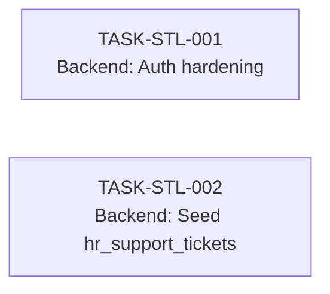

# Support Ticket Listing — Task Breakdown

**Module:** `ibp-service / support-ticket-listing`
**Jira Reference:** TBD
**TRD source:** [support-ticket-listing-TRD.md](support-ticket-listing-TRD.md)
**SDS source:** [support-ticket-listing-SDS.md](support-ticket-listing-SDS.md)
**PRD source:** [support-ticket-listing-PRD.md](support-ticket-listing-PRD.md)
**Date:** 2026-05-19
**Author:** IIRM Engineering Team

> **Scope (backend only):** All UI work is out of scope of this spec batch. The HR Portal "Support Tickets" listing screen, the HR Portal "Raise Ticket" button, and the Employee Portal listing UI are all already built on the user's branch. The "Raise Ticket" button in the HR Portal reuses `POST /company-employee/:employeeId/tickets` — the same endpoint as the Employee Portal; no new backend work is required for it. What remains here is two backend tasks: (1) harden the existing `GET /company-employee/:employeeId/tickets` endpoint with a JWT-vs-path equality check, and (2) seed a new `hr_support_tickets` row into the `admin_reports` framework tables.

---

## What is already in place

| Area | Status | Reference |
| --- | --- | --- |
| `raise_ticket` entity (columns, indexes, enums) | Done | [raise-ticket.entity.ts](../../../../apps/services/service-lib/src/lib/entities/raise-ticket.entity.ts) |
| `POST /company-employee/:employeeId/tickets` raise endpoint | Done | [CompanyEmployeeController](../../../../apps/services/ibp-service/src/app/company-employee/company-employee.controller.ts) |
| `GET /company-employee/:employeeId/tickets` employee list endpoint | Done | Same controller — pagination + status/category filters |
| `GetTicketsQueryDto`, `TicketResponseDto`, `GetTicketsResponseDto` | Done | [get-tickets.dto.ts](../../../../apps/services/ibp-service/src/app/company-employee/dto/get-tickets.dto.ts) |
| `getRaiseTickets(employeeId)` frontend endpoint constant | Done | [endPoints.ts](../../../../apps/ui/ui-lib/src/lib/constants/endPoints.ts) |
| `SupportPage` already fetches employee tickets but does **not render** them | Partial | [SupportPage/index.tsx](../../../../apps/ui/ibp/src/app/pages/SupportPage/index.tsx) — `tickets` / `fetchEmployeeTickets` already wired |
| `admin_reports` framework (controller, service, schema, parameter substitution) | Done | [hr.controller.ts](../../../../apps/services/ibp-service/src/app/hr-module/hr.controller.ts) + framework spec |
| HR Portal "Support Tickets" UI (screen, table, filters, pagination) | Done — already on user's branch | — |
| HR Portal "Raise Ticket" button | Done — already on user's branch; calls `POST /company-employee/:employeeId/tickets` (same as Employee Portal) | No backend work needed |
| Employee Portal "My Raised Tickets" UI | Out of spec scope | Handled outside this batch |
| Authorization equality check on employee GET endpoint | **Verify / harden** | TRD §2.4 — `req.user.employeeId === Number(params.employeeId)` must throw 403 on mismatch |
| Seed migration for `hr_support_tickets` report row | **Not yet created** | TRD §3.5 |
| Decrypted email column / view on `policy_enrollment_employee` | **Confirm before seeding** | TRD §3.4 |
| Index on `policy_enrollment_employee.company_id` | **Confirm; add in seed migration if missing** | TRD §5 |

---

## Integration Pattern

Two backend paths serve the two consumers:

- **Employee Portal** uses the existing employee-scoped REST endpoint `GET /company-employee/:employeeId/tickets`. The endpoint already returns the correct response envelope (`result.data.data` + `result.data.pagination`). The only change needed is the JWT-vs-path equality check (TASK-STL-001).
- **HR Portal** goes through the `admin_reports` framework. No new controller code is added — the framework already handles authentication, parameter substitution, SQL execution and the response envelope. The only artifact is a seed migration inserting three rows: `admin_reports`, `admin_reports_parameters`, `admin_reports_results_mappings`.

`companyId` is **never** accepted from the client for the HR call — the framework substitutes it from the JWT (PRD BR-STKT-002). `employeeId` for the Employee call is read from the path and must equal the JWT-derived value (TRD §2.4).

---

## Task Summary

| ID | Summary | Type | Pts | Sprint | Role | Depends on |
| --- | --- | --- | --- | --- | --- | --- |
| TASK-STL-001 | Backend: Harden employee GET authorization (JWT-vs-path equality check) | Story | 2 | 1 | Mid | — |
| TASK-STL-002 | Backend: Seed `hr_support_tickets` admin_reports migration | Story | 5 | 1 | Senior | — |

**Total:** 7 story points across 2 tasks, both in Sprint 1, fully independent.

> **No UI in scope.** The HR Portal "Support Tickets" screen is already built on the user's branch and will start receiving live data the moment STL-002 lands. The Employee Portal "My Raised Tickets" listing UI is handled outside this spec batch — the API it consumes (`GET /company-employee/:employeeId/tickets`) already exists and is only being hardened by STL-001.

---

## Dependency Graph

The two tasks are independent. Both can start on day 1 — one developer on the auth hardening, another on the seed migration.

---

## Detailed Task List

---

#### TASK-STL-001: Backend — Harden employee GET authorization

- **Type:** Story
- **Parent:** —
- **Epic:** Support Ticket Listing
- **Sprint:** Sprint 1
- **Points:** 2
- **Assignee:** Mid
- **Assigned to:** —
- **Traces to:** [BR-STKT-001, US-STKT-001](support-ticket-listing-PRD.md#4-business-rules)
- **Depends on:** none
- **Description:** Audit the existing `GET /company-employee/:employeeId/tickets` handler and ensure the JWT-derived employee ID is compared against the path parameter before the service call. Add the check if missing.

  **(1) Audit** — Open `CompanyEmployeeController.getTicketsByEmployeeId` ([file](../../../../apps/services/ibp-service/src/app/company-employee/company-employee.controller.ts)). Confirm whether the controller compares `req.user.employeeId` (the JWT-decoded value) to `Number(params.employeeId)`.

  **(2) Add check if missing** — If absent, add an early-exit `ForbiddenException` (HTTP 403) with message `"You do not have access to another employee's tickets"` when the values do not match. Place the check immediately after the `@AuthProtected()` guard returns and before any service call. Do **not** silently coerce or rewrite the path param.

  **(3) Document the rationale** — Add a single-line comment above the check referencing BR-STKT-001 so a reader knows this is intentional and not a leftover.

  **(4) Sibling handlers** — If the same controller hosts other employee-scoped GET handlers without the check, this PR may add the check to those too, but only with the TL's agreement — otherwise raise a separate ticket. The scope here is `getTicketsByEmployeeId` only.

- **Decision budget:**
  - Junior can decide: the exact error message text (must match existing IBP error conventions)
  - Escalate to TL: whether to extend the check to sibling employee-scoped GETs in the same controller (out-of-scope creep)
- **Acceptance criteria:**
  - [ ] Audit comment in the PR description states explicitly whether the check existed before or was added
  - [ ] Equality check is in place and runs before any DB call
  - [ ] Mismatch returns HTTP 403, not 401 and not 404
  - [ ] Original happy-path response (200 + paginated tickets for the correct employee) is unchanged
- **Definition of Done:**
  - [ ] Unit test: 200 when JWT employee ID matches path param
  - [ ] Unit test: 403 when JWT employee ID is a different valid employee in the same company
  - [ ] Unit test: 403 when JWT employee ID is an employee in a different company
  - [ ] Jira ticket updated to Done
  - [ ] PR reviewed and merged

---

#### TASK-STL-002: Backend — Seed `hr_support_tickets` admin_reports migration

- **Type:** Story
- **Parent:** —
- **Epic:** Support Ticket Listing
- **Sprint:** Sprint 1
- **Points:** 5
- **Assignee:** Senior
- **Assigned to:** —
- **Traces to:** [BR-STKT-002, US-STKT-003, US-STKT-004](support-ticket-listing-PRD.md#4-business-rules)
- **Depends on:** none — runs in parallel with STL-001
- **Description:** Add a TypeORM migration that seeds three rows into the `admin_reports` framework tables so that `POST /hr-module/generate/hr_support_tickets` works end-to-end. No new controller, service, or DTO code is added — the framework handles the request.

  **(1) Pre-checks (blocking, do these on day 1)** —
  - **Decrypted email column** — Confirm whether `policy_enrollment_employee` exposes a `email_dec` view column or a decryption SQL function callable from raw SQL ([TRD §3.4](support-ticket-listing-TRD.md#34-sql-template-seeded-into-admin_reportsquery)). If neither exists in this codebase, omit the `employeeEmail` column from the SQL and surface it via a follow-up. **Do not select `email_enc` directly — raw SQL does not trigger the `@SensitiveField` decorator.**
  - **`policy_enrollment_employee.company_id` index** — Confirm an index exists; if absent, add it in this same migration so the WHERE clause is cheap from day one ([TRD §5](support-ticket-listing-TRD.md#5-database)).

  **(2) Migration file** — Create `apps/services/ibp-service/src/migrations/<timestamp>-seed-hr-support-tickets-report.ts`. Model it on the most recent existing seed migration for an HR report in the repo (look in the same folder).

  **(3) `admin_reports` row** — Insert one row with:
  - `name = 'hr_support_tickets'`
  - `label = 'HR Support Tickets'`
  - `endPoint = '/hr-module/generate/hr_support_tickets'`
  - `orderNo` — set to the next contiguous integer after the highest existing `orderNo` (read it as part of the migration; do not hardcode)
  - `query` — the SQL from [TRD §3.4](support-ticket-listing-TRD.md#34-sql-template-seeded-into-admin_reportsquery), adjusted per pre-check (1) if needed

  **(4) `admin_reports_parameters` rows** — Insert three parameter rows for the new report: `companyId` (number, required, JWT-sourced), `status` (string, optional, enum-validated), `category` (string, optional, enum-validated). Match the column shape used by other HR reports in the same table.

  **(5) `admin_reports_results_mappings` rows** — Insert one row per column returned by the SQL (ticketId, employeeId, employeeName, employeeEmail [if available], category, status, priority, mailId, descriptionPreview, description, createdAt). Each row sets the JSON key + display label the HR frontend will use.

  **(6) Down migration** — Delete the three sets of rows by `name` / report FK. The down migration must be safe to run on an environment that does not have the rows.

- **Decision budget:**
  - Junior can decide: the exact `label` text and column display labels
  - Escalate to TL: how to handle the `employeeEmail` column if no decrypted column/function exists (omit vs ship after view is added); whether `companyId` index migration ships in this PR or a separate DBA-owned one
- **Acceptance criteria:**
  - [ ] Migration applies cleanly on a fresh dev DB
  - [ ] Migration's down step removes only the rows it inserted; running down twice does not error
  - [ ] `POST /hr-module/generate/hr_support_tickets` returns 201 with `{ data: { rows: [...], count: N } }` for a seeded company
  - [ ] Request with no body (no filters) returns all tickets for the JWT's company
  - [ ] Request with `{ status: "OPEN" }` returns only OPEN tickets for the JWT's company
  - [ ] Request with `{ category: "BILLING" }` returns only BILLING tickets for the JWT's company
  - [ ] Tickets belonging to employees in a different company are never returned, even if a `companyId` is supplied in the body (must be ignored)
  - [ ] Tickets with `employee_id IS NULL` (anonymous) are never returned (the `INNER JOIN` filters them naturally)
  - [ ] Pagination via `?page=2&limit=5` returns the correct slice; `count` reflects the full filtered total
  - [ ] `?sort=created_at:DESC` (the default) matches `?sort=created_at:ASC` reversed
- **Definition of Done:**
  - [ ] Migration committed and applied to dev
  - [ ] Manual POST verification against dev with at least two seeded companies (one ticket-rich, one empty) recorded in the PR description
  - [ ] Integration test calling the framework endpoint asserts company scoping holds when the JWT switches between two companies
  - [ ] Jira ticket updated to Done
  - [ ] PR reviewed and merged

