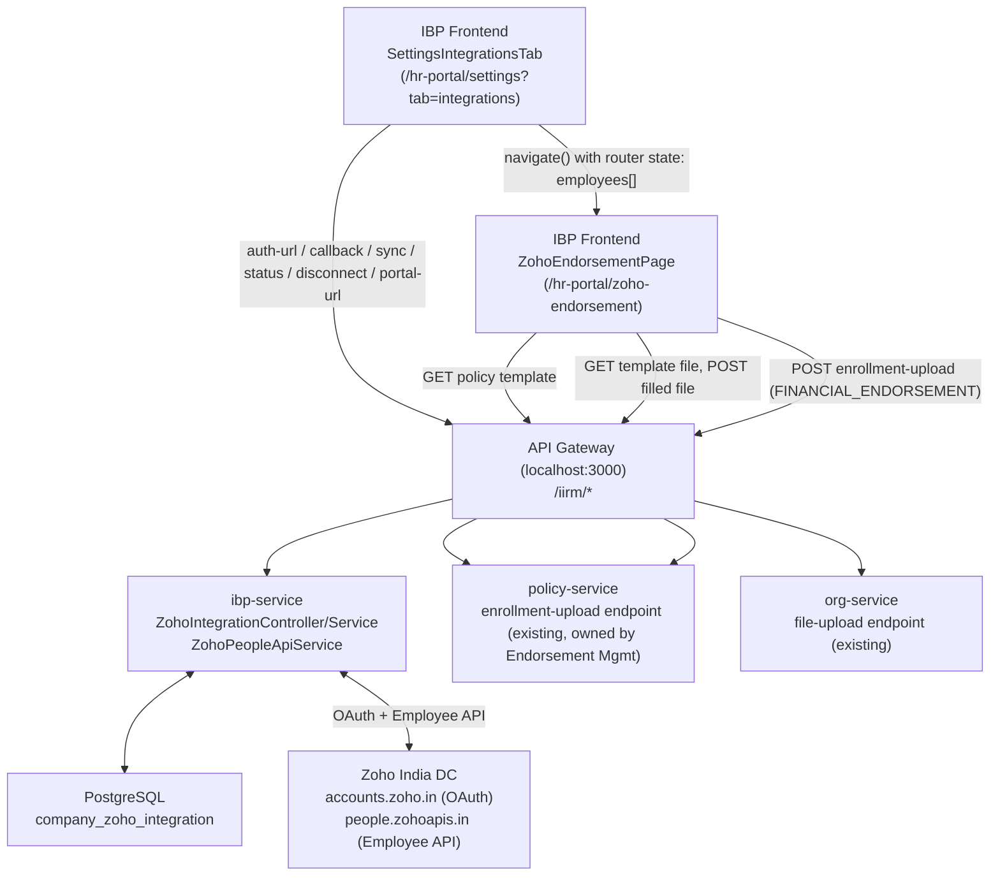
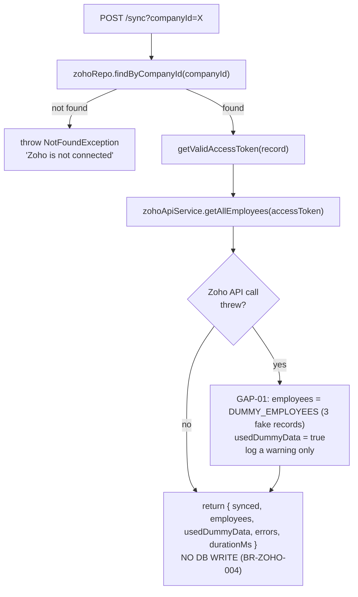
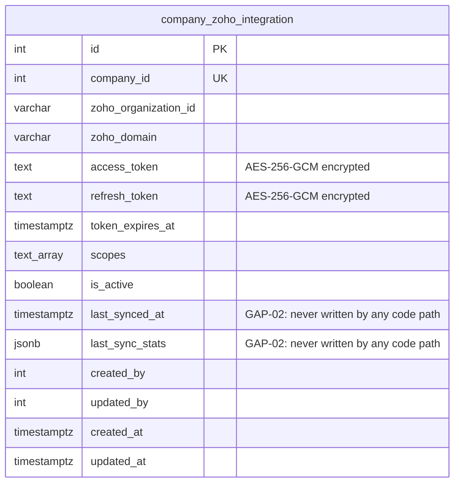

# IBP Zoho People Integration — Technical Requirements Document

**Module:** ZOHO-INTEGRATION
**Product:** Integrated Benefits Portal (IBP) — HR Portal
**Client:** IIRM
**Stage:** 40b — Module TRD
**Authored:** 2026-07-20
**Audience:** Engineering leads, tech leads, QA leads
**PRD Reference:** `zoho-integration-PRD.md`
**Technical reference (full call sequences, error codes, env vars):** `zoho-integration-technical-reference.md`
**Branch:** `feature/zoho-api-integration-hr-module` (251 commits ahead / 527 behind `production`, no PR opened)

> This TRD documents the actual implemented code, reverse-engineered the same way as the PRD (Stage 40a) — it is not a forward design proposal. Every gap the PRD's Gap Register lists is repeated here with the specific technical detail a developer needs to close it. Where this document and the PRD's Gap Register overlap, the GAP-IDs are identical — cross-reference by ID, not by re-reading both documents end to end.

---

## 1. Architecture Overview

The module spans two halves that do not share a request path, plus a hand-off into a third, pre-existing pipeline that this module does not own:

| Phase | Owner | Action |
|---|---|---|
| A — OAuth Connect | `ibp-service` (`ZohoIntegrationController`/`Service`) | Browser-redirect OAuth2 flow; encrypted token storage |
| B — Preview | `ibp-service` (`ZohoIntegrationService.syncEmployees` + `ZohoPeopleApiService`) | Paginated fetch from Zoho; returns to caller, no DB write |
| C — Persist | `org-service` + `policy-service` (pre-existing, unrelated to Zoho, owned by Endorsement Management) | File upload + enrollment-upload endorsement pipeline, reused as-is |



### 1.1 Route Inventory

**Zoho-specific** (`ibp-service`, controller prefix `hr-module/zoho`, gateway path `/iirm/ibp-service/hr-module/zoho/*`):

| Route | Method | Auth | Controller method | Service method | PRD trace |
|---|---|---|---|---|---|
| `/auth-url` | GET | Public (excluded in `auth.guard.ts`) | `getAuthUrl` | `buildAuthUrl` | US-ZOHO-001 |
| `/callback` | GET | Public (excluded in `auth.guard.ts`) | `callback` | `handleCallback` | US-ZOHO-001, BR-ZOHO-002 |
| `/status` | GET | JWT (⚠️ `companyId` not verified — GAP-03) | `getStatus` | `getStatus` | BR-ZOHO-009 |
| `/sync` | POST | JWT (⚠️ `companyId` not verified — GAP-03) | `sync` | `syncEmployees` | US-ZOHO-003, BR-ZOHO-004, BR-ZOHO-007 |
| `/portal-url` | GET | JWT (⚠️ `companyId` not verified — GAP-03) | `getPortalUrl` | `getPortalUrl` | US-ZOHO-008 |
| `/disconnect` | DELETE | JWT (⚠️ `companyId` not verified — GAP-03) | `disconnect` | `disconnect` | US-ZOHO-007, BR-ZOHO-010 |

**Reused, pre-existing** (invoked directly by `ZohoEndorsementDialog.tsx`; owned by Endorsement Management, not this module):

| Route | Method | Service | Purpose |
|---|---|---|---|
| `/iirm/policy-service/policy/:policyId/template` | GET | policy-service | Get the policy's configured data-template document id |
| `/iirm/org-service/file-upload/:documentId/download?moduleKey=inception` | GET | org-service | Download that template as `.xlsx` |
| `/iirm/org-service/file-upload/upload` | POST | org-service | Upload the client-filled `.xlsx` (multipart) |
| `/iirm/policy-service/policy/:policyId/enrollment-upload` | POST | policy-service | Submit as `FINANCIAL_ENDORSEMENT` (BR-ZOHO-008) |

### 1.2 Frontend Route Inventory

Both mounted under `/hr-portal/*` (`app.tsx:180`, `<Route path="/hr-portal/*" element={<HRPortal />} />`):

| Route | Component | Notes |
|---|---|---|
| `/hr-portal/settings` (`?tab=integrations`) | `SettingsIntegrationsTab` | Connect / Sync Now / Status / Disconnect / Go to Zoho People. Also the OAuth callback's redirect target. |
| `/hr-portal/zoho-endorsement` | `ZohoEndorsementPage` → `ZohoEndorsementDialog` | Receives `{ employees }` via router state from the Settings tab; no independent data fetch or guard against direct navigation (GAP-05). |

---

## 2. Phase A — OAuth2 Connect

> **Provisioning `ZOHO_CLIENT_ID`/`ZOHO_CLIENT_SECRET` (DevOps):** these are not created per-environment individually — one Server-based Application client registered at `api-console.zoho.in`, with one Authorized Redirect URI added per environment, covers all of them. Full field-by-field steps (Client Name, Homepage URL, Redirect URIs) are in `zoho-integration-technical-reference.md` → "Zoho API Console Setup".

### 2.1 `GET /auth-url` — `ZohoIntegrationService.buildAuthUrl`

| Param | Source | Notes |
|---|---|---|
| `companyId` | Query param | Required; not verified against JWT (GAP-03) |
| `frontendOrigin` | Query param, falls back to `Origin`/`Referer` header | Used to redirect back to the correct host after callback (multi-subdomain support) |

Generates a random 16-byte hex `state`, stores `{ companyId, expiresAt: now+10min, frontendOrigin }` in an in-memory `Map` (`oauthStateStore` — module-level, not injected, not backed by Redis — GAP-04), and returns:

```
${ZOHO_ACCOUNTS_URL}/oauth/v2/auth
  ?response_type=code
  &client_id=${ZOHO_CLIENT_ID}
  &scope=${ZOHO_SCOPE}
  &redirect_uri=${ZOHO_REDIRECT_URI}
  &access_type=offline
  &state=${state}
```

### 2.2 `GET /callback` — `ZohoIntegrationService.handleCallback` (implements BR-ZOHO-002)

1. Look up `state` in `oauthStateStore`; reject with `BadRequestException` if missing or past `expiresAt`. Delete the entry (single use).
2. `POST ${ZOHO_ACCOUNTS_URL}/oauth/v2/token` with `grant_type=authorization_code`, `client_id`, `client_secret`, `redirect_uri`, `code` (params, not body — Zoho expects query-string-style params on this POST).
3. Zoho returns errors as `{ error, error_description }` on a 200 response rather than a non-2xx status — the service checks `tokenData?.error` explicitly rather than relying on HTTP status.
4. `tokenExpiresAt = now + (expires_in ?? 3600) * 1000`. `zohoDomain` parsed from `api_domain` (strip protocol, take first path segment), defaulting to `"zoho.in"`.
5. If `refresh_token` is present in the response, encrypt it. If absent (re-authorization case, BR-ZOHO-002), load the existing row via `zohoRepo.findByCompanyId` and reuse its already-encrypted `refreshToken` rather than overwriting with `undefined`.
6. `zohoRepo.upsertTokens(companyId, { accessToken (encrypted), refreshToken (encrypted or preserved), tokenExpiresAt, scopes, zohoDomain }, createdBy)` — implements BR-ZOHO-001 (unique per company; update-in-place).
7. Controller returns a `200 text/html` body containing `window.location.replace(...)` back to `${frontendOrigin}/hr-portal/settings?tab=integrations&zoho=connected` (or `...&zoho=error&reason=...` on failure). **Not** an HTTP 302 — the API gateway proxies via axios, which follows 302s server-side, serving the frontend SPA HTML from the wrong origin; a 200 HTML response with a client-side redirect avoids this.

Token encryption uses `FieldEncryptionService` (AES-256-GCM), the shared service used elsewhere in the platform for PII/secret-at-rest fields (Data Contract, PRD §"Cross-module contract items").

### 2.3 Token Refresh — `ZohoIntegrationService.getValidAccessToken` (private, implements BR-ZOHO-003)

Called from `syncEmployees` before every Zoho Employee API fetch:

```
isExpiringSoon = tokenExpiresAt - now < 5 minutes  (or true if tokenExpiresAt is null)
if not expiring soon and accessToken present:
    return decrypt(accessToken)

if no refreshToken:
    throw BadRequestException("reconnect from Settings → Integrations")

POST ${ZOHO_ACCOUNTS_URL}/oauth/v2/token
    grant_type=refresh_token, client_id, client_secret, refresh_token=decrypt(stored)

zohoRepo.updateAccessToken(companyId, encrypt(new access_token), new tokenExpiresAt)
return new access_token
```

### 2.4 `DELETE /disconnect` — `ZohoIntegrationService.disconnect` (implements BR-ZOHO-010)

Best-effort `POST ${ZOHO_ACCOUNTS_URL}/oauth/v2/token/revoke?token=<decrypted refresh_token>` wrapped in a try/catch that swallows failures — local deactivation (`zohoRepo.deactivate`) proceeds regardless. `deactivate` sets `isActive = false` and clears `accessToken`/`refreshToken` to `undefined`.

---

## 3. Phase B — Preview ("Sync Now")

### 3.1 `POST /sync?companyId=` — `ZohoIntegrationService.syncEmployees` (implements BR-ZOHO-004, BR-ZOHO-007)



**GAP-01 implementation detail:** this method's return value is the entire output of the feature for this request. It does not call `zohoRepo.updateSyncStats` (GAP-02 — that method exists on `ZohoIntegrationRepository` but has zero call sites in the codebase, confirmed via repo-wide search). `company_zoho_integration.last_synced_at` / `last_sync_stats` are therefore never updated by any code path, regardless of whether the fetch succeeded or fell back to dummy data.

**To close GAP-01:** replace the silent `DUMMY_EMPLOYEES` substitution with either (a) rethrowing a typed exception the controller maps to a blocking error response, or (b) gating the fallback behind an explicit non-production environment flag and adding a `usedDummyData: true` — driven hard UI banner on the frontend (`SettingsIntegrationsTab`) that cannot be dismissed silently. Product must first resolve Open Question 1 in the PRD before either is implemented.

### 3.2 `ZohoPeopleApiService.getAllEmployees` — Pagination (implements BR-ZOHO-006)

```
sindex = 1, limit = 200
loop:
    batch = fetchPage(accessToken, sindex, limit)
    if batch.length == 0: break
    employees.push(...batch)
    if batch.length < limit: break   // short page = last page
    sindex += limit
    await sleep(400ms)               // Zoho rate limit: 25 req/min
return employees
```

`fetchPage`:

```
GET ${ZOHO_BASE_URL}/api/forms/employee/getRecords
  Authorization: Zoho-oauthtoken <access_token>
  params: { sindex, limit }
  timeout: 30s

on 429: sleep(60s), retry the same page once (recursive call, no backoff beyond the single retry)
on other error: log with response body, rethrow a new Error with status + body detail
```

**Zoho response shape handling:** Zoho returns `{ response: { result: [ { "<recordId>": [employeeObj] }, ... ] } }` — each array element is a single-key object whose value is a 1-item array. `fetchPage` flattens this via `Object.keys(item)[0]` before mapping.

### 3.3 Field Mapping — `ZohoPeopleApiService.mapRecord` (implements, and scopes, BR-ZOHO-012)

| Zoho field | `ZohoEmployee` property |
|---|---|
| `EmployeeID` | `employeeId` |
| `FirstName` | `firstName` |
| `LastName` | `lastName` |
| `EmailID` | `email` |
| `Mobile` | `mobile` |
| `Date_of_birth` | `dateOfBirth` (raw `DD-MMM-YYYY` string — not parsed here) |
| `Gender` | `gender` |
| `Designation` | `designation` |
| `Department` | `department` |
| `Dateofjoining` | `dateOfJoining` |
| `Employeestatus` | `employmentStatus` |
| `Annual_Salary` | `ctc` |

All values are coerced via `(r[key] ?? "").toString().trim()` — every field is a string on the `ZohoEmployee` interface, including dates and the CTC amount. No numeric or date parsing happens in this service; that responsibility is deferred entirely to Phase C's template-fill step, which maps these fields to whatever the target policy's template expects. **GAP-06:** these fixed Zoho field names are unconfirmed against any real customer's Zoho People form configuration, which Zoho allows orgs to customize.

---

## 4. Phase C — Persist via Existing Endorsement Pipeline (implements BR-ZOHO-008)

This phase runs entirely in `ZohoEndorsementDialog.tsx` (frontend) plus pre-existing backend endpoints owned by Endorsement Management. No Zoho-specific backend code is involved.

### 4.1 `handlePreview()` — Build the Filled Template

```
1. GET /iirm/policy-service/policy/:policyId/template
     → templateDocId (from tmplRes.data.data.documentId or tmplRes.data.documentId)
2. GET /iirm/org-service/file-upload/:templateDocId/download?moduleKey=inception
     → arraybuffer
3. XLSX.read(arraybuffer) → workbook; take Sheet 1
4. Parse header row (row 0) only — ignore any dummy/example data rows in the template
5. headerToField(header) → maps each column header to a ZohoEmployee field key
6. rows = employees.map(emp => headers.map(h => String(emp[headerToField(h)] ?? "")))
7. Build a NEW workbook: [headers, ...rows] via XLSX.utils.aoa_to_sheet — preserves
   original column widths (!cols) but drops any dummy rows from the template
8. Produce an .xlsx Blob; filename: endorsement-${insurerPolicyNumber || policyId}-employees.xlsx
```

**GAP-05 detail:** `employees` here comes exclusively from React Router state passed by `SettingsIntegrationsTab`. If this page is reached by direct URL, browser refresh, or back-button, `employees` is empty and there is no fallback fetch (e.g., no re-call to `/sync` or `/status`) — the dialog simply has nothing to preview.

### 4.2 `handleSubmit()` — Upload and Create the Endorsement

```
1. multipart FormData: file=<xlsxBlob>, companyType="policy", companyId=String(policyId),
   documentTypeLid="654321"
   POST /iirm/org-service/file-upload/upload
     → documentId

2. POST /iirm/policy-service/policy/:policyId/enrollment-upload
   {
     documentId,
     documentType: "policy_employee_data",
     employeeCount, dependentCount,
     enrollmentStartDate, enrollmentEndDate,
     endorsementRequestReceivedDate,
     endorsementType: "FINANCIAL_ENDORSEMENT",
     osTicketNumber, isInception, ...
   }
```

This is the exact same request shape a manual bulk-upload endorsement would send. From this point on, the Endorsement Management pipeline (scheduler-based row validation, upsert into `policy_enrollment_employee`, error-file generation, etc. — see `docs/implementation/ibp-service/inception-endorsement/hr-portal-inception-endorsement-trd.md` §4 for that pipeline's internals) takes over identically to a manually-authored file. Nothing about this request marks it as Zoho-sourced.

**Implication (ties to GAP-01):** if the employee data came from the dummy-data fallback, there is no flag or marker anywhere in this request distinguishing it from real Zoho data — it is processed and audited exactly like genuine data by a downstream pipeline that has no way to know otherwise.

---

## 5. Data Model



Migration: `database-migrations/sql/company_zoho_integration.sql` (raw SQL, not a TypeORM migration — must be applied manually against any environment that needs this table; confirm it has actually been run before relying on the table's existence anywhere).

Entity: `apps/services/service-lib/src/lib/entities/company-zoho-integration.entity.ts`.

No new tables are introduced for employee data — Phase C writes into whatever tables the existing `enrollment-upload` pipeline already writes to (see the Endorsement Management TRD's data model for `policy_enrollment_employee`, `policy_enrollment_employee_policy_map`, `endorsement`, `document_processing_file`, etc.).

---

## 6. Security Design

| Concern | Design | Gap |
|---|---|---|
| Token storage | `access_token` and `refresh_token` are AES-256-GCM encrypted at rest via `FieldEncryptionService`, never stored or logged in plaintext | — |
| OAuth CSRF | Random 16-byte `state`, single-use (deleted on first use), 10-minute expiry | GAP-04 — in-memory only, breaks multi-instance |
| `/auth-url`, `/callback` | Explicitly public (excluded from JWT guard in `service-lib/src/lib/auth.guard.ts`) — necessary since the browser hits `/callback` directly from Zoho's redirect with no IBP session context yet | — |
| `/sync`, `/status`, `/portal-url`, `/disconnect` | Require a valid JWT (standard IBP auth guard) | GAP-03 — `companyId` is a caller-supplied query param, never checked against the JWT's own company; any authenticated HR Admin can currently act on another company's Zoho connection |
| Zoho API access token | Never returned to the frontend; used server-side only within `ibp-service` | — |
| Phase C requests | Use the frontend's existing JWT/session via `apiClient` — inherit whatever authorization the existing file-upload/enrollment-upload endpoints already enforce (`HR_ADMIN`, per the Endorsement Management TRD) | Owned by Endorsement Management, not this module |

**GAP-03 remediation:** add the same company-ownership check used elsewhere in the platform — either derive `companyId` from the JWT directly (preferred, removes the parameter entirely) or verify the JWT-authenticated user has access to the supplied `companyId` before proceeding, on all four affected endpoints.

---

## 7. Technology Choices

| Choice | Justification | Alternative considered |
|---|---|---|
| Direct OAuth2 implementation (no library) | Zoho's OAuth flow is simple enough (2 calls) that a full OAuth client library was judged unnecessary overhead | `passport-oauth2` or similar — would add a dependency for a two-endpoint flow |
| In-memory `Map` for OAuth state | Simplest possible CSRF-state store for a single-instance dev/staging setup | Redis — correct choice for production multi-instance, not yet implemented (GAP-04) |
| Client-side Excel template fill (Phase C) | Reuses the existing, already-validated enrollment-upload pipeline instead of writing new server-side employee-upsert logic; the browser already has the previewed data, so building the file client-side avoids a round-trip | Server-side sync directly into `policy_enrollment_employee` — would duplicate validation logic that already exists per-policy in the template/upload pipeline, and would need its own audit trail (rejected — see PRD BR-ZOHO-008 rationale) |
| `xlsx` library for client-side Excel generation | Already used elsewhere in the IBP frontend for template handling | Server-side Excel generation — would require a new backend endpoint |

---

## 8. NFR Design

| Requirement | Design decision |
|---|---|
| Zoho rate limit compliance | 400ms delay between pagination requests (≈2.5 req/sec, under Zoho's 25 req/min cap when combined with page size); automatic 60s wait + single retry on HTTP 429 |
| Token refresh latency | Refresh happens inline, before the employee fetch, adding one extra HTTP round-trip to Zoho only when the token is within 5 minutes of expiry — otherwise zero added latency |
| Large employee rosters | Pagination in 200-record batches avoids a single unbounded request; no explicit upper bound on total pages, so very large orgs will take proportionally longer (no reported timeout handling beyond the per-page 30s axios timeout) |
| Preview → endorsement handoff | Router state (in-memory, same browser tab) — no network round-trip to re-fetch employees between Phase B and Phase C, but see GAP-05 for the direct-navigation cost of this choice |

---

## 9. Testing Strategy

| Layer | Coverage target |
|---|---|
| Unit — `ZohoIntegrationService.handleCallback` | State validation (missing/expired/mismatched), Zoho error-in-200-response handling, refresh-token preservation on re-auth (BR-ZOHO-002 / AC-ZOHO-002) |
| Unit — `getValidAccessToken` | Expiry boundary (< 5 min triggers refresh), missing refresh token throws (BR-ZOHO-003) |
| Unit — `ZohoPeopleApiService.getAllEmployees` | Pagination termination on short page, 429 retry-once behavior, response-shape flattening (BR-ZOHO-006) |
| Unit — `mapRecord` | All field mappings, missing/null Zoho fields coerce to empty string (BR-ZOHO-012) |
| Integration — full connect flow | `auth-url` → simulate Zoho callback → verify encrypted token row created/updated (BR-ZOHO-001, AC-ZOHO-001) |
| Integration — sync with Zoho API failure | Verify `usedDummyData: true` and the `errors` array message — **and** verify this is surfaced as a hard, visible warning in the UI once GAP-01 is resolved (currently this test can only assert the gap exists, per AC-ZOHO-004) |
| Integration — Phase C submission | Verify the filled `.xlsx` matches the policy template's header order and that the enrollment-upload request reaches `policy-service` with `endorsementType: FINANCIAL_ENDORSEMENT` (BR-ZOHO-008, AC-ZOHO-005) |
| Security — cross-company access | Attempt `/sync?companyId=<other company>` with a JWT for a different company; **currently expected to succeed incorrectly** per GAP-03; this test should fail (i.e., the call should be rejected) once GAP-03 is fixed |

---

## 10. Known Implementation Gaps

Identical GAP-IDs to the PRD's Gap Register — this table adds the technical remediation detail; the PRD table is the canonical severity/ownership reference.

| GAP | Detail | Files | Remediation |
|---|---|---|---|
| GAP-01 | Silent dummy-data fallback on any Zoho API failure, no hard error, no confirmed UI-blocking warning. | `zoho-integration.service.ts` (`syncEmployees`, `DUMMY_EMPLOYEES`) | Rethrow a typed exception, or gate behind a non-prod flag + mandatory UI banner. Blocked on PRD Open Question 1. |
| GAP-02 | `updateSyncStats` repository method unused; `last_synced_at`/`last_sync_stats` never persist. | `zoho-integration.repository.ts`, `zoho-integration.service.ts` | Call `updateSyncStats` at the end of `syncEmployees` and/or after a Phase C submission. Blocked on PRD Open Question 2 (which event `last_synced_at` should represent). |
| GAP-03 | `companyId` accepted as caller-supplied query param on 4 endpoints, not verified against JWT. | `zoho-integration.controller.ts` | Derive `companyId` from JWT, or add an explicit ownership check before acting, matching the pattern used elsewhere in the platform. |
| GAP-04 | OAuth CSRF `state` in an in-memory `Map`, not Redis — breaks multi-instance deployment. | `zoho-integration.service.ts` (`oauthStateStore`) | Move to Redis with the same 10-minute TTL, using the existing shared Redis client pattern (`service-lib/src/lib/utils/redis.util.ts`). |
| GAP-05 | No guard on `/hr-portal/zoho-endorsement` for direct navigation/refresh/back-button — relies entirely on router state. | `ZohoEndorsementPage/index.tsx` | Redirect to Settings tab with a message if router state is empty, or add an independent data-load capability (pending PRD Open Question 3). |
| GAP-06 | Zoho field mapping unconfirmed against a real customer's Zoho People form configuration. | `zoho-people-api.service.ts` (`mapRecord`) | Validate against at least one real pilot org before general availability. |
| GAP-07 | Migration not confirmed applied; feature branch not rebased, no PR opened. | `database-migrations/sql/company_zoho_integration.sql`; branch state | Confirm migration has run in every target environment; rebase against current `production` and open a PR before further review. |

---

## 11. Approval

Leave blank. TL/PTL sign-off authority. Required before this branch is merged.

```
Approved by:
Role:
Date:

Approved by:
Role:
Date:
```

---

# END OF TRD
