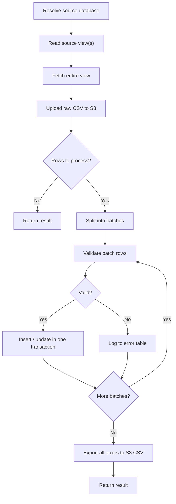
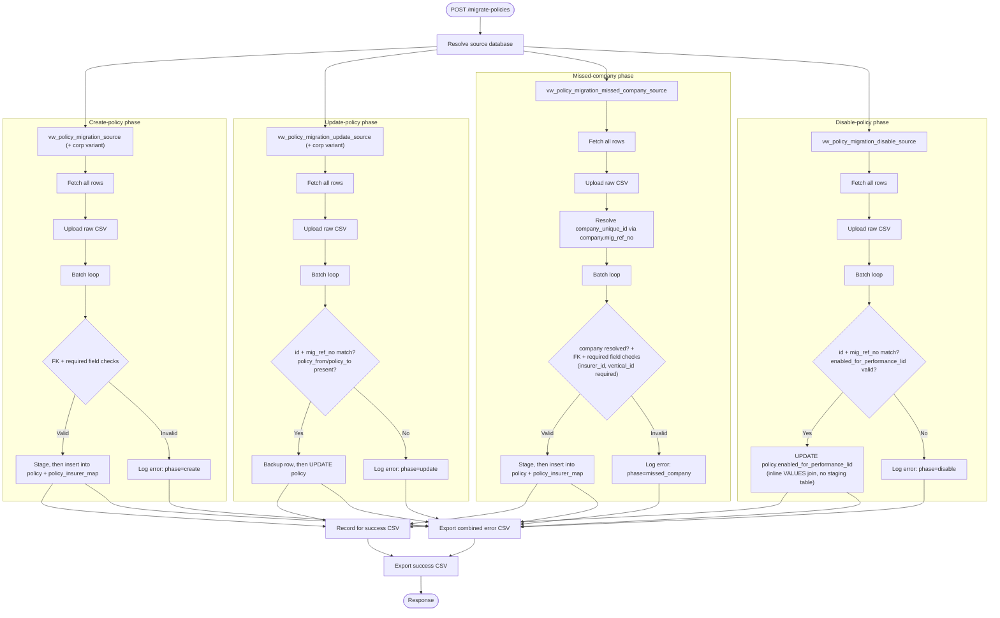
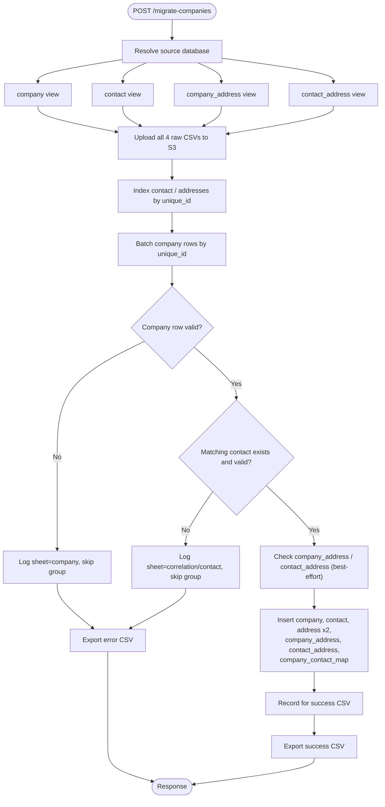

# Policy & Company Migration

These two flows bring policy and company/contact/address data in from an
external source database on a recurring schedule:

1. Read one or more source **views** directly from the source database.
2. Dump each view's raw contents to S3, unprocessed, before touching anything.
3. Read the view(s) in batches, validate, and write to the real tables —
   each batch in its own transaction, so one bad batch doesn't roll back
   earlier ones.
4. Log every validation failure to a permanent DB table, and dump **all**
   of this run's failures to S3 as a CSV.
5. (Company only) also dump a CSV of every successfully-created record.

The data source (view names, batch size, and the source database connection
string) is entirely env-var driven, so the same code can point at any
database exposing the expected view shape.

---

## Policy migration

**Endpoint**: `POST /policy-service/policy/migrate-policies` (optional `?batchSize=`)
**Owning service**: `policy-service` — `PolicyService.migratePolicies()` in
`apps/services/policy-service/src/app/policy/policy.service.ts`

### Data source

The configured view(s) are read directly — no stored procedure is called.
`POLICY_MIGRATION_SOURCE_VIEW`, `POLICY_MIGRATION_UPDATE_SOURCE_VIEW`,
`POLICY_MIGRATION_MISSED_COMPANY_SOURCE_VIEW`, and
`POLICY_MIGRATION_DISABLE_SOURCE_VIEW` each accept either a single view
name or a **comma-separated list** of views sharing an identical schema
(the source splits individual vs. corporate policies into separate views);
when a list is given, each view is queried separately and the rows are
concatenated in application code before the rest of the pipeline runs,
unchanged.

- `vw_policy_migration_source` — the **create**-policy view (~106 columns,
  one row per new policy to migrate).
- `vw_policy_migration_update_source` — the **update**-policy view (same
  shape minus `insurer_id`, plus a leading `id`; one row per existing
  policy whose fields changed at the source).
- `vw_policy_migration_missed_company_source` — the **missed-company** view:
  same shape as the create view, except `company_id` is replaced by
  `company_unique_id` (the company couldn't be resolved at source time, so
  the source hands back its own reference key instead — resolved here
  against `company.mig_ref_no`, see below).
- `vw_policy_migration_disable_source` — the **disable** view: just three
  columns, `id`, `mig_ref_no`, `enabled_for_performance_lid` — one row per
  policy whose performance-tracking flag changed at the source.

`policy_migration_error_log` is a permanent table (accumulates across every
run) recording every validation failure — no resolved/reported bookkeeping,
since the source data is corrected at the origin, not in our database, so a
still-broken row simply reappears on the next run. Columns:
`migration_run_id, batch_number, phase
('create'|'update'|'missed_company'|'disable'), row_seq, mig_ref_no,
column_name, bad_value, reason, created_at`.

The source views themselves live in the client's database and are not
something this app creates or owns. Setup on our side is just
`apps/services/policy-service/src/app/policy/scripts/policy_migration_error_log.sql`
(creates the error table in policy-service's own database).

### Create-policy phase

1. Fetch the entire `vw_policy_migration_source` view (or views, if a
   comma-separated list is configured).
2. Upload it as-is to `migrate_policy_log/migrate_policy_log_<runId>.csv`.
3. Create **one** staging table (`zz_load_policy_<runId>`) and **one** ref
   table (`zz_load_policy_<runId>_ref`) for the whole run.
4. Batch the rows (default 100/batch). Per batch: bulk FK checks (company,
   users, broker, insurer, organisation, org_sbu/vertical/department/branch,
   `lookup_data` for `POLICY_TYPE`), required-field checks (`policy_name`,
   `date_of_income`), duplicate-`mig_ref_no` check against `policy`.
5. Valid rows → multi-row insert into the staging table → `INSERT ... SELECT`
   (with generated ids via `nextval('policy_id_seq')`) into the ref table →
   bulk insert into `policy` and `policy_insurer_map`. All in one transaction
   per batch.
6. Invalid rows → logged to `policy_migration_error_log` with `phase='create'`.

Column lists written to `policy` are always the **intersection** of what
the source view actually provides and what the `policy` table actually has
— a target column the source doesn't supply is left out of the `INSERT`,
so Postgres applies its table default instead of an explicit `NULL`
(important for NOT NULL columns with a default that the source doesn't
carry, e.g. `add_only_dependents`).

### Update-policy phase

1. Fetch the entire `vw_policy_migration_update_source` view (or views).
2. Upload it as-is to `migrate_policy_log/migrate_policy_log_update_<runId>.csv`
   — before any matching/validation, same as the create phase.
3. Match each row to an existing `policy` row by **both** `id` and
   `mig_ref_no` — either alone is not sufficient. Also requires
   `policy_from` and `policy_to` to be present.
4. Also validates every FK column the view actually supplies (and will
   therefore write) — `company_id`, `owner_id`, `broker_id`, `created_by`,
   `updated_by`, `insurer_id`, `organisation_id`, `sbu_id`, `vertical_id`,
   `department_id`, `branch_id`, `policy_type_lid` — against live
   `information_schema`-backed ID sets computed once for the whole phase,
   nullability matching the create phase's rules exactly (`broker_id`,
   `insurer_id`, `vertical_id` are optional; the rest are required). A row
   failing any of these is logged to `policy_migration_error_log` with
   `phase='update'` and excluded from the batch's `UPDATE` — it no longer
   drags the rest of its batch down with it (see the note below).
5. Per batch, in one transaction:
   - Snapshot the pre-update state of every matched row into
     `zz_load_policy_upd_<runId>_bkup` (audit/rollback record).
   - Stage the batch's incoming values into `zz_load_policy_upd_<runId>`.
   - `UPDATE policy SET <every column the source supplies> FROM
     zz_load_policy_upd_<runId> WHERE policy.id = staging.id`, **except**
     `mig_ref_no`/`unique_ref_key` (immutable identifiers, never touched)
     and `ingested_at`/`ingested_mode` (preserved as-is on the existing row).
   - Always stamps `updated_via_sql_lid = 9401`, `updated_via_sql_at = now()`.
6. Unmatched/invalid rows → logged to `policy_migration_error_log` with
   `phase='update'`.

**Fixed defect**: earlier versions of this phase did not pre-validate FK
columns before issuing the `UPDATE` — a single row with an invalid FK
reference anywhere in a batch made the whole batch's `UPDATE` statement
throw, silently dropping every row in that batch from both the success
*and* error counts (since the failure was caught by the outer per-batch
handler and only logged to the console, never to
`policy_migration_error_log`). This is why early runs could show a tiny
`updatedRows` count relative to `updateTotalRows` with `updateErrorRows`
staying at 0 — not a validation gap so much as an invisible one. Fixed by
adding the FK pre-validation described in step 4 above, so a bad row is
now isolated and counted as an error instead of failing its whole batch.

**Fixed defect (the real cause of "success count stuck at ~2 per batch,
every field blank")**: `manager.query()` returns a plain array of rows for
`INSERT ... RETURNING` (as the create phase's code relies on), but for
`UPDATE ... RETURNING` (and presumably `DELETE ... RETURNING`) it instead
returns a **`[rows, affectedCount]` tuple**. The update phase's code
originally treated that tuple itself as the rows array — so `.length` was
always exactly `2` regardless of how many rows the `UPDATE` really
affected, and `.forEach` iterated over `[wholeRowsArray, affectedCount]`,
pushing one success-CSV row for the array (every field `undefined`, since
an array has no `.id`/`.mig_ref_no`/`.policy_name`) and one for the bare
number (same problem) — hence exactly 2 phantom, blank-field "successes"
per batch, no matter how many rows the database actually updated for real
(confirmed against live data: a run reporting `success_count = 14` had, in
fact, correctly updated all 622 real rows — the bookkeeping was wrong, not
the migration). Fixed by destructuring the tuple: `const [updated] = await
manager.query(...)`.

### Missed-company phase

1. Fetch the entire `vw_policy_migration_missed_company_source` view (or
   views, if a comma-separated list is configured).
2. Upload it as-is to
   `migrate_policy_log/migrate_policy_log_missed_company_<runId>.csv`.
3. Resolve `company_id` for every row, once for the whole phase: collect the
   distinct `company_unique_id` values across all rows, look them up against
   `company.mig_ref_no` (`SELECT id, mig_ref_no FROM company WHERE
   mig_ref_no = ANY(...)`), and build an in-memory map. A row whose
   `company_unique_id` is null or has no match in `company.mig_ref_no` is
   rejected with reason `"No company found with this company_unique_id
   (company.mig_ref_no)"` — this is the only way `company_id` is ever
   populated for this phase; there is no fallback staging/backup table.
4. Create **one** staging table (`zz_load_policy_missed_company_<runId>`) and
   **one** ref table (`zz_load_policy_missed_company_<runId>_ref`) for the
   whole run — same shape/pattern as the create phase's staging tables.
5. Batch the rows (default 100/batch). Per batch: company resolution (above)
   plus the same FK checks as the create phase (`owner_id`, `broker_id`,
   `created_by`, `updated_by`, `organisation_id`, `sbu_id`, `vertical_id`,
   `department_id`, `branch_id`, `policy_type_lid`), required-field checks
   (`policy_name`, `date_of_income`), duplicate-`mig_ref_no` check against
   `policy` — **except** `insurer_id` and `vertical_id` are **required** here
   (the create phase treats both as optional).
6. Valid rows → same staging → ref → `policy` + `policy_insurer_map` insert
   pipeline as the create phase, all in one transaction per batch.
7. Invalid rows → logged to `policy_migration_error_log` with
   `phase='missed_company'`.

**Ordering dependency**: this phase depends on the target company already
having `mig_ref_no` populated (set by the company migration's create phase
— see `company_migration_tracking_columns.sql`). This is exactly why the
two daily jobs are scheduled in this order: `COMPANY_MIGRATION_DAILY` runs
first at 02:00 UTC, then `POLICY_MIGRATION_DAILY` runs at 02:30 UTC — so a
company migrated for the first time today already has its `mig_ref_no` set
by the time today's missed-company phase runs. If a company somehow still
fails to resolve (e.g. it errored out of that day's company run too), the
row is logged as an error (no dedup) and retried automatically the next
day once the company exists.

### Disable-policy phase

1. Fetch the entire `vw_policy_migration_disable_source` view (or views, if
   a comma-separated list is configured) — just three columns: `id`,
   `mig_ref_no`, `enabled_for_performance_lid`.
2. Upload it as-is to
   `migrate_policy_log/migrate_policy_log_disable_<runId>.csv`.
3. Bulk-fetch `(id -> mig_ref_no)` for every policy referenced by the view,
   once for the whole phase — same dual-key match rule as the update phase:
   a row is only valid if **both** `id` and `mig_ref_no` match an existing
   `policy` row.
4. Per batch, validate `id`, `mig_ref_no` presence/match, and
   `enabled_for_performance_lid` presence + membership in
   `lookup_data(TOGGLE_TYPE)`.
5. Valid rows → a single `UPDATE policy SET enabled_for_performance_lid =
   v.enabled_for_performance_lid FROM (VALUES ...) AS v(id,
   enabled_for_performance_lid) WHERE policy.id = v.id` per batch, inside a
   transaction — **no staging or backup table**, unlike the update phase,
   since this phase only ever writes the one column and there's nothing
   else to stage.
6. Invalid rows → logged to `policy_migration_error_log` with
   `phase='disable'`.

### Error export

Each phase exports its **own** error CSV — not one combined file — so a
phase's Migration Log entry (see **Migration run log** below) links only to
its own data:

- `migrate_policy_error_log/migrate_policy_error_log_create_<runId>.csv`
- `migrate_policy_error_log/migrate_policy_error_log_update_<runId>.csv`
- `migrate_policy_error_log/migrate_policy_error_log_missed_company_<runId>.csv`
- `migrate_policy_error_log/migrate_policy_error_log_disable_<runId>.csv`

Each is pulled from `policy_migration_error_log WHERE migration_run_id =
<runId> AND phase = <phase>` — the full set for that phase, unfiltered. If
that phase had zero errors this run, no file is uploaded at all (not even
a header-only one) and `error_log`/`errorCsvKey` stays `null`.

### Success export

Each phase also exports its own success CSV, filtered from the same
in-memory `successRecords` list (columns `policy_id, mig_ref_no,
policy_name, phase, timestamp`) accumulated across that phase's batches. As
with the error CSV, a phase with zero successes this run uploads nothing
and its `success_log`/`successCsvKey` stays `null`:

- `migrate_policy_success_log/migrate_policy_success_log_create_<runId>.csv`
- `migrate_policy_success_log/migrate_policy_success_log_update_<runId>.csv`
- `migrate_policy_success_log/migrate_policy_success_log_missed_company_<runId>.csv`
- `migrate_policy_success_log/migrate_policy_success_log_disable_<runId>.csv`

for cross-referencing against the client's source system, mirroring
`migrate_company_success_log` on the company side.

### Configuration

| Var | Default |
|---|---|
| `POLICY_MIGRATION_SOURCE_VIEW` | `vw_policy_migration_source` (comma-separate multiple views with the same schema) |
| `POLICY_MIGRATION_UPDATE_SOURCE_VIEW` | `vw_policy_migration_update_source` (comma-separate for multiple views) |
| `POLICY_MIGRATION_MISSED_COMPANY_SOURCE_VIEW` | `vw_policy_migration_missed_company_source` (comma-separate for multiple views) |
| `POLICY_MIGRATION_DISABLE_SOURCE_VIEW` | `vw_policy_migration_disable_source` (comma-separate for multiple views) |
| `POLICY_MIGRATION_ORDER_COLUMN` | `row_seq` — set to a real, always-populated column such as `mig_ref_no` for a live source |
| `POLICY_MIGRATION_BATCH_SIZE` | `100` |
| `S3_AWS_BUCKET` | Bucket used for all raw/error CSV uploads |

The source database connection itself (`MIGRATION_DB_URL`) is configured
once, shared with company migration — see **Shared source connection** below.

### Schedule

`scheduler-service` runs this daily:
`apps/services/scheduler-service/src/app/scheduler/policy-migration.scheduler.ts`
registers handler key `POLICY_MIGRATION_DAILY`, which calls
`POST {URL_POLICY_SERVICE}/policy/migrate-policies`, authenticating with a
short-lived, self-signed system JWT.

The schedule itself is DB-driven via
`application_scheduler_configuration.scheduler_expression`
(`database-migrations/sql/policy-migration-scheduler-config.sql`, default
`30 2 * * *` — 02:30 UTC daily, deliberately 30 minutes *after*
`COMPANY_MIGRATION_DAILY` so the missed-company phase can resolve
same-day-migrated companies via `company.mig_ref_no` — see **Missed-company
phase** above). Change the time or enable/disable the job by editing that
table's row, not by redeploying code.

---

## Company migration

**Endpoint**: `POST /company/migrate-companies` (optional `?batchSize=`)
**Owning service**: `org-service` — `CompanyService.migrateCompanies()` in
`apps/services/org-service/src/app/company/comapny.service.ts`

Four source sheets feed six target tables: `company`, `contact`, `address`
(used in two roles), `company_address`, `contact_address`, and
`company_contact_map`. Records are correlated across the four sheets by a
shared `unique_id`.

### Data source

The 4 configured views are read directly — no stored procedure is called:

- `vw_company_migration_company_source` — company records
- `vw_company_migration_contact_source` — associated contact records
- `vw_company_migration_company_address_source` — each company's address
- `vw_company_migration_contact_address_source` — each contact's address

`company_migration_error_log` is a permanent table recording every
validation failure. Columns: `migration_run_id, batch_number, unique_id,
sheet_name ('company'|'contact'|'company_address'|'contact_address'|
'correlation'), column_name, bad_value, reason, created_at`.

The 4 source views themselves live in the client's database and are not
something this app creates or owns. Setup on our side is just
`apps/services/org-service/src/app/company/scripts/company_migration_error_log.sql`
(creates the error table in org-service's own database).

### Processing flow

1. Pull all four views in full.
2. Upload each raw view to S3 under `migrate_company_log/` — 4 files:
   `migrate_company_log_company_<runId>.csv`, `..._contact_<runId>.csv`,
   `..._company_address_<runId>.csv`, `..._contact_address_<runId>.csv`.
3. Index contact/company_address/contact_address rows by `unique_id`; the
   company view's distinct `unique_id`s are the batching anchor.
4. Per batch (default 100 `unique_id` groups):
   - Validate the **company** row (required fields + FK checks). Invalid →
     log under `sheet_name='company'`, skip the whole group.
   - Require a matching **contact** row for that `unique_id`. Missing →
     log under `sheet_name='correlation'`, skip the group. Present →
     validate its required fields + FK checks too.
   - `company_address`/`contact_address` are best-effort — a missing or
     invalid address doesn't block the company/contact insert; it's logged
     and only that address is skipped.
   - Valid groups → one transaction: bulk-insert into `company`, `contact`,
     `address` (both address roles share this one target table),
     `company_address`, `contact_address`, `company_contact_map`. Every
     inserted `company` row also gets `mig_ref_no` (= the source
     `unique_id`), `created_via_sql_lid = 9401` (TOGGLE_TYPE_YES), and
     `created_via_sql_at = now()` — see
     `company_migration_tracking_columns.sql`.
5. Export all of this run's errors to
   `migrate_company_error_log/migrate_company_error_log_<runId>.csv` — only
   if there were any; zero errors uploads nothing and leaves `error_log`
   `null`.
6. Export every successfully-created company to
   `migrate_company_success_log/migrate_company_success_log_<runId>.csv` —
   columns `company_id, unique_id, company_name, created_at` — for
   cross-referencing against the source system. Same rule: zero successes
   uploads nothing.

There is still no cross-run **duplicate detection** on the company side:
even though `company.mig_ref_no` now persists the source `unique_id`
(added specifically so the policy migration's missed-company phase can
resolve `company_id` — see **Missed-company phase** above), nothing checks
it before inserting, so re-running against unchanged source data creates
new company/contact/address rows rather than updating or skipping existing
ones. `contact`/`address`/etc. still have no equivalent tracking column at
all. `updated_via_sql_lid`/`updated_via_sql_at` also exist on `company`
today but are unused — no update-company flow exists yet, only create.

### Configuration

| Var | Default |
|---|---|
| `COMPANY_MIGRATION_VIEW_COMPANY` | `vw_company_migration_company_source` |
| `COMPANY_MIGRATION_VIEW_CONTACT` | `vw_company_migration_contact_source` |
| `COMPANY_MIGRATION_VIEW_COMPANY_ADDRESS` | `vw_company_migration_company_address_source` |
| `COMPANY_MIGRATION_VIEW_CONTACT_ADDRESS` | `vw_company_migration_contact_address_source` |
| `COMPANY_MIGRATION_ORDER_COLUMN` | `row_seq` — set to a real, always-populated column such as `unique_id` for a live source |
| `COMPANY_MIGRATION_BATCH_SIZE` | `100` |
| `S3_AWS_BUCKET` | Bucket used for all raw/error/success CSV uploads |

The source database connection itself (`MIGRATION_DB_URL`) is configured
once, shared with policy migration — see **Shared source connection** below.

### Schedule

`apps/services/scheduler-service/src/app/scheduler/company-migration.scheduler.ts`
registers handler key `COMPANY_MIGRATION_DAILY`, which calls
`POST {URL_ORG_SERVICE}/company/migrate-companies` with a self-signed
system JWT. Scheduled via `application_scheduler_configuration`
(`database-migrations/sql/company-migration-scheduler-config.sql`, default
`0 2 * * *` — 02:00 UTC daily, deliberately **before**
`POLICY_MIGRATION_DAILY` (02:30 UTC): the policy migration's missed-company
phase looks up `company.mig_ref_no`, so company records need to land first.

---

## Shared source connection

Both flows read from the same external source database, so the connection
is configured **once** and shared:

`apps/services/service-lib/src/lib/migration-datasource.service.ts` exports
`MigrationDataSourceService`, injected by both `PolicyService` and
`CompanyService`. It lazily opens and caches one `DataSource` per process
and hands that back to whichever service asks. Two ways to configure it,
checked in this order:

- **Discrete fields (preferred)** — `MIGRATION_DB_HOST`, `MIGRATION_DB_PORT`
  (default `5432`), `MIGRATION_DB_USER`, `MIGRATION_DB_PASSWORD`,
  `MIGRATION_DB_NAME`. Avoids URL-encoding pitfalls when the password
  contains characters like `@`.
- **`MIGRATION_DB_URL`** — a full Postgres connection string, used only if
  no `MIGRATION_DB_HOST` is set.

`MIGRATION_DB_SSL=true` adds `{ rejectUnauthorized: false }` to the
connection — required for Supabase-hosted and similarly SSL-enforced
sources. One of the two configuration methods must be set for either flow
to have a source to read from — there is no bundled fallback dataset.

All **writes** for both flows (staging/ref/backup tables, `policy`,
`policy_insurer_map`, `company`, `contact`, `address`, `company_address`,
`contact_address`, `company_contact_map`, both error logs, the company
success log) always go to each service's own database, regardless of where
`MIGRATION_DB_URL` points — only the view reads are redirected.

## Migration run log

`migration_log` (`database-migrations/sql/migration_log.sql` for a fresh
database; `database-migrations/sql/migration-log-generic-rename.sql` to
upgrade a database that still has the old, policy/company-specific
`company_policy_migration_log` table) is a **generic** table — not specific
to policy/company migration — that any system can write its own run
summaries to. Both services write to it at the very end of their migration
method — one row per **event type** per run, not per source record, giving
a quick per-run summary without joining across the two error-log tables or
the success-record CSVs:

| Column | Meaning |
|---|---|
| `system` | The SOURCE system this migrated data came from — NOT our own service name. Both policy and company migration data originate from the client's finops system, so every row today is `'finops'`; any future integration from a different source system just picks its own value, no schema change needed |
| `migration_run_id` | Same run id (`runId`) used everywhere else for that run |
| `event_type` | `policy_create` \| `policy_update` \| `policy_missed` \| `policy_disable` \| `company_create` |
| `executed_at` | Row-insert timestamp (`DEFAULT now()`) |
| `success_count` | Records actually created/updated for that phase (`insertedIntoPolicy`, `updatedRows`, `missedCompanyInsertedIntoPolicy`, or `insertedIntoCompany`) |
| `error_count` | Records that failed validation for that phase |
| `success_log` | S3 key of **that phase's own** success CSV, or `null` if there were no successes, the upload failed, or S3 isn't configured |
| `error_log` | S3 key of **that phase's own** error CSV, same nullability rule |

Each event type gets its own pair of CSVs (see **Error export**/**Success
export** above) — a `policy_missed` row's `success_log`/`error_log` never
points at the create or update phase's files, and vice versa. A phase with
zero rows for a given file (e.g. zero errors) does **not** upload anything
for it — `*_log` stays `null`, distinguishing "nothing to report" from "the
upload failed / S3 isn't configured" only by checking the corresponding
`*_count` column (0 vs. non-zero). A row is still written for all five
event types on every run regardless, so the table also serves as a record
of *when* each phase last ran.

The write itself is best-effort: a failure to insert into `migration_log`
is logged and swallowed, exactly like the S3 CSV uploads — it never turns
an otherwise-successful migration run into an error response.

The Migration Log admin screen's list endpoint
(`GET /policy/company-policy-migration-log` — route path unchanged, only
the underlying table was renamed) accepts an optional `?system=` filter and
also returns a `systems` array (every distinct value currently in the
table), which the frontend uses to populate a "System" dropdown above the
table without hardcoding the list of known systems.

## Shared design points

- **Cron authentication**: both scheduled jobs mint a short-lived (5 minute)
  self-signed JWT (`jwt.sign({ userDetails: { emailId: "system-cron@iirm.com" } },
  JWT_SECRET, { expiresIn: "5m" })`) rather than a real user login. The
  global `AuthGuard` accepts this because it only verifies the JWT's
  signature and claims, not that the user actually exists.
- **Route paths**: neither `policy-service` nor `org-service` sets a global
  route prefix. Hitting them directly is `http://localhost:<port>/policy/...`
  or `http://localhost:<port>/company/...`; the `/iirm/<service>/...` shape
  only applies when going through the API gateway.
- **S3 uploads are non-fatal**: every raw/error/success CSV upload is
  independently wrapped in its own error handling. If S3 is unreachable or
  misconfigured, the corresponding `*CsvKey` field in the response is
  `null` and the underlying database migration is unaffected.
- **Batch isolation**: every phase in both flows wraps its writes in a
  transaction per batch. A failure partway through batch N rolls back only
  batch N — batches 1..N-1 remain committed, and processing continues with
  batch N+1.
- **No overlapping runs**: `migratePolicies()` and `migrateCompanies()` each
  take a Postgres session-level advisory lock (`pg_try_advisory_lock`, held
  on a dedicated `QueryRunner` for the whole call so the lock/unlock pair
  runs on the same connection) before doing any work, and release it in a
  `finally` block. If a second call comes in while one is still running, it
  fails immediately with a clear "already in progress" error instead of
  proceeding. This guards against the global request timeout (see
  `common-bootstrap.ts`) returning a 408 to the caller while the migration
  keeps running in the background (Node doesn't cancel an in-flight `async`
  call just because the HTTP response already went out) — if the caller
  retries, without this lock the second invocation would race the first to
  `UPDATE`/insert the same rows. Use `x-bypass-timeout: true` (already set
  by both scheduler jobs) to prevent the premature timeout at the source;
  the advisory lock is the backstop for any other caller (manual retries, a
  second scheduler instance, etc.) that doesn't send it.

## Operational checklist

1. Confirm the configured view(s) exist in the client's source database for
   both flows. Ensure `policy_migration_error_log` and
   `company_migration_error_log` exist in each owning service's own database
   (run their respective `.sql` scripts once).
2. Set `MIGRATION_DB_URL` (shared by both services) to the client's database
   connection string.
3. Ensure `application_scheduler_configuration` has enabled rows for
   `POLICY_MIGRATION_DAILY` and `COMPANY_MIGRATION_DAILY` if the daily
   schedule should be active.
4. To run a migration on demand: `POST /policy-service/policy/migrate-policies`
   and/or `POST /company/migrate-companies`, each with a valid bearer token.
5. To inspect a run: query `policy_migration_error_log` /
   `company_migration_error_log` by `migration_run_id` (returned in the
   response as `migrationRunId`), or pull the corresponding CSVs from S3
   under `migrate_policy_log/`, `migrate_policy_error_log/`,
   `migrate_policy_success_log/`, `migrate_company_log/`,
   `migrate_company_error_log/`, and `migrate_company_success_log/`.
