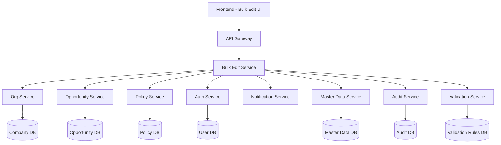

# Technical Specification: Bulk Edit Module

## 1. Overview

### 1.1 Purpose

This document provides the technical specification for implementing the Bulk Edit Module in the Insurance Wellness Hub system. The module enables managers and super admins to perform various bulk operations on multiple records (companies, opportunities, policies) including field updates, ownership transfers, status changes, and other batch modifications.

### 1.2 Scope

- Multi-entity bulk editing (Companies, Opportunities, Policies)
- Field-specific bulk operations with validation
- Conditional bulk updates with preview capabilities
- Template-based bulk operations
- Comprehensive audit trails and change history
- Intelligent notification system
- Role-based permission control
- Error handling and recovery mechanisms

### 1.3 Architecture Context

The module integrates with existing microservices:

- `org-service` (Company management)
- `opportunity-service` (Sales opportunities)
- `policy-service` (Policy management)
- `auth-service` (User authentication & authorization)
- `notification-service` (User notifications)
- `master-data-service` (Lookup data and validation rules)

## 2. Functional Requirements

### 2.1 User Stories Summary

- **US1-1B**: Enhanced filtering and record selection
- **US2-2B**: Comprehensive bulk field editing with conditional logic
- **US3**: Advanced confirmation and preview capabilities
- **US4**: Template and preset management
- **US5**: Detailed audit logging and change history
- **US6**: Intelligent notification system
- **US7**: Field-level permission enforcement
- **US8**: Error handling and recovery
- **US9**: Validation and data integrity

## 3. System Architecture

### 3.1 Service Dependencies



### 3.2 New Service: Bulk Edit Service

**Location**: `/apps/services/bulk-edit-service/`

**Responsibilities**:

- Orchestrate bulk edit operations
- Validate permissions and business rules
- Coordinate with entity services
- Generate audit logs and change history
- Trigger notifications
- Manage templates and presets
- Handle error recovery and rollback

## 4. Database Design

### 4.1 New Tables

#### 4.1.1 Bulk Edit Operations

```sql
CREATE TABLE bulk_edit_operations (
    id UUID PRIMARY KEY DEFAULT gen_random_uuid(),
    operation_id VARCHAR(50) UNIQUE NOT NULL,
    operation_type VARCHAR(30) NOT NULL, -- 'field_update', 'ownership_transfer', 'status_change', etc.
    entity_type VARCHAR(20) NOT NULL, -- 'company', 'opportunity', 'policy'
    template_id UUID NULL,
    performed_by UUID NOT NULL,
    status VARCHAR(20) DEFAULT 'pending', -- 'pending', 'in_progress', 'completed', 'failed', 'partial'
    total_records INTEGER NOT NULL,
    processed_records INTEGER DEFAULT 0,
    failed_records INTEGER DEFAULT 0,
    validation_errors JSONB NULL,
    operation_config JSONB NOT NULL, -- Contains fields to update, values, conditions
    created_at TIMESTAMP DEFAULT NOW(),
    started_at TIMESTAMP NULL,
    completed_at TIMESTAMP NULL,

    FOREIGN KEY (performed_by) REFERENCES users(id),
    FOREIGN KEY (template_id) REFERENCES bulk_edit_templates(id)
);
```

#### 4.1.2 Bulk Edit Details

```sql
CREATE TABLE bulk_edit_details (
    id UUID PRIMARY KEY DEFAULT gen_random_uuid(),
    operation_id UUID NOT NULL,
    entity_id UUID NOT NULL,
    entity_type VARCHAR(20) NOT NULL,
    status VARCHAR(20) DEFAULT 'pending', -- 'pending', 'completed', 'failed', 'skipped'
    changes_applied JSONB NULL, -- Before/after values for each field
    error_message TEXT NULL,
    validation_warnings JSONB NULL,
    processed_at TIMESTAMP NULL,

    FOREIGN KEY (operation_id) REFERENCES bulk_edit_operations(id),
    INDEX idx_operation_entity (operation_id, entity_id),
    INDEX idx_entity_type_id (entity_type, entity_id)
);
```

#### 4.1.3 Bulk Edit Templates

```sql
CREATE TABLE bulk_edit_templates (
    id UUID PRIMARY KEY DEFAULT gen_random_uuid(),
    name VARCHAR(100) NOT NULL,
    description TEXT NULL,
    entity_type VARCHAR(20) NOT NULL,
    operation_type VARCHAR(30) NOT NULL,
    template_config JSONB NOT NULL, -- Field mappings, default values, conditions
    created_by UUID NOT NULL,
    shared_with_department BOOLEAN DEFAULT FALSE,
    shared_with_roles JSONB NULL, -- Array of roles that can use this template
    usage_count INTEGER DEFAULT 0,
    created_at TIMESTAMP DEFAULT NOW(),
    updated_at TIMESTAMP DEFAULT NOW(),

    FOREIGN KEY (created_by) REFERENCES users(id),
    INDEX idx_entity_operation (entity_type, operation_type),
    INDEX idx_created_by (created_by)
);
```

#### 4.1.4 Field Edit History

```sql
CREATE TABLE field_edit_history (
    id UUID PRIMARY KEY DEFAULT gen_random_uuid(),
    entity_id UUID NOT NULL,
    entity_type VARCHAR(20) NOT NULL,
    field_name VARCHAR(100) NOT NULL,
    old_value TEXT NULL,
    new_value TEXT NULL,
    change_type VARCHAR(20) NOT NULL, -- 'bulk_edit', 'individual_edit', 'system_update'
    operation_id UUID NULL, -- Links to bulk operation if applicable
    changed_by UUID NOT NULL,
    change_reason VARCHAR(200) NULL,
    timestamp TIMESTAMP DEFAULT NOW(),

    FOREIGN KEY (changed_by) REFERENCES users(id),
    FOREIGN KEY (operation_id) REFERENCES bulk_edit_operations(id),
    INDEX idx_entity_field (entity_id, field_name),
    INDEX idx_operation_id (operation_id)
);
```

#### 4.1.5 Bulk Edit Permissions

```sql
CREATE TABLE bulk_edit_permissions (
    id UUID PRIMARY KEY DEFAULT gen_random_uuid(),
    role VARCHAR(50) NOT NULL,
    entity_type VARCHAR(20) NOT NULL,
    field_name VARCHAR(100) NOT NULL,
    operation_type VARCHAR(30) NOT NULL,
    permission_level VARCHAR(20) NOT NULL, -- 'none', 'read', 'edit', 'admin'
    conditions JSONB NULL, -- Additional conditions for permission
    created_at TIMESTAMP DEFAULT NOW(),

    UNIQUE (role, entity_type, field_name, operation_type),
    INDEX idx_role_entity (role, entity_type)
);
```

### 4.2 Modified Tables

#### 4.2.1 Add Bulk Edit Metadata to Entities

```sql
-- Add to companies, opportunities, policies tables
ALTER TABLE companies ADD COLUMN bulk_edit_locked BOOLEAN DEFAULT FALSE;
ALTER TABLE companies ADD COLUMN bulk_edit_locked_by UUID NULL;
ALTER TABLE companies ADD COLUMN bulk_edit_locked_at TIMESTAMP NULL;
ALTER TABLE companies ADD COLUMN last_bulk_edit_operation UUID NULL;

ALTER TABLE opportunities ADD COLUMN bulk_edit_locked BOOLEAN DEFAULT FALSE;
ALTER TABLE opportunities ADD COLUMN bulk_edit_locked_by UUID NULL;
ALTER TABLE opportunities ADD COLUMN bulk_edit_locked_at TIMESTAMP NULL;
ALTER TABLE opportunities ADD COLUMN last_bulk_edit_operation UUID NULL;

ALTER TABLE policies ADD COLUMN bulk_edit_locked BOOLEAN DEFAULT FALSE;
ALTER TABLE policies ADD COLUMN bulk_edit_locked_by UUID NULL;
ALTER TABLE policies ADD COLUMN bulk_edit_locked_at TIMESTAMP NULL;
ALTER TABLE policies ADD COLUMN last_bulk_edit_operation UUID NULL;
```

## 5. API Design

### 5.1 Bulk Edit Service APIs

#### 5.1.1 Get Editable Fields

```typescript
GET /api/bulk-edit/fields/{entityType}
Query Parameters:
- userRole: string
- recordIds?: string[] (to check field compatibility)

Response:
{
  editableFields: Array<{
    fieldName: string;
    fieldType: string; // 'text', 'number', 'select', 'date', 'boolean'
    displayName: string;
    isRequired: boolean;
    validationRules: object;
    selectOptions?: Array<{value: string, label: string}>;
    permissions: {
      canEdit: boolean;
      requiresApproval: boolean;
      restrictedValues?: string[];
    };
  }>;
  commonFields: string[]; // Fields that exist across all selected records
}
```

#### 5.1.2 Validate Bulk Edit

```typescript
POST /api/bulk-edit/validate
Body:
{
  entityType: string;
  entityIds: string[];
  operations: Array<{
    field: string;
    operation: string; // 'set', 'append', 'clear', 'conditional_set'
    value: any;
    condition?: {
      field: string;
      operator: string; // 'equals', 'not_equals', 'contains', 'is_empty'
      value: any;
    };
  }>;
}

Response:
{
  valid: boolean;
  validationResults: Array<{
    entityId: string;
    entityName: string;
    validOperations: string[];
    invalidOperations: Array<{
      field: string;
      error: string;
      suggestedValue?: any;
    }>;
    warnings: string[];
  }>;
  summary: {
    totalRecords: number;
    validRecords: number;
    recordsWithWarnings: number;
    recordsWithErrors: number;
  };
}
```

#### 5.1.3 Preview Bulk Edit

```typescript
POST / api / bulk - edit / preview;
Body: {
  // Same as validate endpoint
}

Response: {
  preview: Array<{
    entityId: string;
    entityName: string;
    changes: Array<{
      field: string;
      currentValue: any;
      newValue: any;
      changeType: string; // 'update', 'no_change', 'conditional_skip'
    }>;
    willBeProcessed: boolean;
    skipReason?: string;
  }>;
  operationSummary: {
    totalRecords: number;
    recordsToUpdate: number;
    recordsToSkip: number;
    estimatedDuration: number; // in seconds
  }
}
```

#### 5.1.4 Execute Bulk Edit

```typescript
POST /api/bulk-edit/execute
Body:
{
  entityType: string;
  entityIds: string[];
  operations: Array<BulkEditOperation>;
  templateId?: string;
  reason?: string;
  notificationPreferences?: {
    notifyOnCompletion: boolean;
    notifyStakeholders: boolean;
    customMessage?: string;
  };
}

Response:
{
  operationId: string;
  status: string;
  estimatedDuration: number;
  batchSize: number;
  totalBatches: number;
}
```

#### 5.1.5 Get Operation Progress

```typescript
GET /api/bulk-edit/operations/{operationId}/progress

Response:
{
  operationId: string;
  status: string; // 'pending', 'in_progress', 'completed', 'failed', 'partial'
  progress: {
    currentBatch: number;
    totalBatches: number;
    processedRecords: number;
    totalRecords: number;
    failedRecords: number;
    percentage: number;
    estimatedTimeRemaining: number;
  };
  currentPhase: string; // 'validation', 'processing', 'notification', 'cleanup'
  recentErrors?: Array<{
    entityId: string;
    entityName: string;
    error: string;
    timestamp: string;
  }>;
}
```

#### 5.1.6 Template Management

```typescript
// Save Template
POST /api/bulk-edit/templates
Body:
{
  name: string;
  description?: string;
  entityType: string;
  operationType: string;
  templateConfig: object;
  shareWithDepartment?: boolean;
  shareWithRoles?: string[];
}

// Get Templates
GET /api/bulk-edit/templates
Query Parameters:
- entityType?: string
- operationType?: string
- includeShared?: boolean

// Apply Template
POST /api/bulk-edit/templates/{templateId}/apply
Body:
{
  entityIds: string[];
  overrides?: object; // Override template values
}
```

### 5.2 Enhanced Entity Service APIs

#### 5.2.1 Enhanced Filtering with Bulk Edit Support

```typescript
// Enhanced existing list APIs
GET /api/{entities}
Query Parameters:
- ownerType?: string[]
- status?: string[]
- bulkEditMode?: boolean
- fieldsToLoad?: string[] // Optimize data loading for bulk operations
- lockCheck?: boolean // Check if records are locked for bulk editing

Response:
{
  data: Array<Entity>;
  pagination: PaginationInfo;
  bulkEditInfo?: {
    lockedRecords: string[];
    editableFields: string[];
    commonFieldValues: object; // Common values across records
  };
}
```

#### 5.2.2 Bulk Update API

```typescript
PATCH /api/{entities}/bulk-update
Body:
{
  updates: Array<{
    entityId: string;
    fields: object; // field-value pairs
    metadata: {
      operationId: string;
      changedBy: string;
      changeReason?: string;
    };
  }>;
  lockRecords?: boolean; // Prevent concurrent modifications
}

Response:
{
  results: Array<{
    entityId: string;
    status: 'success' | 'failed' | 'skipped';
    error?: string;
    updatedFields?: string[];
  }>;
  summary: {
    successful: number;
    failed: number;
    skipped: number;
  };
}
```

## 6. Frontend Implementation

### 6.1 Component Structure

```
apps/ui/admin/src/components/bulk-edit/
├── BulkEditProvider.tsx          # Context provider for bulk edit state
├── BulkEditToolbar.tsx           # Main toolbar with action buttons
├── RecordSelector.tsx            # Enhanced record selection with filters
├── FieldEditor.tsx               # Dynamic field editing component
├── ConditionalEditor.tsx         # Conditional logic editor
├── PreviewDialog.tsx             # Preview changes before applying
├── ProgressTracker.tsx           # Real-time progress tracking
├── TemplateManager.tsx           # Template save/load/apply
├── ValidationDisplay.tsx         # Show validation errors and warnings
├── ChangeHistoryViewer.tsx       # View change history for records
└── BulkEditWizard.tsx           # Step-by-step bulk edit wizard
```

### 6.2 State Management

#### 6.2.1 Enhanced Redux Store Structure

```typescript
interface BulkEditState {
  // Selection and filtering
  selection: {
    entityType: "company" | "opportunity" | "policy";
    filters: {
      ownerTypes: string[];
      status: string;
      dateRange?: { start: Date; end: Date };
      customFilters: Record<string, any>;
    };
    selectedIds: string[];
    allRecords: Entity[];
    lockedRecords: string[];
  };

  // Field editing
  fieldEditor: {
    availableFields: FieldDefinition[];
    commonFields: string[];
    operations: BulkEditOperation[];
    conditionalRules: ConditionalRule[];
    validationResults: ValidationResult[];
  };

  // Templates
  templates: {
    available: BulkEditTemplate[];
    current?: BulkEditTemplate;
    isDirty: boolean;
  };

  // Operation tracking
  operation: {
    current?: BulkEditOperation;
    history: BulkEditOperation[];
    progress?: OperationProgress;
  };

  // UI state
  ui: {
    activeStep: number; // Wizard step
    showPreview: boolean;
    showProgress: boolean;
    showValidation: boolean;
    errors: string[];
    warnings: string[];
  };
}
```

#### 6.2.2 Key Actions

```typescript
// Selection actions
setEntityType(type: string)
updateFilters(filters: FilterConfig)
selectRecords(ids: string[])
selectAllVisible()
clearSelection()
checkRecordLocks(ids: string[])

// Field editing actions
loadAvailableFields(entityType: string, recordIds: string[])
addOperation(operation: BulkEditOperation)
updateOperation(index: number, operation: BulkEditOperation)
removeOperation(index: number)
addConditionalRule(rule: ConditionalRule)
validateOperations()
previewChanges()

// Template actions
loadTemplates(entityType?: string)
saveTemplate(template: BulkEditTemplate)
applyTemplate(templateId: string, overrides?: object)
deleteTemplate(templateId: string)

// Operation actions
executeOperations()
trackProgress(operationId: string)
retryFailedRecords(operationId: string)
rollbackOperation(operationId: string)
```

### 6.3 Component Specifications

#### 6.3.1 FieldEditor Component

```typescript
interface FieldEditorProps {
  availableFields: FieldDefinition[];
  operations: BulkEditOperation[];
  onOperationsChange: (operations: BulkEditOperation[]) => void;
  validationResults: ValidationResult[];
}

// Features:
// - Dynamic field selector with type-aware editors
// - Operation type selection (set, append, clear, conditional)
// - Conditional logic builder with visual editor
// - Real-time validation with error/warning display
// - Field dependency handling
// - Bulk value suggestions based on existing data
```

#### 6.3.2 PreviewDialog Component

```typescript
interface PreviewDialogProps {
  open: boolean;
  records: Entity[];
  operations: BulkEditOperation[];
  previewData: PreviewResult[];
  onConfirm: () => void;
  onCancel: () => void;
  onExcludeRecords: (recordIds: string[]) => void;
}

// Features:
// - Tabular view of all changes with before/after values
// - Record exclusion capability
// - Change summary with counts and statistics
// - Export preview to CSV/Excel
// - Expandable details for complex fields
// - Color-coded change indicators
```

#### 6.3.3 ConditionalEditor Component

```typescript
interface ConditionalEditorProps {
  fields: FieldDefinition[];
  rule: ConditionalRule;
  onChange: (rule: ConditionalRule) => void;
  onRemove: () => void;
}

// Features:
// - Visual condition builder (If-Then-Else)
// - Multiple condition support with AND/OR logic
// - Field-aware operators and values
// - Nested condition groups
// - Rule testing against sample data
// - Rule templates for common scenarios
```

## 7. Business Logic Implementation

### 7.1 Enhanced Permission System

#### 7.1.1 Field-Level Permission Validator

```typescript
class FieldPermissionValidator {
  async canEditField(
    user: User,
    entityType: string,
    fieldName: string,
    operation: string
  ): Promise<boolean> {
    const permission = await this.getFieldPermission(
      user.role,
      entityType,
      fieldName,
      operation
    );

    // Check base permission
    if (permission.level === "none") return false;

    // Check additional conditions
    if (permission.conditions) {
      return this.evaluateConditions(permission.conditions, user, entityType);
    }

    return permission.level === "edit" || permission.level === "admin";
  }

  async getBulkEditPermissions(
    user: User,
    entityType: string
  ): Promise<FieldPermission[]> {
    return this.permissionRepository.findBy({
      role: user.role,
      entityType,
      permissionLevel: In(["edit", "admin"]),
    });
  }

  async validateBulkEditRequest(
    user: User,
    request: BulkEditRequest
  ): Promise<ValidationResult> {
    const errors = [];
    const warnings = [];

    for (const operation of request.operations) {
      const canEdit = await this.canEditField(
        user,
        request.entityType,
        operation.field,
        operation.operation
      );

      if (!canEdit) {
        errors.push(`No permission to edit field: ${operation.field}`);
      }

      // Check sensitive field warnings
      if (
        this.isSensitiveField(operation.field) &&
        !user.hasRole("SENIOR_MANAGER")
      ) {
        warnings.push(
          `Editing sensitive field ${operation.field} requires additional approval`
        );
      }
    }

    return { valid: errors.length === 0, errors, warnings };
  }
}
```

#### 7.1.2 Conditional Update Engine

```typescript
class ConditionalUpdateEngine {
  async evaluateConditions(
    entity: Entity,
    conditions: ConditionalRule[]
  ): Promise<boolean> {
    for (const condition of conditions) {
      const result = await this.evaluateCondition(entity, condition);
      if (!result) return false;
    }
    return true;
  }

  private async evaluateCondition(
    entity: Entity,
    condition: ConditionalRule
  ): Promise<boolean> {
    const fieldValue = this.getFieldValue(entity, condition.field);

    switch (condition.operator) {
      case "equals":
        return fieldValue === condition.value;
      case "not_equals":
        return fieldValue !== condition.value;
      case "contains":
        return fieldValue?.toString().includes(condition.value);
      case "is_empty":
        return !fieldValue || fieldValue === "";
      case "is_not_empty":
        return fieldValue && fieldValue !== "";
      case "greater_than":
        return Number(fieldValue) > Number(condition.value);
      case "less_than":
        return Number(fieldValue) < Number(condition.value);
      case "in_list":
        return (
          Array.isArray(condition.value) && condition.value.includes(fieldValue)
        );
      case "date_before":
        return new Date(fieldValue) < new Date(condition.value);
      case "date_after":
        return new Date(fieldValue) > new Date(condition.value);
      default:
        throw new Error(`Unknown operator: ${condition.operator}`);
    }
  }

  async applyConditionalUpdates(
    entities: Entity[],
    operations: BulkEditOperation[]
  ): Promise<UpdateResult[]> {
    const results = [];

    for (const entity of entities) {
      const entityResult = {
        entityId: entity.id,
        updates: [],
        skipped: [],
        errors: [],
      };

      for (const operation of operations) {
        try {
          if (operation.condition) {
            const shouldApply = await this.evaluateConditions(entity, [
              operation.condition,
            ]);
            if (!shouldApply) {
              entityResult.skipped.push({
                field: operation.field,
                reason: "Condition not met",
              });
              continue;
            }
          }

          const updateResult = await this.applyFieldUpdate(entity, operation);
          entityResult.updates.push(updateResult);
        } catch (error) {
          entityResult.errors.push({
            field: operation.field,
            error: error.message,
          });
        }
      }

      results.push(entityResult);
    }

    return results;
  }
}
```

### 7.2 Advanced Bulk Edit Orchestrator

#### 7.2.1 Batch Processing with Error Recovery

```typescript
class BulkEditOrchestrator {
  async executeBulkEdit(request: BulkEditRequest): Promise<BulkEditResult> {
    const operation = await this.createOperation(request);

    try {
      // Lock selected records to prevent concurrent modifications
      await this.lockRecords(request.entityIds, operation.id);

      // Validate all operations before starting
      const validation = await this.validateAllOperations(request);
      if (!validation.valid && validation.errors.length > 0) {
        throw new Error(`Validation failed: ${validation.errors.join(", ")}`);
      }

      // Process in batches with error recovery
      const batchSize = this.calculateOptimalBatchSize(request);
      const batches = this.createBatches(request.entityIds, batchSize);

      let totalProcessed = 0;
      let totalFailed = 0;

      for (let i = 0; i < batches.length; i++) {
        const batchResult = await this.processBatch(
          operation.id,
          batches[i],
          request,
          i + 1,
          batches.length
        );

        totalProcessed += batchResult.processed;
        totalFailed += batchResult.failed;

        // Update progress
        await this.updateProgress(operation.id, {
          currentBatch: i + 1,
          processedRecords: totalProcessed,
          failedRecords: totalFailed,
        });

        // Allow for graceful cancellation
        if (await this.shouldCancelOperation(operation.id)) {
          break;
        }
      }

      await this.completeOperation(operation.id);
      await this.sendNotifications(operation);
      await this.unlockRecords(request.entityIds);

      return {
        success: true,
        operationId: operation.id,
        totalProcessed,
        totalFailed,
      };
    } catch (error) {
      await this.failOperation(operation.id, error);
      await this.unlockRecords(request.entityIds);
      throw error;
    }
  }

  private async processBatch(
    operationId: string,
    entityIds: string[],
    request: BulkEditRequest,
    batchNumber: number,
    totalBatches: number
  ): Promise<BatchResult> {
    const batchResults = {
      processed: 0,
      failed: 0,
      errors: [],
    };

    // Load entities for this batch
    const entities = await this.loadEntities(request.entityType, entityIds);

    // Apply conditional logic and create update plan
    const updatePlan = await this.conditionalEngine.applyConditionalUpdates(
      entities,
      request.operations
    );

    // Execute updates in parallel with error handling
    const updatePromises = updatePlan.map(async (plan) => {
      try {
        if (plan.updates.length > 0) {
          await this.executeEntityUpdate(
            request.entityType,
            plan.entityId,
            plan.updates,
            operationId
          );
          await this.logSuccess(operationId, plan.entityId, plan.updates);
          batchResults.processed++;
        }
      } catch (error) {
        await this.logFailure(operationId, plan.entityId, error);
        batchResults.failed++;
        batchResults.errors.push({
          entityId: plan.entityId,
          error: error.message,
        });
      }
    });

    await Promise.allSettled(updatePromises);
    return batchResults;
  }

  private calculateOptimalBatchSize(request: BulkEditRequest): number {
    // Calculate based on operation complexity and entity type
    const baseSize = 20;
    const complexityFactor = request.operations.length * 0.5;
    const entityFactor = request.entityType === "policy" ? 0.8 : 1.0; // Policies might be more complex

    return Math.max(
      5,
      Math.floor((baseSize / complexityFactor) * entityFactor)
    );
  }
}
```

### 7.3 Advanced Notification System

#### 7.3.1 Intelligent Notification Manager

```typescript
class IntelligentNotificationManager {
  async sendBulkEditNotifications(operation: BulkEditOperation) {
    const notificationConfig = await this.getNotificationConfig(
      operation.performedBy
    );
    const affectedUsers = await this.getAffectedUsers(operation);

    // Analyze the types of changes made
    const changeAnalysis = await this.analyzeChanges(operation);

    // Send different notifications based on change types
    if (changeAnalysis.ownershipChanges.length > 0) {
      await this.sendOwnershipChangeNotifications(
        changeAnalysis.ownershipChanges,
        operation
      );
    }

    if (changeAnalysis.statusChanges.length > 0) {
      await this.sendStatusChangeNotifications(
        changeAnalysis.statusChanges,
        operation
      );
    }

    if (changeAnalysis.criticalFieldChanges.length > 0) {
      await this.sendCriticalFieldNotifications(
        changeAnalysis.criticalFieldChanges,
        operation
      );
    }

    // Send summary to operation performer
    await this.sendOperationSummary(operation);
  }

  private async analyzeChanges(
    operation: BulkEditOperation
  ): Promise<ChangeAnalysis> {
    const details = await this.bulkEditRepository.getOperationDetails(
      operation.id
    );

    const analysis: ChangeAnalysis = {
      ownershipChanges: [],
      statusChanges: [],
      criticalFieldChanges: [],
      regularFieldChanges: [],
    };

    for (const detail of details) {
      const changes = detail.changesApplied;

      for (const [field, change] of Object.entries(changes)) {
        if (this.isOwnershipField(field)) {
          analysis.ownershipChanges.push({
            entityId: detail.entityId,
            field,
            oldValue: change.oldValue,
            newValue: change.newValue,
          });
        } else if (this.isStatusField(field)) {
          analysis.statusChanges.push({
            entityId: detail.entityId,
            field,
            oldValue: change.oldValue,
            newValue: change.newValue,
          });
        } else if (this.isCriticalField(field)) {
          analysis.criticalFieldChanges.push({
            entityId: detail.entityId,
            field,
            oldValue: change.oldValue,
            newValue: change.newValue,
          });
        }
      }
    }

    return analysis;
  }

  private async sendOwnershipChangeNotifications(
    changes: OwnershipChange[],
    operation: BulkEditOperation
  ) {
    const groupedByOwner = this.groupChangesByOwner(changes);

    for (const [newOwnerId, ownerChanges] of Object.entries(groupedByOwner)) {
      const newOwner = await this.userService.findById(newOwnerId);
      const oldOwners = await this.getOldOwners(ownerChanges);

      // Notify new owner
      await this.notificationService.send({
        userId: newOwner.id,
        type: "BULK_OWNERSHIP_ASSIGNED",
        title: `${ownerChanges.length} Records Assigned to You`,
        message: `You have been assigned ${ownerChanges.length} ${operation.entityType}(s) through bulk edit`,
        data: {
          operationId: operation.id,
          entityType: operation.entityType,
          count: ownerChanges.length,
          entities: ownerChanges.map((c) => ({
            id: c.entityId,
            field: c.field,
          })),
        },
      });

      // Notify old owners (if active)
      for (const oldOwner of oldOwners) {
        if (oldOwner.status === "active") {
          const ownerCount = ownerChanges.filter(
            (c) => c.oldValue === oldOwner.id
          ).length;
          await this.notificationService.send({
            userId: oldOwner.id,
            type: "BULK_OWNERSHIP_TRANSFERRED",
            title: `${ownerCount} Records Transferred`,
            message: `${ownerCount} of your ${operation.entityType}(s) have been reassigned to ${newOwner.name}`,
            data: {
              operationId: operation.id,
              newOwner: { id: newOwner.id, name: newOwner.name },
              count: ownerCount,
            },
          });
        }
      }
    }
  }
}
```

## 8. Security & Performance

### 8.1 Enhanced Security Measures

- **Field-level encryption** for sensitive data in audit logs
- **Operation signing** to prevent tampering with bulk operations
- **Rate limiting** per user and per role to prevent abuse
- **Data masking** in notifications for sensitive fields
- **Audit trail integrity** with cryptographic checksums

### 8.2 Performance Optimizations

- **Intelligent batching** based on operation complexity
- **Connection pooling** with circuit breakers
- **Background processing** for large operations
- **Result caching** for repeated validation checks
- **Database query optimization** with proper indexing

## 9. Error Handling & Recovery

### 9.1 Comprehensive Error Handling

```typescript
class BulkEditErrorHandler {
  async handleBatchFailure(
    batchId: string,
    errors: BatchError[]
  ): Promise<RecoveryPlan> {
    const recoveryPlan: RecoveryPlan = {
      retryableRecords: [],
      skipableRecords: [],
      requiresManualIntervention: [],
    };

    for (const error of errors) {
      const classification = this.classifyError(error);

      switch (classification.type) {
        case "TEMPORARY":
          recoveryPlan.retryableRecords.push(error.entityId);
          break;
        case "VALIDATION":
          recoveryPlan.skipableRecords.push({
            entityId: error.entityId,
            reason: classification.reason,
          });
          break;
        case "CRITICAL":
          recoveryPlan.requiresManualIntervention.push({
            entityId: error.entityId,
            error: error.message,
            suggestedAction: classification.suggestedAction,
          });
          break;
      }
    }

    return recoveryPlan;
  }

  private classifyError(error: BatchError): ErrorClassification {
    if (
      error.message.includes("timeout") ||
      error.message.includes("connection")
    ) {
      return {
        type: "TEMPORARY",
        reason: "Network or timeout issue",
        retryable: true,
      };
    }

    if (
      error.message.includes("validation") ||
      error.message.includes("constraint")
    ) {
      return {
        type: "VALIDATION",
        reason: "Business rule violation",
        retryable: false,
      };
    }

    return {
      type: "CRITICAL",
      reason: "Unknown error requiring investigation",
      retryable: false,
      suggestedAction: "Contact system administrator",
    };
  }
}
```

### 9.2 Rollback Capabilities

```typescript
class BulkEditRollbackManager {
  async createRollbackPlan(operationId: string): Promise<RollbackPlan> {
    const operation = await this.getOperation(operationId);
    const changes = await this.getAppliedChanges(operationId);

    const rollbackOperations = changes.map((change) => ({
      entityId: change.entityId,
      field: change.field,
      currentValue: change.newValue,
      rollbackValue: change.oldValue,
    }));

    return {
      operationId,
      rollbackOperations,
      estimatedDuration: this.estimateRollbackTime(rollbackOperations.length),
      requiresApproval: this.requiresApproval(operation),
    };
  }

  async executeRollback(rollbackPlan: RollbackPlan): Promise<RollbackResult> {
    const rollbackOperation = await this.createRollbackOperation(rollbackPlan);

    try {
      for (const op of rollbackPlan.rollbackOperations) {
        await this.revertFieldChange(op.entityId, op.field, op.rollbackValue);
        await this.logRollbackAction(rollbackOperation.id, op);
      }

      await this.completeRollback(rollbackOperation.id);
      return { success: true, rollbackOperationId: rollbackOperation.id };
    } catch (error) {
      await this.failRollback(rollbackOperation.id, error);
      throw error;
    }
  }
}
```

## 10. Testing Strategy

### 10.1 Comprehensive Test Coverage

- **Unit Tests**: Business logic, validation rules, condition evaluation
- **Integration Tests**: API endpoints, database operations, service interactions
- **Performance Tests**: Large dataset operations, concurrent user scenarios
- **Security Tests**: Permission enforcement, data protection, audit integrity
- **End-to-End Tests**: Complete workflows, error scenarios, recovery procedures

### 10.2 Test Data Management

- **Synthetic data generation** for various entity types and relationships
- **Test scenario libraries** for complex conditional operations
- **Performance test datasets** with realistic data volumes
- **Error simulation frameworks** for testing recovery mechanisms

## 11. Deployment & Monitoring

### 11.1 Phased Deployment Strategy

1. **Phase 1**: Core bulk edit infrastructure and basic field updates
2. **Phase 2**: Conditional logic and template management
3. **Phase 3**: Advanced features and performance optimizations
4. **Phase 4**: Enhanced security and audit capabilities

### 11.2 Monitoring & Alerting

- **Operation performance metrics** (duration, throughput, error rates)
- **User adoption tracking** (feature usage, template usage)
- **System health monitoring** (resource usage, queue lengths)
- **Security event monitoring** (unauthorized access attempts, suspicious patterns)

---

This technical specification provides a comprehensive foundation for implementing a full-featured Bulk Edit Module that goes well beyond simple bulk assignment to provide sophisticated bulk editing capabilities with enterprise-grade features like conditional logic, templates, comprehensive audit trails, and intelligent notifications.
